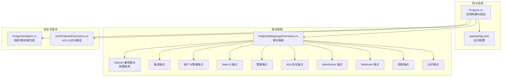
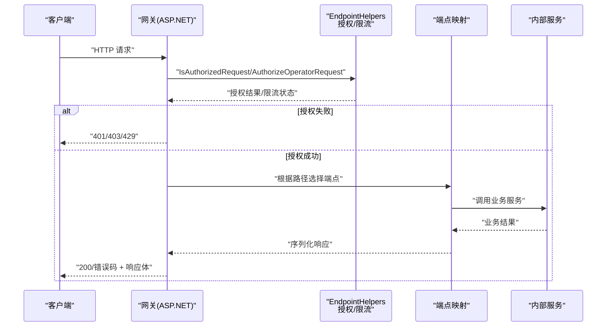
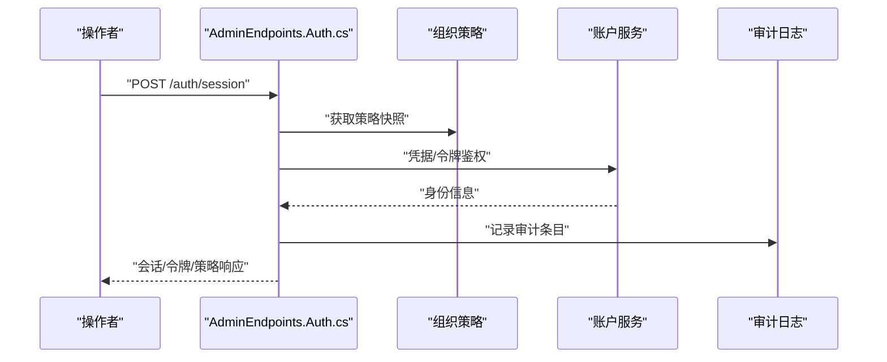
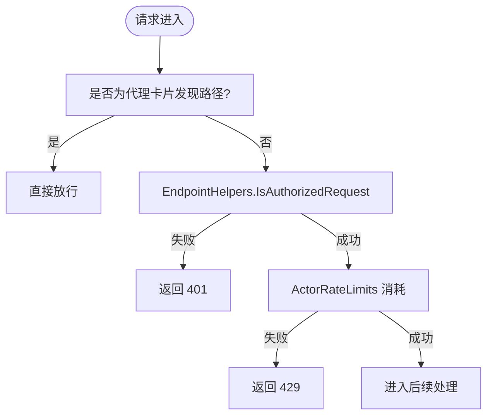
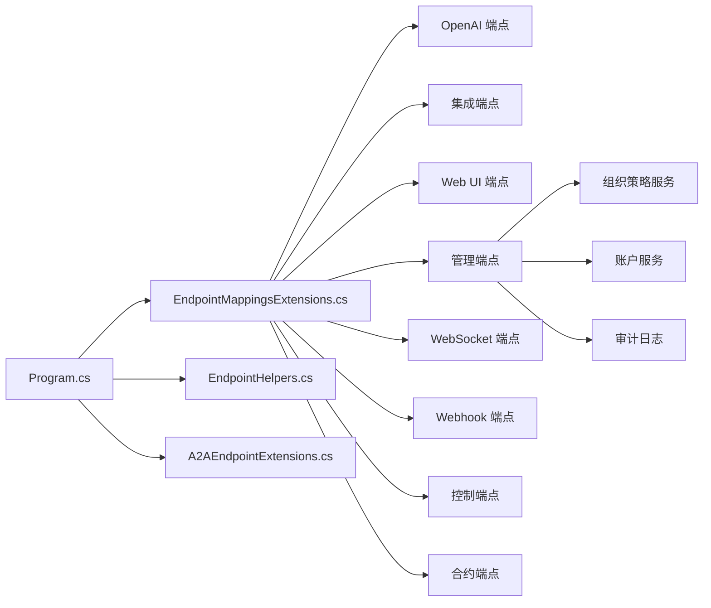

# 端点路由和API

<cite>
**本文引用的文件**
- [Program.cs](file://src/OpenClaw.Gateway/Program.cs)
- [appsettings.json](file://src/OpenClaw.Gateway/appsettings.json)
- [EndpointMappingsExtensions.cs](file://src/OpenClaw.Gateway/Endpoints/EndpointMappingsExtensions.cs)
- [A2AEndpointExtensions.cs](file://src/OpenClaw.Gateway/A2A/A2AEndpointExtensions.cs)
- [AdminEndpoints.Auth.cs](file://src/OpenClaw.Gateway/Endpoints/AdminEndpoints.Auth.cs)
- [EndpointHelpers.cs](file://src/OpenClaw.Gateway/Endpoints/EndpointHelpers.cs)
- [GatewayEndpointResolver.cs](file://src/OpenClaw.Client/GatewayEndpointResolver.cs)
</cite>

## 目录
1. [简介](#简介)
2. [项目结构](#项目结构)
3. [核心组件](#核心组件)
4. [架构总览](#架构总览)
5. [详细组件分析](#详细组件分析)
6. [依赖关系分析](#依赖关系分析)
7. [性能考虑](#性能考虑)
8. [故障排查指南](#故障排查指南)
9. [结论](#结论)
10. [附录：API参考与集成指南](#附录api参考与集成指南)

## 简介
本文件面向网关端点路由与API模块，系统性阐述OpenAI兼容接口、WebSocket实时通信、Webhook回调等接入方式的路由规则与请求处理逻辑；同时覆盖HTTP端点的请求/响应格式、参数校验与错误处理机制，并给出API版本管理、向后兼容性与迁移策略建议。文档还解释端点与内部服务的交互模式与数据流转，提供完整的API参考、使用示例与集成指南。

## 项目结构
OpenClaw 网关通过 ASP.NET Core 构建，入口在 Program.cs 中完成服务注册、中间件与端点映射。端点按功能域拆分到多个文件，统一由 EndpointMappingsExtensions.cs 聚合映射。A2A（Agent-to-Agent）协议端点独立扩展，认证与速率限制在 A2AEndpointExtensions.cs 中实现。管理员端点（AdminEndpoints.*.cs）集中于权限控制、会话管理与组织策略维护。

图表来源
- [Program.cs:1-124](file://src/OpenClaw.Gateway/Program.cs#L1-L124)
- [EndpointMappingsExtensions.cs:1-26](file://src/OpenClaw.Gateway/Endpoints/EndpointMappingsExtensions.cs#L1-L26)
- [A2AEndpointExtensions.cs:1-190](file://src/OpenClaw.Gateway/A2A/A2AEndpointExtensions.cs#L1-L190)
- [EndpointHelpers.cs:1-366](file://src/OpenClaw.Gateway/Endpoints/EndpointHelpers.cs#L1-L366)

章节来源
- [Program.cs:1-124](file://src/OpenClaw.Gateway/Program.cs#L1-L124)
- [EndpointMappingsExtensions.cs:1-26](file://src/OpenClaw.Gateway/Endpoints/EndpointMappingsExtensions.cs#L1-L26)

## 核心组件
- 应用入口与生命周期
  - 使用 Slim 构建器加载配置，注册可观测性、核心服务、通道、工具、后端、安全、MCP、运行时配置文件与 A2A/MCP 管道，随后映射 OpenAPI、端点与 MCP/A2A 路由并启动监听。
- 端点聚合映射
  - 将诊断、OpenAI 兼容、集成、账户与策略、Web UI、管理、后端、控制、WebSocket、Webhook、合约等端点统一映射。
- 安全与限流
  - 提供通用授权辅助（支持浏览器会话、账户令牌、引导令牌）、IP/令牌/操作员账户多维限流键生成、角色与端点作用域匹配。
- A2A 协议
  - 支持 HTTP JSON 与 JSON-RPC 双栈，自动发现代理卡片（.well-known），内置认证与速率限制中间件。

章节来源
- [Program.cs:47-96](file://src/OpenClaw.Gateway/Program.cs#L47-L96)
- [EndpointMappingsExtensions.cs:8-25](file://src/OpenClaw.Gateway/Endpoints/EndpointMappingsExtensions.cs#L8-L25)
- [EndpointHelpers.cs:35-45](file://src/OpenClaw.Gateway/Endpoints/EndpointHelpers.cs#L35-L45)
- [A2AEndpointExtensions.cs:20-48](file://src/OpenClaw.Gateway/A2A/A2AEndpointExtensions.cs#L20-L48)

## 架构总览
下图展示从客户端请求到内部服务的典型调用链：请求进入 ASP.NET Core 管道，经认证与限流检查后，根据路径映射到具体端点；端点再委托给内部服务执行业务逻辑并返回结果。

图表来源
- [EndpointHelpers.cs:35-131](file://src/OpenClaw.Gateway/Endpoints/EndpointHelpers.cs#L35-L131)
- [EndpointMappingsExtensions.cs:8-25](file://src/OpenClaw.Gateway/Endpoints/EndpointMappingsExtensions.cs#L8-L25)

## 详细组件分析

### OpenAI 兼容接口
- 设计原则
  - 采用标准 OpenAI 路径风格，便于现有 SDK 无缝对接；按需启用，避免暴露不必要的路由。
  - 流式与非流式响应均支持，结合内部执行服务与会话管理。
- 路由规则
  - 通过 EndpointMappingsExtensions.cs 聚合映射，实际实现位于对应文件中（例如聊天补全、稳定会话等）。
- 请求/响应与参数校验
  - 请求体读取与大小限制在通用辅助中实现；响应体遵循 OpenAI 规范或内部上下文模型。
  - 参数校验与错误处理在各端点内完成，统一返回标准化错误响应。
- 错误处理
  - 针对无效参数、配额不足、上游超时等场景返回明确状态码与消息。

章节来源
- [EndpointMappingsExtensions.cs:14-14](file://src/OpenClaw.Gateway/Endpoints/EndpointMappingsExtensions.cs#L14-L14)

### WebSocket 实时通信
- 设计原则
  - 为长连接场景提供低延迟双向通信能力，支持消息节流与连接数限制。
- 路由规则
  - 通过 EndpointMappingsExtensions.cs 映射 WebSocket 端点，路径通常以 /ws 结尾。
- 连接管理
  - 通过配置项限制最大消息字节数、并发连接数、每IP连接数、每连接每分钟消息数与接收超时。
- 数据流转
  - 客户端发送消息 → 网关解析 → 内部服务执行 → 返回消息/事件 → 客户端消费。

章节来源
- [EndpointMappingsExtensions.cs:22-22](file://src/OpenClaw.Gateway/Endpoints/EndpointMappingsExtensions.cs#L22-L22)
- [appsettings.json:103-109](file://src/OpenClaw.Gateway/appsettings.json#L103-L109)

### Webhook 回调
- 设计原则
  - 用于第三方平台推送事件（如短信、电报、WhatsApp、Teams、Slack、Discord 等），统一入口进行签名验证与内容解析。
- 路由规则
  - 各渠道在配置中定义 Webhook 路径前缀，网关据此映射到对应处理器。
- 安全与限流
  - 支持可选签名验证与请求体大小限制；结合全局限流策略防止滥用。
- 数据流转
  - 平台发送 Webhook → 网关校验与解析 → 内部适配器转换为统一消息 → 分发至工作线程/管道 → 执行相应动作。

章节来源
- [EndpointMappingsExtensions.cs:23-23](file://src/OpenClaw.Gateway/Endpoints/EndpointMappingsExtensions.cs#L23-L23)
- [appsettings.json:362-532](file://src/OpenClaw.Gateway/appsettings.json#L362-L532)

### 管理员端点（Admin）
- 会话与认证
  - 提供浏览器会话登录/登出、账户令牌交换、账户 CRUD、组织策略查询与更新等。
- 权限与审计
  - 基于端点作用域的角色控制（Viewer/Operator/Admin），统一审计记录。
- 请求/响应与错误处理
  - 统一使用 JSON 上下文序列化；错误返回标准化结构与状态码。

图表来源
- [AdminEndpoints.Auth.cs:51-124](file://src/OpenClaw.Gateway/Endpoints/AdminEndpoints.Auth.cs#L51-L124)
- [AdminEndpoints.Auth.cs:358-396](file://src/OpenClaw.Gateway/Endpoints/AdminEndpoints.Auth.cs#L358-L396)

章节来源
- [AdminEndpoints.Auth.cs:30-399](file://src/OpenClaw.Gateway/Endpoints/AdminEndpoints.Auth.cs#L30-L399)

### A2A（Agent-to-Agent）协议
- 设计原则
  - 提供 HTTP JSON 与 JSON-RPC 双栈，支持标准代理卡片发现（/.well-known/agent-card.json 与路径前缀下的兼容路径）。
- 路由规则
  - 路径前缀可配置，默认 /a2a；JSON-RPC 路径为 {prefix}/rpc。
- 认证与限流
  - 非发现路径需要授权与速率限制；发现路径开放访问。
- 公共基础 URL 解析
  - 支持配置公共基础 URL 或基于请求推导，确保卡片中引用的端点可达。

图表来源
- [A2AEndpointExtensions.cs:61-89](file://src/OpenClaw.Gateway/A2A/A2AEndpointExtensions.cs#L61-L89)
- [EndpointHelpers.cs:35-45](file://src/OpenClaw.Gateway/Endpoints/EndpointHelpers.cs#L35-L45)

章节来源
- [A2AEndpointExtensions.cs:20-48](file://src/OpenClaw.Gateway/A2A/A2AEndpointExtensions.cs#L20-L48)
- [A2AEndpointExtensions.cs:106-125](file://src/OpenClaw.Gateway/A2A/A2AEndpointExtensions.cs#L106-L125)

### 安全与限流（EndpointHelpers）
- 授权策略
  - 支持浏览器会话、账户令牌、引导令牌与环回开放模式；非环回绑定时需携带有效令牌。
- 角色与端点作用域
  - 端点作用域映射到 Viewer/Operator/Admin，统一校验。
- 速率限制键
  - 支持基于令牌、IP、操作员账户与浏览器会话的多维限流键生成。
- 请求体读取
  - 提供受控的最大请求体大小读取，避免内存压力。

章节来源
- [EndpointHelpers.cs:47-131](file://src/OpenClaw.Gateway/Endpoints/EndpointHelpers.cs#L47-L131)
- [EndpointHelpers.cs:180-240](file://src/OpenClaw.Gateway/Endpoints/EndpointHelpers.cs#L180-L240)
- [EndpointHelpers.cs:309-332](file://src/OpenClaw.Gateway/Endpoints/EndpointHelpers.cs#L309-L332)

## 依赖关系分析
- 程序入口依赖端点映射扩展与安全/限流辅助，最终构建并运行 Web 应用。
- 管理端点依赖组织策略服务、账户服务与审计日志。
- A2A 端点依赖 A2A 扩展与安全辅助，结合运行时速率限制服务。

图表来源
- [Program.cs:80-96](file://src/OpenClaw.Gateway/Program.cs#L80-L96)
- [EndpointMappingsExtensions.cs:8-25](file://src/OpenClaw.Gateway/Endpoints/EndpointMappingsExtensions.cs#L8-L25)
- [AdminEndpoints.Auth.cs:30-399](file://src/OpenClaw.Gateway/Endpoints/AdminEndpoints.Auth.cs#L30-L399)

章节来源
- [Program.cs:80-96](file://src/OpenClaw.Gateway/Program.cs#L80-L96)
- [EndpointMappingsExtensions.cs:8-25](file://src/OpenClaw.Gateway/Endpoints/EndpointMappingsExtensions.cs#L8-L25)

## 性能考虑
- 连接与消息限制
  - 通过配置项限制 WebSocket 最大消息字节数、并发连接数、每IP连接数与消息速率，避免资源耗尽。
- 速率限制
  - 多维限流键（令牌/IP/操作员账户/浏览器会话）降低热点攻击与滥用风险。
- 请求体大小控制
  - 在读取请求体前设置最大大小，防止异常流量导致内存压力。
- 缓存与预热
  - 配置中提供提示缓存选项，可按需开启以提升重复对话性能。

章节来源
- [appsettings.json:103-109](file://src/OpenClaw.Gateway/appsettings.json#L103-L109)
- [EndpointHelpers.cs:133-143](file://src/OpenClaw.Gateway/Endpoints/EndpointHelpers.cs#L133-L143)
- [appsettings.json:35-43](file://src/OpenClaw.Gateway/appsettings.json#L35-L43)

## 故障排查指南
- 401 未授权
  - 非环回绑定且缺少有效令牌；确认配置中的 AuthToken 设置与请求头/查询字符串携带方式。
- 403 禁止访问
  - 角色不足或端点作用域不匹配；检查组织策略与端点作用域映射。
- 429 请求过快
  - 速率限制触发；检查令牌/IP/操作员账户维度的限流策略。
- WebSocket 连接被拒
  - 检查连接数、消息速率与消息大小限制；确认客户端与服务端握手路径一致。
- Webhook 校验失败
  - 根据渠道配置核对签名密钥与验证开关；确保请求体大小未超过限制。

章节来源
- [EndpointHelpers.cs:215-237](file://src/OpenClaw.Gateway/Endpoints/EndpointHelpers.cs#L215-L237)
- [appsettings.json:362-532](file://src/OpenClaw.Gateway/appsettings.json#L362-L532)

## 结论
本文件梳理了网关端点路由与API模块的整体设计与实现要点，明确了 OpenAI 兼容接口、WebSocket、Webhook、A2A 等接入方式的路由规则与请求处理流程，并给出了安全、限流与性能优化建议。通过统一的端点映射与通用辅助，系统实现了高内聚、低耦合的路由层，便于后续扩展与维护。

## 附录：API参考与集成指南

### API 版本管理、兼容性与迁移
- 版本策略
  - A2A 提供路径前缀与 JSON-RPC 兼容路径，便于平滑演进；代理卡片支持标准与兼容两种发现路径。
- 向后兼容
  - 保留兼容路径与发现位置，避免破坏既有集成；逐步引导客户端迁移到新路径。
- 迁移步骤
  - 1) 在配置中启用新路径并保持旧路径可用；2) 通知客户端切换；3) 逐步关闭旧路径；4) 发布变更日志与升级指引。

章节来源
- [A2AEndpointExtensions.cs:36-47](file://src/OpenClaw.Gateway/A2A/A2AEndpointExtensions.cs#L36-L47)
- [A2AEndpointExtensions.cs:127-131](file://src/OpenClaw.Gateway/A2A/A2AEndpointExtensions.cs#L127-L131)

### HTTP 端点清单与请求/响应要点
- OpenAI 兼容端点
  - 路由：按需启用；请求体读取受控；响应遵循 OpenAI 规范或内部上下文模型。
  - 错误：参数错误、配额不足、上游超时等返回标准化错误结构。
- 管理端点（Admin）
  - 会话：/auth/session（GET/POST/DELETE）
  - 账户：/admin/operator-accounts（GET/POST/PUT/DELETE）
  - 账户令牌：/admin/operator-accounts/{id}/tokens（POST/DELETE）
  - 组织策略：/admin/organization-policy（GET/PUT）
  - 权限：端点作用域驱动的角色控制；审计日志记录关键操作。
- WebSocket 端点
  - 路由：/ws（或自定义路径）；受连接数、消息速率与消息大小限制。
- Webhook 端点
  - 路由：各渠道在配置中定义；支持签名验证与请求体大小限制。
- A2A 端点
  - 路由：/a2a（可配置前缀）；JSON-RPC 路径为 /a2a/rpc；代理卡片发现路径为 /.well-known/agent-card.json 与兼容路径。

章节来源
- [EndpointMappingsExtensions.cs:14-23](file://src/OpenClaw.Gateway/Endpoints/EndpointMappingsExtensions.cs#L14-L23)
- [AdminEndpoints.Auth.cs:40-190](file://src/OpenClaw.Gateway/Endpoints/AdminEndpoints.Auth.cs#L40-L190)
- [A2AEndpointExtensions.cs:20-48](file://src/OpenClaw.Gateway/A2A/A2AEndpointExtensions.cs#L20-L48)

### 集成示例与最佳实践
- HTTP 基础 URL 解析
  - 客户端可通过 GatewayEndpointResolver 将 ws/wss 转换为 http/https 的基础 URL，确保与网关监听地址一致。
- WebSocket 客户端
  - 使用 /ws 路径建立连接；注意消息大小与速率限制；对异常断开进行重连与状态恢复。
- Webhook 集成
  - 在第三方平台配置回调 URL 与签名密钥；确保请求体大小不超过网关限制；对重复事件进行去重处理。
- A2A 集成
  - 优先使用 HTTP JSON；必要时回落到 JSON-RPC；通过代理卡片发现端点；严格遵守速率限制。

章节来源
- [GatewayEndpointResolver.cs:5-37](file://src/OpenClaw.Client/GatewayEndpointResolver.cs#L5-L37)