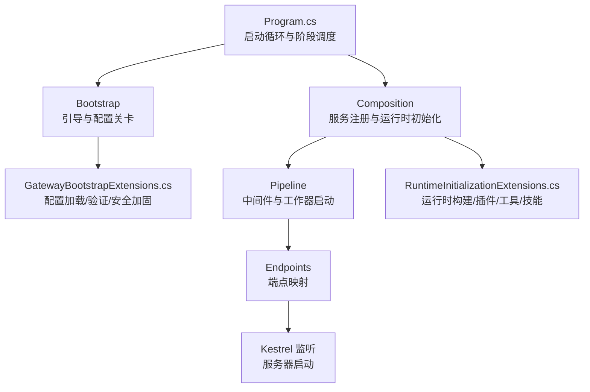
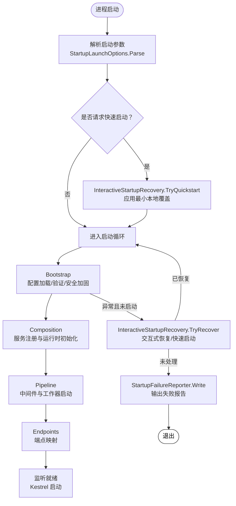
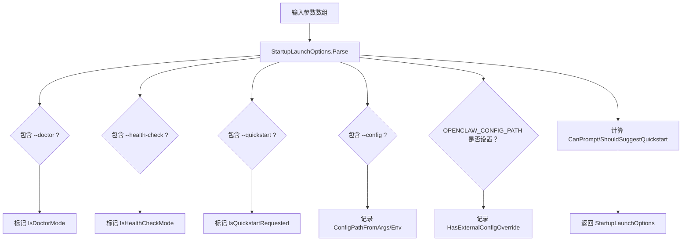
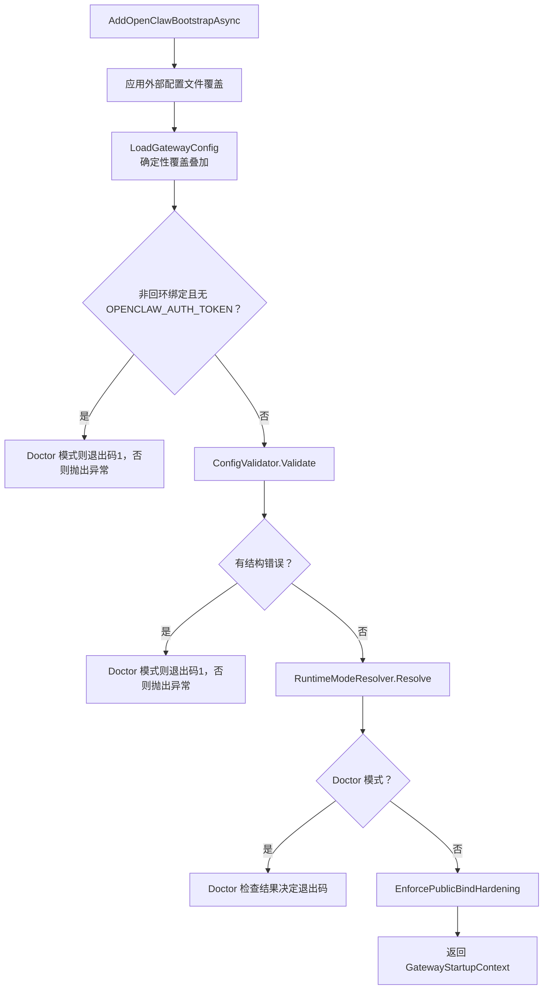
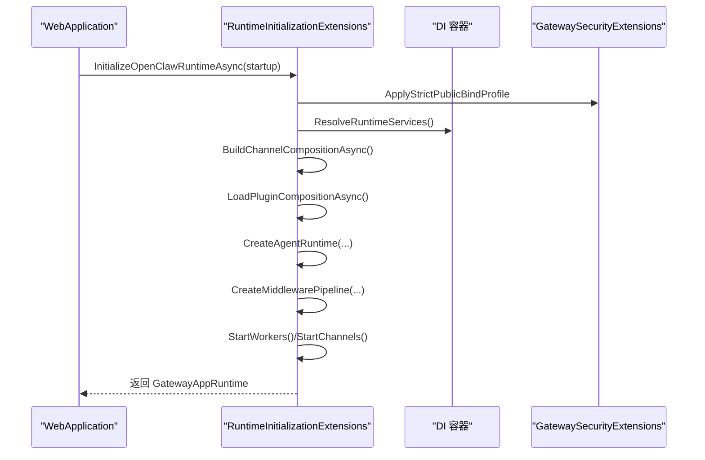
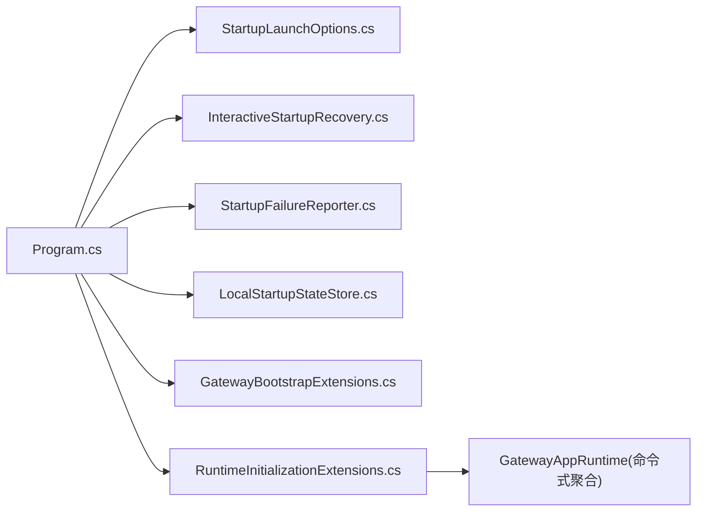
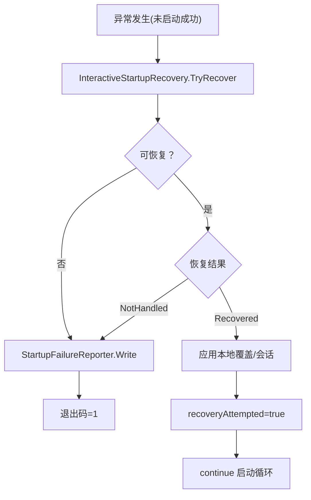
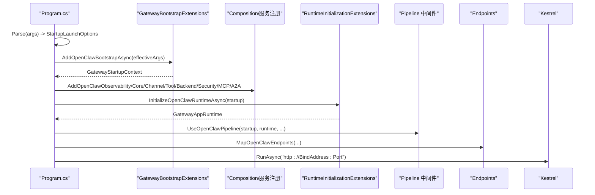

# 网关启动流程

<cite>
**本文引用的文件**
- [Program.cs](file://src/OpenClaw.Gateway/Program.cs)
- [openclaw-gateway-startup-layers.md](file://docs/openclaw-gateway-startup-layers.md)
- [GatewayBootstrapExtensions.cs](file://src/OpenClaw.Gateway/Bootstrap/GatewayBootstrapExtensions.cs)
- [StartupLaunchOptions.cs](file://src/OpenClaw.Gateway/Bootstrap/StartupLaunchOptions.cs)
- [InteractiveStartupRecovery.cs](file://src/OpenClaw.Gateway/Bootstrap/InteractiveStartupRecovery.cs)
- [LocalStartupStateStore.cs](file://src/OpenClaw.Gateway/Bootstrap/LocalStartupStateStore.cs)
- [StartupFailureReporter.cs](file://src/OpenClaw.Gateway/Bootstrap/StartupFailureReporter.cs)
- [RuntimeInitializationExtensions.cs](file://src/OpenClaw.Gateway/Composition/RuntimeInitializationExtensions.cs)
</cite>

## 目录
1. [简介](#简介)
2. [项目结构](#项目结构)
3. [核心组件](#核心组件)
4. [架构总览](#架构总览)
5. [详细组件分析](#详细组件分析)
6. [依赖关系分析](#依赖关系分析)
7. [性能考量](#性能考量)
8. [故障排查指南](#故障排查指南)
9. [结论](#结论)
10. [附录](#附录)

## 简介
本文件面向网关启动流程的技术文档，聚焦三层启动架构：Bootstrap（引导）、Composition（组合）、Pipeline（管道）。文档系统性阐述启动参数解析、配置加载、服务注册、运行时初始化、中间件与工作器启动、端点映射、服务器监听等关键步骤；同时覆盖启动失败恢复机制、快速启动模式、交互式故障排除、启动状态管理、会话持久化与重启策略，并提供启动流程图、错误处理策略与调试技巧，以及实际启动配置示例与常见问题解决方案。

## 项目结构
- 网关入口位于 Program.cs，负责启动循环、阶段调度与异常恢复。
- 启动层文档 openclaw-gateway-startup-layers.md 提供五层启动模型的权威说明（引导、服务注册、运行时初始化、中间件与工作器、端点映射、监听）。
- 引导层实现集中在 Bootstrap 子目录，包括配置加载、预检验证、安全加固与诊断模式。
- 组合层实现集中在 Composition 子目录，负责服务注册、运行时构建与初始化。
- 运行时初始化扩展 RuntimeInitializationExtensions.cs 是组合层的核心，完成通道组合、插件加载、Agent 运行时构建、工具解析、技能加载、中间件管线与集成服务启动等。

**图表来源**
- [Program.cs:47-98](file://src/OpenClaw.Gateway/Program.cs#L47-L98)
- [openclaw-gateway-startup-layers.md:25-242](file://docs/openclaw-gateway-startup-layers.md#L25-L242)

**章节来源**
- [Program.cs:14-124](file://src/OpenClaw.Gateway/Program.cs#L14-L124)
- [openclaw-gateway-startup-layers.md:1-271](file://docs/openclaw-gateway-startup-layers.md#L1-L271)

## 核心组件
- 启动参数解析与模式判定：StartupLaunchOptions 负责解析 --doctor、--health-check、--quickstart、--config 等参数，计算是否可交互提示与建议快速启动。
- 引导层：GatewayBootstrapExtensions 执行配置加载、预检验证（鉴权、配置结构、运行时模式）、安全加固与诊断模式分支。
- 运行时初始化：RuntimeInitializationExtensions 负责通道组合、插件加载、Agent 运行时构建、工具解析、技能加载、中间件管线与集成服务启动。
- 交互式恢复：InteractiveStartupRecovery 提供快速启动与交互式恢复，支持端口冲突、认证令牌缺失、存储权限等问题的本地覆盖与重试。
- 启动失败报告：StartupFailureReporter 分析异常类型，输出结构化报告与修复建议。
- 本地启动状态：LocalStartupStateStore 提供本地启动状态的原子读写，支撑快速启动与恢复会话持久化。

**章节来源**
- [StartupLaunchOptions.cs:57-122](file://src/OpenClaw.Gateway/Bootstrap/StartupLaunchOptions.cs#L57-L122)
- [GatewayBootstrapExtensions.cs:18-135](file://src/OpenClaw.Gateway/Bootstrap/GatewayBootstrapExtensions.cs#L18-L135)
- [RuntimeInitializationExtensions.cs:35-242](file://src/OpenClaw.Gateway/Composition/RuntimeInitializationExtensions.cs#L35-L242)
- [InteractiveStartupRecovery.cs:17-150](file://src/OpenClaw.Gateway/Bootstrap/InteractiveStartupRecovery.cs#L17-L150)
- [StartupFailureReporter.cs:20-332](file://src/OpenClaw.Gateway/Bootstrap/StartupFailureReporter.cs#L20-L332)
- [LocalStartupStateStore.cs:5-27](file://src/OpenClaw.Gateway/Bootstrap/LocalStartupStateStore.cs#L5-L27)

## 架构总览
三层启动架构与五层启动模型的关系如下：

**图表来源**
- [Program.cs:42-124](file://src/OpenClaw.Gateway/Program.cs#L42-L124)
- [StartupLaunchOptions.cs:57-88](file://src/OpenClaw.Gateway/Bootstrap/StartupLaunchOptions.cs#L57-L88)
- [InteractiveStartupRecovery.cs:72-150](file://src/OpenClaw.Gateway/Bootstrap/InteractiveStartupRecovery.cs#L72-L150)
- [StartupFailureReporter.cs:7-18](file://src/OpenClaw.Gateway/Bootstrap/StartupFailureReporter.cs#L7-L18)

## 详细组件分析

### 启动参数解析与模式判定
- 参数解析：识别 --doctor、--health-check、--quickstart、--config，计算是否可提示与建议快速启动。
- 快速启动校验：禁止与 --doctor/--health-check/--config/环境变量 OPENCLAW_CONFIG_PATH 同时使用，要求交互终端。
- 有效参数集：移除 --quickstart 后用于后续引导层，保留原始参数用于诊断模式。

**图表来源**
- [StartupLaunchOptions.cs:57-71](file://src/OpenClaw.Gateway/Bootstrap/StartupLaunchOptions.cs#L57-L71)

**章节来源**
- [StartupLaunchOptions.cs:5-122](file://src/OpenClaw.Gateway/Bootstrap/StartupLaunchOptions.cs#L5-L122)

### 引导层：配置加载、预检验证与安全加固
- 配置加载顺序：appsettings -> --config/OPENCLAW_CONFIG_PATH -> OpenClaw 节点 -> 工具根覆盖 -> 插件管理设置 -> 环境覆盖 -> 执行兼容性 -> 编码后端路径规范化。
- 预检验证三关：鉴权关卡（非回环绑定需 OPENCLAW_AUTH_TOKEN）、配置验证关卡（ConfigValidator）、运行时模式关卡（RuntimeModeResolver）。
- 安全加固：对非回环绑定执行危险配置扫描（通配符工具根、第三方插件桥接、WhatsApp 签名验证、原始密钥引用），需要显式选择加入。
- 诊断模式：--health-check 对 127.0.0.1:port/health 发起同步请求；--doctor 运行 DoctorCheck.RunAsync。

**图表来源**
- [GatewayBootstrapExtensions.cs:18-135](file://src/OpenClaw.Gateway/Bootstrap/GatewayBootstrapExtensions.cs#L18-L135)

**章节来源**
- [GatewayBootstrapExtensions.cs:143-421](file://src/OpenClaw.Gateway/Bootstrap/GatewayBootstrapExtensions.cs#L143-L421)
- [openclaw-gateway-startup-layers.md:25-74](file://docs/openclaw-gateway-startup-layers.md#L25-L74)

### 组合层：服务注册与运行时初始化
- 服务注册顺序（关键依赖链）：遥测优先（AddOpenClawObservability）-> 核心服务（AddOpenClawCoreServices）-> 通道/工具/后端/安全 -> MCP/A2A -> 运行时配置文件选择（ApplyOpenClawRuntimeProfile）。
- 运行时初始化 InitializeOpenClawRuntimeAsync：
  - 通道组合 BuildChannelCompositionAsync（WebSocket 基础，条件注册 Twilio/社交通道，特殊处理 WhatsApp）。
  - 插件组合 LoadPluginCompositionAsync（桥接插件与原生动态插件，重复检测记录兼容性而非致命错误）。
  - Agent 运行时工厂选择与构建，工具解析与偏好（内置工具 + 原生插件 + 桥接插件），技能加载与热重载支持。
  - 中间件管线与后台工作器启动，优雅关闭注册。
  - 集成服务：Tailscale、mDNS。

**图表来源**
- [RuntimeInitializationExtensions.cs:35-242](file://src/OpenClaw.Gateway/Composition/RuntimeInitializationExtensions.cs#L35-L242)

**章节来源**
- [openclaw-gateway-startup-layers.md:77-175](file://docs/openclaw-gateway-startup-layers.md#L77-L175)
- [RuntimeInitializationExtensions.cs:35-242](file://src/OpenClaw.Gateway/Composition/RuntimeInitializationExtensions.cs#L35-L242)

### 管道层：中间件与工作器启动
- 中间件栈：转发头、CORS、静态文件、WebSockets。
- 后台工作器：根据 CPU 核数限制在 1-4 之间。
- 通道生命周期：遍历 IChannelAdapter，连接 OnMessageReceived 事件至入站写入器并在后台启动。
- 优雅关闭：轮询会话锁、释放插件主机、取消注册动态 LLM 提供程序、清理原生插件注册表与技能监视器。

**章节来源**
- [openclaw-gateway-startup-layers.md:177-208](file://docs/openclaw-gateway-startup-layers.md#L177-L208)

### 端点映射层
- 顺序映射：健康/信息/指标、OpenAI 兼容端点、外部集成钩子、管理 UI/SaaS 回退、管理 API、控制端点、WebSocket、各渠道 Webhook、MCP 端点。

**章节来源**
- [openclaw-gateway-startup-layers.md:210-226](file://docs/openclaw-gateway-startup-layers.md#L210-L226)

### 监听层与启动横幅
- 最终调用 app.Run($"http://{startup.Config.BindAddress}:{startup.Config.Port}") 启动 Kestrel。
- 启动横幅记录 WebSocket URL、模型名称、运行时模式与 NativeAOT 状态。

**章节来源**
- [openclaw-gateway-startup-layers.md:228-242](file://docs/openclaw-gateway-startup-layers.md#L228-L242)
- [Program.cs:96](file://src/OpenClaw.Gateway/Program.cs#L96)

## 依赖关系分析
- 入口依赖：Program.cs 依赖 StartupLaunchOptions、InteractiveStartupRecovery、StartupFailureReporter、LocalStartupStateStore。
- 引导层依赖：GatewayBootstrapExtensions 依赖配置验证、运行时模式解析、安全加固与诊断模式。
- 组合层依赖：RuntimeInitializationExtensions 依赖通道、插件、工具、技能、中间件、集成服务等模块。
- 运行时对象：GatewayAppRuntime 作为命令式聚合对象，不进入 DI 容器，通过参数传递给端点映射与中间件。

**图表来源**
- [Program.cs:14-124](file://src/OpenClaw.Gateway/Program.cs#L14-L124)
- [StartupLaunchOptions.cs:5-122](file://src/OpenClaw.Gateway/Bootstrap/StartupLaunchOptions.cs#L5-L122)
- [InteractiveStartupRecovery.cs:5-336](file://src/OpenClaw.Gateway/Bootstrap/InteractiveStartupRecovery.cs#L5-L336)
- [StartupFailureReporter.cs:5-332](file://src/OpenClaw.Gateway/Bootstrap/StartupFailureReporter.cs#L5-L332)
- [LocalStartupStateStore.cs:5-27](file://src/OpenClaw.Gateway/Bootstrap/LocalStartupStateStore.cs#L5-L27)
- [GatewayBootstrapExtensions.cs:16-135](file://src/OpenClaw.Gateway/Bootstrap/GatewayBootstrapExtensions.cs#L16-L135)
- [RuntimeInitializationExtensions.cs:33-242](file://src/OpenClaw.Gateway/Composition/RuntimeInitializationExtensions.cs#L33-L242)

**章节来源**
- [Program.cs:47-98](file://src/OpenClaw.Gateway/Program.cs#L47-L98)

## 性能考量
- 启动循环与异常恢复：仅在未启动成功时进入交互式恢复，避免重复昂贵的初始化。
- 服务注册顺序：遥测优先，确保后续注册均可被观测。
- 运行时模式：AOT/JIT 由运行时模式解析决定，影响配置文件与可用能力。
- 后台工作器数量限制：CPU 核数约束在 1-4，平衡吞吐与资源占用。
- 静态文件与 CORS：仅在开发/管理场景启用，生产环境建议通过前置代理处理。

[本节为通用指导，无需列出具体文件来源]

## 故障排查指南
- 启动失败恢复机制
  - 未启动成功捕获异常后，InteractiveStartupRecovery.TryRecover 评估可恢复性并提示交互式恢复。
  - 支持端口占用、认证令牌缺失、存储权限不足、提供商凭据/端点缺失等场景。
- 快速启动模式
  - --quickstart 在交互终端下应用最小本地覆盖（127.0.0.1、文件内存、可写工作区），不持久化，便于快速验证。
- 错误报告
  - StartupFailureReporter.Render 输出标题、摘要、详情与修复建议，区分认证、存储、提供商、端口占用与通用异常。
- 诊断模式
  - --health-check：对 127.0.0.1:port/health 发起同步请求，成功返回 0，失败返回 1。
  - --doctor：运行 DoctorCheck.RunAsync，执行配置、存储与连接探测。
- 重启策略
  - 启动循环在异常时尝试恢复；若恢复未处理，则输出报告并退出；可通过 --quickstart 或修正配置后重试。

**图表来源**
- [Program.cs:99-122](file://src/OpenClaw.Gateway/Program.cs#L99-L122)
- [InteractiveStartupRecovery.cs:72-150](file://src/OpenClaw.Gateway/Bootstrap/InteractiveStartupRecovery.cs#L72-L150)
- [StartupFailureReporter.cs:20-50](file://src/OpenClaw.Gateway/Bootstrap/StartupFailureReporter.cs#L20-L50)

**章节来源**
- [Program.cs:99-122](file://src/OpenClaw.Gateway/Program.cs#L99-L122)
- [InteractiveStartupRecovery.cs:72-336](file://src/OpenClaw.Gateway/Bootstrap/InteractiveStartupRecovery.cs#L72-L336)
- [StartupFailureReporter.cs:20-332](file://src/OpenClaw.Gateway/Bootstrap/StartupFailureReporter.cs#L20-L332)

## 结论
三层启动架构与五层启动模型共同确保了网关从“配置优先”到“监听就绪”的稳健路径。引导层负责强约束的配置与安全校验，组合层完成服务注册与运行时构建，管道层提供中间件与工作器，端点层映射路由，监听层对外提供服务。结合交互式恢复与诊断模式，系统在复杂环境中具备强大的自愈与可运维性。

[本节为总结性内容，无需列出具体文件来源]

## 附录

### 启动流程图（代码级）

**图表来源**
- [Program.cs:47-98](file://src/OpenClaw.Gateway/Program.cs#L47-L98)
- [GatewayBootstrapExtensions.cs:18-135](file://src/OpenClaw.Gateway/Bootstrap/GatewayBootstrapExtensions.cs#L18-L135)
- [RuntimeInitializationExtensions.cs:35-242](file://src/OpenClaw.Gateway/Composition/RuntimeInitializationExtensions.cs#L35-L242)

### 启动状态管理与会话持久化
- LocalStartupStateStore 提供本地启动状态的原子读写，支持快速启动与恢复会话持久化。
- InteractiveStartupRecovery 在交互式恢复时应用临时环境变量覆盖，实现本次启动的最小化本地配置。

**章节来源**
- [LocalStartupStateStore.cs:5-27](file://src/OpenClaw.Gateway/Bootstrap/LocalStartupStateStore.cs#L5-L27)
- [InteractiveStartupRecovery.cs:204-218](file://src/OpenClaw.Gateway/Bootstrap/InteractiveStartupRecovery.cs#L204-L218)

### 启动配置示例与常见问题
- 快速启动（本地验证）
  - 使用 --quickstart 在交互终端下自动应用 127.0.0.1、文件内存与可写工作区，适合首次体验。
- 诊断模式
  - --doctor：执行完整预检测试，定位配置、存储与连接问题。
  - --health-check：对 /health 发起同步请求，返回 0/1。
- 常见问题与修复
  - 非回环绑定缺少 OPENCLAW_AUTH_TOKEN：设置令牌或改为 127.0.0.1 绑定。
  - 存储路径不可写：设置可写目录并确保存在，必要时调整 SQLite 数据库路径与归档路径。
  - 提供商凭据/端点缺失：设置 MODEL_PROVIDER_KEY 或 MODEL_PROVIDER_ENDPOINT，或启用对应插件。
  - 端口占用：停止占用进程或修改 OpenClaw__Port。

**章节来源**
- [StartupFailureReporter.cs:82-233](file://src/OpenClaw.Gateway/Bootstrap/StartupFailureReporter.cs#L82-L233)
- [InteractiveStartupRecovery.cs:296-336](file://src/OpenClaw.Gateway/Bootstrap/InteractiveStartupRecovery.cs#L296-L336)