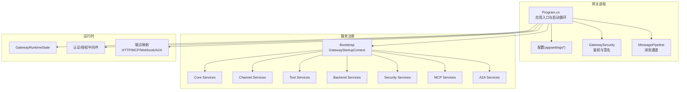
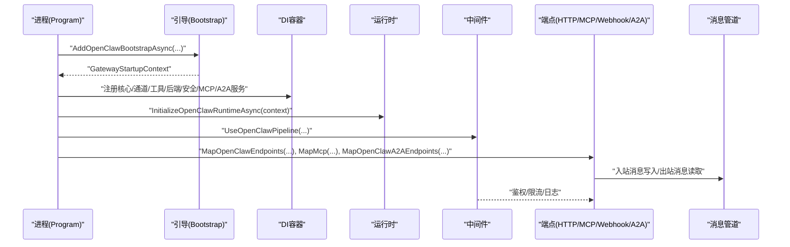
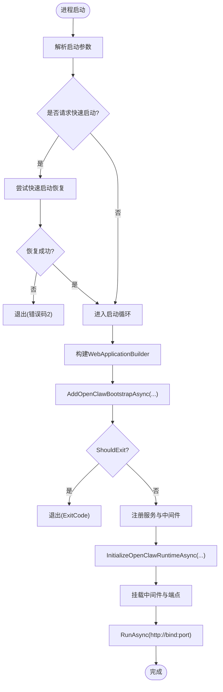
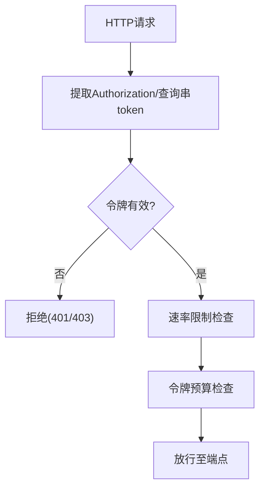
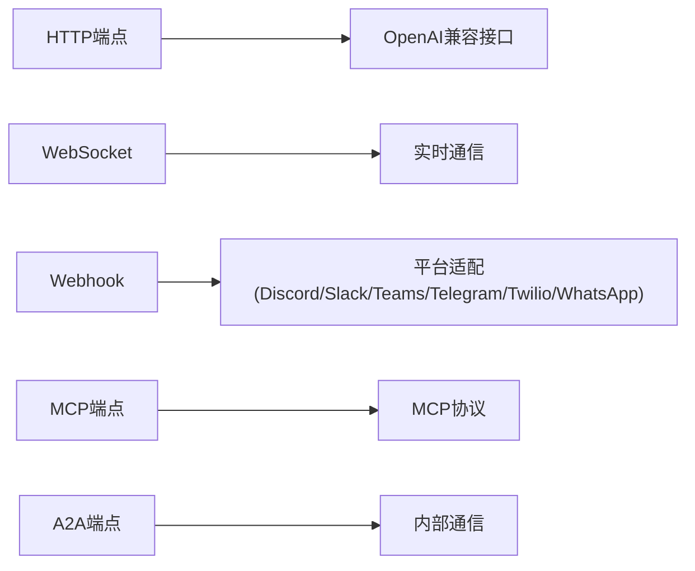
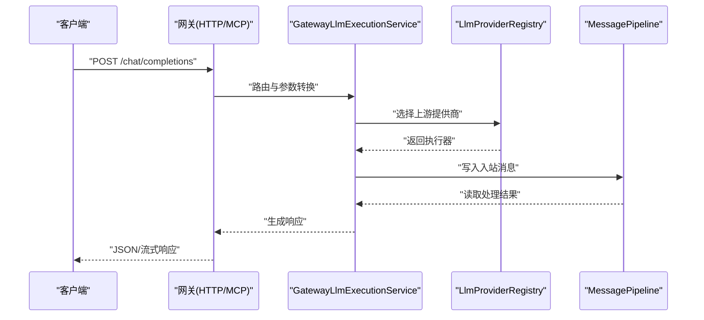
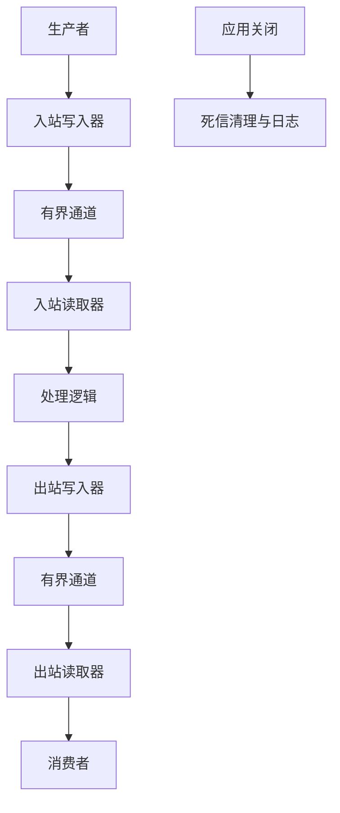
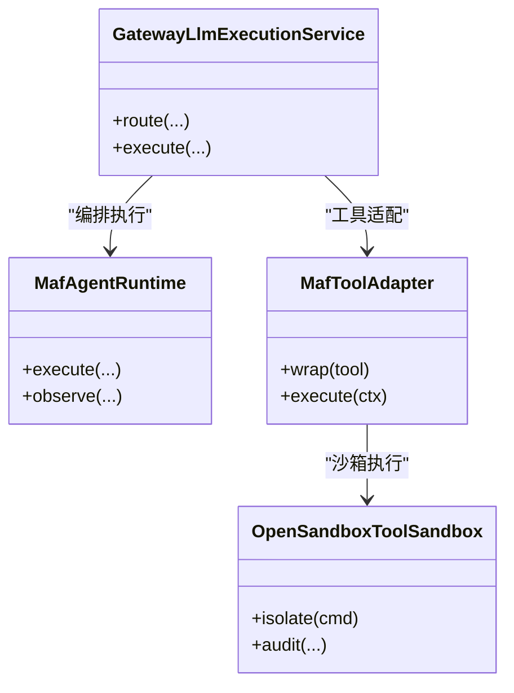
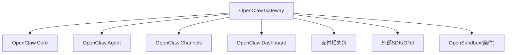

# 网关服务

<cite>
**本文引用的文件**
- [Program.cs](file://src/OpenClaw.Gateway/Program.cs)
- [OpenClaw.Gateway.csproj](file://src/OpenClaw.Gateway/OpenClaw.Gateway.csproj)
- [GatewayStartupContext.cs](file://src/OpenClaw.Gateway/Bootstrap/GatewayStartupContext.cs)
- [GatewaySecurity.cs](file://src/OpenClaw.Gateway/GatewaySecurity.cs)
- [MessagePipeline.cs](file://src/OpenClaw.Core/Pipeline/MessagePipeline.cs)
- [appsettings.json](file://src/OpenClaw.Gateway/appsettings.json)
- [appsettings.Production.json](file://src/OpenClaw.Gateway/appsettings.Production.json)
- [WebSocketChannel.cs](file://src/OpenClaw.Channels/WebSocketChannel.cs)
- [DiscordWebhookHandler.cs](file://src/OpenClaw.Gateway/DiscordWebhookHandler.cs)
- [SlackWebhookHandler.cs](file://src/OpenClaw.Gateway/SlackWebhookHandler.cs)
- [TeamsWebhookHandler.cs](file://src/OpenClaw.Gateway/TeamsWebhookHandler.cs)
- [TelegramWebhookHandler.cs](file://src/OpenClaw.Gateway/TelegramWebhookHandler.cs)
- [TwilioSmsWebhookHandler.cs](file://src/OpenClaw.Gateway/TwilioSmsWebhookHandler.cs)
- [WhatsAppWebhookHandler.cs](file://src/OpenClaw.Gateway/WhatsAppWebhookHandler.cs)
- [OpenAiModels.cs](file://src/OpenClaw.Core/Models/OpenAiModels.cs)
- [McpModels.cs](file://src/OpenClaw.Client/McpModels.cs)
- [McpJsonContext.cs](file://src/OpenClaw.Client/McpJsonContext.cs)
- [OpenClawHttpClient.cs](file://src/OpenClaw.Client/OpenClawHttpClient.cs)
- [OpenClawWebSocketClient.cs](file://src/OpenClaw.Client/OpenClawWebSocketClient.cs)
- [GatewayEndpointResolver.cs](file://src/OpenClaw.Client/GatewayEndpointResolver.cs)
- [GatewayLlmExecutionService.cs](file://src/OpenClaw.Gateway/GatewayLlmExecutionService.cs)
- [LlmProviderRegistry.cs](file://src/OpenClaw.Gateway/LlmProviderRegistry.cs)
- [ActorRateLimitService.cs](file://src/OpenClaw.Gateway/ActorRateLimitService.cs)
- [RateLimitMiddleware.cs](file://src/OpenClaw.Core/Middleware/RateLimitMiddleware.cs)
- [TokenBudgetMiddleware.cs](file://src/OpenClaw.Core/Middleware/TokenBudgetMiddleware.cs)
- [RuntimeMetrics.cs](file://src/OpenClaw.Core/Observability/RuntimeMetrics.cs)
- [Telemetry.cs](file://src/OpenClaw.Core/Observability/Telemetry.cs)
- [ProviderUsageTracker.cs](file://src/OpenClaw.Core/Observability/ProviderUsageTracker.cs)
- [ToolUsageTracker.cs](file://src/OpenClaw.Core/Observability/ToolUsageTracker.cs)
- [MafAgentRuntime.cs](file://src/OpenClaw.Agent/MafAgentRuntime.cs)
- [MafExecutionServiceChatClient.cs](file://src/OpenClaw.Agent/MafExecutionServiceChatClient.cs)
- [MafToolAdapter.cs](file://src/OpenClaw.Agent/MafToolAdapter.cs)
- [OpenSandboxToolSandbox.cs](file://src/OpenClawNet.Sandbox.OpenSandbox/OpenSandboxToolSandbox.cs)
- [OpenSandboxServiceCollectionExtensions.cs](file://src/OpenClawNet.Sandbox.OpenSandbox/OpenSandboxServiceCollectionExtensions.cs)
</cite>

## 目录
1. [简介](#简介)
2. [项目结构](#项目结构)
3. [核心组件](#核心组件)
4. [架构总览](#架构总览)
5. [详细组件分析](#详细组件分析)
6. [依赖分析](#依赖分析)
7. [性能考虑](#性能考虑)
8. [故障排查指南](#故障排查指南)
9. [结论](#结论)
10. [附录](#附录)

## 简介
本文件为“网关服务”模块的技术文档，聚焦于网关的启动流程、中间件管道、端点路由与安全策略，系统性阐述 HTTP、WebSocket、Webhook 等多种接入方式的实现细节，并文档化 OpenAI 兼容接口、实时通信协议、消息处理流水线等核心能力。同时覆盖配置选项、性能优化建议、监控指标与可观测性，以及与代理运行时、工具执行框架的集成协作机制。

## 项目结构
网关服务基于 ASP.NET Core 构建，采用模块化设计：启动引导（Bootstrap）、服务组合（Composition）、端点映射（Endpoints）、消息管道（Pipeline）、安全策略（Security）与 MCP/HTTP/Webhook 集成。项目通过扩展方法将核心服务、通道服务、工具服务、后端服务、安全服务与 MCP 服务注入到 DI 容器，并在运行时初始化与挂载。

图表来源
- [Program.cs:1-124](file://src/OpenClaw.Gateway/Program.cs#L1-L124)
- [GatewayStartupContext.cs:1-15](file://src/OpenClaw.Gateway/Bootstrap/GatewayStartupContext.cs#L1-L15)
- [MessagePipeline.cs:1-56](file://src/OpenClaw.Core/Pipeline/MessagePipeline.cs#L1-L56)
- [GatewaySecurity.cs:1-109](file://src/OpenClaw.Gateway/GatewaySecurity.cs#L1-L109)

章节来源
- [Program.cs:1-124](file://src/OpenClaw.Gateway/Program.cs#L1-L124)
- [OpenClaw.Gateway.csproj:1-143](file://src/OpenClaw.Gateway/OpenClaw.Gateway.csproj#L1-L143)

## 核心组件
- 启动与生命周期管理：Program 负责解析启动参数、加载配置、构建服务容器、初始化运行时、挂载中间件与端点，并进入监听循环；支持快速启动恢复与交互式启动修复。
- 运行时上下文：GatewayStartupContext 汇聚配置、运行时状态、绑定地址类型、工作空间路径与原生插件宿主等关键信息。
- 安全与鉴权：GatewaySecurity 提供 Bearer Token 解析、查询字符串令牌支持、固定时间比较的令牌校验、HMAC-SHA256 签名验证与十六进制解码辅助。
- 消息处理流水线：MessagePipeline 基于 System.Threading.Channels 的有界通道，提供入站/出站消息通道，具备背压与零分配特性，保障高吞吐下的稳定性。
- 中间件与限流：RateLimitMiddleware 与 TokenBudgetMiddleware 提供速率限制与令牌预算控制，保护下游资源。
- 观测性与指标：RuntimeMetrics、Telemetry、ProviderUsageTracker、ToolUsageTracker 提供运行时度量、遥测与使用统计。

章节来源
- [Program.cs:14-124](file://src/OpenClaw.Gateway/Program.cs#L14-L124)
- [GatewayStartupContext.cs:6-14](file://src/OpenClaw.Gateway/Bootstrap/GatewayStartupContext.cs#L6-L14)
- [GatewaySecurity.cs:8-109](file://src/OpenClaw.Gateway/GatewaySecurity.cs#L8-L109)
- [MessagePipeline.cs:11-56](file://src/OpenClaw.Core/Pipeline/MessagePipeline.cs#L11-L56)
- [RateLimitMiddleware.cs](file://src/OpenClaw.Core/Middleware/RateLimitMiddleware.cs)
- [TokenBudgetMiddleware.cs](file://src/OpenClaw.Core/Middleware/TokenBudgetMiddleware.cs)
- [RuntimeMetrics.cs](file://src/OpenClaw.Core/Observability/RuntimeMetrics.cs)
- [Telemetry.cs](file://src/OpenClaw.Core/Observability/Telemetry.cs)
- [ProviderUsageTracker.cs](file://src/OpenClaw.Core/Observability/ProviderUsageTracker.cs)
- [ToolUsageTracker.cs](file://src/OpenClaw.Core/Observability/ToolUsageTracker.cs)

## 架构总览
下图展示从进程启动到请求处理的关键路径：配置加载 → 服务注册 → 运行时初始化 → 中间件管道 → 端点映射 → 请求处理 → 工具执行与后端调用。

图表来源
- [Program.cs:53-93](file://src/OpenClaw.Gateway/Program.cs#L53-L93)
- [MessagePipeline.cs:17-33](file://src/OpenClaw.Core/Pipeline/MessagePipeline.cs#L17-L33)

## 详细组件分析

### 启动流程与恢复机制
- 启动参数解析与快速启动校验：对启动参数进行快速校验，若失败直接退出并返回相应错误码。
- 快速启动恢复：当请求快速启动时，尝试从本地状态恢复会话，成功则继续启动流程。
- 启动循环：在异常但未启动完成时，进入交互式启动恢复，根据结果决定是否重试或输出诊断信息。
- 配置摘要与阶段化输出：在每个阶段输出配置摘要与当前阶段信息，便于排障与可视化。

图表来源
- [Program.cs:14-124](file://src/OpenClaw.Gateway/Program.cs#L14-L124)

章节来源
- [Program.cs:22-124](file://src/OpenClaw.Gateway/Program.cs#L22-L124)

### 中间件管道与安全策略
- 认证与授权：通过 GatewaySecurity 提供的 Bearer Token 与可选查询串令牌解析，结合固定时间比较的令牌校验，降低时序攻击风险。
- 签名验证：支持 HMAC-SHA256 签名验证，自动去除前缀并进行十六进制解码，确保签名格式正确。
- 速率限制与令牌预算：通过 RateLimitMiddleware 与 TokenBudgetMiddleware 控制请求频率与令牌消耗，避免资源过载。
- 中间件挂载顺序：在运行时初始化后挂载，确保在端点映射之前生效。

图表来源
- [GatewaySecurity.cs:13-49](file://src/OpenClaw.Gateway/GatewaySecurity.cs#L13-L49)
- [RateLimitMiddleware.cs](file://src/OpenClaw.Core/Middleware/RateLimitMiddleware.cs)
- [TokenBudgetMiddleware.cs](file://src/OpenClaw.Core/Middleware/TokenBudgetMiddleware.cs)

章节来源
- [GatewaySecurity.cs:8-109](file://src/OpenClaw.Gateway/GatewaySecurity.cs#L8-L109)

### 端点路由与接入方式
- HTTP 端点：通过 MapOpenClawEndpoints 映射通用 HTTP 接口，支持 OpenAI 兼容模型调用与聊天补全等。
- WebSocket：通过 WebSocketChannel 提供实时双向通信，适用于长连接场景。
- Webhook：针对主流平台提供专用处理器，包括 Discord、Slack、Teams、Telegram、Twilio SMS、WhatsApp 等，统一签名与验证流程。
- MCP：通过 MapMcp 映射 Model Context Protocol 端点，支持 MCP 协议的客户端交互。
- A2A：通过 MapOpenClawA2AEndpoints 提供应用到应用的内部通信端点。

图表来源
- [Program.cs:91-93](file://src/OpenClaw.Gateway/Program.cs#L91-L93)
- [WebSocketChannel.cs](file://src/OpenClaw.Channels/WebSocketChannel.cs)
- [DiscordWebhookHandler.cs](file://src/OpenClaw.Gateway/DiscordWebhookHandler.cs)
- [SlackWebhookHandler.cs](file://src/OpenClaw.Gateway/SlackWebhookHandler.cs)
- [TeamsWebhookHandler.cs](file://src/OpenClaw.Gateway/TeamsWebhookHandler.cs)
- [TelegramWebhookHandler.cs](file://src/OpenClaw.Gateway/TelegramWebhookHandler.cs)
- [TwilioSmsWebhookHandler.cs](file://src/OpenClaw.Gateway/TwilioSmsWebhookHandler.cs)
- [WhatsAppWebhookHandler.cs](file://src/OpenClaw.Gateway/WhatsAppWebhookHandler.cs)

章节来源
- [Program.cs:89-93](file://src/OpenClaw.Gateway/Program.cs#L89-L93)

### OpenAI 兼容接口与实时通信
- OpenAI 兼容接口：通过 OpenAiModels 定义请求/响应结构，结合 GatewayLlmExecutionService 与 LlmProviderRegistry 实现多提供商路由与执行。
- 实时通信：WebSocketChannel 支持双向消息传递，配合消息管道实现高吞吐处理。
- 客户端对接：OpenClawHttpClient 与 OpenClawWebSocketClient 提供 HTTP 与 WebSocket 客户端封装，GatewayEndpointResolver 统一端点解析。

图表来源
- [OpenAiModels.cs](file://src/OpenClaw.Core/Models/OpenAiModels.cs)
- [GatewayLlmExecutionService.cs](file://src/OpenClaw.Gateway/GatewayLlmExecutionService.cs)
- [LlmProviderRegistry.cs](file://src/OpenClaw.Gateway/LlmProviderRegistry.cs)
- [MessagePipeline.cs:30-33](file://src/OpenClaw.Core/Pipeline/MessagePipeline.cs#L30-L33)

章节来源
- [OpenAiModels.cs](file://src/OpenClaw.Core/Models/OpenAiModels.cs)
- [GatewayLlmExecutionService.cs](file://src/OpenClaw.Gateway/GatewayLlmExecutionService.cs)
- [LlmProviderRegistry.cs](file://src/OpenClaw.Gateway/LlmProviderRegistry.cs)

### 消息处理流水线
- 设计目标：高吞吐、低延迟、零分配，通过有界通道与背压防止内存溢出。
- 关键特性：入站/出站双通道、单/多读写器配置、关闭时死信清理与警告日志。
- 使用模式：生产者写入入站消息，消费者从入站读取并处理，再写入出站通道供下游消费。

图表来源
- [MessagePipeline.cs:17-56](file://src/OpenClaw.Core/Pipeline/MessagePipeline.cs#L17-L56)

章节来源
- [MessagePipeline.cs:11-56](file://src/OpenClaw.Core/Pipeline/MessagePipeline.cs#L11-L56)

### 与代理运行时、工具执行框架的协作
- 代理运行时：MafAgentRuntime 提供代理执行环境，GatewayLlmExecutionService 与其协作完成推理与工具调用编排。
- 工具适配：MafToolAdapter 将工具封装为可执行单元，结合工具预设与治理策略，实现安全可控的工具调用。
- 沙箱集成：OpenSandboxToolSandbox 与 OpenSandboxServiceCollectionExtensions 提供受控执行环境，增强安全性与隔离性。

图表来源
- [MafAgentRuntime.cs](file://src/OpenClaw.Agent/MafAgentRuntime.cs)
- [MafExecutionServiceChatClient.cs](file://src/OpenClaw.Agent/MafExecutionServiceChatClient.cs)
- [MafToolAdapter.cs](file://src/OpenClaw.Agent/MafToolAdapter.cs)
- [OpenSandboxToolSandbox.cs](file://src/OpenClawNet.Sandbox.OpenSandbox/OpenSandboxToolSandbox.cs)
- [OpenSandboxServiceCollectionExtensions.cs](file://src/OpenClawNet.Sandbox.OpenSandbox/OpenSandboxServiceCollectionExtensions.cs)

章节来源
- [MafAgentRuntime.cs](file://src/OpenClaw.Agent/MafAgentRuntime.cs)
- [MafExecutionServiceChatClient.cs](file://src/OpenClaw.Agent/MafExecutionServiceChatClient.cs)
- [MafToolAdapter.cs](file://src/OpenClaw.Agent/MafToolAdapter.cs)
- [OpenSandboxToolSandbox.cs](file://src/OpenClawNet.Sandbox.OpenSandbox/OpenSandboxToolSandbox.cs)
- [OpenSandboxServiceCollectionExtensions.cs](file://src/OpenClawNet.Sandbox.OpenSandbox/OpenSandboxServiceCollectionExtensions.cs)

## 依赖分析
- 外部依赖：Microsoft.Agents.AI、ModelContextProtocol.AspNetCore、OpenTelemetry 生态、第三方大模型 SDK（如 Anthropic、GeminiDotnet.Extensions.AI）等。
- 内部依赖：OpenClaw.Core、OpenClaw.Agent、OpenClaw.Channels、OpenClaw.Dashboard、支付相关包与插件生态。
- 条件编译：根据开关启用 OpenSandbox 集成，影响运行时服务注册与功能可用性。

图表来源
- [OpenClaw.Gateway.csproj:26-47](file://src/OpenClaw.Gateway/OpenClaw.Gateway.csproj#L26-L47)
- [OpenClaw.Gateway.csproj:52-67](file://src/OpenClaw.Gateway/OpenClaw.Gateway.csproj#L52-L67)

章节来源
- [OpenClaw.Gateway.csproj:1-143](file://src/OpenClaw.Gateway/OpenClaw.Gateway.csproj#L1-L143)

## 性能考虑
- 消息通道：使用有界通道与 Wait 模式，避免内存暴涨；单/多读写器按需配置；关闭时清理死信并记录告警。
- 限流与预算：结合 ActorRateLimitService 与中间件，控制并发与令牌消耗，防止级联故障。
- 观测性：开启 OpenTelemetry 与自定义指标，采集运行时度量、提供方用量与工具使用情况，支撑容量规划与问题定位。
- 配置优化：生产环境配置与最小二进制发布策略，减少运行时开销。

章节来源
- [MessagePipeline.cs:17-56](file://src/OpenClaw.Core/Pipeline/MessagePipeline.cs#L17-L56)
- [ActorRateLimitService.cs](file://src/OpenClaw.Gateway/ActorRateLimitService.cs)
- [RuntimeMetrics.cs](file://src/OpenClaw.Core/Observability/RuntimeMetrics.cs)
- [ProviderUsageTracker.cs](file://src/OpenClaw.Core/Observability/ProviderUsageTracker.cs)
- [ToolUsageTracker.cs](file://src/OpenClaw.Core/Observability/ToolUsageTracker.cs)

## 故障排查指南
- 启动失败：检查启动参数与快速启动恢复结果；关注启动阶段输出与异常堆栈；必要时启用医生模式获取诊断信息。
- 鉴权失败：确认 Authorization 头或查询串 token 是否正确；核对签名算法与密钥一致性；避免明文传输令牌。
- 端点不可达：确认端点映射是否正确；检查绑定地址与端口；验证防火墙与网络策略。
- 性能问题：观察消息通道积压与丢弃数量；评估限流阈值与令牌预算；结合指标与追踪定位瓶颈。

章节来源
- [Program.cs:99-122](file://src/OpenClaw.Gateway/Program.cs#L99-L122)
- [GatewaySecurity.cs:13-79](file://src/OpenClaw.Gateway/GatewaySecurity.cs#L13-L79)
- [MessagePipeline.cs:46-54](file://src/OpenClaw.Core/Pipeline/MessagePipeline.cs#L46-L54)

## 结论
网关服务以清晰的启动流程、稳健的安全策略、高吞吐的消息管道与完善的可观测性为核心，支持 HTTP、WebSocket、Webhook 与 MCP 等多种接入方式，并与代理运行时、工具执行框架及可选沙箱环境深度集成。通过合理的配置与中间件策略，可在保证安全性的同时实现高性能与可维护性。

## 附录

### 配置选项与环境
- 绑定地址与端口：由 GatewayConfig 提供，启动时用于监听地址拼接。
- 环境配置：appsettings.json 与 appsettings.Production.json 提供默认与生产环境配置。
- 运行时状态：GatewayStartupContext 持有运行时状态与工作空间路径，用于服务初始化。

章节来源
- [appsettings.json](file://src/OpenClaw.Gateway/appsettings.json)
- [appsettings.Production.json](file://src/OpenClaw.Gateway/appsettings.Production.json)
- [GatewayStartupContext.cs:8-12](file://src/OpenClaw.Gateway/Bootstrap/GatewayStartupContext.cs#L8-L12)

### 客户端对接要点
- HTTP 客户端：OpenClawHttpClient 提供通用 HTTP 访问；OpenAiModels 与 MCP 模型定义与服务端保持一致。
- WebSocket 客户端：OpenClawWebSocketClient 提供长连接支持；GatewayEndpointResolver 统一端点解析。
- MCP 客户端：McpModels 与 McpJsonContext 用于序列化/反序列化 MCP 协议消息。

章节来源
- [OpenClawHttpClient.cs](file://src/OpenClaw.Client/OpenClawHttpClient.cs)
- [OpenClawWebSocketClient.cs](file://src/OpenClaw.Client/OpenClawWebSocketClient.cs)
- [GatewayEndpointResolver.cs](file://src/OpenClaw.Client/GatewayEndpointResolver.cs)
- [McpModels.cs](file://src/OpenClaw.Client/McpModels.cs)
- [McpJsonContext.cs](file://src/OpenClaw.Client/McpJsonContext.cs)