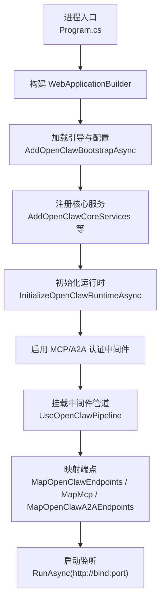
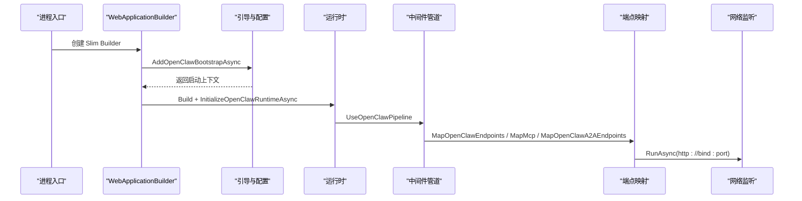
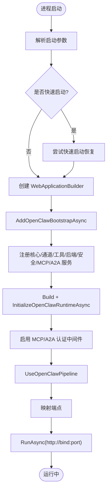
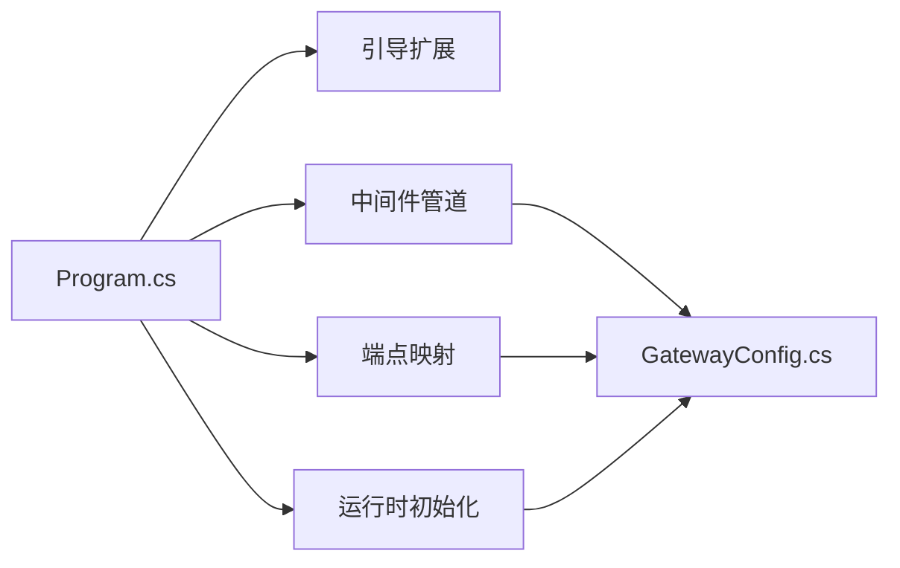

# 网关服务

<cite>
**本文引用的文件**
- [Program.cs](file://src/OpenClaw.Gateway/Program.cs)
- [appsettings.json](file://src/OpenClaw.Gateway/appsettings.json)
- [appsettings.Production.json](file://src/OpenClaw.Gateway/appsettings.Production.json)
- [GatewayConfig.cs](file://src/OpenClaw.Core/Models/GatewayConfig.cs)
</cite>

## 目录
1. [简介](#简介)
2. [项目结构](#项目结构)
3. [核心组件](#核心组件)
4. [架构总览](#架构总览)
5. [详细组件分析](#详细组件分析)
6. [依赖分析](#依赖分析)
7. [性能考虑](#性能考虑)
8. [故障排查指南](#故障排查指南)
9. [结论](#结论)
10. [附录](#附录)

## 简介
本文件为“网关服务”的技术文档，聚焦于启动流程、中间件管道、HTTP/WebSocket 端点与认证授权机制，并对安全配置（含 TLS、跨域、速率限制）、可观测性与健康检查进行系统化说明。文档同时给出 WebSocket 的两种消息模式（原始文本与 JSON 封装）的使用建议与最佳实践。

## 项目结构
网关服务位于 src/OpenClaw.Gateway 目录，核心入口为 Program.cs；运行时配置由 appsettings.json 与 appsettings.Production.json 提供；配置模型定义在 OpenClaw.Core 的 GatewayConfig.cs 中。

图表来源
- [Program.cs:47-96](file://src/OpenClaw.Gateway/Program.cs#L47-L96)

章节来源
- [Program.cs:14-96](file://src/OpenClaw.Gateway/Program.cs#L14-L96)

## 核心组件
- 启动与引导：解析启动参数、加载配置、注册服务、初始化运行时、挂载中间件与端点。
- 配置模型：GatewayConfig 及其子配置类（如 SecurityConfig、WebSocketConfig、ToolingConfig 等），统一承载运行期行为。
- 安全与认证：通过 UseOpenClawMcpAuth 与 UseOpenClawA2AAuth 应用认证中间件；结合 OIDC、令牌校验与跨域策略。
- 中间件管道：UseOpenClawPipeline 负责请求预处理、限流、预算控制等。
- 端点映射：HTTP 端点与 MCP/WebSocket 端点分别映射到不同路径。

章节来源
- [Program.cs:63-96](file://src/OpenClaw.Gateway/Program.cs#L63-L96)
- [GatewayConfig.cs:9-79](file://src/OpenClaw.Core/Models/GatewayConfig.cs#L9-L79)

## 架构总览
下图展示从进程启动到端点可用的关键步骤与模块交互：

图表来源
- [Program.cs:50-96](file://src/OpenClaw.Gateway/Program.cs#L50-L96)

## 详细组件分析

### 启动流程与生命周期
- 参数解析与快速启动恢复：支持交互式快速启动与失败恢复。
- 配置加载与摘要输出：打印环境、绑定地址、端口、会话等信息。
- 服务注册：核心服务、通道、工具、后端、安全、MCP、A2A 等。
- 运行时初始化：完成运行时装配与认证中间件启用。
- 管道与端点：中间件顺序决定请求处理链路；端点映射决定访问路径。
- 监听启动：以 http://bind:port 启动监听。

图表来源
- [Program.cs:14-96](file://src/OpenClaw.Gateway/Program.cs#L14-L96)

章节来源
- [Program.cs:14-124](file://src/OpenClaw.Gateway/Program.cs#L14-L124)

### 中间件管道配置
- UseOpenClawPipeline：负责请求进入后的统一处理，包括但不限于：
  - 请求预处理与上下文注入
  - 速率限制与配额控制（基于 TokenBudgetMiddleware 与 RateLimitMiddleware）
  - 跨域与安全头设置
  - 认证与授权前置检查
- 管道顺序至关重要，认证中间件应在业务处理前执行，确保端点访问受控。

章节来源
- [Program.cs:89](file://src/OpenClaw.Gateway/Program.cs#L89)

### HTTP 端点与 WebSocket 端点
- HTTP 端点映射：MapOpenClawEndpoints
- MCP 端点映射：MapMcp("/mcp")
- A2A 端点映射：MapOpenClawA2AEndpoints
- WebSocket 端点：由 WebSocketChannel 与相关配置驱动，支持两类消息模式：
  - 原始文本模式：直接透传文本消息
  - JSON 封装模式：以 JSON 结构承载消息与元数据，便于扩展与标准化

说明
- 具体端点列表与路由细节由各映射方法内部实现决定；本文不展开具体路由表，但强调端点分层（HTTP/MCP/A2A/WebSocket）与消息模式选择。

章节来源
- [Program.cs:90-93](file://src/OpenClaw.Gateway/Program.cs#L90-L93)

### 认证与授权机制
- MCP 认证：UseOpenClawMcpAuth
- A2A 认证：UseOpenClawA2AAuth
- OIDC 集成：配置项包含 Authority、Audience、RequireHttpsMetadata 等，用于外部身份源对接。
- 令牌与跨域：允许/禁止查询字符串令牌、白名单来源、代理信任与已知代理列表等。

章节来源
- [Program.cs:86-87](file://src/OpenClaw.Gateway/Program.cs#L86-L87)
- [appsettings.json:98-101](file://src/OpenClaw.Gateway/appsettings.json#L98-L101)

### WebSocket 消息模式
- 原始文本模式：适合简单场景，消息直接透传。
- JSON 封装模式：推荐在复杂场景使用，便于携带元数据、类型标识与错误处理。
- 配置要点：最大消息大小、最大连接数、每 IP 最大连接、每连接每分钟消息数、接收超时等。

章节来源
- [appsettings.json:103-109](file://src/OpenClaw.Gateway/appsettings.json#L103-L109)
- [GatewayConfig.cs:386-393](file://src/OpenClaw.Core/Models/GatewayConfig.cs#L386-L393)

### 安全配置、TLS 与跨域
- 跨域策略：AllowedOrigins 白名单控制来源域名。
- 代理与转发：TrustForwardedHeaders 与 KnownProxies 支持反向代理部署。
- OIDC：Authority、Audience、RequireHttpsMetadata 控制外部身份验证。
- 公网绑定安全：StrictPublicBindProfile、AllowUnsafeToolingOnPublicBind、AllowPluginBridgeOnPublicBind、AllowRawSecretRefsOnPublicBind 等，用于强制更严格的安全策略。
- 查询字符串令牌：AllowQueryStringToken 控制是否允许通过查询参数传递令牌。

章节来源
- [appsettings.json:82-102](file://src/OpenClaw.Gateway/appsettings.json#L82-L102)
- [GatewayConfig.cs:331-369](file://src/OpenClaw.Core/Models/GatewayConfig.cs#L331-L369)

### 速率限制与资源约束
- WebSocket 速率限制：MessagesPerMinutePerConnection、MaxConnections、MaxConnectionsPerIp、MaxMessageBytes、ReceiveTimeoutSeconds。
- 工具执行：ToolingConfig 提供工具超时、并行执行、审批策略等。
- 会话级限制：MaxConcurrentSessions、SessionTimeoutMinutes、SessionRateLimitPerMinute、SessionTokenBudget 等。

章节来源
- [appsettings.json:103-144](file://src/OpenClaw.Gateway/appsettings.json#L103-L144)
- [appsettings.Production.json:32-53](file://src/OpenClaw.Gateway/appsettings.Production.json#L32-L53)
- [GatewayConfig.cs:50-66](file://src/OpenClaw.Core/Models/GatewayConfig.cs#L50-L66)

### 观测性与健康检查
- OpenAPI 文档：builder.Services.AddOpenApi("openclaw-integration") 与 app.MapOpenApi(...)。
- 可观测性：builder.AddOpenClawObservability() 注册指标与日志采集。
- 健康检查：可通过 ASP.NET Core 健康检查端点暴露运行状态（具体端点路径由映射决定）。

章节来源
- [Program.cs:65-66](file://src/OpenClaw.Gateway/Program.cs#L65-L66)
- [Program.cs:90](file://src/OpenClaw.Gateway/Program.cs#L90)

## 依赖分析
- 进程入口依赖引导扩展、运行时初始化、中间件与端点映射。
- 配置模型 GatewayConfig 作为所有运行时行为的权威来源，被核心服务与中间件读取。
- 安全中间件依赖配置中的 OIDC、跨域与代理设置。

图表来源
- [Program.cs:53-93](file://src/OpenClaw.Gateway/Program.cs#L53-L93)
- [GatewayConfig.cs:9-79](file://src/OpenClaw.Core/Models/GatewayConfig.cs#L9-L79)

章节来源
- [Program.cs:53-93](file://src/OpenClaw.Gateway/Program.cs#L53-L93)
- [GatewayConfig.cs:9-79](file://src/OpenClaw.Core/Models/GatewayConfig.cs#L9-L79)

## 性能考虑
- 连接与消息限制：合理设置 WebSocket 的 MaxConnections、MaxConnectionsPerIp、MaxMessageBytes、MessagesPerMinutePerConnection，避免资源耗尽。
- 会话与速率：利用 SessionRateLimitPerMinute、SessionTokenBudget 与工具执行超时，平衡吞吐与稳定性。
- 并行工具执行：Tooling.ParallelToolExecution 在多工具调用时提升并发能力，需配合资源与权限控制。
- 缓存与压缩：结合上游服务的缓存与压缩策略，减少往返延迟。
- 监控与告警：通过可观测性配置与健康检查端点，持续跟踪 CPU、内存、连接数与错误率。

## 故障排查指南
- 启动失败恢复：InteractiveStartupRecovery.TryRecover 在首次启动失败时尝试交互式修复或退出码提示。
- 快速启动：InteractiveStartupRecovery.TryQuickstart 支持一键快速启动，失败时返回相应退出码。
- 失败报告：StartupFailureReporter.Write 输出诊断信息，便于定位问题。
- 建议操作：
  - 检查绑定地址与端口占用
  - 校验 OIDC 配置（Authority、Audience、HTTPS 元数据）
  - 确认 AllowedOrigins 与代理信任设置
  - 查看可观测性日志与健康检查端点

章节来源
- [Program.cs:99-122](file://src/OpenClaw.Gateway/Program.cs#L99-L122)

## 结论
本网关服务通过清晰的启动流程、可插拔的服务注册、严格的认证授权与可观测性配置，提供了稳定、可扩展的集成平台。结合合理的 WebSocket 模式选择与资源限制策略，可在保证安全的前提下获得良好的性能与用户体验。

## 附录

### 配置要点速览
- 绑定与端口：BindAddress、Port
- 安全：AllowedOrigins、TrustForwardedHeaders、KnownProxies、OIDC 参数、AllowQueryStringToken
- WebSocket：MaxMessageBytes、MaxConnections、MaxConnectionsPerIp、MessagesPerMinutePerConnection、ReceiveTimeoutSeconds
- 工具与会话：Tooling.*、MaxConcurrentSessions、SessionTimeoutMinutes、SessionRateLimitPerMinute、SessionTokenBudget
- 生产环境：公网绑定安全策略与日志级别

章节来源
- [appsettings.json:2-109](file://src/OpenClaw.Gateway/appsettings.json#L2-L109)
- [appsettings.Production.json:2-65](file://src/OpenClaw.Gateway/appsettings.Production.json#L2-L65)
- [GatewayConfig.cs:11-79](file://src/OpenClaw.Core/Models/GatewayConfig.cs#L11-L79)