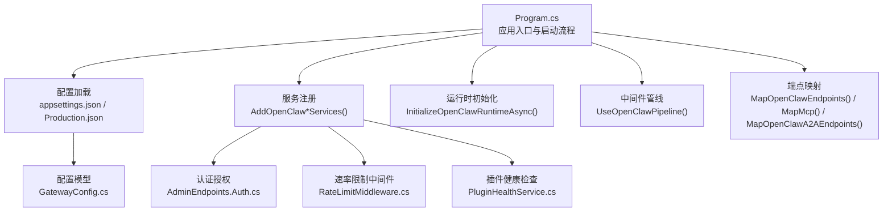
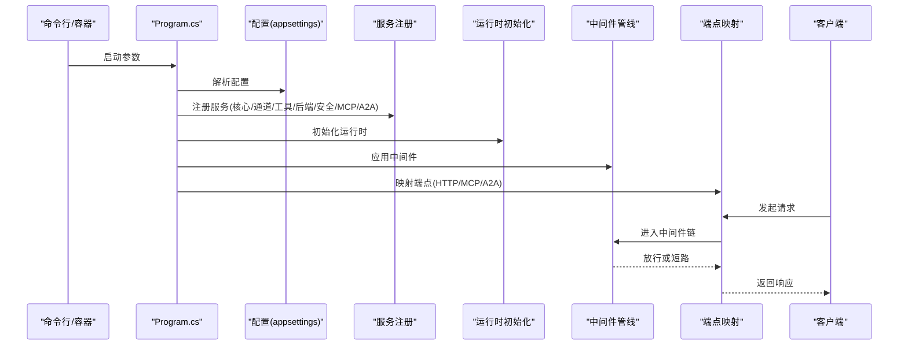
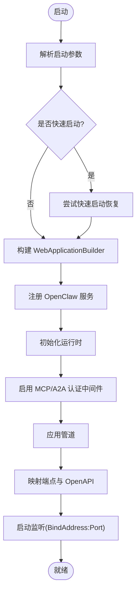
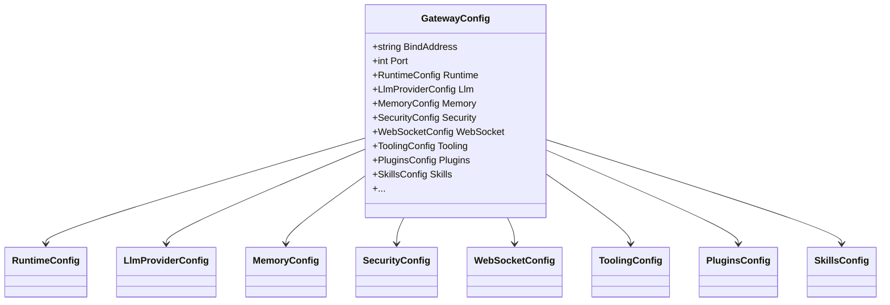
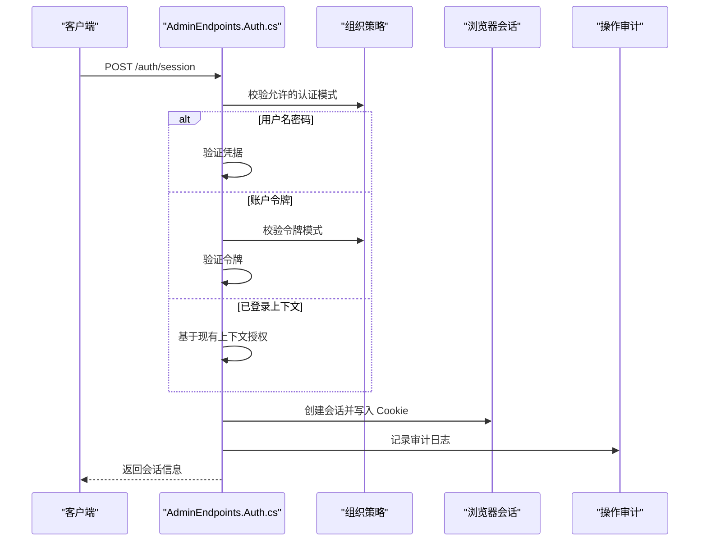
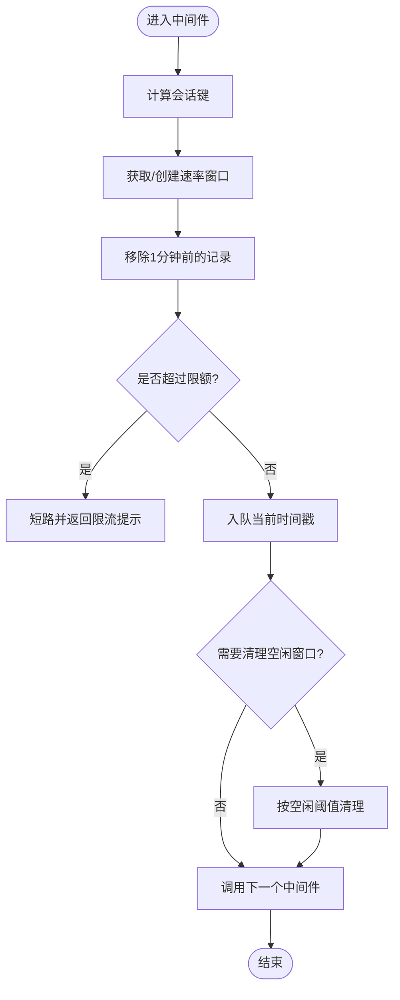
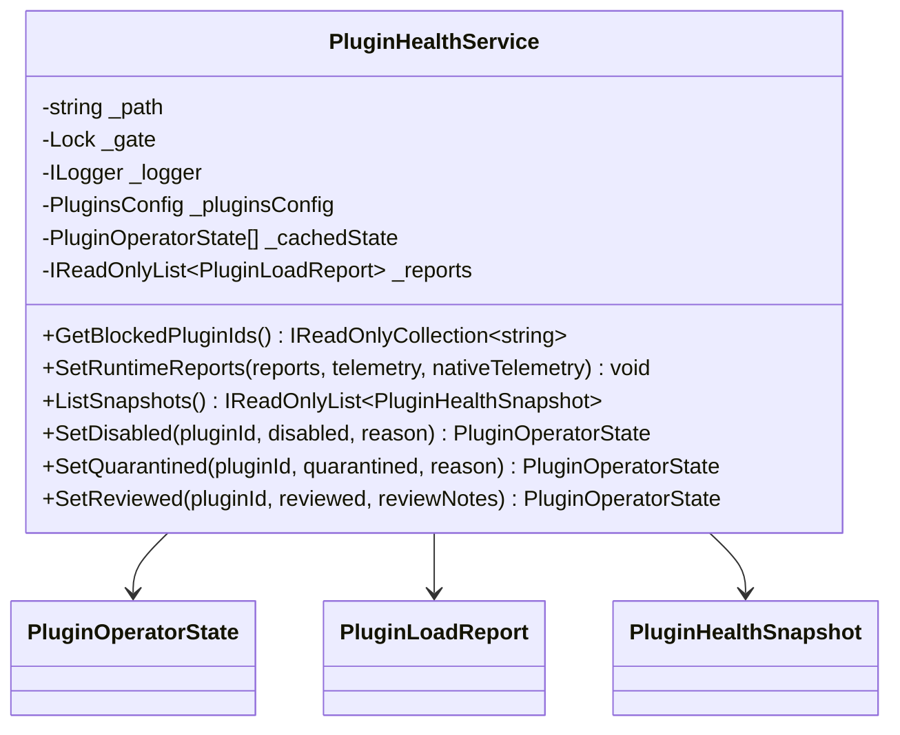
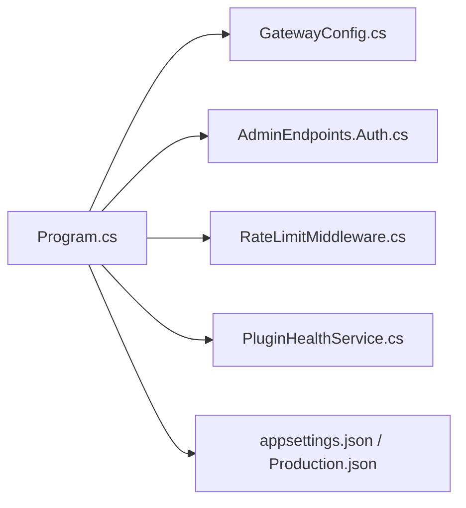

# 网关服务

<cite>
**本文引用的文件**
- [Program.cs](file://src/OpenClaw.Gateway/Program.cs)
- [appsettings.json](file://src/OpenClaw.Gateway/appsettings.json)
- [appsettings.Production.json](file://src/OpenClaw.Gateway/appsettings.Production.json)
- [GatewayConfig.cs](file://src/OpenClaw.Core/Models/GatewayConfig.cs)
- [AdminEndpoints.Auth.cs](file://src/OpenClaw.Gateway/Endpoints/AdminEndpoints.Auth.cs)
- [RateLimitMiddleware.cs](file://src/OpenClaw.Core/Middleware/RateLimitMiddleware.cs)
- [PluginHealthService.cs](file://src/OpenClaw.Gateway/PluginHealthService.cs)
</cite>

## 目录
1. [简介](#简介)
2. [项目结构](#项目结构)
3. [核心组件](#核心组件)
4. [架构总览](#架构总览)
5. [详细组件分析](#详细组件分析)
6. [依赖关系分析](#依赖关系分析)
7. [性能考虑](#性能考虑)
8. [故障排查指南](#故障排查指南)
9. [结论](#结论)
10. [附录](#附录)

## 简介
本文件为“网关服务”的全面技术文档，覆盖架构设计、HTTP/WebSocket API、认证授权机制、中间件系统与健康检查功能，并解释配置管理、服务注册、启动流程与运行时初始化过程。文档同时提供 API 端点规范、请求/响应格式、错误处理与安全控制措施，以及实际配置示例、部署指南与性能优化建议。

## 项目结构
网关服务采用模块化分层组织，核心入口位于 Program.cs，配置由 appsettings.json 与环境变量驱动，认证授权、中间件与插件健康检查等能力分别在独立模块中实现。

**图表来源**
- [Program.cs:47-96](file://src/OpenClaw.Gateway/Program.cs#L47-L96)
- [appsettings.json:1-120](file://src/OpenClaw.Gateway/appsettings.json#L1-L120)
- [appsettings.Production.json:1-65](file://src/OpenClaw.Gateway/appsettings.Production.json#L1-L65)
- [GatewayConfig.cs:9-80](file://src/OpenClaw.Core/Models/GatewayConfig.cs#L9-L80)
- [AdminEndpoints.Auth.cs:30-124](file://src/OpenClaw.Gateway/Endpoints/AdminEndpoints.Auth.cs#L30-L124)
- [RateLimitMiddleware.cs:10-93](file://src/OpenClaw.Core/Middleware/RateLimitMiddleware.cs#L10-L93)
- [PluginHealthService.cs:9-56](file://src/OpenClaw.Gateway/PluginHealthService.cs#L9-L56)

**章节来源**
- [Program.cs:14-96](file://src/OpenClaw.Gateway/Program.cs#L14-L96)
- [appsettings.json:1-120](file://src/OpenClaw.Gateway/appsettings.json#L1-L120)
- [appsettings.Production.json:1-65](file://src/OpenClaw.Gateway/appsettings.Production.json#L1-L65)
- [GatewayConfig.cs:9-80](file://src/OpenClaw.Core/Models/GatewayConfig.cs#L9-L80)

## 核心组件
- 启动与生命周期：Program.cs 负责解析启动参数、构建 WebApplicationBuilder、注册服务、初始化运行时并映射端点。
- 配置管理：GatewayConfig 及 appsettings.json/appsettings.Production.json 提供统一配置模型与默认值。
- 认证授权：AdminEndpoints.Auth.cs 实现浏览器会话、账户令牌交换与会话清理等端点。
- 中间件：RateLimitMiddleware 提供按会话的速率限制。
- 插件健康：PluginHealthService 维护插件状态、审查与预算策略执行。

**章节来源**
- [Program.cs:47-96](file://src/OpenClaw.Gateway/Program.cs#L47-L96)
- [GatewayConfig.cs:9-80](file://src/OpenClaw.Core/Models/GatewayConfig.cs#L9-L80)
- [AdminEndpoints.Auth.cs:30-124](file://src/OpenClaw.Gateway/Endpoints/AdminEndpoints.Auth.cs#L30-L124)
- [RateLimitMiddleware.cs:10-93](file://src/OpenClaw.Core/Middleware/RateLimitMiddleware.cs#L10-L93)
- [PluginHealthService.cs:9-56](file://src/OpenClaw.Gateway/PluginHealthService.cs#L9-L56)

## 架构总览
下图展示从启动到请求处理的关键交互：

**图表来源**
- [Program.cs:47-96](file://src/OpenClaw.Gateway/Program.cs#L47-L96)

## 详细组件分析

### 启动与运行时初始化
- 解析启动参数与快速启动恢复（InteractiveStartupRecovery）。
- 构建 WebApplicationBuilder 并注册 OpenClaw 扩展服务（核心、通道、工具、后端、安全、MCP、A2A）。
- 初始化运行时（InitializeOpenClawRuntimeAsync），启用 MCP 与认证中间件。
- 映射 OpenAPI、网关端点、MCP 与 A2A 端点。
- 在绑定地址与端口上启动监听。

**图表来源**
- [Program.cs:47-96](file://src/OpenClaw.Gateway/Program.cs#L47-L96)

**章节来源**
- [Program.cs:47-96](file://src/OpenClaw.Gateway/Program.cs#L47-L96)

### 配置管理
- 配置根对象 GatewayConfig 汇总所有子系统配置，包括运行时、LLM、内存、安全、WebSocket、工具、插件、技能等。
- appsettings.json 提供开发默认值；appsettings.Production.json 提供生产覆盖项（如绑定地址、工具根路径、并发会话数等）。
- 关键字段示例（非代码内容）：
  - 绑定地址与端口、认证令牌、运行时模式与编排器、LLM 提供商与模型、内存存储与保留策略、安全允许的来源与代理信任、WebSocket 连接与消息速率限制、工具执行策略与超时、插件动态加载与 MCP 服务器、技能加载策略等。

**图表来源**
- [GatewayConfig.cs:9-80](file://src/OpenClaw.Core/Models/GatewayConfig.cs#L9-L80)

**章节来源**
- [GatewayConfig.cs:9-80](file://src/OpenClaw.Core/Models/GatewayConfig.cs#L9-L80)
- [appsettings.json:1-120](file://src/OpenClaw.Gateway/appsettings.json#L1-L120)
- [appsettings.Production.json:1-65](file://src/OpenClaw.Gateway/appsettings.Production.json#L1-L65)

### HTTP/WebSocket API 与端点映射
- 网关通过 MapOpenClawEndpoints 映射业务端点，通过 MapMcp 映射 MCP 协议端点，通过 MapOpenClawA2AEndpoints 映射 A2A 端点。
- OpenAPI 文档通过 MapOpenApi 暴露。
- WebSocket 连接与速率限制由配置与中间件共同约束。

**章节来源**
- [Program.cs:89-93](file://src/OpenClaw.Gateway/Program.cs#L89-L93)

### 认证授权机制
- 浏览器会话端点：
  - GET /auth/session：获取当前操作员会话信息。
  - POST /auth/session：登录并颁发浏览器会话 Cookie；支持用户名密码、账户令牌与已登录上下文三种方式。
  - DELETE /auth/session：登出并清除会话。
- 账户令牌交换：
  - POST /auth/operator-token：凭凭据换取操作员令牌，受组织策略控制。
- 安全策略：
  - 严格公共绑定预设（StrictPublicBindProfile）可强制更安全的审批与工具默认值。
  - 允许的来源、代理信任、查询字符串令牌使用、公共绑定下的工具与桥接限制等。

**图表来源**
- [AdminEndpoints.Auth.cs:51-124](file://src/OpenClaw.Gateway/Endpoints/AdminEndpoints.Auth.cs#L51-L124)

**章节来源**
- [AdminEndpoints.Auth.cs:30-124](file://src/OpenClaw.Gateway/Endpoints/AdminEndpoints.Auth.cs#L30-L124)
- [GatewayConfig.cs:331-369](file://src/OpenClaw.Core/Models/GatewayConfig.cs#L331-L369)

### 中间件系统
- 速率限制中间件（RateLimitMiddleware）：
  - 基于会话维度（ChannelId + SenderId）维护每分钟消息队列窗口。
  - 超限时短路返回提示信息。
  - 定期清理空闲窗口，降低内存占用。

**图表来源**
- [RateLimitMiddleware.cs:39-91](file://src/OpenClaw.Core/Middleware/RateLimitMiddleware.cs#L39-L91)

**章节来源**
- [RateLimitMiddleware.cs:10-93](file://src/OpenClaw.Core/Middleware/RateLimitMiddleware.cs#L10-L93)

### 插件健康检查
- PluginHealthService：
  - 维护插件禁用/隔离/审查状态文件，支持手动标记与自动预算策略触发的隔离。
  - 生成插件健康快照，包含兼容性诊断、重启次数、内存快照、能力声明摘要等。
  - 根据运行预算（重启次数、工作集、兼容性错误）自动隔离不合规插件桥接实例。

**图表来源**
- [PluginHealthService.cs:9-56](file://src/OpenClaw.Gateway/PluginHealthService.cs#L9-L56)

**章节来源**
- [PluginHealthService.cs:9-56](file://src/OpenClaw.Gateway/PluginHealthService.cs#L9-L56)

## 依赖关系分析
- 启动阶段依赖关系：
  - Program.cs 依赖配置模型与扩展方法（AddOpenClaw*Services、InitializeOpenClawRuntimeAsync、MapOpenClawEndpoints 等）。
  - 配置模型 GatewayConfig 作为各子系统配置的聚合根。
  - 认证授权、中间件与插件健康检查作为服务注册的一部分被注入到应用管道。
- 运行时依赖：
  - 端点映射依赖于已初始化的运行时与安全中间件。
  - WebSocket 与 MCP 端点依赖于运行时初始化与认证中间件。

**图表来源**
- [Program.cs:47-96](file://src/OpenClaw.Gateway/Program.cs#L47-L96)
- [GatewayConfig.cs:9-80](file://src/OpenClaw.Core/Models/GatewayConfig.cs#L9-L80)
- [AdminEndpoints.Auth.cs:30-124](file://src/OpenClaw.Gateway/Endpoints/AdminEndpoints.Auth.cs#L30-L124)
- [RateLimitMiddleware.cs:10-93](file://src/OpenClaw.Core/Middleware/RateLimitMiddleware.cs#L10-L93)
- [PluginHealthService.cs:9-56](file://src/OpenClaw.Gateway/PluginHealthService.cs#L9-L56)
- [appsettings.json:1-120](file://src/OpenClaw.Gateway/appsettings.json#L1-L120)
- [appsettings.Production.json:1-65](file://src/OpenClaw.Gateway/appsettings.Production.json#L1-L65)

**章节来源**
- [Program.cs:47-96](file://src/OpenClaw.Gateway/Program.cs#L47-L96)
- [GatewayConfig.cs:9-80](file://src/OpenClaw.Core/Models/GatewayConfig.cs#L9-L80)

## 性能考虑
- 速率限制：通过 RateLimitMiddleware 控制每会话每分钟消息数，避免过载。
- WebSocket：合理设置最大消息大小、连接数、每连接每分钟消息数与接收超时。
- 工具执行：限制工具超时、并行执行与只读模式，减少资源消耗。
- 内存与缓存：根据场景调整历史轮次上限、压缩阈值与保留策略。
- 插件预算：利用 PluginHealthService 的自动隔离策略，防止不稳定插件影响整体稳定性。

[本节为通用指导，无需特定文件引用]

## 故障排查指南
- 启动失败与恢复：
  - 启动异常时，InteractiveStartupRecovery 尝试恢复；若未处理则输出失败报告。
  - 快速启动：支持在本地会话基础上重试启动。
- 认证问题：
  - 检查组织策略对浏览器会话与账户令牌的支持状态。
  - 确认 Cookie 是否正确写入与携带。
- 速率限制：
  - 若频繁收到限流提示，检查客户端发送频率与配置中的限额。
- 插件异常：
  - 查看插件健康快照中的兼容性诊断与重启次数，必要时隔离或审查插件。

**章节来源**
- [Program.cs:99-122](file://src/OpenClaw.Gateway/Program.cs#L99-L122)
- [AdminEndpoints.Auth.cs:64-94](file://src/OpenClaw.Gateway/Endpoints/AdminEndpoints.Auth.cs#L64-L94)
- [RateLimitMiddleware.cs:52-58](file://src/OpenClaw.Core/Middleware/RateLimitMiddleware.cs#L52-L58)
- [PluginHealthService.cs:239-291](file://src/OpenClaw.Gateway/PluginHealthService.cs#L239-L291)

## 结论
网关服务以清晰的启动流程、完善的配置模型、严格的认证授权与中间件体系为基础，结合插件健康检查与可观测性，提供了稳定、可扩展且安全的运行平台。通过合理的配置与部署策略，可在开发与生产环境中获得一致的体验与性能表现。

[本节为总结性内容，无需特定文件引用]

## 附录

### API 端点规范（概要）
- 认证相关
  - GET /auth/session：获取当前会话信息。
  - POST /auth/session：登录并颁发会话 Cookie；支持多种登录方式。
  - DELETE /auth/session：登出会话。
  - POST /auth/operator-token：凭据换取操作员令牌。
- 管理与可观测性
  - OpenAPI 文档：/openapi/{documentName}.json
  - 端点映射：由 MapOpenClawEndpoints 注册的业务端点集合
  - MCP 端点：/mcp
  - A2A 端点：/a2a（前缀与版本由配置决定）

**章节来源**
- [Program.cs:90-93](file://src/OpenClaw.Gateway/Program.cs#L90-L93)
- [AdminEndpoints.Auth.cs:40-124](file://src/OpenClaw.Gateway/Endpoints/AdminEndpoints.Auth.cs#L40-L124)

### 配置示例与最佳实践
- 开发环境
  - 绑定地址：127.0.0.1，端口：18789，允许的来源包含本地与测试地址。
  - 工具执行：允许 Shell 与写文件，读写根路径为通配符。
- 生产环境
  - 绑定地址：0.0.0.0，启用代理信任，限制工具执行范围，设置最大并发会话与会话超时。
  - WebSocket 连接与消息速率限制应按业务峰值调整。
  - 插件默认关闭，需显式启用并配合健康检查策略。

**章节来源**
- [appsettings.json:1-120](file://src/OpenClaw.Gateway/appsettings.json#L1-L120)
- [appsettings.Production.json:1-65](file://src/OpenClaw.Gateway/appsettings.Production.json#L1-L65)

### 部署指南
- 容器化部署
  - 使用生产配置覆盖默认值，确保绑定地址与端口暴露正确。
  - 设置必要的环境变量（如令牌与密钥引用）。
- 网络与安全
  - 对外暴露时启用严格公共绑定预设，限制工具与桥接能力。
  - 配置代理信任与已知代理列表，避免伪造头部。

**章节来源**
- [appsettings.Production.json:1-65](file://src/OpenClaw.Gateway/appsettings.Production.json#L1-L65)
- [GatewayConfig.cs:331-369](file://src/OpenClaw.Core/Models/GatewayConfig.cs#L331-L369)