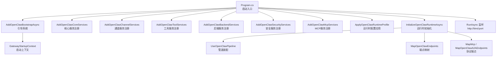
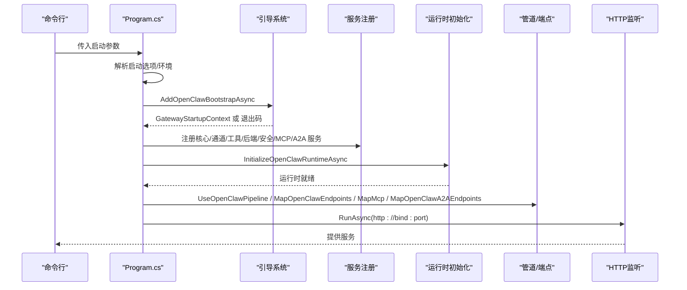
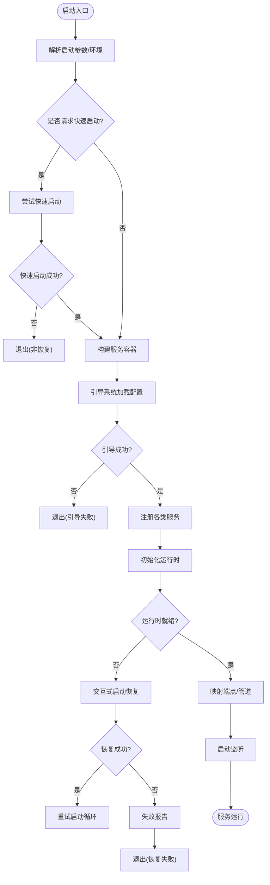
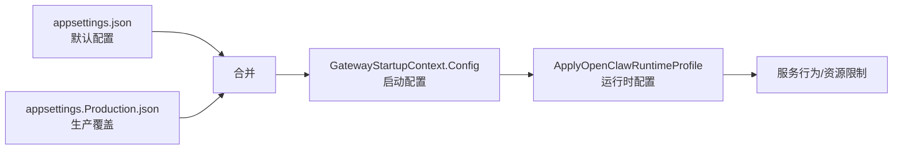
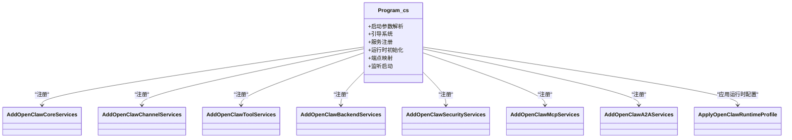
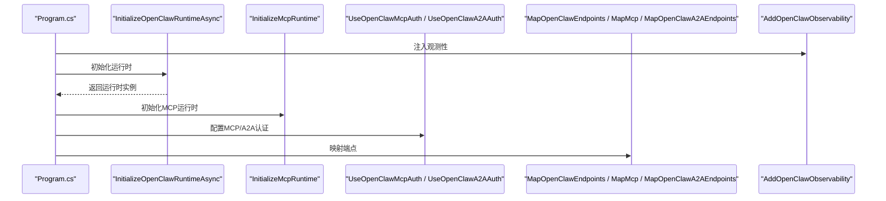
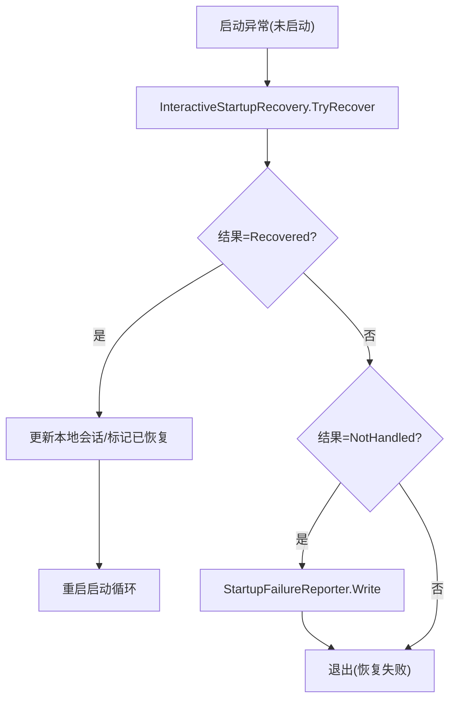
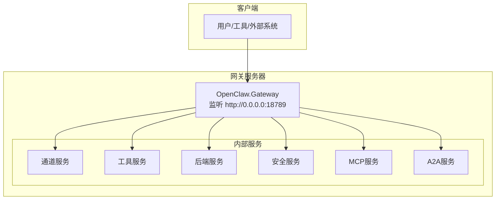
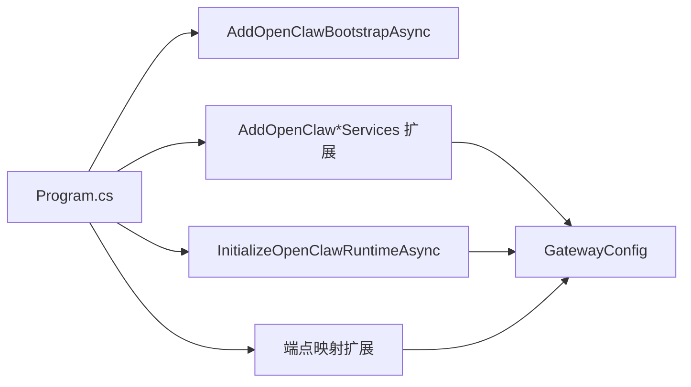

# 网关架构设计

<cite>
**本文档引用的文件**
- [Program.cs](file://src/OpenClaw.Gateway/Program.cs)
- [appsettings.json](file://src/OpenClaw.Gateway/appsettings.json)
- [appsettings.Production.json](file://src/OpenClaw.Gateway/appsettings.Production.json)
- [GatewayStartupContext.cs](file://src/OpenClaw.Gateway/Bootstrap/GatewayStartupContext.cs)
- [InteractiveStartupRecovery.cs](file://src/OpenClaw.Gateway/Bootstrap/InteractiveStartupRecovery.cs)
- [StartupConsoleCoordinator.cs](file://src/OpenClaw.Gateway/Bootstrap/StartupConsoleCoordinator.cs)
- [LocalStartupStateStore.cs](file://src/OpenClaw.Gateway/Bootstrap/LocalStartupStateStore.cs)
- [StartupLaunchOptions.cs](file://src/OpenClaw.Gateway/Bootstrap/StartupLaunchOptions.cs)
- [StartupRecoveryResult.cs](file://src/OpenClaw.Gateway/Bootstrap/StartupRecoveryResult.cs)
- [StartupFailureReporter.cs](file://src/OpenClaw.Gateway/Bootstrap/StartupFailureReporter.cs)
- [GatewayConfig.cs](file://src/OpenClaw.Core/Models/GatewayConfig.cs)
- [AddOpenClawBootstrapAsync.cs](file://src/OpenClaw.Gateway/Extensions/AddOpenClawBootstrapAsync.cs)
- [InitializeOpenClawRuntimeAsync.cs](file://src/OpenClaw.Gateway/Extensions/InitializeOpenClawRuntimeAsync.cs)
- [UseOpenClawPipeline.cs](file://src/OpenClaw.Gateway/Extensions/UseOpenClawPipeline.cs)
- [MapOpenClawEndpoints.cs](file://src/OpenClaw.Gateway/Extensions/MapOpenClawEndpoints.cs)
- [ApplyOpenClawRuntimeProfile.cs](file://src/OpenClaw.Gateway/Profiles/ApplyOpenClawRuntimeProfile.cs)
- [AddOpenClawCoreServices.cs](file://src/OpenClaw.Gateway/Composition/AddOpenClawCoreServices.cs)
- [AddOpenClawChannelServices.cs](file://src/OpenClaw.Gateway/Composition/AddOpenClawChannelServices.cs)
- [AddOpenClawToolServices.cs](file://src/OpenClaw.Gateway/Composition/AddOpenClawToolServices.cs)
- [AddOpenClawBackendServices.cs](file://src/OpenClaw.Gateway/Composition/AddOpenClawBackendServices.cs)
- [AddOpenClawSecurityServices.cs](file://src/OpenClaw.Gateway/Composition/AddOpenClawSecurityServices.cs)
- [AddOpenClawMcpServices.cs](file://src/OpenClaw.Gateway/Composition/AddOpenClawMcpServices.cs)
- [AddOpenClawA2AServices.cs](file://src/OpenClaw.Gateway/Composition/AddOpenClawA2AServices.cs)
- [AddOpenSandboxIntegration.cs](file://src/OpenClaw.Gateway/Composition/AddOpenSandboxIntegration.cs)
- [AddMicrosoftAgentFramework.cs](file://src/OpenClaw.Gateway/Composition/AddMicrosoftAgentFramework.cs)
- [AddOpenClawObservability.cs](file://src/OpenClaw.Gateway/Extensions/AddOpenClawObservability.cs)
- [AddOpenClawBootstrapAsync.cs](file://src/OpenClaw.Gateway/Extensions/AddOpenClawBootstrapAsync.cs)
- [InitializeMcpRuntime.cs](file://src/OpenClaw.Gateway/Extensions/InitializeMcpRuntime.cs)
- [UseOpenClawMcpAuth.cs](file://src/OpenClaw.Gateway/Extensions/UseOpenClawMcpAuth.cs)
- [UseOpenClawA2AAuth.cs](file://src/OpenClaw.Gateway/Extensions/UseOpenClawA2AAuth.cs)
- [MapMcp.cs](file://src/OpenClaw.Gateway/Extensions/MapMcp.cs)
- [MapOpenClawA2AEndpoints.cs](file://src/OpenClaw.Gateway/Extensions/MapOpenClawA2AEndpoints.cs)
- [MapOpenApi.cs](file://src/OpenClaw.Gateway/Extensions/MapOpenApi.cs)
</cite>

## 目录
1. [引言](#引言)
2. [项目结构](#项目结构)
3. [核心组件](#核心组件)
4. [架构总览](#架构总览)
5. [详细组件分析](#详细组件分析)
6. [依赖关系分析](#依赖关系分析)
7. [性能考虑](#性能考虑)
8. [故障排除指南](#故障排除指南)
9. [结论](#结论)
10. [附录](#附录)

## 引言
本文件面向网关架构设计，围绕启动流程、服务注册机制与运行时初始化展开，系统性阐述启动引导系统、配置加载、服务组合与运行时配置，并提供状态管理、错误恢复与快速启动能力的实现要点。文档同时给出架构图、组件交互关系与部署拓扑说明，帮助读者从高层到代码级全面理解网关的运行机制。

## 项目结构
网关采用分层与模块化组织方式：
- 启动与引导：Program.cs 负责解析启动参数、加载配置、构建服务容器、初始化运行时并启动监听。
- 配置体系：appsettings.json 提供默认配置；appsettings.Production.json 提供生产环境覆盖。
- 扩展与组合：通过一系列 Add* 扩展方法完成服务注册与管道装配。
- 运行时与端点：运行时初始化后映射 OpenAPI、网关端点与 MCP/A2A 等接口。

**图表来源**
- [Program.cs:14-96](file://src/OpenClaw.Gateway/Program.cs#L14-L96)
- [AddOpenClawBootstrapAsync.cs](file://src/OpenClaw.Gateway/Extensions/AddOpenClawBootstrapAsync.cs)
- [InitializeOpenClawRuntimeAsync.cs](file://src/OpenClaw.Gateway/Extensions/InitializeOpenClawRuntimeAsync.cs)
- [UseOpenClawPipeline.cs](file://src/OpenClaw.Gateway/Extensions/UseOpenClawPipeline.cs)
- [MapOpenClawEndpoints.cs](file://src/OpenClaw.Gateway/Extensions/MapOpenClawEndpoints.cs)
- [MapMcp.cs](file://src/OpenClaw.Gateway/Extensions/MapMcp.cs)
- [MapOpenClawA2AEndpoints.cs](file://src/OpenClaw.Gateway/Extensions/MapOpenClawA2AEndpoints.cs)

**章节来源**
- [Program.cs:14-96](file://src/OpenClaw.Gateway/Program.cs#L14-L96)

## 核心组件
- 启动参数与环境：解析命令行参数，确定环境名称（如 Production），并根据参数决定是否进入快速启动或交互式恢复模式。
- 引导系统：通过 AddOpenClawBootstrapAsync 完成基础引导，返回启动上下文 GatewayStartupContext，若需退出则直接返回。
- 服务注册：按领域分层调用 AddOpenClawCoreServices、AddOpenClawChannelServices、AddOpenClawToolServices、AddOpenClawBackendServices、AddOpenClawSecurityServices、AddOpenClawMcpServices 等扩展方法进行服务组合。
- 运行时初始化：InitializeOpenClawRuntimeAsync 负责运行时装配与就绪信号，随后映射 OpenAPI、网关端点与 MCP/A2A 接口。
- 监听与路由：使用 RunAsync 在指定地址与端口启动 HTTP 监听，映射各协议端点。

**章节来源**
- [Program.cs:47-96](file://src/OpenClaw.Gateway/Program.cs#L47-L96)

## 架构总览
下图展示从启动到运行的关键交互：

**图表来源**
- [Program.cs:47-96](file://src/OpenClaw.Gateway/Program.cs#L47-L96)
- [AddOpenClawBootstrapAsync.cs](file://src/OpenClaw.Gateway/Extensions/AddOpenClawBootstrapAsync.cs)
- [InitializeOpenClawRuntimeAsync.cs](file://src/OpenClaw.Gateway/Extensions/InitializeOpenClawRuntimeAsync.cs)
- [UseOpenClawPipeline.cs](file://src/OpenClaw.Gateway/Extensions/UseOpenClawPipeline.cs)
- [MapOpenClawEndpoints.cs](file://src/OpenClaw.Gateway/Extensions/MapOpenClawEndpoints.cs)
- [MapMcp.cs](file://src/OpenClaw.Gateway/Extensions/MapMcp.cs)
- [MapOpenClawA2AEndpoints.cs](file://src/OpenClaw.Gateway/Extensions/MapOpenClawA2AEndpoints.cs)

## 详细组件分析

### 启动流程与状态管理
- 启动阶段状态机
  - 加载配置：Slim 构建器 + 引导系统
  - 构建服务：注册核心、通道、工具、后端、安全、MCP、A2A 服务
  - 初始化运行时：装配运行时并触发 ApplicationStarted
  - 启动监听：映射端点并启动 HTTP 监听
- 错误处理与恢复
  - 未启动前异常：进入交互式启动恢复，支持快速启动与建议快速启动
  - 恢复结果：Recovered/NotHandled，分别继续或记录失败
  - 失败报告：在医生模式或建议场景下输出诊断信息

**图表来源**
- [Program.cs:22-123](file://src/OpenClaw.Gateway/Program.cs#L22-L123)
- [InteractiveStartupRecovery.cs](file://src/OpenClaw.Gateway/Bootstrap/InteractiveStartupRecovery.cs)
- [StartupRecoveryResult.cs](file://src/OpenClaw.Gateway/Bootstrap/StartupRecoveryResult.cs)
- [StartupFailureReporter.cs](file://src/OpenClaw.Gateway/Bootstrap/StartupFailureReporter.cs)

**章节来源**
- [Program.cs:22-123](file://src/OpenClaw.Gateway/Program.cs#L22-L123)

### 配置加载与运行时配置
- 默认配置：appsettings.json 提供绑定地址、端口、认证令牌、运行时模式、LLM、内存、安全、WebSocket、工具、插件、技能等默认值。
- 生产配置覆盖：appsettings.Production.json 对绑定地址、端口、日志级别、内存、安全、WebSocket、工具、插件等进行覆盖。
- 运行时配置应用：通过 ApplyOpenClawRuntimeProfile 将配置转换为运行时策略，影响服务行为与资源限制。

**图表来源**
- [appsettings.json:1-908](file://src/OpenClaw.Gateway/appsettings.json#L1-L908)
- [appsettings.Production.json:1-65](file://src/OpenClaw.Gateway/appsettings.Production.json#L1-L65)
- [ApplyOpenClawRuntimeProfile.cs](file://src/OpenClaw.Gateway/Profiles/ApplyOpenClawRuntimeProfile.cs)
- [GatewayConfig.cs](file://src/OpenClaw.Core/Models/GatewayConfig.cs)

**章节来源**
- [appsettings.json:1-908](file://src/OpenClaw.Gateway/appsettings.json#L1-L908)
- [appsettings.Production.json:1-65](file://src/OpenClaw.Gateway/appsettings.Production.json#L1-L65)
- [ApplyOpenClawRuntimeProfile.cs](file://src/OpenClaw.Gateway/Profiles/ApplyOpenClawRuntimeProfile.cs)

### 服务注册机制
- 分层注册：核心服务、通道服务、工具服务、后端服务、安全服务、MCP 服务、A2A 服务分别通过独立扩展方法注册，确保高内聚低耦合。
- 可选集成：根据编译宏与配置选择性启用 OpenSandbox 集成与 Microsoft Agent Framework。
- 运行时配置：注册完成后应用运行时配置，统一约束并发会话数、会话超时等。

**图表来源**
- [Program.cs:67-78](file://src/OpenClaw.Gateway/Program.cs#L67-L78)
- [AddOpenClawCoreServices.cs](file://src/OpenClaw.Gateway/Composition/AddOpenClawCoreServices.cs)
- [AddOpenClawChannelServices.cs](file://src/OpenClaw.Gateway/Composition/AddOpenClawChannelServices.cs)
- [AddOpenClawToolServices.cs](file://src/OpenClaw.Gateway/Composition/AddOpenClawToolServices.cs)
- [AddOpenClawBackendServices.cs](file://src/OpenClaw.Gateway/Composition/AddOpenClawBackendServices.cs)
- [AddOpenClawSecurityServices.cs](file://src/OpenClaw.Gateway/Composition/AddOpenClawSecurityServices.cs)
- [AddOpenClawMcpServices.cs](file://src/OpenClaw.Gateway/Composition/AddOpenClawMcpServices.cs)
- [AddOpenClawA2AServices.cs](file://src/OpenClaw.Gateway/Composition/AddOpenClawA2AServices.cs)
- [ApplyOpenClawRuntimeProfile.cs](file://src/OpenClaw.Gateway/Profiles/ApplyOpenClawRuntimeProfile.cs)

**章节来源**
- [Program.cs:67-78](file://src/OpenClaw.Gateway/Program.cs#L67-L78)

### 运行时初始化过程
- 初始化步骤：InitializeOpenClawRuntimeAsync 完成运行时装配，随后执行 MCP 运行时初始化与认证中间件装配，最后映射端点。
- 观测性：AddOpenClawObservability 注入可观测性基础设施，便于监控与诊断。
- 端点映射：OpenAPI 文档、网关端点、MCP 端点、A2A 端点均在此阶段完成映射。

**图表来源**
- [Program.cs:83-93](file://src/OpenClaw.Gateway/Program.cs#L83-L93)
- [InitializeOpenClawRuntimeAsync.cs](file://src/OpenClaw.Gateway/Extensions/InitializeOpenClawRuntimeAsync.cs)
- [InitializeMcpRuntime.cs](file://src/OpenClaw.Gateway/Extensions/InitializeMcpRuntime.cs)
- [UseOpenClawMcpAuth.cs](file://src/OpenClaw.Gateway/Extensions/UseOpenClawMcpAuth.cs)
- [UseOpenClawA2AAuth.cs](file://src/OpenClaw.Gateway/Extensions/UseOpenClawA2AAuth.cs)
- [MapOpenClawEndpoints.cs](file://src/OpenClaw.Gateway/Extensions/MapOpenClawEndpoints.cs)
- [MapMcp.cs](file://src/OpenClaw.Gateway/Extensions/MapMcp.cs)
- [MapOpenClawA2AEndpoints.cs](file://src/OpenClaw.Gateway/Extensions/MapOpenClawA2AEndpoints.cs)
- [AddOpenClawObservability.cs](file://src/OpenClaw.Gateway/Extensions/AddOpenClawObservability.cs)

**章节来源**
- [Program.cs:83-93](file://src/OpenClaw.Gateway/Program.cs#L83-L93)

### 快速启动与错误恢复
- 快速启动：当启动参数指示快速启动时，尝试从本地状态恢复启动会话，成功则直接进入后续流程。
- 交互式恢复：未启动前发生的异常触发交互式恢复，根据可提示条件与建议策略决定是否尝试快速启动或输出诊断。
- 恢复结果枚举：Recovered/NotHandled 控制流程走向，失败时输出诊断信息并设置退出码。

**图表来源**
- [Program.cs:99-122](file://src/OpenClaw.Gateway/Program.cs#L99-L122)
- [InteractiveStartupRecovery.cs](file://src/OpenClaw.Gateway/Bootstrap/InteractiveStartupRecovery.cs)
- [StartupRecoveryResult.cs](file://src/OpenClaw.Gateway/Bootstrap/StartupRecoveryResult.cs)
- [StartupFailureReporter.cs](file://src/OpenClaw.Gateway/Bootstrap/StartupFailureReporter.cs)

**章节来源**
- [Program.cs:99-122](file://src/OpenClaw.Gateway/Program.cs#L99-L122)

### 部署拓扑说明
- 单机部署：网关在 http://bind:port 上提供统一入口，内部聚合通道、工具、后端、MCP、A2A 等能力。
- 生产环境：默认绑定地址为 0.0.0.0，端口固定，日志级别与资源限制在生产配置中明确。
- 可选组件：OpenSandbox 集成与 Microsoft Agent Framework 可按需启用。

**图表来源**
- [appsettings.Production.json:2-54](file://src/OpenClaw.Gateway/appsettings.Production.json#L2-L54)
- [Program.cs:96](file://src/OpenClaw.Gateway/Program.cs#L96)

**章节来源**
- [appsettings.Production.json:2-54](file://src/OpenClaw.Gateway/appsettings.Production.json#L2-L54)
- [Program.cs:96](file://src/OpenClaw.Gateway/Program.cs#L96)

## 依赖关系分析
- 组件耦合：Program.cs 作为编排者，依赖引导、注册、初始化与映射扩展；这些扩展进一步依赖配置模型与具体实现。
- 外部依赖：MCP、A2A、通道适配器、工具执行后端、安全策略等均通过服务注册注入，降低直接耦合。
- 循环依赖：通过分层扩展与配置驱动避免循环依赖风险。

**图表来源**
- [Program.cs:47-96](file://src/OpenClaw.Gateway/Program.cs#L47-L96)
- [GatewayConfig.cs](file://src/OpenClaw.Core/Models/GatewayConfig.cs)

**章节来源**
- [Program.cs:47-96](file://src/OpenClaw.Gateway/Program.cs#L47-L96)
- [GatewayConfig.cs](file://src/OpenClaw.Core/Models/GatewayConfig.cs)

## 性能考虑
- 并发与会话：生产配置限制最大并发会话数与会话超时，避免资源耗尽。
- 工具执行：工具超时、并行执行开关与工作区根路径控制影响吞吐与安全性。
- WebSocket：连接数、消息大小与速率限制保障实时通信稳定性。
- 缓存与压缩：内存存储路径、压缩阈值与保留策略影响数据访问效率与磁盘占用。

[本节为通用指导，无需特定文件引用]

## 故障排除指南
- 启动失败
  - 检查引导返回码与退出原因，确认配置文件语法与路径正确。
  - 查看失败报告输出，定位具体异常类型与堆栈。
- 交互式恢复
  - 若提示可交互，按提示输入修复配置或选择快速启动。
  - 关注恢复结果枚举，区分“已恢复”与“未处理”两种情形。
- 常见问题
  - 认证失败：核对认证令牌与允许来源配置。
  - 端口冲突：调整端口或停止占用进程。
  - 插件/工具不可用：检查插件启用状态与工作区权限。

**章节来源**
- [StartupFailureReporter.cs](file://src/OpenClaw.Gateway/Bootstrap/StartupFailureReporter.cs)
- [InteractiveStartupRecovery.cs](file://src/OpenClaw.Gateway/Bootstrap/InteractiveStartupRecovery.cs)
- [StartupRecoveryResult.cs](file://src/OpenClaw.Gateway/Bootstrap/StartupRecoveryResult.cs)

## 结论
该网关架构以启动流程为核心，通过引导系统加载配置、分层注册服务、初始化运行时并映射端点，形成清晰的启动与运行闭环。结合交互式恢复与快速启动机制，提升了可用性与可维护性。生产配置覆盖与运行时配置应用确保了在不同环境下的稳定表现。

## 附录
- 启动参数与环境变量：通过启动选项解析与环境名称确定，影响引导与恢复策略。
- 观测性：在初始化运行时前注入可观测性，便于问题定位与性能监控。

**章节来源**
- [Program.cs:14-18](file://src/OpenClaw.Gateway/Program.cs#L14-L18)
- [AddOpenClawObservability.cs](file://src/OpenClaw.Gateway/Extensions/AddOpenClawObservability.cs)