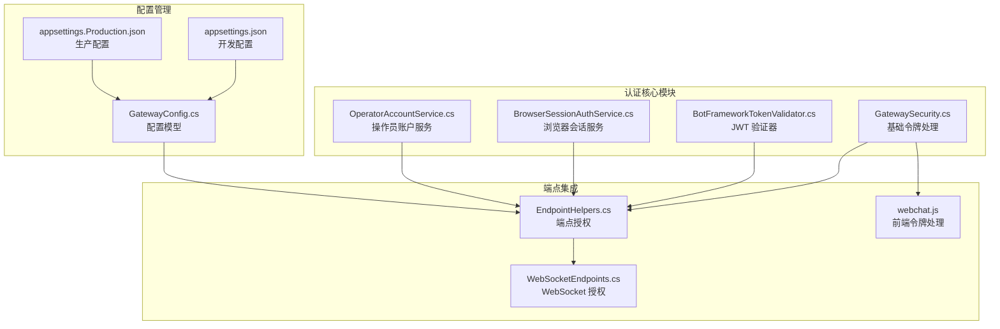
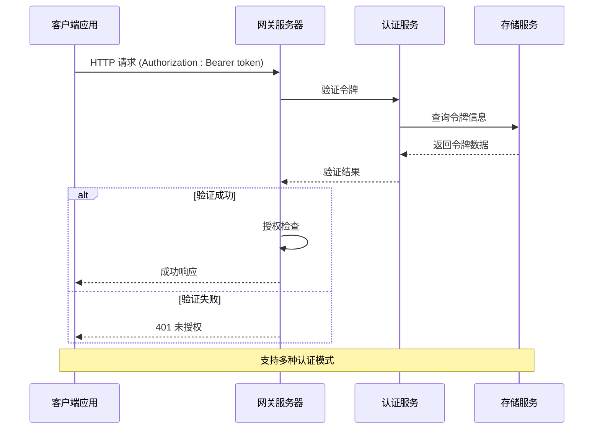
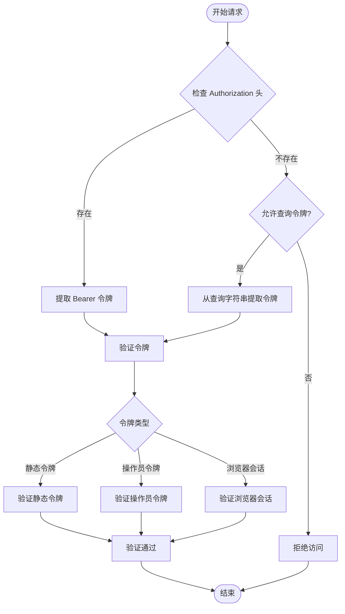
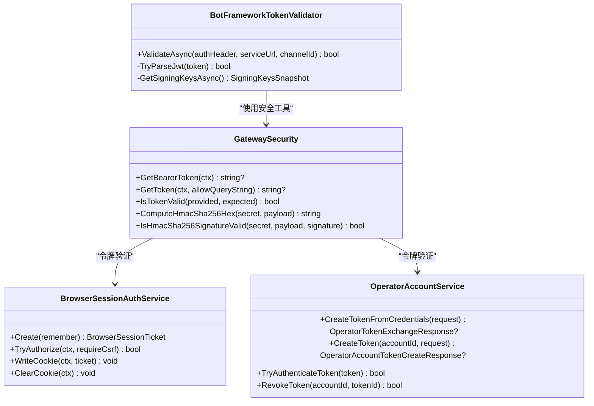
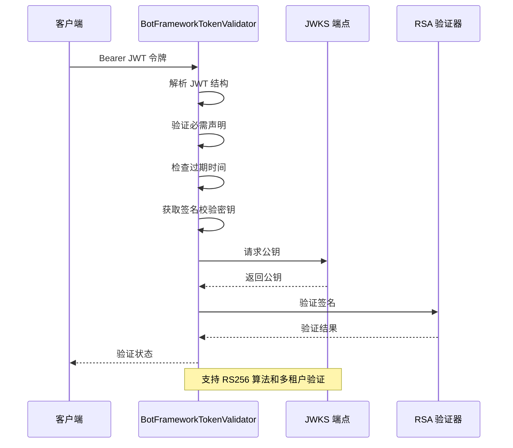
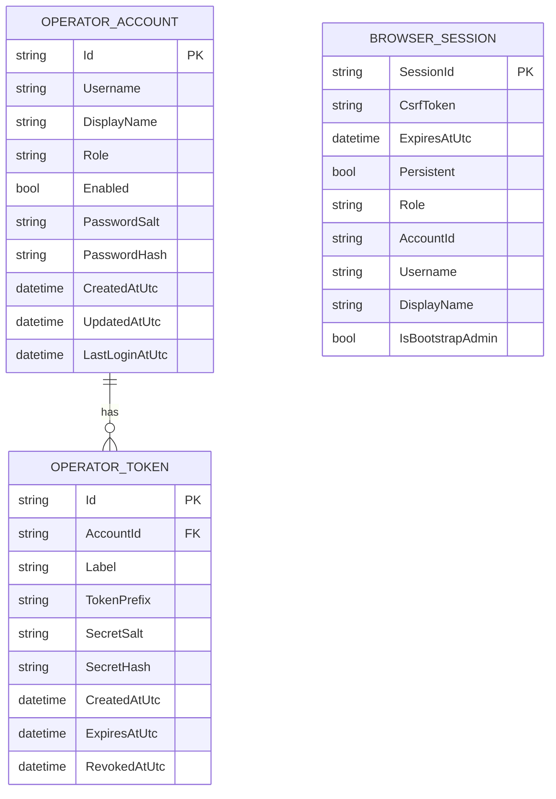
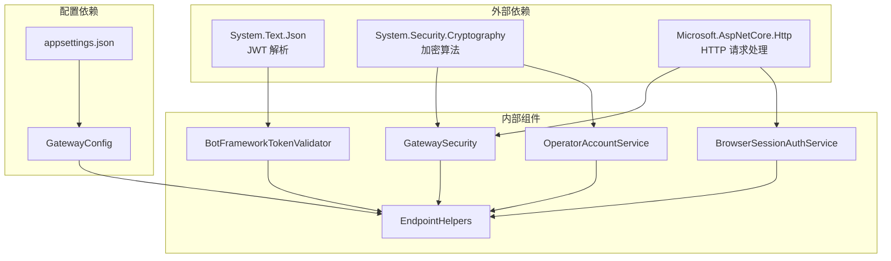

# Bearer Token 认证

<cite>
**本文档引用的文件**
- [GatewaySecurity.cs](file://src/OpenClaw.Gateway/GatewaySecurity.cs)
- [BotFrameworkTokenValidator.cs](file://src/OpenClaw.Gateway/BotFrameworkTokenValidator.cs)
- [EndpointHelpers.cs](file://src/OpenClaw.Gateway/Endpoints/EndpointHelpers.cs)
- [BrowserSessionAuthService.cs](file://src/OpenClaw.Gateway/BrowserSessionAuthService.cs)
- [OperatorAccountService.cs](file://src/OpenClaw.Gateway/OperatorAccountService.cs)
- [GatewayConfig.cs](file://src/OpenClaw.Core/Models/GatewayConfig.cs)
- [appsettings.json](file://src/OpenClaw.Gateway/appsettings.json)
- [appsettings.Production.json](file://src/OpenClaw.Gateway/appsettings.Production.json)
- [webchat.js](file://src/OpenClaw.Gateway/wwwroot/webchat.js)
- [WebSocketEndpoints.cs](file://src/OpenClaw.Gateway/Endpoints/WebSocketEndpoints.cs)
</cite>

## 目录
1. [简介](#简介)
2. [项目结构](#项目结构)
3. [核心组件](#核心组件)
4. [架构概览](#架构概览)
5. [详细组件分析](#详细组件分析)
6. [依赖关系分析](#依赖关系分析)
7. [性能考虑](#性能考虑)
8. [故障排除指南](#故障排除指南)
9. [结论](#结论)

## 简介

Bearer Token 认证是 OpenClaw 网关系统中的核心安全机制，用于保护 API 端点和 WebSocket 连接。该机制支持多种认证模式，包括静态令牌、操作员账户令牌和浏览器会话令牌，并提供了完整的令牌验证、授权和安全防护功能。

本文档详细解释了 Bearer Token 认证的工作原理，包括令牌生成、验证和刷新流程，令牌结构、签名算法和有效期管理，以及在 HTTP 请求头中传递令牌的方式。同时涵盖了网关如何验证令牌的有效性和权限范围，令牌配置选项、密钥管理和安全最佳实践。

## 项目结构

OpenClaw 项目的 Bearer Token 认证机制分布在多个关键模块中：

**图表来源**
- [GatewaySecurity.cs:1-109](file://src/OpenClaw.Gateway/GatewaySecurity.cs#L1-L109)
- [EndpointHelpers.cs:1-366](file://src/OpenClaw.Gateway/Endpoints/EndpointHelpers.cs#L1-L366)

**章节来源**
- [GatewaySecurity.cs:1-109](file://src/OpenClaw.Gateway/GatewaySecurity.cs#L1-L109)
- [GatewayConfig.cs:331-369](file://src/OpenClaw.Core/Models/GatewayConfig.cs#L331-L369)

## 核心组件

### 基础令牌处理 (GatewaySecurity)

GatewaySecurity 提供了 Bearer Token 认证的核心功能，包括令牌提取、验证和安全哈希计算：

- **令牌提取**: 支持从 Authorization 头部和查询字符串中提取令牌
- **令牌验证**: 使用常量时间比较防止时序攻击
- **签名验证**: 支持 HMAC-SHA256 签名验证
- **安全哈希**: 提供 SHA256 哈希计算功能

### 浏览器会话认证 (BrowserSessionAuthService)

浏览器会话服务实现了基于 Cookie 的认证机制：

- **会话管理**: 创建、验证和撤销浏览器会话
- **CSRF 保护**: 防止跨站请求伪造攻击
- **会话持久化**: 支持临时和持久会话
- **自动续期**: 智能会话过期管理

### 操作员账户认证 (OperatorAccountService)

操作员账户服务管理基于用户名密码的认证：

- **密码哈希**: 使用 PBKDF2 算法进行密码安全存储
- **令牌生成**: 为操作员账户生成安全的访问令牌
- **令牌验证**: 验证操作员令牌的有效性
- **权限管理**: 支持不同级别的操作员权限

### JWT 验证器 (BotFrameworkTokenValidator)

专门用于验证 Microsoft Teams Bot Framework JWT 令牌：

- **算法验证**: 支持 RS256 签名算法
- **签名校验**: 从 JWKS 端点获取并验证公钥
- **声明验证**: 验证 iss、aud、exp、nbf 等关键声明
- **服务 URL 验证**: 确保令牌与请求的服务 URL 匹配

**章节来源**
- [GatewaySecurity.cs:13-49](file://src/OpenClaw.Gateway/GatewaySecurity.cs#L13-L49)
- [BrowserSessionAuthService.cs:32-107](file://src/OpenClaw.Gateway/BrowserSessionAuthService.cs#L32-L107)
- [OperatorAccountService.cs:259-295](file://src/OpenClaw.Gateway/OperatorAccountService.cs#L259-L295)
- [BotFrameworkTokenValidator.cs:40-134](file://src/OpenClaw.Gateway/BotFrameworkTokenValidator.cs#L40-L134)

## 架构概览

Bearer Token 认证系统的整体架构如下：

**图表来源**
- [EndpointHelpers.cs:47-131](file://src/OpenClaw.Gateway/Endpoints/EndpointHelpers.cs#L47-L131)
- [WebSocketEndpoints.cs:96-118](file://src/OpenClaw.Gateway/Endpoints/WebSocketEndpoints.cs#L96-L118)

## 详细组件分析

### 令牌提取和验证流程

**图表来源**
- [GatewaySecurity.cs:27-37](file://src/OpenClaw.Gateway/GatewaySecurity.cs#L27-L37)
- [EndpointHelpers.cs:71-104](file://src/OpenClaw.Gateway/Endpoints/EndpointHelpers.cs#L71-L104)

### 令牌验证组件关系

**图表来源**
- [GatewaySecurity.cs:8-109](file://src/OpenClaw.Gateway/GatewaySecurity.cs#L8-L109)
- [BrowserSessionAuthService.cs:8-180](file://src/OpenClaw.Gateway/BrowserSessionAuthService.cs#L8-L180)
- [OperatorAccountService.cs:7-414](file://src/OpenClaw.Gateway/OperatorAccountService.cs#L7-L414)
- [BotFrameworkTokenValidator.cs:15-134](file://src/OpenClaw.Gateway/BotFrameworkTokenValidator.cs#L15-L134)

### JWT 令牌验证流程

**图表来源**
- [BotFrameworkTokenValidator.cs:40-134](file://src/OpenClaw.Gateway/BotFrameworkTokenValidator.cs#L40-L134)
- [BotFrameworkTokenValidator.cs:147-180](file://src/OpenClaw.Gateway/BotFrameworkTokenValidator.cs#L147-L180)

**章节来源**
- [GatewaySecurity.cs:13-49](file://src/OpenClaw.Gateway/GatewaySecurity.cs#L13-L49)
- [BrowserSessionAuthService.cs:68-107](file://src/OpenClaw.Gateway/BrowserSessionAuthService.cs#L68-L107)
- [OperatorAccountService.cs:259-295](file://src/OpenClaw.Gateway/OperatorAccountService.cs#L259-L295)
- [BotFrameworkTokenValidator.cs:182-212](file://src/OpenClaw.Gateway/BotFrameworkTokenValidator.cs#L182-L212)

### 令牌配置和管理

#### 安全配置选项

| 配置项 | 类型 | 默认值 | 描述 |
|--------|------|--------|------|
| AllowQueryStringToken | bool | false | 是否允许通过查询字符串传递令牌 |
| AllowedOrigins | string[] | [] | 允许的 CORS 来源列表 |
| BrowserSessionIdleMinutes | int | 60 | 浏览器会话空闲超时（分钟） |
| BrowserRememberDays | int | 30 | 持久会话保留天数 |

#### 令牌存储结构

**图表来源**
- [OperatorAccountService.cs:14-39](file://src/OpenClaw.Gateway/OperatorAccountService.cs#L14-L39)
- [BrowserSessionAuthService.cs:13-22](file://src/OpenClaw.Gateway/BrowserSessionAuthService.cs#L13-L22)

**章节来源**
- [GatewayConfig.cs:331-369](file://src/OpenClaw.Core/Models/GatewayConfig.cs#L331-L369)
- [appsettings.json:82-102](file://src/OpenClaw.Gateway/appsettings.json#L82-L102)
- [appsettings.Production.json:22-30](file://src/OpenClaw.Gateway/appsettings.Production.json#L22-L30)

## 依赖关系分析

Bearer Token 认证机制的依赖关系如下：

**图表来源**
- [GatewaySecurity.cs:1-5](file://src/OpenClaw.Gateway/GatewaySecurity.cs#L1-L5)
- [BotFrameworkTokenValidator.cs:1-7](file://src/OpenClaw.Gateway/BotFrameworkTokenValidator.cs#L1-L7)
- [EndpointHelpers.cs:1-7](file://src/OpenClaw.Gateway/Endpoints/EndpointHelpers.cs#L1-L7)

**章节来源**
- [GatewaySecurity.cs:1-109](file://src/OpenClaw.Gateway/GatewaySecurity.cs#L1-L109)
- [EndpointHelpers.cs:1-366](file://src/OpenClaw.Gateway/Endpoints/EndpointHelpers.cs#L1-L366)

## 性能考虑

### 令牌验证性能优化

1. **常量时间比较**: 使用 `CryptographicOperations.FixedTimeEquals` 防止时序攻击，确保验证时间复杂度为 O(n)
2. **缓存策略**: BotFrameworkTokenValidator 缓存 JWKS 密钥，减少网络请求开销
3. **内存管理**: 及时释放 JSON 文档资源，避免内存泄漏
4. **并发控制**: 使用信号量限制 JWKS 密钥获取的并发访问

### 安全最佳实践

1. **令牌传输安全**: 始终使用 HTTPS 传输令牌，防止中间人攻击
2. **令牌存储安全**: 操作员令牌使用 PBKDF2 算法进行安全哈希存储
3. **会话管理**: 浏览器会话支持 CSRF 保护和智能过期管理
4. **权限最小化**: 支持基于角色的权限控制，遵循最小权限原则

## 故障排除指南

### 常见认证错误及解决方案

| 错误类型 | 可能原因 | 解决方案 |
|----------|----------|----------|
| 401 未授权 | 令牌格式错误或为空 | 检查 Authorization 头格式是否为 "Bearer {token}" |
| 403 禁止访问 | 令牌有效但权限不足 | 验证操作员账户权限级别 |
| 429 请求过多 | 超过速率限制 | 检查客户端重试策略和速率限制配置 |
| 400 错误请求 | 查询参数令牌被禁用 | 在配置中启用 AllowQueryStringToken |

### 调试技巧

1. **日志记录**: 启用详细的认证日志以跟踪令牌验证过程
2. **令牌测试**: 使用单元测试验证令牌提取和验证逻辑
3. **配置验证**: 确保 appsettings.json 中的安全配置正确设置
4. **网络诊断**: 检查 JWKS 端点的可达性和响应时间

**章节来源**
- [GatewaySecurity.cs:39-49](file://src/OpenClaw.Gateway/GatewaySecurity.cs#L39-L49)
- [EndpointHelpers.cs:211-239](file://src/OpenClaw.Gateway/Endpoints/EndpointHelpers.cs#L211-L239)

## 结论

Bearer Token 认证机制为 OpenClaw 网关提供了全面的安全保障，支持多种认证模式和灵活的配置选项。通过合理的令牌管理、严格的验证流程和完善的错误处理，系统能够有效防止各种安全威胁。

关键优势包括：
- **多模式支持**: 静态令牌、操作员账户令牌和浏览器会话令牌
- **安全设计**: 使用常量时间比较和安全哈希算法
- **灵活配置**: 支持环境特定的安全配置
- **完整监控**: 提供详细的认证日志和审计功能

建议在生产环境中：
1. 始终启用 HTTPS 和严格的 CORS 策略
2. 定期轮换和审查认证令牌
3. 监控认证失败率和异常访问模式
4. 实施适当的速率限制和防护措施