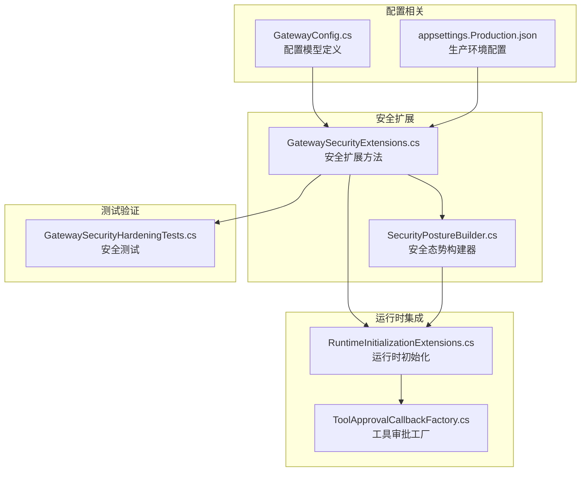
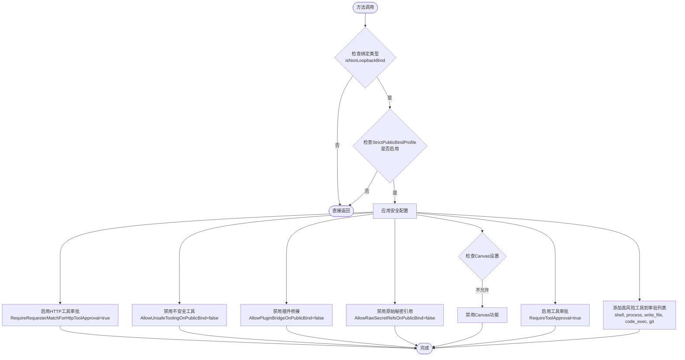
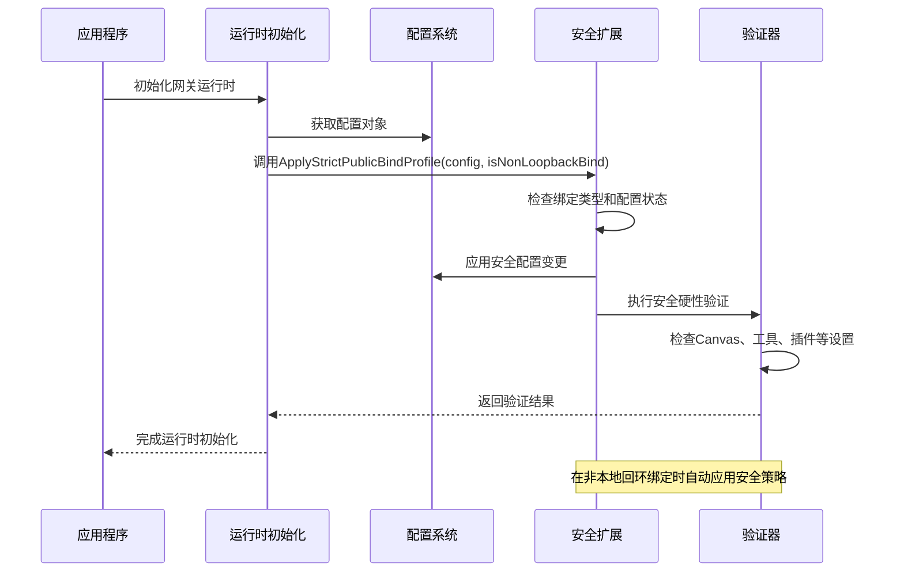
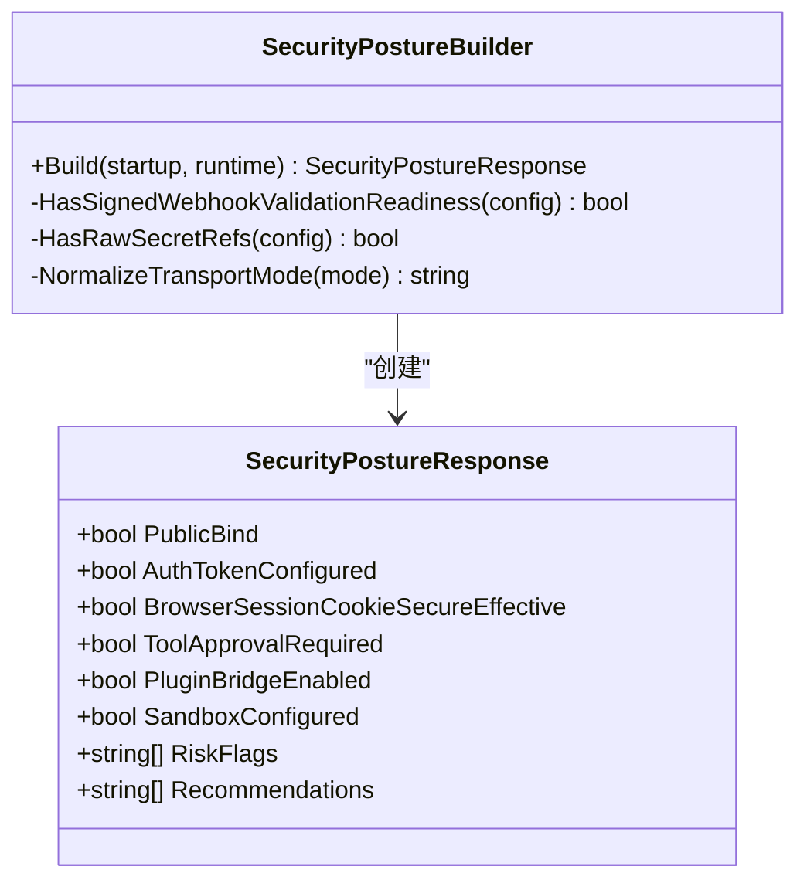
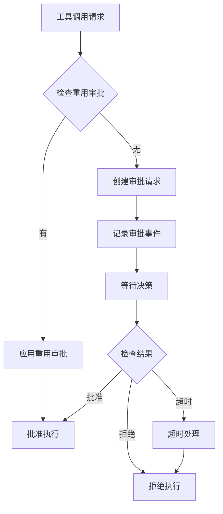
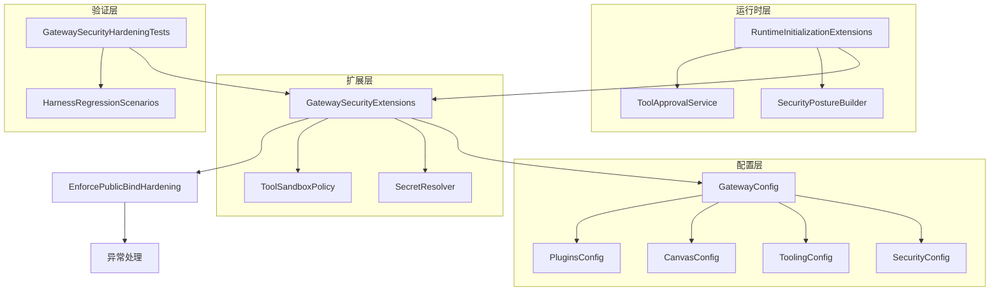

# 严格公共绑定配置

<cite>
**本文档引用的文件**
- [GatewaySecurityExtensions.cs](file://src/OpenClaw.Gateway/Extensions/GatewaySecurityExtensions.cs)
- [SecurityPostureBuilder.cs](file://src/OpenClaw.Gateway/SecurityPostureBuilder.cs)
- [RuntimeInitializationExtensions.cs](file://src/OpenClaw.Gateway/Composition/RuntimeInitializationExtensions.cs)
- [GatewayConfig.cs](file://src/OpenClaw.Core/Models/GatewayConfig.cs)
- [appsettings.Production.json](file://src/OpenClaw.Gateway/appsettings.Production.json)
- [GatewaySecurityHardeningTests.cs](file://src/OpenClaw.Tests/GatewaySecurityHardeningTests.cs)
- [ToolApprovalCallbackFactory.cs](file://src/OpenClaw.Gateway/ToolApprovalCallbackFactory.cs)
</cite>

## 目录
1. [简介](#简介)
2. [项目结构](#项目结构)
3. [核心组件](#核心组件)
4. [架构概览](#架构概览)
5. [详细组件分析](#详细组件分析)
6. [依赖关系分析](#依赖关系分析)
7. [性能考虑](#性能考虑)
8. [故障排除指南](#故障排除指南)
9. [结论](#结论)
10. [附录](#附录)

## 简介

严格公共绑定配置是 OpenClaw 网关在互联网公开暴露时的安全防护机制。该配置通过 ApplyStrictPublicBindProfile 方法自动应用一系列安全策略，确保在非本地回环地址绑定时的系统安全性。

本配置的核心目标包括：
- 自动启用工具审批要求，防止未授权的高风险操作
- 禁用不安全的工具执行，特别是 shell 和 process 工具
- 限制插件桥接功能，降低第三方插件带来的安全风险
- 禁止原始秘密引用，防止敏感信息泄露

## 项目结构

严格公共绑定配置涉及以下关键文件和组件：



**图表来源**
- [GatewaySecurityExtensions.cs:1-317](file://src/OpenClaw.Gateway/Extensions/GatewaySecurityExtensions.cs#L1-L317)
- [GatewayConfig.cs:331-530](file://src/OpenClaw.Core/Models/GatewayConfig.cs#L331-L530)

**章节来源**
- [GatewaySecurityExtensions.cs:1-317](file://src/OpenClaw.Gateway/Extensions/GatewaySecurityExtensions.cs#L1-L317)
- [GatewayConfig.cs:331-530](file://src/OpenClaw.Core/Models/GatewayConfig.cs#L331-L530)

## 核心组件

### ApplyStrictPublicBindProfile 方法

ApplyStrictPublicBindProfile 是严格公共绑定配置的核心方法，负责在检测到非本地回环绑定时自动应用安全策略。

**方法签名与参数：**
- 输入参数：GatewayConfig 配置对象、bool 类型的 isNonLoopbackBind 标志
- 返回值：void（直接修改配置对象）

**核心功能实现：**



**图表来源**
- [GatewaySecurityExtensions.cs:11-27](file://src/OpenClaw.Gateway/Extensions/GatewaySecurityExtensions.cs#L11-L27)

**章节来源**
- [GatewaySecurityExtensions.cs:11-27](file://src/OpenClaw.Gateway/Extensions/GatewaySecurityExtensions.cs#L11-L27)

### 安全配置模型

严格公共绑定配置依赖于 GatewayConfig 中的安全相关配置项：

**安全配置项详解：**

| 配置项 | 类型 | 默认值 | 描述 |
|--------|------|--------|------|
| StrictPublicBindProfile | bool | false | 启用严格公共绑定配置预设 |
| AllowUnsafeToolingOnPublicBind | bool | false | 允许在公共绑定上使用不安全工具 |
| AllowPluginBridgeOnPublicBind | bool | false | 允许在公共绑定上使用插件桥接 |
| AllowRawSecretRefsOnPublicBind | bool | false | 允许在公共绑定上使用原始秘密引用 |
| RequireRequesterMatchForHttpToolApproval | bool | false | HTTP工具审批需要请求者匹配 |

**章节来源**
- [GatewayConfig.cs:331-369](file://src/OpenClaw.Core/Models/GatewayConfig.cs#L331-L369)

## 架构概览

严格公共绑定配置在整个系统中的工作流程如下：



**图表来源**
- [RuntimeInitializationExtensions.cs:39-40](file://src/OpenClaw.Gateway/Composition/RuntimeInitializationExtensions.cs#L39-L40)
- [GatewaySecurityExtensions.cs:29-218](file://src/OpenClaw.Gateway/Extensions/GatewaySecurityExtensions.cs#L29-L218)

**章节来源**
- [RuntimeInitializationExtensions.cs:35-242](file://src/OpenClaw.Gateway/Composition/RuntimeInitializationExtensions.cs#L35-L242)

## 详细组件分析

### 安全扩展组件

GatewaySecurityExtensions 提供了严格公共绑定配置的核心实现：

**主要方法功能：**

1. **ApplyStrictPublicBindProfile**: 应用严格公共绑定配置预设
2. **EnforcePublicBindHardening**: 强制执行公共绑定安全加固
3. **IsUnsafeLocalToolExecutionExposed**: 检测本地不安全工具执行暴露
4. **FindRawSecretRefs**: 查找原始秘密引用

**章节来源**
- [GatewaySecurityExtensions.cs:9-317](file://src/OpenClaw.Gateway/Extensions/GatewaySecurityExtensions.cs#L9-L317)

### 安全态势构建器

SecurityPostureBuilder 负责构建和评估安全态势：



**图表来源**
- [SecurityPostureBuilder.cs:9-169](file://src/OpenClaw.Gateway/SecurityPostureBuilder.cs#L9-L169)

**章节来源**
- [SecurityPostureBuilder.cs:9-169](file://src/OpenClaw.Gateway/SecurityPostureBuilder.cs#L9-L169)

### 工具审批回调工厂

ToolApprovalCallbackFactory 处理工具执行前的审批流程：



**图表来源**
- [ToolApprovalCallbackFactory.cs:10-147](file://src/OpenClaw.Gateway/ToolApprovalCallbackFactory.cs#L10-L147)

**章节来源**
- [ToolApprovalCallbackFactory.cs:8-171](file://src/OpenClaw.Gateway/ToolApprovalCallbackFactory.cs#L8-L171)

## 依赖关系分析

严格公共绑定配置涉及多个组件间的复杂依赖关系：



**图表来源**
- [GatewaySecurityExtensions.cs:1-317](file://src/OpenClaw.Gateway/Extensions/GatewaySecurityExtensions.cs#L1-L317)
- [RuntimeInitializationExtensions.cs:1-245](file://src/OpenClaw.Gateway/Composition/RuntimeInitializationExtensions.cs#L1-L245)

**章节来源**
- [GatewaySecurityExtensions.cs:1-317](file://src/OpenClaw.Gateway/Extensions/GatewaySecurityExtensions.cs#L1-L317)
- [RuntimeInitializationExtensions.cs:1-245](file://src/OpenClaw.Gateway/Composition/RuntimeInitializationExtensions.cs#L1-L245)

## 性能考虑

严格公共绑定配置对系统性能的影响：

### 正面影响
- **减少不必要的工具执行**：通过审批机制避免高风险工具的意外执行
- **增强安全性**：防止潜在的安全漏洞利用，减少安全事件的处理成本
- **提高合规性**：满足生产环境的安全合规要求

### 负面影响
- **审批延迟**：工具执行可能增加额外的审批等待时间
- **系统开销**：安全检查和日志记录增加系统资源消耗
- **用户体验**：严格的审批流程可能影响用户操作效率

## 故障排除指南

### 常见问题及解决方案

**问题1：启动时拒绝在公共绑定上运行**
- **原因**：检测到不安全的工具配置
- **解决方案**：启用 AllowUnsafeToolingOnPublicBind 或改进工具配置

**问题2：Canvas 功能被禁用**
- **原因**：StrictPublicBindProfile 自动禁用了 Canvas
- **解决方案**：在配置中明确允许 Canvas 或禁用严格模式

**问题3：工具审批超时**
- **原因**：审批决策超时或审批流程中断
- **解决方案**：检查审批服务状态或延长审批超时时间

**章节来源**
- [GatewaySecurityExtensions.cs:29-218](file://src/OpenClaw.Gateway/Extensions/GatewaySecurityExtensions.cs#L29-L218)

## 结论

严格公共绑定配置为 OpenClaw 网关提供了强大的安全防护机制。通过 ApplyStrictPublicBindProfile 方法，系统能够在检测到非本地回环绑定时自动应用一系列安全策略，确保生产环境的安全性。

关键优势：
- **自动化安全**：无需手动配置即可获得基本安全保护
- **可扩展性**：支持通过 AllowUnsafeToolingOnPublicBind 等选项进行细粒度控制
- **合规性**：满足生产环境的安全合规要求

实施建议：
- 在生产环境中始终启用 StrictPublicBindProfile
- 定期审查和更新安全配置
- 建立完善的监控和审计机制

## 附录

### 配置示例

**生产环境配置示例：**
```json
{
  "OpenClaw": {
    "Security": {
      "StrictPublicBindProfile": true,
      "AllowUnsafeToolingOnPublicBind": false,
      "AllowPluginBridgeOnPublicBind": false,
      "AllowRawSecretRefsOnPublicBind": false
    },
    "Tooling": {
      "RequireToolApproval": true,
      "ApprovalRequiredTools": ["shell", "process", "write_file", "code_exec", "git"]
    }
  }
}
```

**最佳实践：**
1. 始终在生产环境中启用严格公共绑定配置
2. 使用环境变量而非原始秘密引用存储敏感信息
3. 定期审查和更新工具审批策略
4. 建立完善的监控和告警机制
5. 制定应急响应预案

**章节来源**
- [appsettings.Production.json:22-30](file://src/OpenClaw.Gateway/appsettings.Production.json#L22-L30)
- [GatewaySecurityHardeningTests.cs:242-257](file://src/OpenClaw.Tests/GatewaySecurityHardeningTests.cs#L242-L257)