# 公共绑定安全加固

<cite>
**本文档引用的文件**
- [GatewaySecurityExtensions.cs](file://src/OpenClaw.Gateway/Extensions/GatewaySecurityExtensions.cs)
- [SecurityPostureBuilder.cs](file://src/OpenClaw.Gateway/SecurityPostureBuilder.cs)
- [TwilioWebhookVerifier.cs](file://src/OpenClaw.Gateway/TwilioWebhookVerifier.cs)
- [TwilioSmsWebhookHandler.cs](file://src/OpenClaw.Gateway/TwilioSmsWebhookHandler.cs)
- [WebhookEndpoints.cs](file://src/OpenClaw.Gateway/Endpoints/WebhookEndpoints.cs)
- [ChannelReadinessEvaluator.cs](file://src/OpenClaw.Gateway/ChannelReadinessEvaluator.cs)
- [GatewayConfig.cs](file://src/OpenClaw.Core/Models/GatewayConfig.cs)
- [GatewaySecurityHardeningTests.cs](file://src/OpenClaw.Tests/GatewaySecurityHardeningTests.cs)
- [openclaw-gateway-startup-layers.md](file://docs/openclaw-gateway-startup-layers.md)
- [architecture-startup-refactor.md](file://docs/architecture-startup-refactor.md)
</cite>

## 目录
1. [简介](#简介)
2. [项目结构](#项目结构)
3. [核心组件](#核心组件)
4. [架构概览](#架构概览)
5. [详细组件分析](#详细组件分析)
6. [依赖关系分析](#依赖关系分析)
7. [性能考虑](#性能考虑)
8. [故障排除指南](#故障排除指南)
9. [结论](#结论)

## 简介

公共绑定安全加固是 OpenClaw 网关在互联网公开绑定（非回环地址）部署时实施的一套严格安全验证机制。该机制通过 `EnforcePublicBindHardening` 方法对配置进行全面的安全扫描，确保在公网暴露时不会引入潜在的安全风险。

本机制主要针对以下四个危险配置进行防护：
- 在公共绑定上使用通配符文件根的 Shell 访问
- 在公共绑定上执行第三方插件
- WhatsApp Webhook 未进行签名验证
- 配置中存在原始密钥引用 (`raw:...`)

## 项目结构

OpenClaw 项目采用分层架构设计，公共绑定安全加固机制主要分布在以下模块：

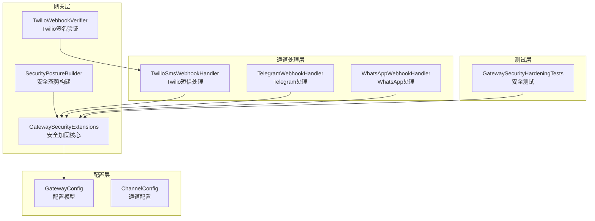

**图表来源**
- [GatewaySecurityExtensions.cs:9-316](file://src/OpenClaw.Gateway/Extensions/GatewaySecurityExtensions.cs#L9-L316)
- [GatewayConfig.cs:331-745](file://src/OpenClaw.Core/Models/GatewayConfig.cs#L331-L745)

## 核心组件

### EnforcePublicBindHardening 方法

`EnforcePublicBindHardening` 是公共绑定安全加固的核心方法，它执行以下关键检查：

#### 主要检查流程

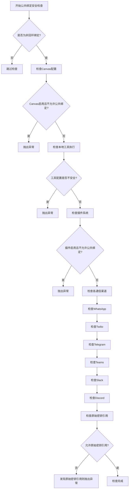

**图表来源**
- [GatewaySecurityExtensions.cs:29-218](file://src/OpenClaw.Gateway/Extensions/GatewaySecurityExtensions.cs#L29-L218)

### 安全配置模型

安全加固机制依赖于以下关键配置项：

| 配置项 | 默认值 | 描述 |
|--------|--------|------|
| `Security.StrictPublicBindProfile` | false | 启用严格公共绑定配置文件 |
| `Security.AllowUnsafeToolingOnPublicBind` | false | 允许在公共绑定上使用不安全工具 |
| `Security.AllowPluginBridgeOnPublicBind` | false | 允许在公共绑定上执行第三方插件 |
| `Security.AllowRawSecretRefsOnPublicBind` | false | 允许在公共绑定上使用原始密钥引用 |

**章节来源**
- [GatewayConfig.cs:331-369](file://src/OpenClaw.Core/Models/GatewayConfig.cs#L331-L369)

## 架构概览

公共绑定安全加固机制在整个系统架构中的位置如下：

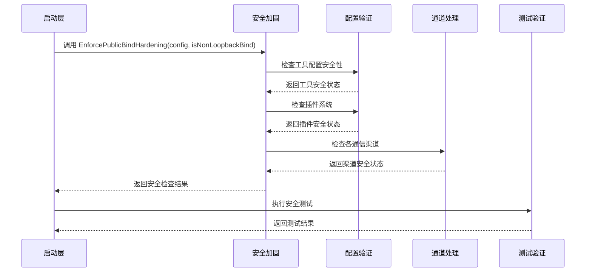

**图表来源**
- [architecture-startup-refactor.md:1-33](file://docs/architecture-startup-refactor.md#L1-L33)
- [openclaw-gateway-startup-layers.md:55-79](file://docs/openclaw-gateway-startup-layers.md#L55-L79)

## 详细组件分析

### WhatsApp 安全配置

#### 官方云 API 模式
当使用官方云 API 模式时，必须满足以下要求：

1. **签名验证**：必须启用 `ValidateSignature=true`
2. **应用密钥**：必须配置 `WebhookAppSecretRef` 或 `WebhookAppSecret`
3. **公共基础URL**：必须设置 `WebhookPublicBaseUrl`

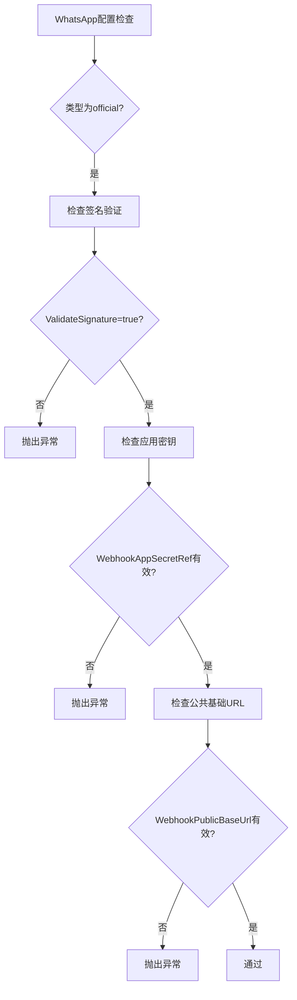

**图表来源**
- [GatewaySecurityExtensions.cs:64-83](file://src/OpenClaw.Gateway/Extensions/GatewaySecurityExtensions.cs#L64-L83)

#### 桥接模式
桥接模式需要配置 `BridgeTokenRef` 或 `BridgeToken`：

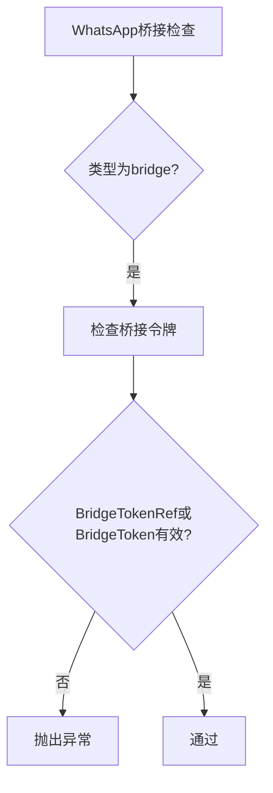

**图表来源**
- [GatewaySecurityExtensions.cs:84-94](file://src/OpenClaw.Gateway/Extensions/GatewaySecurityExtensions.cs#L84-L94)

### Twilio 短信安全配置

Twilio 短信通道的安全要求包括：

1. **签名验证**：必须启用 `ValidateSignature=true`
2. **公共基础URL**：必须设置 `WebhookPublicBaseUrl`
3. **认证令牌**：必须配置 `AuthTokenRef`

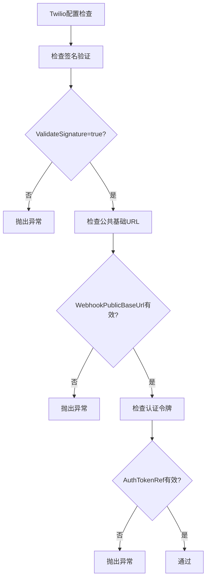

**图表来源**
- [GatewaySecurityExtensions.cs:104-126](file://src/OpenClaw.Gateway/Extensions/GatewaySecurityExtensions.cs#L104-L126)

### Telegram 安全配置

Telegram 通道的安全要求：

1. **签名验证**：必须启用 `ValidateSignature=true`
2. **Webhook密钥**：必须配置 `WebhookSecretTokenRef` 或 `WebhookSecretToken`

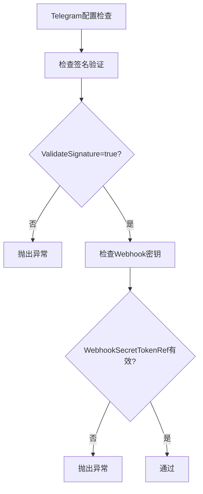

**图表来源**
- [GatewaySecurityExtensions.cs:128-145](file://src/OpenClaw.Gateway/Extensions/GatewaySecurityExtensions.cs#L128-L145)

### Teams 安全配置

Teams 通道的安全要求：

1. **令牌验证**：必须启用 `ValidateToken=true`
2. **完整凭据**：必须配置 `AppId/AppIdRef`、`AppPassword/AppPasswordRef` 和 `TenantId/TenantIdRef`

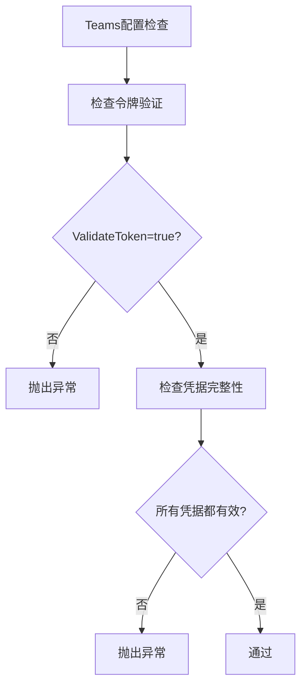

**图表来源**
- [GatewaySecurityExtensions.cs:147-167](file://src/OpenClaw.Gateway/Extensions/GatewaySecurityExtensions.cs#L147-L167)

### Slack 安全配置

Slack 通道的安全要求：

1. **签名验证**：必须启用 `ValidateSignature=true`
2. **签名密钥**：必须配置 `SigningSecretRef` 或 `SigningSecret`

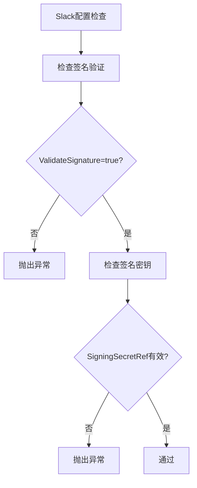

**图表来源**
- [GatewaySecurityExtensions.cs:169-185](file://src/OpenClaw.Gateway/Extensions/GatewaySecurityExtensions.cs#L169-L185)

### Discord 安全配置

Discord 通道的安全要求：

1. **签名验证**：必须启用 `ValidateSignature=true`
2. **公钥**：必须配置 `PublicKeyRef` 或 `PublicKey`

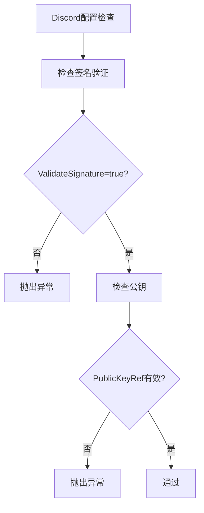

**图表来源**
- [GatewaySecurityExtensions.cs:187-203](file://src/OpenClaw.Gateway/Extensions/GatewaySecurityExtensions.cs#L187-L203)

### 原始密钥引用检查

系统会自动检测配置中的原始密钥引用 (`raw:`)，并阻止其在公共绑定上使用：

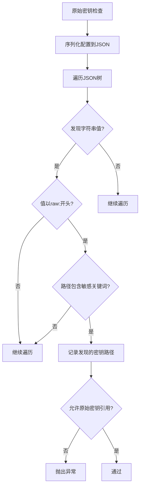

**图表来源**
- [GatewaySecurityExtensions.cs:238-292](file://src/OpenClaw.Gateway/Extensions/GatewaySecurityExtensions.cs#L238-L292)

## 依赖关系分析

### 组件间依赖关系

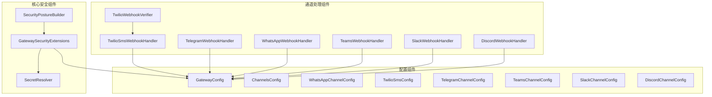

**图表来源**
- [GatewaySecurityExtensions.cs:1-316](file://src/OpenClaw.Gateway/Extensions/GatewaySecurityExtensions.cs#L1-L316)
- [GatewayConfig.cs:534-745](file://src/OpenClaw.Core/Models/GatewayConfig.cs#L534-L745)

### 错误处理机制

系统采用统一的异常处理机制：

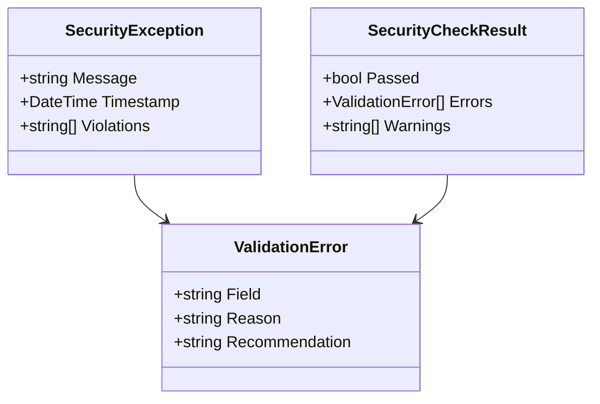

**图表来源**
- [GatewaySecurityExtensions.cs:34-217](file://src/OpenClaw.Gateway/Extensions/GatewaySecurityExtensions.cs#L34-L217)

**章节来源**
- [GatewaySecurityExtensions.cs:1-316](file://src/OpenClaw.Gateway/Extensions/GatewaySecurityExtensions.cs#L1-L316)
- [GatewayConfig.cs:534-745](file://src/OpenClaw.Core/Models/GatewayConfig.cs#L534-L745)

## 性能考虑

### 安全检查性能优化

1. **早期失败**：安全检查采用早期失败策略，一旦发现违规立即停止
2. **短路评估**：使用短路逻辑避免不必要的检查
3. **内存优化**：原始密钥检查限制最大发现数量（8个）
4. **异步处理**：签名验证采用固定时间比较算法

### 配置验证性能

- JSON序列化仅在需要时进行
- 路径匹配使用高效的字符串包含检查
- 缓存常用的配置值

## 故障排除指南

### 常见问题及解决方案

#### Canvas 命令转发被拒绝
**问题**：Canvas 已启用但不允许在公共绑定上使用
**解决方案**：设置 `OpenClaw:Canvas:AllowOnPublicBind=true` 或禁用 Canvas

#### 不安全工具执行被拒绝
**问题**：Shell 或进程执行在公共绑定上被拒绝
**解决方案**：
- 设置 `OpenClaw:Security:AllowUnsafeToolingOnPublicBind=true`
- 或者限制 `AllowedReadRoots` 和 `AllowedWriteRoots`
- 或者使用沙箱执行

#### 第三方插件执行被拒绝
**问题**：第三方插件在公共绑定上被拒绝
**解决方案**：设置 `OpenClaw:Security:AllowPluginBridgeOnPublicBind=true`

#### WhatsApp 签名验证失败
**问题**：WhatsApp Webhook 签名验证失败
**解决方案**：
- 设置 `OpenClaw:Channels:WhatsApp:ValidateSignature=true`
- 配置 `WebhookAppSecretRef` 或 `WebhookAppSecret`
- 设置 `WebhookPublicBaseUrl`

#### Twilio 短信签名验证失败
**问题**：Twilio SMS Webhook 签名验证失败
**解决方案**：
- 设置 `OpenClaw:Channels:Sms:Twilio:ValidateSignature=true`
- 设置 `WebhookPublicBaseUrl`
- 配置 `AuthTokenRef`

#### Telegram 签名验证失败
**问题**：Telegram Webhook 签名验证失败
**解决方案**：
- 设置 `OpenClaw:Channels:Telegram:ValidateSignature=true`
- 配置 `WebhookSecretTokenRef` 或 `WebhookSecretToken`

#### Teams 令牌验证失败
**问题**：Teams 入站 Webhook 令牌验证失败
**解决方案**：
- 设置 `OpenClaw:Channels:Teams:ValidateToken=true`
- 配置完整的凭据：`AppId/AppIdRef`、`AppPassword/AppPasswordRef`、`TenantId/TenantIdRef`

#### Discord 签名验证失败
**问题**：Discord 交互签名验证失败
**解决方案**：
- 设置 `OpenClaw:Channels:Discord:ValidateSignature=true`
- 配置 `PublicKeyRef` 或 `PublicKey`

#### 原始密钥引用被拒绝
**问题**：配置中包含原始密钥引用 (`raw:`)
**解决方案**：
- 使用 `env:` 或系统密钥存储
- 或者设置 `OpenClaw:Security:AllowRawSecretRefsOnPublicBind=true`

### 调试技巧

1. **启用详细日志**：查看安全检查的详细输出
2. **使用 doctor 模式**：运行 `--doctor` 获取完整的健康检查报告
3. **检查配置文件**：验证所有必需的安全配置项
4. **验证签名算法**：确保签名验证算法正确实现

**章节来源**
- [GatewaySecurityHardeningTests.cs:34-232](file://src/OpenClaw.Tests/GatewaySecurityHardeningTests.cs#L34-L232)
- [ChannelReadinessEvaluator.cs:95-146](file://src/OpenClaw.Gateway/ChannelReadinessEvaluator.cs#L95-L146)

## 结论

公共绑定安全加固机制通过 `EnforcePublicBindHardening` 方法实现了多层次的安全防护，确保系统在互联网公开部署时的安全性。该机制的关键优势包括：

1. **全面覆盖**：涵盖工具执行、插件系统、通信渠道和密钥管理等各个方面
2. **灵活配置**：提供明确的选择加入机制，允许有经验的操作员在充分理解风险的情况下进行配置
3. **自动化检测**：自动检测配置中的安全问题，减少人为疏忽
4. **清晰的错误信息**：提供具体的错误描述和修复建议

通过遵循本文档的安全配置指南和最佳实践，可以确保 OpenClaw 网关在公共绑定环境中的安全运行。