# 安全策略与配置

<cite>
**本文档引用的文件**
- [appsettings.json](file://src/OpenClaw.Gateway/appsettings.json)
- [GatewaySecurity.cs](file://src/OpenClaw.Gateway/GatewaySecurity.cs)
- [SecurityPostureBuilder.cs](file://src/OpenClaw.Gateway/SecurityPostureBuilder.cs)
- [GatewayConfig.cs](file://src/OpenClaw.Core/Models/GatewayConfig.cs)
- [AllowlistManager.cs](file://src/OpenClaw.Core/Security/AllowlistManager.cs)
- [AllowlistPolicy.cs](file://src/OpenClaw.Core/Security/AllowlistPolicy.cs)
- [SecretResolver.cs](file://src/OpenClaw.Core/Security/SecretResolver.cs)
- [InputSanitizer.cs](file://src/OpenClaw.Core/Security/InputSanitizer.cs)
- [UrlSafetyValidator.cs](file://src/OpenClaw.Core/Security/UrlSafetyValidator.cs)
- [PairingManager.cs](file://src/OpenClaw.Core/Security/PairingManager.cs)
- [RedactionPipeline.cs](file://src/OpenClaw.Core/Security/RedactionPipeline.cs)
- [SentinelSubstitution.cs](file://src/OpenClaw.Core/Security/SentinelSubstitution.cs)
- [GatewaySecurityHardeningTests.cs](file://src/OpenClaw.Tests/GatewaySecurityHardeningTests.cs)
- [AllowlistPolicyTests.cs](file://src/OpenClaw.Tests/AllowlistPolicyTests.cs)
</cite>

## 目录
1. [简介](#简介)
2. [项目结构](#项目结构)
3. [核心组件](#核心组件)
4. [架构总览](#架构总览)
5. [详细组件分析](#详细组件分析)
6. [依赖关系分析](#依赖关系分析)
7. [性能考量](#性能考量)
8. [故障排除指南](#故障排除指南)
9. [结论](#结论)
10. [附录](#附录)

## 简介
本文件面向安全策略与配置系统，围绕严格公共绑定配置、安全硬化的实施策略与默认安全设置展开，系统性阐述工具执行审批要求、插件桥接安全控制、秘密引用的安全管理，并提供安全配置参数详解、风险评估与合规建议、最佳实践与常见漏洞防护措施。文档同时给出可视化架构图与流程图，帮助读者快速理解与落地。

## 项目结构
安全相关能力主要分布在以下模块：
- 配置模型层：定义安全配置项（如严格公共绑定、跨域、代理信任、工具审批等）
- 网关安全层：令牌解析、签名验证、HMAC校验、绑定地址判定
- 安全策略构建器：基于部署环境生成安全态势报告与风险提示
- 安全工具集：白名单管理、输入净化、URL安全校验、配对管理、敏感数据脱敏与哨兵替换
- 测试用例：覆盖严格公共绑定预设、原始密钥引用检测、插件桥接限制等

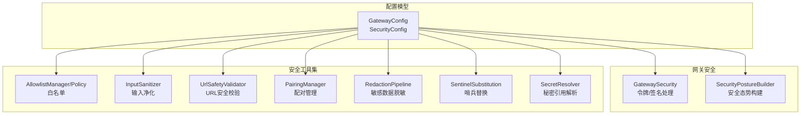

图表来源
- [GatewayConfig.cs:331-369](file://src/OpenClaw.Core/Models/GatewayConfig.cs#L331-L369)
- [GatewaySecurity.cs:1-109](file://src/OpenClaw.Gateway/GatewaySecurity.cs#L1-L109)
- [SecurityPostureBuilder.cs:1-169](file://src/OpenClaw.Gateway/SecurityPostureBuilder.cs#L1-L169)
- [AllowlistManager.cs:1-126](file://src/OpenClaw.Core/Security/AllowlistManager.cs#L1-L126)
- [InputSanitizer.cs:1-84](file://src/OpenClaw.Core/Security/InputSanitizer.cs#L1-L84)
- [UrlSafetyValidator.cs:1-219](file://src/OpenClaw.Core/Security/UrlSafetyValidator.cs#L1-L219)
- [PairingManager.cs:1-211](file://src/OpenClaw.Core/Security/PairingManager.cs#L1-L211)
- [RedactionPipeline.cs:1-131](file://src/OpenClaw.Core/Security/RedactionPipeline.cs#L1-L131)
- [SentinelSubstitution.cs:1-38](file://src/OpenClaw.Core/Security/SentinelSubstitution.cs#L1-L38)
- [SecretResolver.cs:1-66](file://src/OpenClaw.Core/Security/SecretResolver.cs#L1-L66)

章节来源
- [appsettings.json:82-102](file://src/OpenClaw.Gateway/appsettings.json#L82-L102)
- [GatewayConfig.cs:331-369](file://src/OpenClaw.Core/Models/GatewayConfig.cs#L331-L369)

## 核心组件
- 严格公共绑定配置：通过安全配置项在启动前应用更严格的默认值，强制审批与工具限制，避免在公网暴露高风险能力
- 安全硬化的实施策略：基于部署环境生成安全态势报告，识别风险并给出改进建议；对原始密钥引用、插件桥接、浏览器会话、工具审批等进行约束
- 默认安全设置：默认关闭公网可接受的高风险能力，要求显式开启并满足前置条件
- 工具执行审批：支持按工具类型强制审批、超时控制、请求者匹配等
- 插件桥接安全：限制第三方桥接插件在公网部署的风险，默认禁止或需要明确许可
- 秘密引用安全管理：统一解析机制，优先使用环境变量，禁止原始明文密钥在公网部署

章节来源
- [GatewayConfig.cs:331-369](file://src/OpenClaw.Core/Models/GatewayConfig.cs#L331-L369)
- [SecurityPostureBuilder.cs:11-139](file://src/OpenClaw.Gateway/SecurityPostureBuilder.cs#L11-L139)
- [SecretResolver.cs:14-66](file://src/OpenClaw.Core/Security/SecretResolver.cs#L14-L66)

## 架构总览
下图展示从配置到运行时安全策略的总体流程，包括严格公共绑定预设、安全态势构建与风险提示、以及关键安全控制点。

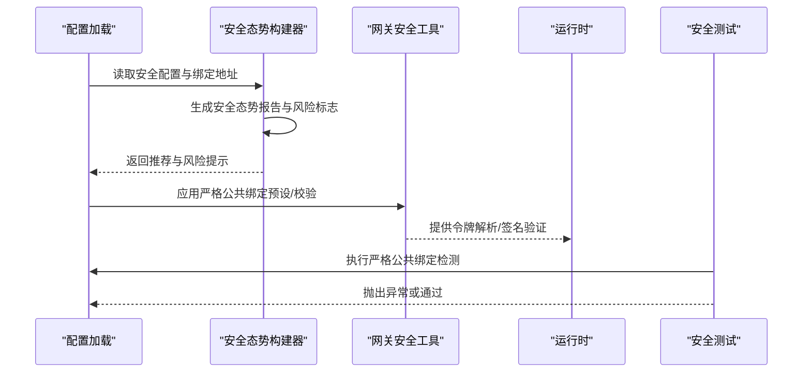

图表来源
- [SecurityPostureBuilder.cs:11-139](file://src/OpenClaw.Gateway/SecurityPostureBuilder.cs#L11-L139)
- [GatewaySecurity.cs:13-37](file://src/OpenClaw.Gateway/GatewaySecurity.cs#L13-L37)
- [GatewaySecurityHardeningTests.cs:242-257](file://src/OpenClaw.Tests/GatewaySecurityHardeningTests.cs#L242-L257)

## 详细组件分析

### 严格公共绑定配置与默认安全设置
- 严格公共绑定预设：当启用该功能且绑定到非回环地址时，自动收紧审批与工具默认值，例如强制HTTP工具审批需匹配原始请求者身份、默认要求工具审批、禁用Canvas命令转发等
- 公网部署安全门槛：默认不允许在公网暴露高风险能力，除非显式允许（如允许不安全工具、允许插件桥接、允许原始密钥引用等），并提供明确警告
- 运行时安全检查：启动阶段检测原始密钥引用、插件桥接、不安全本地工具执行等风险项，不符合要求则拒绝启动

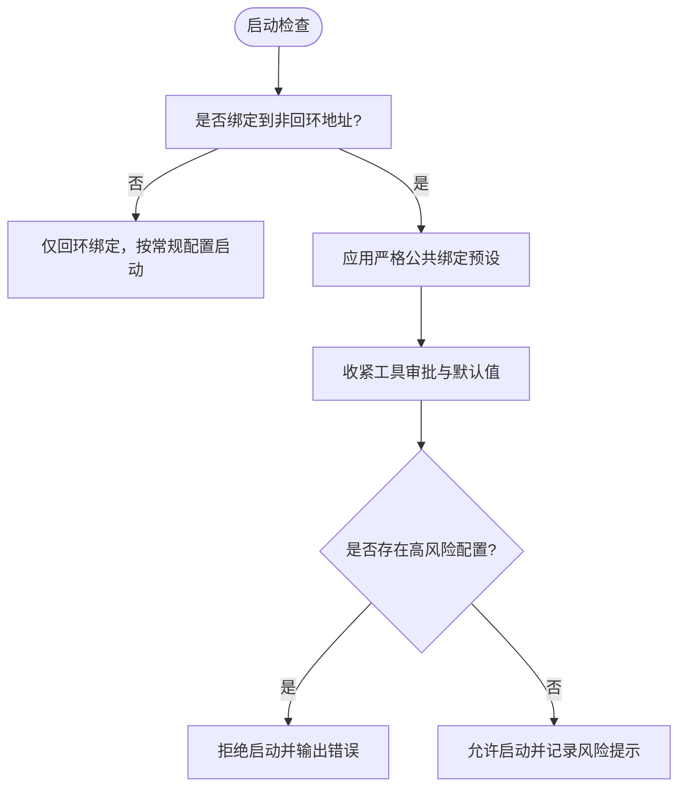

图表来源
- [SecurityPostureBuilder.cs:27-67](file://src/OpenClaw.Gateway/SecurityPostureBuilder.cs#L27-L67)
- [GatewaySecurityHardeningTests.cs:242-257](file://src/OpenClaw.Tests/GatewaySecurityHardeningTests.cs#L242-L257)

章节来源
- [SecurityPostureBuilder.cs:11-139](file://src/OpenClaw.Gateway/SecurityPostureBuilder.cs#L11-L139)
- [GatewaySecurityHardeningTests.cs:38-60](file://src/OpenClaw.Tests/GatewaySecurityHardeningTests.cs#L38-L60)

### 安全令牌与签名验证
- 令牌提取：支持从Authorization头或查询字符串中提取Bearer令牌（可配置）
- 固定时间比较：使用常量时间比较防止时序攻击
- HMAC-SHA256签名验证：支持带前缀的签名格式，进行十六进制解码与固定时间比较
- 适用场景：浏览器会话、外部回调签名验证、跨服务通信校验

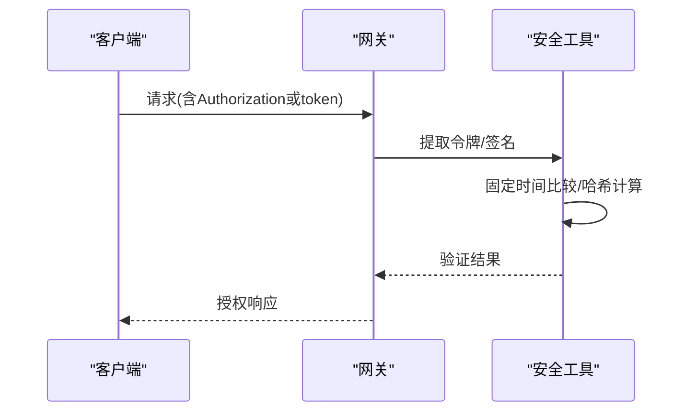

图表来源
- [GatewaySecurity.cs:13-76](file://src/OpenClaw.Gateway/GatewaySecurity.cs#L13-L76)

章节来源
- [GatewaySecurity.cs:13-76](file://src/OpenClaw.Gateway/GatewaySecurity.cs#L13-L76)

### 白名单管理与通道访问控制
- 动态白名单：支持按通道动态写入允许的发送方/接收方，持久化到磁盘，具备并发安全与原子更新
- 效果合并：动态文件优先于静态配置，未找到动态文件时回退到配置
- 语义选择：支持“传统”和“严格”两种语义，空列表在严格模式下拒绝所有，在传统模式下允许所有

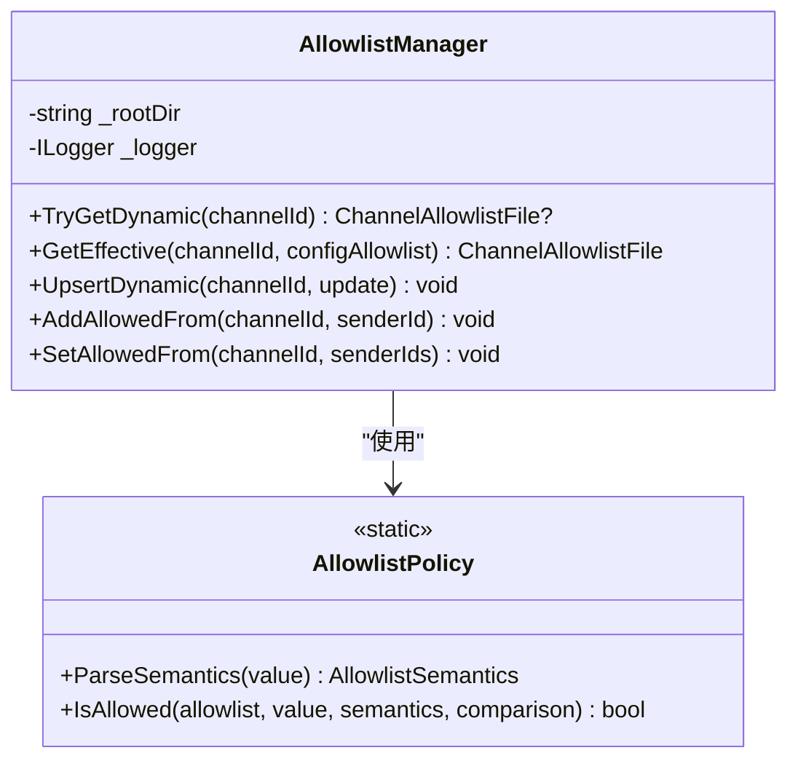

图表来源
- [AllowlistManager.cs:19-125](file://src/OpenClaw.Core/Security/AllowlistManager.cs#L19-L125)
- [AllowlistPolicy.cs:9-42](file://src/OpenClaw.Core/Security/AllowlistPolicy.cs#L9-L42)

章节来源
- [AllowlistManager.cs:19-125](file://src/OpenClaw.Core/Security/AllowlistManager.cs#L19-L125)
- [AllowlistPolicy.cs:9-42](file://src/OpenClaw.Core/Security/AllowlistPolicy.cs#L9-L42)
- [AllowlistPolicyTests.cs:8-32](file://src/OpenClaw.Tests/AllowlistPolicyTests.cs#L8-L32)

### 输入净化与路径安全
- Shell元字符检测：阻止危险字符组合，防止命令注入
- CRLF剥离：IMAP/SMTP协议输入中剥离换行符，防止注入
- 内存键名校验：禁止路径遍历与空字符
- IMAP文件夹名校验：禁止控制字符

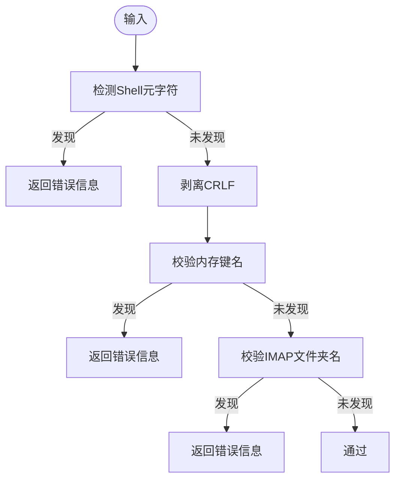

图表来源
- [InputSanitizer.cs:24-82](file://src/OpenClaw.Core/Security/InputSanitizer.cs#L24-L82)

章节来源
- [InputSanitizer.cs:9-84](file://src/OpenClaw.Core/Security/InputSanitizer.cs#L9-L84)

### URL安全校验
- 支持绝对http(s)URL校验，内置阻断主机规则（如localhost、metadata）
- 可配置阻断私有网络目标与CIDR段
- DNS解析失败与无地址情况均阻断
- 地址归一化与CIDR匹配算法

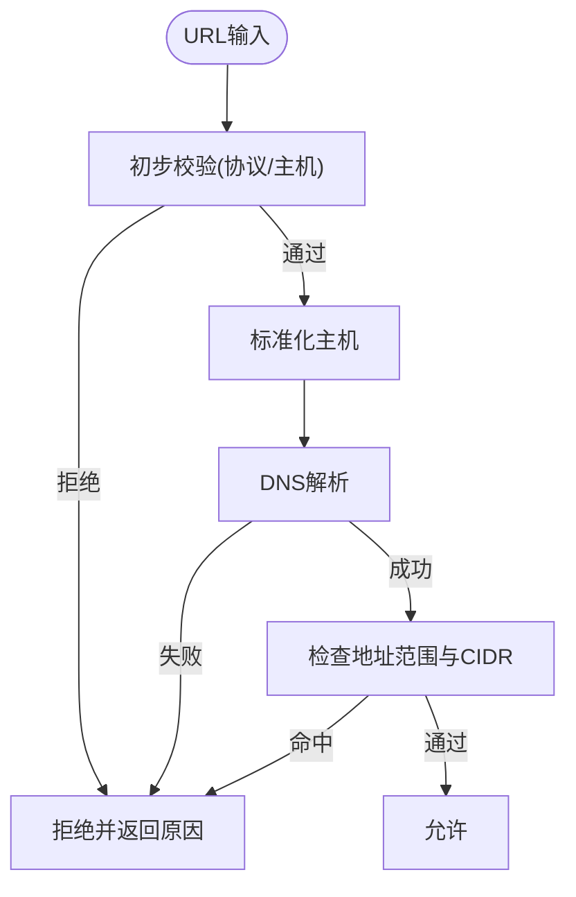

图表来源
- [UrlSafetyValidator.cs:27-135](file://src/OpenClaw.Core/Security/UrlSafetyValidator.cs#L27-L135)

章节来源
- [UrlSafetyValidator.cs:17-219](file://src/OpenClaw.Core/Security/UrlSafetyValidator.cs#L17-L219)

### 配对管理与通道访问控制
- 一次性6位数字配对码，带过期与失败尝试冷却
- 固定时间比较防止时序攻击
- 持久化已批准发送方列表，重启后保留
- 支持管理员手动批准与撤销

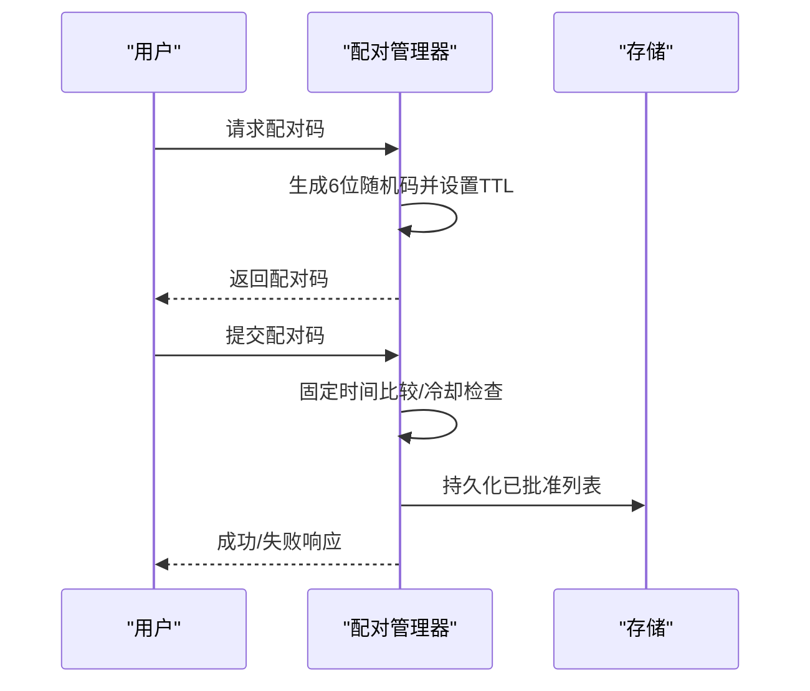

图表来源
- [PairingManager.cs:53-124](file://src/OpenClaw.Core/Security/PairingManager.cs#L53-L124)

章节来源
- [PairingManager.cs:14-211](file://src/OpenClaw.Core/Security/PairingManager.cs#L14-L211)

### 敏感数据脱敏与哨兵替换
- 脱敏流水线：多级脱敏器串联，支持会话级脱敏
- 基线脱敏器：识别Authorization Bearer、OpenAI密钥、API Key字段并替换
- 哨兵替换：在执行与持久化阶段分别替换参数，避免泄露

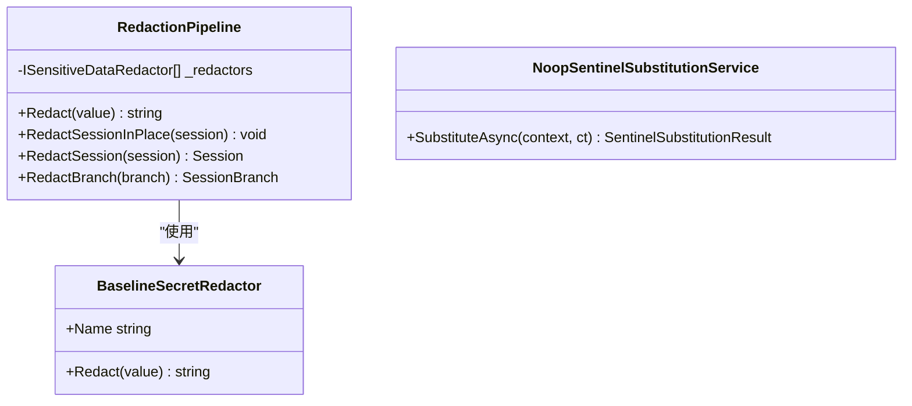

图表来源
- [RedactionPipeline.cs:21-131](file://src/OpenClaw.Core/Security/RedactionPipeline.cs#L21-L131)
- [SentinelSubstitution.cs:23-37](file://src/OpenClaw.Core/Security/SentinelSubstitution.cs#L23-L37)

章节来源
- [RedactionPipeline.cs:21-131](file://src/OpenClaw.Core/Security/RedactionPipeline.cs#L21-L131)
- [SentinelSubstitution.cs:16-37](file://src/OpenClaw.Core/Security/SentinelSubstitution.cs#L16-L37)

### 秘密引用解析与安全策略
- 统一解析：支持env:VAR_NAME、raw:literal、裸字符串（回退到环境变量）三种形式
- 公网安全：默认禁止raw:密钥引用，严格公共绑定预设会检测并拒绝
- 一致性：工具与网关共享同一实现，确保行为一致

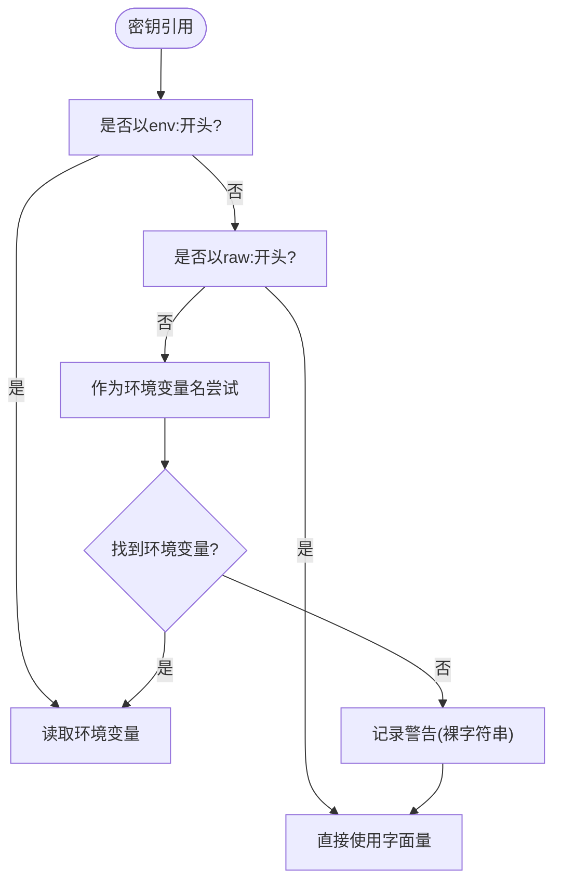

图表来源
- [SecretResolver.cs:24-54](file://src/OpenClaw.Core/Security/SecretResolver.cs#L24-L54)

章节来源
- [SecretResolver.cs:14-66](file://src/OpenClaw.Core/Security/SecretResolver.cs#L14-L66)
- [SecurityPostureBuilder.cs:151-164](file://src/OpenClaw.Gateway/SecurityPostureBuilder.cs#L151-L164)

## 依赖关系分析
- 配置驱动安全：GatewayConfig中的SecurityConfig决定严格公共绑定、跨域、代理信任、工具审批等策略
- 安全态势构建器依赖运行时状态与配置，生成风险标志与建议
- 网关安全工具依赖配置决定令牌与签名策略
- 各安全工具相互独立但共同构成纵深防御

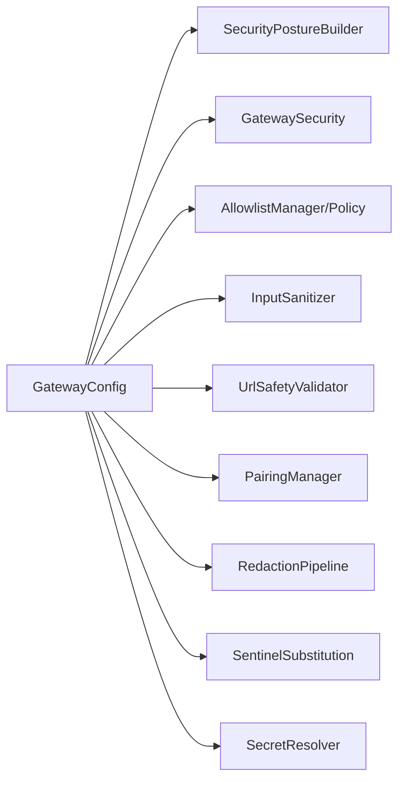

图表来源
- [GatewayConfig.cs:331-369](file://src/OpenClaw.Core/Models/GatewayConfig.cs#L331-L369)
- [SecurityPostureBuilder.cs:9-169](file://src/OpenClaw.Gateway/SecurityPostureBuilder.cs#L9-L169)
- [GatewaySecurity.cs:8-109](file://src/OpenClaw.Gateway/GatewaySecurity.cs#L8-L109)

章节来源
- [GatewayConfig.cs:331-369](file://src/OpenClaw.Core/Models/GatewayConfig.cs#L331-L369)
- [SecurityPostureBuilder.cs:9-169](file://src/OpenClaw.Gateway/SecurityPostureBuilder.cs#L9-L169)

## 性能考量
- 固定时间比较与哈希计算采用常量时间算法，避免时序侧信道
- URL安全校验在必要时进行DNS解析，建议合理配置阻断列表减少解析开销
- 脱敏与替换操作在执行前后进行，注意JSON序列化/反序列化的成本
- 白名单与配对管理使用原子写入与并发锁，保证一致性的同时控制竞争

## 故障排除指南
- 启动被拒绝（严格公共绑定）：检查是否启用了严格公共绑定预设，确认工具审批、插件桥接、原始密钥引用等高风险配置是否符合要求
- 令牌/签名验证失败：确认Authorization头格式、签名前缀、十六进制编码正确性
- URL访问被阻断：检查URL安全配置、DNS解析、私有网络阻断与CIDR规则
- 输入校验报错：检查是否包含Shell元字符、CRLF、路径遍历或控制字符
- 配对失败：确认配对码未过期、失败次数未达上限、固定时间比较通过

章节来源
- [GatewaySecurityHardeningTests.cs:38-60](file://src/OpenClaw.Tests/GatewaySecurityHardeningTests.cs#L38-L60)
- [GatewaySecurity.cs:39-76](file://src/OpenClaw.Gateway/GatewaySecurity.cs#L39-L76)
- [UrlSafetyValidator.cs:27-135](file://src/OpenClaw.Core/Security/UrlSafetyValidator.cs#L27-L135)
- [InputSanitizer.cs:24-82](file://src/OpenClaw.Core/Security/InputSanitizer.cs#L24-L82)
- [PairingManager.cs:73-124](file://src/OpenClaw.Core/Security/PairingManager.cs#L73-L124)

## 结论
本安全策略与配置体系通过严格公共绑定预设、安全态势构建、统一的秘密引用解析与输入净化、URL安全校验、白名单与配对管理、敏感数据脱敏与哨兵替换等手段，形成完整的纵深防御。建议在公网部署时启用严格公共绑定预设，关闭高风险能力，使用环境变量管理密钥，完善工具审批与签名验证，并定期审查安全配置与风险提示。

## 附录

### 安全配置参数详解
- 严格公共绑定预设：启用后在启动前收紧审批与工具默认值
- 允许查询字符串令牌：是否允许从查询参数提取令牌
- 允许的来源域：CORS允许的Origin列表
- 信任转发头：是否信任X-Forwarded-*头，影响Cookie Secure判定
- 已知代理：与信任转发头配合使用的代理IP/CIDR
- HTTP工具审批需匹配请求者：强制HTTP工具审批必须携带原始请求者身份
- 允许不安全工具在公网绑定：仅在完全信任网络与令牌分发时启用
- 允许插件桥接在公网绑定：默认禁止，需显式允许
- 允许原始密钥引用在公网绑定：默认禁止，需显式允许
- 浏览器会话空闲分钟数与记住天数：浏览器管理员会话的生命周期

章节来源
- [GatewayConfig.cs:331-369](file://src/OpenClaw.Core/Models/GatewayConfig.cs#L331-L369)
- [appsettings.json:82-102](file://src/OpenClaw.Gateway/appsettings.json#L82-L102)