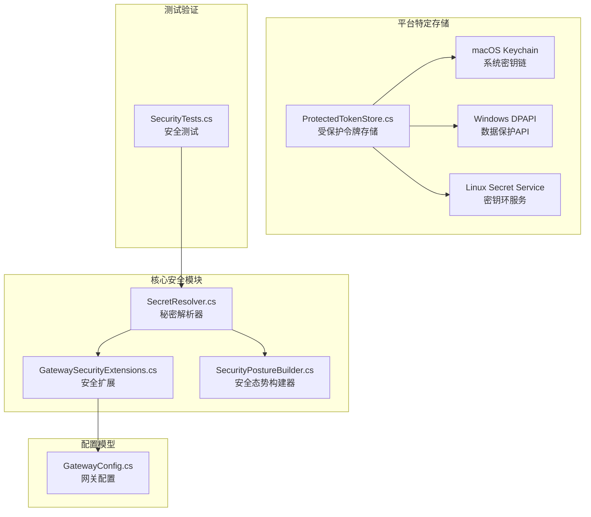
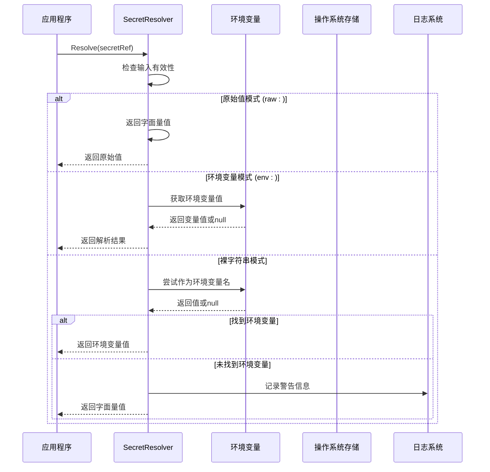
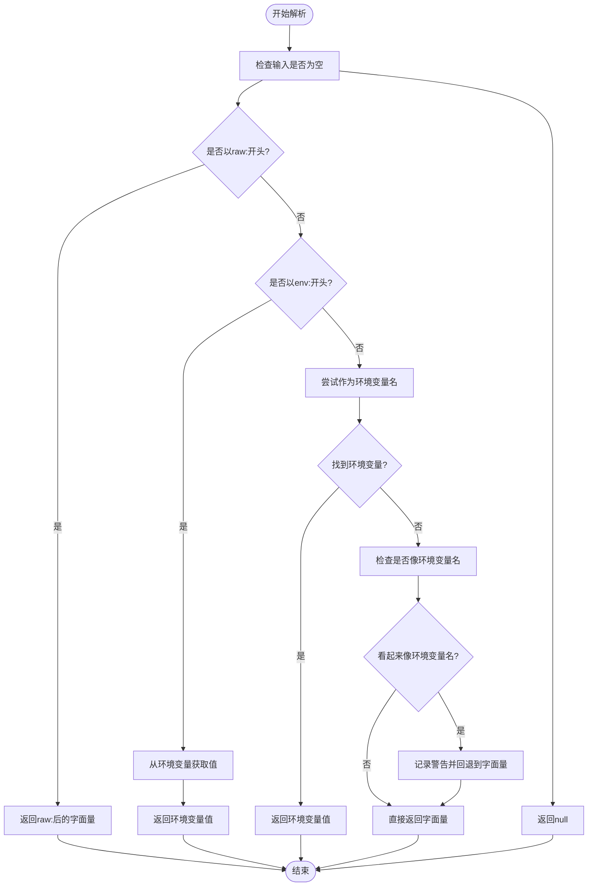
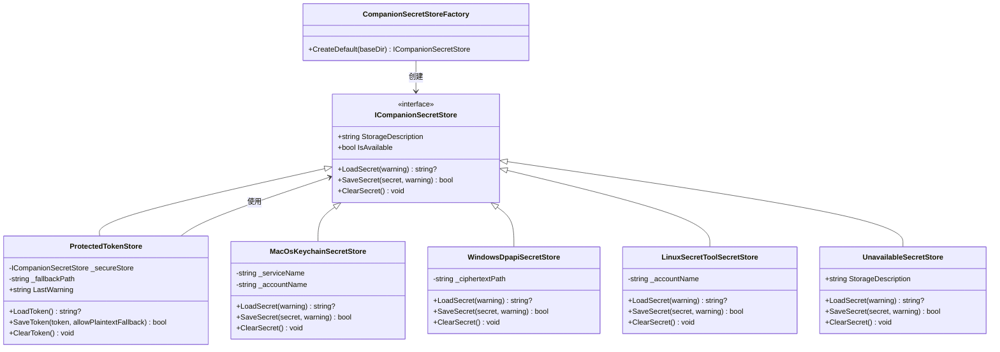
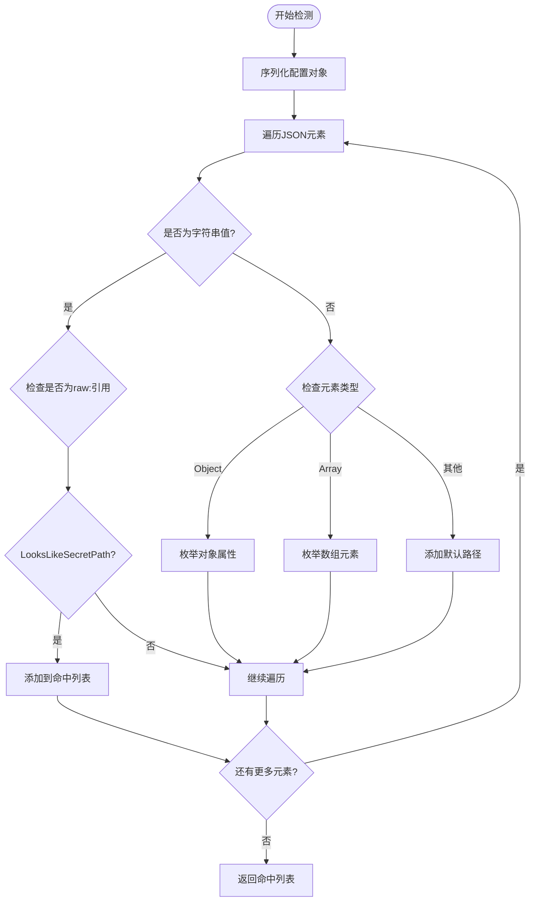
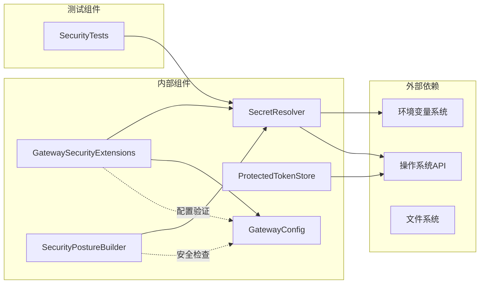

# 秘密管理与安全存储

<cite>
**本文档引用的文件**
- [SecretResolver.cs](file://src/OpenClaw.Core/Security/SecretResolver.cs)
- [GatewaySecurityExtensions.cs](file://src/OpenClaw.Gateway/Extensions/GatewaySecurityExtensions.cs)
- [SecurityTests.cs](file://src/OpenClaw.Tests/SecurityTests.cs)
- [GatewayConfig.cs](file://src/OpenClaw.Core/Models/GatewayConfig.cs)
- [ProtectedTokenStore.cs](file://src/OpenClaw.Companion/Services/ProtectedTokenStore.cs)
- [SecurityPostureBuilder.cs](file://src/OpenClaw.Gateway/SecurityPostureBuilder.cs)
</cite>

## 目录
1. [简介](#简介)
2. [项目结构](#项目结构)
3. [核心组件](#核心组件)
4. [架构概览](#架构概览)
5. [详细组件分析](#详细组件分析)
6. [依赖关系分析](#依赖关系分析)
7. [性能考虑](#性能考虑)
8. [故障排除指南](#故障排除指南)
9. [最佳实践](#最佳实践)
10. [结论](#结论)

## 简介

本文件详细介绍了 OpenClaw 项目中的秘密管理系统与安全存储机制。该系统提供了统一的秘密解析器（SecretResolver），支持多种秘密存储方式，包括环境变量、原始值和操作系统密钥链存储，并实现了严格的安全检查机制来防止敏感信息泄露。

系统的核心目标是：
- 提供统一的秘密解析接口
- 支持多平台安全存储
- 实施严格的公共绑定安全策略
- 防止原始秘密引用在生产环境中的误用

## 项目结构

秘密管理功能分布在多个关键模块中：

**图表来源**
- [SecretResolver.cs:1-66](file://src/OpenClaw.Core/Security/SecretResolver.cs#L1-L66)
- [GatewaySecurityExtensions.cs:1-317](file://src/OpenClaw.Gateway/Extensions/GatewaySecurityExtensions.cs#L1-L317)
- [ProtectedTokenStore.cs:121-136](file://src/OpenClaw.Companion/Services/ProtectedTokenStore.cs#L121-L136)

**章节来源**
- [SecretResolver.cs:1-66](file://src/OpenClaw.Core/Security/SecretResolver.cs#L1-L66)
- [GatewaySecurityExtensions.cs:1-317](file://src/OpenClaw.Gateway/Extensions/GatewaySecurityExtensions.cs#L1-L317)

## 核心组件

### SecretResolver - 统一秘密解析器

SecretResolver 是整个秘密管理系统的中央枢纽，提供三种秘密解析模式：

#### 解析模式

1. **环境变量模式 (`env:`前缀)**
   - 明确指定从环境变量读取
   - 语法：`env:ENVIRONMENT_VARIABLE_NAME`
   - 优点：明确性高，便于审计
   - 安全性：通过环境变量隔离

2. **原始值模式 (`raw:`前缀)**
   - 直接返回字面量值
   - 语法：`raw:your-secret-value`
   - 缺点：不推荐用于生产环境
   - 安全风险：可能被意外提交到版本控制

3. **裸字符串模式**
   - 默认行为，自动推断
   - 优先尝试作为环境变量名解析
   - 失败时回退到字面量值
   - 警告机制：对看起来像环境变量名的值发出警告

#### 关键方法

- `Resolve(string?)`: 基础解析方法
- `Resolve(string?, ILogger?)`: 带日志记录的解析
- `IsRawRef(string?)`: 检测原始引用类型

**章节来源**
- [SecretResolver.cs:5-66](file://src/OpenClaw.Core/Security/SecretResolver.cs#L5-L66)
- [SecurityTests.cs:11-52](file://src/OpenClaw.Tests/SecurityTests.cs#L11-L52)

## 架构概览

秘密管理系统采用分层架构设计，确保安全性和可维护性：

**图表来源**
- [SecretResolver.cs:24-54](file://src/OpenClaw.Core/Security/SecretResolver.cs#L24-L54)

## 详细组件分析

### SecretResolver 实现细节

#### 解析算法流程

**图表来源**
- [SecretResolver.cs:32-54](file://src/OpenClaw.Core/Security/SecretResolver.cs#L32-L54)

#### 安全性考虑

1. **输入验证**
   - 空值检查防止空引用异常
   - 前缀匹配确保解析逻辑正确性

2. **日志安全**
   - 警告消息不包含原始秘密内容
   - 长度信息用于帮助用户识别问题

3. **回退机制**
   - 环境变量不存在时的安全回退
   - 明确的错误状态传播

**章节来源**
- [SecretResolver.cs:19-66](file://src/OpenClaw.Core/Security/SecretResolver.cs#L19-L66)
- [SecurityTests.cs:54-84](file://src/OpenClaw.Tests/SecurityTests.cs#L54-L84)

### 平台特定密钥链存储

#### 受保护令牌存储架构

**图表来源**
- [ProtectedTokenStore.cs:82-136](file://src/OpenClaw.Companion/Services/ProtectedTokenStore.cs#L82-L136)
- [ProtectedTokenStore.cs:144-184](file://src/OpenClaw.Companion/Services/ProtectedTokenStore.cs#L144-L184)
- [ProtectedTokenStore.cs:361-431](file://src/OpenClaw.Companion/Services/ProtectedTokenStore.cs#L361-L431)
- [ProtectedTokenStore.cs:433-478](file://src/OpenClaw.Companion/Services/ProtectedTokenStore.cs#L433-L478)

#### 各平台实现特点

1. **macOS Keychain**
   - 使用系统安全框架
   - 基于服务名和账户名的命名空间
   - 支持密钥链项目管理

2. **Windows DPAPI**
   - 利用数据保护API
   - 用户范围加密
   - 自动密钥管理

3. **Linux Secret Service**
   - 通过 secret-tool 命令
   - GNOME Keyring 兼容
   - 命令行工具依赖检测

4. **不可用存储**
   - 回退机制
   - 清晰的错误报告
   - 支持明文回退选项

**章节来源**
- [ProtectedTokenStore.cs:121-136](file://src/OpenClaw.Companion/Services/ProtectedTokenStore.cs#L121-L136)
- [ProtectedTokenStore.cs:144-184](file://src/OpenClaw.Companion/Services/ProtectedTokenStore.cs#L144-L184)
- [ProtectedTokenStore.cs:361-431](file://src/OpenClaw.Companion/Services/ProtectedTokenStore.cs#L361-L431)
- [ProtectedTokenStore.cs:433-478](file://src/OpenClaw.Companion/Services/ProtectedTokenStore.cs#L433-L478)

### 公共绑定安全检查

#### FindRawSecretRefs - 原始秘密引用检测

**图表来源**
- [GatewaySecurityExtensions.cs:238-283](file://src/OpenClaw.Gateway/Extensions/GatewaySecurityExtensions.cs#L238-L283)

#### 安全策略实施

1. **严格公共绑定配置**
   - 禁止原始秘密引用
   - 强制工具审批要求
   - 限制第三方插件桥接

2. **通道安全验证**
   - Telegram Webhook 密钥验证
   - Twilio 认证令牌验证
   - Teams JWT 令牌验证
   - WhatsApp 签名验证

3. **安全态势评估**
   - 自动检测原始秘密引用
   - 生成修复建议
   - 提供安全配置指导

**章节来源**
- [GatewaySecurityExtensions.cs:11-27](file://src/OpenClaw.Gateway/Extensions/GatewaySecurityExtensions.cs#L11-L27)
- [GatewaySecurityExtensions.cs:205-218](file://src/OpenClaw.Gateway/Extensions/GatewaySecurityExtensions.cs#L205-L218)
- [SecurityPostureBuilder.cs:151-164](file://src/OpenClaw.Gateway/SecurityPostureBuilder.cs#L151-L164)

## 依赖关系分析

秘密管理系统的关键依赖关系：

**图表来源**
- [SecretResolver.cs:1-66](file://src/OpenClaw.Core/Security/SecretResolver.cs#L1-L66)
- [GatewaySecurityExtensions.cs:1-317](file://src/OpenClaw.Gateway/Extensions/GatewaySecurityExtensions.cs#L1-L317)
- [GatewayConfig.cs:331-369](file://src/OpenClaw.Core/Models/GatewayConfig.cs#L331-L369)

**章节来源**
- [GatewayConfig.cs:331-369](file://src/OpenClaw.Core/Models/GatewayConfig.cs#L331-L369)

## 性能考虑

### 解析性能优化

1. **字符串操作优化**
   - 使用 `StringComparison.OrdinalIgnoreCase` 进行大小写不敏感比较
   - 预分配列表容量避免动态扩容
   - 字符串切片操作最小化

2. **内存使用优化**
   - 环境变量值按需读取
   - 警告消息延迟生成
   - 空值快速返回

3. **平台特定优化**
   - 条件编译减少运行时开销
   - 命令行工具可用性缓存
   - 文件系统访问最小化

### 存储性能特性

1. **密钥链访问**
   - macOS Keychain 使用系统缓存
   - Windows DPAPI 利用内核优化
   - Linux Secret Service 命令异步执行

2. **错误处理**
   - 失败重试机制
   - 超时控制
   - 资源清理保证

## 故障排除指南

### 常见问题诊断

#### 环境变量相关问题

1. **环境变量未设置**
   - 症状：返回 null
   - 解决方案：检查环境变量名称和值
   - 验证：使用 `echo` 或 `Get-ChildItem Env:` 命令

2. **权限问题**
   - 症状：访问被拒绝
   - 解决方案：检查进程权限
   - 验证：确认用户具有读取权限

#### 平台特定问题

1. **macOS Keychain**
   - 症状：OSStatus 错误
   - 解决方案：检查 Keychain 访问权限
   - 验证：使用 Keychain Access 应用程序

2. **Windows DPAPI**
   - 症状：解密失败
   - 解决方案：确认当前用户上下文
   - 验证：检查 DataProtectionScope 设置

3. **Linux Secret Service**
   - 症状：命令不存在
   - 解决方案：安装 secret-tool 工具
   - 验证：运行 `which secret-tool`

#### 配置问题

1. **原始秘密引用检测**
   - 症状：启动时抛出异常
   - 解决方案：使用 `env:` 前缀或平台存储
   - 验证：检查配置文件中的引用格式

2. **安全策略冲突**
   - 症状：公共绑定被拒绝
   - 解决方案：启用允许标志或修改配置
   - 验证：查看安全态势报告

**章节来源**
- [SecurityTests.cs:54-84](file://src/OpenClaw.Tests/SecurityTests.cs#L54-L84)
- [GatewaySecurityExtensions.cs:205-218](file://src/OpenClaw.Gateway/Extensions/GatewaySecurityExtensions.cs#L205-L218)

## 最佳实践

### 环境变量配置最佳实践

#### 命名约定
1. **使用大写字母和下划线**
   - 示例：`OPENCLAW_SECRET_KEY`
   - 避免使用小写字母和连字符

2. **描述性命名**
   - 包含应用程序名称前缀
   - 明确用途和作用域

3. **版本控制安全**
   - 不要在代码库中硬编码敏感信息
   - 使用 `.env` 文件但排除在版本控制之外

#### 环境变量管理
1. **分层配置**
   - 开发环境：本地 `.env` 文件
   - 测试环境：CI/CD 环境变量
   - 生产环境：平台提供的密钥管理服务

2. **权限控制**
   - 最小权限原则
   - 分离读写权限
   - 定期轮换密钥

### 密钥链集成最佳实践

#### 平台选择策略
1. **macOS 优先**
   - 使用 Keychain Access 管理
   - 支持生物识别认证
   - 自动锁定和解锁

2. **Windows 环境**
   - 使用 DPAPI 进行用户级加密
   - 避免跨用户共享
   - 考虑域环境下的组策略

3. **Linux 环境**
   - 优先使用 GNOME Keyring
   - 备选方案：KWallet 或 KeePassXC
   - 确保桌面环境支持

#### 存储策略
1. **命名空间设计**
   - 使用应用程序特定的服务名
   - 基于用户或会话的账户名
   - 避免与其他应用程序冲突

2. **备份和恢复**
   - Keychain 备份策略
   - 恢复流程测试
   - 灾难恢复计划

### 安全存储策略

#### 配置文件安全
1. **前缀使用规范**
   - 生产环境必须使用 `env:` 前缀
   - 避免使用 `raw:` 前缀
   - 使用平台特定存储替代

2. **配置验证**
   - 启动时进行完整性检查
   - 定期安全审计
   - 异常行为监控

#### 访问控制
1. **最小权限原则**
   - 仅授予必要权限
   - 定期审查访问权限
   - 及时撤销不再需要的权限

2. **审计跟踪**
   - 记录所有密钥访问
   - 监控异常访问模式
   - 报告安全事件

#### 密钥管理
1. **生命周期管理**
   - 定期轮换密钥
   - 安全删除过期密钥
   - 密钥撤销流程

2. **加密传输**
   - 使用 HTTPS 和 TLS
   - 避免明文传输
   - 加密存储敏感数据

### 开发和部署最佳实践

#### 开发环境
1. **模拟环境**
   - 使用测试密钥进行开发
   - 避免使用真实生产密钥
   - 自动化密钥生成和管理

2. **代码审查**
   - 重点检查密钥使用
   - 安全编码规范
   - 第三方依赖安全评估

#### 生产环境
1. **基础设施即代码**
   - 使用 Terraform 或类似工具
   - 自动化密钥部署
   - 声明式配置管理

2. **监控和告警**
   - 密钥访问监控
   - 异常行为检测
   - 快速响应机制

#### 安全加固
1. **默认安全配置**
   - 严格公共绑定策略
   - 禁止原始秘密引用
   - 强制工具审批

2. **定期安全评估**
   - 渗透测试
   - 代码安全扫描
   - 第三方安全审计

**章节来源**
- [GatewayConfig.cs:358-362](file://src/OpenClaw.Core/Models/GatewayConfig.cs#L358-L362)
- [GatewaySecurityExtensions.cs:11-27](file://src/OpenClaw.Gateway/Extensions/GatewaySecurityExtensions.cs#L11-L27)

## 结论

OpenClaw 的秘密管理系统通过以下核心特性确保了系统的安全性：

1. **统一抽象层**：SecretResolver 提供了一致的秘密解析接口，简化了密钥管理复杂性

2. **多平台支持**：平台特定的密钥链存储确保了最佳的安全实践和用户体验

3. **严格安全策略**：公共绑定安全检查和原始秘密引用检测有效防止了敏感信息泄露

4. **全面的测试覆盖**：单元测试和集成测试确保了系统的可靠性和安全性

5. **最佳实践指导**：详细的配置指南和安全建议帮助开发者正确使用系统

该系统的设计充分考虑了现代应用的安全需求，在保持易用性的同时提供了企业级的安全保障。通过遵循本文档中的最佳实践，开发者可以构建更加安全可靠的应用程序。