# 通信渠道安全配置

<cite>
**本文档引用的文件**
- [WhatsAppWebhookHandler.cs](file://src/OpenClaw.Gateway/WhatsAppWebhookHandler.cs)
- [TwilioSmsWebhookHandler.cs](file://src/OpenClaw.Gateway/TwilioSmsWebhookHandler.cs)
- [TelegramWebhookHandler.cs](file://src/OpenClaw.Gateway/TelegramWebhookHandler.cs)
- [TeamsWebhookHandler.cs](file://src/OpenClaw.Gateway/TeamsWebhookHandler.cs)
- [SlackWebhookHandler.cs](file://src/OpenClaw.Gateway/SlackWebhookHandler.cs)
- [DiscordWebhookHandler.cs](file://src/OpenClaw.Gateway/DiscordWebhookHandler.cs)
- [TwilioWebhookVerifier.cs](file://src/OpenClaw.Gateway/TwilioWebhookVerifier.cs)
- [BotFrameworkTokenValidator.cs](file://src/OpenClaw.Gateway/BotFrameworkTokenValidator.cs)
- [Ed25519Verify.cs](file://src/OpenClaw.Gateway/Ed25519Verify.cs)
- [SecurityPostureBuilder.cs](file://src/OpenClaw.Gateway/SecurityPostureBuilder.cs)
- [ChannelReadinessEvaluator.cs](file://src/OpenClaw.Gateway/ChannelReadinessEvaluator.cs)
- [admin.html](file://src/OpenClaw.Gateway/wwwroot/admin.html)
- [GatewayAdminEndpointTests.cs](file://src/OpenClaw.Tests/GatewayAdminEndpointTests.cs)
- [TwilioSmsTests.cs](file://src/OpenClaw.Tests/TwilioSmsTests.cs)
- [TeamsWebhookHandlerTests.cs](file://src/OpenClaw.Tests/TeamsWebhookHandlerTests.cs)
- [GatewaySecurityHardeningTests.cs](file://src/OpenClaw.Tests/GatewaySecurityHardeningTests.cs)
- [ConfigValidatorTests.cs](file://src/OpenClaw.Tests/ConfigValidatorTests.cs)
- [GatewayConfig.cs](file://src/OpenClaw.Core/Models/GatewayConfig.cs)
</cite>

## 目录
1. [简介](#简介)
2. [项目结构](#项目结构)
3. [核心组件](#核心组件)
4. [架构概览](#架构概览)
5. [详细组件分析](#详细组件分析)
6. [依赖关系分析](#依赖关系分析)
7. [性能考虑](#性能考虑)
8. [故障排除指南](#故障排除指南)
9. [结论](#结论)

## 简介

本文档提供了通信渠道安全配置的综合指南，涵盖了多种主流通信平台的安全验证机制。该系统实现了严格的安全控制，确保只有经过身份验证和授权的消息才能进入消息管道。

系统支持以下通信渠道的安全配置：
- **WhatsApp**: 官方 Webhook 签名验证和桥接令牌验证
- **Twilio SMS**: 短信签名验证和速率限制
- **Telegram**: Webhook 秘密令牌验证
- **Teams**: JWT 验证和 Bot Framework 集成
- **Slack**: 签名验证和工作区/频道白名单
- **Discord**: 公钥验证和 Ed25519 数字签名

## 项目结构

系统采用模块化设计，每个通信渠道都有独立的处理器和验证器：

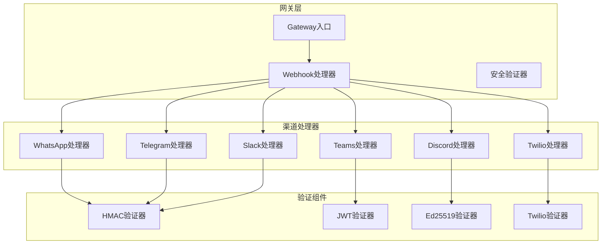

**图表来源**
- [WhatsAppWebhookHandler.cs:10-370](file://src/OpenClaw.Gateway/WhatsAppWebhookHandler.cs#L10-L370)
- [TwilioSmsWebhookHandler.cs:9-246](file://src/OpenClaw.Gateway/TwilioSmsWebhookHandler.cs#L9-L246)
- [TelegramWebhookHandler.cs:10-252](file://src/OpenClaw.Gateway/TelegramWebhookHandler.cs#L10-L252)

## 核心组件

### 安全验证架构

系统实现了统一的安全验证框架，支持多种验证机制：

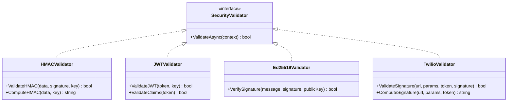

**图表来源**
- [BotFrameworkTokenValidator.cs:10-410](file://src/OpenClaw.Gateway/BotFrameworkTokenValidator.cs#L10-L410)
- [Ed25519Verify.cs:11-41](file://src/OpenClaw.Gateway/Ed25519Verify.cs#L11-L41)
- [TwilioWebhookVerifier.cs:6-40](file://src/OpenClaw.Gateway/TwilioWebhookVerifier.cs#L6-L40)

### 通道配置管理

每个渠道都支持灵活的配置选项，包括：

- **启用/禁用控制**: 每个渠道都有独立的启用开关
- **验证机制**: 支持多种验证方式（签名、令牌、JWT等）
- **白名单管理**: 支持用户ID、频道ID、工作区ID等多维度白名单
- **速率限制**: 针对不同渠道的速率限制和防刷机制
- **安全绑定**: 支持严格的安全绑定配置

**章节来源**
- [SecurityPostureBuilder.cs:141-147](file://src/OpenClaw.Gateway/SecurityPostureBuilder.cs#L141-L147)
- [ChannelReadinessEvaluator.cs:354-419](file://src/OpenClaw.Gateway/ChannelReadinessEvaluator.cs#L354-L419)

## 架构概览

系统采用分层架构设计，确保安全性和可维护性：

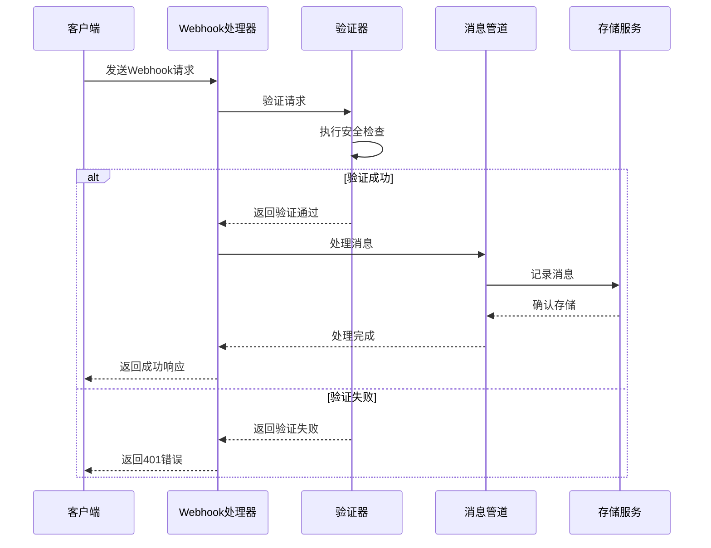

**图表来源**
- [WhatsAppWebhookHandler.cs:35-60](file://src/OpenClaw.Gateway/WhatsAppWebhookHandler.cs#L35-L60)
- [TwilioSmsWebhookHandler.cs:86-162](file://src/OpenClaw.Gateway/TwilioSmsWebhookHandler.cs#L86-L162)

## 详细组件分析

### WhatsApp 安全配置

#### 官方 Webhook 签名验证

WhatsApp 官方 Webhook 实现了基于 HMAC-SHA256 的签名验证：

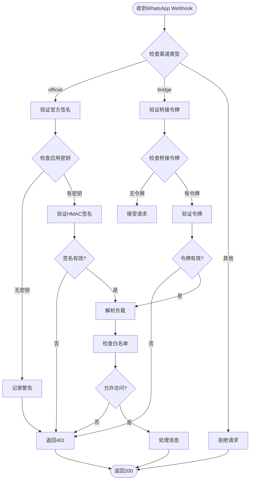

**图表来源**
- [WhatsAppWebhookHandler.cs:80-167](file://src/OpenClaw.Gateway/WhatsAppWebhookHandler.cs#L80-L167)
- [WhatsAppWebhookHandler.cs:328-347](file://src/OpenClaw.Gateway/WhatsAppWebhookHandler.cs#L328-L347)

#### 配置参数详解

| 参数 | 类型 | 描述 | 默认值 |
|------|------|------|--------|
| Enabled | bool | 启用WhatsApp渠道 | false |
| Type | string | 渠道类型：official/bridge | "official" |
| ValidateSignature | bool | 启用签名验证 | false |
| WebhookVerifyToken | string | 验证令牌 | "openclaw-verify" |
| WebhookAppSecret | string | 应用密钥 | null |
| BridgeToken | string | 桥接令牌 | null |
| MaxInboundChars | int | 最大输入字符数 | 4096 |

**章节来源**
- [admin.html:1970-1991](file://src/OpenClaw.Gateway/wwwroot/admin.html#L1970-L1991)
- [GatewayAdminEndpointTests.cs:6361-6385](file://src/OpenClaw.Tests/GatewayAdminEndpointTests.cs#L6361-L6385)

### Twilio SMS 安全配置

#### 短信签名验证机制

Twilio SMS 实现了基于 HMAC-SHA1 的签名验证：

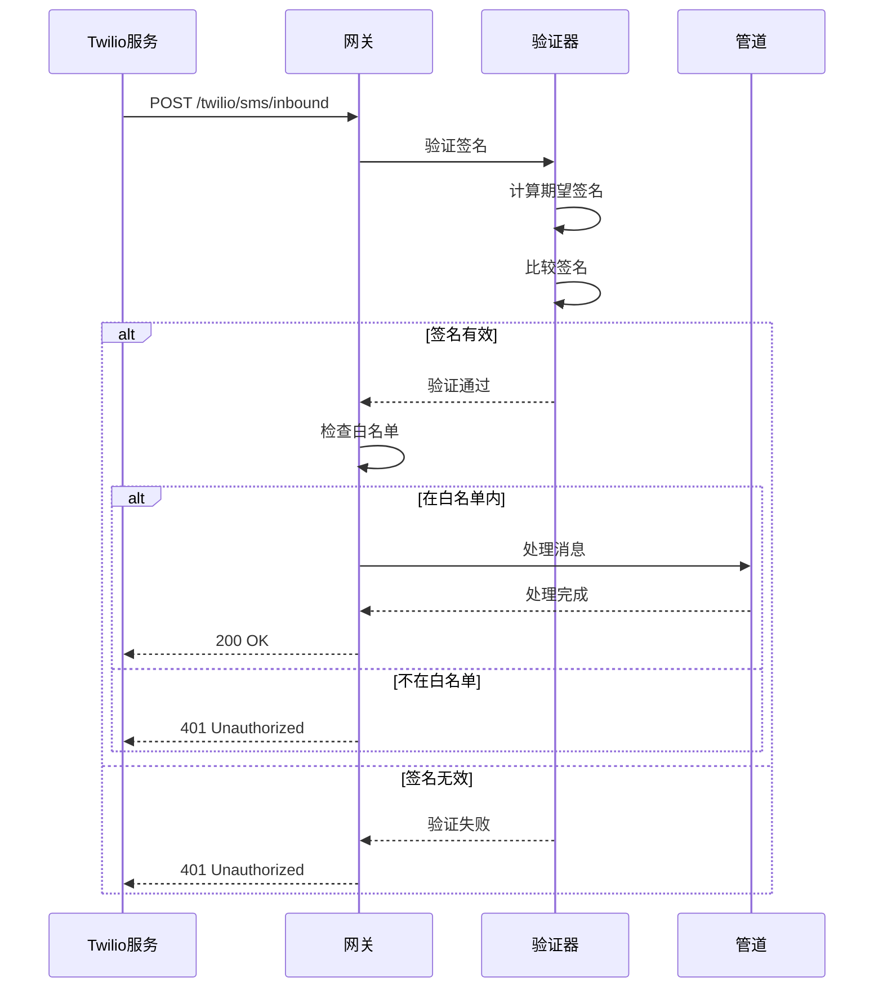

**图表来源**
- [TwilioSmsWebhookHandler.cs:86-162](file://src/OpenClaw.Gateway/TwilioSmsWebhookHandler.cs#L86-L162)
- [TwilioWebhookVerifier.cs:27-37](file://src/OpenClaw.Gateway/TwilioWebhookVerifier.cs#L27-L37)

#### 关键安全特性

1. **签名验证**: 使用 HMAC-SHA1 算法验证请求完整性
2. **白名单控制**: 支持发件人和收件人双向白名单
3. **速率限制**: 每分钟消息速率限制防止滥用
4. **关键字处理**: 支持 STOP/START/HELP 等关键字自动处理

**章节来源**
- [TwilioSmsTests.cs:18-94](file://src/OpenClaw.Tests/TwilioSmsTests.cs#L18-L94)

### Telegram 安全配置

#### Webhook 秘密令牌验证

Telegram Webhook 使用 X-Telegram-Bot-Api-Secret-Token 头部进行验证：

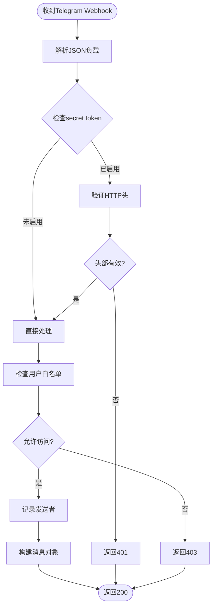

**图表来源**
- [TelegramWebhookHandler.cs:47-103](file://src/OpenClaw.Gateway/TelegramWebhookHandler.cs#L47-L103)

#### 配置参数

| 参数 | 类型 | 描述 | 默认值 |
|------|------|------|--------|
| Enabled | bool | 启用Telegram渠道 | false |
| ValidateSignature | bool | 启用秘密令牌验证 | false |
| WebhookSecretToken | string | 秘密令牌 | "env:TELEGRAM_WEBHOOK_SECRET" |
| AllowedFromUserIds | string[] | 允许的用户ID列表 | [] |
| MaxInboundChars | int | 最大输入字符数 | 4096 |

**章节来源**
- [GatewayConfig.cs:719-733](file://src/OpenClaw.Core/Models/GatewayConfig.cs#L719-L733)

### Teams 安全配置

#### JWT 验证机制

Teams 使用 Bot Framework 的 RS256 JWT 进行身份验证：

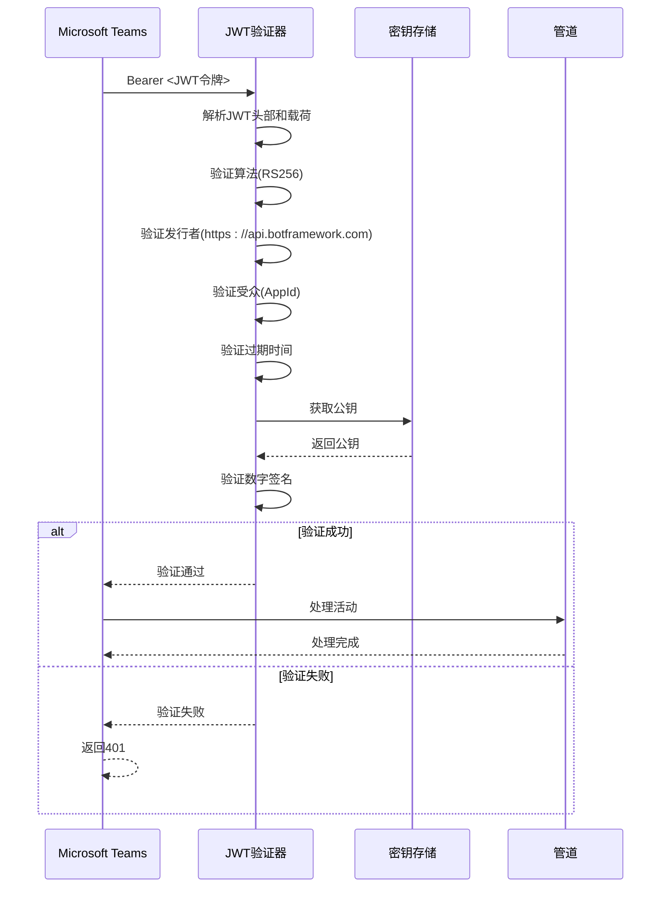

**图表来源**
- [BotFrameworkTokenValidator.cs:40-134](file://src/OpenClaw.Gateway/BotFrameworkTokenValidator.cs#L40-L134)

#### 高级安全特性

1. **动态密钥轮换**: 自动从 Bot Framework 获取最新公钥
2. **服务URL验证**: 确保令牌中的服务URL与请求匹配
3. **通道背书验证**: 验证密钥是否被特定通道背书
4. **时间戳校验**: 防止重放攻击的时间窗口验证

**章节来源**
- [TeamsWebhookHandlerTests.cs:229-262](file://src/OpenClaw.Tests/TeamsWebhookHandlerTests.cs#L229-L262)

### Slack 安全配置

#### 签名验证机制

Slack 使用 v0=HMAC-SHA256 签名验证：

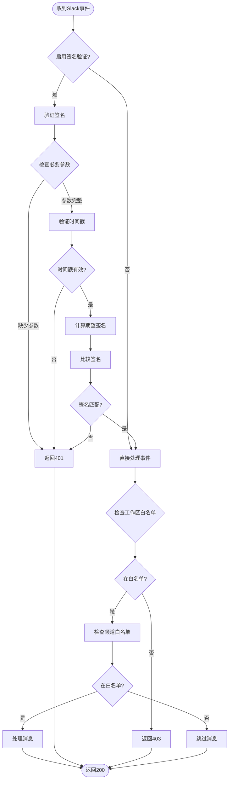

**图表来源**
- [SlackWebhookHandler.cs:42-154](file://src/OpenClaw.Gateway/SlackWebhookHandler.cs#L42-L154)
- [SlackWebhookHandler.cs:244-274](file://src/OpenClaw.Gateway/SlackWebhookHandler.cs#L244-L274)

#### 配置参数

| 参数 | 类型 | 描述 | 默认值 |
|------|------|------|--------|
| Enabled | bool | 启用Slack渠道 | false |
| ValidateSignature | bool | 启用签名验证 | false |
| SigningSecret | string | 签名密钥 | "env:SLACK_SIGNING_SECRET" |
| BotToken | string | Bot令牌 | "env:SLACK_BOT_TOKEN" |
| AllowedWorkspaceIds | string[] | 允许的工作区ID | [] |
| AllowedChannelIds | string[] | 允许的频道ID | [] |
| MaxInboundChars | int | 最大输入字符数 | 4096 |

**章节来源**
- [GatewayConfig.cs:735-745](file://src/OpenClaw.Core/Models/GatewayConfig.cs#L735-L745)

### Discord 安全配置

#### 公钥验证机制

Discord 使用 Ed25519 数字签名进行验证：

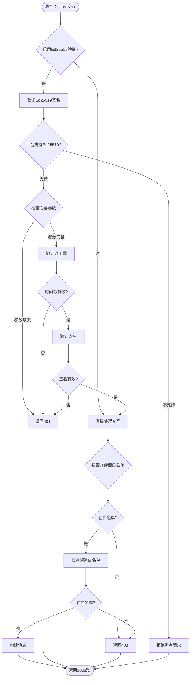

**图表来源**
- [DiscordWebhookHandler.cs:52-158](file://src/OpenClaw.Gateway/DiscordWebhookHandler.cs#L52-L158)
- [Ed25519Verify.cs:17-34](file://src/OpenClaw.Gateway/Ed25519Verify.cs#L17-L34)

#### 平台兼容性

系统检测 Ed25519 支持情况并提供相应的安全建议：

| 平台 | 支持状态 | 安全建议 |
|------|----------|----------|
| Windows | ✅ 支持 | 可以使用Ed25519验证 |
| Linux | ✅ 支持 | 可以使用Ed25519验证 |
| macOS | ✅ 支持 | 可以使用Ed25519验证 |
| 其他 | ❌ 不支持 | 建议禁用签名验证或添加Ed25519支持 |

**章节来源**
- [DiscordWebhookHandler.cs:42-45](file://src/OpenClaw.Gateway/DiscordWebhookHandler.cs#L42-L45)

## 依赖关系分析

系统实现了严格的依赖注入和安全验证：

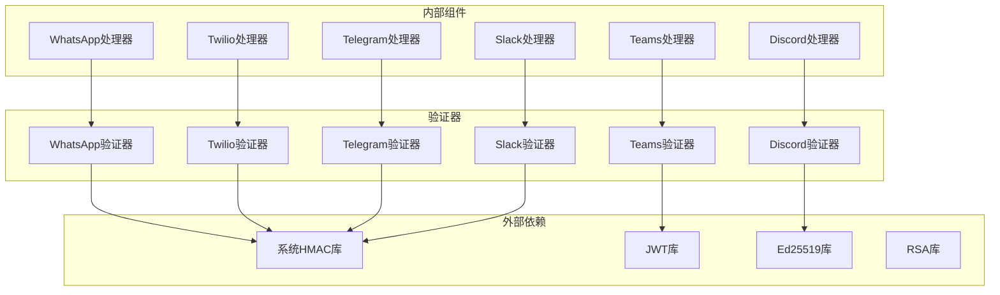

**图表来源**
- [BotFrameworkTokenValidator.cs:147-180](file://src/OpenClaw.Gateway/BotFrameworkTokenValidator.cs#L147-L180)
- [Ed25519Verify.cs:17-34](file://src/OpenClaw.Gateway/Ed25519Verify.cs#L17-L34)

**章节来源**
- [SecurityPostureBuilder.cs:141-147](file://src/OpenClaw.Gateway/SecurityPostureBuilder.cs#L141-L147)

## 性能考虑

### 请求处理优化

1. **流式处理**: 所有处理器都支持流式请求体处理，避免内存溢出
2. **超时控制**: 每个处理器都有合理的超时设置
3. **缓存机制**: JWT公钥和签名密钥使用缓存减少重复验证开销
4. **并发控制**: 使用信号量控制并发验证操作

### 内存管理

- **请求体限制**: 每个渠道都有最大请求大小限制
- **速率限制**: 防止恶意请求导致资源耗尽
- **垃圾回收**: 及时释放JSON解析器和加密对象

## 故障排除指南

### 常见问题诊断

#### WhatsApp 验证失败

**症状**: 返回401错误且日志显示签名验证失败

**可能原因**:
1. 应用密钥配置错误
2. 签名计算方式不正确
3. 请求时间戳过期

**解决方案**:
1. 检查 `WebhookAppSecret` 配置
2. 验证签名计算逻辑
3. 确认服务器时间同步

**章节来源**
- [WhatsAppWebhookHandler.cs:333-346](file://src/OpenClaw.Gateway/WhatsAppWebhookHandler.cs#L333-L346)

#### Twilio 签名验证失败

**症状**: 返回401错误且包含"Invalid signature"

**可能原因**:
1. 公共基础URL配置错误
2. 授权令牌不匹配
3. 参数排序问题

**解决方案**:
1. 检查 `WebhookPublicBaseUrl` 配置
2. 验证 Twilio 授权令牌
3. 确认参数按字母顺序排序

**章节来源**
- [TwilioSmsTests.cs:66-94](file://src/OpenClaw.Tests/TwilioSmsTests.cs#L66-L94)

#### Telegram 秘密令牌错误

**症状**: 返回401错误且显示令牌验证失败

**可能原因**:
1. 秘密令牌配置错误
2. HTTP头未正确设置
3. 令牌格式不正确

**解决方案**:
1. 检查 `WebhookSecretToken` 配置
2. 验证 X-Telegram-Bot-Api-Secret-Token 头部
3. 确认令牌与Telegram设置一致

**章节来源**
- [TelegramWebhookHandler.cs:32-45](file://src/OpenClaw.Gateway/TelegramWebhookHandler.cs#L32-L45)

#### Teams JWT 验证失败

**症状**: 返回401错误且显示JWT验证失败

**可能原因**:
1. App ID配置错误
2. Bot Framework密钥问题
3. 令牌过期或格式错误

**解决方案**:
1. 检查 `AppId` 和 `AppPassword` 配置
2. 验证 Bot Framework 服务可用性
3. 确认JWT令牌格式正确

**章节来源**
- [TeamsWebhookHandlerTests.cs:258-262](file://src/OpenClaw.Tests/TeamsWebhookHandlerTests.cs#L258-L262)

#### Slack 签名验证失败

**症状**: 返回401错误且显示签名验证失败

**可能原因**:
1. 签名密钥配置错误
2. 时间戳过期
3. 请求体编码问题

**解决方案**:
1. 检查 `SigningSecret` 配置
2. 验证时间戳格式和范围
3. 确认请求体UTF-8编码

**章节来源**
- [SlackWebhookHandler.cs:251-263](file://src/OpenClaw.Gateway/SlackWebhookHandler.cs#L251-L263)

#### Discord Ed25519 验证失败

**症状**: 返回401错误且显示Ed25519验证失败

**可能原因**:
1. 公钥配置错误
2. 平台不支持Ed25519
3. 时间戳验证失败

**解决方案**:
1. 检查 `PublicKey` 配置
2. 验证平台Ed25519支持
3. 确认时间戳在5分钟窗口内

**章节来源**
- [DiscordWebhookHandler.cs:171-179](file://src/OpenClaw.Gateway/DiscordWebhookHandler.cs#L171-L179)

### 配置验证

系统提供了完整的配置验证机制：

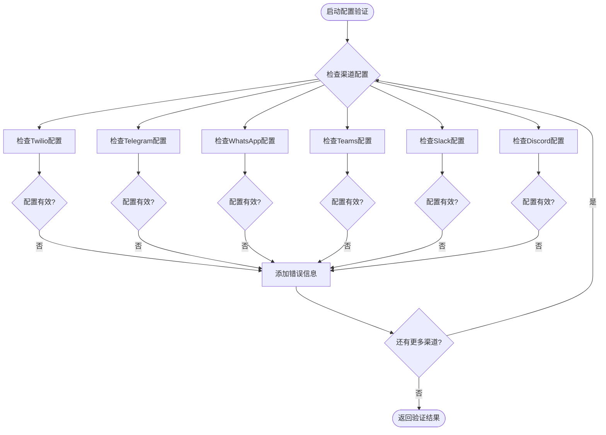

**图表来源**
- [ConfigValidatorTests.cs:125-163](file://src/OpenClaw.Tests/ConfigValidatorTests.cs#L125-L163)

**章节来源**
- [ChannelReadinessEvaluator.cs:66-96](file://src/OpenClaw.Gateway/ChannelReadinessEvaluator.cs#L66-L96)

## 结论

本系统的通信渠道安全配置实现了企业级的安全标准，提供了以下关键优势：

### 安全特性总结

1. **多层验证**: 每个渠道都实现了至少一种验证机制
2. **灵活配置**: 支持环境变量和直接配置两种方式
3. **实时监控**: 完整的日志记录和错误报告
4. **性能优化**: 流式处理和缓存机制确保高吞吐量
5. **合规支持**: 符合各平台的安全最佳实践

### 最佳实践建议

1. **始终启用验证**: 在生产环境中不要禁用任何验证机制
2. **定期轮换密钥**: 定期更新所有安全密钥和令牌
3. **监控告警**: 设置适当的监控和告警机制
4. **最小权限原则**: 为每个渠道配置最严格的白名单
5. **备份恢复**: 定期备份配置和密钥材料

### 扩展性考虑

系统设计支持未来新增更多通信渠道，具有以下扩展特性：
- 统一的验证接口设计
- 灵活的配置管理机制
- 可插拔的验证器架构
- 完善的测试覆盖

通过遵循本文档的安全配置指南，可以确保系统在各种部署场景下的安全性和可靠性。