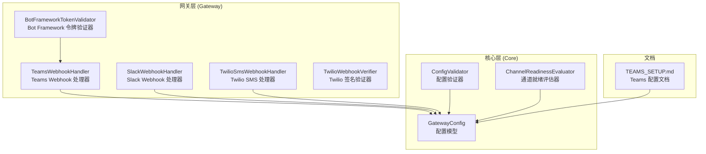
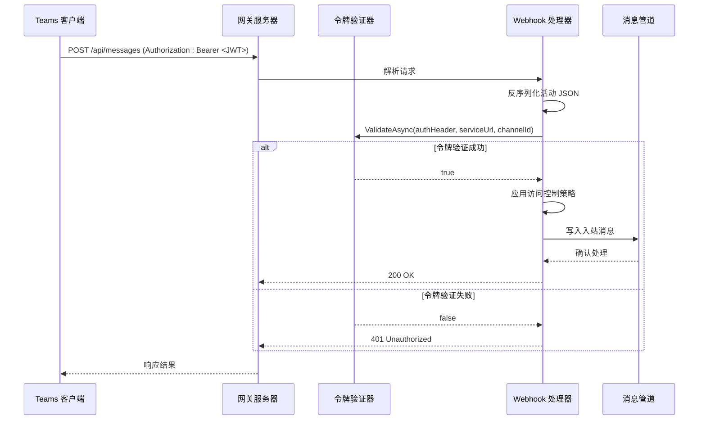
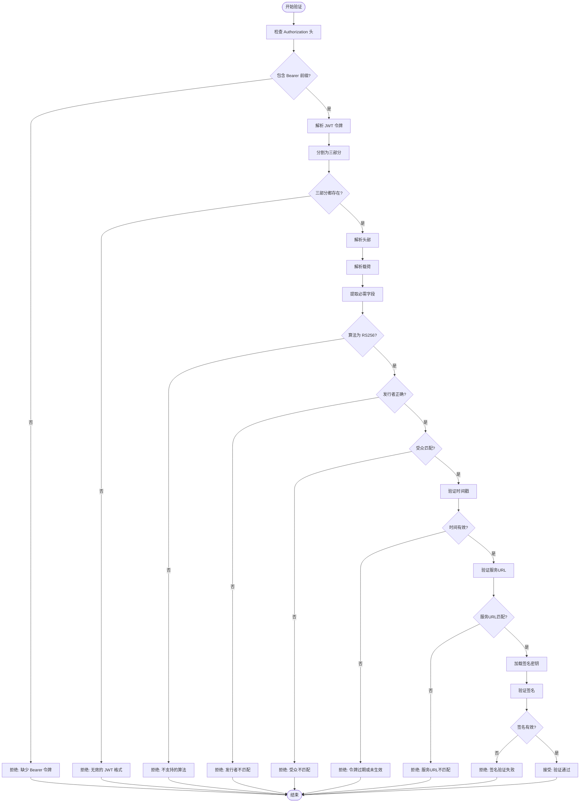
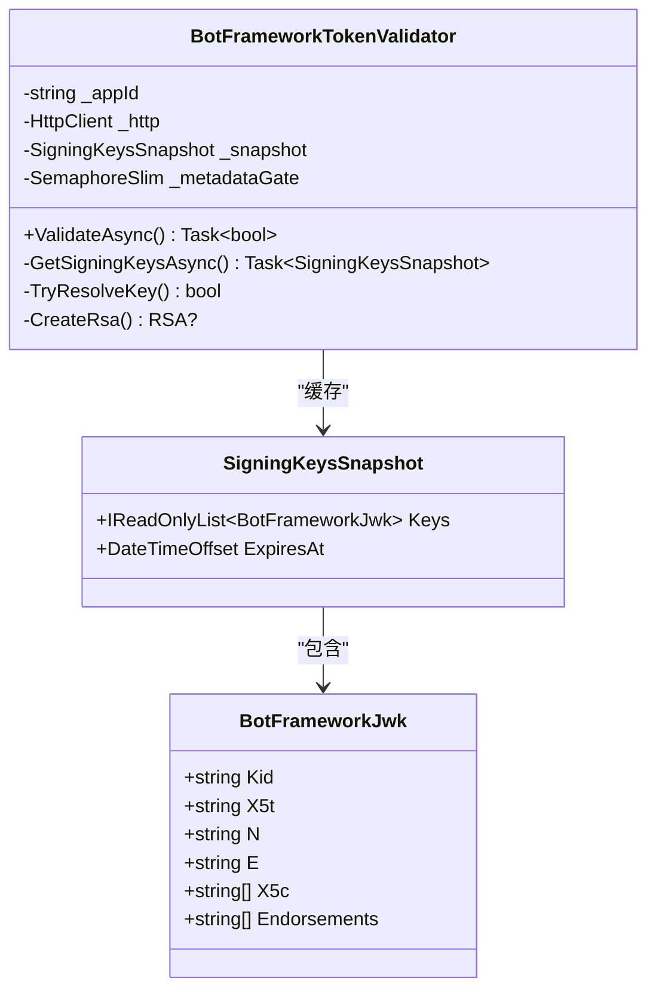
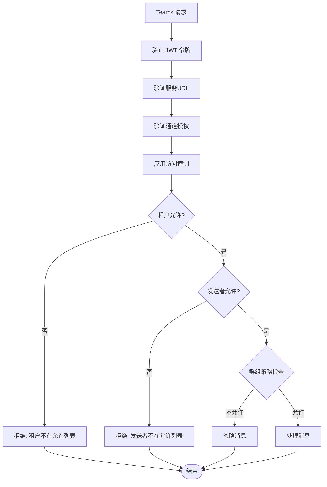
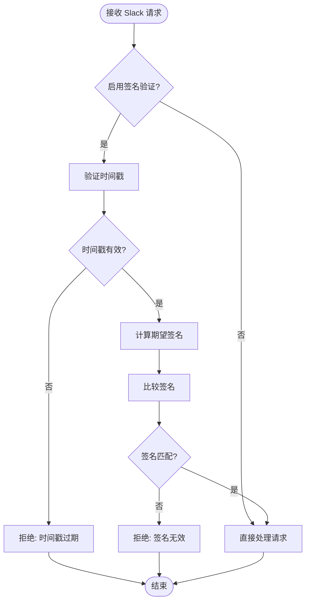
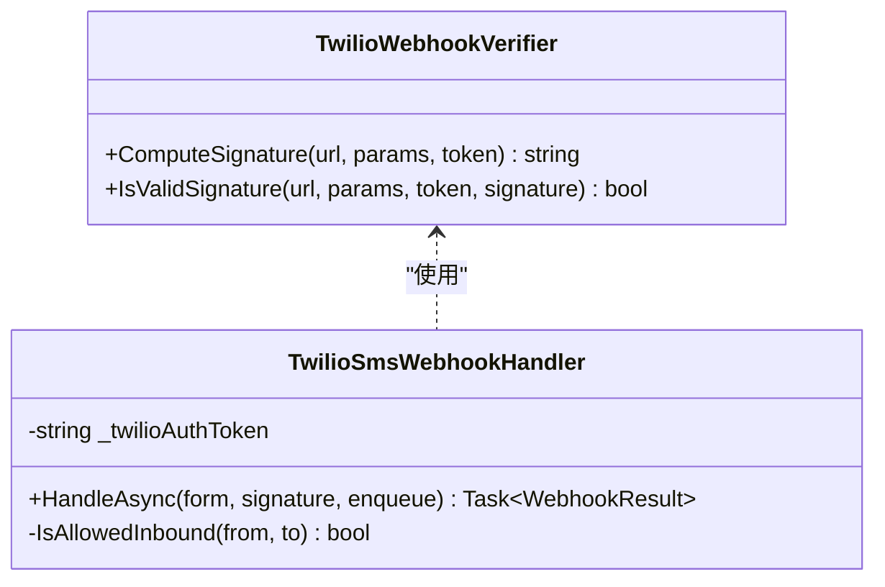
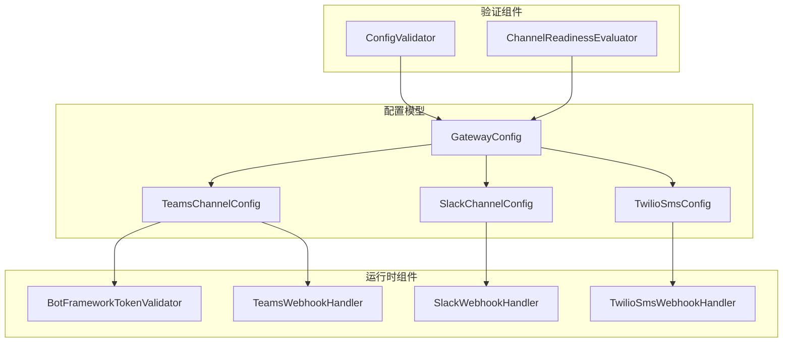
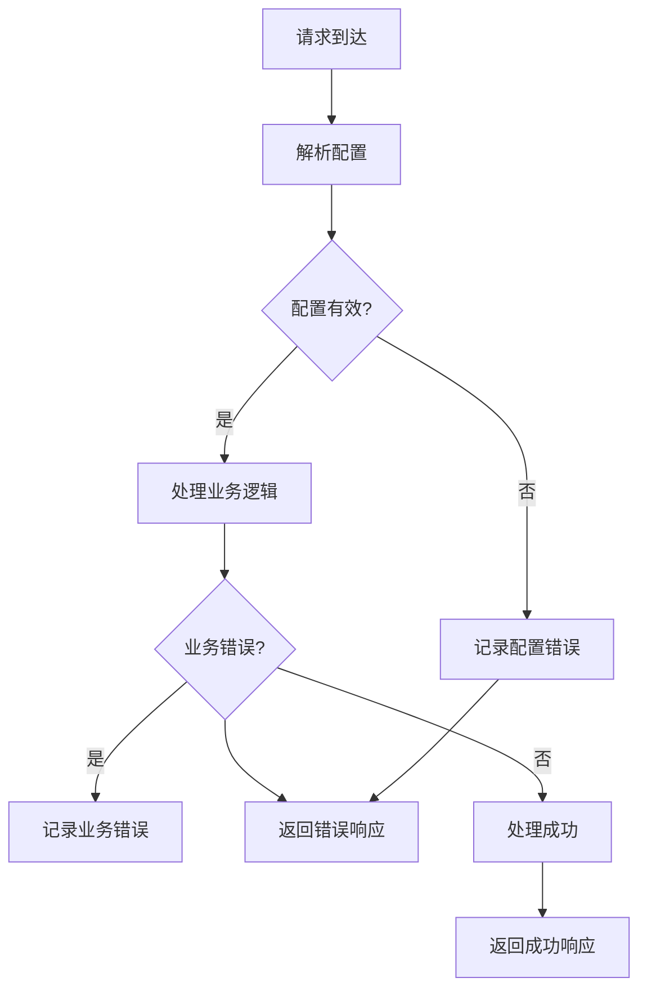
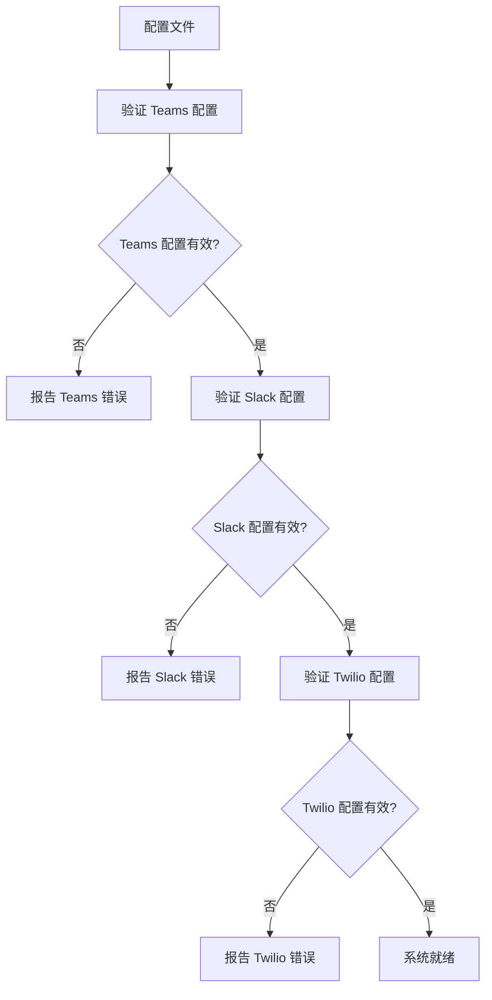

# Microsoft Bot Framework 认证

<cite>
**本文档引用的文件**
- [BotFrameworkTokenValidator.cs](file://src/OpenClaw.Gateway/BotFrameworkTokenValidator.cs)
- [TeamsWebhookHandler.cs](file://src/OpenClaw.Gateway/TeamsWebhookHandler.cs)
- [SlackWebhookHandler.cs](file://src/OpenClaw.Gateway/SlackWebhookHandler.cs)
- [TwilioSmsWebhookHandler.cs](file://src/OpenClaw.Gateway/TwilioSmsWebhookHandler.cs)
- [TwilioWebhookVerifier.cs](file://src/OpenClaw.Gateway/TwilioWebhookVerifier.cs)
- [TEAMS_SETUP.md](file://docs/TEAMS_SETUP.md)
- [ChannelReadinessEvaluator.cs](file://src/OpenClaw.Gateway/ChannelReadinessEvaluator.cs)
- [ConfigValidator.cs](file://src/OpenClaw.Core/Validation/ConfigValidator.cs)
- [GatewayConfig.cs](file://src/OpenClaw.Core/Models/GatewayConfig.cs)
- [TeamsWebhookHandlerTests.cs](file://src/OpenClaw.Tests/TeamsWebhookHandlerTests.cs)
</cite>

## 目录
1. [简介](#简介)
2. [项目结构](#项目结构)
3. [核心组件](#核心组件)
4. [架构概览](#架构概览)
5. [详细组件分析](#详细组件分析)
6. [依赖关系分析](#依赖关系分析)
7. [性能考虑](#性能考虑)
8. [故障排除指南](#故障排除指南)
9. [结论](#结论)

## 简介

本文档深入分析了 Microsoft Bot Framework 在 OpenClaw 项目中的认证机制实现。重点涵盖了 Bot Framework TokenValidator 的实现原理，包括 OAuth 2.0 令牌验证流程、JWT 令牌解析和签名验证过程。同时详细解释了与 Teams、Slack 等渠道集成时的认证差异和特殊处理。

该认证系统采用多层安全防护设计，包括令牌格式验证、签名验证、时间戳校验、通道授权等多重保障机制，确保只有来自可信来源的消息才能被系统处理。

## 项目结构

OpenClaw 项目的认证相关代码主要分布在以下模块中：

**图表来源**
- [BotFrameworkTokenValidator.cs:15-410](file://src/OpenClaw.Gateway/BotFrameworkTokenValidator.cs#L15-L410)
- [TeamsWebhookHandler.cs:15-272](file://src/OpenClaw.Gateway/TeamsWebhookHandler.cs#L15-L272)
- [SlackWebhookHandler.cs:12-276](file://src/OpenClaw.Gateway/SlackWebhookHandler.cs#L12-L276)

**章节来源**
- [BotFrameworkTokenValidator.cs:1-410](file://src/OpenClaw.Gateway/BotFrameworkTokenValidator.cs#L1-L410)
- [TeamsWebhookHandler.cs:1-272](file://src/OpenClaw.Gateway/TeamsWebhookHandler.cs#L1-L272)

## 核心组件

### BotFrameworkTokenValidator 组件

BotFrameworkTokenValidator 是整个认证系统的核心组件，负责验证来自 Microsoft Bot Framework 的 JWT 令牌。

#### 主要功能特性

1. **JWT 令牌解析**: 支持 Base64Url 编码的 JWT 令牌解析
2. **签名验证**: 使用 RSA-SHA256 算法验证令牌签名
3. **元数据缓存**: 缓存 Bot Framework 的 JWKS 元数据，减少网络请求
4. **通道授权**: 验证令牌是否被特定通道授权使用
5. **时间戳校验**: 防止重放攻击的时间戳验证

#### 关键配置参数

| 参数名称 | 默认值 | 描述 |
|---------|--------|------|
| OpenIdMetadataUrl | https://login.botframework.com/v1/.well-known/openidconfiguration | OpenID 配置端点 |
| DefaultJwksUrl | https://login.botframework.com/v1/.well-known/keys | JWKS 密钥端点 |
| ExpectedIssuer | https://api.botframework.com | 期望的令牌发行者 |
| MetadataTtl | 1小时 | 元数据缓存过期时间 |
| ClockSkew | 5分钟 | 时间偏差容忍度 |

**章节来源**
- [BotFrameworkTokenValidator.cs:17-21](file://src/OpenClaw.Gateway/BotFrameworkTokenValidator.cs#L17-L21)

### TeamsWebhookHandler 组件

TeamsWebhookHandler 负责处理来自 Microsoft Teams 的 Webhook 请求，并集成 Bot Framework 令牌验证。

#### 核心处理流程

1. **请求验证**: 检查 HTTP 方法和请求体大小
2. **活动解析**: 反序列化 Teams 活动 JSON
3. **令牌验证**: 调用 BotFrameworkTokenValidator 验证 JWT 令牌
4. **消息处理**: 将有效消息转换为内部消息格式
5. **访问控制**: 应用租户和发送者白名单检查

**章节来源**
- [TeamsWebhookHandler.cs:42-188](file://src/OpenClaw.Gateway/TeamsWebhookHandler.cs#L42-L188)

## 架构概览

**图表来源**
- [TeamsWebhookHandler.cs:64-72](file://src/OpenClaw.Gateway/TeamsWebhookHandler.cs#L64-L72)
- [BotFrameworkTokenValidator.cs:40-134](file://src/OpenClaw.Gateway/BotFrameworkTokenValidator.cs#L40-L134)

## 详细组件分析

### Bot Framework 令牌验证流程

#### JWT 令牌解析过程

**图表来源**
- [BotFrameworkTokenValidator.cs:40-134](file://src/OpenClaw.Gateway/BotFrameworkTokenValidator.cs#L40-L134)

#### 签名密钥管理

BotFrameworkTokenValidator 实现了智能的密钥缓存机制：

**图表来源**
- [BotFrameworkTokenValidator.cs:343-410](file://src/OpenClaw.Gateway/BotFrameworkTokenValidator.cs#L343-L410)

**章节来源**
- [BotFrameworkTokenValidator.cs:147-180](file://src/OpenClaw.Gateway/BotFrameworkTokenValidator.cs#L147-L180)

### Teams 渠道认证差异

#### 特殊处理机制

Teams 渠道在标准 Bot Framework 认证基础上增加了额外的安全检查：

1. **服务URL验证**: 确保令牌中的 serviceUrl 与活动中的 serviceUrl 匹配
2. **通道授权验证**: 检查签名密钥是否被 Teams 通道授权
3. **频道ID关联**: 验证密钥的 endorsements 列表包含当前频道ID

#### 访问控制策略

**图表来源**
- [TeamsWebhookHandler.cs:100-158](file://src/OpenClaw.Gateway/TeamsWebhookHandler.cs#L100-L158)

**章节来源**
- [TeamsWebhookHandler.cs:64-158](file://src/OpenClaw.Gateway/TeamsWebhookHandler.cs#L64-L158)

### Slack 渠道认证机制

#### HMAC-SHA256 签名验证

Slack 渠道使用不同的认证机制，基于 HMAC-SHA256 签名验证：

**图表来源**
- [SlackWebhookHandler.cs:244-274](file://src/OpenClaw.Gateway/SlackWebhookHandler.cs#L244-L274)

**章节来源**
- [SlackWebhookHandler.cs:49-56](file://src/OpenClaw.Gateway/SlackWebhookHandler.cs#L49-L56)

### Twilio 渠道认证机制

#### Twilio 签名验证算法

Twilio 使用 HMAC-SHA1 算法进行签名验证：

**图表来源**
- [TwilioWebhookVerifier.cs:6-38](file://src/OpenClaw.Gateway/TwilioWebhookVerifier.cs#L6-L38)
- [TwilioSmsWebhookHandler.cs:86-162](file://src/OpenClaw.Gateway/TwilioSmsWebhookHandler.cs#L86-L162)

**章节来源**
- [TwilioWebhookVerifier.cs:8-37](file://src/OpenClaw.Gateway/TwilioWebhookVerifier.cs#L8-L37)

## 依赖关系分析

### 配置系统集成

**图表来源**
- [GatewayConfig.cs:735-770](file://src/OpenClaw.Core/Models/GatewayConfig.cs#L735-L770)
- [ConfigValidator.cs:339-355](file://src/OpenClaw.Core/Validation/ConfigValidator.cs#L339-L355)
- [ChannelReadinessEvaluator.cs:291-342](file://src/OpenClaw.Gateway/ChannelReadinessEvaluator.cs#L291-L342)

### 错误处理和日志记录

系统实现了多层次的错误处理机制：

**图表来源**
- [TeamsWebhookHandler.cs:183-187](file://src/OpenClaw.Gateway/TeamsWebhookHandler.cs#L183-L187)
- [SlackWebhookHandler.cs:53-55](file://src/OpenClaw.Gateway/SlackWebhookHandler.cs#L53-L55)

**章节来源**
- [ChannelReadinessEvaluator.cs:328-339](file://src/OpenClaw.Gateway/ChannelReadinessEvaluator.cs#L328-L339)

## 性能考虑

### 缓存策略

BotFrameworkTokenValidator 实现了高效的缓存机制来优化性能：

1. **元数据缓存**: JWKS 元数据缓存 1 小时
2. **并发控制**: 使用 SemaphoreSlim 防止重复的元数据获取
3. **内存优化**: 使用 JsonDocument 进行流式解析

### 并发处理

系统采用异步编程模式处理高并发请求：

- 所有验证操作都是异步的
- 使用 ValueTask 减少内存分配
- 实现了无锁的数据结构用于状态管理

## 故障排除指南

### 常见问题诊断

#### Teams 令牌验证失败

**可能原因**:
1. 令牌格式不正确
2. 发行者不匹配
3. 受众不匹配
4. 令牌过期
5. 服务URL不匹配
6. 签名验证失败

**解决方案**:
1. 检查 Authorization 头格式
2. 验证 App ID 配置
3. 确认令牌时间戳有效性
4. 检查服务URL一致性

#### Slack 签名验证失败

**可能原因**:
1. 签名密钥配置错误
2. 请求时间戳过期
3. 请求体修改
4. 签名计算错误

**解决方案**:
1. 重新生成并配置签名密钥
2. 检查服务器时间同步
3. 验证请求完整性
4. 确认签名算法正确性

#### Twilio 签名验证失败

**可能原因**:
1. Auth Token 配置错误
2. Webhook URL 配置不正确
3. 请求参数排序问题
4. 字符编码问题

**解决方案**:
1. 验证 Twilio 账户配置
2. 检查 Webhook URL 设置
3. 确认参数按字母顺序排序
4. 验证 UTF-8 编码

**章节来源**
- [TEAMS_SETUP.md:182-205](file://docs/TEAMS_SETUP.md#L182-L205)

### 配置验证

系统提供了自动化的配置验证功能：

**图表来源**
- [ConfigValidator.cs:339-355](file://src/OpenClaw.Core/Validation/ConfigValidator.cs#L339-L355)
- [ChannelReadinessEvaluator.cs:291-342](file://src/OpenClaw.Gateway/ChannelReadinessEvaluator.cs#L291-L342)

## 结论

OpenClaw 项目中的 Microsoft Bot Framework 认证机制展现了现代企业级应用的安全设计理念。通过实现多层认证防护、智能缓存策略和灵活的配置管理，系统能够在保证安全性的同时提供良好的性能表现。

### 主要优势

1. **多渠道适配**: 支持 Teams、Slack、Twilio 等多种通信渠道
2. **安全防护**: 实现了完整的令牌验证和签名验证机制
3. **性能优化**: 采用缓存和异步处理提升系统性能
4. **配置灵活**: 提供详细的配置选项和自动化验证
5. **易于维护**: 清晰的代码结构和完善的错误处理

### 最佳实践建议

1. **生产环境配置**: 始终启用令牌验证功能
2. **监控告警**: 建立完整的日志记录和监控体系
3. **定期审计**: 定期检查配置和密钥的有效性
4. **性能调优**: 根据实际负载调整缓存策略和并发设置
5. **安全更新**: 及时更新签名算法和密钥轮换策略

该认证系统为构建安全可靠的 Bot 应用提供了坚实的技术基础，能够满足各种规模和复杂度的应用需求。