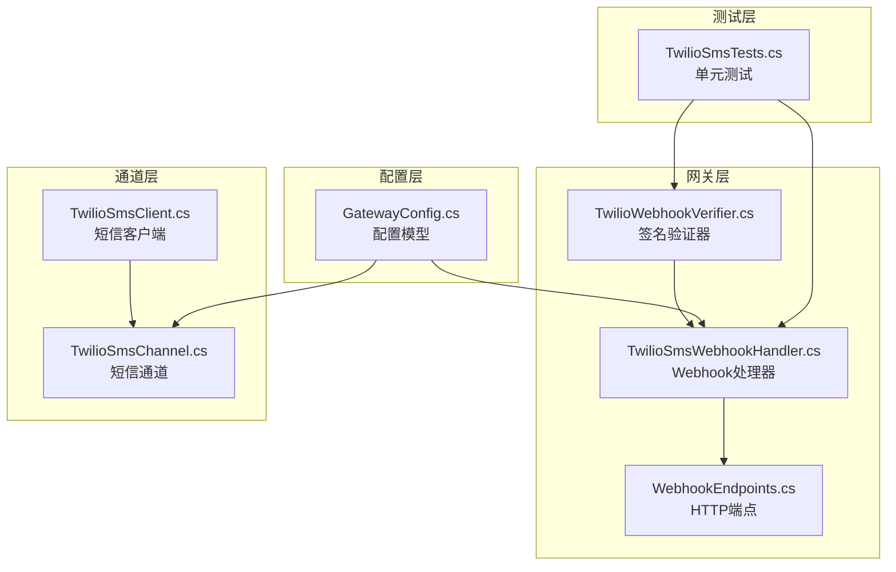
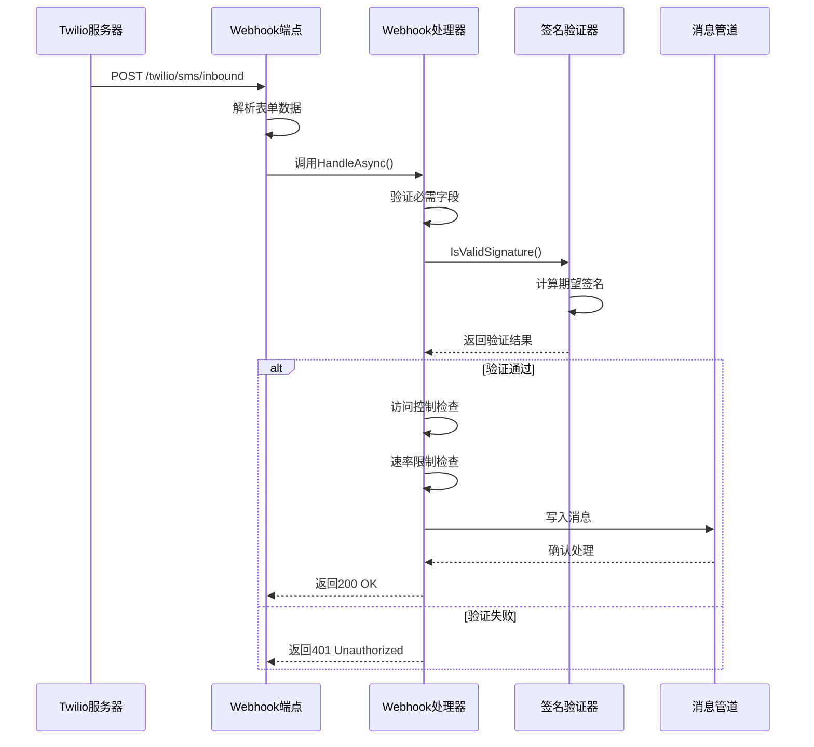
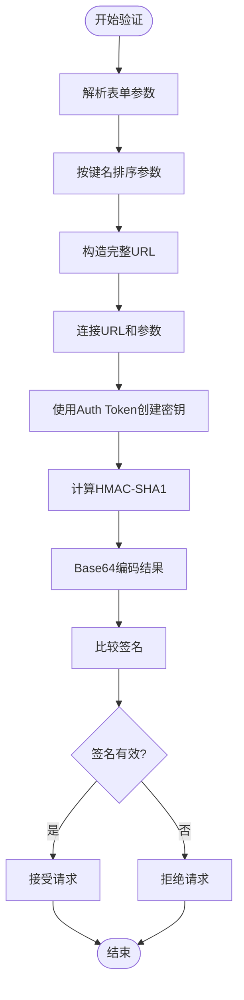
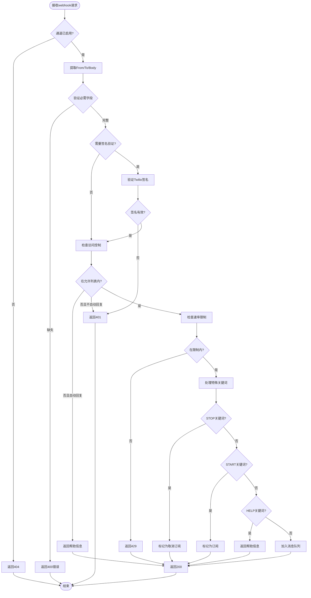
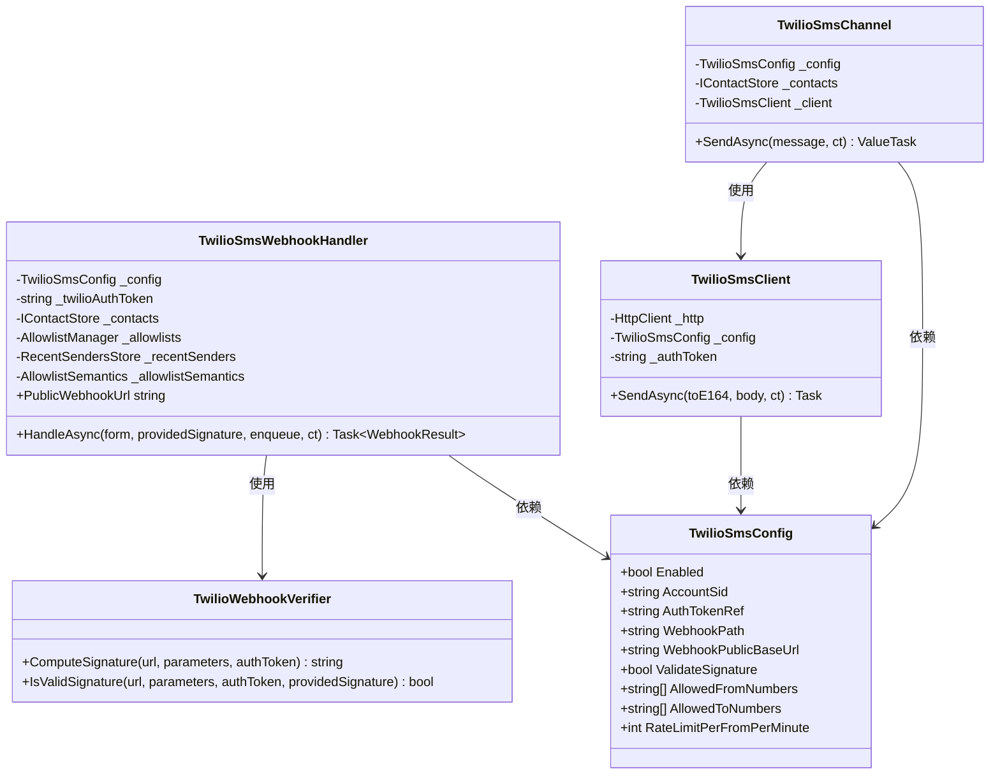

# Twilio SMS Webhook 认证

<cite>
**本文档引用的文件**
- [TwilioWebhookVerifier.cs](file://src/OpenClaw.Gateway/TwilioWebhookVerifier.cs)
- [TwilioSmsWebhookHandler.cs](file://src/OpenClaw.Gateway/TwilioSmsWebhookHandler.cs)
- [TwilioSmsChannel.cs](file://src/OpenClaw.Channels/TwilioSmsChannel.cs)
- [TwilioSmsClient.cs](file://src/OpenClaw.Channels/TwilioSmsClient.cs)
- [GatewayConfig.cs](file://src/OpenClaw.Core/Models/GatewayConfig.cs)
- [WebhookEndpoints.cs](file://src/OpenClaw.Gateway/Endpoints/WebhookEndpoints.cs)
- [TwilioSmsTests.cs](file://src/OpenClaw.Tests/TwilioSmsTests.cs)
</cite>

## 目录
1. [简介](#简介)
2. [项目结构](#项目结构)
3. [核心组件](#核心组件)
4. [架构概览](#架构概览)
5. [详细组件分析](#详细组件分析)
6. [依赖关系分析](#依赖关系分析)
7. [性能考虑](#性能考虑)
8. [故障排除指南](#故障排除指南)
9. [结论](#结论)

## 简介

本文档详细解释了 OpenClaw 项目中 Twilio SMS 渠道的 webhook 认证机制。Twilio 提供了基于 HMAC-SHA1 的签名验证功能，用于确保来自 Twilio 的 webhook 请求确实来自 Twilio 服务器而非恶意第三方。本文将深入分析 TwilioWebhookVerifier 类的实现原理，包括参数排序、URL 构造和密钥计算过程，并提供完整的配置示例和调试指南。

## 项目结构

Twilio SMS webhook 认证相关的核心文件分布如下：



**图表来源**
- [TwilioWebhookVerifier.cs:1-40](file://src/OpenClaw.Gateway/TwilioWebhookVerifier.cs#L1-L40)
- [TwilioSmsWebhookHandler.cs:1-246](file://src/OpenClaw.Gateway/TwilioSmsWebhookHandler.cs#L1-L246)
- [WebhookEndpoints.cs:1-93](file://src/OpenClaw.Gateway/Endpoints/WebhookEndpoints.cs#L1-L93)

**章节来源**
- [TwilioWebhookVerifier.cs:1-40](file://src/OpenClaw.Gateway/TwilioWebhookVerifier.cs#L1-L40)
- [TwilioSmsWebhookHandler.cs:1-246](file://src/OpenClaw.Gateway/TwilioSmsWebhookHandler.cs#L1-L246)
- [GatewayConfig.cs:694-711](file://src/OpenClaw.Core/Models/GatewayConfig.cs#L694-L711)

## 核心组件

### TwilioWebhookVerifier 类

TwilioWebhookVerifier 是一个静态工具类，提供了两个核心方法：

1. **ComputeSignature**: 计算预期的签名值
2. **IsValidSignature**: 验证提供的签名是否有效

该类实现了 Twilio 官方的 HMAC-SHA1 签名验证算法，确保与 Twilio 服务器的签名计算完全兼容。

**章节来源**
- [TwilioWebhookVerifier.cs:6-38](file://src/OpenClaw.Gateway/TwilioWebhookVerifier.cs#L6-L38)

### TwilioSmsWebhookHandler 类

TwilioSmsWebhookHandler 是主要的 webhook 处理逻辑实现，负责：

- 接收和解析 Twilio 发送的表单数据
- 执行签名验证（可选）
- 应用访问控制列表（allowlist）检查
- 实施速率限制
- 处理特殊关键词（STOP、START、HELP 等）
- 将有效消息转发到消息管道

**章节来源**
- [TwilioSmsWebhookHandler.cs:9-227](file://src/OpenClaw.Gateway/TwilioSmsWebhookHandler.cs#L9-L227)

## 架构概览

Twilio SMS webhook 认证的整体架构流程如下：



**图表来源**
- [WebhookEndpoints.cs:25-72](file://src/OpenClaw.Gateway/Endpoints/WebhookEndpoints.cs#L25-L72)
- [TwilioSmsWebhookHandler.cs:86-162](file://src/OpenClaw.Gateway/TwilioSmsWebhookHandler.cs#L86-L162)
- [TwilioWebhookVerifier.cs:27-37](file://src/OpenClaw.Gateway/TwilioWebhookVerifier.cs#L27-L37)

## 详细组件分析

### Twilio HMAC-SHA1 签名验证算法

Twilio 使用 HMAC-SHA1 算法进行 webhook 请求签名验证。算法的具体实现步骤如下：

#### 参数排序规则
1. 对所有表单参数按键名进行字典序排序
2. 忽略空值参数
3. 排序时使用 Ordinal 比较器确保跨平台一致性

#### URL 构造过程
1. 使用完整的公共 webhook URL（包含查询参数）
2. 不对 URL 进行额外编码处理
3. URL 格式：`https://your-domain.com/twilio/sms/inbound`

#### 密钥计算过程
1. 使用 Twilio Auth Token 作为 HMAC 密钥
2. 数据内容为 URL + 所有参数键值对的连接
3. 使用 UTF-8 编码进行字节转换
4. 生成 HMAC-SHA1 哈希值
5. 将结果 Base64 编码输出



**图表来源**
- [TwilioWebhookVerifier.cs:8-25](file://src/OpenClaw.Gateway/TwilioWebhookVerifier.cs#L8-L25)

**章节来源**
- [TwilioWebhookVerifier.cs:8-37](file://src/OpenClaw.Gateway/TwilioWebhookVerifier.cs#L8-L37)

### TwilioSmsWebhookHandler 处理流程

Webhook 处理器按照以下顺序执行验证和处理：



**图表来源**
- [TwilioSmsWebhookHandler.cs:86-162](file://src/OpenClaw.Gateway/TwilioSmsWebhookHandler.cs#L86-L162)

**章节来源**
- [TwilioSmsWebhookHandler.cs:86-162](file://src/OpenClaw.Gateway/TwilioSmsWebhookHandler.cs#L86-L162)

### 配置模型详解

Twilio SMS 配置模型包含以下关键属性：

| 属性名 | 类型 | 默认值 | 描述 |
|--------|------|--------|------|
| Enabled | bool | false | 是否启用 Twilio SMS 通道 |
| AccountSid | string | null | Twilio 账户 SID |
| AuthTokenRef | string | null | 认证令牌引用 |
| MessagingServiceSid | string | null | 短信服务 SID（优先级高于 FromNumber） |
| FromNumber | string | null | 发送号码 |
| WebhookPath | string | "/twilio/sms/inbound" | webhook 路径 |
| WebhookPublicBaseUrl | string | null | 公共基础 URL |
| ValidateSignature | bool | true | 是否验证签名 |
| AllowedFromNumbers | string[] | [] | 允许的发送号码列表 |
| AllowedToNumbers | string[] | [] | 允许的目标号码列表 |
| MaxInboundChars | int | 2000 | 最大输入字符数 |
| MaxRequestBytes | int | 64*1024 | 最大请求字节数 |
| RateLimitPerFromPerMinute | int | 30 | 每分钟每发送者速率限制 |
| AutoReplyForBlocked | bool | false | 对被阻止用户自动回复 |
| HelpText | string | "OpenClaw: reply STOP to opt out." | 帮助文本 |

**章节来源**
- [GatewayConfig.cs:694-711](file://src/OpenClaw.Core/Models/GatewayConfig.cs#L694-L711)

## 依赖关系分析



**图表来源**
- [TwilioWebhookVerifier.cs:6-38](file://src/OpenClaw.Gateway/TwilioWebhookVerifier.cs#L6-L38)
- [TwilioSmsWebhookHandler.cs:9-74](file://src/OpenClaw.Gateway/TwilioSmsWebhookHandler.cs#L9-L74)
- [TwilioSmsChannel.cs:8-19](file://src/OpenClaw.Channels/TwilioSmsChannel.cs#L8-L19)
- [TwilioSmsClient.cs:7-18](file://src/OpenClaw.Channels/TwilioSmsClient.cs#L7-L18)
- [GatewayConfig.cs:694-711](file://src/OpenClaw.Core/Models/GatewayConfig.cs#L694-L711)

**章节来源**
- [TwilioSmsWebhookHandler.cs:13-74](file://src/OpenClaw.Gateway/TwilioSmsWebhookHandler.cs#L13-L74)
- [TwilioSmsChannel.cs:10-19](file://src/OpenClaw.Channels/TwilioSmsChannel.cs#L10-L19)

## 性能考虑

### 速率限制实现

Webhook 处理器实现了基于每分钟的速率限制机制：

- **时间窗口**: 60 秒为一个时间窗口
- **并发安全**: 使用锁机制确保线程安全
- **内存管理**: 定期清理过期的时间窗口
- **配置灵活性**: 可根据需求调整每分钟的限制数量

### 内存优化策略

- **延迟初始化**: 仅在需要时创建速率限制窗口
- **定期清理**: 每处理 64 个请求后清理一次过期窗口
- **内存回收**: 当时间窗口超过 2 分钟未活动时自动移除

## 故障排除指南

### 常见签名验证失败原因

1. **配置错误**
   - WebhookPublicBaseUrl 未正确设置
   - AuthToken 配置不正确
   - WebhookPath 配置与 Twilio 控制台不一致

2. **网络问题**
   - 无法访问公共 URL
   - 防火墙或代理阻拦
   - DNS 解析问题

3. **时间同步问题**
   - 服务器时间与时区设置不正确
   - NTP 同步问题

### 调试步骤

#### 步骤 1: 验证配置
```csharp
// 检查配置完整性
if (string.IsNullOrWhiteSpace(config.WebhookPublicBaseUrl))
{
    throw new InvalidOperationException("WebhookPublicBaseUrl 未配置");
}

if (string.IsNullOrWhiteSpace(config.WebhookPath))
{
    throw new InvalidOperationException("WebhookPath 未配置");
}
```

#### 步骤 2: 手动计算签名
```csharp
// 使用测试用例中的方式计算签名
var expectedSignature = TwilioWebhookVerifier.ComputeSignature(
    handler.PublicWebhookUrl, 
    formData, 
    authToken
);
```

#### 步骤 3: 检查 Twilio 控制台设置
- 确保 webhook URL 与配置的 PublicBaseUrl + WebhookPath 完全匹配
- 验证 Auth Token 在 Twilio 控制台正确设置
- 检查短信服务配置（MessagingServiceSid 或 FromNumber）

#### 步骤 4: 查看日志
- 检查 HTTP 请求头中的 X-Twilio-Signature
- 验证请求体内容是否完整
- 监控 401 错误的频率和模式

### 重放攻击防护

系统实现了多重防护机制：

1. **重复消息检测**
   - 使用 MessageSid 作为去重键
   - 支持基于请求体哈希的备用去重方案
   - 6小时的去重窗口期

2. **时间戳验证**
   - 结合 Twilio 的时间戳机制
   - 防止过期请求的重放

3. **固定时间比较**
   - 使用 CryptographicOperations.FixedTimeEquals 防止时序攻击
   - 确保密码比较的时延一致性

**章节来源**
- [WebhookEndpoints.cs:49-57](file://src/OpenClaw.Gateway/Endpoints/WebhookEndpoints.cs#L49-L57)
- [TwilioWebhookVerifier.cs:27-37](file://src/OpenClaw.Gateway/TwilioWebhookVerifier.cs#L27-L37)

## 结论

Twilio SMS webhook 认证机制在 OpenClaw 中实现了完整的安全验证流程。通过严格的参数排序、URL 构造和 HMAC-SHA1 签名验证，确保了 webhook 请求的真实性和完整性。配合访问控制列表、速率限制和重复消息防护，构建了多层次的安全防护体系。

关键优势包括：
- 完全符合 Twilio 官方签名验证规范
- 提供灵活的配置选项
- 实现了有效的安全防护措施
- 包含完善的错误处理和调试支持

建议在生产环境中始终启用签名验证，并定期审查和更新配置以确保最佳安全性。