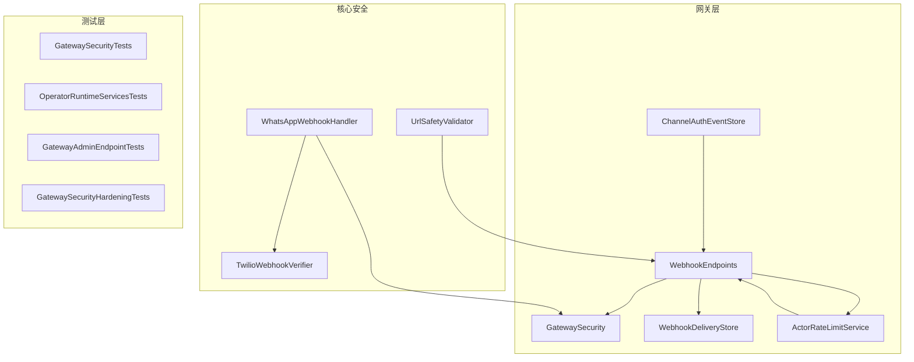
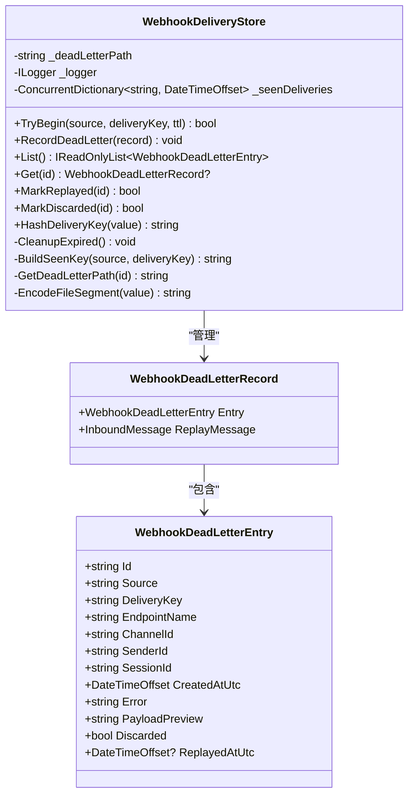
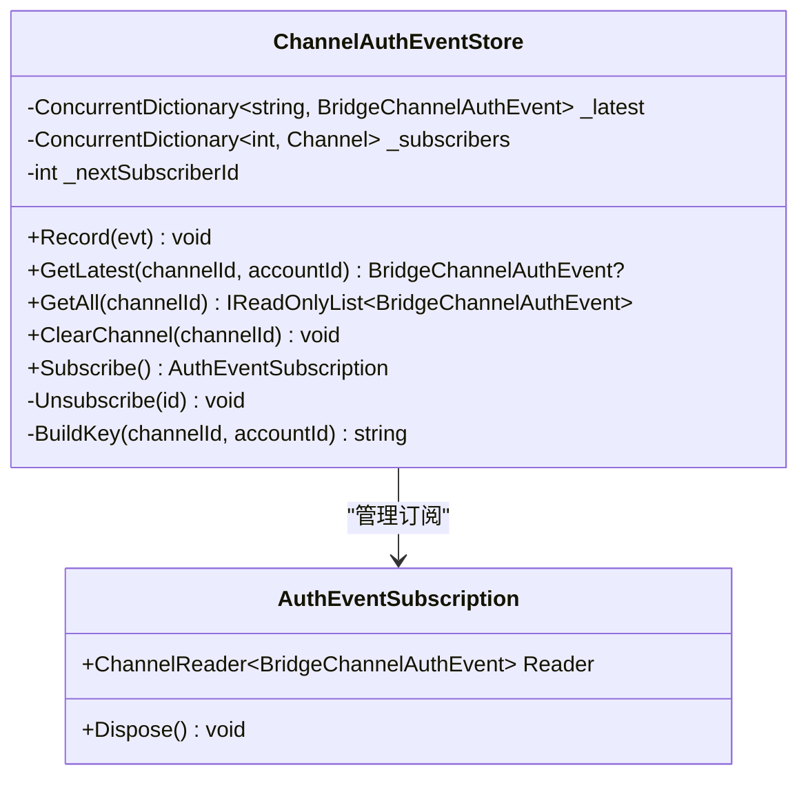
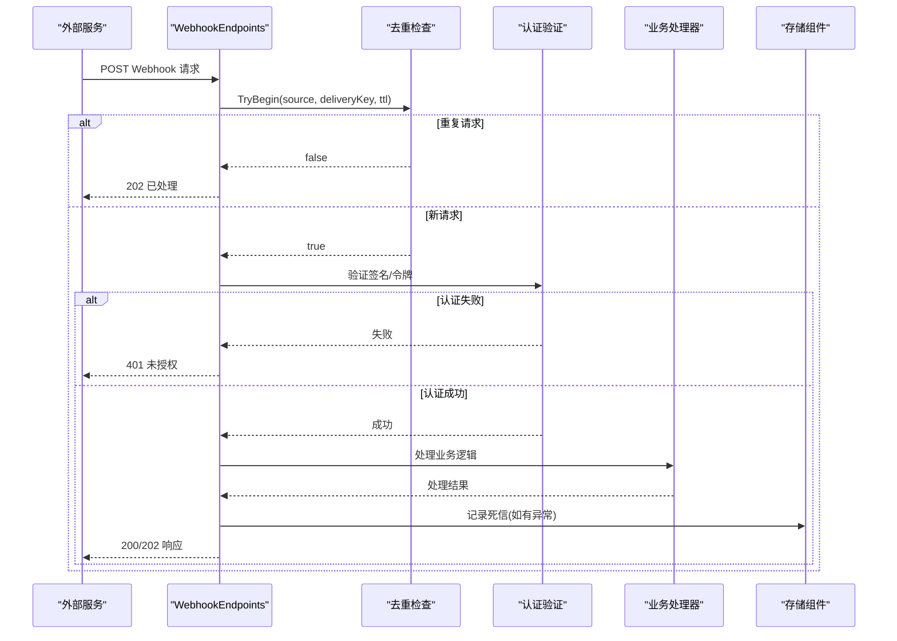
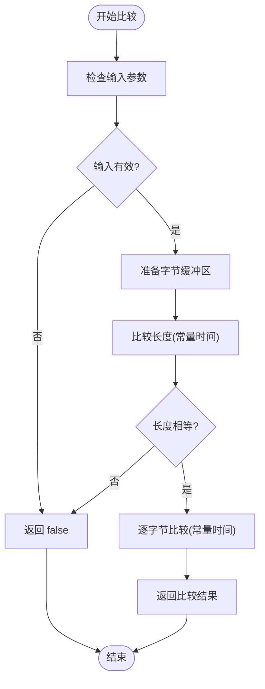
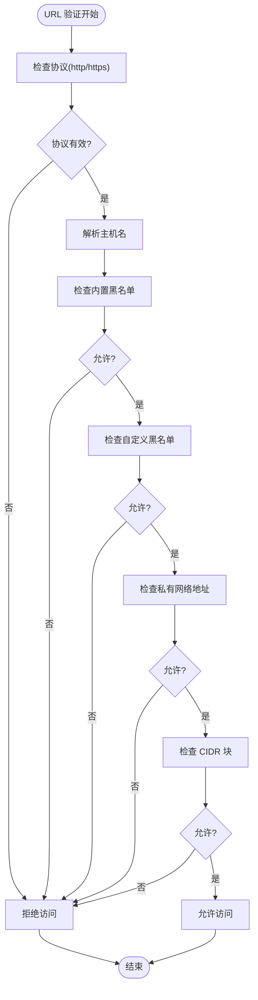
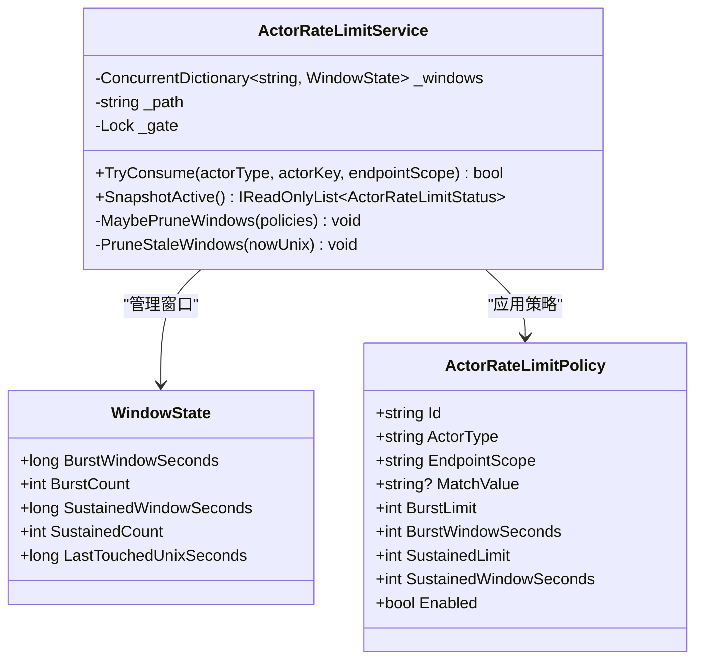
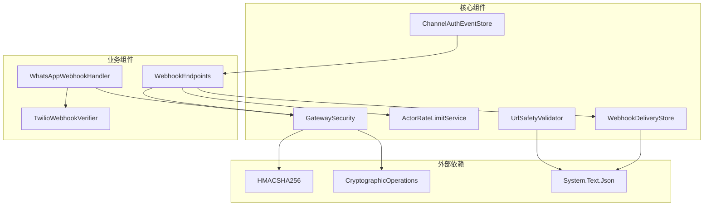
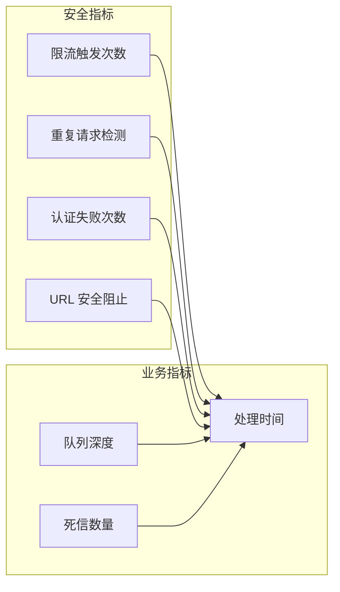

# Webhook 安全最佳实践

<cite>
**本文档引用的文件**
- [WebhookDeliveryStore.cs](file://src/OpenClaw.Gateway/WebhookDeliveryStore.cs)
- [ChannelAuthEventStore.cs](file://src/OpenClaw.Gateway/ChannelAuthEventStore.cs)
- [WebhookEndpoints.cs](file://src/OpenClaw.Gateway/Endpoints/WebhookEndpoints.cs)
- [GatewaySecurity.cs](file://src/OpenClaw.Gateway/GatewaySecurity.cs)
- [TwilioWebhookVerifier.cs](file://src/OpenClaw.Gateway/TwilioWebhookVerifier.cs)
- [WhatsAppWebhookHandler.cs](file://src/OpenClaw.Gateway/WhatsAppWebhookHandler.cs)
- [ActorRateLimitService.cs](file://src/OpenClaw.Gateway/ActorRateLimitService.cs)
- [UrlSafetyValidator.cs](file://src/OpenClaw.Core/Security/UrlSafetyValidator.cs)
- [GatewaySecurityTests.cs](file://src/OpenClaw.Tests/GatewaySecurityTests.cs)
- [OperatorRuntimeServicesTests.cs](file://src/OpenClaw.Tests/OperatorRuntimeServicesTests.cs)
- [GatewayAdminEndpointTests.cs](file://src/OpenClaw.Tests/GatewayAdminEndpointTests.cs)
- [GatewaySecurityHardeningTests.cs](file://src/OpenClaw.Tests/GatewaySecurityHardeningTests.cs)
- [GatewayConfig.cs](file://src/OpenClaw.Core/Models/GatewayConfig.cs)
- [AdminEndpoints.Support.cs](file://src/OpenClaw.Gateway/Endpoints/AdminEndpoints.Support.cs)
</cite>

## 目录
1. [简介](#简介)
2. [项目结构](#项目结构)
3. [核心组件](#核心组件)
4. [架构概览](#架构概览)
5. [详细组件分析](#详细组件分析)
6. [依赖关系分析](#依赖关系分析)
7. [性能考虑](#性能考虑)
8. [故障排除指南](#故障排除指南)
9. [结论](#结论)
10. [附录](#附录)

## 简介

本指南旨在为 Webhook 安全认证提供全面的最佳实践指导，涵盖固定时间比较、重放攻击防护、URL 安全验证和请求频率限制等关键安全措施。文档详细解释了 WebhookDeliveryStore 的去重机制和 ChannelAuthEventStore 的认证事件记录功能，并提供了安全配置检查清单、常见安全漏洞防范和监控告警设置指南。

## 项目结构

该项目采用分层架构设计，Webhook 安全相关的核心组件分布在以下模块中：

**图表来源**
- [WebhookEndpoints.cs:1-200](file://src/OpenClaw.Gateway/Endpoints/WebhookEndpoints.cs#L1-L200)
- [GatewaySecurity.cs:1-109](file://src/OpenClaw.Gateway/GatewaySecurity.cs#L1-L109)
- [WebhookDeliveryStore.cs:1-183](file://src/OpenClaw.Gateway/WebhookDeliveryStore.cs#L1-L183)

**章节来源**
- [WebhookEndpoints.cs:1-200](file://src/OpenClaw.Gateway/Endpoints/WebhookEndpoints.cs#L1-L200)
- [GatewaySecurity.cs:1-109](file://src/OpenClaw.Gateway/GatewaySecurity.cs#L1-L109)

## 核心组件

### WebhookDeliveryStore 去重机制

WebhookDeliveryStore 是系统的核心去重组件，负责防止重复处理相同的 Webhook 请求：

**图表来源**
- [WebhookDeliveryStore.cs:9-183](file://src/OpenClaw.Gateway/WebhookDeliveryStore.cs#L9-L183)

### ChannelAuthEventStore 认证事件记录

ChannelAuthEventStore 负责跟踪和广播渠道认证事件：

**图表来源**
- [ChannelAuthEventStore.cs:11-93](file://src/OpenClaw.Gateway/ChannelAuthEventStore.cs#L11-L93)

**章节来源**
- [WebhookDeliveryStore.cs:1-183](file://src/OpenClaw.Gateway/WebhookDeliveryStore.cs#L1-L183)
- [ChannelAuthEventStore.cs:1-93](file://src/OpenClaw.Gateway/ChannelAuthEventStore.cs#L1-L93)

## 架构概览

系统采用多层安全防护架构，确保 Webhook 请求的安全处理：

**图表来源**
- [WebhookEndpoints.cs:404-595](file://src/OpenClaw.Gateway/Endpoints/WebhookEndpoints.cs#L404-L595)
- [GatewaySecurity.cs:59-79](file://src/OpenClaw.Gateway/GatewaySecurity.cs#L59-L79)

## 详细组件分析

### 固定时间比较实现

系统使用 CryptographicOperations.FixedTimeEquals 进行安全的时间比较，防止时序攻击：

**图表来源**
- [GatewaySecurity.cs:40-49](file://src/OpenClaw.Gateway/GatewaySecurity.cs#L40-L49)

### 重放攻击防护机制

系统通过多种方式防止重放攻击：

1. **基于时间戳的去重**: 使用 ConcurrentDictionary 存储已处理的请求键值对
2. **哈希验证**: 对请求内容进行 SHA256 哈希处理
3. **TTL 限制**: 设置 6 小时的有效期
4. **死信队列**: 记录处理失败的请求以便后续重放

### URL 安全验证

UrlSafetyValidator 提供全面的 URL 安全检查：

**图表来源**
- [UrlSafetyValidator.cs:60-135](file://src/OpenClaw.Core/Security/UrlSafetyValidator.cs#L60-L135)

### 请求频率限制

ActorRateLimitService 实现了双层限流机制：

**图表来源**
- [ActorRateLimitService.cs:9-282](file://src/OpenClaw.Gateway/ActorRateLimitService.cs#L9-L282)

**章节来源**
- [GatewaySecurity.cs:1-109](file://src/OpenClaw.Gateway/GatewaySecurity.cs#L1-L109)
- [UrlSafetyValidator.cs:1-168](file://src/OpenClaw.Core/Security/UrlSafetyValidator.cs#L1-L168)
- [ActorRateLimitService.cs:1-282](file://src/OpenClaw.Gateway/ActorRateLimitService.cs#L1-L282)

## 依赖关系分析

系统各组件之间的依赖关系如下：

**图表来源**
- [WebhookEndpoints.cs:1-200](file://src/OpenClaw.Gateway/Endpoints/WebhookEndpoints.cs#L1-L200)
- [GatewaySecurity.cs:1-109](file://src/OpenClaw.Gateway/GatewaySecurity.cs#L1-L109)

**章节来源**
- [WebhookEndpoints.cs:1-200](file://src/OpenClaw.Gateway/Endpoints/WebhookEndpoints.cs#L1-L200)
- [GatewaySecurity.cs:1-109](file://src/OpenClaw.Gateway/GatewaySecurity.cs#L1-L109)

## 性能考虑

### 内存优化策略

1. **并发字典优化**: 使用 StringComparer.Ordinal 减少字符串比较开销
2. **TTL 清理**: 定期清理过期的去重条目，控制内存使用
3. **限流窗口**: 动态修剪过期的限流窗口，避免内存泄漏

### 缓存策略

1. **策略缓存**: ActorRateLimitService 缓存策略文件，减少磁盘 I/O
2. **订阅缓冲**: 使用有界通道存储认证事件，防止内存溢出
3. **死信文件**: 异步写入死信文件，避免阻塞主流程

## 故障排除指南

### 常见问题诊断

1. **重复请求处理**: 检查 WebhookDeliveryStore 的 TryBegin 返回值
2. **认证失败**: 验证 GatewaySecurity 的 IsHmacSha256SignatureValid 方法
3. **限流触发**: 查看 ActorRateLimitService 的 SnapshotActive 输出
4. **URL 安全阻止**: 检查 UrlSafetyValidator 的验证结果

### 监控指标

**章节来源**
- [OperatorRuntimeServicesTests.cs:53-87](file://src/OpenClaw.Tests/OperatorRuntimeServicesTests.cs#L53-L87)
- [GatewayAdminEndpointTests.cs:4928-4956](file://src/OpenClaw.Tests/GatewayAdminEndpointTests.cs#L4928-L4956)

## 结论

本指南详细阐述了 Webhook 安全认证的最佳实践，包括固定时间比较、重放攻击防护、URL 安全验证和请求频率限制等关键安全措施。通过合理配置和使用这些组件，可以有效提升系统的安全性。

## 附录

### 安全配置检查清单

- [ ] 启用 HMAC 签名验证
- [ ] 配置适当的 TTL 值
- [ ] 设置合理的限流策略
- [ ] 配置 URL 安全策略
- [ ] 启用死信队列监控
- [ ] 配置认证事件订阅

### 常见安全漏洞防范

1. **时序攻击防护**: 使用固定时间比较函数
2. **重放攻击防护**: 实施去重机制和 TTL 限制
3. **注入攻击防护**: 验证和清理所有输入数据
4. **权限提升防护**: 实施最小权限原则

### 监控告警设置

- 限流触发阈值: 90%
- 重复请求率: >1% 触发告警
- 认证失败率: >5% 触发告警
- 死信队列增长: 10% 触发告警