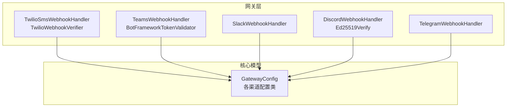
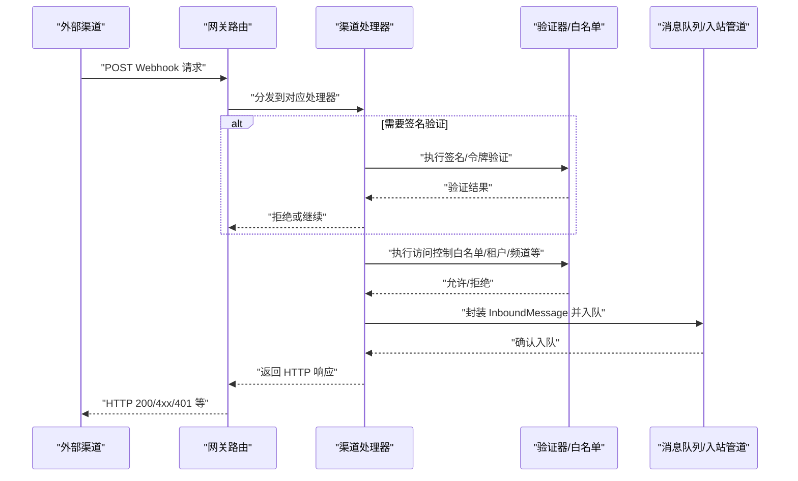
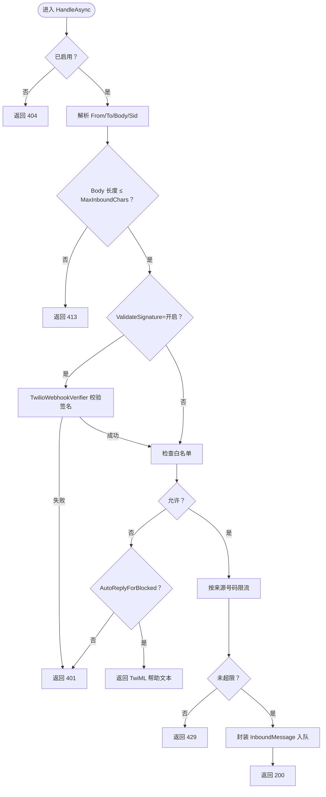
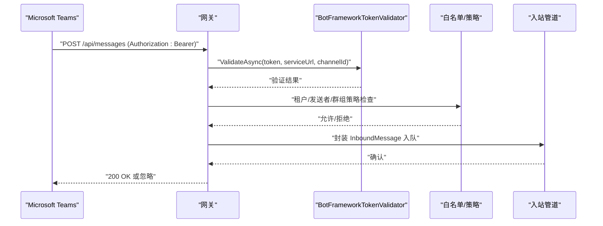
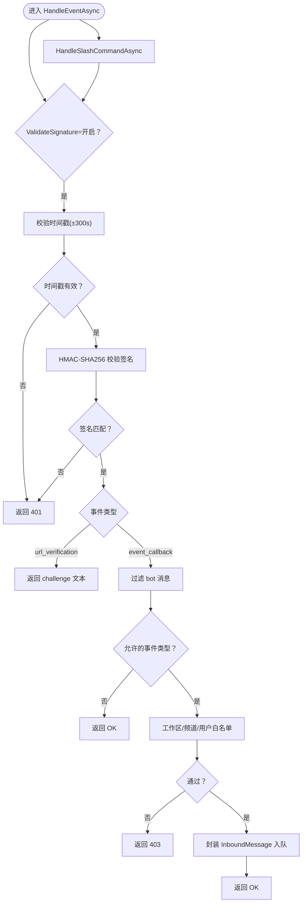
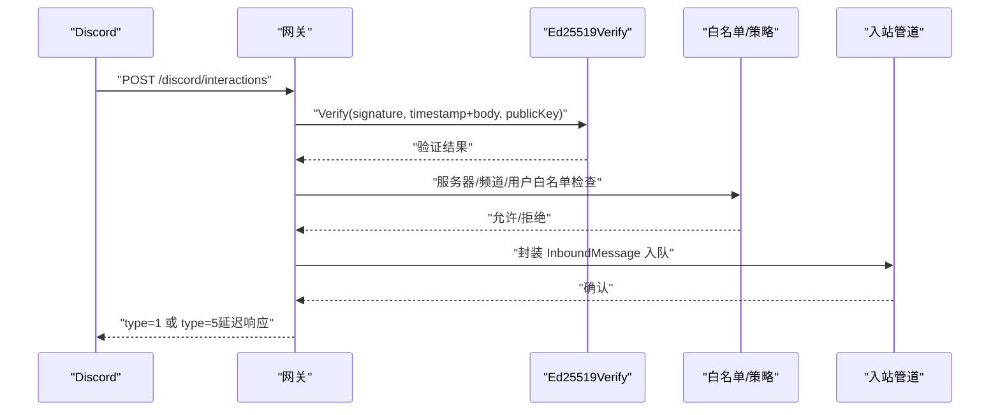
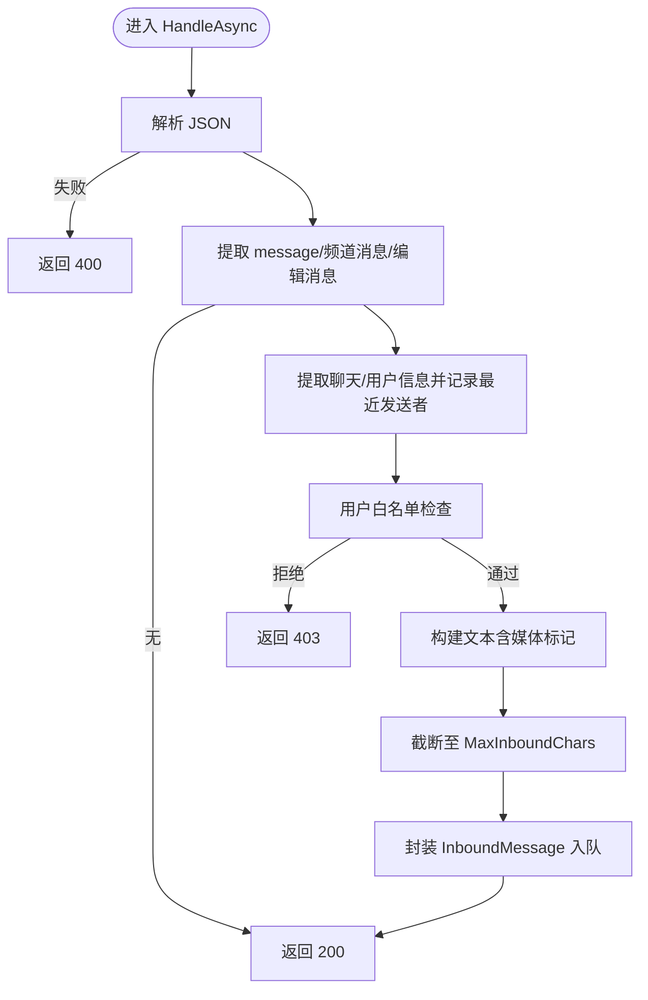
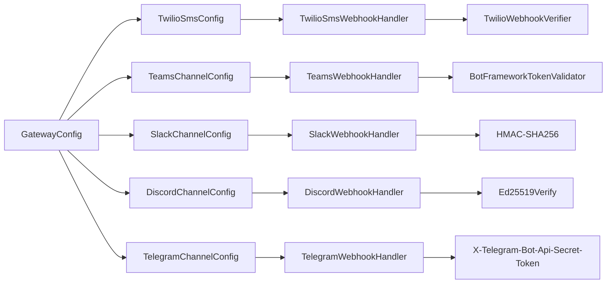

# 渠道 Webhook 认证

<cite>
**本文档引用的文件**
- [TwilioSmsWebhookHandler.cs](file://src/OpenClaw.Gateway/TwilioSmsWebhookHandler.cs)
- [TwilioWebhookVerifier.cs](file://src/OpenClaw.Gateway/TwilioWebhookVerifier.cs)
- [TeamsWebhookHandler.cs](file://src/OpenClaw.Gateway/TeamsWebhookHandler.cs)
- [BotFrameworkTokenValidator.cs](file://src/OpenClaw.Gateway/BotFrameworkTokenValidator.cs)
- [SlackWebhookHandler.cs](file://src/OpenClaw.Gateway/SlackWebhookHandler.cs)
- [DiscordWebhookHandler.cs](file://src/OpenClaw.Gateway/DiscordWebhookHandler.cs)
- [Ed25519Verify.cs](file://src/OpenClaw.Gateway/Ed25519Verify.cs)
- [TelegramWebhookHandler.cs](file://src/OpenClaw.Gateway/TelegramWebhookHandler.cs)
- [GatewayConfig.cs](file://src/OpenClaw.Core/Models/GatewayConfig.cs)
- [TEAMS_SETUP.md](file://docs/TEAMS_SETUP.md)
- [WHATSAPP_SETUP.md](file://docs/WHATSAPP_SETUP.md)
- [TwilioSmsTests.cs](file://src/OpenClaw.Tests/TwilioSmsTests.cs)
- [TeamsWebhookHandlerTests.cs](file://src/OpenClaw.Tests/TeamsWebhookHandlerTests.cs)
- [ChannelReadinessEvaluator.cs](file://src/OpenClaw.Gateway/ChannelReadinessEvaluator.cs)
- [SecurityPostureBuilder.cs](file://src/OpenClaw.Gateway/SecurityPostureBuilder.cs)
</cite>

## 目录
1. [简介](#简介)
2. [项目结构](#项目结构)
3. [核心组件](#核心组件)
4. [架构总览](#架构总览)
5. [详细组件分析](#详细组件分析)
6. [依赖关系分析](#依赖关系分析)
7. [性能考量](#性能考量)
8. [故障排除指南](#故障排除指南)
9. [结论](#结论)
10. [附录](#附录)

## 简介
本文件系统性梳理并对比了多种通信渠道（Twilio SMS、Microsoft Teams、Slack、Discord、Telegram）在 OpenClaw 中的 Webhook 认证与安全机制。重点覆盖以下方面：
- 各渠道特有的签名验证算法与密钥交换机制
- 安全参数配置项与环境变量注入方式
- Webhook URL 配置、回调端点路径与验证失败处理策略
- 认证配置示例与常见问题排查建议

## 项目结构
OpenClaw 的 Webhook 认证主要集中在 Gateway 层，按渠道拆分处理器与验证器，并通过统一的配置模型进行参数化控制。

**图表来源**
- [TwilioSmsWebhookHandler.cs:1-246](file://src/OpenClaw.Gateway/TwilioSmsWebhookHandler.cs#L1-L246)
- [TeamsWebhookHandler.cs:1-272](file://src/OpenClaw.Gateway/TeamsWebhookHandler.cs#L1-L272)
- [SlackWebhookHandler.cs:1-276](file://src/OpenClaw.Gateway/SlackWebhookHandler.cs#L1-L276)
- [DiscordWebhookHandler.cs:1-198](file://src/OpenClaw.Gateway/DiscordWebhookHandler.cs#L1-L198)
- [TelegramWebhookHandler.cs:1-252](file://src/OpenClaw.Gateway/TelegramWebhookHandler.cs#L1-L252)
- [GatewayConfig.cs:539-772](file://src/OpenClaw.Core/Models/GatewayConfig.cs#L539-L772)

**章节来源**
- [TwilioSmsWebhookHandler.cs:1-246](file://src/OpenClaw.Gateway/TwilioSmsWebhookHandler.cs#L1-L246)
- [TeamsWebhookHandler.cs:1-272](file://src/OpenClaw.Gateway/TeamsWebhookHandler.cs#L1-L272)
- [SlackWebhookHandler.cs:1-276](file://src/OpenClaw.Gateway/SlackWebhookHandler.cs#L1-L276)
- [DiscordWebhookHandler.cs:1-198](file://src/OpenClaw.Gateway/DiscordWebhookHandler.cs#L1-L198)
- [TelegramWebhookHandler.cs:1-252](file://src/OpenClaw.Gateway/TelegramWebhookHandler.cs#L1-L252)
- [GatewayConfig.cs:539-772](file://src/OpenClaw.Core/Models/GatewayConfig.cs#L539-L772)

## 核心组件
- Twilio SMS：基于 HMAC-SHA1 的签名验证，支持来源号码白名单与速率限制。
- Microsoft Teams：基于 Bot Framework 的 JWT RS256 验证，支持租户与会话引用存储。
- Slack：基于 HMAC-SHA256 的签名验证，支持时间戳防重放与工作区/频道/用户白名单。
- Discord：基于 Ed25519 的签名验证，支持时间戳防重放与服务器/频道/用户白名单。
- Telegram：基于 Telegram Bot API 的 Webhook Secret Token 验证，支持去重与媒体标记解析。

**章节来源**
- [TwilioWebhookVerifier.cs:1-40](file://src/OpenClaw.Gateway/TwilioWebhookVerifier.cs#L1-L40)
- [BotFrameworkTokenValidator.cs:1-410](file://src/OpenClaw.Gateway/BotFrameworkTokenValidator.cs#L1-L410)
- [SlackWebhookHandler.cs:1-276](file://src/OpenClaw.Gateway/SlackWebhookHandler.cs#L1-L276)
- [DiscordWebhookHandler.cs:1-198](file://src/OpenClaw.Gateway/DiscordWebhookHandler.cs#L1-L198)
- [Ed25519Verify.cs:1-41](file://src/OpenClaw.Gateway/Ed25519Verify.cs#L1-L41)
- [TelegramWebhookHandler.cs:1-252](file://src/OpenClaw.Gateway/TelegramWebhookHandler.cs#L1-L252)

## 架构总览
下图展示各渠道 Webhook 入口到消息处理的整体流程与关键安全检查点。

**图表来源**
- [TwilioSmsWebhookHandler.cs:86-162](file://src/OpenClaw.Gateway/TwilioSmsWebhookHandler.cs#L86-L162)
- [TeamsWebhookHandler.cs:42-188](file://src/OpenClaw.Gateway/TeamsWebhookHandler.cs#L42-L188)
- [SlackWebhookHandler.cs:42-154](file://src/OpenClaw.Gateway/SlackWebhookHandler.cs#L42-L154)
- [DiscordWebhookHandler.cs:52-158](file://src/OpenClaw.Gateway/DiscordWebhookHandler.cs#L52-L158)
- [TelegramWebhookHandler.cs:47-103](file://src/OpenClaw.Gateway/TelegramWebhookHandler.cs#L47-L103)

## 详细组件分析

### Twilio SMS Webhook 认证
- 签名算法：HMAC-SHA1，对 URL 与表单参数排序拼接后计算签名。
- 密钥交换：使用配置中的 Auth Token；签名验证失败直接返回 401。
- 安全参数：
  - ValidateSignature：是否启用签名验证
  - WebhookPublicBaseUrl/WebhookPath：用于构造签名计算的完整 URL
  - AllowedFromNumbers/AllowedToNumbers：来源/目标号码白名单
  - RateLimitPerFromPerMinute：按来源号码的每分钟速率限制
  - AutoReplyForBlocked/HelpText：阻止时自动回复帮助文本
- 回调端点：由 WebhookPublicBaseUrl + WebhookPath 组成
- 处理流程要点：
  - 必须包含 From/To 参数；Body 超长返回 413
  - 白名单不匹配可选择自动回复或直接拒绝
  - 按来源号码维护滑动窗口速率限制
  - 支持关键词：STOP/UNSUBSCRIBE/CANCEL/END/QUIT 停止订阅；START/YES/UNSTOP 恢复订阅；HELP/INFO 返回帮助文本

**图表来源**
- [TwilioSmsWebhookHandler.cs:86-162](file://src/OpenClaw.Gateway/TwilioSmsWebhookHandler.cs#L86-L162)
- [TwilioWebhookVerifier.cs:27-37](file://src/OpenClaw.Gateway/TwilioWebhookVerifier.cs#L27-L37)

**章节来源**
- [TwilioSmsWebhookHandler.cs:1-246](file://src/OpenClaw.Gateway/TwilioSmsWebhookHandler.cs#L1-L246)
- [TwilioWebhookVerifier.cs:1-40](file://src/OpenClaw.Gateway/TwilioWebhookVerifier.cs#L1-L40)
- [GatewayConfig.cs:694-711](file://src/OpenClaw.Core/Models/GatewayConfig.cs#L694-L711)
- [TwilioSmsTests.cs:17-94](file://src/OpenClaw.Tests/TwilioSmsTests.cs#L17-L94)

### Microsoft Teams Webhook 认证
- 签名/令牌：Bot Framework JWT（RS256），从公开 OpenID 配置与 JWKS 获取签名公钥，校验签名校验、发行者、受众、服务地址一致性、有效期与通道背书。
- 安全参数：
  - ValidateToken：是否启用 JWT 验证
  - AppId/AppPassword/TenantId：Azure Bot 应用凭据
  - AllowedTenantIds/AllowedFromIds：租户与发送者白名单
  - RequireMention：群组中是否要求 @ 提及
  - GroupPolicy/AllowedTeamIds/AllowedConversationIds：群组策略与允许列表
- 回调端点：WebhookPath（默认 /api/messages）
- 处理流程要点：
  - 仅处理 message 类型活动
  - 自动剥离 @mention 标签
  - 存储对话引用以支持主动消息
  - 租户/发送者/群组策略三重过滤

**图表来源**
- [TeamsWebhookHandler.cs:42-188](file://src/OpenClaw.Gateway/TeamsWebhookHandler.cs#L42-L188)
- [BotFrameworkTokenValidator.cs:40-134](file://src/OpenClaw.Gateway/BotFrameworkTokenValidator.cs#L40-L134)

**章节来源**
- [TeamsWebhookHandler.cs:1-272](file://src/OpenClaw.Gateway/TeamsWebhookHandler.cs#L1-L272)
- [BotFrameworkTokenValidator.cs:1-410](file://src/OpenClaw.Gateway/BotFrameworkTokenValidator.cs#L1-L410)
- [GatewayConfig.cs:636-686](file://src/OpenClaw.Core/Models/GatewayConfig.cs#L636-L686)
- [TEAMS_SETUP.md:1-205](file://docs/TEAMS_SETUP.md#L1-L205)
- [TeamsWebhookHandlerTests.cs:18-71](file://src/OpenClaw.Tests/TeamsWebhookHandlerTests.cs#L18-L71)

### Slack Webhook 认证
- 签名算法：HMAC-SHA256，签名字符串格式为 "v0:{timestamp}:{body}"，比较时使用固定时间比较避免时序攻击。
- 时间戳防重放：默认允许 300 秒窗口，超出则拒绝。
- 安全参数：
  - ValidateSignature：是否启用签名验证
  - SigningSecret/SigningSecretRef：签名密钥
  - AllowedWorkspaceIds/AllowedChannelIds/AllowedFromUserIds：工作区/频道/用户白名单
  - MaxInboundChars：最大长度截断
- 回调端点：
  - 事件回调：WebhookPath（默认 /slack/events）
  - 斜杠命令：SlashCommandPath（默认 /slack/commands）
- 处理流程要点：
  - URL verification challenge：当 type=url_verification 时返回 challenge
  - 过滤 bot 消息，防止回环
  - 仅处理 message 与 app_mention 事件
  - 支持线程消息会话标识

**图表来源**
- [SlackWebhookHandler.cs:42-154](file://src/OpenClaw.Gateway/SlackWebhookHandler.cs#L42-L154)
- [SlackWebhookHandler.cs:159-238](file://src/OpenClaw.Gateway/SlackWebhookHandler.cs#L159-L238)

**章节来源**
- [SlackWebhookHandler.cs:1-276](file://src/OpenClaw.Gateway/SlackWebhookHandler.cs#L1-L276)
- [GatewayConfig.cs:735-772](file://src/OpenClaw.Core/Models/GatewayConfig.cs#L735-L772)

### Discord Webhook 认证
- 签名算法：Ed25519，签名字符串为 "timestamp + body"，使用 BouncyCastle 实现跨平台一致性。
- 时间戳防重放：默认允许 300 秒窗口。
- 安全参数：
  - ValidateSignature：是否启用签名验证
  - PublicKey/PublicKeyRef：Bot 公钥（十六进制）
  - AllowedGuildIds/AllowedChannelIds/AllowedFromUserIds：服务器/频道/用户白名单
  - MaxInboundChars：最大长度截断
- 回调端点：交互类型 1（Ping）与 2（应用命令）处理
- 处理流程要点：
  - 类型 1：返回 {"type":1}
  - 类型 2：解析交互，提取选项文本，支持线程式“思考中”响应
  - 对于不满足条件的请求返回相应错误 JSON

**图表来源**
- [DiscordWebhookHandler.cs:52-158](file://src/OpenClaw.Gateway/DiscordWebhookHandler.cs#L52-L158)
- [Ed25519Verify.cs:17-34](file://src/OpenClaw.Gateway/Ed25519Verify.cs#L17-L34)

**章节来源**
- [DiscordWebhookHandler.cs:1-198](file://src/OpenClaw.Gateway/DiscordWebhookHandler.cs#L1-L198)
- [Ed25519Verify.cs:1-41](file://src/OpenClaw.Gateway/Ed25519Verify.cs#L1-L41)
- [GatewayConfig.cs:753-772](file://src/OpenClaw.Core/Models/GatewayConfig.cs#L753-L772)

### Telegram Webhook 认证
- 签名验证：通过 X-Telegram-Bot-Api-Secret-Token 头部进行验证，需在 Telegram Bot API 设置 Webhook 时配置。
- 安全参数：
  - ValidateSignature：是否启用签名验证
  - WebhookSecretToken/WebhookSecretTokenRef：Webhook 密钥引用
  - AllowedFromUserIds：用户白名单
  - MaxInboundChars：最大长度截断
- 回调端点：WebhookPath（默认 /telegram/inbound）
- 处理流程要点：
  - 解析 JSON 更新，支持 message/channel_post/edited_message 等
  - 自动记录最近发送者
  - 支持媒体标记（图片/视频/音频/文档/贴纸）解析
  - 无正文内容时忽略

**图表来源**
- [TelegramWebhookHandler.cs:47-103](file://src/OpenClaw.Gateway/TelegramWebhookHandler.cs#L47-L103)

**章节来源**
- [TelegramWebhookHandler.cs:1-252](file://src/OpenClaw.Gateway/TelegramWebhookHandler.cs#L1-L252)
- [GatewayConfig.cs:713-733](file://src/OpenClaw.Core/Models/GatewayConfig.cs#L713-L733)

## 依赖关系分析
- 处理器与验证器解耦：各渠道处理器仅负责业务逻辑与白名单，签名/令牌验证由独立验证器完成。
- 配置驱动：所有渠道均通过 GatewayConfig 的子配置对象进行参数化，便于切换与扩展。
- 安全就绪评估：系统级安全态势构建器会检查各渠道签名验证就绪状态，确保公网绑定时具备必要的安全保护。

**图表来源**
- [GatewayConfig.cs:539-772](file://src/OpenClaw.Core/Models/GatewayConfig.cs#L539-L772)
- [TwilioSmsWebhookHandler.cs:1-246](file://src/OpenClaw.Gateway/TwilioSmsWebhookHandler.cs#L1-L246)
- [TeamsWebhookHandler.cs:1-272](file://src/OpenClaw.Gateway/TeamsWebhookHandler.cs#L1-L272)
- [SlackWebhookHandler.cs:1-276](file://src/OpenClaw.Gateway/SlackWebhookHandler.cs#L1-L276)
- [DiscordWebhookHandler.cs:1-198](file://src/OpenClaw.Gateway/DiscordWebhookHandler.cs#L1-L198)
- [TelegramWebhookHandler.cs:1-252](file://src/OpenClaw.Gateway/TelegramWebhookHandler.cs#L1-L252)

**章节来源**
- [SecurityPostureBuilder.cs:141-147](file://src/OpenClaw.Gateway/SecurityPostureBuilder.cs#L141-L147)
- [ChannelReadinessEvaluator.cs:124-146](file://src/OpenClaw.Gateway/ChannelReadinessEvaluator.cs#L124-L146)

## 性能考量
- Twilio：按来源号码维护滑动窗口速率限制，定期清理过期窗口，避免内存膨胀。
- Teams/Slack/Discord/Telegram：均采用即时验证与短生命周期缓存（如 Teams 的 JWKS 快照），减少重复网络请求。
- 建议：
  - 在高并发场景下，合理设置 MaxInboundChars 与 MaxRequestBytes，避免超大负载。
  - 对于 Teams，建议在生产环境启用 ValidateToken 并正确配置 AppId/AppPassword/TenantId。

[本节为通用指导，无需特定文件引用]

## 故障排除指南
- Twilio
  - 现象：返回 401
  - 排查：确认 WebhookPublicBaseUrl 与 WebhookPath 正确；验证 Auth Token；检查签名计算顺序与参数。
  - 参考：单元测试覆盖了有效签名接受与无效签名拒绝的场景。
- Teams
  - 现象：本地手动测试返回 401
  - 排查：Webhook 仅接受来自 Bot Framework 的有效 JWT；可通过 Azure Web Chat 测试；检查 ValidateToken、AppId、AppPassword、TenantId。
  - 参考：官方设置文档与测试用例展示了有效 JWT 生成与验证流程。
- Slack
  - 现象：返回 401 或 403
  - 排查：确认 SigningSecret/SigningSecretRef；检查时间戳是否在 300 秒窗口内；核对工作区/频道/用户白名单。
- Discord
  - 现象：返回 invalid request signature 或 403
  - 排查：确认 PublicKey/PublicKeyRef（十六进制）；检查时间戳窗口；核对服务器/频道/用户白名单。
- Telegram
  - 现象：返回 403
  - 排查：确认 WebhookSecretToken/WebhookSecretTokenRef；确保在 Telegram Bot API 设置了相同的密钥；检查用户白名单。

**章节来源**
- [TwilioSmsTests.cs:65-94](file://src/OpenClaw.Tests/TwilioSmsTests.cs#L65-L94)
- [TeamsWebhookHandlerTests.cs:18-71](file://src/OpenClaw.Tests/TeamsWebhookHandlerTests.cs#L18-L71)
- [TEAMS_SETUP.md:182-205](file://docs/TEAMS_SETUP.md#L182-L205)
- [ChannelReadinessEvaluator.cs:124-146](file://src/OpenClaw.Gateway/ChannelReadinessEvaluator.cs#L124-L146)

## 结论
OpenClaw 为多渠道 Webhook 提供了统一的安全框架：以配置驱动的参数化、细粒度的白名单与策略、以及针对各渠道特性的签名/令牌验证。建议在公网部署时务必启用各渠道的签名验证功能，并结合环境变量与密钥管理工具进行安全配置。

[本节为总结性内容，无需特定文件引用]

## 附录

### 各渠道认证配置示例与要点
- Twilio SMS
  - 关键项：ValidateSignature、WebhookPublicBaseUrl、WebhookPath、AllowedFromNumbers、AllowedToNumbers、RateLimitPerFromPerMinute
  - 参考：[GatewayConfig.cs:694-711](file://src/OpenClaw.Core/Models/GatewayConfig.cs#L694-L711)
- Microsoft Teams
  - 关键项：ValidateToken、AppId/AppIdRef、AppPassword/AppPasswordRef、TenantId/TenantIdRef、WebhookPath、RequireMention、AllowedTenantIds、AllowedFromIds、AllowedTeamIds、AllowedConversationIds
  - 参考：[GatewayConfig.cs:636-686](file://src/OpenClaw.Core/Models/GatewayConfig.cs#L636-L686)，[TEAMS_SETUP.md:23-53](file://docs/TEAMS_SETUP.md#L23-L53)
- Slack
  - 关键项：ValidateSignature、SigningSecret/SigningSecretRef、WebhookPath、SlashCommandPath、AllowedWorkspaceIds、AllowedChannelIds、AllowedFromUserIds
  - 参考：[GatewayConfig.cs:735-772](file://src/OpenClaw.Core/Models/GatewayConfig.cs#L735-L772)
- Discord
  - 关键项：ValidateSignature、PublicKey/PublicKeyRef、AllowedGuildIds、AllowedChannelIds、AllowedFromUserIds
  - 参考：[GatewayConfig.cs:753-772](file://src/OpenClaw.Core/Models/GatewayConfig.cs#L753-L772)
- Telegram
  - 关键项：ValidateSignature、WebhookSecretToken/WebhookSecretTokenRef、WebhookPath、AllowedFromUserIds
  - 参考：[GatewayConfig.cs:713-733](file://src/OpenClaw.Core/Models/GatewayConfig.cs#L713-L733)

**章节来源**
- [GatewayConfig.cs:539-772](file://src/OpenClaw.Core/Models/GatewayConfig.cs#L539-L772)
- [TEAMS_SETUP.md:23-53](file://docs/TEAMS_SETUP.md#L23-L53)