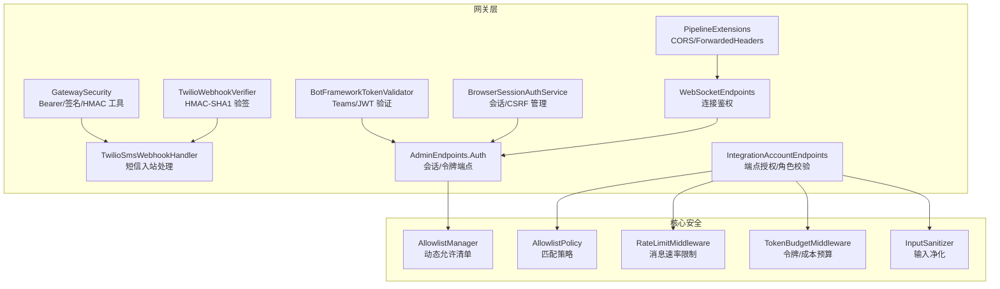
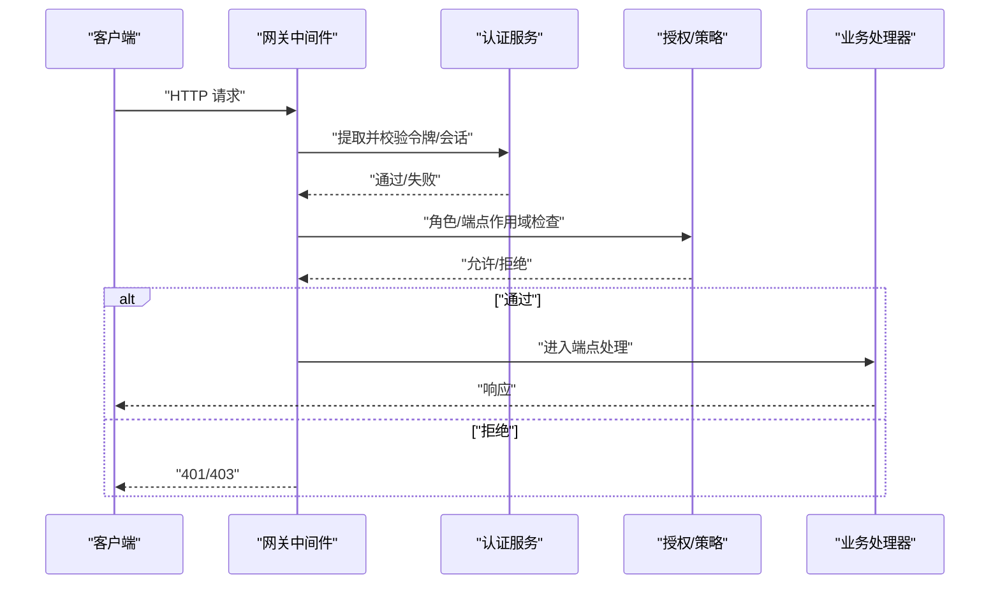
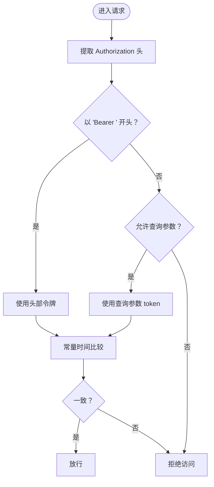
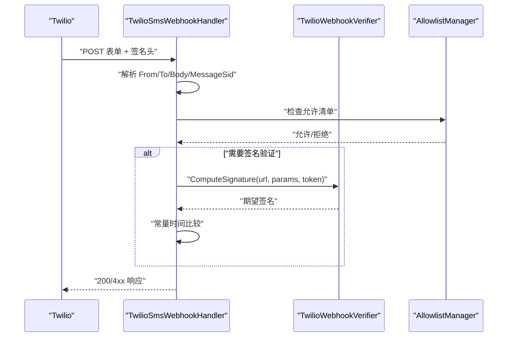
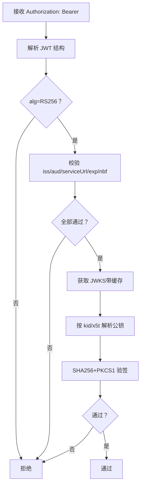
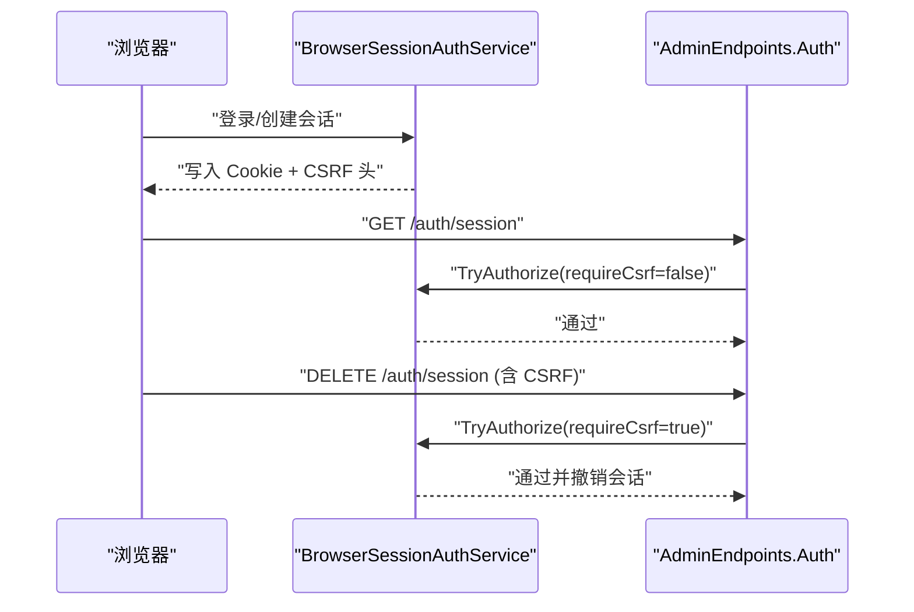
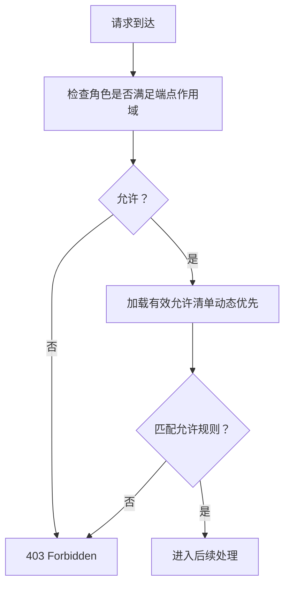
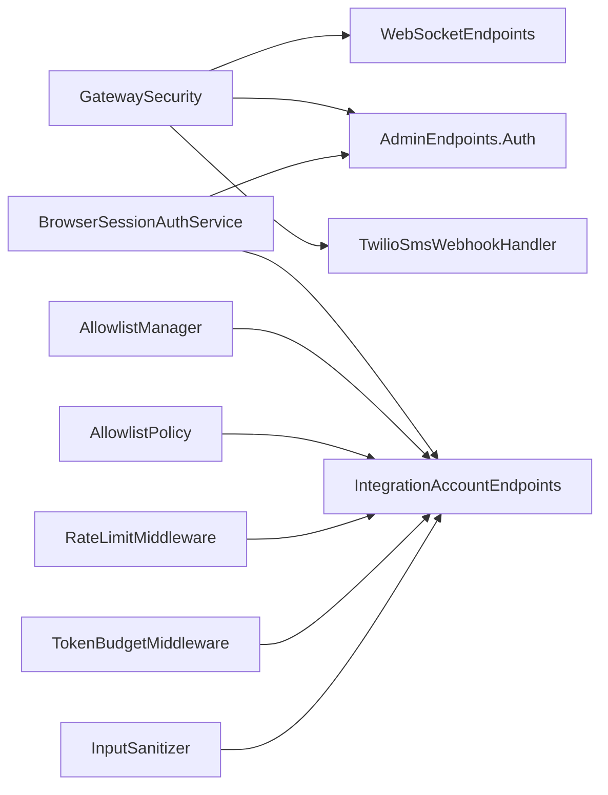

# 认证与授权

<cite>
**本文引用的文件**
- [GatewaySecurity.cs](file://src/OpenClaw.Gateway/GatewaySecurity.cs)
- [TwilioWebhookVerifier.cs](file://src/OpenClaw.Gateway/TwilioWebhookVerifier.cs)
- [TwilioSmsWebhookHandler.cs](file://src/OpenClaw.Gateway/Endpoints/TwilioSmsWebhookHandler.cs)
- [BotFrameworkTokenValidator.cs](file://src/OpenClaw.Gateway/BotFrameworkTokenValidator.cs)
- [BrowserSessionAuthService.cs](file://src/OpenClaw.Gateway/BrowserSessionAuthService.cs)
- [PipelineExtensions.cs](file://src/OpenClaw.Gateway/Pipeline/PipelineExtensions.cs)
- [WebSocketEndpoints.cs](file://src/OpenClaw.Gateway/Endpoints/WebSocketEndpoints.cs)
- [AdminEndpoints.Auth.cs](file://src/OpenClaw.Gateway/Endpoints/AdminEndpoints.Auth.cs)
- [IntegrationAccountEndpoints.cs](file://src/OpenClaw.Gateway/Endpoints/IntegrationAccountEndpoints.cs)
- [AllowlistManager.cs](file://src/OpenClaw.Core/Security/AllowlistManager.cs)
- [AllowlistPolicy.cs](file://src/OpenClaw.Core/Security/AllowlistPolicy.cs)
- [RateLimitMiddleware.cs](file://src/OpenClaw.Core/Middleware/RateLimitMiddleware.cs)
- [TokenBudgetMiddleware.cs](file://src/OpenClaw.Core/Middleware/TokenBudgetMiddleware.cs)
- [InputSanitizer.cs](file://src/OpenClaw.Core/Safety/InputSanitizer.cs)
- [appsettings.json](file://src/OpenClaw.Gateway/appsettings.json)
- [appsettings.Production.json](file://src/OpenClaw.Gateway/appsettings.Production.json)
- [GatewayAdminEndpointTests.cs](file://src/OpenClaw.Tests/GatewayAdminEndpointTests.cs)
- [BrowserSessionAuthServiceTests.cs](file://src/OpenClaw.Tests/BrowserSessionAuthServiceTests.cs)
- [TwilioSmsTests.cs](file://src/OpenClaw.Tests/TwilioSmsTests.cs)
- [GatewaySecurityTests.cs](file://src/OpenClaw.Tests/GatewaySecurityTests.cs)
</cite>

## 目录
1. [简介](#简介)
2. [项目结构](#项目结构)
3. [核心组件](#核心组件)
4. [架构总览](#架构总览)
5. [详细组件分析](#详细组件分析)
6. [依赖关系分析](#依赖关系分析)
7. [性能考量](#性能考量)
8. [故障排查指南](#故障排查指南)
9. [结论](#结论)
10. [附录](#附录)

## 简介
本文件面向认证与授权系统，围绕以下目标展开：统一说明多种认证机制（Bearer Token、Twilio Webhook 验证、Bot Framework 验证、浏览器会话与 CSRF）、授权策略与角色管理、访问控制清单（Allowlist）与通道策略、安全配置示例、令牌与会话管理、以及 CSRF 保护、XSS 防护与 API 速率限制等安全实践。内容基于仓库中的实际实现进行梳理，确保可操作性与可追溯性。

## 项目结构
认证与授权相关能力主要分布在网关层与核心安全模块中：
- 网关层提供入口与协议适配（HTTP、WebSocket、Webhook）
- 核心安全模块提供通用策略与工具（Allowlist、输入净化、速率限制、令牌预算）

图表来源
- [GatewaySecurity.cs:13-76](file://src/OpenClaw.Gateway/GatewaySecurity.cs#L13-L76)
- [TwilioWebhookVerifier.cs:8-37](file://src/OpenClaw.Gateway/TwilioWebhookVerifier.cs#L8-L37)
- [TwilioSmsWebhookHandler.cs:86-119](file://src/OpenClaw.Gateway/Endpoints/TwilioSmsWebhookHandler.cs#L86-L119)
- [BotFrameworkTokenValidator.cs:40-134](file://src/OpenClaw.Gateway/BotFrameworkTokenValidator.cs#L40-L134)
- [BrowserSessionAuthService.cs:68-107](file://src/OpenClaw.Gateway/BrowserSessionAuthService.cs#L68-L107)
- [PipelineExtensions.cs:91-136](file://src/OpenClaw.Gateway/Pipeline/PipelineExtensions.cs#L91-L136)
- [WebSocketEndpoints.cs:106-118](file://src/OpenClaw.Gateway/Endpoints/WebSocketEndpoints.cs#L106-L118)
- [AdminEndpoints.Auth.cs:145-178](file://src/OpenClaw.Gateway/Endpoints/AdminEndpoints.Auth.cs#L145-L178)
- [IntegrationAccountEndpoints.cs:86-108](file://src/OpenClaw.Gateway/Endpoints/IntegrationAccountEndpoints.cs#L86-L108)
- [AllowlistManager.cs:32-51](file://src/OpenClaw.Core/Security/AllowlistManager.cs#L32-L51)
- [AllowlistPolicy.cs:18-40](file://src/OpenClaw.Core/Security/AllowlistPolicy.cs#L18-L40)
- [RateLimitMiddleware.cs:39-68](file://src/OpenClaw.Core/Middleware/RateLimitMiddleware.cs#L39-L68)
- [TokenBudgetMiddleware.cs:12-30](file://src/OpenClaw.Core/Middleware/TokenBudgetMiddleware.cs#L12-L30)
- [InputSanitizer.cs:24-67](file://src/OpenClaw.Core/Safety/InputSanitizer.cs#L24-L67)

章节来源
- [appsettings.json:82-102](file://src/OpenClaw.Gateway/appsettings.json#L82-L102)
- [appsettings.Production.json:22-30](file://src/OpenClaw.Gateway/appsettings.Production.json#L22-L30)

## 核心组件
- Bearer Token 提取与校验：从 Authorization 头或查询参数提取令牌，支持常量时间比较，避免时序攻击。
- Twilio Webhook 验证：使用 HMAC-SHA1 对 URL 与表单参数排序拼接后的数据进行签名验证。
- Bot Framework 验证：解析 JWT，校验签发者、受众、过期时间、serviceUrl、密钥轮换与通道背书。
- 浏览器会话与 CSRF：基于 Cookie 的会话票据，要求对变更类请求携带 CSRF 头；支持持久化与非持久化会话。
- CORS 与代理头信任：仅在已知代理列表内信任 X-Forwarded-*，并按白名单 Origin 放行。
- 允许清单与通道策略：动态允许清单优先于静态配置；支持严格与兼容两种匹配语义。
- 速率限制与令牌预算：按会话/通道维度限制消息频率；可结合令牌用量与成本进行短路控制。
- 输入净化：检测 Shell 元字符、剥离 CRLF、校验内存键与 IMAP 文件夹名，降低注入风险。

章节来源
- [GatewaySecurity.cs:13-76](file://src/OpenClaw.Gateway/GatewaySecurity.cs#L13-L76)
- [TwilioWebhookVerifier.cs:8-37](file://src/OpenClaw.Gateway/TwilioWebhookVerifier.cs#L8-L37)
- [BotFrameworkTokenValidator.cs:40-134](file://src/OpenClaw.Gateway/BotFrameworkTokenValidator.cs#L40-L134)
- [BrowserSessionAuthService.cs:68-107](file://src/OpenClaw.Gateway/BrowserSessionAuthService.cs#L68-L107)
- [PipelineExtensions.cs:91-136](file://src/OpenClaw.Gateway/Pipeline/PipelineExtensions.cs#L91-L136)
- [AllowlistManager.cs:32-51](file://src/OpenClaw.Core/Security/AllowlistManager.cs#L32-L51)
- [AllowlistPolicy.cs:18-40](file://src/OpenClaw.Core/Security/AllowlistPolicy.cs#L18-L40)
- [RateLimitMiddleware.cs:39-68](file://src/OpenClaw.Core/Middleware/RateLimitMiddleware.cs#L39-L68)
- [TokenBudgetMiddleware.cs:12-30](file://src/OpenClaw.Core/Middleware/TokenBudgetMiddleware.cs#L12-L30)
- [InputSanitizer.cs:24-67](file://src/OpenClaw.Core/Safety/InputSanitizer.cs#L24-L67)

## 架构总览
下图展示从客户端到网关端点的典型认证与授权流程，包括 Bearer Token、浏览器会话、Webhook 验签与 Bot Framework JWT 验证。

图表来源
- [GatewaySecurity.cs:13-37](file://src/OpenClaw.Gateway/GatewaySecurity.cs#L13-L37)
- [BrowserSessionAuthService.cs:68-107](file://src/OpenClaw.Gateway/BrowserSessionAuthService.cs#L68-L107)
- [IntegrationAccountEndpoints.cs:86-108](file://src/OpenClaw.Gateway/Endpoints/IntegrationAccountEndpoints.cs#L86-L108)

## 详细组件分析

### Bearer Token 认证
- 令牌提取：优先从 Authorization: Bearer 头读取；若允许查询参数，则从 token 查询参数读取。
- 安全比较：使用常量时间比较防止时序攻击。
- 使用场景：WebSocket 连接鉴权、管理员端点访问。

图表来源
- [GatewaySecurity.cs:13-49](file://src/OpenClaw.Gateway/GatewaySecurity.cs#L13-L49)
- [WebSocketEndpoints.cs:106-118](file://src/OpenClaw.Gateway/Endpoints/WebSocketEndpoints.cs#L106-L118)

章节来源
- [GatewaySecurity.cs:13-49](file://src/OpenClaw.Gateway/GatewaySecurity.cs#L13-L49)
- [GatewaySecurityTests.cs:10-48](file://src/OpenClaw.Tests/GatewaySecurityTests.cs#L10-L48)
- [WebSocketEndpoints.cs:106-118](file://src/OpenClaw.Gateway/Endpoints/WebSocketEndpoints.cs#L106-L118)

### Twilio Webhook 验证
- 验签算法：对 URL 与表单参数按键排序拼接后，使用 HMAC-SHA1 并 Base64 编码生成签名。
- 验签过程：计算期望签名并与提供的签名进行常量时间比较。
- 入站处理：校验 From/To、长度限制、签名、允许清单与自动回复策略。

图表来源
- [TwilioSmsWebhookHandler.cs:86-119](file://src/OpenClaw.Gateway/Endpoints/TwilioSmsWebhookHandler.cs#L86-L119)
- [TwilioWebhookVerifier.cs:8-37](file://src/OpenClaw.Gateway/TwilioWebhookVerifier.cs#L8-L37)
- [AllowlistManager.cs:32-51](file://src/OpenClaw.Core/Security/AllowlistManager.cs#L32-L51)

章节来源
- [TwilioSmsWebhookHandler.cs:86-119](file://src/OpenClaw.Gateway/Endpoints/TwilioSmsWebhookHandler.cs#L86-L119)
- [TwilioWebhookVerifier.cs:8-37](file://src/OpenClaw.Gateway/TwilioWebhookVerifier.cs#L8-L37)
- [TwilioSmsTests.cs:39-141](file://src/OpenClaw.Tests/TwilioSmsTests.cs#L39-L141)

### Bot Framework 验证（Teams）
- JWT 解析：分离 Header/Payload/SignedBytes/Signature。
- 校验项：算法必须为 RS256；签发者、受众、serviceUrl、过期与生效时间、通道背书。
- 密钥轮换：从 Bot Framework 元数据拉取 JWKS，缓存并按 TTL 刷新。
- 签名校验：根据 kid/x5t 解析公钥，使用 SHA256+PKCS1 验证签名。

图表来源
- [BotFrameworkTokenValidator.cs:40-134](file://src/OpenClaw.Gateway/BotFrameworkTokenValidator.cs#L40-L134)

章节来源
- [BotFrameworkTokenValidator.cs:40-134](file://src/OpenClaw.Gateway/BotFrameworkTokenValidator.cs#L40-L134)

### 浏览器会话与 CSRF 保护
- 会话票据：包含 SessionId、CSRF Token、过期时间、持久化标记与角色信息。
- 授权流程：读取 Cookie 中的 SessionId，校验未过期；对变更类请求要求携带 CSRF 头。
- Cookie 安全属性：HttpOnly、SameSite=Lax、Secure（HTTPS 时）、路径限定。
- 会话生命周期：按配置的空闲/记住天数动态调整；定期清理过期会话。

图表来源
- [BrowserSessionAuthService.cs:32-107](file://src/OpenClaw.Gateway/BrowserSessionAuthService.cs#L32-L107)
- [AdminEndpoints.Auth.cs:177-178](file://src/OpenClaw.Gateway/Endpoints/AdminEndpoints.Auth.cs#L177-L178)
- [BrowserSessionAuthServiceTests.cs:10-39](file://src/OpenClaw.Tests/BrowserSessionAuthServiceTests.cs#L10-L39)

章节来源
- [BrowserSessionAuthService.cs:32-107](file://src/OpenClaw.Gateway/BrowserSessionAuthService.cs#L32-L107)
- [BrowserSessionAuthServiceTests.cs:10-67](file://src/OpenClaw.Tests/BrowserSessionAuthServiceTests.cs#L10-L67)
- [GatewayAdminEndpointTests.cs:87-109](file://src/OpenClaw.Tests/GatewayAdminEndpointTests.cs#L87-L109)

### 授权策略、角色管理与访问控制
- 角色与端点作用域：端点映射时检查调用方角色是否满足所需最低角色。
- 通道允许清单：动态允许清单优先于静态配置；支持严格与兼容两种匹配模式。
- 通道策略：不同通道（如 SMS、Teams、Slack）可独立配置允许清单与验证开关。

图表来源
- [IntegrationAccountEndpoints.cs:86-108](file://src/OpenClaw.Gateway/Endpoints/IntegrationAccountEndpoints.cs#L86-L108)
- [AllowlistManager.cs:50-51](file://src/OpenClaw.Core/Security/AllowlistManager.cs#L50-L51)
- [AllowlistPolicy.cs:18-40](file://src/OpenClaw.Core/Security/AllowlistPolicy.cs#L18-L40)

章节来源
- [IntegrationAccountEndpoints.cs:86-108](file://src/OpenClaw.Gateway/Endpoints/IntegrationAccountEndpoints.cs#L86-L108)
- [AllowlistManager.cs:50-51](file://src/OpenClaw.Core/Security/AllowlistManager.cs#L50-L51)
- [AllowlistPolicy.cs:18-40](file://src/OpenClaw.Core/Security/AllowlistPolicy.cs#L18-L40)

### 会话管理与安全配置
- 绑定地址与跨域：仅在已知代理列表内信任 X-Forwarded-*；按白名单 Origin 放行。
- 安全配置项：是否允许查询参数令牌、允许的 Origin、代理信任、浏览器会话空闲/记住周期、OIDC 参数等。
- 生产环境预设：公开绑定时启用更严格的工具与插件策略。

章节来源
- [PipelineExtensions.cs:91-136](file://src/OpenClaw.Gateway/Pipeline/PipelineExtensions.cs#L91-L136)
- [appsettings.json:82-102](file://src/OpenClaw.Gateway/appsettings.json#L82-L102)
- [appsettings.Production.json:22-30](file://src/OpenClaw.Gateway/appsettings.Production.json#L22-L30)

### CSRF 保护、XSS 防护与 API 速率限制
- CSRF：变更类请求必须携带 CSRF 头，且与会话票据中的 CSRF Token 匹配。
- XSS 防护：前端侧建议采用 CSP、HttpOnly Cookie、SameSite 等默认安全设置；后端通过输入净化减少注入风险。
- 速率限制：按会话/通道维度统计最近 1 分钟的消息数量，超过阈值则短路返回用户提示。
- 令牌预算：按会话累计输入/输出令牌数进行短路控制；可选成本预算回调。

章节来源
- [BrowserSessionAuthService.cs:68-107](file://src/OpenClaw.Gateway/BrowserSessionAuthService.cs#L68-L107)
- [RateLimitMiddleware.cs:39-68](file://src/OpenClaw.Core/Middleware/RateLimitMiddleware.cs#L39-L68)
- [TokenBudgetMiddleware.cs:12-30](file://src/OpenClaw.Core/Middleware/TokenBudgetMiddleware.cs#L12-L30)
- [InputSanitizer.cs:24-67](file://src/OpenClaw.Core/Safety/InputSanitizer.cs#L24-L67)

## 依赖关系分析
- 网关安全工具被多处端点复用：HTTP/WebSocket/Webhook/管理端点均依赖令牌提取与常量时间比较。
- 允许清单与策略解耦：通道策略通过 AllowlistManager/AllowlistPolicy 实现，便于扩展与测试。
- 中间件管道：速率限制与令牌预算作为消息级中间件插入处理管线，影响所有消息流。

图表来源
- [GatewaySecurity.cs:13-76](file://src/OpenClaw.Gateway/GatewaySecurity.cs#L13-L76)
- [BrowserSessionAuthService.cs:68-107](file://src/OpenClaw.Gateway/BrowserSessionAuthService.cs#L68-L107)
- [IntegrationAccountEndpoints.cs:86-108](file://src/OpenClaw.Gateway/Endpoints/IntegrationAccountEndpoints.cs#L86-L108)
- [AllowlistManager.cs:32-51](file://src/OpenClaw.Core/Security/AllowlistManager.cs#L32-L51)
- [AllowlistPolicy.cs:18-40](file://src/OpenClaw.Core/Security/AllowlistPolicy.cs#L18-L40)
- [RateLimitMiddleware.cs:39-68](file://src/OpenClaw.Core/Middleware/RateLimitMiddleware.cs#L39-L68)
- [TokenBudgetMiddleware.cs:12-30](file://src/OpenClaw.Core/Middleware/TokenBudgetMiddleware.cs#L12-L30)
- [InputSanitizer.cs:24-67](file://src/OpenClaw.Core/Safety/InputSanitizer.cs#L24-L67)

## 性能考量
- 常量时间比较：避免分支暴露时序信息，适合高并发下的令牌比较。
- 缓存与并发：Bot Framework 密钥元数据按小时缓存，使用信号量避免并发刷新。
- 内存占用：会话票据与速率窗口使用并发字典存储，定期清理过期条目。
- 算法选择：HMAC-SHA1 用于 Twilio 验签，HMAC-SHA256 用于通用签名验证。

## 故障排查指南
- Bearer Token 无效
  - 检查 Authorization 头格式与令牌长度；确认是否允许查询参数令牌。
  - 参考测试用例断言行为。
  章节来源
  - [GatewaySecurityTests.cs:10-48](file://src/OpenClaw.Tests/GatewaySecurityTests.cs#L10-L48)

- Twilio Webhook 被拒
  - 确认 webhook URL、参数排序与签名算法；检查公有基础 URL 与签名验证开关。
  - 参考测试用例覆盖签名错误与速率限制场景。
  章节来源
  - [TwilioSmsTests.cs:66-141](file://src/OpenClaw.Tests/TwilioSmsTests.cs#L66-L141)

- Teams/JWT 验证失败
  - 检查签发者、受众、serviceUrl、过期时间与通道背书；确认 JWKS 获取与缓存。
  章节来源
  - [BotFrameworkTokenValidator.cs:40-134](file://src/OpenClaw.Gateway/BotFrameworkTokenValidator.cs#L40-L134)

- 浏览器会话 CSRF 错误
  - 确认 Cookie 与 CSRF 头同时存在；变更类请求必须携带 CSRF。
  章节来源
  - [BrowserSessionAuthServiceTests.cs:27-39](file://src/OpenClaw.Tests/BrowserSessionAuthServiceTests.cs#L27-L39)
  - [GatewayAdminEndpointTests.cs:87-109](file://src/OpenClaw.Tests/GatewayAdminEndpointTests.cs#L87-L109)

- CORS 或代理头问题
  - 确认 KnownProxies 与 TrustForwardedHeaders 设置；检查 AllowedOrigins。
  章节来源
  - [PipelineExtensions.cs:91-136](file://src/OpenClaw.Gateway/Pipeline/PipelineExtensions.cs#L91-L136)
  - [appsettings.json:82-102](file://src/OpenClaw.Gateway/appsettings.json#L82-L102)

- 速率限制触发
  - 检查每分钟消息上限与清理周期；关注短路提示信息。
  章节来源
  - [RateLimitMiddleware.cs:39-68](file://src/OpenClaw.Core/Middleware/RateLimitMiddleware.cs#L39-L68)

## 结论
该系统通过多层认证与授权机制保障安全性：以 Bearer Token 和浏览器会话为基础，辅以 Webhook 与 Bot Framework 的强验证；配合允许清单、速率限制与令牌预算形成纵深防御；并通过 CORS 与代理头信任策略提升部署灵活性。建议在生产环境中启用更严格的公共绑定策略与输入净化，持续监控与审计访问日志。

## 附录
- 安全配置示例（摘自配置文件）
  - 允许查询参数令牌：关闭（开发环境可开启）
  - 允许的 Origin 白名单：按需配置
  - 代理信任：仅在 KnownProxies 列表内信任 X-Forwarded-*
  - OIDC 参数：Authority、Audience、HTTPS 元数据要求
  - 浏览器会话：空闲分钟数与记住天数
  - 生产环境预设：公开绑定时的工具与插件限制

章节来源
- [appsettings.json:82-102](file://src/OpenClaw.Gateway/appsettings.json#L82-L102)
- [appsettings.Production.json:22-30](file://src/OpenClaw.Gateway/appsettings.Production.json#L22-L30)