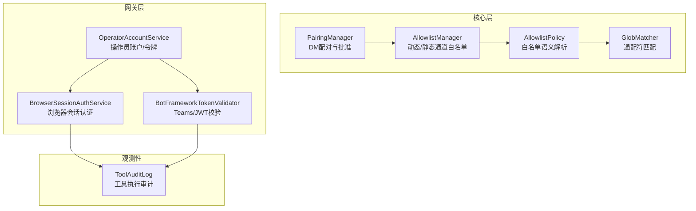
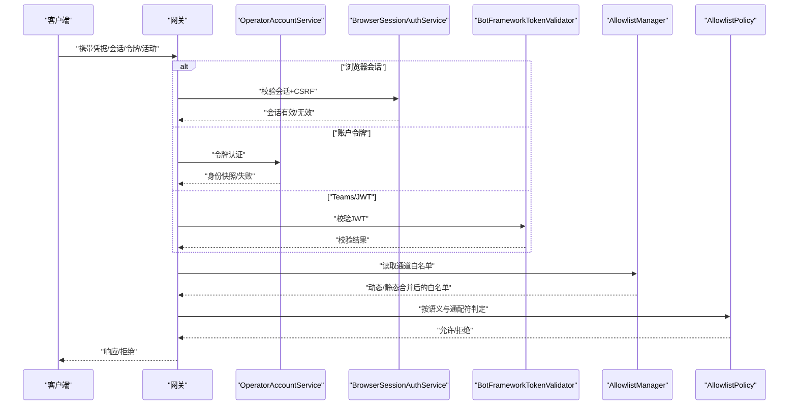
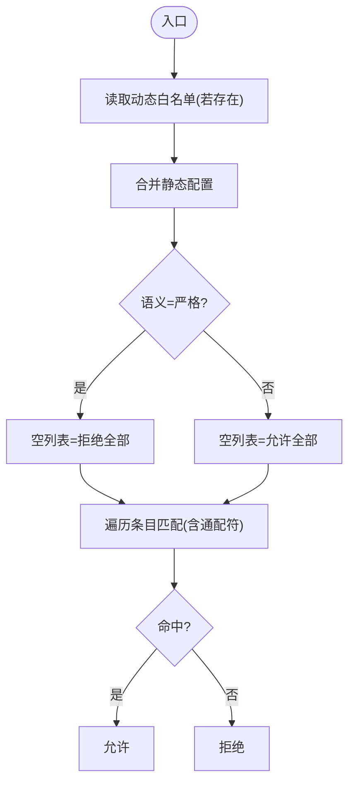
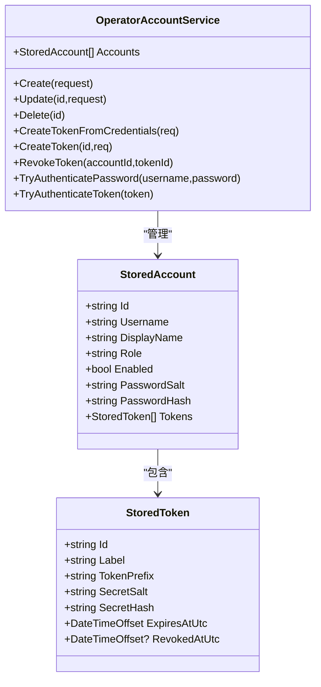
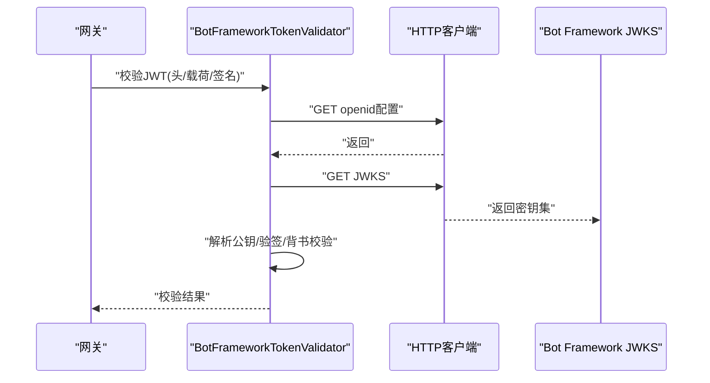
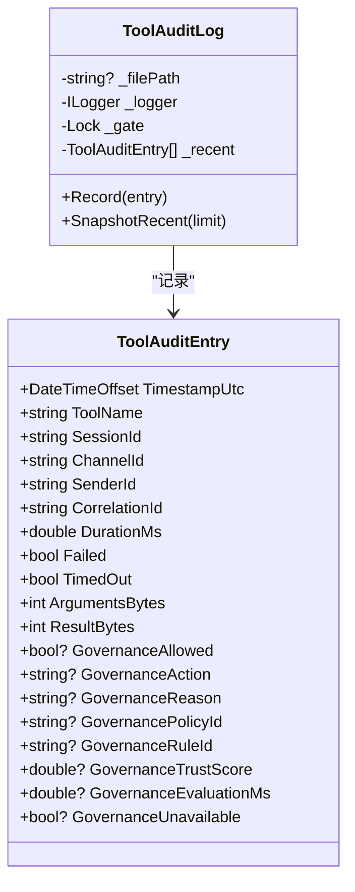
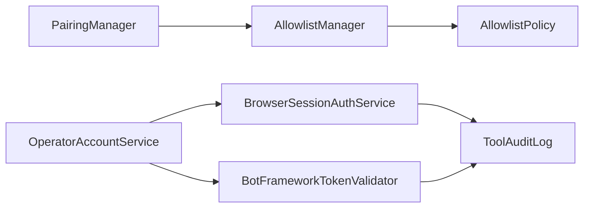

# 访问控制与权限管理

<cite>
**本文引用的文件**
- [AllowlistManager.cs](file://src/OpenClaw.Core\Security\AllowlistManager.cs)
- [AllowlistPolicy.cs](file://src/OpenClaw.Core\Security\AllowlistPolicy.cs)
- [GlobMatcher.cs](file://src/OpenClaw.Core\Security\GlobMatcher.cs)
- [PairingManager.cs](file://src/OpenClaw.Core\Security\PairingManager.cs)
- [OperatorAccountService.cs](file://src/OpenClaw.Gateway\OperatorAccountService.cs)
- [BrowserSessionAuthService.cs](file://src/OpenClaw.Gateway\BrowserSessionAuthService.cs)
- [BotFrameworkTokenValidator.cs](file://src/OpenClaw.Gateway\BotFrameworkTokenValidator.cs)
- [ToolAuditLog.cs](file://src/OpenClaw.Core\Observability\ToolAuditLog.cs)
</cite>

## 目录
1. [简介](#简介)
2. [项目结构](#项目结构)
3. [核心组件](#核心组件)
4. [架构总览](#架构总览)
5. [详细组件分析](#详细组件分析)
6. [依赖关系分析](#依赖关系分析)
7. [性能考量](#性能考量)
8. [故障排查指南](#故障排查指南)
9. [结论](#结论)
10. [附录](#附录)

## 简介
本文件面向访问控制与权限管理系统，围绕基于角色的访问控制（RBAC）、资源权限分配与访问决策机制展开，结合仓库中现有的“通道白名单/配对”、“操作员账户与会话”、“令牌校验”以及“工具执行审计”等能力，给出可落地的权限配置示例、访问控制清单（ACL）设计思路、权限继承与审计实践，并提供最佳实践与常见问题的解决方案。

## 项目结构
本系统在网关层与核心层分别提供了权限与安全相关的能力：
- 核心层安全：通道白名单与配对、通配符匹配、工具路径策略（预留）
- 网关层安全：操作员账户与令牌、浏览器会话认证、Teams/JWT令牌校验
- 观测性：工具执行审计日志

图表来源
- [AllowlistManager.cs:19-126](file://src/OpenClaw.Core\Security\AllowlistManager.cs#L19-L126)
- [AllowlistPolicy.cs:9-43](file://src/OpenClaw.Core\Security\AllowlistPolicy.cs#L9-L43)
- [GlobMatcher.cs:3-89](file://src/OpenClaw.Core\Security\GlobMatcher.cs#L3-L89)
- [PairingManager.cs:14-211](file://src/OpenClaw.Core\Security\PairingManager.cs#L14-L211)
- [OperatorAccountService.cs:7-414](file://src/OpenClaw.Gateway\OperatorAccountService.cs#L7-L414)
- [BrowserSessionAuthService.cs:8-180](file://src/OpenClaw.Gateway\BrowserSessionAuthService.cs#L8-L180)
- [BotFrameworkTokenValidator.cs:15-410](file://src/OpenClaw.Gateway\BotFrameworkTokenValidator.cs#L15-L410)
- [ToolAuditLog.cs:39-125](file://src/OpenClaw.Core\Observability\ToolAuditLog.cs#L39-L125)

章节来源
- [AllowlistManager.cs:19-126](file://src/OpenClaw.Core\Security\AllowlistManager.cs#L19-L126)
- [OperatorAccountService.cs:7-414](file://src/OpenClaw.Gateway\OperatorAccountService.cs#L7-L414)

## 核心组件
- 通道白名单与配对（Allowlist & Pairing）
  - 动态白名单文件优先于静态配置；支持按通道粒度的“允许来自/去向”的主体集合。
  - 支持严格/传统两种白名单语义；支持通配符匹配。
  - DM配对流程：生成一次性验证码、固定时间比较、冷却与失败次数限制、持久化批准列表。
- 操作员账户与会话（RBAC + 会话）
  - 操作员账户模型包含角色、启用状态、密码哈希与盐值、令牌前缀与哈希、登录时间等。
  - 提供凭据换取令牌、令牌认证、令牌撤销等接口；支持浏览器会话票据与CSRF保护。
  - Teams/JWT令牌通过Bot Framework元数据与签名验证，支持渠道背书校验。
- 工具执行审计（Audit）
  - 审计条目记录工具名、会话/通道/发送者、治理评估结果、耗时、字节量等，采用JSON Lines追加写入。

章节来源
- [AllowlistManager.cs:19-126](file://src/OpenClaw.Core\Security\AllowlistManager.cs#L19-L126)
- [AllowlistPolicy.cs:9-43](file://src/OpenClaw.Core\Security\AllowlistPolicy.cs#L9-L43)
- [GlobMatcher.cs:3-89](file://src/OpenClaw.Core\Security\GlobMatcher.cs#L3-L89)
- [PairingManager.cs:14-211](file://src/OpenClaw.Core\Security\PairingManager.cs#L14-L211)
- [OperatorAccountService.cs:7-414](file://src/OpenClaw.Gateway\OperatorAccountService.cs#L7-L414)
- [BrowserSessionAuthService.cs:8-180](file://src/OpenClaw.Gateway\BrowserSessionAuthService.cs#L8-L180)
- [BotFrameworkTokenValidator.cs:15-410](file://src/OpenClaw.Gateway\BotFrameworkTokenValidator.cs#L15-L410)
- [ToolAuditLog.cs:39-125](file://src/OpenClaw.Core\Observability\ToolAuditLog.cs#L39-L125)

## 架构总览
下图展示了从请求进入网关到完成鉴权与授权的关键路径，以及与核心安全模块的交互。

图表来源
- [OperatorAccountService.cs:163-295](file://src/OpenClaw.Gateway\OperatorAccountService.cs#L163-L295)
- [BrowserSessionAuthService.cs:68-107](file://src/OpenClaw.Gateway\BrowserSessionAuthService.cs#L68-L107)
- [BotFrameworkTokenValidator.cs:40-134](file://src/OpenClaw.Gateway\BotFrameworkTokenValidator.cs#L40-L134)
- [AllowlistManager.cs:32-51](file://src/OpenClaw.Core\Security\AllowlistManager.cs#L32-L51)
- [AllowlistPolicy.cs:18-40](file://src/OpenClaw.Core\Security\AllowlistPolicy.cs#L18-L40)

## 详细组件分析

### 组件A：通道白名单与配对（RBAC前置控制）
- 动态白名单
  - 按通道存储独立的白名单文件，动态更新覆盖静态配置。
  - 原子写入（临时文件+原子移动），并发安全。
- 白名单语义与匹配
  - 语义：传统模式下空白名单表示“允许全部”，严格模式下空白名单表示“拒绝全部”。
  - 匹配：支持通配符“*”，使用Span-based算法避免Split开销。
- 配对与批准
  - 生成带过期时间的一次性验证码，固定时间比较防止时序攻击。
  - 失败次数与冷却时间限制，批准后持久化，支持撤销。

图表来源
- [AllowlistManager.cs:32-51](file://src/OpenClaw.Core\Security\AllowlistManager.cs#L32-L51)
- [AllowlistPolicy.cs:18-40](file://src/OpenClaw.Core\Security\AllowlistPolicy.cs#L18-L40)
- [GlobMatcher.cs:9-63](file://src/OpenClaw.Core\Security\GlobMatcher.cs#L9-L63)

章节来源
- [AllowlistManager.cs:19-126](file://src/OpenClaw.Core\Security\AllowlistManager.cs#L19-L126)
- [AllowlistPolicy.cs:9-43](file://src/OpenClaw.Core\Security\AllowlistPolicy.cs#L9-L43)
- [GlobMatcher.cs:3-89](file://src/OpenClaw.Core\Security\GlobMatcher.cs#L3-L89)
- [PairingManager.cs:14-211](file://src/OpenClaw.Core\Security\PairingManager.cs#L14-L211)

### 组件B：操作员账户与会话（RBAC主体）
- 账户模型
  - 字段包含标识、用户名、显示名、角色、启用状态、密码盐与哈希、令牌列表、时间戳等。
- 认证与授权
  - 凭据认证：规范化用户名/密码，PBKDF2哈希比对，成功后创建令牌并持久化。
  - 令牌认证：按前缀快速定位，固定时间比较，支持过期与撤销。
  - 浏览器会话：生成会话ID与CSRF令牌，支持持久化与续期，Cookie安全属性设置。
- 角色与权限
  - 角色归一化与标准化，作为后续授权决策的基础。

图表来源
- [OperatorAccountService.cs:7-414](file://src/OpenClaw.Gateway\OperatorAccountService.cs#L7-L414)

章节来源
- [OperatorAccountService.cs:7-414](file://src/OpenClaw.Gateway\OperatorAccountService.cs#L7-L414)
- [BrowserSessionAuthService.cs:8-180](file://src/OpenClaw.Gateway\BrowserSessionAuthService.cs#L8-L180)

### 组件C：Teams/JWT令牌校验（外部身份源）
- 校验步骤
  - 解析JWT头部与载荷，校验算法、发行者、受众、有效期、服务URL一致性。
  - 拉取Bot Framework JWKS，解析公钥，RSA-SHA256验签。
  - 校验渠道背书（Endorsements）。
- 缓存与并发
  - 元数据缓存与门控，避免重复拉取与并发竞争。

图表来源
- [BotFrameworkTokenValidator.cs:147-180](file://src/OpenClaw.Gateway\BotFrameworkTokenValidator.cs#L147-L180)
- [BotFrameworkTokenValidator.cs:214-273](file://src/OpenClaw.Gateway\BotFrameworkTokenValidator.cs#L214-L273)
- [BotFrameworkTokenValidator.cs:40-134](file://src/OpenClaw.Gateway\BotFrameworkTokenValidator.cs#L40-L134)

章节来源
- [BotFrameworkTokenValidator.cs:15-410](file://src/OpenClaw.Gateway\BotFrameworkTokenValidator.cs#L15-L410)

### 组件D：工具执行审计（权限审计）
- 审计内容
  - 时间戳、工具名、会话/通道/发送者、关联ID、耗时、是否失败/超时、治理评估字段等。
- 写入策略
  - 追加写入JSON Lines，目录不存在自动创建；线程安全缓冲与落盘。
  - 默认不记录原始参数与结果，仅记录字节数，避免敏感信息泄露。

图表来源
- [ToolAuditLog.cs:39-125](file://src/OpenClaw.Core\Observability\ToolAuditLog.cs#L39-L125)

章节来源
- [ToolAuditLog.cs:39-125](file://src/OpenClaw.Core\Observability\ToolAuditLog.cs#L39-L125)

## 依赖关系分析
- 权限前置控制链路
  - 通道白名单（AllowlistManager）与语义（AllowlistPolicy）共同决定访问决策。
  - 配对（PairingManager）为未注册主体提供受控接入路径，批准后纳入白名单生效范围。
- 身份与会话链路
  - OperatorAccountService负责账户与令牌生命周期；BrowserSessionAuthService负责浏览器会话与CSRF。
  - BotFrameworkTokenValidator为外部身份源提供统一校验。
- 审计链路
  - 所有工具执行均通过审计日志记录，便于回溯与合规。

图表来源
- [PairingManager.cs:14-211](file://src/OpenClaw.Core\Security\PairingManager.cs#L14-L211)
- [AllowlistManager.cs:19-126](file://src/OpenClaw.Core\Security\AllowlistManager.cs#L19-L126)
- [AllowlistPolicy.cs:9-43](file://src/OpenClaw.Core\Security\AllowlistPolicy.cs#L9-L43)
- [OperatorAccountService.cs:7-414](file://src/OpenClaw.Gateway\OperatorAccountService.cs#L7-L414)
- [BrowserSessionAuthService.cs:8-180](file://src/OpenClaw.Gateway\BrowserSessionAuthService.cs#L8-L180)
- [BotFrameworkTokenValidator.cs:15-410](file://src/OpenClaw.Gateway\BotFrameworkTokenValidator.cs#L15-L410)
- [ToolAuditLog.cs:39-125](file://src/OpenClaw.Core\Observability\ToolAuditLog.cs#L39-L125)

章节来源
- [AllowlistManager.cs:19-126](file://src/OpenClaw.Core\Security\AllowlistManager.cs#L19-L126)
- [OperatorAccountService.cs:7-414](file://src/OpenClaw.Gateway\OperatorAccountService.cs#L7-L414)

## 性能考量
- 白名单匹配
  - 通配符匹配采用Span-based算法，避免字符串分割带来的内存分配；建议合理控制白名单规模与通配符使用。
- 并发与持久化
  - 白名单与批准列表的写入采用原子文件与锁保护，避免竞态；建议批量更新或合并策略减少IO。
- 令牌与会话
  - PBKDF2迭代次数较高，确保安全性的同时增加CPU成本；令牌前缀用于快速定位，降低全表扫描。
- 审计日志
  - JSON Lines追加写入，建议配置合适的轮转与清理策略，避免磁盘膨胀。

## 故障排查指南
- 白名单不生效
  - 检查动态白名单文件是否存在且可读；确认动态文件优先级高于静态配置。
  - 校验白名单语义（严格/传统）与通配符使用是否符合预期。
- 验证码无法使用
  - 核对验证码是否过期、失败次数是否超过阈值、冷却时间是否生效。
  - 固定时间比较防止时序攻击，确保前后端一致处理空白字符。
- 令牌认证失败
  - 校验令牌前缀、过期时间与撤销状态；确认PBKDF2盐值与哈希一致。
- 会话认证失败
  - 校验CSRF头与会话Cookie；检查会话是否过期与是否被撤销。
- Teams/JWT校验失败
  - 检查发行者、受众、有效期、服务URL一致性；确认JWKS拉取与公钥解析成功；核对渠道背书。

章节来源
- [AllowlistManager.cs:32-84](file://src/OpenClaw.Core\Security\AllowlistManager.cs#L32-L84)
- [AllowlistPolicy.cs:18-40](file://src/OpenClaw.Core\Security\AllowlistPolicy.cs#L18-L40)
- [PairingManager.cs:70-124](file://src/OpenClaw.Core\Security\PairingManager.cs#L70-L124)
- [OperatorAccountService.cs:259-295](file://src/OpenClaw.Gateway\OperatorAccountService.cs#L259-L295)
- [BrowserSessionAuthService.cs:68-107](file://src/OpenClaw.Gateway\BrowserSessionAuthService.cs#L68-L107)
- [BotFrameworkTokenValidator.cs:40-134](file://src/OpenClaw.Gateway\BotFrameworkTokenValidator.cs#L40-L134)

## 结论
本系统以“通道白名单/配对”作为访问前置控制，“操作员账户/会话/令牌”实现身份与权限主体管理，“Teams/JWT”提供外部身份集成，配合“工具执行审计”形成闭环。通过严格的白名单语义、固定时间比较、会话CSRF保护与审计追踪，可在保证安全的前提下提供灵活的权限管理能力。

## 附录

### RBAC与资源权限分配示例
- 角色定义
  - Viewer、Editor、Admin等角色，由OperatorAccountService维护与标准化。
- 资源与动作
  - 通道维度：允许来自/去向主体集合；工具维度：工具名或工具组。
  - 可扩展：在治理服务中引入“工具动作”与“资源域”映射，结合白名单与角色进行授权。
- 访问决策
  - 先判定通道白名单（动态优先），再结合角色与工具策略，最终输出允许/拒绝。

章节来源
- [OperatorAccountService.cs:14-46](file://src/OpenClaw.Gateway\OperatorAccountService.cs#L14-L46)
- [AllowlistManager.cs:50-51](file://src/OpenClaw.Core\Security\AllowlistManager.cs#L50-L51)

### 访问控制清单（ACL）设计要点
- 清单字段
  - 主体：账户ID、角色、渠道ID、发送者ID。
  - 资源：通道ID、工具名/组、文件路径（如启用工具路径策略）。
  - 行为：允许/拒绝、语义（严格/传统）、通配符模式。
  - 时间：生效/过期时间、最后修改时间。
- 策略应用顺序
  - 通道白名单 → 工具策略 → 角色继承 → 最终决策。

章节来源
- [AllowlistPolicy.cs:18-40](file://src/OpenClaw.Core\Security\AllowlistPolicy.cs#L18-L40)
- [GlobMatcher.cs:68-86](file://src/OpenClaw.Core\Security\GlobMatcher.cs#L68-L86)

### 权限继承与最小权限原则
- 继承规则
  - 角色标准化后用于策略匹配；工具策略可叠加在角色之上。
- 最小权限
  - 优先使用精确匹配而非通配符；定期审查白名单与令牌使用情况。

### 权限审计与合规
- 审计内容
  - 工具调用、会话/通道/发送者、治理评估、耗时与字节数。
- 存储与保留
  - JSON Lines文件，建议配置轮转与保留策略；敏感字段默认不记录原始内容。

章节来源
- [ToolAuditLog.cs:72-108](file://src/OpenClaw.Core\Observability\ToolAuditLog.cs#L72-L108)