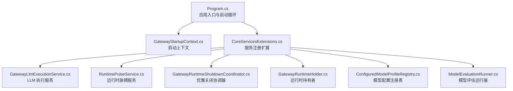
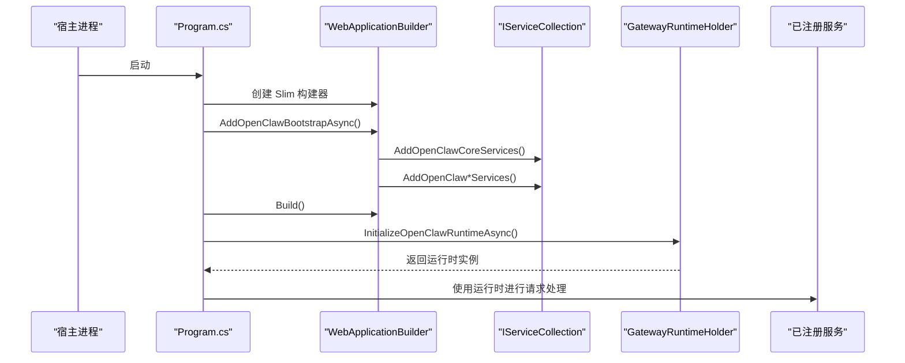
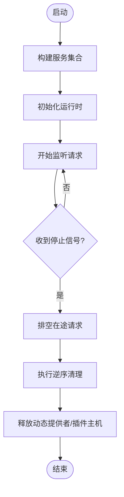
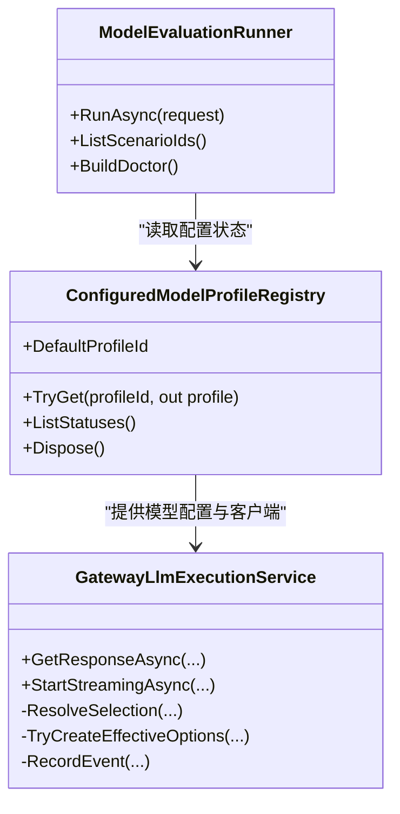
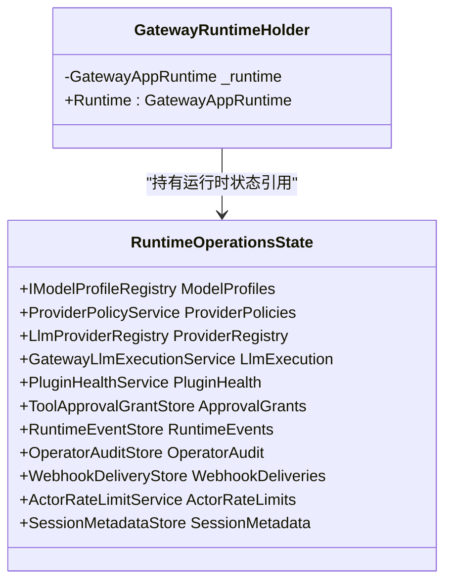
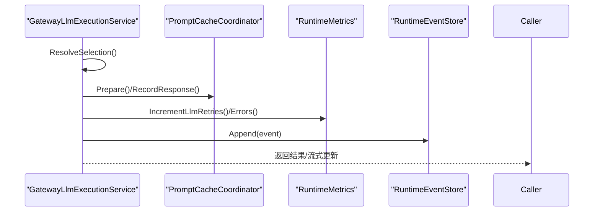
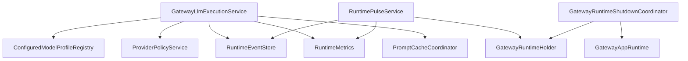

# 运行时管理和生命周期

<cite>
**本文档引用的文件**
- [Program.cs](file://src/OpenClaw.Gateway/Program.cs)
- [GatewayStartupContext.cs](file://src/OpenClaw.Gateway/Bootstrap/GatewayStartupContext.cs)
- [CoreServicesExtensions.cs](file://src/OpenClaw.Gateway/Composition/CoreServicesExtensions.cs)
- [GatewayLlmExecutionService.cs](file://src/OpenClaw.Gateway/GatewayLlmExecutionService.cs)
- [RuntimePulseService.cs](file://src/OpenClaw.Gateway/RuntimePulseService.cs)
- [RuntimeOperationsState.cs](file://src/OpenClaw.Gateway/RuntimeOperationsState.cs)
- [GatewayRuntimeShutdownCoordinator.cs](file://src/OpenClaw.Gateway/Pipeline/GatewayRuntimeShutdownCoordinator.cs)
- [GatewayRuntimeHolder.cs](file://src/OpenClaw.Gateway/Mcp/GatewayRuntimeHolder.cs)
- [ConfiguredModelProfileRegistry.cs](file://src/OpenClaw.Gateway/Models/ConfiguredModelProfileRegistry.cs)
- [ModelEvaluationRunner.cs](file://src/OpenClaw.Gateway/Models/ModelEvaluationRunner.cs)
- [GatewayRuntimeLifecycleTests.cs](file://src/OpenClaw.Tests/GatewayRuntimeLifecycleTests.cs)
</cite>

## 目录
1. [简介](#简介)
2. [项目结构](#项目结构)
3. [核心组件](#核心组件)
4. [架构总览](#架构总览)
5. [详细组件分析](#详细组件分析)
6. [依赖关系分析](#依赖关系分析)
7. [性能考虑](#性能考虑)
8. [故障排除指南](#故障排除指南)
9. [结论](#结论)

## 简介
本文件面向网关运行时管理和生命周期模块，系统性阐述运行时初始化、服务注册与依赖注入、LLM 客户端工厂与模型选择策略、评估运行器、状态管理与资源分配、性能监控、配置选项、热重载与优雅关闭流程，并提供调试技巧与优化建议。目标是帮助开发者与运维人员全面理解运行时如何在启动、运行、维护与关停各阶段协同工作。

## 项目结构
运行时管理位于 OpenClaw.Gateway 子项目中，围绕 Program.cs 启动入口、Bootstrap 启动上下文、Composition 服务注册扩展、以及多个运行时服务（如 LLM 执行、脉搏监控、优雅关闭等）展开。核心职责包括：
- 初始化与装配：通过 AddOpenClaw* 扩展方法注册各类服务
- 生命周期管理：启动、运行、热重载、优雅关闭
- 运行时可观测性：事件记录、指标统计、健康脉搏
- 模型与执行：模型配置解析、客户端工厂、路由与降级、流式与非流式响应

图表来源
- [Program.cs:42-98](file://src/OpenClaw.Gateway/Program.cs#L42-L98)
- [CoreServicesExtensions.cs:38-249](file://src/OpenClaw.Gateway/Composition/CoreServicesExtensions.cs#L38-L249)

章节来源
- [Program.cs:14-124](file://src/OpenClaw.Gateway/Program.cs#L14-L124)
- [CoreServicesExtensions.cs:38-249](file://src/OpenClaw.Gateway/Composition/CoreServicesExtensions.cs#L38-L249)

## 核心组件
- 启动入口与控制流：Program.cs 负责配置构建、服务注册、运行时初始化、监听启动与异常恢复。
- 启动上下文：GatewayStartupContext 封装配置、运行时状态、绑定地址等启动期信息。
- 服务注册扩展：CoreServicesExtensions 将内存、会话、工具、后端、安全、MCP、支付、自动化、学习、提示缓存等服务统一注册到容器。
- LLM 执行服务：GatewayLlmExecutionService 提供模型选择、路由、重试、熔断、事件记录与指标统计。
- 运行时脉搏服务：RuntimePulseService 周期性触发运行时自检与告警，支持隔离会话与轻量上下文。
- 优雅关闭协调器：GatewayRuntimeShutdownCoordinator 在停止信号下进行请求排空、异步清理、资源释放。
- 运行时持有者：GatewayRuntimeHolder 作为 DI 与运行时实例之间的桥接。
- 模型配置注册表：ConfiguredModelProfileRegistry 解析与校验模型配置，负责客户端创建与默认配置推导。
- 模型评估运行器：ModelEvaluationRunner 驱动多场景评估并生成报告。

章节来源
- [Program.cs:42-98](file://src/OpenClaw.Gateway/Program.cs#L42-L98)
- [GatewayStartupContext.cs:6-15](file://src/OpenClaw.Gateway/Bootstrap/GatewayStartupContext.cs#L6-L15)
- [CoreServicesExtensions.cs:38-249](file://src/OpenClaw.Gateway/Composition/CoreServicesExtensions.cs#L38-L249)
- [GatewayLlmExecutionService.cs:18-96](file://src/OpenClaw.Gateway/GatewayLlmExecutionService.cs#L18-L96)
- [RuntimePulseService.cs:16-59](file://src/OpenClaw.Gateway/RuntimePulseService.cs#L16-L59)
- [GatewayRuntimeShutdownCoordinator.cs:8-57](file://src/OpenClaw.Gateway/Pipeline/GatewayRuntimeShutdownCoordinator.cs#L8-L57)
- [GatewayRuntimeHolder.cs:10-21](file://src/OpenClaw.Gateway/Mcp/GatewayRuntimeHolder.cs#L10-L21)
- [ConfiguredModelProfileRegistry.cs:13-45](file://src/OpenClaw.Gateway/Models/ConfiguredModelProfileRegistry.cs#L13-L45)
- [ModelEvaluationRunner.cs:10-35](file://src/OpenClaw.Gateway/Models/ModelEvaluationRunner.cs#L10-L35)

## 架构总览
运行时管理采用“启动入口 + 启动上下文 + 服务注册扩展”的分层设计，所有服务通过依赖注入集中管理；运行时实例在容器构建后由 Program.cs 注入到 GatewayRuntimeHolder，随后被其他组件（如 MCP、管道、脉搏服务）使用。

图表来源
- [Program.cs:50-98](file://src/OpenClaw.Gateway/Program.cs#L50-L98)
- [CoreServicesExtensions.cs:38-249](file://src/OpenClaw.Gateway/Composition/CoreServicesExtensions.cs#L38-L249)
- [GatewayRuntimeHolder.cs:10-21](file://src/OpenClaw.Gateway/Mcp/GatewayRuntimeHolder.cs#L10-L21)

## 详细组件分析

### 启动与生命周期管理
- 启动循环与恢复：Program.cs 包含启动失败的交互式恢复逻辑，支持快速启动与诊断输出。
- 服务注册：AddOpenClawCoreServices 统一注册内存、会话、工具、后端、安全、MCP、支付、自动化、学习、提示缓存等服务。
- 运行时持有：GatewayRuntimeHolder 在运行时初始化后设置，供后续组件访问。
- 优雅关闭：GatewayRuntimeShutdownCoordinator 在收到停止信号后，先排空在途请求，再按逆序执行异步清理，最后释放动态提供者与插件主机。

图表来源
- [Program.cs:42-98](file://src/OpenClaw.Gateway/Program.cs#L42-L98)
- [GatewayRuntimeShutdownCoordinator.cs:50-82](file://src/OpenClaw.Gateway/Pipeline/GatewayRuntimeShutdownCoordinator.cs#L50-L82)

章节来源
- [Program.cs:42-124](file://src/OpenClaw.Gateway/Program.cs#L42-L124)
- [GatewayRuntimeShutdownCoordinator.cs:50-197](file://src/OpenClaw.Gateway/Pipeline/GatewayRuntimeShutdownCoordinator.cs#L50-L197)

### LLM 客户端工厂与模型选择策略
- 客户端工厂：ConfiguredModelProfileRegistry 在构建注册表时尝试解析已注册客户端或通过 LlmClientFactory.CreateChatClient 创建新客户端。
- 模型选择策略：GatewayLlmExecutionService.ResolveSelection 结合显式配置、会话需求与估算输入令牌，调用 IModelSelectionPolicy 选择候选配置，支持回退模型与标签偏好。
- 执行与重试：GatewayLlmExecutionService.GetResponseAsync/StartStreamingAsync 对每个候选执行带熔断与指数退避的重试，记录事件与指标。
- 提示缓存：集成 PromptCacheCoordinator 与 WarmRegistry，跟踪命中与写入令牌，支持预热与追踪。

图表来源
- [ConfiguredModelProfileRegistry.cs:13-158](file://src/OpenClaw.Gateway/Models/ConfiguredModelProfileRegistry.cs#L13-L158)
- [GatewayLlmExecutionService.cs:18-96](file://src/OpenClaw.Gateway/GatewayLlmExecutionService.cs#L18-L96)
- [ModelEvaluationRunner.cs:10-35](file://src/OpenClaw.Gateway/Models/ModelEvaluationRunner.cs#L10-L35)

章节来源
- [ConfiguredModelProfileRegistry.cs:91-158](file://src/OpenClaw.Gateway/Models/ConfiguredModelProfileRegistry.cs#L91-L158)
- [GatewayLlmExecutionService.cs:218-432](file://src/OpenClaw.Gateway/GatewayLlmExecutionService.cs#L218-L432)
- [ModelEvaluationRunner.cs:17-35](file://src/OpenClaw.Gateway/Models/ModelEvaluationRunner.cs#L17-L35)

### 运行时状态管理与资源分配
- 运行时持有者：GatewayRuntimeHolder 以线程安全方式保存运行时实例，避免未初始化访问。
- 运行时操作状态：RuntimeOperationsState 聚合模型配置、策略、执行服务、审计与事件存储等，便于在不同组件间共享。
- 会话锁与并发：优雅关闭协调器通过检查 SessionLocks 判断是否允许关闭，确保在途会话完成。
- 资源释放：动态提供者所有权与注册表清理，确保插件与本地提供者正确释放。

图表来源
- [GatewayRuntimeHolder.cs:10-21](file://src/OpenClaw.Gateway/Mcp/GatewayRuntimeHolder.cs#L10-L21)
- [RuntimeOperationsState.cs:3-16](file://src/OpenClaw.Gateway/RuntimeOperationsState.cs#L3-L16)

章节来源
- [GatewayRuntimeHolder.cs:10-21](file://src/OpenClaw.Gateway/Mcp/GatewayRuntimeHolder.cs#L10-L21)
- [RuntimeOperationsState.cs:3-32](file://src/OpenClaw.Gateway/RuntimeOperationsState.cs#L3-L32)
- [GatewayRuntimeShutdownCoordinator.cs:84-174](file://src/OpenClaw.Gateway/Pipeline/GatewayRuntimeShutdownCoordinator.cs#L84-L174)

### 性能监控与可观测性
- 指标与事件：GatewayLlmExecutionService 记录请求、重试、错误、熔断状态与提示缓存使用情况；RuntimePulseService 记录脉搏运行次数、告警与错误。
- 脉搏服务：周期性读取 HEARTBEAT.md 并通过会话运行自检，支持隔离会话与轻量上下文，避免影响生产流量。
- 事件存储：运行时事件写入 RuntimeEventStore，用于审计与问题定位。

图表来源
- [GatewayLlmExecutionService.cs:218-432](file://src/OpenClaw.Gateway/GatewayLlmExecutionService.cs#L218-L432)
- [RuntimePulseService.cs:136-299](file://src/OpenClaw.Gateway/RuntimePulseService.cs#L136-L299)

章节来源
- [GatewayLlmExecutionService.cs:181-204](file://src/OpenClaw.Gateway/GatewayLlmExecutionService.cs#L181-L204)
- [RuntimePulseService.cs:136-299](file://src/OpenClaw.Gateway/RuntimePulseService.cs#L136-L299)

### 配置选项与热重载机制
- 配置来源：GatewayStartupContext 持有 GatewayConfig 与运行时状态，CoreServicesExtensions 依据配置注册内存、会话、工具、后端、安全、MCP、支付、自动化、学习、提示缓存等服务。
- 热重载：测试覆盖了技能监视器在关闭时等待在途重载完成，体现热重载期间的资源保护与有序释放。

章节来源
- [GatewayStartupContext.cs:6-15](file://src/OpenClaw.Gateway/Bootstrap/GatewayStartupContext.cs#L6-L15)
- [CoreServicesExtensions.cs:38-249](file://src/OpenClaw.Gateway/Composition/CoreServicesExtensions.cs#L38-L249)
- [GatewayRuntimeLifecycleTests.cs:104-115](file://src/OpenClaw.Tests/GatewayRuntimeLifecycleTests.cs#L104-L115)

### 优雅关闭流程
- 排空在途请求：根据 GracefulShutdownSeconds 设置截止时间，定期检查 SessionLocks 是否全部可用。
- 异步清理：按逆序执行注册的清理回调，捕获取消与异常，保证关闭流程稳定。
- 资源释放：释放技能监视器、插件主机、本地动态插件主机、动态提供者注册表，确保无泄漏。

章节来源
- [GatewayRuntimeShutdownCoordinator.cs:50-197](file://src/OpenClaw.Gateway/Pipeline/GatewayRuntimeShutdownCoordinator.cs#L50-L197)

## 依赖关系分析
- 组件耦合：GatewayLlmExecutionService 依赖模型配置注册表、策略服务、事件与指标、提示缓存协调器；RuntimePulseService 依赖运行时持有者、事件与指标、上下文预算规划器；优雅关闭协调器依赖运行时实例与会话锁。
- 外部依赖：通过 LlmClientFactory 创建 IChatClient，通过 ProviderPolicyService 应用旧版策略，通过 RuntimeMetrics 与 RuntimeEventStore 提供可观测性。

图表来源
- [GatewayLlmExecutionService.cs:18-96](file://src/OpenClaw.Gateway/GatewayLlmExecutionService.cs#L18-L96)
- [RuntimePulseService.cs:16-59](file://src/OpenClaw.Gateway/RuntimePulseService.cs#L16-L59)
- [GatewayRuntimeShutdownCoordinator.cs:8-57](file://src/OpenClaw.Gateway/Pipeline/GatewayRuntimeShutdownCoordinator.cs#L8-L57)

章节来源
- [GatewayLlmExecutionService.cs:18-96](file://src/OpenClaw.Gateway/GatewayLlmExecutionService.cs#L18-L96)
- [RuntimePulseService.cs:16-59](file://src/OpenClaw.Gateway/RuntimePulseService.cs#L16-L59)
- [GatewayRuntimeShutdownCoordinator.cs:8-57](file://src/OpenClaw.Gateway/Pipeline/GatewayRuntimeShutdownCoordinator.cs#L8-L57)

## 性能考虑
- 模型选择与回退：优先使用显式配置与会话需求，结合能力上限与策略限制，减少无效尝试。
- 指数退避与熔断：对瞬时失败采用指数退避与熔断，降低抖动与级联故障风险。
- 提示缓存：启用提示缓存可显著降低重复输入令牌消耗，需结合 KeepWarm 与追踪配置优化。
- 脉搏运行：支持隔离会话与轻量上下文，避免对生产流量造成影响。
- 资源释放：在优雅关闭前确保动态提供者与插件主机释放，防止长时间阻塞。

## 故障排除指南
- 启动失败恢复：Program.cs 的交互式恢复流程可自动尝试快速启动或引导修复，必要时输出诊断信息。
- LLM 执行错误：GatewayLlmExecutionService 将底层异常分类并包装为用户友好消息，同时记录事件与指标，便于定位。
- 内容过滤与策略：对 Azure 内容过滤等特定错误进行格式化与日志输出，辅助运营人员排查。
- 优雅关闭卡顿：检查 SessionLocks 是否仍有占用，确认清理回调是否抛出异常或被取消。
- 测试验证：GatewayRuntimeLifecycleTests 覆盖优雅关闭顺序与技能监视器释放行为，可作为回归参考。

章节来源
- [Program.cs:99-122](file://src/OpenClaw.Gateway/Program.cs#L99-L122)
- [GatewayLlmExecutionService.cs:729-751](file://src/OpenClaw.Gateway/GatewayLlmExecutionService.cs#L729-L751)
- [GatewayRuntimeLifecycleTests.cs:31-115](file://src/OpenClaw.Tests/GatewayRuntimeLifecycleTests.cs#L31-L115)

## 结论
运行时管理模块通过清晰的启动流程、完善的依赖注入、稳健的 LLM 执行与模型选择、可观测性与健康脉搏、以及优雅关闭机制，实现了从启动到关停的全生命周期可控与可观察。结合配置驱动与热重载能力，可在不中断服务的前提下完成升级与调整。建议在生产环境中启用提示缓存、合理设置熔断阈值与超时、并定期运行模型评估以保障质量与成本平衡。