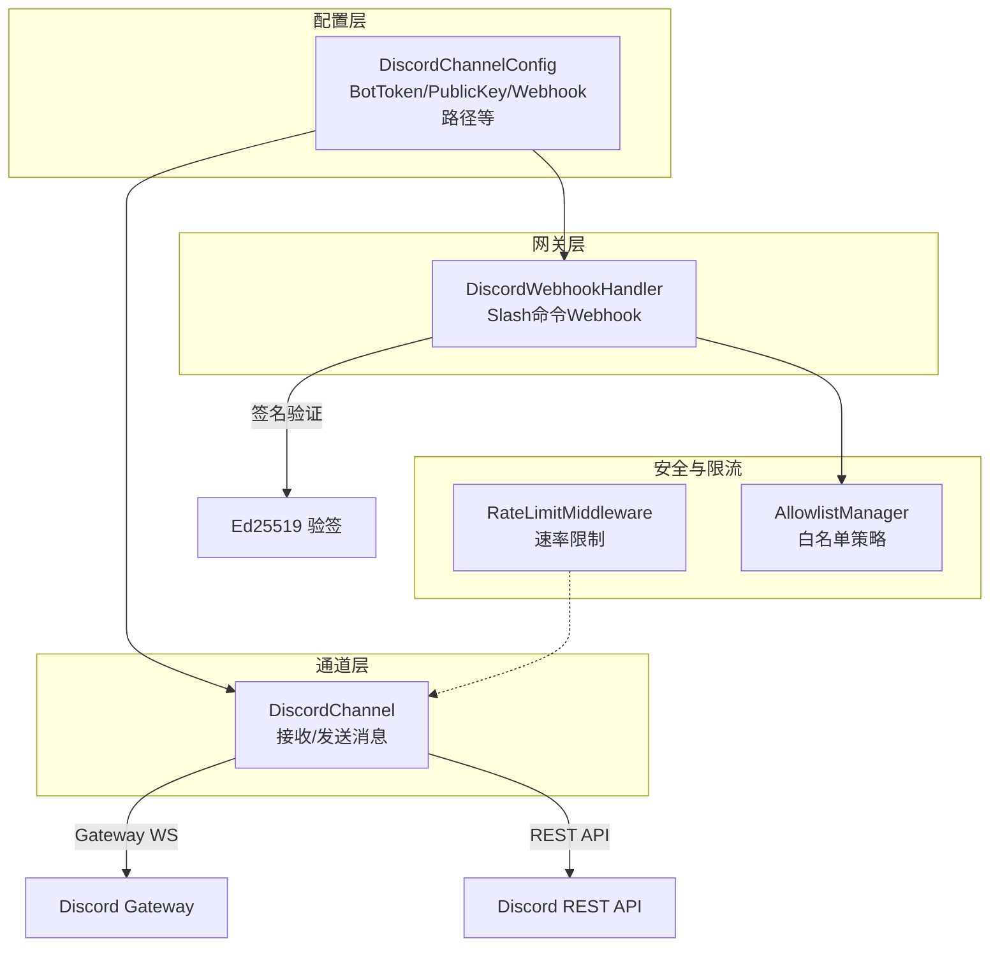
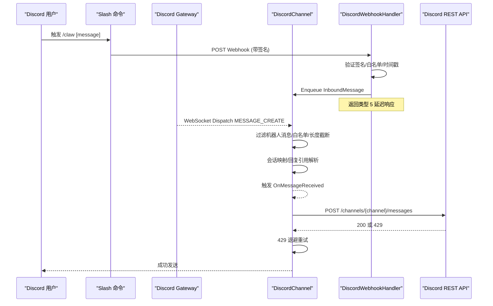
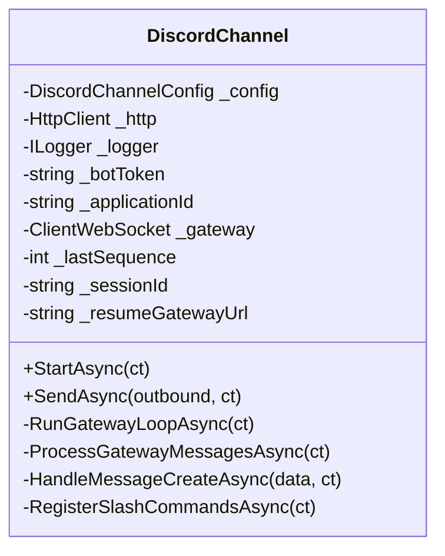
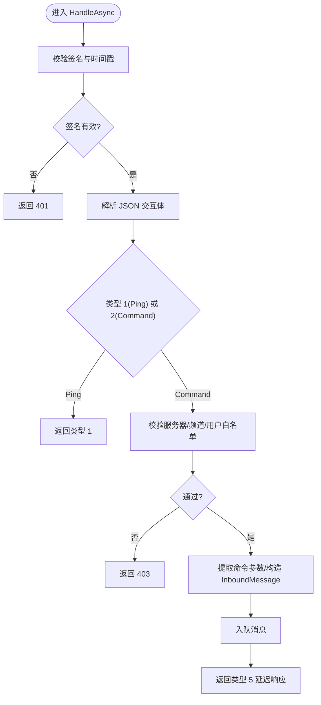
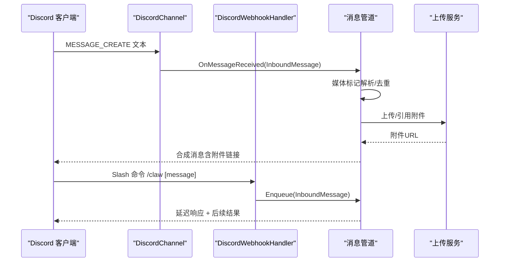
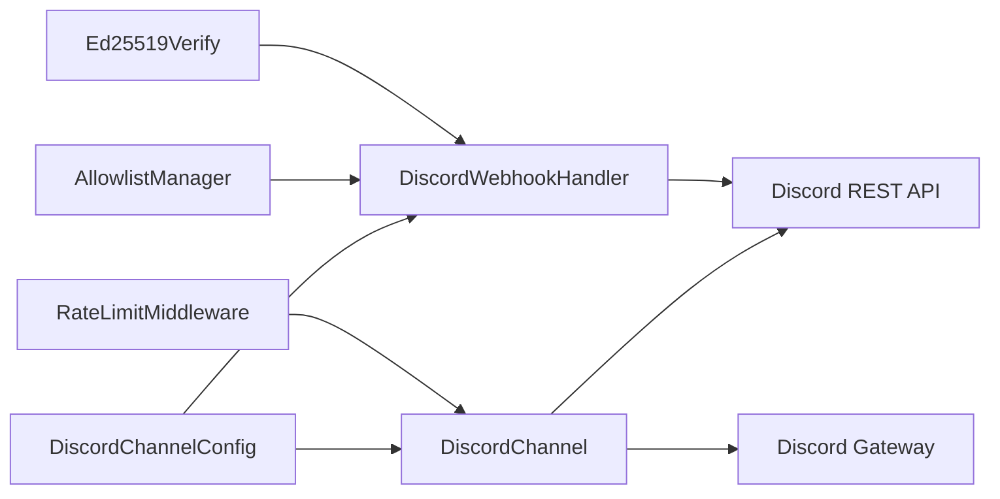

# Discord 集成

<cite>
**本文档引用的文件**
- [DiscordChannel.cs](file://src/OpenClaw.Channels/DiscordChannel.cs)
- [DiscordWebhookHandler.cs](file://src/OpenClaw.Gateway/DiscordWebhookHandler.cs)
- [GatewayConfig.cs](file://src/OpenClaw.Core/Middleware/GatewayConfig.cs)
- [RateLimitMiddleware.cs](file://src/OpenClaw.Core/Middleware/RateLimitMiddleware.cs)
- [MediaMarkers.cs](file://src/OpenClaw.Core/Models/MediaMarkers.cs)
- [MafAgentRuntime.cs](file://src/OpenClaw.Agent/MafAgentRuntime.cs)
- [ChannelReadinessEvaluator.cs](file://src/OpenClaw.Gateway/ChannelReadinessEvaluator.cs)
- [webchat.js](file://src/OpenClaw.Gateway/wwwroot/webchat.js)
- [webchat.html](file://src/OpenClaw.Gateway/wwwroot/webchat.html)
</cite>

## 目录
1. [简介](#简介)
2. [项目结构](#项目结构)
3. [核心组件](#核心组件)
4. [架构总览](#架构总览)
5. [详细组件分析](#详细组件分析)
6. [依赖关系分析](#依赖关系分析)
7. [性能考虑](#性能考虑)
8. [故障排除指南](#故障排除指南)
9. [结论](#结论)
10. [附录](#附录)

## 简介
本文件面向需要在 OpenClaw 中集成 Discord 的开发者与运维人员，系统性阐述 DiscordChannel 类的实现原理与工作机制，涵盖以下关键主题：
- Discord API 集成：使用 Gateway WebSocket 接收消息、REST API 发送消息
- Webhook 处理：Slash 命令交互的签名验证、内容解析与响应处理
- 消息处理流程：文本消息、嵌入消息、附件上传、表情符号的处理方式
- 配置与部署：Bot 用户设置、服务器权限、频道配置、Webhook 路径与签名验证
- 错误恢复与速率限制：重连机制、退避重试、速率限制中间件

## 项目结构
OpenClaw 将 Discord 集成拆分为两个主要模块：
- 通道适配器：负责通过 Discord Gateway 接收消息、通过 REST API 发送消息
- 网关 Webhook 处理器：负责处理 Slash 命令交互（Application Command）

**图表来源**
- [DiscordChannel.cs:21-64](file://src/OpenClaw.Channels/DiscordChannel.cs#L21-L64)
- [DiscordWebhookHandler.cs:16-45](file://src/OpenClaw.Gateway/DiscordWebhookHandler.cs#L16-L45)
- [GatewayConfig.cs:753-772](file://src/OpenClaw.Core/Models/GatewayConfig.cs#L753-L772)

**章节来源**
- [DiscordChannel.cs:16-64](file://src/OpenClaw.Channels/DiscordChannel.cs#L16-L64)
- [DiscordWebhookHandler.cs:12-45](file://src/OpenClaw.Gateway/DiscordWebhookHandler.cs#L12-L45)
- [GatewayConfig.cs:753-772](file://src/OpenClaw.Core/Models/GatewayConfig.cs#L753-L772)

## 核心组件
- DiscordChannel：实现 IChannelAdapter，负责：
  - 通过 Gateway WebSocket 订阅 MESSAGE_CREATE 事件并转换为 InboundMessage
  - 通过 REST API 发送文本消息，内置 2000 字符限制与 429 重试
  - 心跳维持、断线重连、会话恢复
- DiscordWebhookHandler：处理 Slash 命令交互，包含：
  - Ed25519 签名验证（可选）
  - 允许列表校验（服务器/频道/用户）
  - 提取命令参数并构造 InboundMessage
  - 返回延迟响应（"thinking..."）以满足 Discord 交互规范

**章节来源**
- [DiscordChannel.cs:21-120](file://src/OpenClaw.Channels/DiscordChannel.cs#L21-L120)
- [DiscordWebhookHandler.cs:16-158](file://src/OpenClaw.Gateway/DiscordWebhookHandler.cs#L16-L158)

## 架构总览
下图展示从 Discord 服务器到 OpenClaw 系统的消息通路与处理阶段。

**图表来源**
- [DiscordChannel.cs:122-238](file://src/OpenClaw.Channels/DiscordChannel.cs#L122-L238)
- [DiscordChannel.cs:295-373](file://src/OpenClaw.Channels/DiscordChannel.cs#L295-L373)
- [DiscordWebhookHandler.cs:52-158](file://src/OpenClaw.Gateway/DiscordWebhookHandler.cs#L52-L158)

## 详细组件分析

### DiscordChannel 组件分析
- 关键职责
  - 启动时可选择注册 Slash 命令
  - 建立并维护 Gateway 连接，处理 Hello/Identify/Resume/Heartbeat/Reconnect/Invalid Session 等事件
  - 解析 MESSAGE_CREATE 事件，过滤机器人消息，执行白名单与长度限制，构造 InboundMessage
  - 通过 REST API 发送消息，处理 429 速率限制并自动重试
- 数据结构与复杂度
  - 白名单检查为 O(k) 数组遍历（k 为允许列表长度）
  - 文本截断为 O(n) 子串操作（n ≤ 2000）
- 错误处理与恢复
  - 断线指数退避，最大至 60 秒
  - Invalid Session 时清空会话状态并重新 Identify
  - 429 时按 Retry-After 等待后重试
- 性能影响
  - 单连接多任务心跳与消息处理，内存缓冲区复用减少 GC 压力

**图表来源**
- [DiscordChannel.cs:21-64](file://src/OpenClaw.Channels/DiscordChannel.cs#L21-L64)
- [DiscordChannel.cs:122-238](file://src/OpenClaw.Channels/DiscordChannel.cs#L122-L238)
- [DiscordChannel.cs:295-373](file://src/OpenClaw.Channels/DiscordChannel.cs#L295-L373)

**章节来源**
- [DiscordChannel.cs:66-120](file://src/OpenClaw.Channels/DiscordChannel.cs#L66-L120)
- [DiscordChannel.cs:122-238](file://src/OpenClaw.Channels/DiscordChannel.cs#L122-L238)
- [DiscordChannel.cs:295-373](file://src/OpenClaw.Channels/DiscordChannel.cs#L295-L373)
- [DiscordChannel.cs:375-396](file://src/OpenClaw.Channels/DiscordChannel.cs#L375-L396)

### DiscordWebhookHandler 组件分析
- 关键职责
  - 验证 Discord Ed25519 签名（可配置开关），拒绝过期时间戳（5 分钟窗口）
  - 校验服务器/频道/用户白名单
  - 从交互数据提取命令参数，构造 InboundMessage
  - 返回类型 5 延迟响应，确保用户体验
- 安全要点
  - 若平台不支持 Ed25519，将拒绝所有请求并记录警告
  - 时间戳校验防止重放攻击
- 错误处理
  - 缺少签名或签名无效返回 401
  - 不在白名单返回 403
  - 无效交互体返回 400

**图表来源**
- [DiscordWebhookHandler.cs:52-158](file://src/OpenClaw.Gateway/DiscordWebhookHandler.cs#L52-L158)
- [DiscordWebhookHandler.cs:165-196](file://src/OpenClaw.Gateway/DiscordWebhookHandler.cs#L165-L196)

**章节来源**
- [DiscordWebhookHandler.cs:16-158](file://src/OpenClaw.Gateway/DiscordWebhookHandler.cs#L16-L158)
- [DiscordWebhookHandler.cs:165-196](file://src/OpenClaw.Gateway/DiscordWebhookHandler.cs#L165-L196)

### 消息处理流程（文本/嵌入/附件/表情）
- 文本消息
  - DiscordChannel：接收 MESSAGE_CREATE，过滤机器人，应用白名单与长度限制，触发 OnMessageReceived
  - DiscordWebhookHandler：解析交互体，提取选项参数，构造 InboundMessage 并延迟响应
- 嵌入消息与附件
  - 管道侧通过媒体标记协议识别并分离附件标记，随后进行上传或远程引用
  - DiscordChannel 仅发送纯文本内容；附件通过其他渠道（如网关上传服务）处理
- 表情符号
  - Discord API 支持原生表情符号，无需特殊处理

**图表来源**
- [DiscordChannel.cs:295-373](file://src/OpenClaw.Channels/DiscordChannel.cs#L295-L373)
- [DiscordWebhookHandler.cs:78-155](file://src/OpenClaw.Gateway/DiscordWebhookHandler.cs#L78-L155)
- [MediaMarkers.cs:50-92](file://src/OpenClaw.Core/Models/MediaMarkers.cs#L50-L92)

**章节来源**
- [DiscordChannel.cs:295-373](file://src/OpenClaw.Channels/DiscordChannel.cs#L295-L373)
- [DiscordWebhookHandler.cs:78-155](file://src/OpenClaw.Gateway/DiscordWebhookHandler.cs#L78-L155)
- [MediaMarkers.cs:50-92](file://src/OpenClaw.Core/Models/MediaMarkers.cs#L50-L92)

## 依赖关系分析
- 配置依赖
  - DiscordChannelConfig：BotToken、ApplicationId、PublicKey、WebhookPath、白名单、最大字符数、是否注册 Slash 命令、前缀等
- 安全与策略
  - AllowlistManager：按通道维度合并有效白名单
  - Ed25519Verify：签名验证（平台能力检测）
- 传输与序列化
  - System.Text.Json：源生成上下文用于 Discord 模型
  - ClientWebSocket：Gateway 连接
  - HttpClient：REST API 请求
- 速率限制
  - RateLimitMiddleware：全局每分钟消息数限制，避免触发 Discord 速率限制

**图表来源**
- [GatewayConfig.cs:753-772](file://src/OpenClaw.Core/Models/GatewayConfig.cs#L753-L772)
- [DiscordChannel.cs:21-64](file://src/OpenClaw.Channels/DiscordChannel.cs#L21-L64)
- [DiscordWebhookHandler.cs:16-45](file://src/OpenClaw.Gateway/DiscordWebhookHandler.cs#L16-L45)
- [RateLimitMiddleware.cs:39-68](file://src/OpenClaw.Core/Middleware/RateLimitMiddleware.cs#L39-L68)

**章节来源**
- [GatewayConfig.cs:753-772](file://src/OpenClaw.Core/Models/GatewayConfig.cs#L753-L772)
- [DiscordChannel.cs:21-64](file://src/OpenClaw.Channels/DiscordChannel.cs#L21-L64)
- [DiscordWebhookHandler.cs:16-45](file://src/OpenClaw.Gateway/DiscordWebhookHandler.cs#L16-L45)
- [RateLimitMiddleware.cs:39-68](file://src/OpenClaw.Core/Middleware/RateLimitMiddleware.cs#L39-L68)

## 性能考虑
- Gateway 连接管理
  - 指数退避重连，最大 60 秒，降低对 Discord 的压力
  - 心跳间隔随机抖动，避免集中重连风暴
- 发送速率控制
  - 内置 429 重试与等待，遵循 Retry-After
  - 全局 RateLimitMiddleware 防止同一用户过快刷屏
- 文本与媒体处理
  - DiscordChannel 仅发送文本，媒体通过标记协议与上传服务处理，避免单次消息过大
  - WebChat 前端对 WebSocket 消息大小进行预检，避免超过服务端限制

**章节来源**
- [DiscordChannel.cs:122-161](file://src/OpenClaw.Channels/DiscordChannel.cs#L122-L161)
- [DiscordChannel.cs:91-109](file://src/OpenClaw.Channels/DiscordChannel.cs#L91-L109)
- [RateLimitMiddleware.cs:39-68](file://src/OpenClaw.Core/Middleware/RateLimitMiddleware.cs#L39-L68)
- [webchat.js:1195-1231](file://src/OpenClaw.Gateway/wwwroot/webchat.js#L1195-L1231)

## 故障排除指南
- 常见配置问题
  - 缺少 Bot Token 或 ApplicationId：启动时会提示缺失项并给出修复指引
  - 缺少 PublicKey 且启用签名验证：Ed25519 不受支持时会拒绝所有请求
- 连接与重连
  - Gateway 断开：查看日志中的重连信息，确认网络与令牌有效性
  - Invalid Session：自动清理会话并重新 Identify
- 速率限制
  - 429：根据 Retry-After 自动等待后重试
  - 全局限流：RateLimitMiddleware 会短路过快消息
- Webhook 签名失败
  - 检查时间戳是否过期（5 分钟窗口）
  - 确认 PublicKeyHex 正确且为 32 字节
  - 平台不支持 Ed25519 时需禁用签名验证或添加支持

**章节来源**
- [ChannelReadinessEvaluator.cs:417-448](file://src/OpenClaw.Gateway/ChannelReadinessEvaluator.cs#L417-L448)
- [DiscordChannel.cs:122-161](file://src/OpenClaw.Channels/DiscordChannel.cs#L122-L161)
- [DiscordChannel.cs:91-109](file://src/OpenClaw.Channels/DiscordChannel.cs#L91-L109)
- [DiscordWebhookHandler.cs:165-196](file://src/OpenClaw.Gateway/DiscordWebhookHandler.cs#L165-L196)

## 结论
OpenClaw 的 Discord 集成通过“通道适配器 + 网关 Webhook 处理器”的分层设计，实现了：
- 可靠的消息接收（Gateway）与发送（REST）
- 安全的 Slash 命令交互（签名验证、白名单、时间戳校验）
- 可扩展的媒体处理（标记协议 + 上传服务）
- 健壮的错误恢复与速率限制策略

该方案既满足生产环境的安全与稳定性要求，又保持了良好的可维护性与可扩展性。

## 附录

### Discord Bot 创建与配置指南
- 注册应用与 Bot
  - 在 Discord 开发者门户创建应用，启用 Bot 权限
  - 获取 Bot Token 与 Application ID
- 服务器权限与频道配置
  - 为 Bot 添加到目标服务器，并授予必要权限
  - 在目标频道中确保 Bot 可读取消息与发送消息
- Webhook 设置
  - 在应用设置中配置交互 URL（默认路径由配置决定）
  - 如启用签名验证，配置 PublicKeyHex
- OAuth URL 生成（如需授权）
  - 使用 Bot 权限与授权范围生成 OAuth URL，引导用户授权 Bot 加入服务器

[本节为通用实践说明，不直接分析具体源码文件]

### 配置项参考
- BotToken 与 BotTokenRef：Bot 认证令牌
- ApplicationId 与 ApplicationIdRef：应用 ID
- PublicKey 与 PublicKeyRef：Ed25519 公钥（用于签名验证）
- WebhookPath：Slash 命令交互端点路径
- AllowedGuildIds/AllowedChannelIds/AllowedFromUserIds：白名单
- MaxInboundChars/MaxRequestBytes：输入长度与请求大小限制
- ValidateSignature：是否启用签名验证
- RegisterSlashCommands/SlashCommandPrefix：是否注册 Slash 命令及命令前缀

**章节来源**
- [GatewayConfig.cs:753-772](file://src/OpenClaw.Core/Models/GatewayConfig.cs#L753-L772)