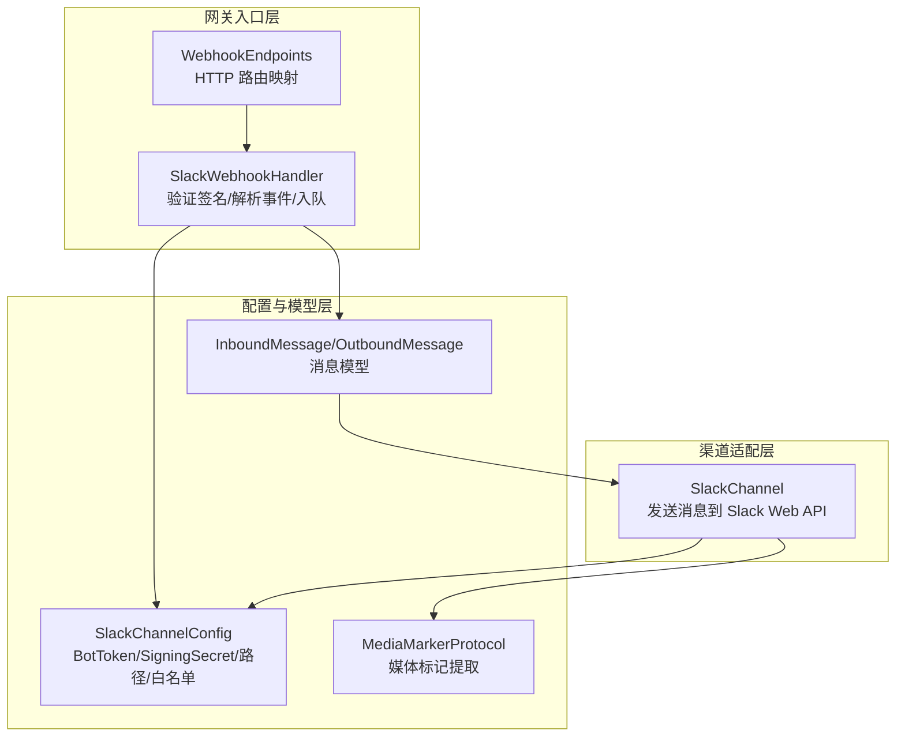
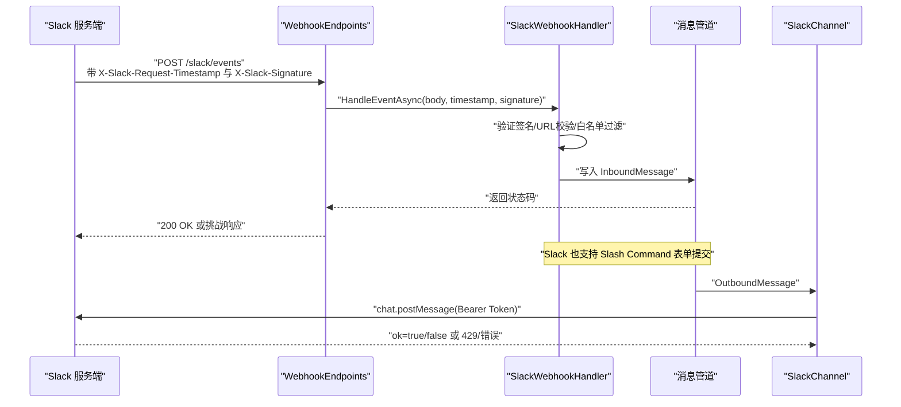
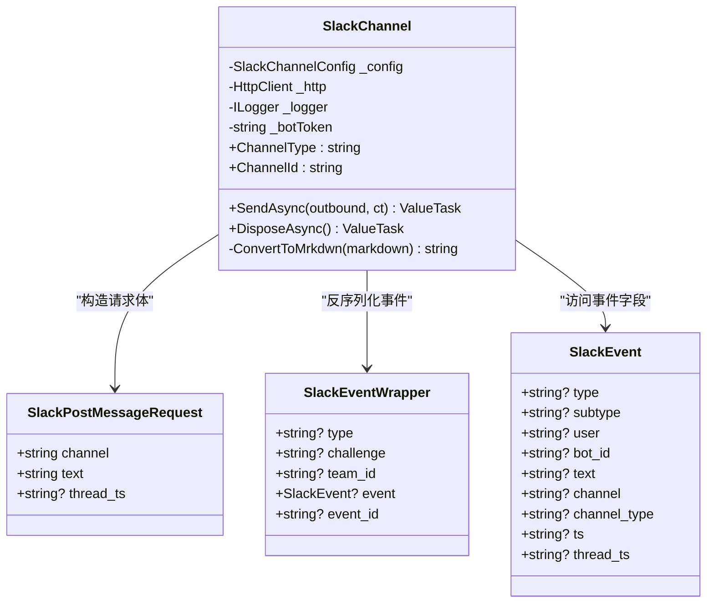
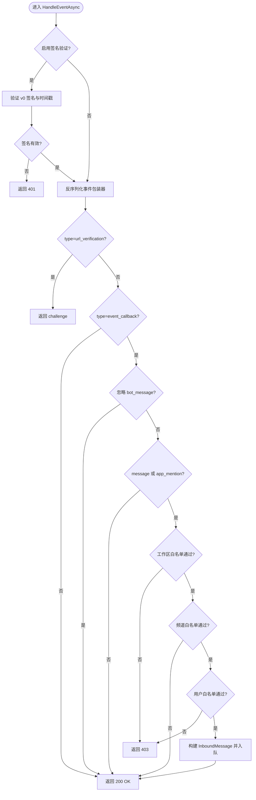
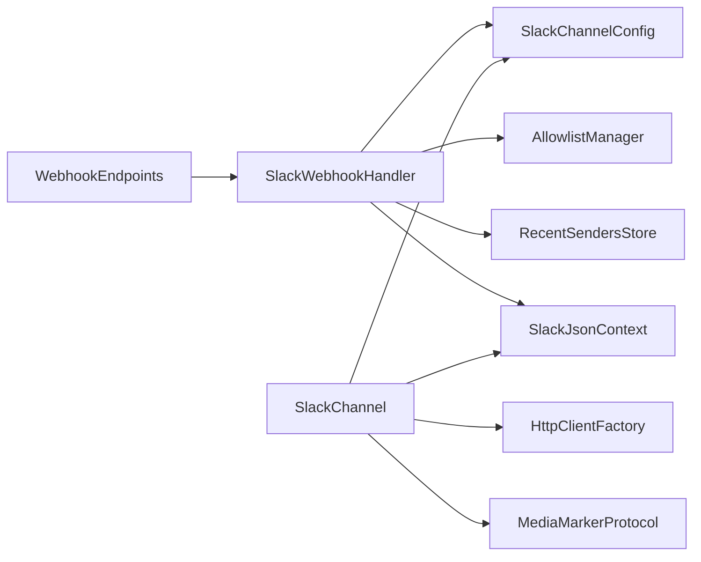

# Slack 集成

<cite>
**本文档引用的文件**
- [SlackChannel.cs](file://src/OpenClaw.Channels/SlackChannel.cs)
- [SlackWebhookHandler.cs](file://src/OpenClaw.Gateway/SlackWebhookHandler.cs)
- [WebhookEndpoints.cs](file://src/OpenClaw.Gateway/Endpoints/WebhookEndpoints.cs)
- [GatewayConfig.cs](file://src/OpenClaw.Core/Models/GatewayConfig.cs)
- [Messages.cs](file://src/OpenClaw.Core/Models/Messages.cs)
- [MediaMarkers.cs](file://src/OpenClaw.Core/Models/MediaMarkers.cs)
- [ChannelSetupCommand.cs](file://src/OpenClaw.Cli/ChannelSetupCommand.cs)
- [appsettings.json](file://src/OpenClaw.Gateway/appsettings.json)
</cite>

## 目录
1. [简介](#简介)
2. [项目结构](#项目结构)
3. [核心组件](#核心组件)
4. [架构总览](#架构总览)
5. [详细组件分析](#详细组件分析)
6. [依赖关系分析](#依赖关系分析)
7. [性能考虑](#性能考虑)
8. [故障排除指南](#故障排除指南)
9. [结论](#结论)
10. [附录](#附录)

## 简介
本文件面向 Slack 集成的技术实现，围绕以下目标展开：
- 深入解释 SlackChannel 类的实现原理，包括 Slack Web API 集成、消息发送与接收机制
- 详细说明 Slack 应用配置，包括 Bot 用户设置、权限范围、事件订阅配置等
- 文档化消息处理流程，覆盖普通消息、富文本消息、文件上传、块元素（Block Kit）的处理方式
- 解释 SlackWebhookHandler 的 Webhook 处理逻辑，包括事件验证、消息解析、响应处理等
- 提供完整的 Slack 应用创建指南，包括 OAuth 授权、事件订阅设置、消息权限配置等
- 包含错误处理、重试机制和性能优化建议

## 项目结构
Slack 集成涉及三个主要层次：
- 渠道适配层：负责通过 Slack Web API 发送消息（SlackChannel）
- 网关入口层：负责接收 Slack Events API 和 Slash Command 请求（SlackWebhookHandler + WebhookEndpoints）
- 配置与模型层：定义 SlackChannelConfig、消息模型、媒体标记协议等（GatewayConfig、Messages、MediaMarkers）

**图表来源**
- [SlackChannel.cs:19-116](file://src/OpenClaw.Channels/SlackChannel.cs#L19-L116)
- [SlackWebhookHandler.cs:12-154](file://src/OpenClaw.Gateway/SlackWebhookHandler.cs#L12-L154)
- [WebhookEndpoints.cs:384-472](file://src/OpenClaw.Gateway/Endpoints/WebhookEndpoints.cs#L384-L472)
- [GatewayConfig.cs:735-751](file://src/OpenClaw.Core/Models/GatewayConfig.cs#L735-L751)
- [Messages.cs:6-61](file://src/OpenClaw.Core/Models/Messages.cs#L6-L61)
- [MediaMarkers.cs:22-47](file://src/OpenClaw.Core/Models/MediaMarkers.cs#L22-L47)

**章节来源**
- [SlackChannel.cs:19-116](file://src/OpenClaw.Channels/SlackChannel.cs#L19-L116)
- [SlackWebhookHandler.cs:12-154](file://src/OpenClaw.Gateway/SlackWebhookHandler.cs#L12-L154)
- [WebhookEndpoints.cs:384-472](file://src/OpenClaw.Gateway/Endpoints/WebhookEndpoints.cs#L384-L472)
- [GatewayConfig.cs:735-751](file://src/OpenClaw.Core/Models/GatewayConfig.cs#L735-L751)
- [Messages.cs:6-61](file://src/OpenClaw.Core/Models/Messages.cs#L6-L61)
- [MediaMarkers.cs:22-47](file://src/OpenClaw.Core/Models/MediaMarkers.cs#L22-L47)

## 核心组件
- SlackChannel：实现 IChannelAdapter，负责将 OutboundMessage 转换为 Slack Web API 的 chat.postMessage 请求，并处理速率限制与应用级错误
- SlackWebhookHandler：处理 Slack Events API 事件回调与 Slash Command 表单提交，执行签名验证、白名单过滤、去重与入队
- WebhookEndpoints：ASP.NET Core 路由，将 HTTP 请求分派给 SlackWebhookHandler 并进行请求体大小限制与死信记录
- SlackChannelConfig：Slack 渠道配置，包含 Bot Token、Signing Secret、Webhook 路径、白名单、最大字符数等
- InboundMessage/OutboundMessage：统一的消息模型，承载 Slack 事件字段（如 ts、thread_ts、channel_type 等）
- MediaMarkerProtocol：从消息文本中提取媒体标记（如 IMAGE_URL、FILE_URL 等），用于后续工具或渲染

**章节来源**
- [SlackChannel.cs:44-91](file://src/OpenClaw.Channels/SlackChannel.cs#L44-L91)
- [SlackWebhookHandler.cs:42-154](file://src/OpenClaw.Gateway/SlackWebhookHandler.cs#L42-L154)
- [WebhookEndpoints.cs:384-472](file://src/OpenClaw.Gateway/Endpoints/WebhookEndpoints.cs#L384-L472)
- [GatewayConfig.cs:735-751](file://src/OpenClaw.Core/Models/GatewayConfig.cs#L735-L751)
- [Messages.cs:6-61](file://src/OpenClaw.Core/Models/Messages.cs#L6-L61)
- [MediaMarkers.cs:22-47](file://src/OpenClaw.Core/Models/MediaMarkers.cs#L22-L47)

## 架构总览
下图展示了 Slack 入站与出站消息的关键交互流程。

**图表来源**
- [WebhookEndpoints.cs:384-472](file://src/OpenClaw.Gateway/Endpoints/WebhookEndpoints.cs#L384-L472)
- [SlackWebhookHandler.cs:42-154](file://src/OpenClaw.Gateway/SlackWebhookHandler.cs#L42-L154)
- [SlackChannel.cs:44-91](file://src/OpenClaw.Channels/SlackChannel.cs#L44-L91)

## 详细组件分析

### SlackChannel 组件分析
- 角色与职责
  - 实现 IChannelAdapter，负责将 OutboundMessage 发送到 Slack Web API
  - 支持线程回复（thread_ts）、Markdown 到 mrkdwn 的基础转换
  - 处理 429 速率限制与应用级错误（ok=false）
- 关键实现点
  - 使用 HttpClientFactory 创建 HTTP 客户端，避免连接泄漏
  - 从配置中解析 Bot Token（支持直接值或密钥引用），并以 Bearer 方式鉴权
  - 将消息文本中的媒体标记提取后，仅保留剩余文本参与发送；同时将 Markdown 转换为 Slack 支持的 mrkdwn
  - 对 Slack 返回体进行解析，若 ok=false 记录错误日志
  - 对 429 响应按 Retry-After 或默认 1 秒进行告警提示
- 错误处理
  - 捕获异常并记录错误日志，避免中断调用方
  - 对非 2xx 状态码调用 EnsureSuccessStatusCode 抛出异常，便于上层感知
- 性能与资源
  - 使用 ValueTask/async/await 避免同步阻塞
  - 在 DisposeAsync 中释放 HttpClient

**图表来源**
- [SlackChannel.cs:19-116](file://src/OpenClaw.Channels/SlackChannel.cs#L19-L116)
- [SlackChannel.cs:118-177](file://src/OpenClaw.Channels/SlackChannel.cs#L118-L177)

**章节来源**
- [SlackChannel.cs:26-34](file://src/OpenClaw.Channels/SlackChannel.cs#L26-L34)
- [SlackChannel.cs:44-91](file://src/OpenClaw.Channels/SlackChannel.cs#L44-L91)
- [SlackChannel.cs:96-109](file://src/OpenClaw.Channels/SlackChannel.cs#L96-L109)

### SlackWebhookHandler 组件分析
- 角色与职责
  - 处理 Slack Events API 回调与 Slash Command 表单提交
  - 执行签名验证（HMAC-SHA256）、时间戳防重放、白名单过滤
  - 将合法事件封装为 InboundMessage 并入队到消息管道
- 关键实现点
  - 签名验证：使用 v0 签名算法，校验时间戳在 300 秒窗口内，采用固定时间比较防止时序攻击
  - URL 验证：当 type=url_verification 时，直接返回 challenge
  - 事件过滤：忽略 bot_message 与非 message/app_mention 事件
  - 白名单控制：支持工作区、频道、用户三类白名单
  - 会话标识：根据 thread_ts、IM（私信）与普通群组动态生成 sessionId
  - Slash Command：解析表单参数，支持 DM 识别与命令拼接
- 错误处理
  - 无效负载返回 400
  - 签名失败返回 401
  - 工作区/频道/用户不在白名单返回 403
  - 正常处理返回 200 或特定响应体

**图表来源**
- [SlackWebhookHandler.cs:42-154](file://src/OpenClaw.Gateway/SlackWebhookHandler.cs#L42-L154)

**章节来源**
- [SlackWebhookHandler.cs:21-35](file://src/OpenClaw.Gateway/SlackWebhookHandler.cs#L21-L35)
- [SlackWebhookHandler.cs:42-154](file://src/OpenClaw.Gateway/SlackWebhookHandler.cs#L42-L154)
- [SlackWebhookHandler.cs:244-274](file://src/OpenClaw.Gateway/SlackWebhookHandler.cs#L244-L274)

### Slack 入站 Webhook 路由与处理
- 路由映射
  - 事件回调：POST /slack/events
  - Slash Command：POST /slack/commands
- 请求体限制与去重
  - 读取请求体并限制最大字节数
  - 对 url_verification 进行特殊处理（必须立即响应挑战）
  - 异常时记录死信（dead letter），包含关键上下文信息
- 签名验证与转发
  - 从请求头读取 X-Slack-Request-Timestamp 与 X-Slack-Signature
  - 调用 SlackWebhookHandler 处理并返回结果

**章节来源**
- [WebhookEndpoints.cs:384-472](file://src/OpenClaw.Gateway/Endpoints/WebhookEndpoints.cs#L384-L472)
- [WebhookEndpoints.cs:474-540](file://src/OpenClaw.Gateway/Endpoints/WebhookEndpoints.cs#L474-L540)

### SlackChannelConfig 与消息模型
- SlackChannelConfig 字段
  - Enabled、DmPolicy、BotToken/BotTokenRef、SigningSecret/SigningSecretRef
  - WebhookPath、SlashCommandPath、AllowedWorkspaceIds、AllowedChannelIds、AllowedFromUserIds
  - MaxInboundChars、MaxRequestBytes、ValidateSignature
- 消息模型
  - InboundMessage：包含 ChannelId、SenderId、SessionId、Text、MessageId、ReplyToMessageId、IsGroup、GroupId 等
  - OutboundMessage：包含 ChannelId、RecipientId、Text、ReplyToMessageId 等

**章节来源**
- [GatewayConfig.cs:735-751](file://src/OpenClaw.Core/Models/GatewayConfig.cs#L735-L751)
- [Messages.cs:6-61](file://src/OpenClaw.Core/Models/Messages.cs#L6-L61)

### 媒体标记与富文本处理
- 媒体标记协议
  - 从文本中提取 IMAGE_URL、FILE_URL 等标记，剩余文本参与发送
  - SlackChannel 在发送前对 Markdown 基础语法进行 mrkdwn 转换
- 富文本与 Block Kit
  - 当前实现未直接解析 Block Kit JSON；富文本内容通常通过 mrkdwn 或外部工具处理
  - 若需完整 Block Kit 支持，可在上游消息预处理阶段将 Block Kit 转换为 mrkdwn 或其他兼容格式

**章节来源**
- [MediaMarkers.cs:22-47](file://src/OpenClaw.Core/Models/MediaMarkers.cs#L22-L47)
- [SlackChannel.cs:48-51](file://src/OpenClaw.Channels/SlackChannel.cs#L48-L51)
- [SlackChannel.cs:96-103](file://src/OpenClaw.Channels/SlackChannel.cs#L96-L103)

## 依赖关系分析
- SlackChannel 依赖
  - SlackChannelConfig（BotToken、ValidateSignature）
  - SecretResolver（密钥解析）
  - HttpClientFactory（HTTP 客户端）
  - MediaMarkerProtocol（媒体标记提取）
  - SlackJsonContext（JSON 序列化上下文）
- SlackWebhookHandler 依赖
  - SlackChannelConfig（白名单、路径、最大字符数）
  - AllowlistManager（用户白名单）
  - RecentSendersStore（最近发送者记录）
  - SlackJsonContext（事件反序列化）
  - AllowlistPolicy（白名单策略）
- WebhookEndpoints 依赖
  - EndpointHelpers（请求体读取）
  - SlackWebhookHandler（业务处理）
  - DeadLetter 记录（异常兜底）

**图表来源**
- [WebhookEndpoints.cs:384-472](file://src/OpenClaw.Gateway/Endpoints/WebhookEndpoints.cs#L384-L472)
- [SlackWebhookHandler.cs:21-35](file://src/OpenClaw.Gateway/SlackWebhookHandler.cs#L21-L35)
- [SlackChannel.cs:26-34](file://src/OpenClaw.Channels/SlackChannel.cs#L26-L34)

**章节来源**
- [WebhookEndpoints.cs:384-472](file://src/OpenClaw.Gateway/Endpoints/WebhookEndpoints.cs#L384-L472)
- [SlackWebhookHandler.cs:21-35](file://src/OpenClaw.Gateway/SlackWebhookHandler.cs#L21-L35)
- [SlackChannel.cs:26-34](file://src/OpenClaw.Channels/SlackChannel.cs#L26-L34)

## 性能考虑
- 速率限制
  - SlackChannel 对 429 响应记录 Retry-After 并告警，建议在上游增加指数退避与队列限流
- 请求体大小
  - WebhookEndpoints 对请求体大小进行限制，防止内存压力；可根据业务调整 MaxRequestBytes
- 序列化与网络
  - 使用 Source Generation（SlackJsonContext）减少序列化开销
  - 复用 HttpClient，避免连接泄漏
- 白名单与去重
  - 合理配置 AllowedWorkspaceIds/AllowedChannelIds/AllowedFromUserIds，降低无效流量
  - 对 url_verification 特判可减少不必要的解析与入队

[本节为通用指导，无需具体文件分析]

## 故障排除指南
- 签名验证失败（401）
  - 检查 SigningSecret 与 SigningSecretRef 是否正确配置
  - 确认 X-Slack-Request-Timestamp 与 X-Slack-Signature 是否随请求头传递
  - 时间戳应在当前时间 300 秒窗口内
- 工作区/频道/用户被拒绝（403）
  - 检查 AllowedWorkspaceIds、AllowedChannelIds、AllowedFromUserIds 配置
  - 确认事件中的 team_id、channel、user 字段与白名单匹配
- URL 验证失败
  - 确保事件回调 URL 在 Slack 应用后台正确配置
- 应用级错误（ok=false）
  - 查看日志中的 error 字段，常见原因包括无权限、频道不存在、消息过长等
- 429 速率限制
  - 增加上游限流与退避策略，避免触发 Slack 限流
- 死信记录
  - WebhookEndpoints 在异常时记录死信，包含 Source、DeliveryKey、ChannelId、SenderId、SessionId、Error、PayloadPreview 等字段，便于排查

**章节来源**
- [SlackWebhookHandler.cs:49-56](file://src/OpenClaw.Gateway/SlackWebhookHandler.cs#L49-L56)
- [SlackWebhookHandler.cs:91-102](file://src/OpenClaw.Gateway/SlackWebhookHandler.cs#L91-L102)
- [SlackChannel.cs:66-83](file://src/OpenClaw.Channels/SlackChannel.cs#L66-L83)
- [WebhookEndpoints.cs:452-471](file://src/OpenClaw.Gateway/Endpoints/WebhookEndpoints.cs#L452-L471)

## 结论
本集成方案通过 SlackChannel 与 SlackWebhookHandler 分别承担“出站发送”与“入站接收”的职责，配合严格的签名验证、白名单控制与死信记录，提供了稳定可靠的 Slack 通道能力。对于富文本与 Block Kit 的处理，当前实现侧重于 mrkdwn 与媒体标记协议；若需更丰富的消息格式，可在上游进行转换或扩展。

[本节为总结性内容，无需具体文件分析]

## 附录

### Slack 应用创建与配置指南
- 创建 Slack 应用
  - 在 https://api.slack.com/apps 新建应用，选择目标工作区
- Bot 用户与权限
  - 在 App-Level Tokens 为 Bot 用户授予必要 scopes（如 chat:write、groups:read、users:read 等）
  - 在 OAuth & Permissions 页面安装应用到工作区，获取 Bot User OAuth Token
- 事件订阅与 Webhook
  - 在 Event Subscriptions 中开启 Request URL，填写 /slack/events 路径
  - 添加事件（如 message.channels、message.groups、app_mention 等）
  - 在 Verify Signature 中配置 Signing Secret
- Slash Command
  - 在 Slash Commands 中添加命令，填写 /slack/commands 路径
- 配置项参考
  - BotToken/BotTokenRef：Bot 用户 OAuth Token
  - SigningSecret/SigningSecretRef：事件验证签名密钥
  - WebhookPath：/slack/events
  - SlashCommandPath：/slack/commands
  - AllowedWorkspaceIds/AllowedChannelIds/AllowedFromUserIds：白名单控制
  - MaxInboundChars/MaxRequestBytes：入站字符数与请求体大小限制
  - ValidateSignature：启用签名验证

**章节来源**
- [ChannelSetupCommand.cs:117-125](file://src/OpenClaw.Cli/ChannelSetupCommand.cs#L117-L125)
- [appsettings.json:454-469](file://src/OpenClaw.Gateway/appsettings.json#L454-L469)