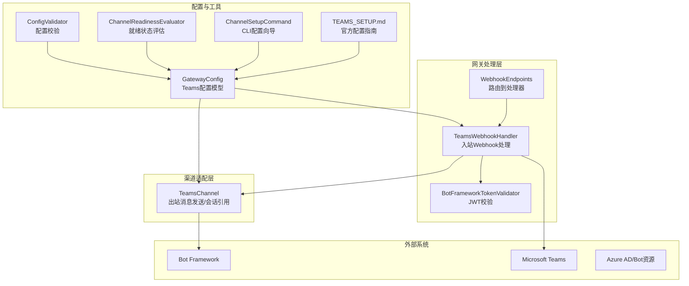
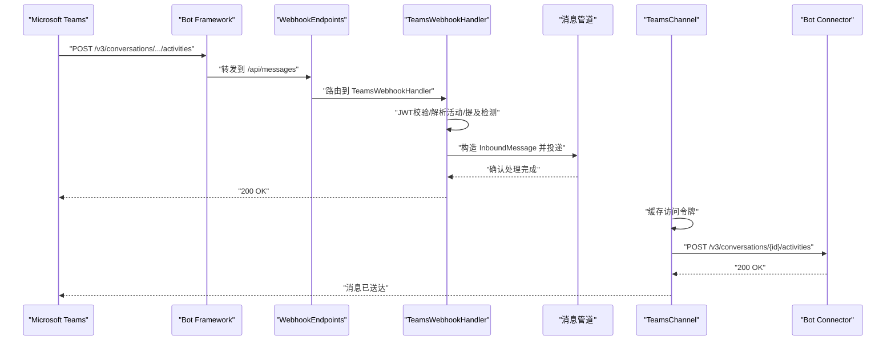
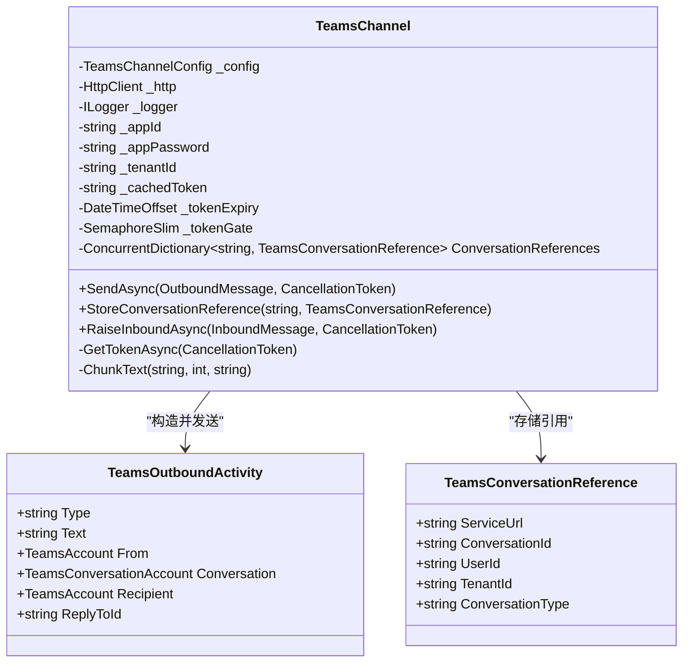
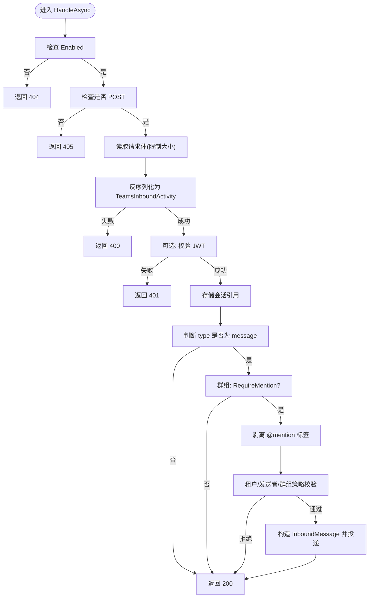
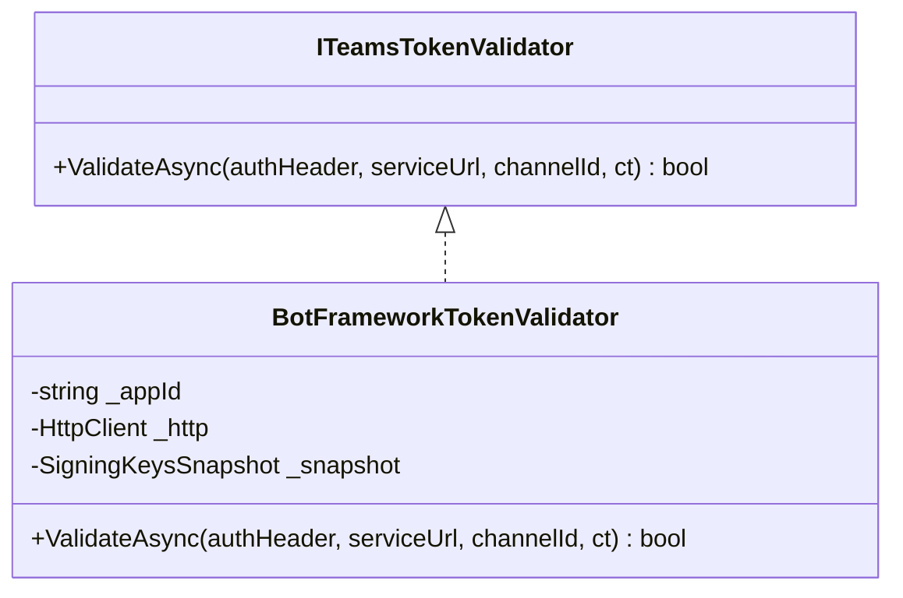
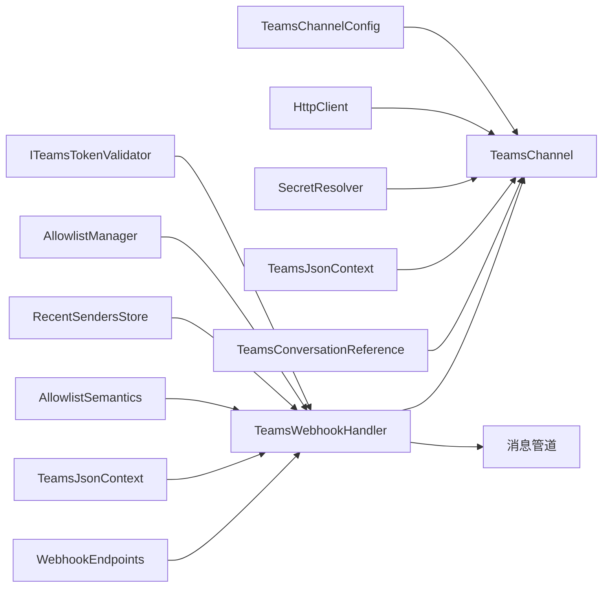

# Teams 集成

<cite>
**本文引用的文件**
- [TeamsChannel.cs](file://src/OpenClaw.Channels/TeamsChannel.cs)
- [TeamsWebhookHandler.cs](file://src/OpenClaw.Gateway/TeamsWebhookHandler.cs)
- [TEAMS_SETUP.md](file://docs/TEAMS_SETUP.md)
- [BotFrameworkTokenValidator.cs](file://src/OpenClaw.Gateway/BotFrameworkTokenValidator.cs)
- [WebhookEndpoints.cs](file://src/OpenClaw.Gateway/Endpoints/WebhookEndpoints.cs)
- [TwilioSmsChannel.cs](file://src/OpenClaw.Channels/TwilioSmsChannel.cs)
- [TwilioSmsClient.cs](file://src/OpenClaw.Channels/TwilioSmsClient.cs)
- [GatewayConfig.cs](file://src/OpenClaw.Core/Models/GatewayConfig.cs)
- [ConfigValidator.cs](file://src/OpenClaw.Core/Validation/ConfigValidator.cs)
- [ChannelReadinessEvaluator.cs](file://src/OpenClaw.Gateway/ChannelReadinessEvaluator.cs)
- [ChannelSetupCommand.cs](file://src/OpenClaw.Cli/ChannelSetupCommand.cs)
- [TeamsWebhookHandlerTests.cs](file://src/OpenClaw.Tests/TeamsWebhookHandlerTests.cs)
</cite>

## 目录
1. [简介](#简介)
2. [项目结构](#项目结构)
3. [核心组件](#核心组件)
4. [架构总览](#架构总览)
5. [组件详解](#组件详解)
6. [依赖关系分析](#依赖关系分析)
7. [性能考量](#性能考量)
8. [故障排查指南](#故障排查指南)
9. [结论](#结论)
10. [附录](#附录)

## 简介
本文件面向希望在 OpenClaw 中集成 Microsoft Teams 的工程师与运维人员，系统性阐述 TeamsChannel 的实现原理、TeamsWebhookHandler 的 Webhook 处理逻辑、消息发送与接收机制、以及与 Bot Framework 的集成方式。同时提供从 Azure 应用注册到 Teams 应用包配置的完整落地指南，并与 Twilio SMS 进行横向对比，帮助读者做出合适的技术选型。

## 项目结构
与 Teams 集成相关的核心代码分布在以下模块：
- 渠道适配层：TeamsChannel 负责出站消息发送与会话引用管理
- 网关处理层：TeamsWebhookHandler 负责入站 Webhook 校验、解析与路由
- 安全校验：BotFrameworkTokenValidator 提供 Bot Framework JWT 校验能力
- 配置与校验：GatewayConfig、ConfigValidator、ChannelReadinessEvaluator、ChannelSetupCommand
- 文档与测试：TEAMS_SETUP.md、TeamsWebhookHandlerTests

图表来源
- [TeamsChannel.cs:1-355](file://src/OpenClaw.Channels/TeamsChannel.cs#L1-L355)
- [TeamsWebhookHandler.cs:1-272](file://src/OpenClaw.Gateway/TeamsWebhookHandler.cs#L1-L272)
- [BotFrameworkTokenValidator.cs:1-90](file://src/OpenClaw.Gateway/BotFrameworkTokenValidator.cs#L1-L90)
- [WebhookEndpoints.cs:274-303](file://src/OpenClaw.Gateway/Endpoints/WebhookEndpoints.cs#L274-L303)
- [GatewayConfig.cs:635-700](file://src/OpenClaw.Core/Models/GatewayConfig.cs#L635-L700)
- [ConfigValidator.cs:339-355](file://src/OpenClaw.Core/Validation/ConfigValidator.cs#L339-L355)
- [ChannelReadinessEvaluator.cs:321-357](file://src/OpenClaw.Gateway/ChannelReadinessEvaluator.cs#L321-L357)
- [ChannelSetupCommand.cs:139-155](file://src/OpenClaw.Cli/ChannelSetupCommand.cs#L139-L155)
- [TEAMS_SETUP.md:1-205](file://docs/TEAMS_SETUP.md#L1-L205)

章节来源
- [TeamsChannel.cs:1-355](file://src/OpenClaw.Channels/TeamsChannel.cs#L1-L355)
- [TeamsWebhookHandler.cs:1-272](file://src/OpenClaw.Gateway/TeamsWebhookHandler.cs#L1-L272)
- [BotFrameworkTokenValidator.cs:1-90](file://src/OpenClaw.Gateway/BotFrameworkTokenValidator.cs#L1-L90)
- [WebhookEndpoints.cs:274-303](file://src/OpenClaw.Gateway/Endpoints/WebhookEndpoints.cs#L274-L303)
- [GatewayConfig.cs:635-700](file://src/OpenClaw.Core/Models/GatewayConfig.cs#L635-L700)
- [ConfigValidator.cs:339-355](file://src/OpenClaw.Core/Validation/ConfigValidator.cs#L339-L355)
- [ChannelReadinessEvaluator.cs:321-357](file://src/OpenClaw.Gateway/ChannelReadinessEvaluator.cs#L321-L357)
- [ChannelSetupCommand.cs:139-155](file://src/OpenClaw.Cli/ChannelSetupCommand.cs#L139-L155)
- [TEAMS_SETUP.md:1-205](file://docs/TEAMS_SETUP.md#L1-L205)

## 核心组件
- TeamsChannel：实现 IChannelAdapter，负责通过 Bot Connector REST API 发送消息、缓存访问令牌、按需分片发送、存储会话引用以支持主动消息。
- TeamsWebhookHandler：处理来自 Bot Framework 的入站活动，进行 JWT 校验、实体解析、提及检测、会话引用存储、入站消息构造与投递。
- BotFrameworkTokenValidator：校验 Bot Framework JWT 的签名校验、受众、发行者、过期时间等。
- 配置与校验：GatewayConfig 中的 TeamsChannelConfig 模型；ConfigValidator 校验必填项；ChannelReadinessEvaluator 输出就绪状态；ChannelSetupCommand 提供 CLI 向导。

章节来源
- [TeamsChannel.cs:21-136](file://src/OpenClaw.Channels/TeamsChannel.cs#L21-L136)
- [TeamsWebhookHandler.cs:15-40](file://src/OpenClaw.Gateway/TeamsWebhookHandler.cs#L15-L40)
- [BotFrameworkTokenValidator.cs:15-90](file://src/OpenClaw.Gateway/BotFrameworkTokenValidator.cs#L15-L90)
- [GatewayConfig.cs:635-700](file://src/OpenClaw.Core/Models/GatewayConfig.cs#L635-L700)
- [ConfigValidator.cs:339-355](file://src/OpenClaw.Core/Validation/ConfigValidator.cs#L339-L355)
- [ChannelReadinessEvaluator.cs:321-357](file://src/OpenClaw.Gateway/ChannelReadinessEvaluator.cs#L321-L357)
- [ChannelSetupCommand.cs:139-155](file://src/OpenClaw.Cli/ChannelSetupCommand.cs#L139-L155)

## 架构总览
Teams 集成采用“Webhook 入站 + Bot Connector 出站”的经典模式：
- 入站：Teams 将消息作为 Bot Framework Activity 推送到网关的 /api/messages；TeamsWebhookHandler 解析并校验，构造 InboundMessage 投递至管道。
- 出站：TeamsChannel 通过缓存的 OAuth 令牌调用 Bot Connector REST API 发送消息；支持按行或按长度分片，支持回复到指定消息线程。
- 主动消息：首次收到用户消息后，TeamsWebhookHandler 存储会话引用，TeamsChannel 可据此主动发送消息。

图表来源
- [WebhookEndpoints.cs:274-303](file://src/OpenClaw.Gateway/Endpoints/WebhookEndpoints.cs#L274-L303)
- [TeamsWebhookHandler.cs:42-188](file://src/OpenClaw.Gateway/TeamsWebhookHandler.cs#L42-L188)
- [TeamsChannel.cs:63-110](file://src/OpenClaw.Channels/TeamsChannel.cs#L63-L110)
- [BotFrameworkTokenValidator.cs:40-90](file://src/OpenClaw.Gateway/BotFrameworkTokenValidator.cs#L40-L90)

## 组件详解

### TeamsChannel：出站消息与会话管理
- 认证与令牌缓存：通过 Azure AD 获取 OAuth 令牌，带锁的并发安全缓存，避免频繁请求。
- 消息发送：根据 ReplyStyle 决定是否回复到线程；按 TextChunkLimit 和 ChunkMode 对长文本进行分片。
- 会话引用：StoreConversationReference 保存 ServiceUrl、ConversationId、UserId 等，支持后续主动消息。
- 错误处理：捕获 HTTP 异常并记录日志，不阻断整体流程。

图表来源
- [TeamsChannel.cs:21-136](file://src/OpenClaw.Channels/TeamsChannel.cs#L21-L136)
- [TeamsChannel.cs:220-266](file://src/OpenClaw.Channels/TeamsChannel.cs#L220-L266)
- [TeamsChannel.cs:211-218](file://src/OpenClaw.Channels/TeamsChannel.cs#L211-L218)

章节来源
- [TeamsChannel.cs:63-110](file://src/OpenClaw.Channels/TeamsChannel.cs#L63-L110)
- [TeamsChannel.cs:138-175](file://src/OpenClaw.Channels/TeamsChannel.cs#L138-L175)
- [TeamsChannel.cs:177-206](file://src/OpenClaw.Channels/TeamsChannel.cs#L177-L206)
- [TeamsChannel.cs:211-266](file://src/OpenClaw.Channels/TeamsChannel.cs#L211-L266)

### TeamsWebhookHandler：入站 Webhook 处理
- 方法与路由：接收 HTTP POST 请求，读取请求体，反序列化为 TeamsInboundActivity。
- JWT 校验：可选开启 ValidateToken，使用 BotFrameworkTokenValidator 校验 JWT。
- 会话引用：提取 ServiceUrl、Conversation.Id 等，调用 TeamsChannel.StoreConversationReference。
- 消息过滤：仅处理 type=message；支持租户白名单、发送者白名单、群组策略（allowlist/disabled/open）。
- 提及检测与清理：在群组场景下要求 @mention，自动剥离 <at> 标签。
- 入站消息构造：填充 ChannelId、SenderId、SenderName、Text、MessageId、ReplyToId、IsGroup、GroupId、SessionId 等字段并投递。

图表来源
- [TeamsWebhookHandler.cs:42-188](file://src/OpenClaw.Gateway/TeamsWebhookHandler.cs#L42-L188)
- [TeamsWebhookHandler.cs:190-224](file://src/OpenClaw.Gateway/TeamsWebhookHandler.cs#L190-L224)
- [TeamsWebhookHandler.cs:255-270](file://src/OpenClaw.Gateway/TeamsWebhookHandler.cs#L255-L270)

章节来源
- [TeamsWebhookHandler.cs:42-188](file://src/OpenClaw.Gateway/TeamsWebhookHandler.cs#L42-L188)
- [TeamsWebhookHandler.cs:190-224](file://src/OpenClaw.Gateway/TeamsWebhookHandler.cs#L190-L224)
- [TeamsWebhookHandler.cs:255-270](file://src/OpenClaw.Gateway/TeamsWebhookHandler.cs#L255-L270)

### Bot Framework JWT 校验
- 支持接口 ITeamsTokenValidator，默认实现 BotFrameworkTokenValidator。
- 校验内容：算法必须为 RS256；发行者必须为 https://api.botframework.com；受众必须匹配 AppId；过期时间与容差控制；必要时校验 nbf。
- 缓存 JWKS 元数据，减少网络往返。

图表来源
- [BotFrameworkTokenValidator.cs:10-38](file://src/OpenClaw.Gateway/BotFrameworkTokenValidator.cs#L10-L38)
- [BotFrameworkTokenValidator.cs:40-90](file://src/OpenClaw.Gateway/BotFrameworkTokenValidator.cs#L40-L90)

章节来源
- [BotFrameworkTokenValidator.cs:10-90](file://src/OpenClaw.Gateway/BotFrameworkTokenValidator.cs#L10-L90)

### 配置与就绪状态
- TeamsChannelConfig 字段覆盖：启用开关、凭据引用、Webhook 路径、DM/群组策略、提及要求、回复样式、分片参数、租户/发送者/团队/会话白名单等。
- 配置校验：当启用 Teams 时，要求 AppId、AppPassword、TenantId 均已配置。
- 就绪评估：若未启用 ValidateToken，会在非回环绑定时给出警告。
- CLI 向导：ChannelSetupCommand 提供交互式配置 Teams 的 AppId、AppPassword、TenantId、策略等。

章节来源
- [GatewayConfig.cs:635-700](file://src/OpenClaw.Core/Models/GatewayConfig.cs#L635-L700)
- [ConfigValidator.cs:339-355](file://src/OpenClaw.Core/Validation/ConfigValidator.cs#L339-L355)
- [ChannelReadinessEvaluator.cs:321-357](file://src/OpenClaw.Gateway/ChannelReadinessEvaluator.cs#L321-L357)
- [ChannelSetupCommand.cs:139-155](file://src/OpenClaw.Cli/ChannelSetupCommand.cs#L139-L155)

### 消息处理流程（文本/富文本/卡片/文件）
- 文本消息：直接读取 activity.text，支持提及剥离与长度截断。
- 富文本/卡片：TeamsInboundActivity 支持 entities（如 mention）与 channelData；TeamsWebhookHandler 已具备解析与提及剥离能力，后续可在业务侧根据 entities 或 channelData 扩展富文本/卡片处理。
- 文件共享：TeamsInboundActivity 的 entities 可携带文件/附件信息，结合 TeamsChannel 的会话引用可实现文件下载与处理（需在上层业务逻辑中扩展）。

章节来源
- [TeamsWebhookHandler.cs:270-349](file://src/OpenClaw.Gateway/TeamsWebhookHandler.cs#L270-L349)
- [TeamsChannel.cs:63-110](file://src/OpenClaw.Channels/TeamsChannel.cs#L63-L110)

### Teams 应用创建与配置指南
- Azure Bot 创建与凭据收集：App ID、Client Secret、Tenant ID。
- OpenClaw 配置：appsettings.json 中 Channels.Teams 下的各字段；环境变量映射。
- 公网暴露：Cloudflare Tunnel 或 ngrok；设置 Azure Bot 的 Messaging Endpoint。
- Teams 应用包：manifest.json 包含 botId、权限声明、域名等；上传并安装到目标团队。
- 策略与白名单：DM/群组策略、提及要求、租户/发送者/团队/会话白名单。
- 故障排查：401 来自手动测试、Bot 不响应、上传失败、主动消息不可用等问题的定位方法。

章节来源
- [TEAMS_SETUP.md:11-205](file://docs/TEAMS_SETUP.md#L11-L205)

### 与 Twilio SMS 的对比与选择建议
- 传输协议：Teams 使用 Bot Framework HTTPS Webhook + Bot Connector REST API；Twilio SMS 使用 HTTP(S) REST API。
- 认证与安全：Teams 支持 JWT 校验；Twilio SMS 支持签名验证（可选），且需公网可访问。
- 消息类型：Teams 支持富文本、卡片、文件；Twilio SMS 主要为纯文本（可通过 TwiML 扩展）。
- 部署复杂度：Teams 需要 Azure Bot、Teams 应用包、权限配置；Twilio 需要账户 SID、认证令牌、短信服务 SID/From Number。
- 适用场景：Teams 更适合企业协作与团队工作流；Twilio 更适合短信通知与快速集成。

章节来源
- [TwilioSmsChannel.cs:1-59](file://src/OpenClaw.Channels/TwilioSmsChannel.cs#L1-L59)
- [TwilioSmsClient.cs:1-38](file://src/OpenClaw.Channels/TwilioSmsClient.cs#L1-L38)
- [TEAMS_SETUP.md:11-205](file://docs/TEAMS_SETUP.md#L11-L205)

## 依赖关系分析
- TeamsChannel 依赖 TeamsChannelConfig、HttpClient、SecretResolver、TeamsJsonContext、TeamsConversationReference 等。
- TeamsWebhookHandler 依赖 TeamsChannel、ITeamsTokenValidator、AllowlistManager、RecentSendersStore、AllowlistSemantics、TeamsJsonContext。
- BotFrameworkTokenValidator 依赖 HttpClient、OpenId/JWKS 元数据、签名验证。
- WebhookEndpoints 将 /api/messages 路由到 TeamsWebhookHandler 并将入站消息写入管道。

图表来源
- [TeamsChannel.cs:40-52](file://src/OpenClaw.Channels/TeamsChannel.cs#L40-L52)
- [TeamsWebhookHandler.cs:25-40](file://src/OpenClaw.Gateway/TeamsWebhookHandler.cs#L25-L40)
- [WebhookEndpoints.cs:274-303](file://src/OpenClaw.Gateway/Endpoints/WebhookEndpoints.cs#L274-L303)

章节来源
- [TeamsChannel.cs:40-52](file://src/OpenClaw.Channels/TeamsChannel.cs#L40-L52)
- [TeamsWebhookHandler.cs:25-40](file://src/OpenClaw.Gateway/TeamsWebhookHandler.cs#L25-L40)
- [WebhookEndpoints.cs:274-303](file://src/OpenClaw.Gateway/Endpoints/WebhookEndpoints.cs#L274-L303)

## 性能考量
- 令牌缓存：TeamsChannel 使用并发安全的令牌缓存与过期前刷新，降低 OAuth 请求频率。
- 分片发送：按长度或按行分片，避免单次消息超限；ReplyStyle 支持线程内回复，减少无关噪音。
- 流控与重试：建议在上游增加速率限制与幂等去重（DeliveryStore 已在 WebhookEndpoints 中体现）。
- 并发与锁：令牌获取使用信号量门禁，避免竞态；会话引用使用并发字典，保证高并发下的稳定性。

章节来源
- [TeamsChannel.cs:138-175](file://src/OpenClaw.Channels/TeamsChannel.cs#L138-L175)
- [TeamsChannel.cs:177-206](file://src/OpenClaw.Channels/TeamsChannel.cs#L177-L206)
- [WebhookEndpoints.cs:274-303](file://src/OpenClaw.Gateway/Endpoints/WebhookEndpoints.cs#L274-L303)

## 故障排查指南
- 401 Unauthorized：本地手动测试时缺少有效 JWT 属于预期；请使用 Azure Web Chat 或确保 Teams 发送的请求带有合法 Authorization 头。
- Bot 不响应：检查 Azure Bot 的 Messaging Endpoint 设置、应用是否安装到目标团队、Teams 是否完全重启、ValidateToken 在本地是否关闭。
- 应用包上传失败：检查 botId 与 App ID 一致、图标尺寸正确、manifest JSON 合法；必要时通过 Teams Admin Center 上传。
- 主动消息不可用：确保用户已至少与 Bot 交互一次，以便存储会话引用。
- 配置校验失败：启用 Teams 时必须提供 AppId、AppPassword、TenantId；分片参数需满足最小值与取值范围。

章节来源
- [TEAMS_SETUP.md:182-205](file://docs/TEAMS_SETUP.md#L182-L205)
- [ConfigValidator.cs:339-355](file://src/OpenClaw.Core/Validation/ConfigValidator.cs#L339-L355)
- [ChannelReadinessEvaluator.cs:321-357](file://src/OpenClaw.Gateway/ChannelReadinessEvaluator.cs#L321-L357)

## 结论
Teams 集成在 OpenClaw 中通过清晰的职责分离实现了稳健的入站/出站消息处理：Webhook 处理器负责安全校验与消息解析，渠道适配器负责消息发送与会话管理。配合完善的配置校验与就绪评估，可快速完成从 Azure 注册到 Teams 应用部署的全流程。与 Twilio SMS 相比，Teams 更适合团队协作与富媒体场景，而 Twilio 更适合短信通知类需求。

## 附录
- 关键配置字段参考：Enabled、AppId/AppIdRef、AppPassword/AppPasswordRef、TenantId/TenantIdRef、WebhookPath、ValidateToken、RequireMention、ReplyStyle、TextChunkLimit、ChunkMode、AllowedTenantIds、AllowedFromIds、AllowedTeamIds、AllowedConversationIds。
- 测试参考：TeamsWebhookHandlerTests 包含 JWT 校验与活动解析的单元测试示例。

章节来源
- [TEAMS_SETUP.md:141-161](file://docs/TEAMS_SETUP.md#L141-L161)
- [TeamsWebhookHandlerTests.cs:18-37](file://src/OpenClaw.Tests/TeamsWebhookHandlerTests.cs#L18-L37)