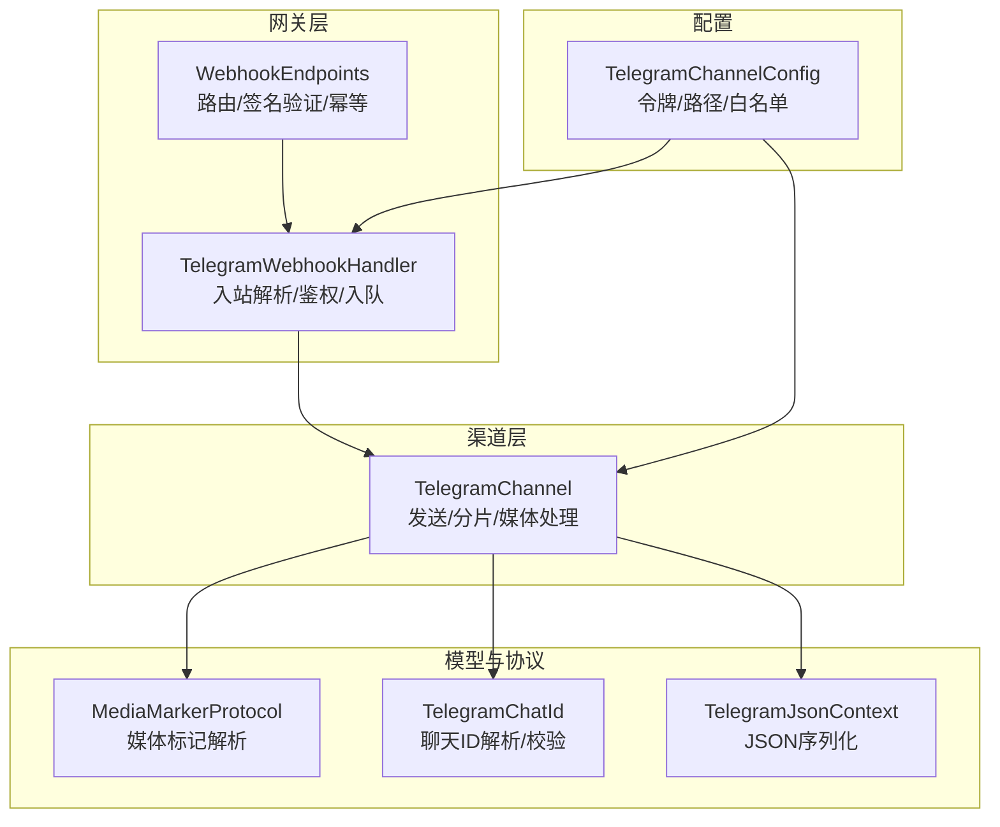
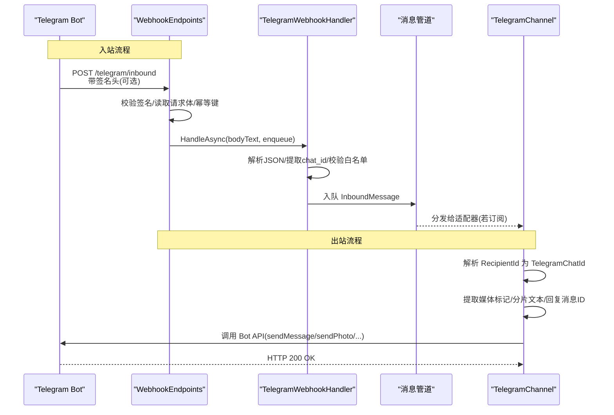
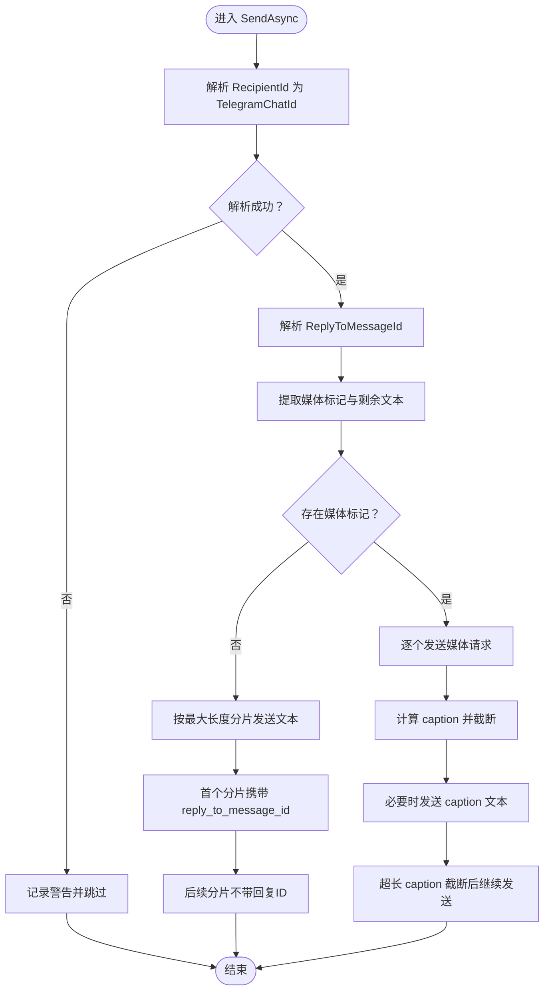
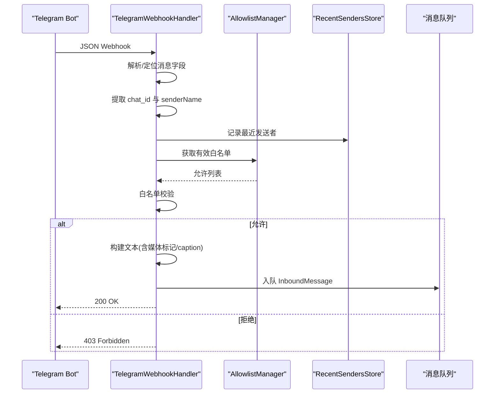
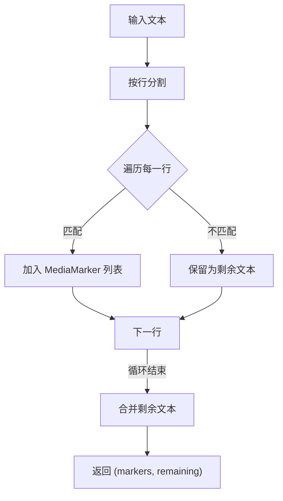
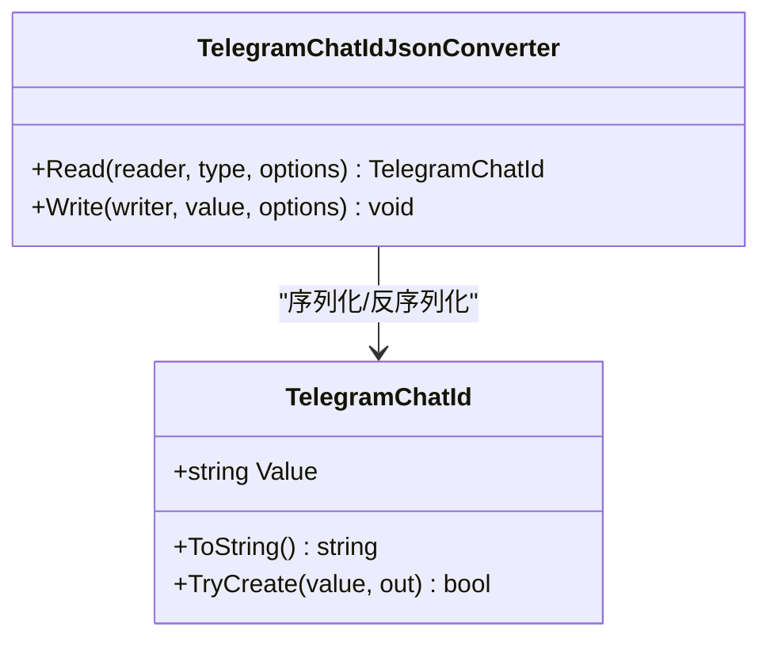
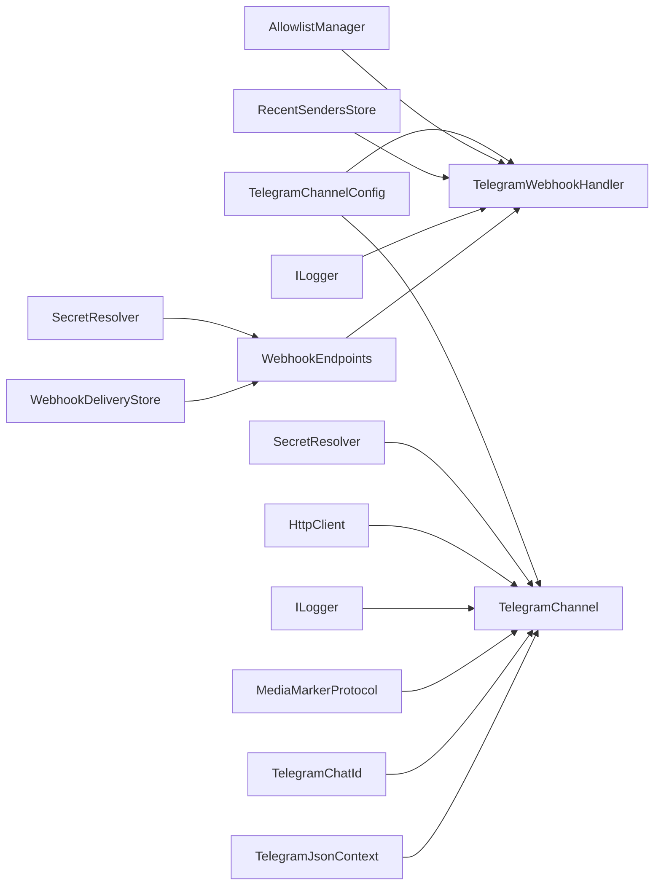

# Telegram 集成

<cite>
**本文引用的文件**
- [TelegramChannel.cs](file://src/OpenClaw.Channels/TelegramChannel.cs)
- [TelegramWebhookHandler.cs](file://src/OpenClaw.Gateway/TelegramWebhookHandler.cs)
- [MediaMarkers.cs](file://src/OpenClaw.Core/Models/MediaMarkers.cs)
- [GatewayConfig.cs](file://src/OpenClaw.Core/Models/GatewayConfig.cs)
- [WebhookEndpoints.cs](file://src/OpenClaw.Gateway/Endpoints/WebhookEndpoints.cs)
- [TelegramChannelTests.cs](file://src/OpenClaw.Tests/TelegramChannelTests.cs)
- [ChannelReadinessEvaluator.cs](file://src/OpenClaw.Gateway/ChannelReadinessEvaluator.cs)
</cite>

## 目录
1. [简介](#简介)
2. [项目结构](#项目结构)
3. [核心组件](#核心组件)
4. [架构总览](#架构总览)
5. [详细组件分析](#详细组件分析)
6. [依赖关系分析](#依赖关系分析)
7. [性能考量](#性能考量)
8. [故障排除指南](#故障排除指南)
9. [结论](#结论)
10. [附录](#附录)

## 简介
本文件面向集成 Telegram 的开发者与运维人员，系统性阐述 TelegramChannel 类的实现原理与使用方式，涵盖 Bot API 集成、Webhook 接收与处理、消息发送与接收机制、身份验证配置、聊天 ID 解析与校验、媒体标记协议、错误处理与日志策略，并提供完整配置示例与故障排除建议。目标是帮助读者在不深入源码的情况下也能正确部署与维护 Telegram 通道。

## 项目结构
Telegram 集成由以下模块协同完成：
- 渠道适配器：负责对外发送消息与内部消息格式转换
- 网关 Webhook 处理器：负责接收 Telegram 发来的入站消息并进行鉴权与入队
- 模型与协议：媒体标记协议、聊天 ID 数据模型、JSON 序列化上下文
- 配置与路由：通道配置、Webhook 路由与签名验证
- 测试与就绪检查：单元测试与运行时就绪状态评估

图表来源
- [TelegramChannel.cs:14-189](file://src/OpenClaw.Channels/TelegramChannel.cs#L14-L189)
- [TelegramWebhookHandler.cs:10-103](file://src/OpenClaw.Gateway/TelegramWebhookHandler.cs#L10-L103)
- [MediaMarkers.cs:22-163](file://src/OpenClaw.Core/Models/MediaMarkers.cs#L22-L163)
- [GatewayConfig.cs:713-733](file://src/OpenClaw.Core/Models/GatewayConfig.cs#L713-L733)
- [WebhookEndpoints.cs:104-174](file://src/OpenClaw.Gateway/Endpoints/WebhookEndpoints.cs#L104-L174)

章节来源
- [TelegramChannel.cs:14-189](file://src/OpenClaw.Channels/TelegramChannel.cs#L14-L189)
- [TelegramWebhookHandler.cs:10-103](file://src/OpenClaw.Gateway/TelegramWebhookHandler.cs#L10-L103)
- [MediaMarkers.cs:22-163](file://src/OpenClaw.Core/Models/MediaMarkers.cs#L22-L163)
- [GatewayConfig.cs:713-733](file://src/OpenClaw.Core/Models/GatewayConfig.cs#L713-L733)
- [WebhookEndpoints.cs:104-174](file://src/OpenClaw.Gateway/Endpoints/WebhookEndpoints.cs#L104-L174)

## 核心组件
- TelegramChannel：实现 IChannelAdapter，负责将出站消息发送到 Telegram Bot API，支持文本分片、媒体发送、回复消息与分片发送。
- TelegramWebhookHandler：解析 Telegram Webhook 请求，执行允许列表校验，构建 InboundMessage 并入队。
- MediaMarkerProtocol：从文本中提取媒体标记，支持多种媒体类型与 Telegram 文件 ID。
- TelegramChatId：封装聊天 ID，支持数字与公共用户名两种格式的解析与校验。
- TelegramChannelConfig：包含 Bot 令牌、Webhook 路径、白名单、最大字符数、请求大小限制、签名验证开关与密钥等配置项。
- WebhookEndpoints：注册 /telegram/inbound 路由，实现签名验证与幂等去重。

章节来源
- [TelegramChannel.cs:18-189](file://src/OpenClaw.Channels/TelegramChannel.cs#L18-L189)
- [TelegramWebhookHandler.cs:10-103](file://src/OpenClaw.Gateway/TelegramWebhookHandler.cs#L10-L103)
- [MediaMarkers.cs:22-163](file://src/OpenClaw.Core/Models/MediaMarkers.cs#L22-L163)
- [GatewayConfig.cs:713-733](file://src/OpenClaw.Core/Models/GatewayConfig.cs#L713-L733)
- [WebhookEndpoints.cs:104-174](file://src/OpenClaw.Gateway/Endpoints/WebhookEndpoints.cs#L104-L174)

## 架构总览
下图展示 Telegram 入站与出站消息流的关键交互：

图表来源
- [WebhookEndpoints.cs:122-174](file://src/OpenClaw.Gateway/Endpoints/WebhookEndpoints.cs#L122-L174)
- [TelegramWebhookHandler.cs:47-103](file://src/OpenClaw.Gateway/TelegramWebhookHandler.cs#L47-L103)
- [TelegramChannel.cs:54-124](file://src/OpenClaw.Channels/TelegramChannel.cs#L54-L124)

## 详细组件分析

### TelegramChannel：发送与分片逻辑
- 身份验证与初始化
  - 通过 SecretResolver 解析 BotTokenRef 或直接使用 BotToken，失败则抛出异常。
- 发送流程
  - 校验 RecipientId 是否能解析为 TelegramChatId；否则记录警告并跳过。
  - 尝试解析 ReplyToMessageId（仅当为纯数字时有效）。
  - 使用 MediaMarkerProtocol.Extract 从文本中分离媒体标记与剩余文本。
  - 若无媒体标记：按最大长度分片发送文本消息；首个分片携带 reply_to_message_id，后续分片不带。
  - 若有媒体标记：
    - 优先发送媒体（sendPhoto/sendVideo/sendAudio/sendDocument/sendSticker），首张媒体可附带 caption（受 Telegram caption 长度限制）。
    - 剩余 caption 若超出长度限制，截断并在后续分片中继续发送。
    - 对于不支持 caption 的媒体（如 sticker），先发送媒体，再发送 caption 文本作为后续消息。
- 错误处理与日志
  - 捕获异常并记录错误日志，避免中断整体流程。
- 关键常量
  - 最大消息长度与最大 caption 长度用于分片与截断控制。

图表来源
- [TelegramChannel.cs:54-124](file://src/OpenClaw.Channels/TelegramChannel.cs#L54-L124)
- [TelegramChannel.cs:181-188](file://src/OpenClaw.Channels/TelegramChannel.cs#L181-L188)

章节来源
- [TelegramChannel.cs:29-44](file://src/OpenClaw.Channels/TelegramChannel.cs#L29-L44)
- [TelegramChannel.cs:54-124](file://src/OpenClaw.Channels/TelegramChannel.cs#L54-L124)
- [TelegramChannel.cs:181-188](file://src/OpenClaw.Channels/TelegramChannel.cs#L181-L188)

### TelegramWebhookHandler：入站消息处理
- JSON 解析与校验
  - 安全解析 JSON，最大深度限制；解析失败返回 400。
- 消息定位
  - 支持 message、channel_post、edited_message、edited_channel_post 等字段。
- 聊天 ID 与发送者信息
  - 从 chat.id 提取 TelegramChatId；从 from 或 chat.title 获取发送者名称。
- 白名单校验
  - 依据配置的 AllowedFromUserIds 进行允许列表判断，拒绝则返回 403。
- 文本构建
  - 优先使用 text 字段；若存在媒体，尝试构建媒体标记并拼接 caption。
  - 超长文本按 MaxInboundChars 截断。
- 入队
  - 构造 InboundMessage 并调用 enqueue 入队，返回 200 OK。

图表来源
- [TelegramWebhookHandler.cs:47-103](file://src/OpenClaw.Gateway/TelegramWebhookHandler.cs#L47-L103)
- [TelegramWebhookHandler.cs:132-147](file://src/OpenClaw.Gateway/TelegramWebhookHandler.cs#L132-L147)
- [TelegramWebhookHandler.cs:226-235](file://src/OpenClaw.Gateway/TelegramWebhookHandler.cs#L226-L235)

章节来源
- [TelegramWebhookHandler.cs:32-103](file://src/OpenClaw.Gateway/TelegramWebhookHandler.cs#L32-L103)
- [TelegramWebhookHandler.cs:132-147](file://src/OpenClaw.Gateway/TelegramWebhookHandler.cs#L132-L147)

### MediaMarkerProtocol：媒体标记处理
- 支持的媒体标记类型
  - 图片/视频/音频/文档/贴纸的 URL 与 Telegram 文件 ID 形式。
- 解析规则
  - 从文本逐行解析，识别形如 [IMAGE_URL:...]、[AUDIO:telegram:file_id=...] 等标记。
  - 返回标记列表与剩余文本，供 TelegramChannel 决策发送策略。
- Telegram 文件 ID 特定解析
  - 专门匹配 [IMAGE:telegram:file_id=...] 等格式，便于直接复用已上传文件。

图表来源
- [MediaMarkers.cs:24-47](file://src/OpenClaw.Core/Models/MediaMarkers.cs#L24-L47)
- [MediaMarkers.cs:49-134](file://src/OpenClaw.Core/Models/MediaMarkers.cs#L49-L134)
- [MediaMarkers.cs:153-162](file://src/OpenClaw.Core/Models/MediaMarkers.cs#L153-L162)

章节来源
- [MediaMarkers.cs:22-163](file://src/OpenClaw.Core/Models/MediaMarkers.cs#L22-L163)

### TelegramChatId：聊天 ID 解析与校验
- 支持格式
  - 数字字符串或以 @ 开头的公共用户名（长度 5-32，字母开头，允许字母数字与下划线）。
- 解析与校验
  - TryCreate 对空值、非数字且非合法用户名的值返回失败。
  - JsonConverter 在序列化时自动区分数字与字符串输出。
- 使用场景
  - 出站发送前确保 RecipientId 合法；入站解析 chat.id 时统一为字符串形式。

图表来源
- [TelegramChannel.cs:244-293](file://src/OpenClaw.Channels/TelegramChannel.cs#L244-L293)

章节来源
- [TelegramChannel.cs:244-293](file://src/OpenClaw.Channels/TelegramChannel.cs#L244-L293)

### 配置与路由：Bot 令牌、Webhook 路径与签名验证
- TelegramChannelConfig 关键项
  - Enabled：是否启用
  - BotToken/BotTokenRef：Bot 令牌或引用（env:/raw:）
  - WebhookPath：默认 /telegram/inbound
  - WebhookPublicBaseUrl：公开基础地址（用于生成回调链接）
  - AllowedFromUserIds：允许的用户/群组 ID 列表
  - MaxInboundChars/MaxRequestBytes：入站字符数与请求大小限制
  - ValidateSignature：是否校验 X-Telegram-Bot-Api-Secret-Token
  - WebhookSecretToken/WebhookSecretTokenRef：签名密钥或引用
- WebhookEndpoints 路由
  - 注册 POST /telegram/inbound
  - 可选签名验证：固定时间比较密钥字节，防止重放
  - 请求体大小限制与幂等键（基于 update_id 或哈希）
- 就绪状态评估
  - 当 ValidateSignature=true 但未解析到密钥时提示缺失
  - 未设置 BotToken/Ref 时提示缺失

章节来源
- [GatewayConfig.cs:713-733](file://src/OpenClaw.Core/Models/GatewayConfig.cs#L713-L733)
- [WebhookEndpoints.cs:104-174](file://src/OpenClaw.Gateway/Endpoints/WebhookEndpoints.cs#L104-L174)
- [ChannelReadinessEvaluator.cs:95-146](file://src/OpenClaw.Gateway/ChannelReadinessEvaluator.cs#L95-L146)
- [ChannelReadinessEvaluator.cs:543-554](file://src/OpenClaw.Gateway/ChannelReadinessEvaluator.cs#L543-L554)

## 依赖关系分析
- 组件耦合
  - TelegramChannel 依赖 TelegramChannelConfig、SecretResolver、HttpClient、ILogger、MediaMarkerProtocol、TelegramChatId、TelegramJsonContext。
  - TelegramWebhookHandler 依赖 TelegramChannelConfig、AllowlistManager、RecentSendersStore、ILogger、MediaMarkerProtocol。
  - WebhookEndpoints 依赖 TelegramWebhookHandler、SecretResolver、WebhookDeliveryStore。
- 外部依赖
  - Telegram Bot API：sendMessage、sendPhoto、sendVideo、sendAudio、sendDocument、sendSticker。
  - JSON 序列化：TelegramJsonContext。
- 潜在循环依赖
  - 未发现直接循环；各组件职责清晰，通过接口与配置解耦。

图表来源
- [TelegramChannel.cs:23-44](file://src/OpenClaw.Channels/TelegramChannel.cs#L23-L44)
- [TelegramWebhookHandler.cs:12-30](file://src/OpenClaw.Gateway/TelegramWebhookHandler.cs#L12-L30)
- [WebhookEndpoints.cs:104-120](file://src/OpenClaw.Gateway/Endpoints/WebhookEndpoints.cs#L104-L120)

章节来源
- [TelegramChannel.cs:23-44](file://src/OpenClaw.Channels/TelegramChannel.cs#L23-L44)
- [TelegramWebhookHandler.cs:12-30](file://src/OpenClaw.Gateway/TelegramWebhookHandler.cs#L12-L30)
- [WebhookEndpoints.cs:104-120](file://src/OpenClaw.Gateway/Endpoints/WebhookEndpoints.cs#L104-L120)

## 性能考量
- 分片发送
  - 文本消息按最大长度分片，首个分片携带回复 ID，后续分片不带，减少重复引用。
- 媒体发送
  - 首张媒体附带 caption，超出长度截断并继续发送后续文本，避免单次请求过大。
- 请求大小限制
  - 入站请求大小与最大字符数限制，防止内存与网络压力。
- 幂等与去重
  - 基于 update_id 或哈希的幂等键，避免重复处理同一更新。
- 日志与可观测性
  - 成功与失败均记录日志，便于追踪与审计。

[本节为通用指导，无需特定文件来源]

## 故障排除指南
- 无法发送消息
  - RecipientId 不是合法的 TelegramChatId（数字或 @用户名）。请检查格式。
  - Bot 令牌未配置或引用环境变量不存在。请确认 BotToken/BotTokenRef。
  - 网络问题导致 HTTP 请求失败。检查网络连通性与代理设置。
- 入站消息未到达
  - Webhook 路由未注册或路径不一致。确认 WebhookPath 与公开地址。
  - 签名验证开启但密钥未配置或不匹配。关闭 ValidateSignature 或正确设置 WebhookSecretToken/Ref。
  - 白名单拒绝。将发送者 ID 加入 AllowedFromUserIds。
- 媒体发送异常
  - Telegram 文件 ID 无效或权限不足。确认文件 ID 来源与权限。
  - caption 过长被截断。请缩短 caption 或拆分为多条消息。
- 单元测试参考
  - 参考 TelegramChannelTests 中的构造器令牌解析、文档发送、长 caption 截断、贴纸与文本组合、裸用户名不调用 API 等用例，定位问题范围。

章节来源
- [TelegramChannelTests.cs:17-53](file://src/OpenClaw.Tests/TelegramChannelTests.cs#L17-L53)
- [TelegramChannelTests.cs:56-177](file://src/OpenClaw.Tests/TelegramChannelTests.cs#L56-L177)
- [TelegramChannelTests.cs:211-286](file://src/OpenClaw.Tests/TelegramChannelTests.cs#L211-L286)
- [ChannelReadinessEvaluator.cs:112-143](file://src/OpenClaw.Gateway/ChannelReadinessEvaluator.cs#L112-L143)

## 结论
Telegram 集成通过 TelegramChannel 与 TelegramWebhookHandler 实现了完整的双向通信：出站侧支持文本分片与多类型媒体发送，入站侧提供安全的签名验证与白名单控制。借助 MediaMarkerProtocol 与 TelegramChatId，系统能够灵活处理富媒体消息与多样化的聊天 ID 格式。配合完善的配置与就绪检查，可快速上线并稳定运行。

[本节为总结，无需特定文件来源]

## 附录

### 配置示例（片段）
- 启用 Telegram 通道并设置 Webhook 路径与签名验证
- 设置 Bot 令牌引用（env:/raw:）
- 配置允许的用户/群组 ID 列表
- 设置公开基础地址（用于生成回调链接）

章节来源
- [GatewayConfig.cs:713-733](file://src/OpenClaw.Core/Models/GatewayConfig.cs#L713-L733)
- [WebhookEndpoints.cs:104-174](file://src/OpenClaw.Gateway/Endpoints/WebhookEndpoints.cs#L104-L174)
- [ChannelReadinessEvaluator.cs:95-146](file://src/OpenClaw.Gateway/ChannelReadinessEvaluator.cs#L95-L146)

### 关键 API 行为与限制
- 文本消息最大长度：按实现中的常量进行分片。
- 媒体 caption 最大长度：按实现中的常量进行截断。
- 回复消息：仅对首个分片携带 reply_to_message_id。
- 媒体类型映射：图片/视频/音频/文档/贴纸分别对应不同 Bot API 方法。

章节来源
- [TelegramChannel.cs:20-21](file://src/OpenClaw.Channels/TelegramChannel.cs#L20-L21)
- [TelegramChannel.cs:67-118](file://src/OpenClaw.Channels/TelegramChannel.cs#L67-L118)