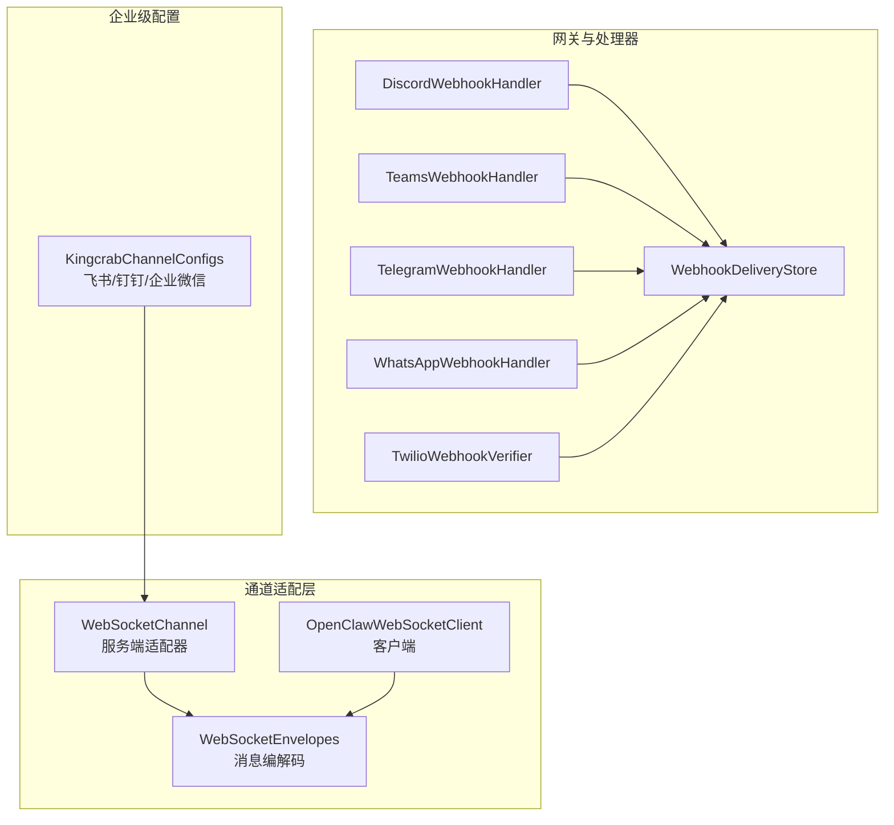
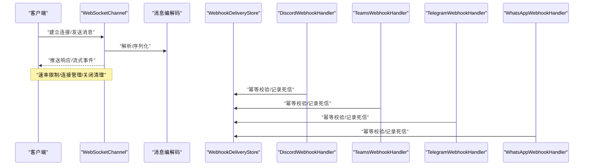
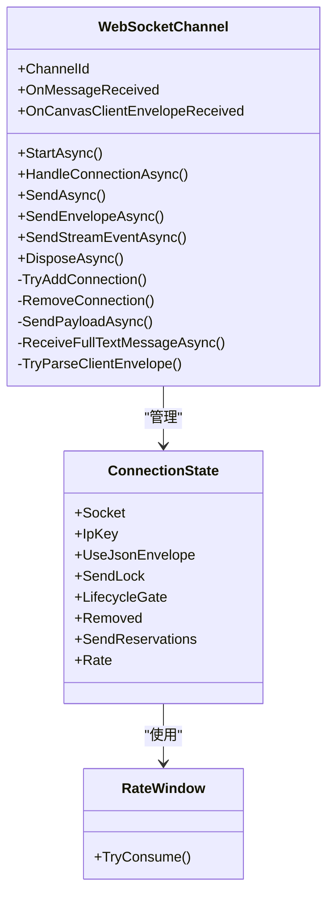
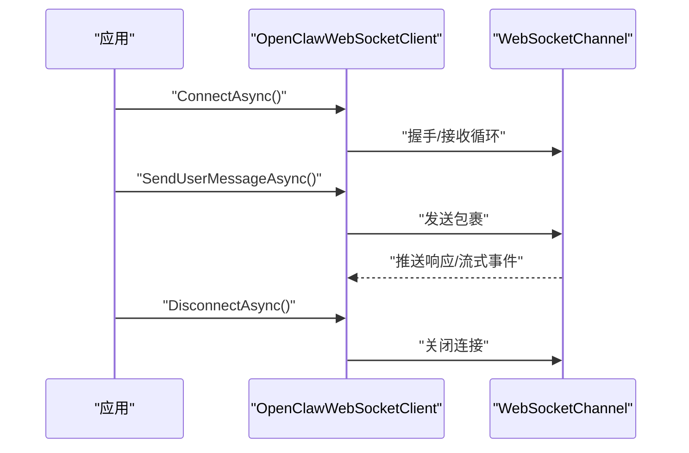
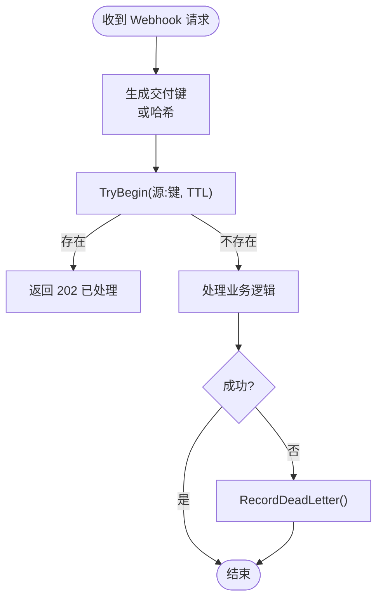
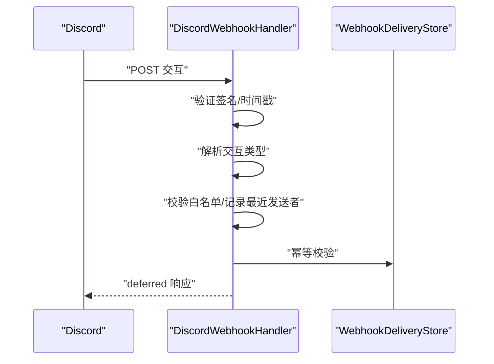
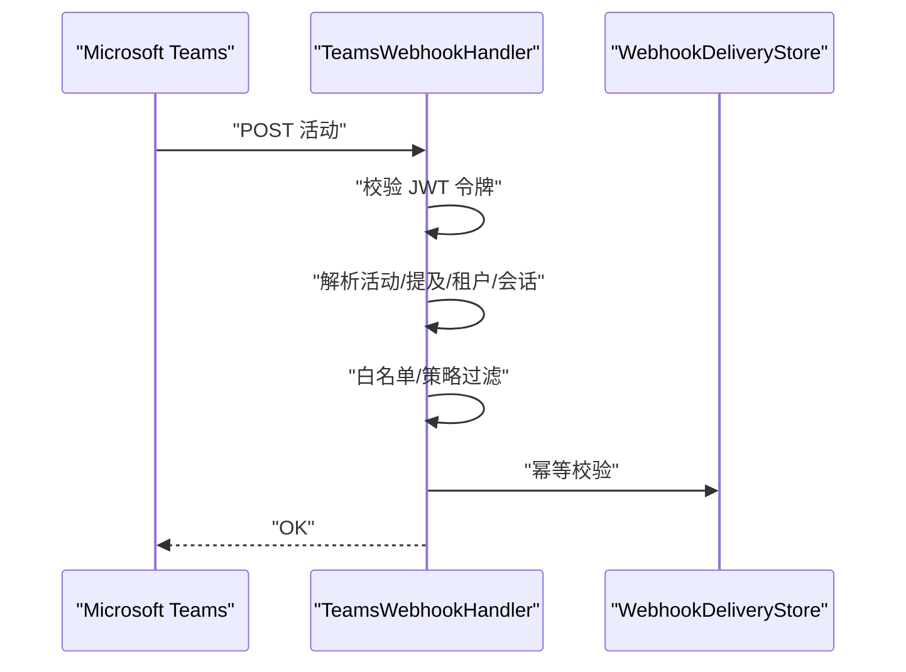
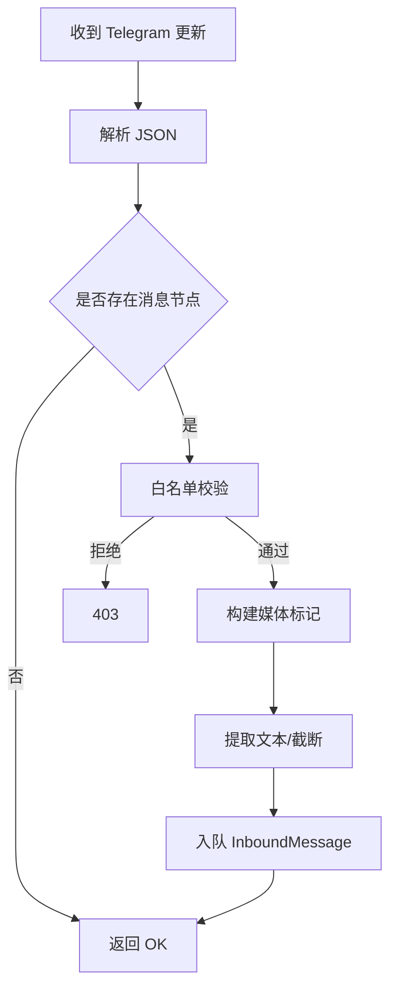
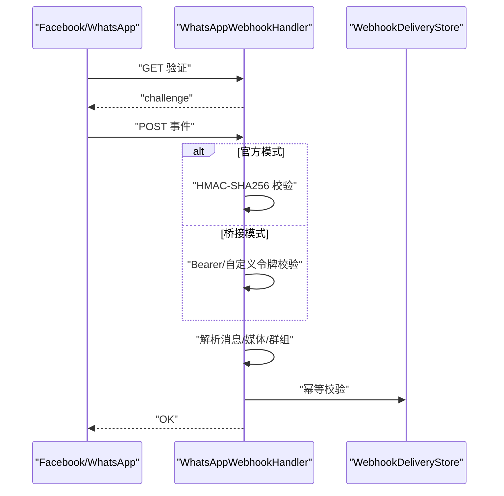
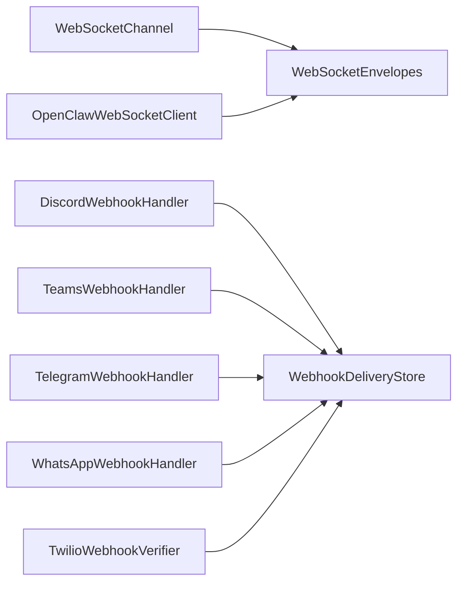

# WebSocket 和 Webhook

<cite>
**本文引用的文件**
- [WebSocketChannel.cs](file://src/OpenClaw.Channels/WebSocketChannel.cs)
- [OpenClawWebSocketClient.cs](file://src/OpenClaw.Client/OpenClawWebSocketClient.cs)
- [WebSocketEnvelopes.cs](file://src/OpenClaw.Core/Models/WebSocketEnvelopes.cs)
- [WebhookDeliveryStore.cs](file://src/OpenClaw.Gateway/WebhookDeliveryStore.cs)
- [DiscordWebhookHandler.cs](file://src/OpenClaw.Gateway/DiscordWebhookHandler.cs)
- [TeamsWebhookHandler.cs](file://src/OpenClaw.Gateway/TeamsWebhookHandler.cs)
- [TelegramWebhookHandler.cs](file://src/OpenClaw.Gateway/TelegramWebhookHandler.cs)
- [WhatsAppWebhookHandler.cs](file://src/OpenClaw.Gateway/WhatsAppWebhookHandler.cs)
- [TwilioWebhookVerifier.cs](file://src/OpenClaw.Gateway/TwilioWebhookVerifier.cs)
- [KingcrabChannelConfigs.cs](file://src/OpenClaw.Core/Models/KingcrabChannelConfigs.cs)
- [WebSocketChannelTests.cs](file://src/OpenClaw.Tests/WebSocketChannelTests.cs)
- [OpenClawWebSocketClientTests.cs](file://src/OpenClaw.Tests/OpenClawWebSocketClientTests.cs)
</cite>

## 目录
1. [简介](#简介)
2. [项目结构](#项目结构)
3. [核心组件](#核心组件)
4. [架构总览](#架构总览)
5. [详细组件分析](#详细组件分析)
6. [依赖关系分析](#依赖关系分析)
7. [性能考量](#性能考量)
8. [故障排查指南](#故障排查指南)
9. [结论](#结论)
10. [附录](#附录)

## 简介
本文件面向 WebSocket 与 Webhook 渠道集成，系统性阐述以下内容：
- 实时 WebSocket 连接管理、消息推送机制与连接状态维护
- Webhook 接收端的配置方法、签名验证与消息处理流程
- 钉钉、飞书、企业微信等企业级应用的集成方式
- 连接池管理、重连策略与负载均衡配置建议
- 安全验证、消息幂等性与错误恢复机制

## 项目结构
围绕 WebSocket 与 Webhook 的核心代码分布在如下模块：
- 通道适配层：WebSocketChannel（服务端）、OpenClawWebSocketClient（客户端）
- 模型层：WebSocketEnvelopes（消息编解码）
- 网关与 Webhook 处理器：Discord、Teams、Telegram、WhatsApp、Twilio 等
- 幂等与死信：WebhookDeliveryStore（去重、记录与回放）
- 企业级配置：KingcrabChannelConfigs（飞书、钉钉、企业微信）

图示来源
- [WebSocketChannel.cs:16-650](file://src/OpenClaw.Channels/WebSocketChannel.cs#L16-L650)
- [OpenClawWebSocketClient.cs:9-248](file://src/OpenClaw.Client/OpenClawWebSocketClient.cs#L9-L248)
- [WebSocketEnvelopes.cs:1-109](file://src/OpenClaw.Core/Models/WebSocketEnvelopes.cs#L1-L109)
- [DiscordWebhookHandler.cs:16-198](file://src/OpenClaw.Gateway/DiscordWebhookHandler.cs#L16-L198)
- [TeamsWebhookHandler.cs:15-272](file://src/OpenClaw.Gateway/TeamsWebhookHandler.cs#L15-L272)
- [TelegramWebhookHandler.cs:10-252](file://src/OpenClaw.Gateway/TelegramWebhookHandler.cs#L10-L252)
- [WhatsAppWebhookHandler.cs:10-370](file://src/OpenClaw.Gateway/WhatsAppWebhookHandler.cs#L10-L370)
- [TwilioWebhookVerifier.cs:6-40](file://src/OpenClaw.Gateway/TwilioWebhookVerifier.cs#L6-L40)
- [WebhookDeliveryStore.cs:9-183](file://src/OpenClaw.Gateway/WebhookDeliveryStore.cs#L9-L183)
- [KingcrabChannelConfigs.cs:1-126](file://src/OpenClaw.Core/Models/KingcrabChannelConfigs.cs#L1-L126)

章节来源
- [WebSocketChannel.cs:16-650](file://src/OpenClaw.Channels/WebSocketChannel.cs#L16-L650)
- [OpenClawWebSocketClient.cs:9-248](file://src/OpenClaw.Client/OpenClawWebSocketClient.cs#L9-L248)
- [WebSocketEnvelopes.cs:1-109](file://src/OpenClaw.Core/Models/WebSocketEnvelopes.cs#L1-L109)
- [DiscordWebhookHandler.cs:16-198](file://src/OpenClaw.Gateway/DiscordWebhookHandler.cs#L16-L198)
- [TeamsWebhookHandler.cs:15-272](file://src/OpenClaw.Gateway/TeamsWebhookHandler.cs#L15-L272)
- [TelegramWebhookHandler.cs:10-252](file://src/OpenClaw.Gateway/TelegramWebhookHandler.cs#L10-L252)
- [WhatsAppWebhookHandler.cs:10-370](file://src/OpenClaw.Gateway/WhatsAppWebhookHandler.cs#L10-L370)
- [TwilioWebhookVerifier.cs:6-40](file://src/OpenClaw.Gateway/TwilioWebhookVerifier.cs#L6-L40)
- [WebhookDeliveryStore.cs:9-183](file://src/OpenClaw.Gateway/WebhookDeliveryStore.cs#L9-L183)
- [KingcrabChannelConfigs.cs:1-126](file://src/OpenClaw.Core/Models/KingcrabChannelConfigs.cs#L1-L126)

## 核心组件
- WebSocketChannel（服务端）
  - 负责连接生命周期管理、速率限制、消息解析与路由、流式事件推送、连接关闭与清理
  - 支持 JSON 包裹与原始文本两种消息模式；对启用包裹模式的客户端支持流式事件
- OpenClawWebSocketClient（客户端）
  - 提供连接、断开、发送与接收循环；支持授权头、发送锁与异常回调
- WebSocketEnvelopes（消息编解码）
  - 定义客户端到服务端与服务端到客户端的消息结构，支持 A2UI 协议字段
- WebhookDeliveryStore（幂等与死信）
  - 维护已处理交付键、超时清理、死信记录、回放标记与丢弃标记
- 企业级 Webhook 处理器
  - Discord：Ed25519 签名校验、Ping/Pong、交互类型处理、白名单与最近发送者记录
  - Teams：JWT 令牌校验、活动解析、提及检测、租户与会话白名单、会话引用存储
  - Telegram：JSON 解析、媒体标记构建、发送者白名单、长度截断
  - WhatsApp：官方 Webhook（HMAC-SHA256）、桥接 Webhook（Bearer/自定义头）、多类型消息聚合
  - Twilio：HMAC-SHA1 签名计算与校验工具
- 企业级配置（飞书/钉钉/企业微信）
  - 提供 App/Secret/RobotCode/BotId 等凭证配置项与群组策略、媒体暴露开关等

章节来源
- [WebSocketChannel.cs:16-650](file://src/OpenClaw.Channels/WebSocketChannel.cs#L16-L650)
- [OpenClawWebSocketClient.cs:9-248](file://src/OpenClaw.Client/OpenClawWebSocketClient.cs#L9-L248)
- [WebSocketEnvelopes.cs:1-109](file://src/OpenClaw.Core/Models/WebSocketEnvelopes.cs#L1-L109)
- [WebhookDeliveryStore.cs:9-183](file://src/OpenClaw.Gateway/WebhookDeliveryStore.cs#L9-L183)
- [DiscordWebhookHandler.cs:16-198](file://src/OpenClaw.Gateway/DiscordWebhookHandler.cs#L16-L198)
- [TeamsWebhookHandler.cs:15-272](file://src/OpenClaw.Gateway/TeamsWebhookHandler.cs#L15-L272)
- [TelegramWebhookHandler.cs:10-252](file://src/OpenClaw.Gateway/TelegramWebhookHandler.cs#L10-L252)
- [WhatsAppWebhookHandler.cs:10-370](file://src/OpenClaw.Gateway/WhatsAppWebhookHandler.cs#L10-L370)
- [TwilioWebhookVerifier.cs:6-40](file://src/OpenClaw.Gateway/TwilioWebhookVerifier.cs#L6-L40)
- [KingcrabChannelConfigs.cs:1-126](file://src/OpenClaw.Core/Models/KingcrabChannelConfigs.cs#L1-L126)

## 架构总览
WebSocket 与 Webhook 的整体交互如下：

图示来源
- [WebSocketChannel.cs:76-151](file://src/OpenClaw.Channels/WebSocketChannel.cs#L76-L151)
- [WebSocketEnvelopes.cs:7-108](file://src/OpenClaw.Core/Models/WebSocketEnvelopes.cs#L7-L108)
- [WebhookDeliveryStore.cs:27-48](file://src/OpenClaw.Gateway/WebhookDeliveryStore.cs#L27-L48)
- [DiscordWebhookHandler.cs:52-158](file://src/OpenClaw.Gateway/DiscordWebhookHandler.cs#L52-L158)
- [TeamsWebhookHandler.cs:42-188](file://src/OpenClaw.Gateway/TeamsWebhookHandler.cs#L42-L188)
- [TelegramWebhookHandler.cs:47-103](file://src/OpenClaw.Gateway/TelegramWebhookHandler.cs#L47-L103)
- [WhatsAppWebhookHandler.cs:35-60](file://src/OpenClaw.Gateway/WhatsAppWebhookHandler.cs#L35-L60)

## 详细组件分析

### WebSocket 服务端：WebSocketChannel
- 连接管理
  - 使用并发字典维护连接，按 IP 维度统计连接数，支持最大连接数与每 IP 最大连接数限制
  - 生命周期内使用信号量与门控保护发送队列，避免并发写入与竞态
- 消息处理
  - 支持 JSON 包裹与原始文本；自动识别包裹类型并切换模式
  - 对 A2UI 事件/动作进行结构化文本构建，保持兼容
- 速率与安全
  - 每连接每分钟速率窗口控制；超限发送结构化错误并关闭连接
  - 接收超时自动关闭；消息大小限制防止内存压力
- 流式推送
  - 仅包裹模式客户端支持流式事件推送；提供工具级事件封装

图示来源
- [WebSocketChannel.cs:16-650](file://src/OpenClaw.Channels/WebSocketChannel.cs#L16-L650)

章节来源
- [WebSocketChannel.cs:16-650](file://src/OpenClaw.Channels/WebSocketChannel.cs#L16-L650)
- [WebSocketChannelTests.cs:92-466](file://src/OpenClaw.Tests/WebSocketChannelTests.cs#L92-L466)

### WebSocket 客户端：OpenClawWebSocketClient
- 连接与断开
  - 支持设置 Authorization Bearer 头；断开时等待在途发送完成
- 发送与接收
  - 发送加锁保证顺序；接收循环组装分片消息；解析包裹并触发回调
- 错误处理
  - 回调异常捕获并上报，不中断接收循环

图示来源
- [OpenClawWebSocketClient.cs:38-227](file://src/OpenClaw.Client/OpenClawWebSocketClient.cs#L38-L227)
- [WebSocketChannel.cs:153-183](file://src/OpenClaw.Channels/WebSocketChannel.cs#L153-L183)

章节来源
- [OpenClawWebSocketClient.cs:9-248](file://src/OpenClaw.Client/OpenClawWebSocketClient.cs#L9-L248)
- [OpenClawWebSocketClientTests.cs:8-57](file://src/OpenClaw.Tests/OpenClawWebSocketClientTests.cs#L8-L57)

### Webhook 幂等与死信：WebhookDeliveryStore
- 幂等
  - 基于源与交付键的 TTL 存储，重复请求直接返回已处理
- 死信
  - 将失败或异常的记录落盘，支持列表、查询、回放与丢弃标记
- 文件编码
  - 死信文件名采用 Base64 编码与安全字符替换

图示来源
- [WebhookDeliveryStore.cs:27-183](file://src/OpenClaw.Gateway/WebhookDeliveryStore.cs#L27-L183)

章节来源
- [WebhookDeliveryStore.cs:9-183](file://src/OpenClaw.Gateway/WebhookDeliveryStore.cs#L9-L183)

### Discord Webhook：签名验证与交互处理
- 签名验证
  - Ed25519 公钥校验，时间戳窗口防重放
- 交互类型
  - Ping/Pong、应用命令；提取用户、频道、选项文本
- 白名单与最近发送者
  - 基于配置的服务器/频道/用户白名单；记录最近发送者

图示来源
- [DiscordWebhookHandler.cs:52-158](file://src/OpenClaw.Gateway/DiscordWebhookHandler.cs#L52-L158)
- [WebhookDeliveryStore.cs:27-48](file://src/OpenClaw.Gateway/WebhookDeliveryStore.cs#L27-L48)

章节来源
- [DiscordWebhookHandler.cs:16-198](file://src/OpenClaw.Gateway/DiscordWebhookHandler.cs#L16-L198)

### Teams Webhook：JWT 校验与活动解析
- 令牌校验
  - Bot Framework JWT 校验，支持可插拔验证器
- 活动解析
  - 仅处理 message 类型；提及检测、租户白名单、会话引用存储
- 策略控制
  - 群组策略（禁用/白名单），会话 ID 与会话引用持久化

图示来源
- [TeamsWebhookHandler.cs:42-188](file://src/OpenClaw.Gateway/TeamsWebhookHandler.cs#L42-L188)
- [WebhookDeliveryStore.cs:27-48](file://src/OpenClaw.Gateway/WebhookDeliveryStore.cs#L27-L48)

章节来源
- [TeamsWebhookHandler.cs:15-272](file://src/OpenClaw.Gateway/TeamsWebhookHandler.cs#L15-L272)

### Telegram Webhook：消息解析与媒体标记
- 解析与过滤
  - 解析 message/channel_post 等多种更新；提取聊天与发送者信息
- 媒体标记
  - 图片/视频/音频/文档/贴纸等构建统一媒体标记
- 白名单与长度控制
  - 发送者白名单；文本长度截断

图示来源
- [TelegramWebhookHandler.cs:47-103](file://src/OpenClaw.Gateway/TelegramWebhookHandler.cs#L47-L103)

章节来源
- [TelegramWebhookHandler.cs:10-252](file://src/OpenClaw.Gateway/TelegramWebhookHandler.cs#L10-L252)

### WhatsApp Webhook：官方与桥接模式
- 官方 Webhook
  - HMAC-SHA256 签名校验；解析变更与消息；发送者白名单；文本截断
- 桥接 Webhook
  - Bearer 或自定义头令牌校验；支持附件与媒体聚合；群组/提及信息透传
- 验证流程
  - GET 验证（verify_token）；POST 解析与校验

图示来源
- [WhatsAppWebhookHandler.cs:35-60](file://src/OpenClaw.Gateway/WhatsAppWebhookHandler.cs#L35-L60)
- [WhatsAppWebhookHandler.cs:80-167](file://src/OpenClaw.Gateway/WhatsAppWebhookHandler.cs#L80-L167)
- [WhatsAppWebhookHandler.cs:169-238](file://src/OpenClaw.Gateway/WhatsAppWebhookHandler.cs#L169-L238)
- [WebhookDeliveryStore.cs:27-48](file://src/OpenClaw.Gateway/WebhookDeliveryStore.cs#L27-L48)

章节来源
- [WhatsAppWebhookHandler.cs:10-370](file://src/OpenClaw.Gateway/WhatsAppWebhookHandler.cs#L10-L370)

### Twilio Webhook：HMAC-SHA1 签名校验
- 签名计算
  - 按参数名排序拼接 URL 与参数，HMAC-SHA1 计算签名
- 校验
  - 固定时间比较，避免时序攻击

章节来源
- [TwilioWebhookVerifier.cs:6-40](file://src/OpenClaw.Gateway/TwilioWebhookVerifier.cs#L6-L40)

### 企业级应用集成要点（飞书/钉钉/企业微信）
- 飞书（Feishu）
  - WebSocket 长连接；支持群组策略、@提醒、媒体 URL 暴露
- 钉钉（DingTalk）
  - 机器人配置（AppKey/AppSecret/RobotCode）；群组策略、@提醒、流式轮询间隔
- 企业微信（WeCom）
  - 智能机器人长连接凭证 + 自建应用 REST API 凭证；群组策略、@提醒

章节来源
- [KingcrabChannelConfigs.cs:8-126](file://src/OpenClaw.Core/Models/KingcrabChannelConfigs.cs#L8-L126)

## 依赖关系分析
- 组件耦合
  - WebSocketChannel 与 OpenClawWebSocketClient 通过 WebSocketEnvelopes 解耦消息协议
  - 各 Webhook 处理器依赖配置与安全工具（签名/令牌），并通过 WebhookDeliveryStore 实现幂等
- 外部依赖
  - Discord（Ed25519）、Teams（Bot Framework）、Twilio（HMAC-SHA1）、WhatsApp（HMAC-SHA256）
- 可能的循环依赖
  - 当前模块间为单向依赖，未见循环

图示来源
- [WebSocketChannel.cs:16-650](file://src/OpenClaw.Channels/WebSocketChannel.cs#L16-L650)
- [OpenClawWebSocketClient.cs:9-248](file://src/OpenClaw.Client/OpenClawWebSocketClient.cs#L9-L248)
- [WebSocketEnvelopes.cs:1-109](file://src/OpenClaw.Core/Models/WebSocketEnvelopes.cs#L1-L109)
- [DiscordWebhookHandler.cs:16-198](file://src/OpenClaw.Gateway/DiscordWebhookHandler.cs#L16-L198)
- [TeamsWebhookHandler.cs:15-272](file://src/OpenClaw.Gateway/TeamsWebhookHandler.cs#L15-L272)
- [TelegramWebhookHandler.cs:10-252](file://src/OpenClaw.Gateway/TelegramWebhookHandler.cs#L10-L252)
- [WhatsAppWebhookHandler.cs:10-370](file://src/OpenClaw.Gateway/WhatsAppWebhookHandler.cs#L10-L370)
- [TwilioWebhookVerifier.cs:6-40](file://src/OpenClaw.Gateway/TwilioWebhookVerifier.cs#L6-L40)
- [WebhookDeliveryStore.cs:9-183](file://src/OpenClaw.Gateway/WebhookDeliveryStore.cs#L9-L183)

## 性能考量
- 连接与发送
  - 使用并发字典与信号量控制发送；生命周期门控避免竞态
  - 分片接收使用数组池减少 GC 压力；消息大小限制防止内存膨胀
- 速率限制
  - 每连接每分钟滑动窗口计数，超限快速失败并通知
- 序列化与解析
  - 采用系统内置 JSON 上下文，减少反射开销
- 幂等与死信
  - 内存中维护 TTL 键集合，降低磁盘 IO；死信文件按需读取

## 故障排查指南
- WebSocket
  - 连接被拒：检查最大连接数与每 IP 限额；确认客户端是否使用包裹模式
  - 超速关闭：调整速率限制或客户端退让；查看服务端日志中的“Rate limit exceeded”
  - 接收超时：增大接收超时或优化网络；确认客户端心跳与保活
- Webhook
  - 幂等重复：确认交付键生成逻辑与去重 TTL；必要时回放或丢弃
  - 签名失败：核对密钥/令牌配置；检查时间戳窗口（Discord）或算法一致性
  - 企业应用
    - 飞书/钉钉/企业微信：核对 App/Secret/RobotCode/BotId 等凭证；检查群组策略与 @提醒设置

章节来源
- [WebSocketChannel.cs:383-433](file://src/OpenClaw.Channels/WebSocketChannel.cs#L383-L433)
- [WebhookDeliveryStore.cs:27-48](file://src/OpenClaw.Gateway/WebhookDeliveryStore.cs#L27-L48)
- [DiscordWebhookHandler.cs:165-196](file://src/OpenClaw.Gateway/DiscordWebhookHandler.cs#L165-L196)
- [TeamsWebhookHandler.cs:64-72](file://src/OpenClaw.Gateway/TeamsWebhookHandler.cs#L64-L72)
- [KingcrabChannelConfigs.cs:8-126](file://src/OpenClaw.Core/Models/KingcrabChannelConfigs.cs#L8-L126)

## 结论
本方案通过 WebSocketChannel 与 OpenClawWebSocketClient 提供稳定可靠的实时通信能力，结合各平台 Webhook 处理器与签名验证机制，形成从连接到消息处理的完整闭环。配合 WebhookDeliveryStore 的幂等与死信能力，以及企业级配置的灵活策略，满足生产环境的安全、可靠与可运维要求。

## 附录
- 配置要点提示
  - WebSocket：最大连接数、每 IP 限额、每连接速率、接收超时、消息大小限制
  - Webhook：签名/令牌开关、密钥/令牌引用、请求体大小限制、幂等 TTL
  - 企业应用：凭证引用、群组策略、媒体 URL 暴露、@提醒策略