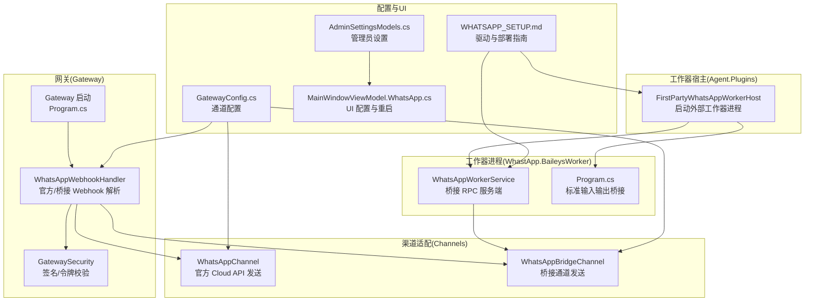
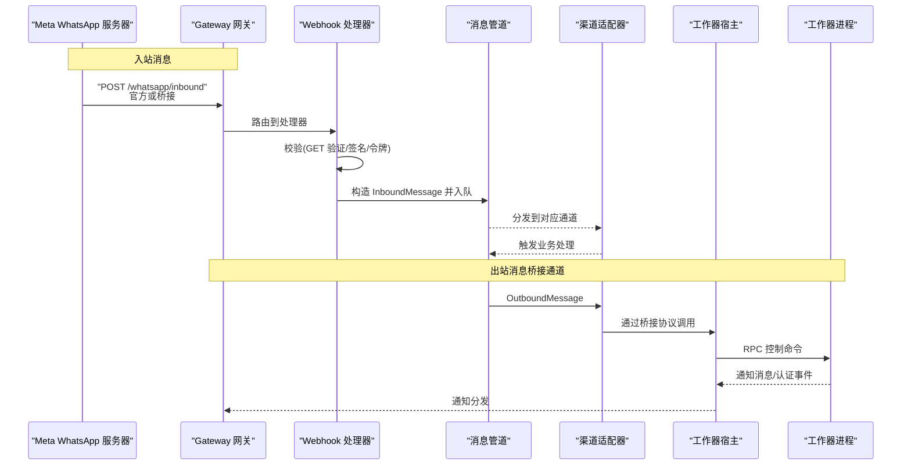
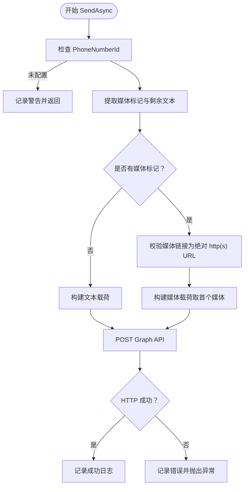
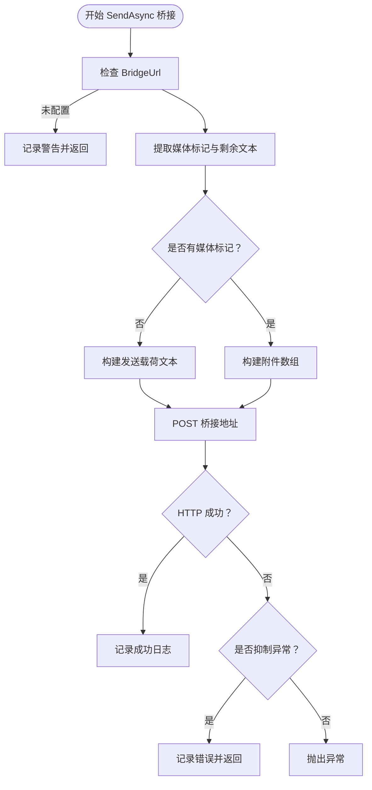
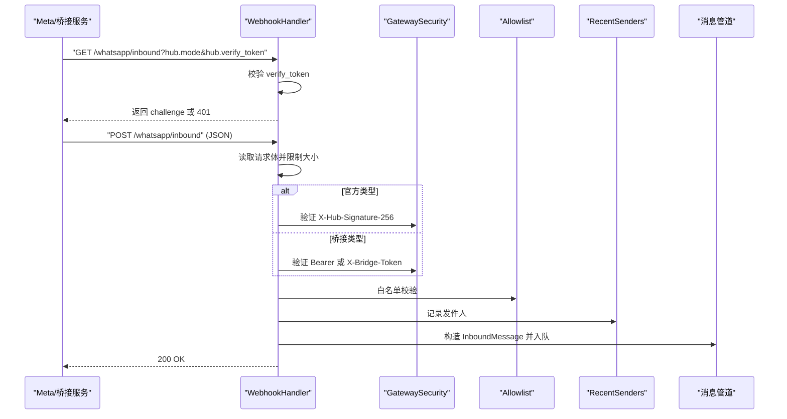
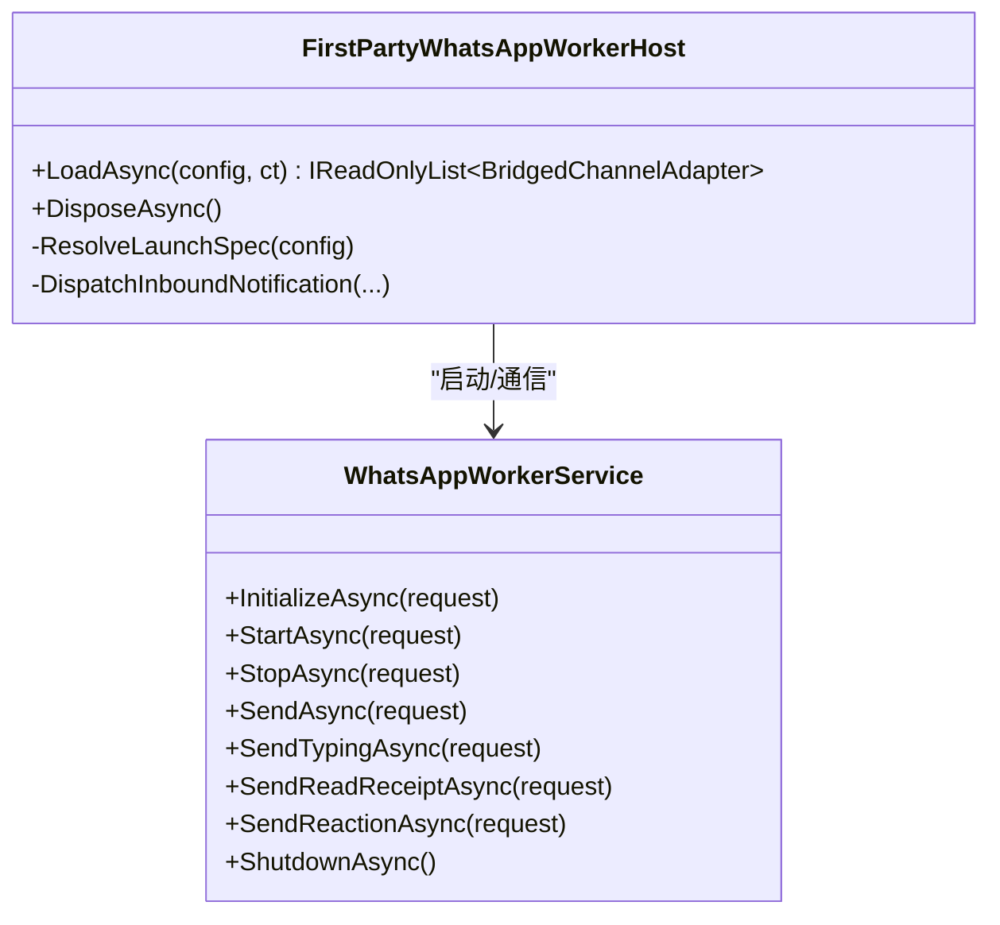
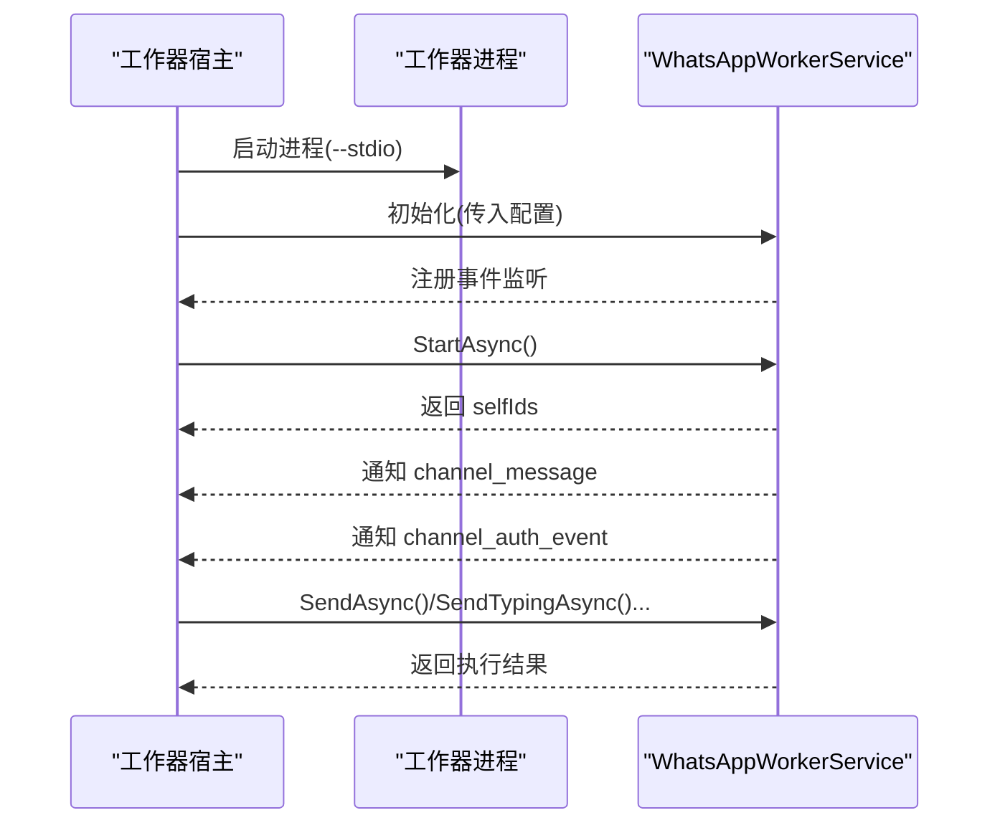
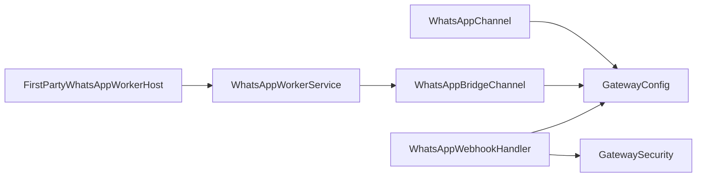

# WhatsApp 集成

<cite>
**本文引用的文件**
- [WhatsAppChannel.cs](file://src/OpenClaw.Channels/WhatsAppChannel.cs)
- [WhatsAppBridgeChannel.cs](file://src/OpenClaw.Channels/WhatsAppBridgeChannel.cs)
- [WhatsAppWorkerService.cs](file://src/OpenClaw.WhatsApp.BaileysWorker/WhatsAppWorkerService.cs)
- [Program.cs](file://src/OpenClaw.WhatsApp.BaileysWorker/Program.cs)
- [WhatsAppWebhookHandler.cs](file://src/OpenClaw.Gateway/WhatsAppWebhookHandler.cs)
- [GatewaySecurity.cs](file://src/OpenClaw.Gateway/GatewaySecurity.cs)
- [FirstPartyWhatsAppWorkerHost.cs](file://src/OpenClaw.Agent/Plugins/FirstPartyWhatsAppWorkerHost.cs)
- [Program.cs](file://src/OpenClaw.Gateway/Program.cs)
- [WHATSAPP_SETUP.md](file://docs/WHATSAPP_SETUP.md)
- [GatewayConfig.cs](file://src/OpenClaw.Core/Models/GatewayConfig.cs)
- [AdminSettingsModels.cs](file://src/OpenClaw.Core/Models/AdminSettingsModels.cs)
- [MainWindowViewModel.WhatsApp.cs](file://src/OpenClaw.Companion/ViewModels/MainWindowViewModel.WhatsApp.cs)
</cite>

## 目录
1. [简介](#简介)
2. [项目结构](#项目结构)
3. [核心组件](#核心组件)
4. [架构总览](#架构总览)
5. [详细组件分析](#详细组件分析)
6. [依赖关系分析](#依赖关系分析)
7. [性能考虑](#性能考虑)
8. [故障排查指南](#故障排查指南)
9. [结论](#结论)
10. [附录](#附录)

## 简介
本文件面向在 OpenClaw 平台上集成 WhatsApp 渠道的工程团队，系统性阐述以下内容：
- WhatsApp 渠道的两种接入路径：官方 Business API 与桥接通道（如 whatsmeow 代理）
- Baileys Worker 的工作机制与桥接协议
- 官方 Webhook 的配置、签名验证与认证机制
- 部署步骤、环境变量与安全设置
- 消息收发示例、错误处理策略与性能优化建议
- 与 Baileys 库的集成方式与本地开发环境搭建

## 项目结构
围绕 WhatsApp 的相关模块主要分布在如下命名空间与项目中：
- 渠道适配层：OpenClaw.Channels（官方 Cloud API 与桥接通道）
- 网关入口与 Webhook 处理：OpenClaw.Gateway（官方 Webhook 校验、桥接校验、入站消息注入）
- 第三方工作器宿主：OpenClaw.Agent.Plugins（启动 Baileys/whatsmeow 工作器进程，桥接通知）
- 工作器进程：OpenClaw.WhatsApp.BaileysWorker（桥接 RPC 服务端，负责消息与认证事件通知）
- 配置模型：OpenClaw.Core.Models（通道配置、管理员设置、工作器配置）
- 文档：docs/WHATSAPP_SETUP.md（驱动选择、安装与运维）

**图表来源**
- [Program.cs:89-96](file://src/OpenClaw.Gateway/Program.cs#L89-L96)
- [WhatsAppWebhookHandler.cs:35-60](file://src/OpenClaw.Gateway/WhatsAppWebhookHandler.cs#L35-L60)
- [GatewaySecurity.cs:13-49](file://src/OpenClaw.Gateway/GatewaySecurity.cs#L13-L49)
- [WhatsAppChannel.cs:40-70](file://src/OpenClaw.Channels/WhatsAppChannel.cs#L40-L70)
- [WhatsAppBridgeChannel.cs:39-94](file://src/OpenClaw.Channels/WhatsAppBridgeChannel.cs#L39-L94)
- [FirstPartyWhatsAppWorkerHost.cs:42-101](file://src/OpenClaw.Agent/Plugins/FirstPartyWhatsAppWorkerHost.cs#L42-L101)
- [WhatsAppWorkerService.cs:15-29](file://src/OpenClaw.WhatsApp.BaileysWorker/WhatsAppWorkerService.cs#L15-L29)
- [Program.cs:10-41](file://src/OpenClaw.WhatsApp.BaileysWorker/Program.cs#L10-L41)
- [GatewayConfig.cs:571-594](file://src/OpenClaw.Core/Models/GatewayConfig.cs#L571-L594)
- [AdminSettingsModels.cs:53-76](file://src/OpenClaw.Core/Models/AdminSettingsModels.cs#L53-L76)
- [WHATSAPP_SETUP.md:1-207](file://docs/WHATSAPP_SETUP.md#L1-L207)
- [MainWindowViewModel.WhatsApp.cs:126-194](file://src/OpenClaw.Companion/ViewModels/MainWindowViewModel.WhatsApp.cs#L126-L194)

**章节来源**
- [Program.cs:89-96](file://src/OpenClaw.Gateway/Program.cs#L89-L96)
- [WHATSAPP_SETUP.md:1-207](file://docs/WHATSAPP_SETUP.md#L1-L207)

## 核心组件
- 官方 Cloud API 渠道适配器：负责向 Meta Graph API 发送文本与媒体消息，并支持回复上下文消息。
- 桥接通道适配器：通过 HTTP POST 将消息与附件转发给桥接服务（如 whatsmeow），支持可选的 Bearer 令牌校验。
- 官方 Webhook 处理器：支持 GET 验证与 POST 入站消息解析；支持官方签名验证与桥接令牌校验。
- 第三方工作器宿主：根据配置选择 Baileys 或 whatsmeow 驱动，启动外部进程并通过桥接协议与工作器通信。
- 工作器服务：实现桥接 RPC 协议，负责消息与认证事件的通知、控制命令执行（启动/停止/发送/打字/已读/反应）。

**章节来源**
- [WhatsAppChannel.cs:14-83](file://src/OpenClaw.Channels/WhatsAppChannel.cs#L14-L83)
- [WhatsAppBridgeChannel.cs:15-107](file://src/OpenClaw.Channels/WhatsAppBridgeChannel.cs#L15-L107)
- [WhatsAppWebhookHandler.cs:10-60](file://src/OpenClaw.Gateway/WhatsAppWebhookHandler.cs#L10-L60)
- [FirstPartyWhatsAppWorkerHost.cs:13-40](file://src/OpenClaw.Agent/Plugins/FirstPartyWhatsAppWorkerHost.cs#L13-L40)
- [WhatsAppWorkerService.cs:7-29](file://src/OpenClaw.WhatsApp.BaileysWorker/WhatsAppWorkerService.cs#L7-L29)

## 架构总览
下图展示了从入站 Webhook 到出站消息发送的完整链路，以及工作器与网关之间的桥接交互。

**图表来源**
- [WhatsAppWebhookHandler.cs:35-60](file://src/OpenClaw.Gateway/WhatsAppWebhookHandler.cs#L35-L60)
- [WhatsAppBridgeChannel.cs:39-94](file://src/OpenClaw.Channels/WhatsAppBridgeChannel.cs#L39-L94)
- [FirstPartyWhatsAppWorkerHost.cs:42-101](file://src/OpenClaw.Agent/Plugins/FirstPartyWhatsAppWorkerHost.cs#L42-L101)
- [WhatsAppWorkerService.cs:31-77](file://src/OpenClaw.WhatsApp.BaileysWorker/WhatsAppWorkerService.cs#L31-L77)

## 详细组件分析

### 官方 Cloud API 渠道适配器（WhatsAppChannel）
- 功能要点
  - 通过 Graph API 发送文本与媒体消息，支持单附件（图片/视频/音频/文档/贴纸）
  - 支持回复上下文消息（ReplyToMessageId）
  - 基于 Bearer Token 认证
  - 使用媒体标记协议提取消息中的媒体标记，构建发送载荷
- 关键行为
  - 发送前校验 PhoneNumberId 是否配置
  - 对媒体链接进行绝对 URL 校验
  - 超过一个媒体时仅使用第一个，并记录警告
  - 文本为空且无媒体则直接返回
- 错误处理
  - HTTP 失败抛出异常并记录日志
  - 令牌缺失在构造函数阶段即抛出异常

**图表来源**
- [WhatsAppChannel.cs:40-70](file://src/OpenClaw.Channels/WhatsAppChannel.cs#L40-L70)
- [WhatsAppChannel.cs:85-138](file://src/OpenClaw.Channels/WhatsAppChannel.cs#L85-L138)
- [WhatsAppChannel.cs:140-169](file://src/OpenClaw.Channels/WhatsAppChannel.cs#L140-L169)

**章节来源**
- [WhatsAppChannel.cs:14-83](file://src/OpenClaw.Channels/WhatsAppChannel.cs#L14-L83)

### 桥接通道适配器（WhatsAppBridgeChannel）
- 功能要点
  - 通过 HTTP POST 将消息与附件发送至桥接服务
  - 可选 Bearer Token 校验
  - 支持多附件，映射媒体类型与可选的 MIME/文件名/动图播放等字段
- 关键行为
  - 发送前校验 BridgeUrl 是否配置
  - 将媒体标记转换为桥接附件数组
  - 可配置发送异常抑制（不抛出异常但记录日志）
- 错误处理
  - 请求失败记录错误；若启用抑制则返回，否则抛出异常

**图表来源**
- [WhatsAppBridgeChannel.cs:39-94](file://src/OpenClaw.Channels/WhatsAppBridgeChannel.cs#L39-L94)
- [WhatsAppBridgeChannel.cs:109-118](file://src/OpenClaw.Channels/WhatsAppBridgeChannel.cs#L109-L118)

**章节来源**
- [WhatsAppBridgeChannel.cs:15-107](file://src/OpenClaw.Channels/WhatsAppBridgeChannel.cs#L15-L107)

### 官方 Webhook 处理器（WhatsAppWebhookHandler）
- 功能要点
  - GET 验证：校验 hub.mode 与 hub.verify_token
  - POST 入站：解析官方/桥接格式，构建 InboundMessage
  - 官方签名验证：基于 X-Hub-Signature-256 与 App Secret
  - 桥接令牌校验：支持 Authorization Bearer 与 X-Bridge-Token
  - 白名单过滤：按配置的 AllowedFromIds 过滤发件人
  - 入站长度限制：超过 MaxInboundChars 截断
- 关键行为
  - 读取请求体并限制大小
  - 官方签名与桥接令牌任一通过即放行
  - 记录最近发件人信息

**图表来源**
- [WhatsAppWebhookHandler.cs:35-60](file://src/OpenClaw.Gateway/WhatsAppWebhookHandler.cs#L35-L60)
- [WhatsAppWebhookHandler.cs:80-167](file://src/OpenClaw.Gateway/WhatsAppWebhookHandler.cs#L80-L167)
- [WhatsAppWebhookHandler.cs:169-238](file://src/OpenClaw.Gateway/WhatsAppWebhookHandler.cs#L169-L238)
- [GatewaySecurity.cs:13-49](file://src/OpenClaw.Gateway/GatewaySecurity.cs#L13-L49)
- [GatewaySecurity.cs:59-76](file://src/OpenClaw.Gateway/GatewaySecurity.cs#L59-L76)

**章节来源**
- [WhatsAppWebhookHandler.cs:10-60](file://src/OpenClaw.Gateway/WhatsAppWebhookHandler.cs#L10-L60)
- [GatewaySecurity.cs:8-76](file://src/OpenClaw.Gateway/GatewaySecurity.cs#L8-L76)

### 第三方工作器宿主（FirstPartyWhatsAppWorkerHost）
- 功能要点
  - 根据 Driver 自动解析启动参数：baileys（Node.js）、whatsmeow（Go）、simulated（.NET）
  - 启动外部工作器进程并通过桥接协议通信
  - 将工作器发出的 channel_message 与 channel_auth_event 分发到对应通道
- 关键行为
  - 自动发现 Node.js/二进制/托管 DLL 并拼装启动参数
  - 加载失败时抛出明确异常（如缺少依赖、二进制不存在）
  - 通知任务并发处理并带超时保护

**图表来源**
- [FirstPartyWhatsAppWorkerHost.cs:42-101](file://src/OpenClaw.Agent/Plugins/FirstPartyWhatsAppWorkerHost.cs#L42-L101)
- [FirstPartyWhatsAppWorkerHost.cs:103-276](file://src/OpenClaw.Agent/Plugins/FirstPartyWhatsAppWorkerHost.cs#L103-L276)
- [WhatsAppWorkerService.cs:15-77](file://src/OpenClaw.WhatsApp.BaileysWorker/WhatsAppWorkerService.cs#L15-L77)

**章节来源**
- [FirstPartyWhatsAppWorkerHost.cs:13-40](file://src/OpenClaw.Agent/Plugins/FirstPartyWhatsAppWorkerHost.cs#L13-L40)
- [FirstPartyWhatsAppWorkerHost.cs:103-276](file://src/OpenClaw.Agent/Plugins/FirstPartyWhatsAppWorkerHost.cs#L103-L276)

### 工作器进程（WhatsAppWorkerService）
- 功能要点
  - 实现桥接 RPC 接口：初始化、启动/停止、发送、打字、已读、反应
  - 将入站消息与认证事件序列化为通知并通过标准输出发送
  - 提供调试接口（模拟入站、模拟认证事件、状态查询）
- 关键行为
  - 仅支持 Driver='simulated' 的内置测试引擎（其他驱动由宿主启动外部进程）
  - 严格校验通道 ID 与请求参数

**图表来源**
- [Program.cs:10-41](file://src/OpenClaw.WhatsApp.BaileysWorker/Program.cs#L10-L41)
- [WhatsAppWorkerService.cs:15-77](file://src/OpenClaw.WhatsApp.BaileysWorker/WhatsAppWorkerService.cs#L15-L77)
- [WhatsAppWorkerService.cs:101-152](file://src/OpenClaw.WhatsApp.BaileysWorker/WhatsAppWorkerService.cs#L101-L152)

**章节来源**
- [Program.cs:8-41](file://src/OpenClaw.WhatsApp.BaileysWorker/Program.cs#L8-L41)
- [WhatsAppWorkerService.cs:7-174](file://src/OpenClaw.WhatsApp.BaileysWorker/WhatsAppWorkerService.cs#L7-L174)

## 依赖关系分析
- 组件耦合
  - 渠道适配器依赖配置模型与安全工具（令牌/签名）
  - Webhook 处理器依赖白名单与最近发件人存储
  - 工作器宿主与工作器进程通过桥接协议解耦
- 外部依赖
  - 官方 Cloud API：Graph API v21.0
  - Baileys：Node.js 18+
  - whatsmeow：Go 1.21+ 或预编译二进制
- 潜在循环依赖
  - 无直接循环；桥接采用单向通知与 RPC 调用

**图表来源**
- [WhatsAppChannel.cs:16-31](file://src/OpenClaw.Channels/WhatsAppChannel.cs#L16-L31)
- [WhatsAppBridgeChannel.cs:17-30](file://src/OpenClaw.Channels/WhatsAppBridgeChannel.cs#L17-L30)
- [WhatsAppWebhookHandler.cs:15-33](file://src/OpenClaw.Gateway/WhatsAppWebhookHandler.cs#L15-L33)
- [GatewaySecurity.cs:8-49](file://src/OpenClaw.Gateway/GatewaySecurity.cs#L8-L49)
- [FirstPartyWhatsAppWorkerHost.cs:13-40](file://src/OpenClaw.Agent/Plugins/FirstPartyWhatsAppWorkerHost.cs#L13-L40)
- [WhatsAppWorkerService.cs:7-29](file://src/OpenClaw.WhatsApp.BaileysWorker/WhatsAppWorkerService.cs#L7-L29)

**章节来源**
- [GatewayConfig.cs:571-594](file://src/OpenClaw.Core/Models/GatewayConfig.cs#L571-L594)

## 性能考虑
- 入站请求体大小限制：避免过大负载导致内存压力
- 媒体下载与缓存：桥接模式下媒体由工作器下载并发送，需关注磁盘与网络带宽
- 并发通知处理：工作器宿主对通知任务进行并发处理并带超时保护
- 白名单与截断：减少无效消息处理与内存占用
- 建议
  - 合理设置 MaxRequestBytes 与 MaxInboundChars
  - 在生产环境优先选择 whatsmeow 驱动以降低资源消耗
  - 对外暴露 Webhook 时启用官方签名验证与桥接令牌校验

[本节为通用指导，无需特定文件引用]

## 故障排查指南
- 官方 Webhook
  - 验证失败：确认 verify_token 与 hub.verify_token 匹配
  - 签名验证失败：确认 App Secret 配置正确且请求头 X-Hub-Signature-256 存在
- 桥接 Webhook
  - 令牌缺失/无效：确认 Authorization Bearer 或 X-Bridge-Token 正确
- Cloud API 发送
  - 令牌缺失：检查 CloudApiToken/CloudApiTokenRef
  - PhoneNumberId 未配置：检查配置项
  - 媒体链接非绝对 http(s) URL：修正为公网可访问链接
- 工作器
  - 二进制/依赖缺失：运行脚本或手动安装 Node.js/Go 与依赖
  - 连接不稳定：检查网络、手机在线状态与代理设置
  - 会话失效：删除 SessionPath 后重新配对

**章节来源**
- [WhatsAppWebhookHandler.cs:62-78](file://src/OpenClaw.Gateway/WhatsAppWebhookHandler.cs#L62-L78)
- [WhatsAppWebhookHandler.cs:328-347](file://src/OpenClaw.Gateway/WhatsAppWebhookHandler.cs#L328-L347)
- [WhatsAppWebhookHandler.cs:349-368](file://src/OpenClaw.Gateway/WhatsAppWebhookHandler.cs#L349-L368)
- [WhatsAppChannel.cs:27-31](file://src/OpenClaw.Channels/WhatsAppChannel.cs#L27-L31)
- [WhatsAppChannel.cs:42-46](file://src/OpenClaw.Channels/WhatsAppChannel.cs#L42-L46)
- [WhatsAppChannel.cs:151-157](file://src/OpenClaw.Channels/WhatsAppChannel.cs#L151-L157)
- [WHATSAPP_SETUP.md:163-207](file://docs/WHATSAPP_SETUP.md#L163-L207)

## 结论
OpenClaw 提供了两条稳定的 WhatsApp 集成路径：官方 Cloud API 与桥接通道。前者适合合规的企业级场景，后者便于快速对接第三方桥接服务。结合工作器宿主与桥接协议，系统实现了高内聚、低耦合的消息桥接能力。通过严格的令牌与签名校验、入站白名单与长度限制，以及完善的错误处理与运维指引，可在生产环境中稳定运行。

[本节为总结，无需特定文件引用]

## 附录

### 配置与环境变量
- 通道配置（GatewayConfig.cs）
  - 官方 Cloud API：CloudApiToken/CloudApiTokenRef、PhoneNumberId、BusinessAccountId
  - 桥接通道：BridgeUrl、BridgeToken/BridgeTokenRef、BridgeSuppressSendExceptions
  - 通用：MaxInboundChars、MaxRequestBytes、AllowedFromIds
- 管理员设置（AdminSettingsModels.cs）
  - WhatsAppEnabled、WhatsAppValidateSignature、WhatsAppType、WhatsAppWebhookPath、WhatsAppWebhookPublicBaseUrl
  - Webhook 验证与签名：WebhookVerifyToken/WebhookVerifyTokenRef、WebhookAppSecret/WebhookAppSecretRef
  - Cloud API 令牌：CloudApiToken/CloudApiTokenRef
- 环境变量
  - 通过 env: 前缀引用（如 env:WHATSAPP_VERIFY_TOKEN、env:WHATSAPP_APP_SECRET、env:WHATSAPP_CLOUD_API_TOKEN、env:WHATSAPP_BRIDGE_TOKEN）

**章节来源**
- [GatewayConfig.cs:571-594](file://src/OpenClaw.Core/Models/GatewayConfig.cs#L571-L594)
- [AdminSettingsModels.cs:53-76](file://src/OpenClaw.Core/Models/AdminSettingsModels.cs#L53-L76)

### 部署与安全设置
- 驱动选择与安装
  - Baileys：Node.js 18+，执行 npm install
  - whatsmeow：Go 1.21+ 或预编译二进制
- Webhook 安全
  - 官方：启用 ValidateSignature，配置 WebhookAppSecret
  - 桥接：配置 BridgeToken/BridgeTokenRef，或使用 Authorization Bearer/X-Bridge-Token
- UI 配置与重启
  - 通过 Companion/Dashboard 页面加载/保存/重启 WhatsApp 设置

**章节来源**
- [WHATSAPP_SETUP.md:1-207](file://docs/WHATSAPP_SETUP.md#L1-L207)
- [MainWindowViewModel.WhatsApp.cs:126-194](file://src/OpenClaw.Companion/ViewModels/MainWindowViewModel.WhatsApp.cs#L126-L194)

### 本地开发环境搭建
- 安装依赖
  - Baileys：进入工作器目录执行 npm install
  - whatsmeow：编译生成二进制
- 运行工作器
  - 通过宿主自动解析路径启动，或显式设置 ExecutablePath
- 配置与启动网关
  - 在 appsettings 中配置通道参数，启动 Gateway

**章节来源**
- [WHATSAPP_SETUP.md:13-31](file://docs/WHATSAPP_SETUP.md#L13-L31)
- [FirstPartyWhatsAppWorkerHost.cs:116-276](file://src/OpenClaw.Agent/Plugins/FirstPartyWhatsAppWorkerHost.cs#L116-L276)
- [Program.cs:48-98](file://src/OpenClaw.Gateway/Program.cs#L48-L98)