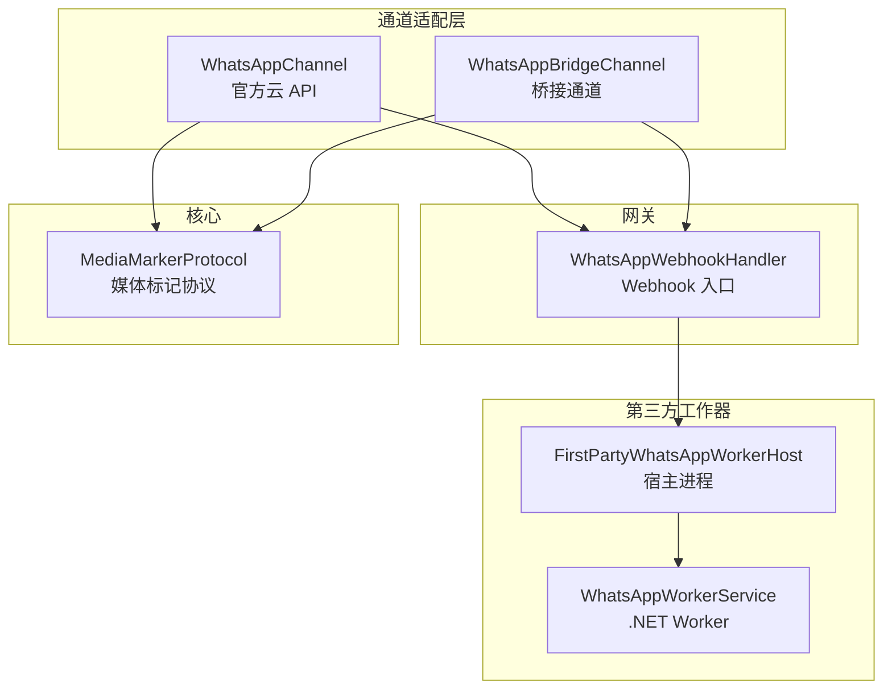
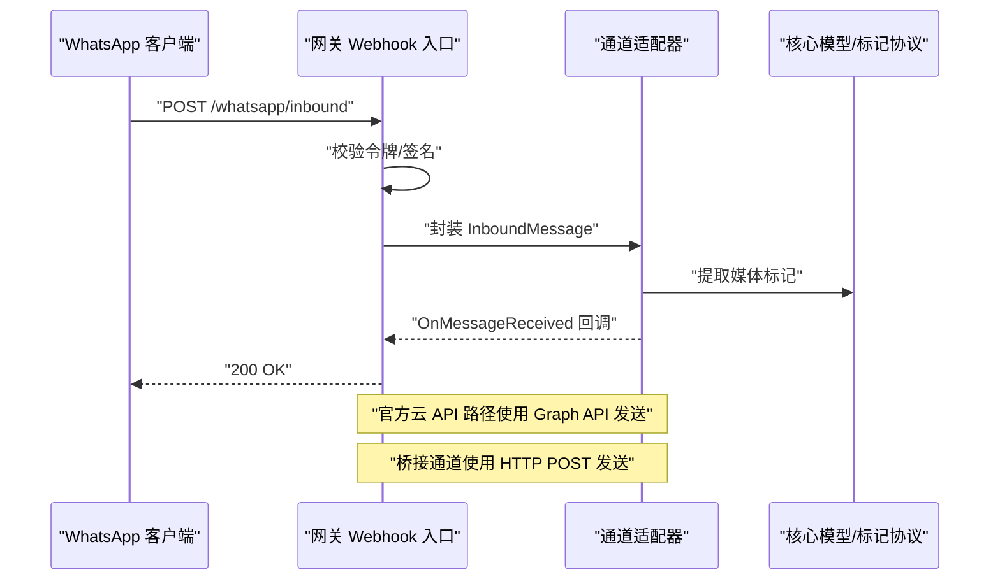
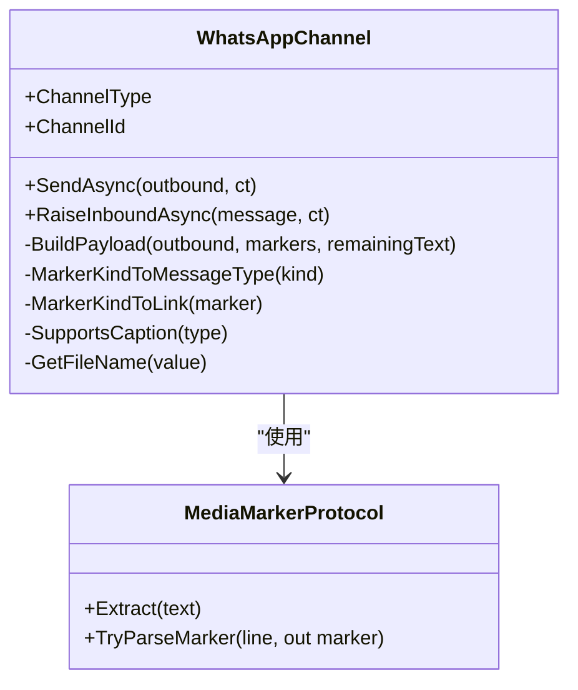
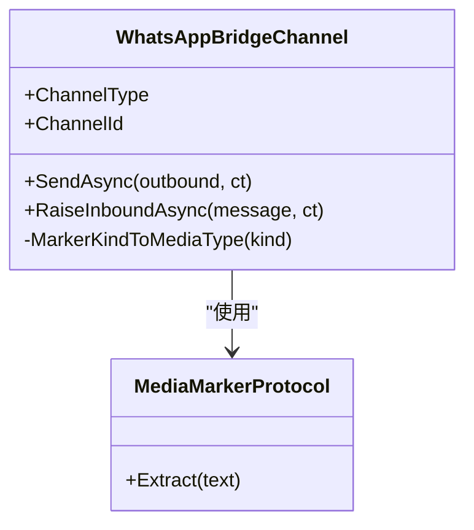
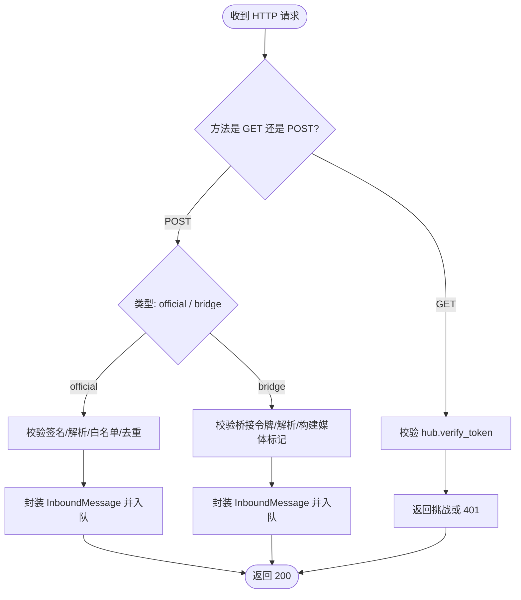
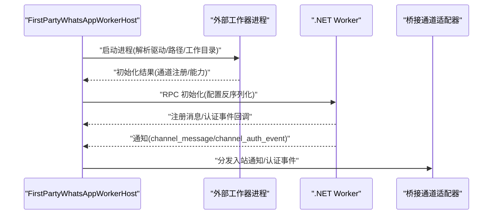
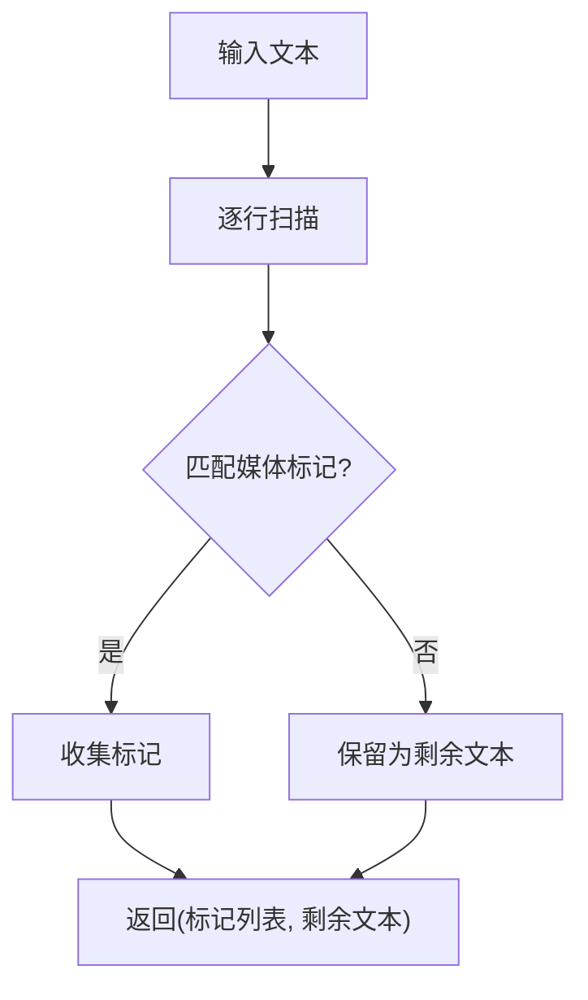
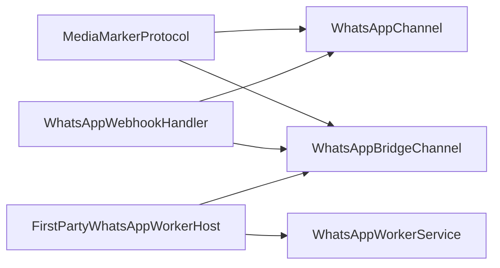

# WhatsApp 集成

<cite>
**本文引用的文件**
- [WhatsAppChannel.cs](file://src/OpenClaw.Channels/WhatsAppChannel.cs)
- [WhatsAppBridgeChannel.cs](file://src/OpenClaw.Channels/WhatsAppBridgeChannel.cs)
- [WhatsAppWorkerService.cs](file://src/OpenClaw.WhatsApp.BaileysWorker/WhatsAppWorkerService.cs)
- [FirstPartyWhatsAppWorkerHost.cs](file://src/OpenClaw.Agent/Plugins/FirstPartyWhatsAppWorkerHost.cs)
- [WhatsAppWebhookHandler.cs](file://src/OpenClaw.Gateway/WhatsAppWebhookHandler.cs)
- [WHATSAPP_SETUP.md](file://docs/WHATSAPP_SETUP.md)
- [MediaMarkers.cs](file://src/OpenClaw.Core/Models/MediaMarkers.cs)
- [AdminSettingsModels.cs](file://src/OpenClaw.Core/Models/AdminSettingsModels.cs)
- [OperatorApiModels.cs](file://src/OpenClaw.Core/Models/OperatorApiModels.cs)
- [TwilioSmsChannel.cs](file://src/OpenClaw.Channels/TwilioSmsChannel.cs)
- [TwilioWebhookVerifier.cs](file://src/OpenClaw.Gateway/TwilioWebhookVerifier.cs)
</cite>

## 目录
1. [简介](#简介)
2. [项目结构](#项目结构)
3. [核心组件](#核心组件)
4. [架构总览](#架构总览)
5. [详细组件分析](#详细组件分析)
6. [依赖关系分析](#依赖关系分析)
7. [性能考虑](#性能考虑)
8. [故障排除指南](#故障排除指南)
9. [结论](#结论)
10. [附录](#附录)

## 简介
本文件面向在 OpenClaw 平台上集成 WhatsApp 的工程师与运维人员，系统性阐述以下内容：
- WhatsAppChannel 与 WhatsAppBridgeChannel 的架构设计与实现要点
- WhatsApp Business API（官方云 API）与桥接通道（Bridge）两种接入路径
- 认证配置（QR/配对码）、Webhook 设置、消息模板与流媒体支持
- 消息处理流程（文本、媒体、位置、联系人等）
- Baileys Worker 的职责与与主网关的通信机制
- Twilio WhatsApp API 的配置参考（与本仓库现有实现的关系）
- 完整部署配置与故障排除方法

## 项目结构
围绕 WhatsApp 集成的关键模块分布于多个子项目中：
- 通道适配层：OpenClaw.Channels（官方云 API 与桥接通道）
- 网关入口：OpenClaw.Gateway（Webhook 处理器）
- 第三方工作器宿主：OpenClaw.Agent.Plugins（FirstPartyWorkerHost）
- 工作器进程：OpenClaw.WhatsApp.BaileysWorker（.NET Worker）
- 核心模型与标记协议：OpenClaw.Core（媒体标记协议等）

**图表来源**
- [WhatsAppChannel.cs:14-31](file://src/OpenClaw.Channels/WhatsAppChannel.cs#L14-L31)
- [WhatsAppBridgeChannel.cs:15-31](file://src/OpenClaw.Channels/WhatsAppBridgeChannel.cs#L15-L31)
- [WhatsAppWebhookHandler.cs:10-60](file://src/OpenClaw.Gateway/WhatsAppWebhookHandler.cs#L10-L60)
- [FirstPartyWhatsAppWorkerHost.cs:13-40](file://src/OpenClaw.Agent/Plugins/FirstPartyWhatsAppWorkerHost.cs#L13-L40)
- [WhatsAppWorkerService.cs:7-29](file://src/OpenClaw.WhatsApp.BaileysWorker/WhatsAppWorkerService.cs#L7-L29)
- [MediaMarkers.cs:22-47](file://src/OpenClaw.Core/Models/MediaMarkers.cs#L22-L47)

**章节来源**
- [WhatsAppChannel.cs:14-31](file://src/OpenClaw.Channels/WhatsAppChannel.cs#L14-L31)
- [WhatsAppBridgeChannel.cs:15-31](file://src/OpenClaw.Channels/WhatsAppBridgeChannel.cs#L15-L31)
- [WhatsAppWebhookHandler.cs:10-60](file://src/OpenClaw.Gateway/WhatsAppWebhookHandler.cs#L10-L60)
- [FirstPartyWhatsAppWorkerHost.cs:13-40](file://src/OpenClaw.Agent/Plugins/FirstPartyWhatsAppWorkerHost.cs#L13-L40)
- [WhatsAppWorkerService.cs:7-29](file://src/OpenClaw.WhatsApp.BaileysWorker/WhatsAppWorkerService.cs#L7-L29)
- [MediaMarkers.cs:22-47](file://src/OpenClaw.Core/Models/MediaMarkers.cs#L22-L47)

## 核心组件
- 官方云 API 通道（WhatsAppChannel）
  - 通过 Meta Graph API 发送文本与单媒体消息
  - 支持媒体类型：图片、视频、音频（语音）、文档、贴图
  - 基于令牌授权与请求体序列化
- 桥接通道（WhatsAppBridgeChannel）
  - 通过简单 HTTP POST 协议发送消息
  - 支持多附件与扩展字段（MIME 类型、文件名、GIF 回放等）
  - 可选抑制发送异常以保证稳定性
- Webhook 处理器（WhatsAppWebhookHandler）
  - 官方云 API：校验签名、解析入站消息、白名单过滤、去重记录
  - 桥接通道：校验桥接令牌、构建媒体标记、组装入站消息
- 第三方工作器宿主（FirstPartyWhatsAppWorkerHost）
  - 启动并管理外部工作器进程（Baileys/whatsmeow/simulated）
  - 通过桥接 RPC 将通知转发给网关
- .NET 工作器（WhatsAppWorkerService）
  - 实现桥接 RPC 接口，负责消息收发、打字、已读回执、反应等
  - 提供调试能力（模拟入站、触发认证事件）
- 媒体标记协议（MediaMarkerProtocol）
  - 在文本中提取媒体标记，支持多种媒体类型
  - 为官方云 API 与桥接通道提供统一的媒体表达

**章节来源**
- [WhatsAppChannel.cs:40-138](file://src/OpenClaw.Channels/WhatsAppChannel.cs#L40-L138)
- [WhatsAppBridgeChannel.cs:39-94](file://src/OpenClaw.Channels/WhatsAppBridgeChannel.cs#L39-L94)
- [WhatsAppWebhookHandler.cs:35-238](file://src/OpenClaw.Gateway/WhatsAppWebhookHandler.cs#L35-L238)
- [FirstPartyWhatsAppWorkerHost.cs:42-101](file://src/OpenClaw.Agent/Plugins/FirstPartyWhatsAppWorkerHost.cs#L42-L101)
- [WhatsAppWorkerService.cs:15-99](file://src/OpenClaw.WhatsApp.BaileysWorker/WhatsAppWorkerService.cs#L15-L99)
- [MediaMarkers.cs:22-163](file://src/OpenClaw.Core/Models/MediaMarkers.cs#L22-L163)

## 架构总览
下图展示从入站 Webhook 到出站消息发送的完整链路，涵盖官方云 API 与桥接通道两条路径。

**图表来源**
- [WhatsAppWebhookHandler.cs:35-167](file://src/OpenClaw.Gateway/WhatsAppWebhookHandler.cs#L35-L167)
- [WhatsAppChannel.cs:40-70](file://src/OpenClaw.Channels/WhatsAppChannel.cs#L40-L70)
- [WhatsAppBridgeChannel.cs:39-94](file://src/OpenClaw.Channels/WhatsAppBridgeChannel.cs#L39-L94)
- [MediaMarkers.cs:22-47](file://src/OpenClaw.Core/Models/MediaMarkers.cs#L22-L47)

## 详细组件分析

### 组件一：WhatsAppChannel（官方云 API）
- 角色定位
  - 对接 Meta WhatsApp Business API，发送文本与单媒体消息
- 关键实现
  - 令牌解析与校验（SecretResolver）
  - Payload 构造（类型选择、媒体对象、可选回复上下文）
  - HTTP 请求发送与日志记录
- 媒体支持
  - 图片、视频、音频（语音）、文档、贴图
  - 文档类型可附加文件名；部分类型支持标题
- 限制与约束
  - 单条消息仅支持一个媒体附件
  - 媒体链接必须为绝对 http(s) URL

**图表来源**
- [WhatsAppChannel.cs:14-31](file://src/OpenClaw.Channels/WhatsAppChannel.cs#L14-L31)
- [WhatsAppChannel.cs:85-138](file://src/OpenClaw.Channels/WhatsAppChannel.cs#L85-L138)
- [MediaMarkers.cs:22-47](file://src/OpenClaw.Core/Models/MediaMarkers.cs#L22-L47)

**章节来源**
- [WhatsAppChannel.cs:21-31](file://src/OpenClaw.Channels/WhatsAppChannel.cs#L21-L31)
- [WhatsAppChannel.cs:85-138](file://src/OpenClaw.Channels/WhatsAppChannel.cs#L85-L138)
- [MediaMarkers.cs:22-47](file://src/OpenClaw.Core/Models/MediaMarkers.cs#L22-L47)

### 组件二：WhatsAppBridgeChannel（桥接通道）
- 角色定位
  - 通过简单 HTTP 协议与桥接服务通信，发送文本与多附件消息
- 关键实现
  - 令牌鉴权（Bearer Token 或自定义 Header）
  - 附件数组映射（类型、URL、MIME、文件名、GIF 回放）
  - 异常抑制开关（BridgeSuppressSendExceptions）
- 媒体支持
  - 图片、视频、音频、文档、贴图
  - 支持多附件，按顺序发送

**图表来源**
- [WhatsAppBridgeChannel.cs:15-31](file://src/OpenClaw.Channels/WhatsAppBridgeChannel.cs#L15-L31)
- [WhatsAppBridgeChannel.cs:39-94](file://src/OpenClaw.Channels/WhatsAppBridgeChannel.cs#L39-L94)
- [MediaMarkers.cs:22-47](file://src/OpenClaw.Core/Models/MediaMarkers.cs#L22-L47)

**章节来源**
- [WhatsAppBridgeChannel.cs:22-31](file://src/OpenClaw.Channels/WhatsAppBridgeChannel.cs#L22-L31)
- [WhatsAppBridgeChannel.cs:39-94](file://src/OpenClaw.Channels/WhatsAppBridgeChannel.cs#L39-L94)
- [MediaMarkers.cs:22-47](file://src/OpenClaw.Core/Models/MediaMarkers.cs#L22-L47)

### 组件三：WhatsAppWebhookHandler（入站 Webhook）
- 官方云 API 路径
  - GET 验证：hub.mode/hub.verify_token
  - POST 解析：校验签名、解析变更、白名单过滤、去重记录、构造 InboundMessage
- 桥接通道路径
  - 校验桥接令牌（Header 或 Bearer），解析入站载荷
  - 构建媒体标记（IMAGE_URL/VIDEO_URL/AUDIO_URL/FILE_URL/STICKER_URL）
  - 组装 InboundMessage（含群组、提及、媒体信息等）

**图表来源**
- [WhatsAppWebhookHandler.cs:35-60](file://src/OpenClaw.Gateway/WhatsAppWebhookHandler.cs#L35-L60)
- [WhatsAppWebhookHandler.cs:80-167](file://src/OpenClaw.Gateway/WhatsAppWebhookHandler.cs#L80-L167)
- [WhatsAppWebhookHandler.cs:169-238](file://src/OpenClaw.Gateway/WhatsAppWebhookHandler.cs#L169-L238)

**章节来源**
- [WhatsAppWebhookHandler.cs:35-60](file://src/OpenClaw.Gateway/WhatsAppWebhookHandler.cs#L35-L60)
- [WhatsAppWebhookHandler.cs:80-167](file://src/OpenClaw.Gateway/WhatsAppWebhookHandler.cs#L80-L167)
- [WhatsAppWebhookHandler.cs:169-238](file://src/OpenClaw.Gateway/WhatsAppWebhookHandler.cs#L169-L238)

### 组件四：FirstPartyWhatsAppWorkerHost 与 WhatsAppWorkerService（工作器）
- FirstPartyWhatsAppWorkerHost
  - 依据驱动类型（baileys/whatsmeow/simulated）解析启动参数
  - 启动外部进程并通过桥接 RPC 传递通知
  - 将通知分发到对应的桥接通道适配器
- WhatsAppWorkerService（.NET Worker）
  - 实现桥接 RPC 接口（初始化、启动/停止、发送、打字、已读回执、反应）
  - 将入站消息与认证事件转换为通知并上报
  - 提供调试接口（模拟入站、触发认证事件）

**图表来源**
- [FirstPartyWhatsAppWorkerHost.cs:42-101](file://src/OpenClaw.Agent/Plugins/FirstPartyWhatsAppWorkerHost.cs#L42-L101)
- [FirstPartyWhatsAppWorkerHost.cs:103-276](file://src/OpenClaw.Agent/Plugins/FirstPartyWhatsAppWorkerHost.cs#L103-L276)
- [WhatsAppWorkerService.cs:15-99](file://src/OpenClaw.WhatsApp.BaileysWorker/WhatsAppWorkerService.cs#L15-L99)
- [WhatsAppWorkerService.cs:101-152](file://src/OpenClaw.WhatsApp.BaileysWorker/WhatsAppWorkerService.cs#L101-L152)

**章节来源**
- [FirstPartyWhatsAppWorkerHost.cs:42-101](file://src/OpenClaw.Agent/Plugins/FirstPartyWhatsAppWorkerHost.cs#L42-L101)
- [FirstPartyWhatsAppWorkerHost.cs:103-276](file://src/OpenClaw.Agent/Plugins/FirstPartyWhatsAppWorkerHost.cs#L103-L276)
- [WhatsAppWorkerService.cs:15-99](file://src/OpenClaw.WhatsApp.BaileysWorker/WhatsAppWorkerService.cs#L15-L99)
- [WhatsAppWorkerService.cs:101-152](file://src/OpenClaw.WhatsApp.BaileysWorker/WhatsAppWorkerService.cs#L101-L152)

### 组件五：媒体标记协议（MediaMarkerProtocol）
- 功能
  - 从文本中提取媒体标记（如 [IMAGE_URL:...]、[FILE_URL:...] 等）
  - 返回标记列表与剩余文本
- 用途
  - 官方云 API：将标记转换为对应媒体类型与链接
  - 桥接通道：将标记转换为附件数组
- 支持类型
  - 图片、视频、音频、文档、贴图、Telegram 文件 ID 等

**图表来源**
- [MediaMarkers.cs:22-47](file://src/OpenClaw.Core/Models/MediaMarkers.cs#L22-L47)
- [MediaMarkers.cs:49-134](file://src/OpenClaw.Core/Models/MediaMarkers.cs#L49-L134)

**章节来源**
- [MediaMarkers.cs:22-47](file://src/OpenClaw.Core/Models/MediaMarkers.cs#L22-L47)
- [MediaMarkers.cs:49-134](file://src/OpenClaw.Core/Models/MediaMarkers.cs#L49-L134)

### 组件六：Twilio WhatsApp API 配置参考
- 本仓库未内置 Twilio WhatsApp 通道适配器
- 可参考 Twilio SMS 通道与 Webhook 验签逻辑进行对接
  - 通道适配器示例：TwilioSmsChannel
  - Webhook 验签工具：TwilioWebhookVerifier
- 建议做法
  - 自行实现 Twilio WhatsApp 通道适配器（IChannelAdapter）
  - 使用 TwilioWebhookVerifier 校验回调签名
  - 将入站消息封装为 InboundMessage 并入队处理

**章节来源**
- [TwilioSmsChannel.cs:8-59](file://src/OpenClaw.Channels/TwilioSmsChannel.cs#L8-L59)
- [TwilioWebhookVerifier.cs:6-40](file://src/OpenClaw.Gateway/TwilioWebhookVerifier.cs#L6-L40)

## 依赖关系分析
- 低耦合高内聚
  - 通道适配器仅关注自身协议（Graph API 或 HTTP POST）
  - Webhook 处理器专注于入站数据解析与安全校验
  - 工作器宿主与工作器通过桥接 RPC 解耦
- 关键依赖链
  - 通道适配器 → 媒体标记协议
  - Webhook 处理器 → 白名单/去重/安全校验
  - 工作器宿主 → 外部进程（Baileys/whatsmeow/simulated）
  - 工作器 → 网关桥接通道适配器

**图表来源**
- [MediaMarkers.cs:22-47](file://src/OpenClaw.Core/Models/MediaMarkers.cs#L22-L47)
- [WhatsAppChannel.cs:40-70](file://src/OpenClaw.Channels/WhatsAppChannel.cs#L40-L70)
- [WhatsAppBridgeChannel.cs:39-94](file://src/OpenClaw.Channels/WhatsAppBridgeChannel.cs#L39-L94)
- [WhatsAppWebhookHandler.cs:35-60](file://src/OpenClaw.Gateway/WhatsAppWebhookHandler.cs#L35-L60)
- [FirstPartyWhatsAppWorkerHost.cs:42-101](file://src/OpenClaw.Agent/Plugins/FirstPartyWhatsAppWorkerHost.cs#L42-L101)
- [WhatsAppWorkerService.cs:15-99](file://src/OpenClaw.WhatsApp.BaileysWorker/WhatsAppWorkerService.cs#L15-L99)

**章节来源**
- [MediaMarkers.cs:22-47](file://src/OpenClaw.Core/Models/MediaMarkers.cs#L22-L47)
- [WhatsAppChannel.cs:40-70](file://src/OpenClaw.Channels/WhatsAppChannel.cs#L40-L70)
- [WhatsAppBridgeChannel.cs:39-94](file://src/OpenClaw.Channels/WhatsAppBridgeChannel.cs#L39-L94)
- [WhatsAppWebhookHandler.cs:35-60](file://src/OpenClaw.Gateway/WhatsAppWebhookHandler.cs#L35-L60)
- [FirstPartyWhatsAppWorkerHost.cs:42-101](file://src/OpenClaw.Agent/Plugins/FirstPartyWhatsAppWorkerHost.cs#L42-L101)
- [WhatsAppWorkerService.cs:15-99](file://src/OpenClaw.WhatsApp.BaileysWorker/WhatsAppWorkerService.cs#L15-L99)

## 性能考虑
- 请求大小限制
  - Webhook 处理器对请求体大小进行限制，避免内存压力
- 媒体下载与缓存
  - 工作器负责媒体下载与缓存，建议合理设置缓存路径与历史同步策略
- 并发与异步
  - 通道适配器与 Webhook 处理器均采用异步 I/O，减少阻塞
- 日志与可观测性
  - 关键路径均有日志记录，便于定位性能瓶颈与错误

[本节为通用指导，无需特定文件来源]

## 故障排除指南
- 官方云 API
  - 令牌缺失：检查 CloudApiToken/CloudApiTokenRef 是否正确配置
  - PhoneNumberId 缺失：发送前会记录警告并跳过
  - 媒体链接不合法：必须为 http(s) 绝对 URL
- 桥接通道
  - BridgeUrl 缺失：发送前记录警告并跳过
  - BridgeToken 缺失：根据配置决定是否严格校验
  - 发送异常抑制：可通过 BridgeSuppressSendExceptions 控制
- Webhook
  - 官方云 API：开启签名验证需配置 AppSecret；GET 验证需 verify_token 匹配
  - 桥接通道：需配置桥接令牌或在 Header 中提供
- 工作器
  - 未找到工作器可执行文件：运行自动化脚本或手动安装依赖
  - Node.js/whatsmeow 依赖缺失：按文档安装运行时与依赖
  - 连接不稳定：检查网络、代理、手机端状态
  - 会话损坏：删除 SessionPath 后重新配对

**章节来源**
- [WhatsAppChannel.cs:42-46](file://src/OpenClaw.Channels/WhatsAppChannel.cs#L42-L46)
- [WhatsAppBridgeChannel.cs:41-45](file://src/OpenClaw.Channels/WhatsAppBridgeChannel.cs#L41-L45)
- [WhatsAppWebhookHandler.cs:62-78](file://src/OpenClaw.Gateway/WhatsAppWebhookHandler.cs#L62-L78)
- [WhatsAppWebhookHandler.cs:328-347](file://src/OpenClaw.Gateway/WhatsAppWebhookHandler.cs#L328-L347)
- [FirstPartyWhatsAppWorkerHost.cs:103-276](file://src/OpenClaw.Agent/Plugins/FirstPartyWhatsAppWorkerHost.cs#L103-L276)
- [WHATSAPP_SETUP.md:163-207](file://docs/WHATSAPP_SETUP.md#L163-L207)

## 结论
本集成方案提供了两条稳定的消息通路：
- 官方云 API：适合合规的企业级部署，功能完备但受平台限制
- 桥接通道：灵活易用，便于自建服务与二次开发
配合工作器宿主与桥接 RPC，可实现认证、消息收发、媒体处理与可观测性的完整闭环。建议根据部署环境与合规要求选择合适的接入路径，并结合文档完成配置与排障。

[本节为总结，无需特定文件来源]

## 附录

### A. 配置项概览（Admin/Operator）
- 通用
  - enable/disable、类型（official/bridge/first_party_worker）
  - webhook 路径、公共基础 URL、验证令牌与签名
- 官方云 API
  - 令牌、PhoneNumberId、BusinessAccountId
- 桥接通道
  - BridgeUrl、BridgeToken、BridgeSuppressSendExceptions
- 第三方工作器
  - Driver、ExecutablePath、WorkingDirectory、StoragePath、Accounts[]
  - 历史同步、代理、配对模式（QR/配对码）、设备名称等

**章节来源**
- [AdminSettingsModels.cs:53-76](file://src/OpenClaw.Core/Models/AdminSettingsModels.cs#L53-L76)
- [OperatorApiModels.cs:269-316](file://src/OpenClaw.Core/Models/OperatorApiModels.cs#L269-L316)
- [WHATSAPP_SETUP.md:32-88](file://docs/WHATSAPP_SETUP.md#L32-L88)

### B. 部署与启动步骤
- 自动化脚本
  - 运行脚本自动检测运行时、安装依赖、构建二进制
- 手动步骤
  - Baileys：进入目录执行依赖安装
  - whatsmeow：编译生成二进制
- 配置
  - 在 appsettings.json 中启用并填写相应字段
  - 通过管理界面或 API 保存配置并重启

**章节来源**
- [WHATSAPP_SETUP.md:13-31](file://docs/WHATSAPP_SETUP.md#L13-L31)
- [WHATSAPP_SETUP.md:32-57](file://docs/WHATSAPP_SETUP.md#L32-L57)