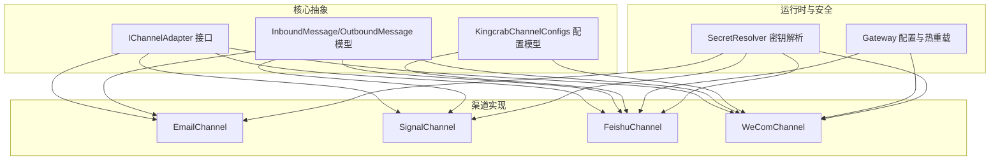
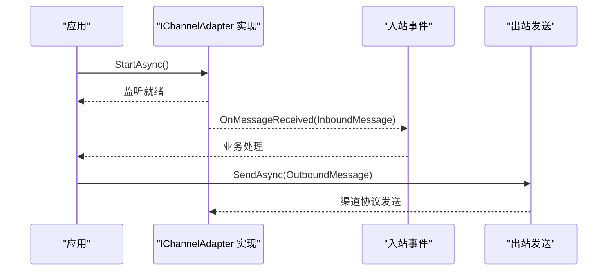
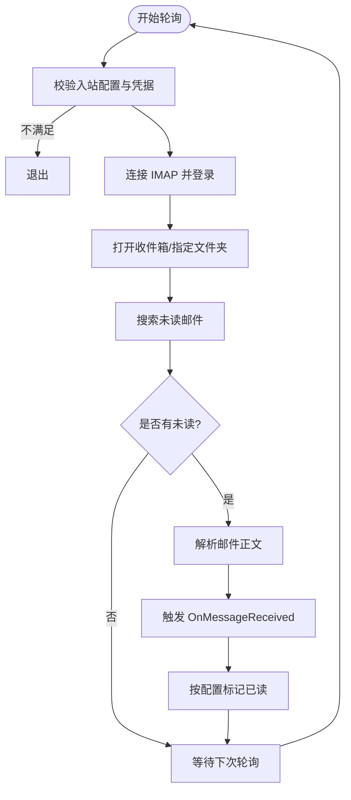
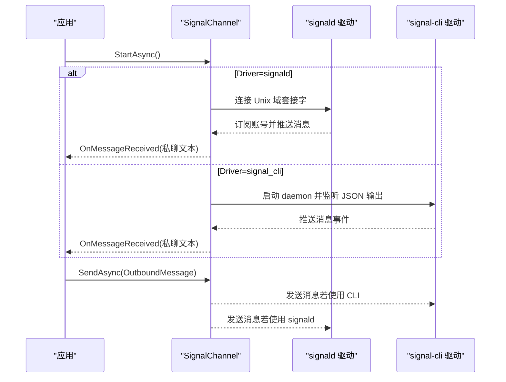
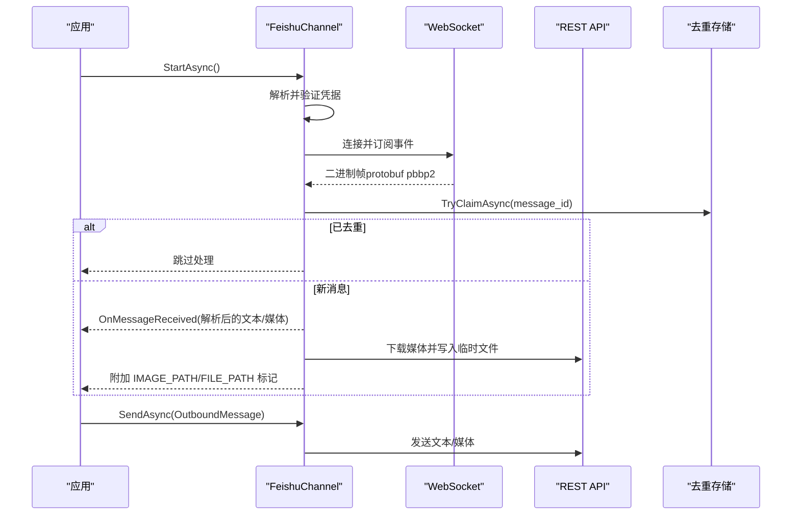
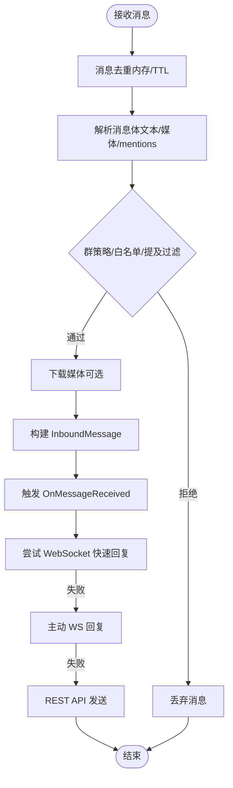
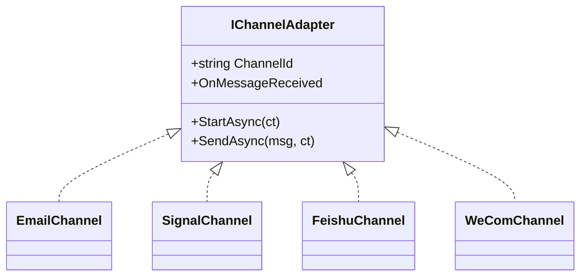

# 其他渠道集成

<cite>
**本文档引用的文件**
- [EmailChannel.cs](file://src/OpenClaw.Channels/EmailChannel.cs)
- [SignalChannel.cs](file://src/OpenClaw.Channels/SignalChannel.cs)
- [FeishuChannel.cs](file://src/OpenClaw.Channels/FeishuChannel.cs)
- [WeComChannel.cs](file://src/OpenClaw.Channels/WeComChannel.cs)
- [FeishuMessageDedup.cs](file://src/OpenClaw.Channels/FeishuMessageDedup.cs)
- [IChannelAdapter.cs](file://src/OpenClaw.Core/Abstractions/IChannelAdapter.cs)
- [Messages.cs](file://src/OpenClaw.Core/Models/Messages.cs)
- [KingcrabChannelConfigs.cs](file://src/OpenClaw.Core/Models/KingcrabChannelConfigs.cs)
- [appsettings.json](file://src/OpenClaw.Gateway/appsettings.json)
- [ChannelReadinessEvaluator.cs](file://src/OpenClaw.Gateway/ChannelReadinessEvaluator.cs)
- [ChannelConfigStore.cs](file://src/OpenClaw.Gateway/Channels/ChannelConfigStore.cs)
- [ChannelConfig.cs](file://src/OpenClaw.Dashboard/Models/ChannelConfig.cs)
</cite>

## 目录
1. [简介](#简介)
2. [项目结构](#项目结构)
3. [核心组件](#核心组件)
4. [架构总览](#架构总览)
5. [详细组件分析](#详细组件分析)
6. [依赖关系分析](#依赖关系分析)
7. [性能考量](#性能考量)
8. [故障排查指南](#故障排查指南)
9. [结论](#结论)
10. [附录](#附录)

## 简介
本文件面向需要在系统中集成多种通信渠道（邮件、Signal 即时通讯、飞书、企业微信）的工程师与运维人员，提供从实现原理、配置方法、消息格式、认证方式、API 限制到最佳实践的完整技术文档。文档同时给出统一的渠道配置模板、部署指南、渠道选择建议、性能对比与迁移策略，并解释渠道适配器的通用架构模式，帮助读者快速扩展新的通信渠道。

## 项目结构
- 渠道适配器位于 OpenClaw.Channels 命名空间下，每个渠道一个独立类，均实现 IChannelAdapter 接口。
- 渠道配置模型位于 OpenClaw.Core.Models 中，包含各渠道的配置类与消息模型。
- 渠道运行时配置与热重载能力由 Gateway 层提供，支持持久化与动态更新。
- 安全与密钥解析通过 SecretResolver 与环境变量/密钥引用机制完成。

图表来源
- [IChannelAdapter.cs:1-22](file://src/OpenClaw.Core/Abstractions/IChannelAdapter.cs#L1-L22)
- [Messages.cs:1-62](file://src/OpenClaw.Core/Models/Messages.cs#L1-L62)
- [KingcrabChannelConfigs.cs:1-126](file://src/OpenClaw.Core/Models/KingcrabChannelConfigs.cs#L1-L126)
- [EmailChannel.cs:1-192](file://src/OpenClaw.Channels/EmailChannel.cs#L1-L192)
- [SignalChannel.cs:1-375](file://src/OpenClaw.Channels/SignalChannel.cs#L1-L375)
- [FeishuChannel.cs:1-800](file://src/OpenClaw.Channels/FeishuChannel.cs#L1-L800)
- [WeComChannel.cs:1-800](file://src/OpenClaw.Channels/WeComChannel.cs#L1-L800)

章节来源
- [IChannelAdapter.cs:1-22](file://src/OpenClaw.Core/Abstractions/IChannelAdapter.cs#L1-L22)
- [Messages.cs:1-62](file://src/OpenClaw.Core/Models/Messages.cs#L1-L62)
- [KingcrabChannelConfigs.cs:1-126](file://src/OpenClaw.Core/Models/KingcrabChannelConfigs.cs#L1-L126)

## 核心组件
- IChannelAdapter：渠道适配器的统一接口，定义了 StartAsync、SendAsync、OnMessageReceived 事件等核心能力。
- InboundMessage/OutboundMessage：跨渠道统一的消息模型，承载发送方、接收方、文本、媒体、群聊标识等字段。
- 渠道配置模型：FeishuChannelConfig、WeComChannelConfig 等，提供启用开关、凭证、白名单、群策略、媒体暴露策略等配置项。
- 渠道实现：EmailChannel（SMTP/IMAP）、SignalChannel（signald/signal-cli）、FeishuChannel（WebSocket + REST）、WeComChannel（WebSocket + REST）。

章节来源
- [IChannelAdapter.cs:1-22](file://src/OpenClaw.Core/Abstractions/IChannelAdapter.cs#L1-L22)
- [Messages.cs:1-62](file://src/OpenClaw.Core/Models/Messages.cs#L1-L62)
- [KingcrabChannelConfigs.cs:1-126](file://src/OpenClaw.Core/Models/KingcrabChannelConfigs.cs#L1-L126)

## 架构总览
- 统一适配器模式：所有渠道实现 IChannelAdapter，保证上层调用一致。
- 事件驱动入站：StartAsync 启动监听，收到消息后触发 OnMessageReceived。
- 出站发送：SendAsync 将 OutboundMessage 转换为渠道特定协议并发送。
- 配置热重载：IRestartableChannelAdapter 支持运行时更新配置并自动重启连接。
- 去重与幂等：部分渠道内置去重逻辑，避免重复处理与资源浪费。
- 安全与密钥：通过 SecretResolver 解析密钥引用，支持 env:、raw: 等引用方式。

图表来源
- [IChannelAdapter.cs:1-22](file://src/OpenClaw.Core/Abstractions/IChannelAdapter.cs#L1-L22)
- [Messages.cs:1-62](file://src/OpenClaw.Core/Models/Messages.cs#L1-L62)

## 详细组件分析

### EmailChannel（邮件）
- 特点与适用场景
  - 适合需要双向交互的邮件通知与轻量入站处理场景。
  - 支持 SMTP 发送与 IMAP 轮询接收，可配置是否标记已读。
- 认证方式
  - SMTP：用户名/密码或应用专用密码；支持 TLS/SSL。
  - IMAP：用户名/密码；轮询间隔可配置，最小 5 秒，最大 3600 秒。
- 消息格式
  - 发送：纯文本正文；收件人必填；发件人可指定 FromAddress。
  - 入站：解析 MIME 文本/HTML 正文，提取未读邮件并触发 OnMessageReceived。
- API 限制与注意事项
  - 轮询频率受限，建议结合业务需求设置合理间隔。
  - IMAP 文件夹名称需通过输入清理器校验，避免异常。
- 配置要点
  - 开启入站需提供 IMAP 主机、端口、凭据与轮询参数。
  - SMTP 主机、端口、TLS 选项与凭据为发送必需项。
- 最佳实践
  - 对敏感字段使用密钥引用（如 PasswordRef）。
  - 合理设置 MarkInboundAsRead 与 InboundMaxMessagesPerPoll。
  - 使用 FromAddress 明确发件人，避免被识别为垃圾邮件。

图表来源
- [EmailChannel.cs:30-159](file://src/OpenClaw.Channels/EmailChannel.cs#L30-L159)

章节来源
- [EmailChannel.cs:1-192](file://src/OpenClaw.Channels/EmailChannel.cs#L1-L192)
- [Messages.cs:1-62](file://src/OpenClaw.Core/Models/Messages.cs#L1-L62)

### SignalChannel（Signal 即时通讯）
- 特点与适用场景
  - 适合个人或小团队的即时通讯通知与双向对话。
  - 支持 signald（Unix 域套接字）与 signal-cli（子进程 JSON-RPC）两种驱动。
- 认证方式
  - 账号手机号码为必需项，支持密钥引用。
  - 可选信任策略（TrustAllKeys）用于开发调试，生产建议关闭。
- 消息格式
  - 入站：私聊消息（群组消息在 v1 中忽略），支持长度截断与白名单过滤。
  - 出站：通过所选驱动发送文本消息。
- API 限制与注意事项
  - 驱动选择错误会抛出异常；需确保 signald socket 或 signal-cli 可执行文件路径正确。
  - 日志级别可配置，避免泄露敏感内容。
- 配置要点
  - Driver、SocketPath、SignalCliPath、AccountPhoneNumber/Ref、AllowedFromNumbers、MaxInboundChars、NoContentLogging、TrustAllKeys。
- 最佳实践
  - 在生产环境禁用 TrustAllKeys，采用更严格的密钥信任策略。
  - 使用 AllowedFromNumbers 白名单控制来源号码。
  - 合理设置 MaxInboundChars，避免超长消息影响性能。

图表来源
- [SignalChannel.cs:40-357](file://src/OpenClaw.Channels/SignalChannel.cs#L40-L357)

章节来源
- [SignalChannel.cs:1-375](file://src/OpenClaw.Channels/SignalChannel.cs#L1-L375)
- [ChannelReadinessEvaluator.cs:477-521](file://src/OpenClaw.Gateway/ChannelReadinessEvaluator.cs#L477-L521)

### FeishuChannel（飞书）
- 特点与适用场景
  - 适合企业内部沟通场景，支持 WebSocket 长连接接收事件与 REST API 发送消息。
  - 支持富文本、图片、文件、音频、视频等多种媒体类型。
- 认证方式
  - AppId/AppSecret 用于获取应用级访问令牌；支持密钥引用。
  - 机器人 OpenId 会在首次刷新令牌后缓存，用于 @ 提及过滤。
- 消息格式
  - 入站：解析 im.message.receive_v1 事件，支持 mentions、quoted reply、媒体下载与本地路径标记。
  - 出站：支持文本与媒体标记（IMAGE_PATH/FILE_PATH 等）。
- 去重与幂等
  - 两层去重：内存 TTL（5 分钟）+ 磁盘持久化（24 小时），按 message_id 去重。
- 配置要点
  - Enabled、AppId/AppSecret、GroupPolicy（open/allowlist/disabled）、AllowedFromUserIds、AllowedGroupIds、RequireMentionInGroup、ExposeInboundMediaUrls、MaxInboundChars。
- 最佳实践
  - 在多机器人共存的群组中启用 RequireMentionInGroup，避免误触发。
  - 启用 ExposeInboundMediaUrls 以便工具链直接访问资源。
  - 使用 UpdateConfigAsync 进行热重载，避免停机。

图表来源
- [FeishuChannel.cs:126-402](file://src/OpenClaw.Channels/FeishuChannel.cs#L126-L402)
- [FeishuMessageDedup.cs:1-277](file://src/OpenClaw.Channels/FeishuMessageDedup.cs#L1-L277)

章节来源
- [FeishuChannel.cs:1-800](file://src/OpenClaw.Channels/FeishuChannel.cs#L1-L800)
- [FeishuMessageDedup.cs:1-277](file://src/OpenClaw.Channels/FeishuMessageDedup.cs#L1-L277)

### WeComChannel（企业微信）
- 特点与适用场景
  - 适合企业内部工作场景，支持 WebSocket 长连接接收消息与 REST API 主动发送。
  - 支持群策略、白名单、@ 提及过滤与媒体下载。
- 认证方式
  - WebSocket 长连接：BotId/BotSecret（智能机器人）。
  - REST API：CorpId/AgentId/CorpSecret（自建应用）。
- 消息格式
  - 入站：解析 aibot_msg_callback，支持 mixed 文本、quoted reply、mentions。
  - 出站：优先 WebSocket 快速回复，其次主动 WS，最后 REST API。
- 去重与幂等
  - 内存 TTL（5 分钟，最多 2000 条）+ 上下文缓存（24 小时）。
- 配置要点
  - Enabled、BotId/BotSecret、CorpId/AgentId/CorpSecret、GroupPolicy、AllowedFromUserIds/AllowedGroupIds、RequireMentionInGroup、MaxInboundChars。
- 最佳实践
  - 在多机器人共存的群组中启用 RequireMentionInGroup。
  - 若需主动发送与媒体上传，务必配置 CorpId/AgentId/CorpSecret。
  - 使用 UpdateConfigAsync 热重载，避免中断服务。

图表来源
- [WeComChannel.cs:380-503](file://src/OpenClaw.Channels/WeComChannel.cs#L380-L503)

章节来源
- [WeComChannel.cs:1-800](file://src/OpenClaw.Channels/WeComChannel.cs#L1-L800)

## 依赖关系分析
- 渠道适配器依赖
  - IChannelAdapter：统一接口契约。
  - InboundMessage/OutboundMessage：跨渠道消息模型。
  - SecretResolver：密钥解析与环境变量注入。
  - HttpClientFactory：REST API 客户端工厂。
- 渠道间差异
  - EmailChannel：依赖 MailKit（SMTP/IMAP）。
  - SignalChannel：依赖 Unix 域套接字或子进程。
  - FeishuChannel：依赖 WebSocket（pbbp2 协议）与 REST API。
  - WeComChannel：依赖 WebSocket 与 REST API，具备更强的企业级特性。

图表来源
- [IChannelAdapter.cs:1-22](file://src/OpenClaw.Core/Abstractions/IChannelAdapter.cs#L1-L22)
- [EmailChannel.cs:15-28](file://src/OpenClaw.Channels/EmailChannel.cs#L15-L28)
- [SignalChannel.cs:17-38](file://src/OpenClaw.Channels/SignalChannel.cs#L17-L38)
- [FeishuChannel.cs:21-71](file://src/OpenClaw.Channels/FeishuChannel.cs#L21-L71)
- [WeComChannel.cs:21-96](file://src/OpenClaw.Channels/WeComChannel.cs#L21-L96)

章节来源
- [IChannelAdapter.cs:1-22](file://src/OpenClaw.Core/Abstractions/IChannelAdapter.cs#L1-L22)

## 性能考量
- 轮询与长连接
  - EmailChannel：轮询间隔受控，建议根据邮件流量调整，避免过高频率导致 IMAP 压力。
  - SignalChannel：signald/signal-cli 驱动均为事件驱动，低延迟高吞吐。
  - FeishuChannel/WeComChannel：基于 WebSocket 长连接，事件到达即刻处理，延迟低。
- 去重与缓存
  - FeishuChannel：双层去重（内存+磁盘），减少重复处理与网络开销。
  - WeComChannel：内存去重与上下文缓存，提升回复效率。
- 媒体处理
  - FeishuChannel/WeComChannel：媒体下载后写入本地临时文件，便于工具链直接读取，但需关注磁盘空间与 IO 压力。
- 并发与稳定性
  - 各通道均内置指数退避与异常捕获，保障长时间运行稳定性。

## 故障排查指南
- 常见问题定位
  - 信号通道：检查 Driver、SocketPath、SignalCliPath、AccountPhoneNumber/Ref；确认 signald socket 或 signal-cli 可用。
  - 飞书通道：检查 AppId/AppSecret、GroupPolicy、RequireMentionInGroup；查看去重日志与磁盘空间。
  - 企业微信通道：检查 BotId/BotSecret、CorpId/AgentId/CorpSecret；确认 WebSocket 订阅与 REST API 凭证。
  - 邮件通道：检查 SMTP/IMAP 主机、端口、TLS、凭据；确认 IMAP 文件夹名称与轮询参数。
- 运行时诊断
  - 使用 ChannelReadinessEvaluator 的就绪状态报告，快速定位缺失或不当配置。
  - 通过 UpdateConfigAsync 热重载配置，避免停机修复。
- 日志与告警
  - 各通道均提供详细的日志输出，包含连接状态、消息处理、错误与警告信息，便于问题追踪。

章节来源
- [ChannelReadinessEvaluator.cs:477-521](file://src/OpenClaw.Gateway/ChannelReadinessEvaluator.cs#L477-L521)
- [ChannelConfigStore.cs:37-94](file://src/OpenClaw.Gateway/Channels/ChannelConfigStore.cs#L37-L94)

## 结论
- 选择建议
  - 个人/小团队：SignalChannel（低门槛、事件驱动）。
  - 企业内网/沙箱：FeishuChannel（无需公网回调、媒体丰富）。
  - 企业工作流：WeComChannel（强企业级策略、REST API 主动发送）。
  - 传统邮件通知：EmailChannel（双向交互、简单稳定）。
- 迁移策略
  - 优先使用 UpdateConfigAsync 热重载，避免停机。
  - 逐步替换旧渠道配置，保留历史配置文件以便回滚。
  - 在灰度环境中验证新渠道的去重与媒体处理行为。
- 扩展新渠道
  - 实现 IChannelAdapter 接口，遵循 StartAsync/OnMessageReceived/SendAsync 的约定。
  - 设计合理的配置模型与密钥解析策略。
  - 提供就绪状态评估与热重载能力，提升可观测性与可维护性。

## 附录

### 渠道配置模板（统一格式）
- 通用字段
  - Enabled：是否启用
  - DmPolicy：私聊策略（pairing 等）
  - AllowedFromUserIds/AllowedFromNumbers/AllowedGroupIds：白名单列表
  - MaxInboundChars：入站消息最大字符数
  - RequireMentionInGroup：群聊是否要求 @ 提及（适用于飞书/企业微信）
  - ExposeInboundMediaUrls：是否暴露媒体 URL（适用于飞书）

- 邮件（Email）
  - SmtpHost/SmtpPort/SmtpUseTls/Username/PasswordRef/FromAddress
  - ImapHost/ImapPort/ImapUseTls/InboundFolder/InboundPollSeconds/InboundMaxMessagesPerPoll/MarkInboundAsRead

- Signal
  - Driver（signald/signal_cli）、SocketPath、SignalCliPath、AccountPhoneNumberRef、AllowedFromNumbers、MaxInboundChars、NoContentLogging、TrustAllKeys

- 飞书（Feishu）
  - AppIdRef/AppSecretRef、GroupPolicy、AllowedFromUserIds、AllowedGroupIds、RequireMentionInGroup、ExposeInboundMediaUrls、MaxInboundChars

- 企业微信（WeCom）
  - BotIdRef/BotSecretRef、CorpIdRef/AgentIdRef/CorpSecretRef、GroupPolicy、AllowedFromUserIds、AllowedGroupIds、RequireMentionInGroup、MaxInboundChars

章节来源
- [appsettings.json:362-533](file://src/OpenClaw.Gateway/appsettings.json#L362-L533)
- [KingcrabChannelConfigs.cs:1-126](file://src/OpenClaw.Core/Models/KingcrabChannelConfigs.cs#L1-L126)
- [ChannelConfig.cs:1-16](file://src/OpenClaw.Dashboard/Models/ChannelConfig.cs#L1-L16)

### 部署指南
- 环境准备
  - 为各渠道配置密钥引用（如 env:XXX），避免明文硬编码。
  - 准备必要的外部服务：signald socket、signal-cli 可执行文件、飞书/企业微信应用与机器人。
- 启动顺序
  - 先加载 appsettings.json 中的基础配置，再启动各渠道适配器。
  - 使用 UpdateConfigAsync 进行热重载，确保配置变更立即生效。
- 监控与回滚
  - 通过 ChannelReadinessEvaluator 获取就绪状态。
  - 使用 ChannelConfigStore 持久化配置，便于回滚与审计。

章节来源
- [appsettings.json:1-800](file://src/OpenClaw.Gateway/appsettings.json#L1-L800)
- [ChannelConfigStore.cs:37-94](file://src/OpenClaw.Gateway/Channels/ChannelConfigStore.cs#L37-L94)