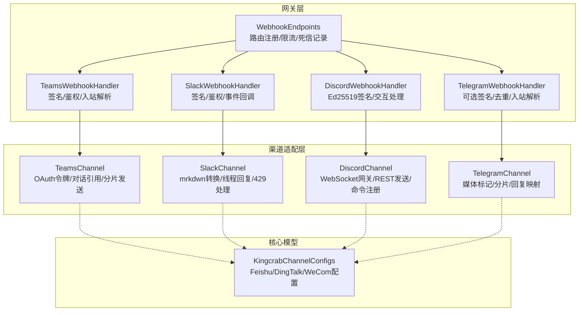
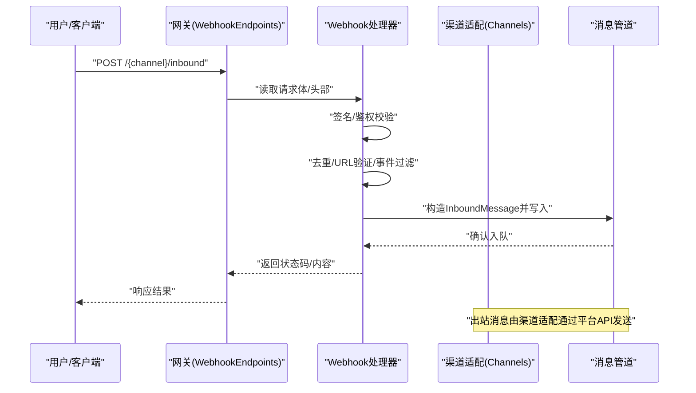
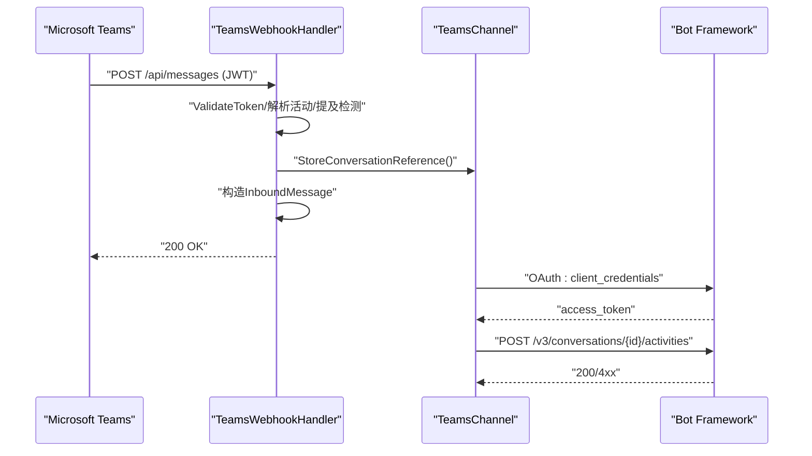
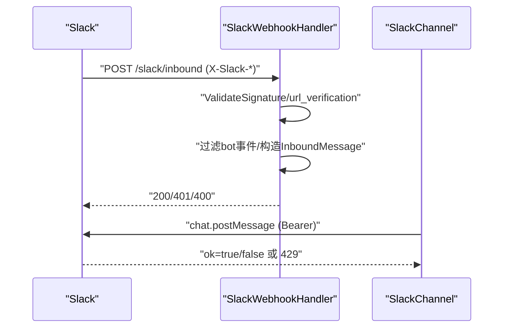
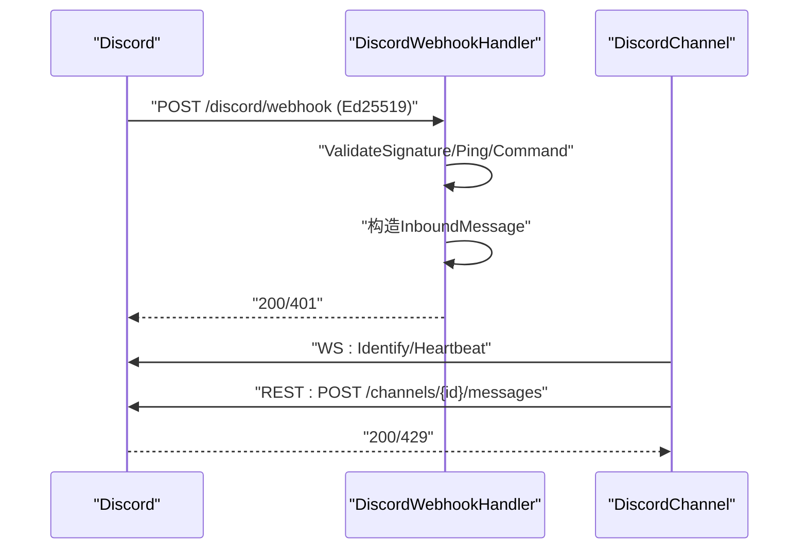
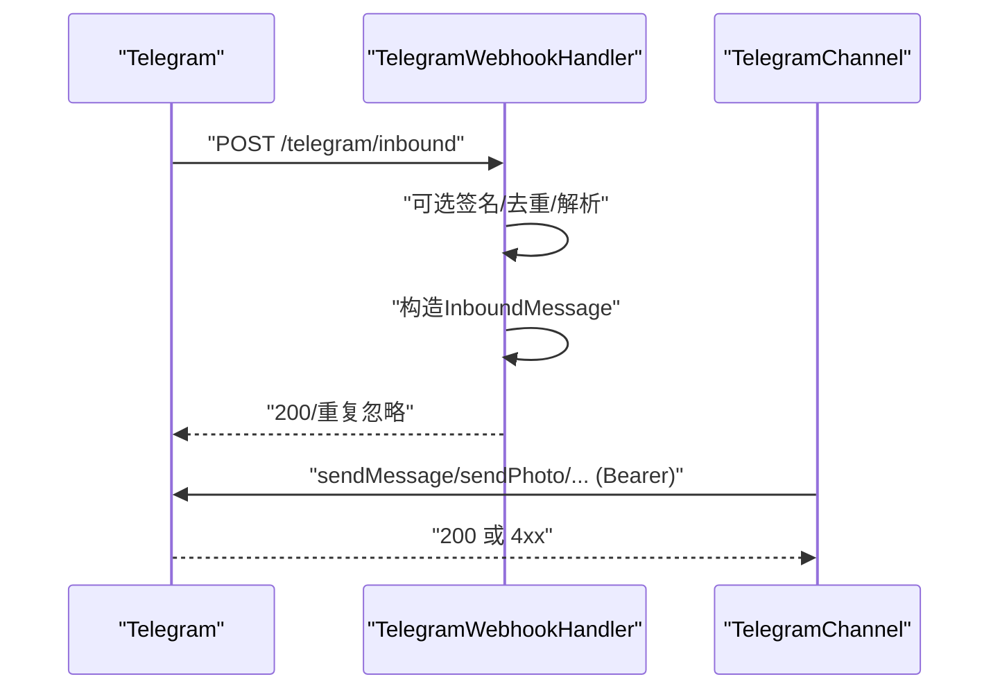
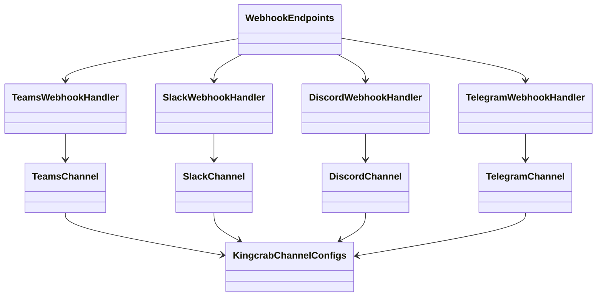

# 消息平台集成

<cite>
**本文引用的文件**
- [README.md](file://README.md)
- [TEAMS_SETUP.md](file://docs/TEAMS_SETUP.md)
- [WHATSAPP_SETUP.md](file://docs/WHATSAPP_SETUP.md)
- [TeamsChannel.cs](file://src/OpenClaw.Channels/TeamsChannel.cs)
- [SlackChannel.cs](file://src/OpenClaw.Channels/SlackChannel.cs)
- [DiscordChannel.cs](file://src/OpenClaw.Channels/DiscordChannel.cs)
- [TelegramChannel.cs](file://src/OpenClaw.Channels/TelegramChannel.cs)
- [TeamsWebhookHandler.cs](file://src/OpenClaw.Gateway/TeamsWebhookHandler.cs)
- [DiscordWebhookHandler.cs](file://src/OpenClaw.Gateway/DiscordWebhookHandler.cs)
- [SlackWebhookHandler.cs](file://src/OpenClaw.Gateway/SlackWebhookHandler.cs)
- [TelegramWebhookHandler.cs](file://src/OpenClaw.Gateway/TelegramWebhookHandler.cs)
- [WebhookEndpoints.cs](file://src/OpenClaw.Gateway/Endpoints/WebhookEndpoints.cs)
- [KingcrabChannelConfigs.cs](file://src/OpenClaw.Core/Models/KingcrabChannelConfigs.cs)
</cite>

## 目录
1. [简介](#简介)
2. [项目结构](#项目结构)
3. [核心组件](#核心组件)
4. [架构总览](#架构总览)
5. [详细组件分析](#详细组件分析)
6. [依赖关系分析](#依赖关系分析)
7. [性能考量](#性能考量)
8. [故障排除指南](#故障排除指南)
9. [结论](#结论)
10. [附录](#附录)

## 简介
本文件面向多消息平台集成场景，系统性梳理 Teams、Slack、Discord、Telegram 等主流消息平台在本项目中的集成方式、配置要点、认证与签名校验、消息格式转换、限流与重试、跨平台路由与会话管理、状态同步与错误处理，并提供统一的配置模板、部署与监控建议。文档以代码为依据，结合端到端流程图与类图，帮助读者快速落地并稳定运行。

## 项目结构
- 渠道适配层位于 OpenClaw.Channels，封装各平台的发送/接收逻辑与数据模型。
- 网关入口位于 OpenClaw.Gateway，负责 Webhook 接收、签名验证、去重、入站消息投递与错误归档。
- 统一的配置模型位于 OpenClaw.Core.Models，包含各渠道的配置类型与默认行为。
- README 提供整体能力概览、部署与安全加固要点。

图表来源
- [WebhookEndpoints.cs](file://src/OpenClaw.Gateway/Endpoints/WebhookEndpoints.cs)
- [TeamsWebhookHandler.cs](file://src/OpenClaw.Gateway/TeamsWebhookHandler.cs)
- [SlackWebhookHandler.cs](file://src/OpenClaw.Gateway/SlackWebhookHandler.cs)
- [DiscordWebhookHandler.cs](file://src/OpenClaw.Gateway/DiscordWebhookHandler.cs)
- [TelegramWebhookHandler.cs](file://src/OpenClaw.Gateway/TelegramWebhookHandler.cs)
- [TeamsChannel.cs](file://src/OpenClaw.Channels/TeamsChannel.cs)
- [SlackChannel.cs](file://src/OpenClaw.Channels/SlackChannel.cs)
- [DiscordChannel.cs](file://src/OpenClaw.Channels/DiscordChannel.cs)
- [TelegramChannel.cs](file://src/OpenClaw.Channels/TelegramChannel.cs)
- [KingcrabChannelConfigs.cs](file://src/OpenClaw.Core/Models/KingcrabChannelConfigs.cs)

章节来源
- [README.md](file://README.md)
- [WebhookEndpoints.cs](file://src/OpenClaw.Gateway/Endpoints/WebhookEndpoints.cs)

## 核心组件
- Teams 渠道与 Webhook 处理器
  - 渠道适配：通过 Bot Framework OAuth 获取访问令牌，存储对话引用，按文本长度分片发送，支持线程回复。
  - 网关处理器：JWT 签名校验、提及检测、租户/会话白名单、入站消息截断与会话映射。
- Slack 渠道与 Webhook 处理器
  - 渠道适配：将基本 Markdown 转换为 mrkdwn，支持线程回复；对 429 做退避与日志。
  - 网关处理器：URL 验证挑战、签名验证、事件过滤与去重。
- Discord 渠道与 Webhook 处理器
  - 渠道适配：WebSocket 网关长连，识别/心跳/恢复；REST 发送消息；可注册 Slash 命令；对 429 做退避。
  - 网关处理器：Ed25519 签名验证（Ping/Command 类型），时间戳防重放，会话映射。
- Telegram 渠道与 Webhook 处理器
  - 渠道适配：媒体标记协议提取与发送，文本分片，回复消息映射，支持多种媒体类型与标题截断。
  - 网关处理器：可选签名、去重（基于 update_id 或哈希）。
- 通用配置
  - 各渠道均支持最大入站字符数、允许列表、提及策略、消息分片/截断等通用能力。

章节来源
- [TeamsChannel.cs](file://src/OpenClaw.Channels/TeamsChannel.cs)
- [TeamsWebhookHandler.cs](file://src/OpenClaw.Gateway/TeamsWebhookHandler.cs)
- [SlackChannel.cs](file://src/OpenClaw.Channels/SlackChannel.cs)
- [SlackWebhookHandler.cs](file://src/OpenClaw.Gateway/SlackWebhookHandler.cs)
- [DiscordChannel.cs](file://src/OpenClaw.Channels/DiscordChannel.cs)
- [DiscordWebhookHandler.cs](file://src/OpenClaw.Gateway/DiscordWebhookHandler.cs)
- [TelegramChannel.cs](file://src/OpenClaw.Channels/TelegramChannel.cs)
- [TelegramWebhookHandler.cs](file://src/OpenClaw.Gateway/TelegramWebhookHandler.cs)
- [KingcrabChannelConfigs.cs](file://src/OpenClaw.Core/Models/KingcrabChannelConfigs.cs)

## 架构总览
下图展示从公网 Webhook 到渠道适配与消息管道的整体调用链路，包括鉴权、签名验证、去重、会话映射与错误归档。

图表来源
- [WebhookEndpoints.cs](file://src/OpenClaw.Gateway/Endpoints/WebhookEndpoints.cs)
- [TeamsWebhookHandler.cs](file://src/OpenClaw.Gateway/TeamsWebhookHandler.cs)
- [SlackWebhookHandler.cs](file://src/OpenClaw.Gateway/SlackWebhookHandler.cs)
- [DiscordWebhookHandler.cs](file://src/OpenClaw.Gateway/DiscordWebhookHandler.cs)
- [TelegramWebhookHandler.cs](file://src/OpenClaw.Gateway/TelegramWebhookHandler.cs)

## 详细组件分析

### Teams 集成
- 平台特性
  - 通过 Bot Framework REST API 发送消息；入站通过 HTTPS webhook 到达网关。
  - 支持 DM 与群组，提及检测，线程回复，OAuth 令牌缓存与刷新。
- 配置要点
  - AppId/AppPassword/TenantId，Webhook 路径，DM/群组策略，提及开关，回复样式（线程/顶层），文本分片参数。
- 认证与安全
  - 入站：JWT 校验（可禁用用于本地测试）。
  - 出站：OAuth 客户端凭据获取访问令牌，带过期时间缓存。
- 最佳实践
  - 生产环境开启 JWT 校验；严格控制 AllowedTenantIds/AllowedFromIds/AllowedConversationIds。
  - 群组默认要求 @提及，避免误触发。
- 错误处理
  - 缺少对话引用时记录警告；发送失败记录错误日志；速率限制与异常重试策略由上层处理。

图表来源
- [TeamsWebhookHandler.cs](file://src/OpenClaw.Gateway/TeamsWebhookHandler.cs)
- [TeamsChannel.cs](file://src/OpenClaw.Channels/TeamsChannel.cs)

章节来源
- [TEAMS_SETUP.md](file://docs/TEAMS_SETUP.md)
- [TeamsWebhookHandler.cs](file://src/OpenClaw.Gateway/TeamsWebhookHandler.cs)
- [TeamsChannel.cs](file://src/OpenClaw.Channels/TeamsChannel.cs)

### Slack 集成
- 平台特性
  - 通过 Events API 推送事件；Webhook 路径可配置；支持线程回复。
- 配置要点
  - BotToken，Webhook 路径，签名验证开关，最大请求字节，线程回复字段。
- 认证与安全
  - 入站：X-Slack-Request-Timestamp 与 X-Slack-Signature 校验；URL 验证挑战直接回显 challenge。
- 最佳实践
  - 开启签名验证；对 bot 自身消息进行过滤，避免回环。
- 错误处理
  - 429 时读取 Retry-After 并记录告警；API 返回 ok=false 时记录错误。

图表来源
- [SlackWebhookHandler.cs](file://src/OpenClaw.Gateway/SlackWebhookHandler.cs)
- [SlackChannel.cs](file://src/OpenClaw.Channels/SlackChannel.cs)

章节来源
- [SlackWebhookHandler.cs](file://src/OpenClaw.Gateway/SlackWebhookHandler.cs)
- [SlackChannel.cs](file://src/OpenClaw.Channels/SlackChannel.cs)

### Discord 集成
- 平台特性
  - 通过 WebSocket 网关接收消息；REST 发送消息；可注册 Slash 命令；支持 Ed25519 签名与时间戳防重放。
- 配置要点
  - BotToken/ApplicationId，Webhook 路径，签名公钥，最大请求字节，允许的服务器/频道/用户白名单，消息分片上限。
- 认证与安全
  - 入站：X-Signature-Ed25519 与 X-Signature-Timestamp；拒绝超过 5 分钟的时间戳。
- 最佳实践
  - 为交互式命令启用签名；合理设置允许列表；对 429 进行指数退避。
- 错误处理
  - 网关断开自动重连与恢复；心跳定时发送；异常记录与资源释放。

图表来源
- [DiscordWebhookHandler.cs](file://src/OpenClaw.Gateway/DiscordWebhookHandler.cs)
- [DiscordChannel.cs](file://src/OpenClaw.Channels/DiscordChannel.cs)

章节来源
- [DiscordWebhookHandler.cs](file://src/OpenClaw.Gateway/DiscordWebhookHandler.cs)
- [DiscordChannel.cs](file://src/OpenClaw.Channels/DiscordChannel.cs)

### Telegram 集成
- 平台特性
  - 通过 Bot API 发送消息；支持多种媒体类型与标题；文本分片；回复消息映射。
- 配置要点
  - BotToken，Webhook 路径，签名验证开关，最大请求字节，允许列表。
- 认证与安全
  - 可选签名；基于 update_id 或哈希的去重；严格校验聊天 ID。
- 最佳实践
  - 对媒体消息优先发送媒体，再发送剩余文本；标题超长截断。
- 错误处理
  - 发送失败记录错误日志；忽略不支持的纯媒体消息。

图表来源
- [TelegramWebhookHandler.cs](file://src/OpenClaw.Gateway/TelegramWebhookHandler.cs)
- [TelegramChannel.cs](file://src/OpenClaw.Channels/TelegramChannel.cs)

章节来源
- [TelegramWebhookHandler.cs](file://src/OpenClaw.Gateway/TelegramWebhookHandler.cs)
- [TelegramChannel.cs](file://src/OpenClaw.Channels/TelegramChannel.cs)

### 跨平台消息路由与状态同步
- 会话映射
  - Teams：群组会话以 conversationId 映射；DM 默认按用户映射。
  - Discord：线程场景以 channel 作为会话前缀；普通频道/私聊分别映射。
  - Slack：以 channel 映射；线程回复通过 thread_ts。
  - Telegram：以 chat_id 映射；回复消息映射到 reply_to_message_id。
- 状态同步
  - Teams：存储对话引用以便后续主动消息；OAuth 令牌缓存与刷新。
  - Discord：WebSocket 保持长连，心跳维持；断线自动重连与恢复。
- 错误处理
  - 各渠道均记录错误日志；对 429 进行退避；Webhook 层对重复请求进行去重与死信归档。

章节来源
- [TeamsWebhookHandler.cs](file://src/OpenClaw.Gateway/TeamsWebhookHandler.cs)
- [DiscordChannel.cs](file://src/OpenClaw.Channels/DiscordChannel.cs)
- [SlackChannel.cs](file://src/OpenClaw.Channels/SlackChannel.cs)
- [TelegramChannel.cs](file://src/OpenClaw.Channels/TelegramChannel.cs)
- [WebhookEndpoints.cs](file://src/OpenClaw.Gateway/Endpoints/WebhookEndpoints.cs)

## 依赖关系分析
- 渠道适配依赖
  - Teams：Bot Framework OAuth、对话引用存储、文本分片。
  - Slack：mrkdwn 转换、线程回复、429 处理。
  - Discord：WebSocket 网关、REST 发送、Ed25519 验证、命令注册。
  - Telegram：媒体标记协议、文本分片、回复映射。
- 网关层依赖
  - 各 Webhook 处理器依赖签名/鉴权组件、白名单策略、最近发送者记录、去重存储与死信归档。
- 配置依赖
  - 各渠道配置对象集中于 KingcrabChannelConfigs，便于扩展与热重载。

图表来源
- [WebhookEndpoints.cs](file://src/OpenClaw.Gateway/Endpoints/WebhookEndpoints.cs)
- [TeamsWebhookHandler.cs](file://src/OpenClaw.Gateway/TeamsWebhookHandler.cs)
- [SlackWebhookHandler.cs](file://src/OpenClaw.Gateway/SlackWebhookHandler.cs)
- [DiscordWebhookHandler.cs](file://src/OpenClaw.Gateway/DiscordWebhookHandler.cs)
- [TelegramWebhookHandler.cs](file://src/OpenClaw.Gateway/TelegramWebhookHandler.cs)
- [TeamsChannel.cs](file://src/OpenClaw.Channels/TeamsChannel.cs)
- [SlackChannel.cs](file://src/OpenClaw.Channels/SlackChannel.cs)
- [DiscordChannel.cs](file://src/OpenClaw.Channels/DiscordChannel.cs)
- [TelegramChannel.cs](file://src/OpenClaw.Channels/TelegramChannel.cs)
- [KingcrabChannelConfigs.cs](file://src/OpenClaw.Core/Models/KingcrabChannelConfigs.cs)

章节来源
- [WebhookEndpoints.cs](file://src/OpenClaw.Gateway/Endpoints/WebhookEndpoints.cs)
- [KingcrabChannelConfigs.cs](file://src/OpenClaw.Core/Models/KingcrabChannelConfigs.cs)

## 性能考量
- 速率限制与退避
  - Slack/Discord 在收到 429 时读取 Retry-After 或进行指数退避，降低重试风暴风险。
- 文本分片与截断
  - Teams/Discord/Telegram 对超长文本进行分片或截断，避免平台限制。
- 连接稳定性
  - Discord 使用 WebSocket 心跳与断线重连，确保消息可达性。
- 日志与可观测性
  - 统一记录错误与告警，便于定位瓶颈与异常。

章节来源
- [SlackChannel.cs](file://src/OpenClaw.Channels/SlackChannel.cs)
- [DiscordChannel.cs](file://src/OpenClaw.Channels/DiscordChannel.cs)
- [TelegramChannel.cs](file://src/OpenClaw.Channels/TelegramChannel.cs)
- [TeamsChannel.cs](file://src/OpenClaw.Channels/TeamsChannel.cs)

## 故障排除指南
- Teams
  - 401 来自 webhook：需有效 JWT，使用 Azure Web Chat 测试独立于 Teams 的验证。
  - Bot 不响应：检查消息端点配置、应用安装与权限、浏览器强制刷新。
  - 应用上传失败：检查 appid 匹配、图标尺寸与清单 JSON。
- Slack
  - 401：检查签名密钥与时间戳；确认已通过 URL 验证挑战。
  - 回环问题：确保过滤 bot 自身事件。
- Discord
  - 401/Ed25519 校验失败：核对公钥长度与格式；检查时间戳是否过期。
  - 交互无响应：确认已返回 defer 类型响应。
- Telegram
  - 重复消息：检查去重键与签名；确保 update_id 可用。
  - 媒体发送失败：确认媒体 URL 可达且类型匹配。

章节来源
- [TEAMS_SETUP.md](file://docs/TEAMS_SETUP.md)
- [SlackWebhookHandler.cs](file://src/OpenClaw.Gateway/SlackWebhookHandler.cs)
- [DiscordWebhookHandler.cs](file://src/OpenClaw.Gateway/DiscordWebhookHandler.cs)
- [TelegramWebhookHandler.cs](file://src/OpenClaw.Gateway/TelegramWebhookHandler.cs)

## 结论
本项目提供了标准化的多平台消息集成方案：统一的 Webhook 处理器、渠道适配器与配置模型，辅以签名/鉴权、去重、会话映射与错误归档机制。通过合理的配置与安全加固，可在生产环境中稳定运行 Teams、Slack、Discord、Telegram 等主流平台。

## 附录

### 统一配置模板与关键字段
- 通用字段
  - Enabled：是否启用
  - MaxRequestBytes：入站请求体大小限制
  - AllowedFromUserIds：发件人允许列表
  - MaxInboundChars：入站消息最大字符数
  - ValidateSignature：是否启用签名验证（Telegram/Slack/Discord）
- Teams 特有
  - AppId/AppPassword/TenantId，WebhookPath，DM/Group 策略，RequireMention，ReplyStyle，AllowedTenantIds/AllowedConversationIds
- Slack 特有
  - BotToken，WebhookPath，SlashCommandPath，ValidateSignature
- Discord 特有
  - BotToken/ApplicationId，WebhookPath，PublicKey，AllowedGuildIds/AllowedChannelIds/AllowedFromUserIds
- Telegram 特有
  - BotToken，WebhookPath，ValidateSignature，WebhookSecretToken

章节来源
- [KingcrabChannelConfigs.cs](file://src/OpenClaw.Core/Models/KingcrabChannelConfigs.cs)
- [TEAMS_SETUP.md](file://docs/TEAMS_SETUP.md)

### 部署与监控建议
- 部署
  - 使用反向代理（如 Caddy/Nginx）提供 TLS；生产环境必须设置认证令牌与安全策略。
- 监控
  - 暴露 /health 与 /metrics；结合日志与分布式追踪；定期巡检速率限制与错误率。
- 安全
  - 严格白名单；禁止 raw 密钥引用；启用签名与 JWT 校验；限制工具与插件执行范围。

章节来源
- [README.md](file://README.md)