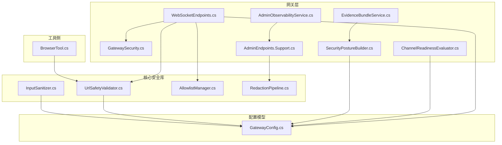
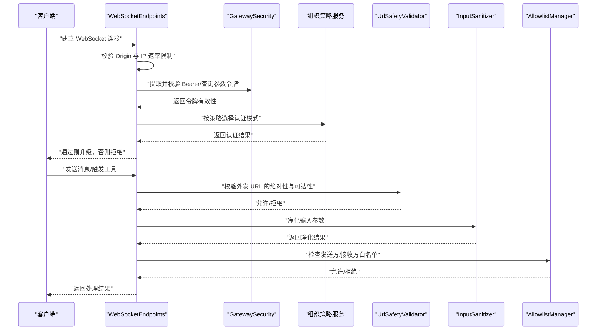
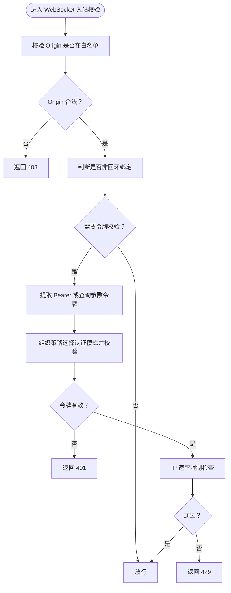
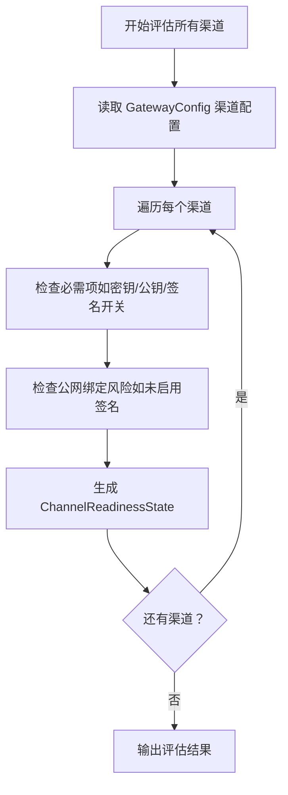
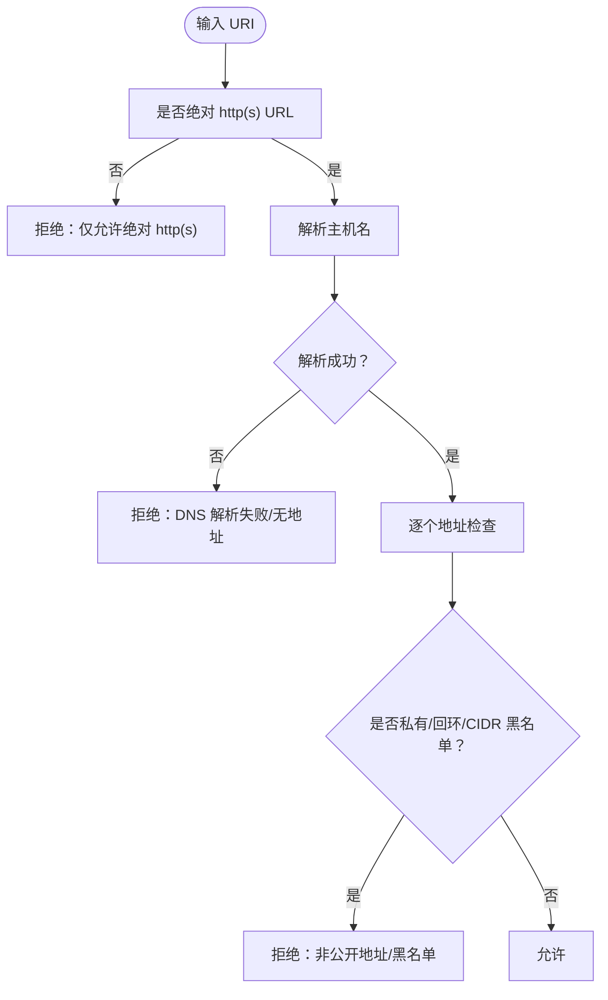
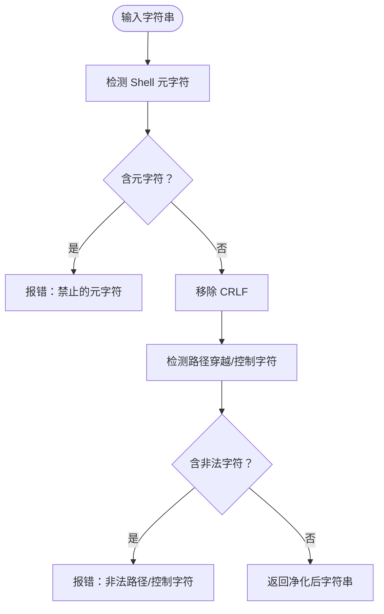
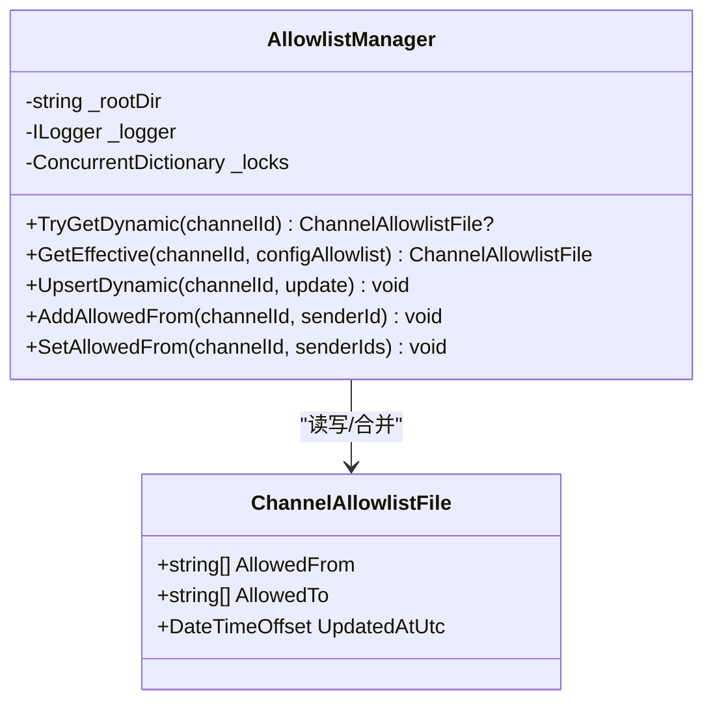
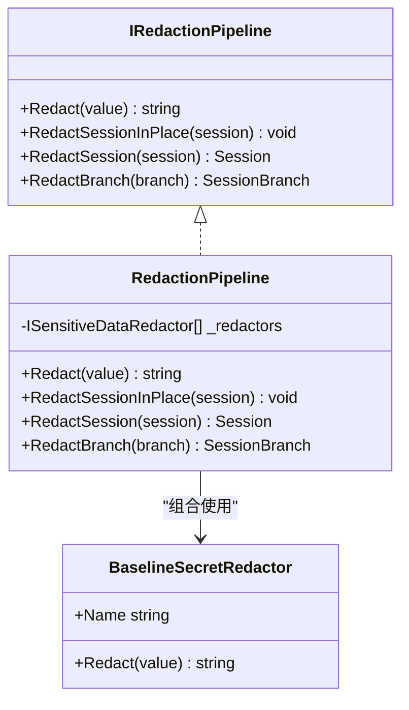
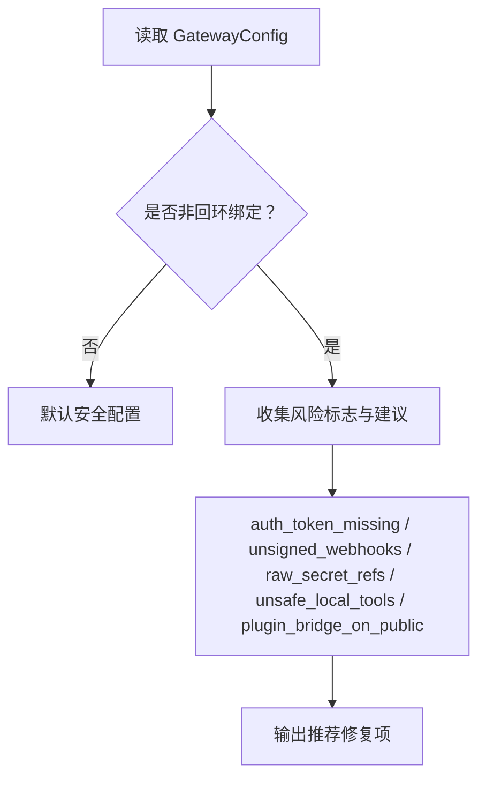
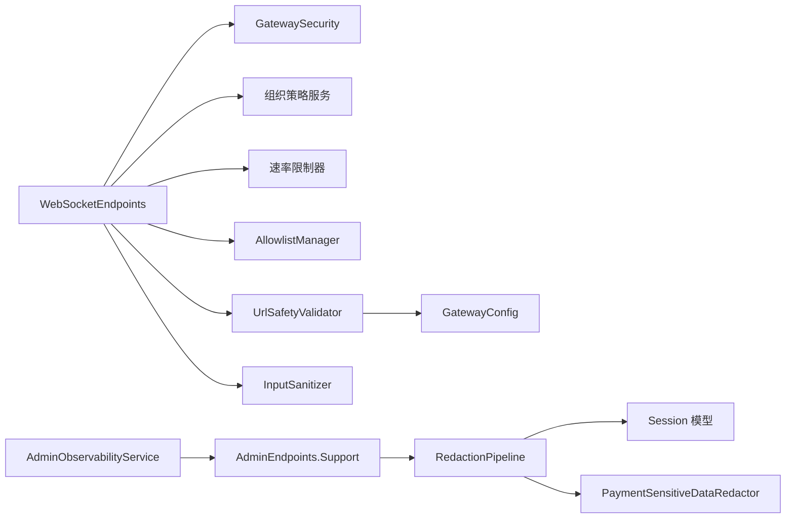

# 渠道安全

<cite>
**本文引用的文件**   
- [GatewaySecurity.cs](file://src/OpenClaw.Gateway/GatewaySecurity.cs)
- [WebSocketEndpoints.cs](file://src/OpenClaw.Gateway/Endpoints/WebSocketEndpoints.cs)
- [ChannelReadinessEvaluator.cs](file://src/OpenClaw.Gateway/ChannelReadinessEvaluator.cs)
- [SecurityPostureBuilder.cs](file://src/OpenClaw.Gateway/SecurityPostureBuilder.cs)
- [AdminEndpoints.Support.cs](file://src/OpenClaw.Gateway/Endpoints/AdminEndpoints.Support.cs)
- [UrlSafetyValidator.cs](file://src/OpenClaw.Core/Security/UrlSafetyValidator.cs)
- [InputSanitizer.cs](file://src/OpenClaw.Core/Security/InputSanitizer.cs)
- [AllowlistManager.cs](file://src/OpenClaw.Core/Security/AllowlistManager.cs)
- [RedactionPipeline.cs](file://src/OpenClaw.Core/Security/RedactionPipeline.cs)
- [GatewayConfig.cs](file://src/OpenClaw.Core/Models/GatewayConfig.cs)
- [BrowserTool.cs](file://src/OpenClaw.Agent/Tools/BrowserTool.cs)
- [EvidenceBundleService.cs](file://src/OpenClaw.Gateway/EvidenceBundleService.cs)
- [AdminObservabilityService.cs](file://src/OpenClaw.Gateway/AdminObservabilityService.cs)
</cite>

## 目录
1. [简介](#简介)
2. [项目结构](#项目结构)
3. [核心组件](#核心组件)
4. [架构总览](#架构总览)
5. [详细组件分析](#详细组件分析)
6. [依赖关系分析](#依赖关系分析)
7. [性能考量](#性能考量)
8. [故障排查指南](#故障排查指南)
9. [结论](#结论)
10. [附录](#附录)

## 简介
本技术文档聚焦于通信渠道安全系统，围绕“认证与授权、渠道就绪性评估与健康检查、输入验证与URL安全、内容净化与敏感信息脱敏、安全配置与威胁防护、合规与审计”等主题，系统梳理并可视化代码实现与运行机制。目标是帮助开发者与运维人员快速理解并正确配置与使用该系统的安全能力。

## 项目结构
- 安全相关能力主要分布在以下模块：
  - 网关层：认证与授权、渠道就绪性评估、安全态势构建、可观测与审计导出
  - 核心安全库：URL安全校验、输入净化、白名单管理、敏感数据脱敏管线
  - 配置模型：集中定义安全相关配置项（如跨域、转发头信任、工具审批、URL安全策略等）
  - 工具侧：浏览器工具中的URL安全路由与拦截逻辑

**图表来源**
- [WebSocketEndpoints.cs](file://src/OpenClaw.Gateway/Endpoints/WebSocketEndpoints.cs)
- [GatewaySecurity.cs](file://src/OpenClaw.Gateway/GatewaySecurity.cs)
- [ChannelReadinessEvaluator.cs](file://src/OpenClaw.Gateway/ChannelReadinessEvaluator.cs)
- [SecurityPostureBuilder.cs](file://src/OpenClaw.Gateway/SecurityPostureBuilder.cs)
- [AdminEndpoints.Support.cs](file://src/OpenClaw.Gateway/Endpoints/AdminEndpoints.Support.cs)
- [UrlSafetyValidator.cs](file://src/OpenClaw.Core/Security/UrlSafetyValidator.cs)
- [InputSanitizer.cs](file://src/OpenClaw.Core/Security/InputSanitizer.cs)
- [AllowlistManager.cs](file://src/OpenClaw.Core/Security/AllowlistManager.cs)
- [RedactionPipeline.cs](file://src/OpenClaw.Core/Security/RedactionPipeline.cs)
- [GatewayConfig.cs](file://src/OpenClaw.Core/Models/GatewayConfig.cs)
- [BrowserTool.cs](file://src/OpenClaw.Agent/Tools/BrowserTool.cs)
- [EvidenceBundleService.cs](file://src/OpenClaw.Gateway/EvidenceBundleService.cs)
- [AdminObservabilityService.cs](file://src/OpenClaw.Gateway/AdminObservabilityService.cs)

**章节来源**
- [GatewaySecurity.cs](file://src/OpenClaw.Gateway/GatewaySecurity.cs)
- [WebSocketEndpoints.cs](file://src/OpenClaw.Gateway/Endpoints/WebSocketEndpoints.cs)
- [ChannelReadinessEvaluator.cs](file://src/OpenClaw.Gateway/ChannelReadinessEvaluator.cs)
- [SecurityPostureBuilder.cs](file://src/OpenClaw.Gateway/SecurityPostureBuilder.cs)
- [AdminEndpoints.Support.cs](file://src/OpenClaw.Gateway/Endpoints/AdminEndpoints.Support.cs)
- [UrlSafetyValidator.cs](file://src/OpenClaw.Core/Security/UrlSafetyValidator.cs)
- [InputSanitizer.cs](file://src/OpenClaw.Core/Security/InputSanitizer.cs)
- [AllowlistManager.cs](file://src/OpenClaw.Core/Security/AllowlistManager.cs)
- [RedactionPipeline.cs](file://src/OpenClaw.Core/Security/RedactionPipeline.cs)
- [GatewayConfig.cs](file://src/OpenClaw.Core/Models/GatewayConfig.cs)
- [BrowserTool.cs](file://src/OpenClaw.Agent/Tools/BrowserTool.cs)
- [EvidenceBundleService.cs](file://src/OpenClaw.Gateway/EvidenceBundleService.cs)
- [AdminObservabilityService.cs](file://src/OpenClaw.Gateway/AdminObservabilityService.cs)

## 核心组件
- 认证与授权
  - Bearer Token 提取与校验、查询参数令牌支持、组织级认证模式选择（引导令牌/账户令牌）
  - WebSocket 入站请求的 Origin 白名单校验、IP 速率限制
- 渠道就绪性评估
  - 基于配置对各渠道（短信/Twilio、Telegram、WhatsApp、Teams、Slack、Discord、Signal、飞书、钉钉、企业微信）进行缺失项与风险提示检查
- URL 安全与输入净化
  - 绝对 http(s) URL 校验、私有/回环地址阻断、CIDR 黑名单、主机名黑名单、DNS 解析失败处理
  - 输入净化：Shell 元字符检测、CRLF 抵制、路径穿越与控制字符检测
- 内容净化与敏感信息脱敏
  - 多级脱敏管线：会话历史、工具调用参数与结果、分支会话
  - 支付场景专用脱敏规则
- 安全配置与威胁防护
  - 跨域 AllowedOrigins、转发头信任 TrustForwardedHeaders、已知代理 KnownProxies
  - 工具审批与请求者匹配、浏览器会话 Cookie Secure 效果判定
  - 插件桥接与本地工具执行在公网绑定下的风险提示
- 合规与审计
  - 安全态势报告、证据包生成、审计导出清单与序列范围

**章节来源**
- [GatewaySecurity.cs](file://src/OpenClaw.Gateway/GatewaySecurity.cs)
- [WebSocketEndpoints.cs](file://src/OpenClaw.Gateway/Endpoints/WebSocketEndpoints.cs)
- [ChannelReadinessEvaluator.cs](file://src/OpenClaw.Gateway/ChannelReadinessEvaluator.cs)
- [UrlSafetyValidator.cs](file://src/OpenClaw.Core/Security/UrlSafetyValidator.cs)
- [InputSanitizer.cs](file://src/OpenClaw.Core/Security/InputSanitizer.cs)
- [AllowlistManager.cs](file://src/OpenClaw.Core/Security/AllowlistManager.cs)
- [RedactionPipeline.cs](file://src/OpenClaw.Core/Security/RedactionPipeline.cs)
- [GatewayConfig.cs](file://src/OpenClaw.Core/Models/GatewayConfig.cs)
- [EvidenceBundleService.cs](file://src/OpenClaw.Gateway/EvidenceBundleService.cs)
- [AdminObservabilityService.cs](file://src/OpenClaw.Gateway/AdminObservabilityService.cs)

## 架构总览
下图展示从客户端到网关、再到渠道适配器与工具执行的整体安全流程，重点标注认证、授权、URL 安全与输入净化的关键节点。

**图表来源**
- [WebSocketEndpoints.cs](file://src/OpenClaw.Gateway/Endpoints/WebSocketEndpoints.cs)
- [GatewaySecurity.cs](file://src/OpenClaw.Gateway/GatewaySecurity.cs)
- [UrlSafetyValidator.cs](file://src/OpenClaw.Core/Security/UrlSafetyValidator.cs)
- [InputSanitizer.cs](file://src/OpenClaw.Core/Security/InputSanitizer.cs)
- [AllowlistManager.cs](file://src/OpenClaw.Core/Security/AllowlistManager.cs)

## 详细组件分析

### 组件一：认证与授权（Bearer 令牌、查询参数令牌、组织策略）
- 功能要点
  - 从 Authorization 头提取 Bearer 令牌；可选允许查询参数 token
  - 在非回环绑定时，优先校验组织策略允许的认证模式（引导令牌或账户令牌）
  - WebSocket 入站请求在非回环绑定时强制令牌校验
- 关键实现位置
  - 令牌提取与校验：[GatewaySecurity.cs](file://src/OpenClaw.Gateway/GatewaySecurity.cs)
  - WebSocket 入站鉴权与速率限制：[WebSocketEndpoints.cs](file://src/OpenClaw.Gateway/Endpoints/WebSocketEndpoints.cs)
  - 组织策略与认证模式选择：[WebSocketEndpoints.cs](file://src/OpenClaw.Gateway/Endpoints/WebSocketEndpoints.cs)

**图表来源**
- [WebSocketEndpoints.cs](file://src/OpenClaw.Gateway/Endpoints/WebSocketEndpoints.cs)
- [GatewaySecurity.cs](file://src/OpenClaw.Gateway/GatewaySecurity.cs)

**章节来源**
- [GatewaySecurity.cs](file://src/OpenClaw.Gateway/GatewaySecurity.cs)
- [WebSocketEndpoints.cs](file://src/OpenClaw.Gateway/Endpoints/WebSocketEndpoints.cs)

### 组件二：渠道就绪性评估与健康检查
- 功能要点
  - 对各渠道配置进行“缺失项/警告/修复建议”三态评估
  - 针对签名验证、公钥/密钥配置、公网绑定风险等给出明确指引
  - 输出 ready/degraded/disabled 状态，便于健康检查与自动诊断
- 关键实现位置
  - 渠道就绪性评估入口与状态构造：[ChannelReadinessEvaluator.cs](file://src/OpenClaw.Gateway/ChannelReadinessEvaluator.cs)
  - 配置模型（渠道相关字段）：[GatewayConfig.cs](file://src/OpenClaw.Core/Models/GatewayConfig.cs)

**图表来源**
- [ChannelReadinessEvaluator.cs](file://src/OpenClaw.Gateway/ChannelReadinessEvaluator.cs)
- [GatewayConfig.cs](file://src/OpenClaw.Core/Models/GatewayConfig.cs)

**章节来源**
- [ChannelReadinessEvaluator.cs](file://src/OpenClaw.Gateway/ChannelReadinessEvaluator.cs)
- [GatewayConfig.cs](file://src/OpenClaw.Core/Models/GatewayConfig.cs)

### 组件三：URL 安全检查与浏览器工具拦截
- 功能要点
  - 仅允许绝对 http(s) URL；校验主机名、DNS 解析、私有/回环地址、CIDR 黑名单
  - 浏览器工具侧通过路由拦截与 URL 安全策略阻止不安全目标
- 关键实现位置
  - 核心校验逻辑：[UrlSafetyValidator.cs](file://src/OpenClaw.Core/Security/UrlSafetyValidator.cs)
  - 浏览器工具 URL 安全策略与拦截：[BrowserTool.cs](file://src/OpenClaw.Agent/Tools/BrowserTool.cs)

**图表来源**
- [UrlSafetyValidator.cs](file://src/OpenClaw.Core/Security/UrlSafetyValidator.cs)
- [BrowserTool.cs](file://src/OpenClaw.Agent/Tools/BrowserTool.cs)

**章节来源**
- [UrlSafetyValidator.cs](file://src/OpenClaw.Core/Security/UrlSafetyValidator.cs)
- [BrowserTool.cs](file://src/OpenClaw.Agent/Tools/BrowserTool.cs)

### 组件四：输入验证与净化
- 功能要点
  - Shell 元字符检测、CRLF 抵制、路径穿越与控制字符检测
  - 作为多层防御的一部分，降低注入与命令注入风险
- 关键实现位置
  - 输入净化工具：[InputSanitizer.cs](file://src/OpenClaw.Core/Security/InputSanitizer.cs)

**图表来源**
- [InputSanitizer.cs](file://src/OpenClaw.Core/Security/InputSanitizer.cs)

**章节来源**
- [InputSanitizer.cs](file://src/OpenClaw.Core/Security/InputSanitizer.cs)

### 组件五：渠道白名单与访问控制
- 功能要点
  - 持久化每渠道动态白名单文件，支持 per-channel 的 AllowedFrom/AllowedTo
  - 优先使用动态文件，回退到静态配置
- 关键实现位置
  - 白名单管理器：[AllowlistManager.cs](file://src/OpenClaw.Core/Security/AllowlistManager.cs)
  - 配置模型（渠道白名单语义）：[GatewayConfig.cs](file://src/OpenClaw.Core/Models/GatewayConfig.cs)

**图表来源**
- [AllowlistManager.cs](file://src/OpenClaw.Core/Security/AllowlistManager.cs)

**章节来源**
- [AllowlistManager.cs](file://src/OpenClaw.Core/Security/AllowlistManager.cs)
- [GatewayConfig.cs](file://src/OpenClaw.Core/Models/GatewayConfig.cs)

### 组件六：敏感信息脱敏与审计导出
- 功能要点
  - 多级脱敏管线：Authorization Bearer、OpenAI Secret、ApiKey 字段等
  - 会话与分支会话的脱敏复制，避免敏感信息泄露
  - 安全态势证据包生成与审计导出清单
- 关键实现位置
  - 脱敏管线与默认脱敏器：[RedactionPipeline.cs](file://src/OpenClaw.Core/Security/RedactionPipeline.cs)
  - 支付场景脱敏器：[PaymentSensitiveDataRedactor.cs](file://src/OpenClaw.Payments.Core/PaymentSensitiveDataRedactor.cs)
  - 安全证据包生成：[EvidenceBundleService.cs](file://src/OpenClaw.Gateway/EvidenceBundleService.cs)
  - 审计导出清单与序列范围：[AdminObservabilityService.cs](file://src/OpenClaw.Gateway/AdminObservabilityService.cs)

**图表来源**
- [RedactionPipeline.cs](file://src/OpenClaw.Core/Security/RedactionPipeline.cs)

**章节来源**
- [RedactionPipeline.cs](file://src/OpenClaw.Core/Security/RedactionPipeline.cs)
- [EvidenceBundleService.cs](file://src/OpenClaw.Gateway/EvidenceBundleService.cs)
- [AdminObservabilityService.cs](file://src/OpenClaw.Gateway/AdminObservabilityService.cs)

### 组件七：安全配置与威胁防护
- 功能要点
  - 跨域与转发头信任：AllowedOrigins、TrustForwardedHeaders、KnownProxies
  - 工具审批与请求者匹配：RequireRequesterMatchForHttpToolApproval
  - 公网绑定风险提示：插件桥接、原始密钥引用、本地工具执行暴露
- 关键实现位置
  - 安全配置模型：[GatewayConfig.cs](file://src/OpenClaw.Core/Models/GatewayConfig.cs)
  - 安全态势构建与风险标志：[SecurityPostureBuilder.cs](file://src/OpenClaw.Gateway/SecurityPostureBuilder.cs)

**图表来源**
- [GatewayConfig.cs](file://src/OpenClaw.Core/Models/GatewayConfig.cs)
- [SecurityPostureBuilder.cs](file://src/OpenClaw.Gateway/SecurityPostureBuilder.cs)

**章节来源**
- [GatewayConfig.cs](file://src/OpenClaw.Core/Models/GatewayConfig.cs)
- [SecurityPostureBuilder.cs](file://src/OpenClaw.Gateway/SecurityPostureBuilder.cs)

## 依赖关系分析
- 组件耦合与内聚
  - WebSocketEndpoints 依赖 GatewaySecurity、组织策略服务、速率限制器、AllowlistManager
  - UrlSafetyValidator 依赖配置模型与 DNS 解析能力
  - RedactionPipeline 依赖会话模型与多种脱敏器
- 外部依赖与集成点
  - 浏览器工具通过路由拦截与 URL 安全策略集成
  - 审计导出依赖 SSE 事件流与文件序列范围

**图表来源**
- [WebSocketEndpoints.cs](file://src/OpenClaw.Gateway/Endpoints/WebSocketEndpoints.cs)
- [GatewaySecurity.cs](file://src/OpenClaw.Gateway/GatewaySecurity.cs)
- [UrlSafetyValidator.cs](file://src/OpenClaw.Core/Security/UrlSafetyValidator.cs)
- [InputSanitizer.cs](file://src/OpenClaw.Core/Security/InputSanitizer.cs)
- [AllowlistManager.cs](file://src/OpenClaw.Core/Security/AllowlistManager.cs)
- [RedactionPipeline.cs](file://src/OpenClaw.Core/Security/RedactionPipeline.cs)
- [GatewayConfig.cs](file://src/OpenClaw.Core/Models/GatewayConfig.cs)
- [AdminEndpoints.Support.cs](file://src/OpenClaw.Gateway/Endpoints/AdminEndpoints.Support.cs)
- [AdminObservabilityService.cs](file://src/OpenClaw.Gateway/AdminObservabilityService.cs)

**章节来源**
- [WebSocketEndpoints.cs](file://src/OpenClaw.Gateway/Endpoints/WebSocketEndpoints.cs)
- [GatewaySecurity.cs](file://src/OpenClaw.Gateway/GatewaySecurity.cs)
- [UrlSafetyValidator.cs](file://src/OpenClaw.Core/Security/UrlSafetyValidator.cs)
- [InputSanitizer.cs](file://src/OpenClaw.Core/Security/InputSanitizer.cs)
- [AllowlistManager.cs](file://src/OpenClaw.Core/Security/AllowlistManager.cs)
- [RedactionPipeline.cs](file://src/OpenClaw.Core/Security/RedactionPipeline.cs)
- [GatewayConfig.cs](file://src/OpenClaw.Core/Models/GatewayConfig.cs)
- [AdminEndpoints.Support.cs](file://src/OpenClaw.Gateway/Endpoints/AdminEndpoints.Support.cs)
- [AdminObservabilityService.cs](file://src/OpenClaw.Gateway/AdminObservabilityService.cs)

## 性能考量
- URL 安全校验涉及 DNS 解析，应合理设置超时与重试策略，避免阻塞请求
- 速率限制与白名单检查为常驻逻辑，建议缓存热点键值以降低 IO 压力
- 脱敏管线对大体量会话历史的 JSON 序列化/反序列化成本较高，建议按需脱敏或分页处理
- SSE 审计事件流在高并发下需注意背压与连接复用，避免内存泄漏

## 故障排查指南
- WebSocket 入站被拒
  - 检查 Origin 是否在 AllowedOrigins 中
  - 非回环绑定时确认是否携带有效令牌，且组织策略允许相应认证模式
  - 查看 IP 速率限制是否触发
  - 参考：[WebSocketEndpoints.cs](file://src/OpenClaw.Gateway/Endpoints/WebSocketEndpoints.cs)
- 渠道无法正常工作
  - 使用渠道就绪性评估接口查看缺失项与风险提示
  - 按照“修复建议”补充密钥、签名开关、公网基地址等
  - 参考：[ChannelReadinessEvaluator.cs](file://src/OpenClaw.Gateway/ChannelReadinessEvaluator.cs)
- URL 请求被阻断
  - 确认是否为绝对 http(s) URL，主机名是否可解析
  - 检查是否命中私有/回环地址或 CIDR 黑名单
  - 参考：[UrlSafetyValidator.cs](file://src/OpenClaw.Core/Security/UrlSafetyValidator.cs)
- 审计与导出异常
  - 确认 SSE 事件流订阅是否正常，请求取消是否导致中断
  - 检查导出清单中的序列范围与保留天数
  - 参考：[AdminEndpoints.Support.cs](file://src/OpenClaw.Gateway/Endpoints/AdminEndpoints.Support.cs)，[AdminObservabilityService.cs](file://src/OpenClaw.Gateway/AdminObservabilityService.cs)

**章节来源**
- [WebSocketEndpoints.cs](file://src/OpenClaw.Gateway/Endpoints/WebSocketEndpoints.cs)
- [ChannelReadinessEvaluator.cs](file://src/OpenClaw.Gateway/ChannelReadinessEvaluator.cs)
- [UrlSafetyValidator.cs](file://src/OpenClaw.Core/Security/UrlSafetyValidator.cs)
- [AdminEndpoints.Support.cs](file://src/OpenClaw.Gateway/Endpoints/AdminEndpoints.Support.cs)
- [AdminObservabilityService.cs](file://src/OpenClaw.Gateway/AdminObservabilityService.cs)

## 结论
该通信渠道安全系统通过“令牌认证与授权、渠道就绪性评估、URL 安全与输入净化、白名单与访问控制、敏感信息脱敏与审计导出、安全配置与风险提示”六大维度，构建了端到端的安全能力闭环。结合配置模型与可观测性接口，可在不同部署环境下实现从开发沙箱到公网生产的安全演进与合规保障。

## 附录
- 最佳实践
  - 公网绑定必须启用签名验证与令牌校验，并定期轮换密钥
  - 启用严格的 URL 安全策略与输入净化，避免 SSRF 与注入攻击
  - 使用白名单管理器维护 per-channel 的 AllowedFrom/AllowedTo，最小权限原则
  - 开启安全态势报告与审计导出，形成持续监控与取证能力
- 合规与审计
  - 使用脱敏管线保护敏感字段，遵循最小可见原则
  - 审计导出清单包含 operator audit、runtime events、approval history 等关键文件
  - 参考：[RedactionPipeline.cs](file://src/OpenClaw.Core/Security/RedactionPipeline.cs)，[AdminObservabilityService.cs](file://src/OpenClaw.Gateway/AdminObservabilityService.cs)

**章节来源**
- [RedactionPipeline.cs](file://src/OpenClaw.Core/Security/RedactionPipeline.cs)
- [AdminObservabilityService.cs](file://src/OpenClaw.Gateway/AdminObservabilityService.cs)