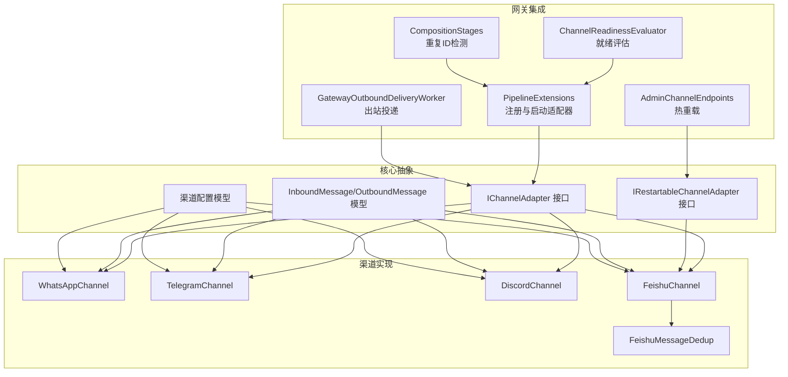
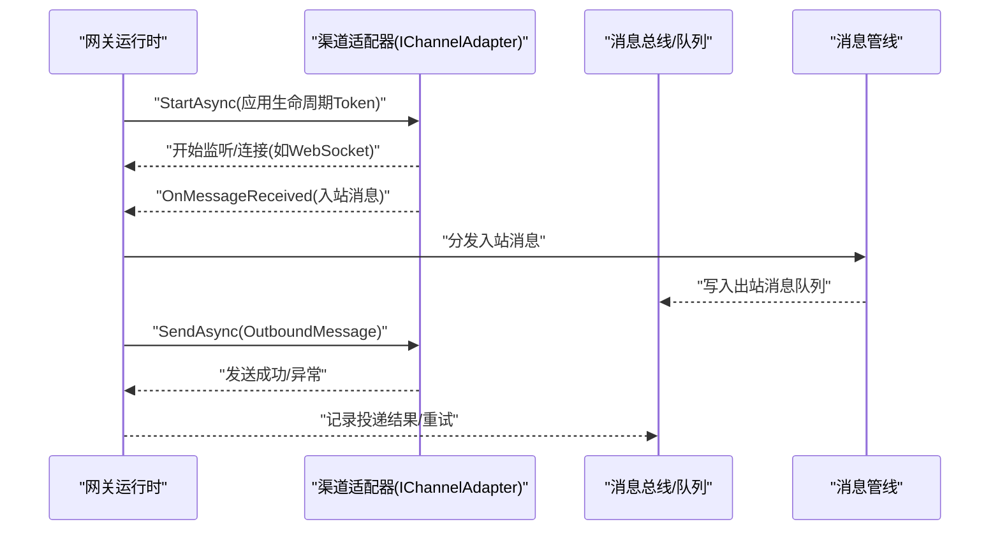
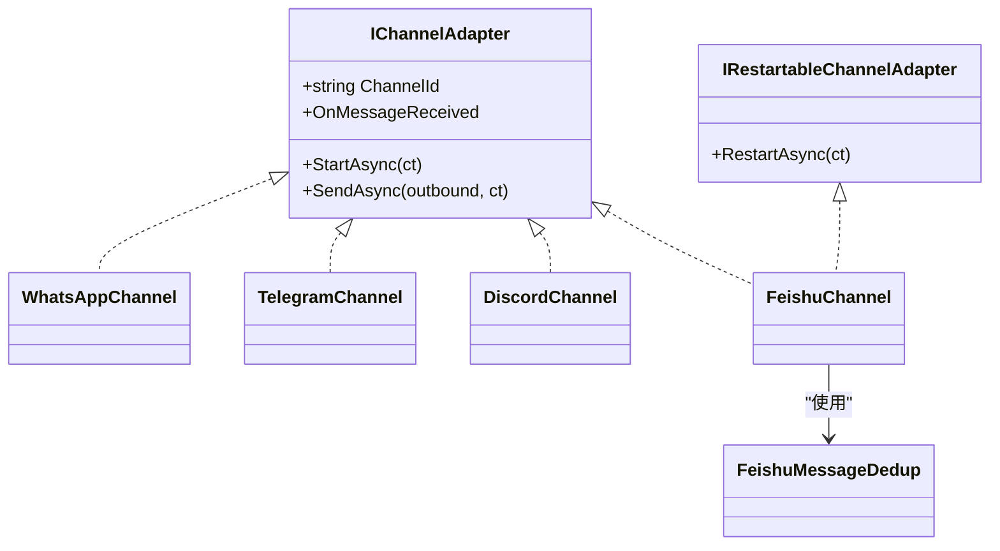
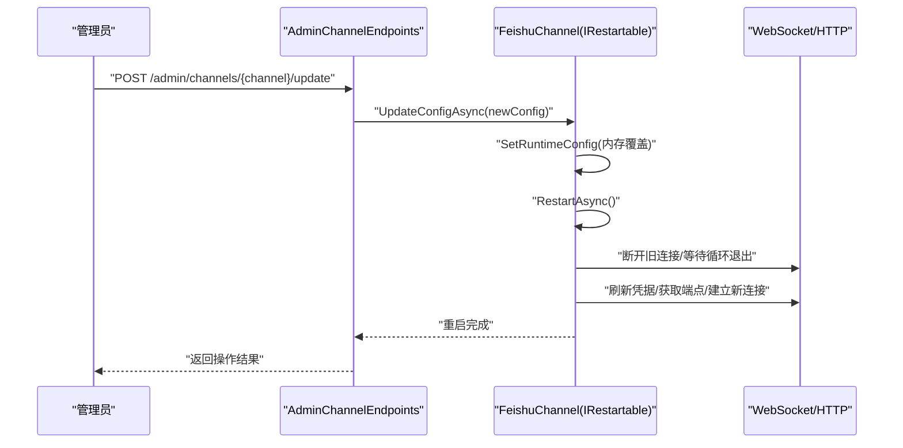
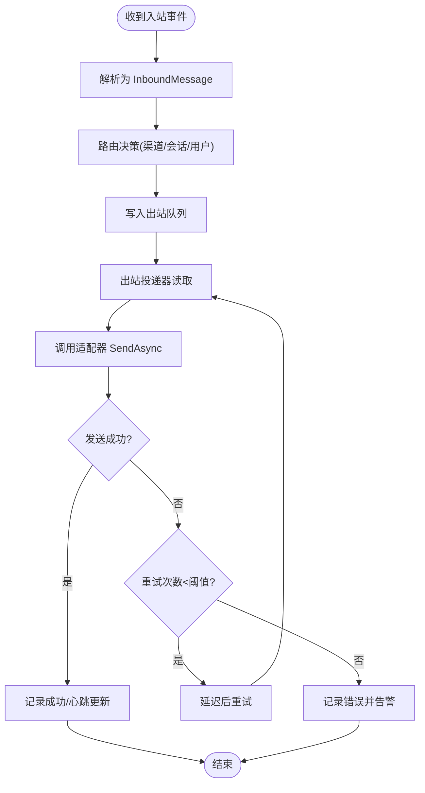
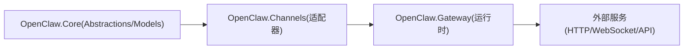

# 渠道适配器架构

<cite>
**本文档引用的文件**
- [IChannelAdapter.cs](file://src/OpenClaw.Core/Abstractions/IChannelAdapter.cs)
- [IRestartableChannelAdapter.cs](file://src/OpenClaw.Core/Abstractions/IRestartableChannelAdapter.cs)
- [Messages.cs](file://src/OpenClaw.Core/Models/Messages.cs)
- [KingcrabChannelConfigs.cs](file://src/OpenClaw.Core/Models/KingcrabChannelConfigs.cs)
- [WhatsAppChannel.cs](file://src/OpenClaw.Channels/WhatsAppChannel.cs)
- [TelegramChannel.cs](file://src/OpenClaw.Channels/TelegramChannel.cs)
- [DiscordChannel.cs](file://src/OpenClaw.Channels/DiscordChannel.cs)
- [FeishuChannel.cs](file://src/OpenClaw.Channels/FeishuChannel.cs)
- [FeishuMessageDedup.cs](file://src/OpenClaw.Channels/FeishuMessageDedup.cs)
- [GatewayOutboundDeliveryWorker.cs](file://src/OpenClaw.Gateway/Extensions/GatewayOutboundDeliveryWorker.cs)
- [PipelineExtensions.cs](file://src/OpenClaw.Gateway/Pipeline/PipelineExtensions.cs)
- [ChannelReadinessEvaluator.cs](file://src/OpenClaw.Gateway/ChannelReadinessEvaluator.cs)
- [AdminChannelEndpoints.cs](file://src/OpenClaw.Gateway/Endpoints/AdminChannelEndpoints.cs)
- [RuntimeInitializationExtensions.CompositionStages.cs](file://src/OpenClaw.Gateway/Composition/RuntimeInitializationExtensions.CompositionStages.cs)
</cite>

## 目录
1. [引言](#引言)
2. [项目结构](#项目结构)
3. [核心组件](#核心组件)
4. [架构总览](#架构总览)
5. [详细组件分析](#详细组件分析)
6. [依赖关系分析](#依赖关系分析)
7. [性能考虑](#性能考虑)
8. [故障排查指南](#故障排查指南)
9. [结论](#结论)
10. [附录](#附录)

## 引言
本文件系统化阐述渠道适配器架构的设计与实现，覆盖基础接口、消息处理流程、状态管理、生命周期与重启机制、错误处理策略以及监控指标。文档面向不同技术背景读者，既提供高层概览也包含代码级细节与图示，帮助开发者快速理解并实现自定义渠道适配器。

## 项目结构
渠道适配器位于独立的适配器库中，通过统一接口对接网关运行时，形成松耦合的消息通道抽象。核心目录与职责如下：
- 核心抽象与模型：定义渠道适配器接口、可重启能力、入出站消息模型及特定渠道配置类型
- 渠道实现：各平台官方API或协议的适配器，负责收发消息与事件处理
- 网关集成：启动阶段注册适配器、订阅入站事件、调度出站投递、评估就绪状态
- 运维与可观测：就绪评估、管理端点热重载、去重与回溯

**图表来源**
- [IChannelAdapter.cs:1-22](file://src/OpenClaw.Core/Abstractions/IChannelAdapter.cs#L1-L22)
- [IRestartableChannelAdapter.cs:1-10](file://src/OpenClaw.Core/Abstractions/IRestartableChannelAdapter.cs#L1-L10)
- [Messages.cs:1-62](file://src/OpenClaw.Core/Models/Messages.cs#L1-L62)
- [KingcrabChannelConfigs.cs:1-126](file://src/OpenClaw.Core/Models/KingcrabChannelConfigs.cs#L1-L126)
- [WhatsAppChannel.cs:1-320](file://src/OpenClaw.Channels/WhatsAppChannel.cs#L1-L320)
- [TelegramChannel.cs:1-338](file://src/OpenClaw.Channels/TelegramChannel.cs#L1-L338)
- [DiscordChannel.cs:1-504](file://src/OpenClaw.Channels/DiscordChannel.cs#L1-L504)
- [FeishuChannel.cs:1-800](file://src/OpenClaw.Channels/FeishuChannel.cs#L1-L800)
- [FeishuMessageDedup.cs:1-277](file://src/OpenClaw.Channels/FeishuMessageDedup.cs#L1-L277)
- [GatewayOutboundDeliveryWorker.cs:34-64](file://src/OpenClaw.Gateway/Extensions/GatewayOutboundDeliveryWorker.cs#L34-L64)
- [PipelineExtensions.cs:187-217](file://src/OpenClaw.Gateway/Pipeline/PipelineExtensions.cs#L187-L217)
- [ChannelReadinessEvaluator.cs:1-200](file://src/OpenClaw.Gateway/ChannelReadinessEvaluator.cs#L1-L200)
- [AdminChannelEndpoints.cs:51-71](file://src/OpenClaw.Gateway/Endpoints/AdminChannelEndpoints.cs#L51-L71)
- [RuntimeInitializationExtensions.CompositionStages.cs:283-315](file://src/OpenClaw.Gateway/Composition/RuntimeInitializationExtensions.CompositionStages.cs#L283-L315)

**章节来源**
- [IChannelAdapter.cs:1-22](file://src/OpenClaw.Core/Abstractions/IChannelAdapter.cs#L1-L22)
- [Messages.cs:1-62](file://src/OpenClaw.Core/Models/Messages.cs#L1-L62)
- [KingcrabChannelConfigs.cs:1-126](file://src/OpenClaw.Core/Models/KingcrabChannelConfigs.cs#L1-L126)

## 核心组件
- IChannelAdapter 接口：定义渠道标识、启动监听、发送消息、入站事件回调等核心能力，要求实现 AOT 兼容与低分配
- IRestartableChannelAdapter 接口：可选能力，支持运行时重启以应用配置变更
- InboundMessage/OutboundMessage：标准化入出站消息载体，承载渠道无关的上下文与媒体标记
- 渠道配置：针对特定渠道的凭据、策略与行为参数（如群组策略、@提及过滤、媒体暴露等）

关键接口与模型的职责边界清晰，便于扩展新的渠道适配器。

**章节来源**
- [IChannelAdapter.cs:1-22](file://src/OpenClaw.Core/Abstractions/IChannelAdapter.cs#L1-L22)
- [IRestartableChannelAdapter.cs:1-10](file://src/OpenClaw.Core/Abstractions/IRestartableChannelAdapter.cs#L1-L10)
- [Messages.cs:1-62](file://src/OpenClaw.Core/Models/Messages.cs#L1-L62)
- [KingcrabChannelConfigs.cs:1-126](file://src/OpenClaw.Core/Models/KingcrabChannelConfigs.cs#L1-L126)

## 架构总览
渠道适配器通过统一接口接入网关运行时，运行时负责：
- 注册与启动：遍历已注册适配器，启动监听循环
- 入站分发：订阅适配器的入站事件，转发至消息管线
- 出站投递：从队列读取 OutboundMessage，调用对应适配器发送，失败重试
- 就绪评估：基于配置校验渠道可用性与安全建议
- 热重载：对支持重启的适配器（如飞书）提供在线更新配置与重连

**图表来源**
- [PipelineExtensions.cs:187-217](file://src/OpenClaw.Gateway/Pipeline/PipelineExtensions.cs#L187-L217)
- [GatewayOutboundDeliveryWorker.cs:34-64](file://src/OpenClaw.Gateway/Extensions/GatewayOutboundDeliveryWorker.cs#L34-L64)
- [IChannelAdapter.cs:1-22](file://src/OpenClaw.Core/Abstractions/IChannelAdapter.cs#L1-L22)

## 详细组件分析

### IChannelAdapter 接口与消息模型
- 接口方法
  - ChannelId：唯一标识渠道
  - StartAsync：启动监听/连接
  - SendAsync：发送消息
  - OnMessageReceived：入站事件回调
- 消息模型
  - InboundMessage：包含 SenderId、AccountId、SessionId、Cron/Automation 上下文、文本、媒体、群组与提及等
  - OutboundMessage：目标 RecipientId、主题、回复引用等

这些抽象屏蔽了具体渠道差异，使网关侧无需关心底层协议细节。

**章节来源**
- [IChannelAdapter.cs:1-22](file://src/OpenClaw.Core/Abstractions/IChannelAdapter.cs#L1-L22)
- [Messages.cs:1-62](file://src/OpenClaw.Core/Models/Messages.cs#L1-L62)

### 渠道适配器实现模式
- 通用模式
  - 初始化凭据解析与校验
  - 启动监听/连接（HTTP/Webhook 或 WebSocket）
  - 解析入站事件为 InboundMessage 并触发 OnMessageReceived
  - 将 OutboundMessage 转换为渠道特定负载并发送
  - 错误处理与日志记录
  - 资源释放与取消令牌传递

- 具体适配器要点
  - WhatsAppChannel：Cloud API 令牌校验、媒体标记解析与限制（单附件）、文本/媒体类型映射
  - TelegramChannel：聊天ID解析、文本分片、媒体请求构造、回复消息ID解析
  - DiscordChannel：WebSocket 连接、心跳、识别/恢复、事件派发、速率限制处理
  - FeishuChannel：WebSocket 长连接、二进制帧协议、客户端心跳、两层去重、@提及过滤、媒体下载与路径标记

**图表来源**
- [IChannelAdapter.cs:1-22](file://src/OpenClaw.Core/Abstractions/IChannelAdapter.cs#L1-L22)
- [IRestartableChannelAdapter.cs:1-10](file://src/OpenClaw.Core/Abstractions/IRestartableChannelAdapter.cs#L1-L10)
- [WhatsAppChannel.cs:1-320](file://src/OpenClaw.Channels/WhatsAppChannel.cs#L1-L320)
- [TelegramChannel.cs:1-338](file://src/OpenClaw.Channels/TelegramChannel.cs#L1-L338)
- [DiscordChannel.cs:1-504](file://src/OpenClaw.Channels/DiscordChannel.cs#L1-L504)
- [FeishuChannel.cs:1-800](file://src/OpenClaw.Channels/FeishuChannel.cs#L1-L800)
- [FeishuMessageDedup.cs:1-277](file://src/OpenClaw.Channels/FeishuMessageDedup.cs#L1-L277)

**章节来源**
- [WhatsAppChannel.cs:1-320](file://src/OpenClaw.Channels/WhatsAppChannel.cs#L1-L320)
- [TelegramChannel.cs:1-338](file://src/OpenClaw.Channels/TelegramChannel.cs#L1-L338)
- [DiscordChannel.cs:1-504](file://src/OpenClaw.Channels/DiscordChannel.cs#L1-L504)
- [FeishuChannel.cs:1-800](file://src/OpenClaw.Channels/FeishuChannel.cs#L1-L800)

### 生命周期管理与重启机制
- 启动流程
  - 网关在应用启动后遍历注册的适配器，为每个适配器订阅 OnMessageReceived 并异步调用 StartAsync
  - 对于不支持重启的适配器，直接启动；对于支持重启的适配器（如 Feishu），提供热重载入口
- 重启策略
  - 取消旧任务与连接，释放资源
  - 应用新配置（内存覆盖或持久化恢复）
  - 重新建立连接与监听循环
  - 记录重启完成日志
- 管理端点
  - 提供 /admin/channels/{channel}/update 接口，支持在线更新配置并触发重启

**图表来源**
- [AdminChannelEndpoints.cs:51-71](file://src/OpenClaw.Gateway/Endpoints/AdminChannelEndpoints.cs#L51-L71)
- [FeishuChannel.cs:117-193](file://src/OpenClaw.Channels/FeishuChannel.cs#L117-L193)

**章节来源**
- [PipelineExtensions.cs:187-217](file://src/OpenClaw.Gateway/Pipeline/PipelineExtensions.cs#L187-L217)
- [AdminChannelEndpoints.cs:51-71](file://src/OpenClaw.Gateway/Endpoints/AdminChannelEndpoints.cs#L51-L71)
- [FeishuChannel.cs:124-193](file://src/OpenClaw.Channels/FeishuChannel.cs#L124-L193)

### 消息路由与状态管理
- 入站路由
  - 网关为每个适配器订阅 OnMessageReceived，统一进入消息管线
  - 管线内可结合路由配置进行进一步分发（如按渠道+发送者）
- 出站投递
  - 出站投递器循环读取队列消息，调用对应适配器 SendAsync
  - 失败时按指数退避重试，记录成功/失败统计
- 状态与去重
  - 飞书适配器采用两层去重：内存（5分钟）+磁盘（24小时），防止事件重放与重复处理
  - 去重键以应用ID命名空间隔离，避免跨账号冲突

**图表来源**
- [GatewayOutboundDeliveryWorker.cs:34-64](file://src/OpenClaw.Gateway/Extensions/GatewayOutboundDeliveryWorker.cs#L34-L64)
- [FeishuMessageDedup.cs:106-165](file://src/OpenClaw.Channels/FeishuMessageDedup.cs#L106-L165)

**章节来源**
- [GatewayOutboundDeliveryWorker.cs:34-64](file://src/OpenClaw.Gateway/Extensions/GatewayOutboundDeliveryWorker.cs#L34-L64)
- [FeishuMessageDedup.cs:1-277](file://src/OpenClaw.Channels/FeishuMessageDedup.cs#L1-L277)

### 错误处理策略
- 连接与重连
  - Discord：心跳、识别/恢复、断线指数退避重连
  - 飞书：二进制帧控制、客户端心跳、断线重连与指数退避
- 发送失败
  - 出站投递器捕获异常并重试，超过阈值后记录错误
  - 渠道内部发送方法记录警告/错误日志，必要时抛出异常
- 配置与安全
  - 就绪评估检查凭据、签名验证、公开绑定的安全建议
  - 管理端点支持在线更新配置，降低维护中断风险

**章节来源**
- [DiscordChannel.cs:122-161](file://src/OpenClaw.Channels/DiscordChannel.cs#L122-L161)
- [FeishuChannel.cs:213-262](file://src/OpenClaw.Channels/FeishuChannel.cs#L213-L262)
- [GatewayOutboundDeliveryWorker.cs:34-64](file://src/OpenClaw.Gateway/Extensions/GatewayOutboundDeliveryWorker.cs#L34-L64)
- [ChannelReadinessEvaluator.cs:1-200](file://src/OpenClaw.Gateway/ChannelReadinessEvaluator.cs#L1-L200)

### 监控指标与可观测性
- 就绪状态
  - 评估各渠道配置与安全设置，输出 Ready/Misconfigured/Degraded 状态
- 运行时观测
  - 审计与事件序列构建、渠道漂移度量（非 Ready 数量）
- 管理端点
  - 提供渠道配置查询与更新接口，支持在线热重载

**章节来源**
- [ChannelReadinessEvaluator.cs:1-200](file://src/OpenClaw.Gateway/ChannelReadinessEvaluator.cs#L1-L200)
- [AdminChannelEndpoints.cs:51-71](file://src/OpenClaw.Gateway/Endpoints/AdminChannelEndpoints.cs#L51-L71)

## 依赖关系分析
- 组件耦合
  - 渠道适配器依赖核心抽象与模型，不直接依赖网关内部实现
  - 网关通过统一接口与事件与适配器交互，降低耦合度
- 内聚性
  - 每个适配器封装自身协议细节，内聚于单一渠道
- 循环依赖
  - 无直接循环依赖；适配器与网关通过接口解耦
- 外部依赖
  - HTTP 客户端、WebSocket、JSON 序列化、凭据解析与令牌刷新

**图表来源**
- [IChannelAdapter.cs:1-22](file://src/OpenClaw.Core/Abstractions/IChannelAdapter.cs#L1-L22)
- [RuntimeInitializationExtensions.CompositionStages.cs:283-315](file://src/OpenClaw.Gateway/Composition/RuntimeInitializationExtensions.CompositionStages.cs#L283-L315)

**章节来源**
- [RuntimeInitializationExtensions.CompositionStages.cs:283-315](file://src/OpenClaw.Gateway/Composition/RuntimeInitializationExtensions.CompositionStages.cs#L283-L315)

## 性能考虑
- AOT 与低分配
  - 接口与模型标注 AOT 兼容，减少 GC 压力
- I/O 优化
  - 适配器复用 HTTP 客户端，避免频繁创建销毁
  - WebSocket 长连接与心跳维持，降低握手开销
- 去重与缓存
  - 飞书两层去重减少重复处理与网络往返
- 限流与退避
  - 出站重试与渠道内部速率限制处理，避免雪崩

[本节为通用指导，无需列出具体文件来源]

## 故障排查指南
- 渠道未启动
  - 检查就绪评估报告，确认凭据、签名验证、绑定地址等要求
- 发送失败
  - 查看出站投递器日志，确认重试次数与最终错误
  - 检查渠道 API 返回码与限流头信息
- 入站不达
  - 确认适配器 OnMessageReceived 是否被订阅
  - 检查网关启动阶段是否调用 StartAsync
- 飞书重复消息
  - 检查去重存储目录与磁盘空间
  - 确认消息 ID 去重是否命中

**章节来源**
- [ChannelReadinessEvaluator.cs:1-200](file://src/OpenClaw.Gateway/ChannelReadinessEvaluator.cs#L1-L200)
- [GatewayOutboundDeliveryWorker.cs:34-64](file://src/OpenClaw.Gateway/Extensions/GatewayOutboundDeliveryWorker.cs#L34-L64)
- [FeishuMessageDedup.cs:1-277](file://src/OpenClaw.Channels/FeishuMessageDedup.cs#L1-L277)

## 结论
渠道适配器架构通过统一接口与标准化消息模型，实现了多渠道的高内聚、低耦合接入。配合运行时的启动注册、事件订阅、出站投递与就绪评估，形成了完整的生命周期管理与可观测体系。支持重启的适配器（如飞书）进一步提升了运维效率。遵循本文档的实现模式，可快速扩展新的渠道适配器。

## 附录

### 实现自定义渠道适配器步骤
- 设计配置模型（凭据、策略、限额等）
- 实现 IChannelAdapter 接口
  - 在 StartAsync 中建立连接/监听
  - 在 SendAsync 中将 OutboundMessage 转换为渠道负载
  - 在入站事件中构造 InboundMessage 并触发 OnMessageReceived
- 如需热重载，实现 IRestartableChannelAdapter
- 在网关中注册适配器并订阅 OnMessageReceived
- 编写就绪评估与管理端点支持

**章节来源**
- [IChannelAdapter.cs:1-22](file://src/OpenClaw.Core/Abstractions/IChannelAdapter.cs#L1-L22)
- [IRestartableChannelAdapter.cs:1-10](file://src/OpenClaw.Core/Abstractions/IRestartableChannelAdapter.cs#L1-L10)
- [KingcrabChannelConfigs.cs:1-126](file://src/OpenClaw.Core/Models/KingcrabChannelConfigs.cs#L1-L126)
- [PipelineExtensions.cs:187-217](file://src/OpenClaw.Gateway/Pipeline/PipelineExtensions.cs#L187-L217)
- [AdminChannelEndpoints.cs:51-71](file://src/OpenClaw.Gateway/Endpoints/AdminChannelEndpoints.cs#L51-L71)