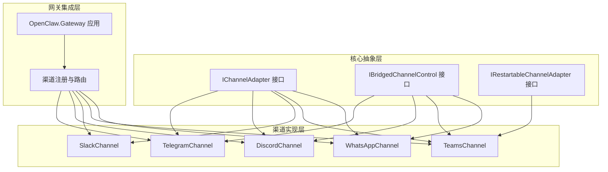
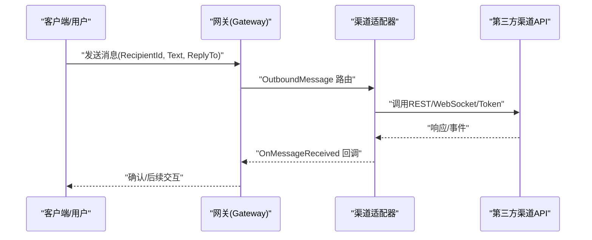
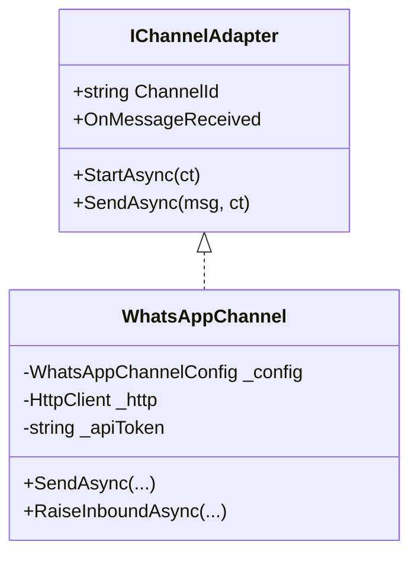
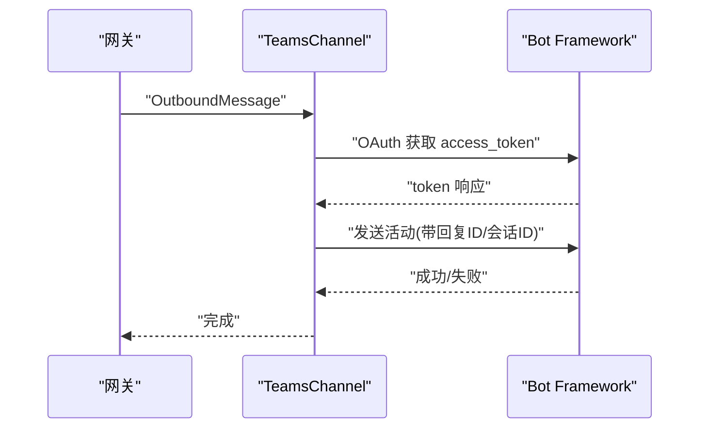
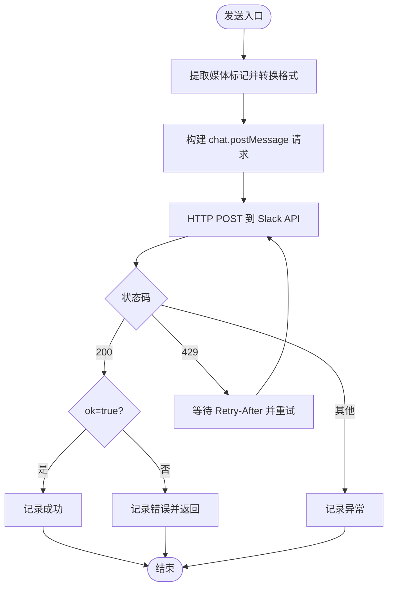
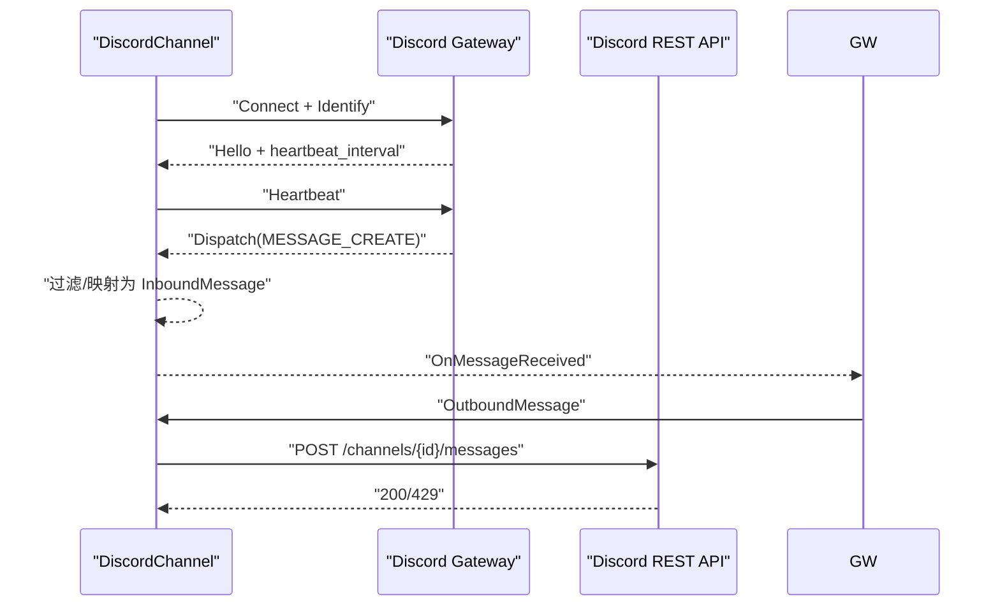
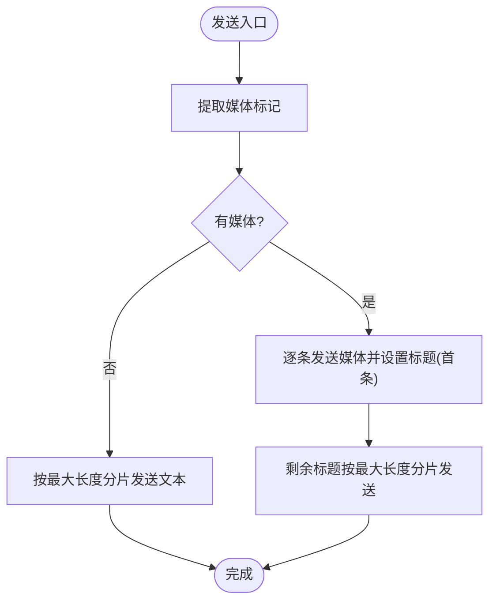
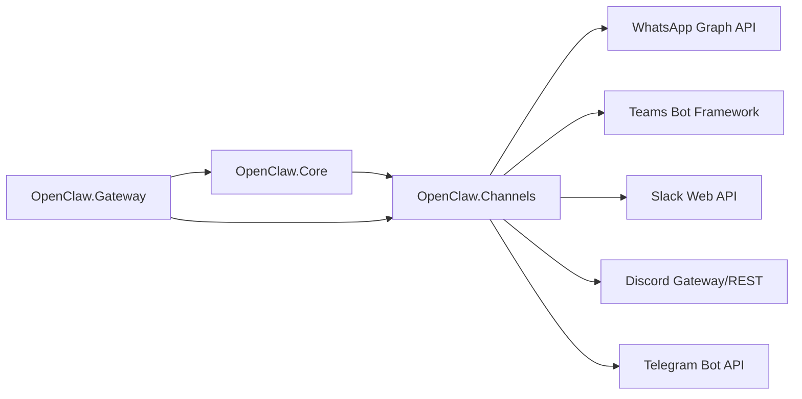

# 通信渠道

<cite>
**本文引用的文件**
- [OpenClaw.Channels.csproj](file://src/OpenClaw.Channels/OpenClaw.Channels.csproj)
- [IChannelAdapter.cs](file://src/OpenClaw.Core/Abstractions/IChannelAdapter.cs)
- [IBridgedChannelControl.cs](file://src/OpenClaw.Core/Abstractions/IBridgedChannelControl.cs)
- [IRestartableChannelAdapter.cs](file://src/OpenClaw.Core/Abstractions/IRestartableChannelAdapter.cs)
- [WhatsAppChannel.cs](file://src/OpenClaw.Channels/WhatsAppChannel.cs)
- [TeamsChannel.cs](file://src/OpenClaw.Channels/TeamsChannel.cs)
- [SlackChannel.cs](file://src/OpenClaw.Channels/SlackChannel.cs)
- [DiscordChannel.cs](file://src/OpenClaw.Channels/DiscordChannel.cs)
- [TelegramChannel.cs](file://src/OpenClaw.Channels/TelegramChannel.cs)
- [OpenClaw.Gateway.csproj](file://src/OpenClaw.Gateway/OpenClaw.Gateway.csproj)
</cite>

## 目录
1. [简介](#简介)
2. [项目结构](#项目结构)
3. [核心组件](#核心组件)
4. [架构总览](#架构总览)
5. [详细组件分析](#详细组件分析)
6. [依赖关系分析](#依赖关系分析)
7. [性能考量](#性能考量)
8. [故障排除指南](#故障排除指南)
9. [结论](#结论)
10. [附录](#附录)

## 简介
本文件面向“通信渠道系统”的技术文档，聚焦于渠道适配器的架构设计、消息路由机制与状态同步能力。内容覆盖 WhatsApp、Teams、Slack、Discord、Telegram 等主流渠道的集成方式、配置要点、部署要求、安全配置与故障排除，并对各渠道的功能特性与使用限制进行说明。

## 项目结构
通信渠道系统由三层组成：
- 核心抽象层：定义渠道适配器统一接口与可选能力（如可重启、桥接控制）。
- 渠道实现层：针对不同平台的具体适配器实现。
- 网关集成层：在网关中注册渠道、处理入站 Webhook、转发出站消息并维护会话状态。

**图表来源**
- [IChannelAdapter.cs:9-21](file://src/OpenClaw.Core/Abstractions/IChannelAdapter.cs#L9-L21)
- [IBridgedChannelControl.cs:5-11](file://src/OpenClaw.Core/Abstractions/IBridgedChannelControl.cs#L5-L11)
- [IRestartableChannelAdapter.cs:6-9](file://src/OpenClaw.Core/Abstractions/IRestartableChannelAdapter.cs#L6-L9)
- [WhatsAppChannel.cs:14-31](file://src/OpenClaw.Channels/WhatsAppChannel.cs#L14-L31)
- [TeamsChannel.cs:21-52](file://src/OpenClaw.Channels/TeamsChannel.cs#L21-L52)
- [SlackChannel.cs:19-34](file://src/OpenClaw.Channels/SlackChannel.cs#L19-L34)
- [DiscordChannel.cs:21-59](file://src/OpenClaw.Channels/DiscordChannel.cs#L21-L59)
- [TelegramChannel.cs:18-44](file://src/OpenClaw.Channels/TelegramChannel.cs#L18-L44)
- [OpenClaw.Gateway.csproj:26-34](file://src/OpenClaw.Gateway/OpenClaw.Gateway.csproj#L26-L34)

**章节来源**
- [OpenClaw.Channels.csproj:1-14](file://src/OpenClaw.Channels/OpenClaw.Channels.csproj#L1-L14)
- [OpenClaw.Gateway.csproj:26-34](file://src/OpenClaw.Gateway/OpenClaw.Gateway.csproj#L26-L34)

## 核心组件
- IChannelAdapter：渠道适配器统一接口，定义启动监听、发送消息与入站事件回调。
- IBridgedChannelControl：扩展接口，支持打字指示、已读回执等桥接能力。
- IRestartableChannelAdapter：可选能力，允许运行时重启适配器以恢复连接或切换配置。
- 各渠道适配器：实现 IChannelAdapter；部分实现 IBridgedChannelControl 或 IRestartableChannelAdapter。

关键职责与约束：
- AOT 兼容性与低分配：注释明确要求适配器实现需满足 AOT 兼容与内存友好。
- 安全配置：通过 SecretResolver 解析密钥，避免硬编码敏感信息。
- 消息协议：统一使用 OutboundMessage/InboundMessage 进行消息编解码与路由。

**章节来源**
- [IChannelAdapter.cs:9-21](file://src/OpenClaw.Core/Abstractions/IChannelAdapter.cs#L9-L21)
- [IBridgedChannelControl.cs:5-11](file://src/OpenClaw.Core/Abstractions/IBridgedChannelControl.cs#L5-L11)
- [IRestartableChannelAdapter.cs:6-9](file://src/OpenClaw.Core/Abstractions/IRestartableChannelAdapter.cs#L6-L9)

## 架构总览
下图展示从网关到各渠道适配器的消息流与状态同步路径：

**图表来源**
- [WhatsAppChannel.cs:40-70](file://src/OpenClaw.Channels/WhatsAppChannel.cs#L40-L70)
- [TeamsChannel.cs:63-110](file://src/OpenClaw.Channels/TeamsChannel.cs#L63-L110)
- [SlackChannel.cs:44-91](file://src/OpenClaw.Channels/SlackChannel.cs#L44-L91)
- [DiscordChannel.cs:75-120](file://src/OpenClaw.Channels/DiscordChannel.cs#L75-L120)
- [TelegramChannel.cs:54-124](file://src/OpenClaw.Channels/TelegramChannel.cs#L54-L124)

## 详细组件分析

### WhatsApp 渠道
- 角色定位：官方 WhatsApp Business Cloud API 的适配器。
- 关键能力：
  - 发送文本与单媒体附件（图片/视频/音频/文档/贴图），自动截取首张媒体并设置标题（若支持）。
  - 支持回复上下文消息（ReplyToMessageId）。
  - 使用 JSON 序列化上下文进行高效编解码。
- 配置要点：
  - 必填：PhoneNumberId、CloudApiToken 或 CloudApiTokenRef。
  - 媒体链接必须为绝对 http(s) URL。
- 安全与错误：
  - 缺少令牌或配置不完整将抛出异常。
  - 异常日志记录便于排障。

**图表来源**
- [IChannelAdapter.cs:9-21](file://src/OpenClaw.Core/Abstractions/IChannelAdapter.cs#L9-L21)
- [WhatsAppChannel.cs:14-31](file://src/OpenClaw.Channels/WhatsAppChannel.cs#L14-L31)

**章节来源**
- [WhatsAppChannel.cs:14-31](file://src/OpenClaw.Channels/WhatsAppChannel.cs#L14-L31)
- [WhatsAppChannel.cs:40-70](file://src/OpenClaw.Channels/WhatsAppChannel.cs#L40-L70)
- [WhatsAppChannel.cs:85-138](file://src/OpenClaw.Channels/WhatsAppChannel.cs#L85-L138)

### Teams 渠道
- 角色定位：通过 Azure Bot Framework REST API 发送消息，入站通过 Webhook 存储对话引用。
- 关键能力：
  - Proactive 消息：基于存储的对话引用向任意接收者发送。
  - 文本分片：根据配置策略（整体/按换行）拆分长文本。
  - 回复样式：支持线程回复（ReplyStyle="thread"）。
  - OAuth 令牌缓存与并发保护：避免重复获取令牌。
- 配置要点：
  - 必填：AppId/AppPassword/TenantId（可通过引用解析）。
  - 需先收到入站消息以建立对话引用，否则无法主动发送。
- 安全与错误：
  - 令牌获取失败或空响应将抛出异常。
  - 对话引用按发送者 ID 与会话 ID 双键存储，支持群聊路由。

**图表来源**
- [TeamsChannel.cs:63-110](file://src/OpenClaw.Channels/TeamsChannel.cs#L63-L110)
- [TeamsChannel.cs:138-175](file://src/OpenClaw.Channels/TeamsChannel.cs#L138-L175)

**章节来源**
- [TeamsChannel.cs:21-52](file://src/OpenClaw.Channels/TeamsChannel.cs#L21-L52)
- [TeamsChannel.cs:63-110](file://src/OpenClaw.Channels/TeamsChannel.cs#L63-L110)
- [TeamsChannel.cs:116-122](file://src/OpenClaw.Channels/TeamsChannel.cs#L116-L122)
- [TeamsChannel.cs:138-175](file://src/OpenClaw.Channels/TeamsChannel.cs#L138-L175)

### Slack 渠道
- 角色定位：Slack Web API 适配器，入站通过网关 Webhook 处理。
- 关键能力：
  - Markdown 到 mrkdwn 转换。
  - 线程回复（thread_ts）。
  - 速率限制处理（Retry-After）。
- 配置要点：
  - 必填：BotToken 或 BotTokenRef。
- 安全与错误：
  - API 返回 ok=false 时记录错误原因。
  - 429 场景记录重试等待时间。

**图表来源**
- [SlackChannel.cs:44-91](file://src/OpenClaw.Channels/SlackChannel.cs#L44-L91)

**章节来源**
- [SlackChannel.cs:19-34](file://src/OpenClaw.Channels/SlackChannel.cs#L19-L34)
- [SlackChannel.cs:44-91](file://src/OpenClaw.Channels/SlackChannel.cs#L44-L91)
- [SlackChannel.cs:96-109](file://src/OpenClaw.Channels/SlackChannel.cs#L96-L109)

### Discord 渠道
- 角色定位：使用 Gateway WebSocket 接收消息，REST API 发送消息。
- 关键能力：
  - Gateway 连接管理：Hello/Heartbeat/Resume/Reconnect/Invalid Session 处理。
  - Slash 命令注册（可选）。
  - 入站过滤：支持按服务器/频道/用户白名单与字符数限制。
  - 出站分片与速率限制退避。
- 配置要点：
  - 必填：BotToken；可选 ApplicationId（用于命令注册）。
  - 可配置 AllowedGuildIds/AllowedChannelIds/AllowedFromUserIds/MaxInboundChars。
- 安全与错误：
  - 识别/续连失败自动重试与指数退避。
  - 429 自动等待后重发。

**图表来源**
- [DiscordChannel.cs:122-161](file://src/OpenClaw.Channels/DiscordChannel.cs#L122-L161)
- [DiscordChannel.cs:163-238](file://src/OpenClaw.Channels/DiscordChannel.cs#L163-L238)
- [DiscordChannel.cs:279-373](file://src/OpenClaw.Channels/DiscordChannel.cs#L279-L373)
- [DiscordChannel.cs:375-396](file://src/OpenClaw.Channels/DiscordChannel.cs#L375-L396)

**章节来源**
- [DiscordChannel.cs:21-59](file://src/OpenClaw.Channels/DiscordChannel.cs#L21-L59)
- [DiscordChannel.cs:66-73](file://src/OpenClaw.Channels/DiscordChannel.cs#L66-L73)
- [DiscordChannel.cs:122-161](file://src/OpenClaw.Channels/DiscordChannel.cs#L122-L161)
- [DiscordChannel.cs:279-373](file://src/OpenClaw.Channels/DiscordChannel.cs#L279-L373)
- [DiscordChannel.cs:375-396](file://src/OpenClaw.Channels/DiscordChannel.cs#L375-L396)

### Telegram 渠道
- 角色定位：Telegram Bot API 适配器，入站通过网关 Webhook 调用。
- 关键能力：
  - 文本分片（最大 4096 字符）。
  - 媒体发送与标题（最多一条媒体可带标题，超过 1024 字符截断）。
  - 回复消息（ReplyToMessageId）。
- 配置要点：
  - 必填：BotToken 或 BotTokenRef。
  - 接收方必须为合法的聊天标识（数字 ID 或公共用户名）。
- 安全与错误：
  - 非法回复 ID 将被忽略并记录警告。
  - 异常统一记录日志。

**图表来源**
- [TelegramChannel.cs:54-124](file://src/OpenClaw.Channels/TelegramChannel.cs#L54-L124)

**章节来源**
- [TelegramChannel.cs:18-44](file://src/OpenClaw.Channels/TelegramChannel.cs#L18-L44)
- [TelegramChannel.cs:54-124](file://src/OpenClaw.Channels/TelegramChannel.cs#L54-L124)
- [TelegramChannel.cs:169-179](file://src/OpenClaw.Channels/TelegramChannel.cs#L169-L179)

## 依赖关系分析
- 组件耦合：
  - 渠道适配器依赖核心抽象（IChannelAdapter/IBridgedChannelControl/IRestartableChannelAdapter）。
  - 渠道适配器依赖安全模块（SecretResolver）解析密钥。
  - 渠道适配器依赖 HTTP 工厂（HttpClientFactory）或注入的 HttpClient。
- 外部依赖：
  - 各渠道分别对接第三方 API（Graph API、Bot Framework、Slack API、Discord API、Telegram API）。
- 网关集成：
  - Gateway 项目引用 Channels 与 Core，负责注册渠道、路由消息与维护会话状态。

**图表来源**
- [OpenClaw.Gateway.csproj:26-34](file://src/OpenClaw.Gateway/OpenClaw.Gateway.csproj#L26-L34)
- [OpenClaw.Channels.csproj:6-12](file://src/OpenClaw.Channels/OpenClaw.Channels.csproj#L6-L12)
- [WhatsAppChannel.cs:1-31](file://src/OpenClaw.Channels/WhatsAppChannel.cs#L1-L31)
- [TeamsChannel.cs:1-52](file://src/OpenClaw.Channels/TeamsChannel.cs#L1-L52)
- [SlackChannel.cs:1-34](file://src/OpenClaw.Channels/SlackChannel.cs#L1-L34)
- [DiscordChannel.cs:1-59](file://src/OpenClaw.Channels/DiscordChannel.cs#L1-L59)
- [TelegramChannel.cs:1-44](file://src/OpenClaw.Channels/TelegramChannel.cs#L1-L44)

**章节来源**
- [OpenClaw.Gateway.csproj:26-34](file://src/OpenClaw.Gateway/OpenClaw.Gateway.csproj#L26-L34)
- [OpenClaw.Channels.csproj:6-12](file://src/OpenClaw.Channels/OpenClaw.Channels.csproj#L6-L12)

## 性能考量
- AOT 与低分配：适配器实现遵循 AOT 兼容与低分配原则，减少 GC 压力。
- 速率限制与退避：Discord/Slack 提供 429 处理与指数退避；Teams/Telegram 采用分片与最小必要请求。
- 令牌缓存：Teams 采用并发安全的令牌缓存与延迟刷新，降低鉴权开销。
- 会话映射：Discord 基于线程/私聊/群组生成会话 ID，减少跨频道混淆。

## 故障排除指南
- WhatsApp
  - 症状：发送失败或无响应。
  - 排查：检查 PhoneNumberId 与 CloudApiToken 是否正确配置；确认媒体链接为 http(s) 绝对地址。
  - 参考
    - [WhatsAppChannel.cs:27-31](file://src/OpenClaw.Channels/WhatsAppChannel.cs#L27-L31)
    - [WhatsAppChannel.cs:59-70](file://src/OpenClaw.Channels/WhatsAppChannel.cs#L59-L70)
- Teams
  - 症状：无法主动发送消息。
  - 排查：确保已收到入站消息以建立对话引用；核对 AppId/AppPassword/TenantId。
  - 参考
    - [TeamsChannel.cs:46-52](file://src/OpenClaw.Channels/TeamsChannel.cs#L46-L52)
    - [TeamsChannel.cs:67-72](file://src/OpenClaw.Channels/TeamsChannel.cs#L67-L72)
    - [TeamsChannel.cs:138-175](file://src/OpenClaw.Channels/TeamsChannel.cs#L138-L175)
- Slack
  - 症状：429 或返回 ok=false。
  - 排查：读取 Retry-After 并等待；检查错误字段定位问题。
  - 参考
    - [SlackChannel.cs:66-83](file://src/OpenClaw.Channels/SlackChannel.cs#L66-L83)
- Discord
  - 症状：连接中断/消息丢失。
  - 排查：检查 Bot 权限与意图（消息内容/直接消息/服务器消息）；查看重连与续连流程。
  - 参考
    - [DiscordChannel.cs:253-257](file://src/OpenClaw.Channels/DiscordChannel.cs#L253-L257)
    - [DiscordChannel.cs:200-221](file://src/OpenClaw.Channels/DiscordChannel.cs#L200-L221)
- Telegram
  - 症状：媒体发送失败或标题未显示。
  - 排查：确认聊天 ID 格式；仅首条媒体可带标题且长度限制；非数字回复 ID 将被忽略。
  - 参考
    - [TelegramChannel.cs:58-62](file://src/OpenClaw.Channels/TelegramChannel.cs#L58-L62)
    - [TelegramChannel.cs:92-118](file://src/OpenClaw.Channels/TelegramChannel.cs#L92-L118)
    - [TelegramChannel.cs:170-179](file://src/OpenClaw.Channels/TelegramChannel.cs#L170-L179)

## 结论
该通信渠道系统通过统一的适配器接口与可选能力，实现了对多渠道的一致接入与扩展。结合网关的路由与状态管理，系统具备良好的可维护性与可演进性。建议在生产环境严格配置密钥与速率限制策略，并针对各渠道特性进行针对性优化与监控。

## 附录
- 部署要求概要
  - Gateway 项目包含对各渠道 SDK 的引用与静态资源集成，确保发布产物包含仪表盘与渠道所需依赖。
  - 渠道适配器均通过构造函数注入 HttpClient 与日志器，便于测试与替换。
- 安全配置建议
  - 所有令牌与密钥通过 SecretResolver 解析，避免硬编码。
  - Teams/WhatsApp/Slack/Discord/Telegram 均要求严格的权限与范围配置。
- 渠道特性与限制速览
  - WhatsApp：单媒体附件、绝对 http(s) 链接、Business API。
  - Teams：需先入站建立会话引用，支持线程回复与文本分片。
  - Slack：Markdown 转换、线程回复、429 重试。
  - Discord：Gateway+REST、意图与白名单、Slash 命令注册。
  - Telegram：文本分片、媒体标题限制、聊天 ID 校验。

**章节来源**
- [OpenClaw.Gateway.csproj:49-71](file://src/OpenClaw.Gateway/OpenClaw.Gateway.csproj#L49-L71)
- [OpenClaw.Gateway.csproj:94-141](file://src/OpenClaw.Gateway/OpenClaw.Gateway.csproj#L94-L141)
- [WhatsAppChannel.cs:140-157](file://src/OpenClaw.Channels/WhatsAppChannel.cs#L140-L157)
- [TeamsChannel.cs:177-206](file://src/OpenClaw.Channels/TeamsChannel.cs#L177-L206)
- [SlackChannel.cs:96-109](file://src/OpenClaw.Channels/SlackChannel.cs#L96-L109)
- [DiscordChannel.cs:253-257](file://src/OpenClaw.Channels/DiscordChannel.cs#L253-L257)
- [TelegramChannel.cs:20-21](file://src/OpenClaw.Channels/TelegramChannel.cs#L20-L21)
- [TelegramChannel.cs:92-96](file://src/OpenClaw.Channels/TelegramChannel.cs#L92-L96)