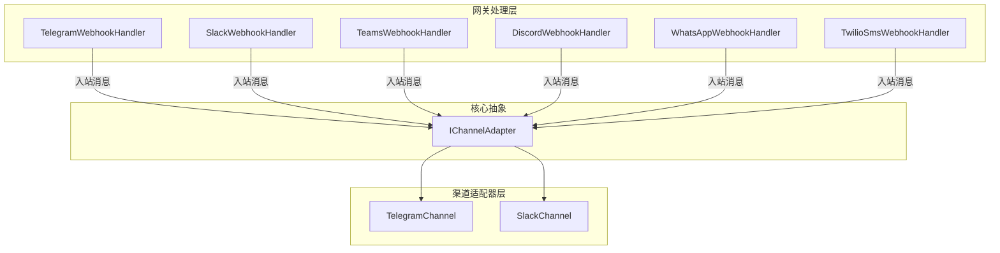
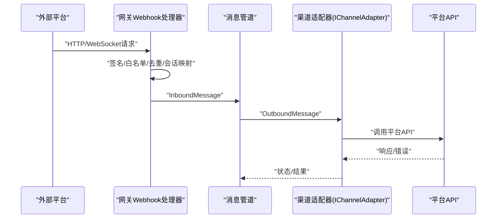
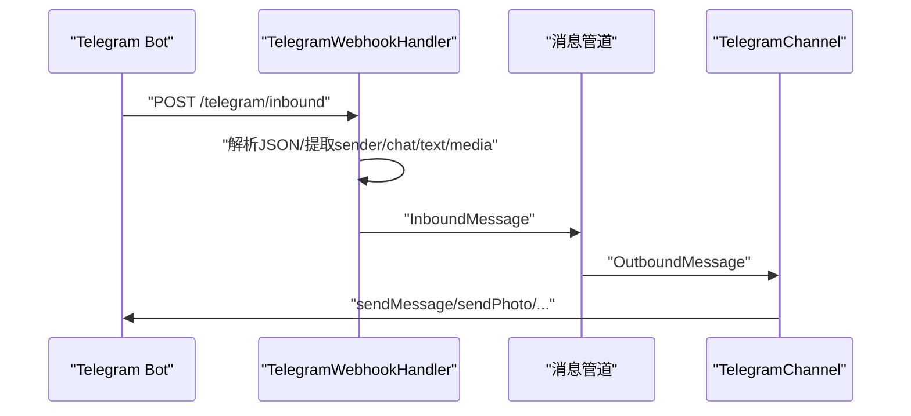
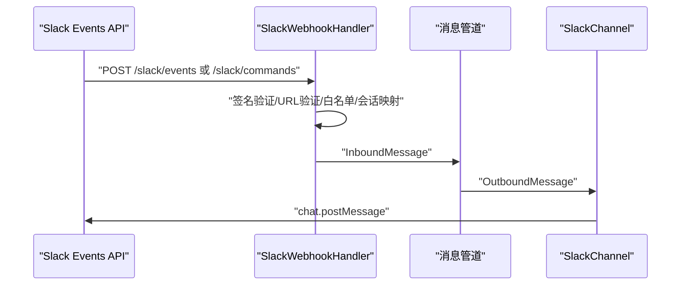
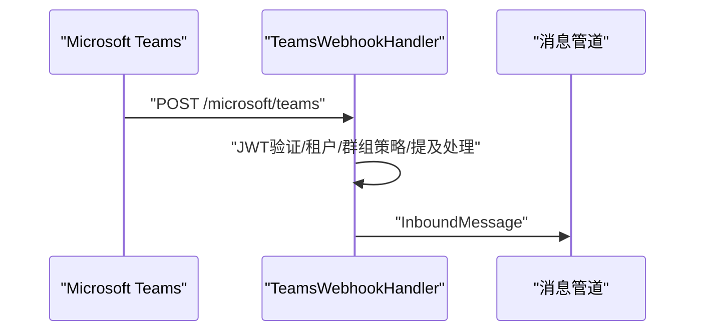
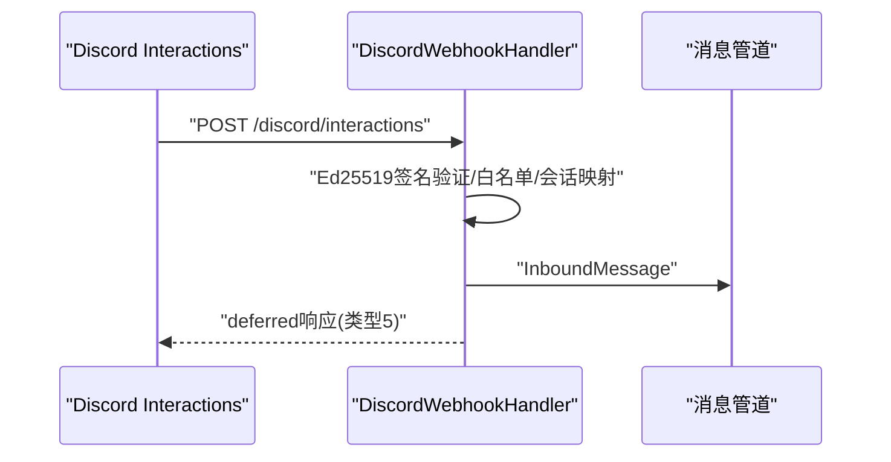
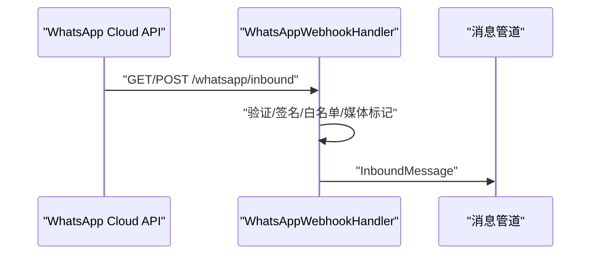
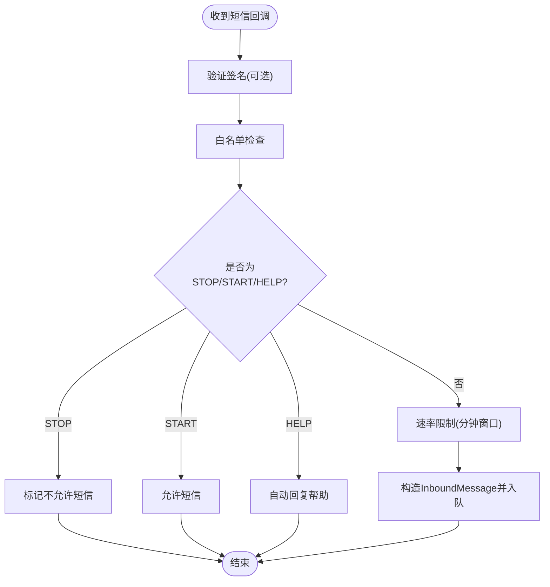
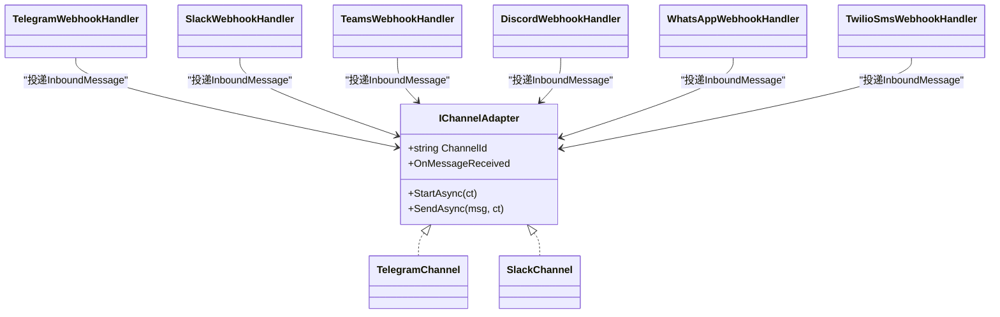

# 通信渠道

<cite>
**本文引用的文件**
- [OpenClaw.Channels.csproj](file://src/OpenClaw.Channels/OpenClaw.Channels.csproj)
- [IChannelAdapter.cs](file://src/OpenClaw.Core/Abstractions/IChannelAdapter.cs)
- [TelegramChannel.cs](file://src/OpenClaw.Channels/TelegramChannel.cs)
- [SlackChannel.cs](file://src/OpenClaw.Channels/SlackChannel.cs)
- [TelegramWebhookHandler.cs](file://src/OpenClaw.Gateway/TelegramWebhookHandler.cs)
- [SlackWebhookHandler.cs](file://src/OpenClaw.Gateway/SlackWebhookHandler.cs)
- [TeamsWebhookHandler.cs](file://src/OpenClaw.Gateway/TeamsWebhookHandler.cs)
- [DiscordWebhookHandler.cs](file://src/OpenClaw.Gateway/DiscordWebhookHandler.cs)
- [WhatsAppWebhookHandler.cs](file://src/OpenClaw.Gateway/WhatsAppWebhookHandler.cs)
- [TwilioSmsWebhookHandler.cs](file://src/OpenClaw.Gateway/TwilioSmsWebhookHandler.cs)
</cite>

## 目录
1. [简介](#简介)
2. [项目结构](#项目结构)
3. [核心组件](#核心组件)
4. [架构总览](#架构总览)
5. [详细组件分析](#详细组件分析)
6. [依赖关系分析](#依赖关系分析)
7. [性能考虑](#性能考虑)
8. [故障排除指南](#故障排除指南)
9. [结论](#结论)

## 简介
本文件面向通信渠道系统的开发者与运维人员，系统性阐述渠道架构设计、适配器模式实现与各即时通讯渠道（Telegram、WhatsApp、Slack、Teams、Discord、SMS/Twilio）的集成方案。内容覆盖认证配置、Webhook 设置、消息处理流程、速率限制与错误处理、安全策略、以及渠道与代理运行时的集成方式和消息路由、状态管理机制。

## 项目结构
- 渠道适配器位于 OpenClaw.Channels 命名空间，统一实现 IChannelAdapter 接口，负责对外发送消息。
- 网关层（OpenClaw.Gateway）负责接收各平台的 Webhook，进行签名验证、白名单过滤、去重与会话映射，并将标准化的 InboundMessage 投递到消息管道。
- 核心抽象 IChannelAdapter 定义了 StartAsync、SendAsync 与 OnMessageReceived 事件，确保所有渠道具备一致的生命周期与消息发送能力。

**图表来源**
- [TelegramChannel.cs:18-52](file://src/OpenClaw.Channels/TelegramChannel.cs#L18-L52)
- [SlackChannel.cs:19-42](file://src/OpenClaw.Channels/SlackChannel.cs#L19-L42)
- [TelegramWebhookHandler.cs:47-103](file://src/OpenClaw.Gateway/TelegramWebhookHandler.cs#L47-L103)
- [SlackWebhookHandler.cs:42-154](file://src/OpenClaw.Gateway/SlackWebhookHandler.cs#L42-L154)
- [TeamsWebhookHandler.cs:42-188](file://src/OpenClaw.Gateway/TeamsWebhookHandler.cs#L42-L188)
- [DiscordWebhookHandler.cs:52-158](file://src/OpenClaw.Gateway/DiscordWebhookHandler.cs#L52-L158)
- [WhatsAppWebhookHandler.cs:35-60](file://src/OpenClaw.Gateway/WhatsAppWebhookHandler.cs#L35-L60)
- [TwilioSmsWebhookHandler.cs:86-162](file://src/OpenClaw.Gateway/TwilioSmsWebhookHandler.cs#L86-L162)
- [IChannelAdapter.cs:9-21](file://src/OpenClaw.Core/Abstractions/IChannelAdapter.cs#L9-L21)

**章节来源**
- [OpenClaw.Channels.csproj:1-14](file://src/OpenClaw.Channels/OpenClaw.Channels.csproj#L1-L14)
- [IChannelAdapter.cs:9-21](file://src/OpenClaw.Core/Abstractions/IChannelAdapter.cs#L9-L21)

## 核心组件
- IChannelAdapter：定义渠道适配器的统一接口，包含启动、发送与入站事件回调。
- 渠道适配器：具体实现各平台的消息发送逻辑，如 TelegramChannel、SlackChannel。
- 网关 Webhook 处理器：解析各平台的 Webhook 请求，执行签名验证、白名单过滤、会话映射与消息投递。

**章节来源**
- [IChannelAdapter.cs:9-21](file://src/OpenClaw.Core/Abstractions/IChannelAdapter.cs#L9-L21)
- [TelegramChannel.cs:18-52](file://src/OpenClaw.Channels/TelegramChannel.cs#L18-L52)
- [SlackChannel.cs:19-42](file://src/OpenClaw.Channels/SlackChannel.cs#L19-L42)

## 架构总览
下图展示了从外部平台到内部消息管道的整体数据流：外部平台通过 Webhook 或长连接接入，网关层完成安全与合规校验后，生成标准化 InboundMessage 并投递至消息管道；渠道适配器负责将 OutboundMessage 发送至对应平台。

**图表来源**
- [TelegramWebhookHandler.cs:47-103](file://src/OpenClaw.Gateway/TelegramWebhookHandler.cs#L47-L103)
- [SlackWebhookHandler.cs:42-154](file://src/OpenClaw.Gateway/SlackWebhookHandler.cs#L42-L154)
- [TeamsWebhookHandler.cs:42-188](file://src/OpenClaw.Gateway/TeamsWebhookHandler.cs#L42-L188)
- [DiscordWebhookHandler.cs:52-158](file://src/OpenClaw.Gateway/DiscordWebhookHandler.cs#L52-L158)
- [WhatsAppWebhookHandler.cs:35-60](file://src/OpenClaw.Gateway/WhatsAppWebhookHandler.cs#L35-L60)
- [TwilioSmsWebhookHandler.cs:86-162](file://src/OpenClaw.Gateway/TwilioSmsWebhookHandler.cs#L86-L162)
- [TelegramChannel.cs:54-124](file://src/OpenClaw.Channels/TelegramChannel.cs#L54-L124)
- [SlackChannel.cs:44-91](file://src/OpenClaw.Channels/SlackChannel.cs#L44-L91)

## 详细组件分析

### Telegram 集成
- 入站处理：网关 TelegramWebhookHandler 解析 Telegram 更新，提取聊天 ID、发送者信息、文本与媒体标记，执行白名单与长度截断，最终生成 InboundMessage。
- 出站发送：TelegramChannel 将文本与媒体标记分离，按平台限制分片发送，支持回复消息 ID 与媒体标题（caption）。
- 安全与配置：支持基于 update_id 的去重键解析；可配置最大入站字符数；媒体标记协议用于识别图片、视频、音频、文档、贴纸等。

**图表来源**
- [TelegramWebhookHandler.cs:47-103](file://src/OpenClaw.Gateway/TelegramWebhookHandler.cs#L47-L103)
- [TelegramChannel.cs:54-124](file://src/OpenClaw.Channels/TelegramChannel.cs#L54-L124)

**章节来源**
- [TelegramWebhookHandler.cs:32-103](file://src/OpenClaw.Gateway/TelegramWebhookHandler.cs#L32-L103)
- [TelegramChannel.cs:54-124](file://src/OpenClaw.Channels/TelegramChannel.cs#L54-L124)

### Slack 集成
- 入站处理：SlackWebhookHandler 支持 Events API 与 Slash Commands，执行签名验证（可选）、URL 验证挑战、机器人消息过滤、工作区/频道/用户白名单检查，构建 InboundMessage 并注入会话标识。
- 出站发送：SlackChannel 使用 Web API 发送消息，处理 429 重试与应用级错误返回。
- 安全与配置：支持签名验证（HMAC-SHA256），可配置最大入站字符数与线程回复。

**图表来源**
- [SlackWebhookHandler.cs:42-154](file://src/OpenClaw.Gateway/SlackWebhookHandler.cs#L42-L154)
- [SlackChannel.cs:44-91](file://src/OpenClaw.Channels/SlackChannel.cs#L44-L91)

**章节来源**
- [SlackWebhookHandler.cs:42-154](file://src/OpenClaw.Gateway/SlackWebhookHandler.cs#L42-L154)
- [SlackChannel.cs:44-91](file://src/OpenClaw.Channels/SlackChannel.cs#L44-L91)

### Teams 集成
- 入站处理：TeamsWebhookHandler 接收 Bot Framework Activity，验证 JWT 令牌（可选），解析活动类型，支持提及检测与群组策略（允许/禁止/白名单），记录对话引用以支持主动消息。
- 安全与配置：支持租户白名单、群组策略、提及要求、最大入站字符截断与会话标识生成。

**图表来源**
- [TeamsWebhookHandler.cs:42-188](file://src/OpenClaw.Gateway/TeamsWebhookHandler.cs#L42-L188)

**章节来源**
- [TeamsWebhookHandler.cs:42-188](file://src/OpenClaw.Gateway/TeamsWebhookHandler.cs#L42-L188)

### Discord 集成
- 入站处理：DiscordWebhookHandler 处理交互（slash commands），支持 Ed25519 签名验证（可选），执行公会/频道/用户白名单检查，构建 InboundMessage 并返回延迟响应类型以改善用户体验。
- 安全与配置：支持签名验证与时间戳防重放；可配置最大入站字符数与会话标识。

**图表来源**
- [DiscordWebhookHandler.cs:52-158](file://src/OpenClaw.Gateway/DiscordWebhookHandler.cs#L52-L158)

**章节来源**
- [DiscordWebhookHandler.cs:52-158](file://src/OpenClaw.Gateway/DiscordWebhookHandler.cs#L52-L158)

### WhatsApp 集成
- 入站处理：WhatsAppWebhookHandler 支持官方 Webhook（HubSpot 风格）与桥接（Bridge）两种模式，执行 GET 验证、签名验证（HMAC-SHA256 或桥接令牌）、白名单过滤，解析联系人名称与媒体标记，构建 InboundMessage。
- 安全与配置：支持官方签名验证与桥接令牌验证；可配置最大入站字符数与会话标识。

**图表来源**
- [WhatsAppWebhookHandler.cs:35-60](file://src/OpenClaw.Gateway/WhatsAppWebhookHandler.cs#L35-L60)

**章节来源**
- [WhatsAppWebhookHandler.cs:35-60](file://src/OpenClaw.Gateway/WhatsAppWebhookHandler.cs#L35-L60)

### SMS/Twilio 集成
- 入站处理：TwilioSmsWebhookHandler 处理短信回调，执行签名验证（可选）、白名单过滤、关键词处理（STOP/START/HELP）、速率限制（分钟级滑动窗口）、联系人触达与去重。
- 安全与配置：支持签名验证、速率限制、帮助文案自动回复、动态白名单。

**图表来源**
- [TwilioSmsWebhookHandler.cs:86-162](file://src/OpenClaw.Gateway/TwilioSmsWebhookHandler.cs#L86-L162)

**章节来源**
- [TwilioSmsWebhookHandler.cs:86-162](file://src/OpenClaw.Gateway/TwilioSmsWebhookHandler.cs#L86-L162)

## 依赖关系分析
- 渠道适配器依赖核心抽象 IChannelAdapter，确保统一的生命周期与消息发送接口。
- 网关 Webhook 处理器依赖配置模型、白名单管理、最近发送者存储与安全工具，完成入站消息的标准化与投递。
- 渠道适配器依赖 HTTP 工厂与平台 API（如 Telegram/Slack），负责出站消息发送与错误处理。

**图表来源**
- [IChannelAdapter.cs:9-21](file://src/OpenClaw.Core/Abstractions/IChannelAdapter.cs#L9-L21)
- [TelegramChannel.cs:18-52](file://src/OpenClaw.Channels/TelegramChannel.cs#L18-L52)
- [SlackChannel.cs:19-42](file://src/OpenClaw.Channels/SlackChannel.cs#L19-L42)
- [TelegramWebhookHandler.cs:47-103](file://src/OpenClaw.Gateway/TelegramWebhookHandler.cs#L47-L103)
- [SlackWebhookHandler.cs:42-154](file://src/OpenClaw.Gateway/SlackWebhookHandler.cs#L42-L154)
- [TeamsWebhookHandler.cs:42-188](file://src/OpenClaw.Gateway/TeamsWebhookHandler.cs#L42-L188)
- [DiscordWebhookHandler.cs:52-158](file://src/OpenClaw.Gateway/DiscordWebhookHandler.cs#L52-L158)
- [WhatsAppWebhookHandler.cs:35-60](file://src/OpenClaw.Gateway/WhatsAppWebhookHandler.cs#L35-L60)
- [TwilioSmsWebhookHandler.cs:86-162](file://src/OpenClaw.Gateway/TwilioSmsWebhookHandler.cs#L86-L162)

**章节来源**
- [IChannelAdapter.cs:9-21](file://src/OpenClaw.Core/Abstractions/IChannelAdapter.cs#L9-L21)
- [TelegramChannel.cs:18-52](file://src/OpenClaw.Channels/TelegramChannel.cs#L18-L52)
- [SlackChannel.cs:19-42](file://src/OpenClaw.Channels/SlackChannel.cs#L19-L42)
- [TelegramWebhookHandler.cs:47-103](file://src/OpenClaw.Gateway/TelegramWebhookHandler.cs#L47-L103)
- [SlackWebhookHandler.cs:42-154](file://src/OpenClaw.Gateway/SlackWebhookHandler.cs#L42-L154)
- [TeamsWebhookHandler.cs:42-188](file://src/OpenClaw.Gateway/TeamsWebhookHandler.cs#L42-L188)
- [DiscordWebhookHandler.cs:52-158](file://src/OpenClaw.Gateway/DiscordWebhookHandler.cs#L52-L158)
- [WhatsAppWebhookHandler.cs:35-60](file://src/OpenClaw.Gateway/WhatsAppWebhookHandler.cs#L35-L60)
- [TwilioSmsWebhookHandler.cs:86-162](file://src/OpenClaw.Gateway/TwilioSmsWebhookHandler.cs#L86-L162)

## 性能考虑
- 分片发送：TelegramChannel 对超长文本进行分片发送，避免超出平台限制。
- 媒体与文本分离：先发送媒体（带 caption），再发送剩余文本，减少 API 调用次数。
- 速率限制：SlackChannel 检测 429 并根据 Retry-After 延迟；TwilioSmsWebhookHandler 使用分钟级滑动窗口限流。
- 内存与 CPU：网关处理器使用流式读取与固定深度 JSON 解析，避免大对象分配；白名单与去重采用高效数据结构。

[本节为通用性能建议，不直接分析具体文件]

## 故障排除指南
- Telegram
  - 症状：无法接收消息或重复消息
  - 排查：确认 update_id 去重键解析与白名单配置；检查最大入站字符截断
  - 参考
    - [TelegramWebhookHandler.cs:32-45](file://src/OpenClaw.Gateway/TelegramWebhookHandler.cs#L32-L45)
    - [TelegramWebhookHandler.cs:73-82](file://src/OpenClaw.Gateway/TelegramWebhookHandler.cs#L73-L82)
- Slack
  - 症状：签名验证失败或 429 频繁
  - 排查：核对签名密钥与时间戳窗口；关注 Retry-After 并退避重试
  - 参考
    - [SlackWebhookHandler.cs:244-274](file://src/OpenClaw.Gateway/SlackWebhookHandler.cs#L244-L274)
    - [SlackChannel.cs:66-71](file://src/OpenClaw.Channels/SlackChannel.cs#L66-L71)
- Teams
  - 症状：未收到群组消息或提及无效
  - 排查：确认 RequireMention 开启与提及实体解析；检查租户/群组白名单
  - 参考
    - [TeamsWebhookHandler.cs:115-121](file://src/OpenClaw.Gateway/TeamsWebhookHandler.cs#L115-L121)
    - [TeamsWebhookHandler.cs:190-224](file://src/OpenClaw.Gateway/TeamsWebhookHandler.cs#L190-L224)
- Discord
  - 症状：交互被拒绝或签名验证失败
  - 排查：确认 Ed25519 公钥与时间戳窗口；检查交互类型与白名单
  - 参考
    - [DiscordWebhookHandler.cs:165-196](file://src/OpenClaw.Gateway/DiscordWebhookHandler.cs#L165-L196)
- WhatsApp
  - 症状：官方 Webhook 401 或桥接令牌无效
  - 排查：核对 App Secret/HMAC 签名与 Bridge Token；检查订阅验证与白名单
  - 参考
    - [WhatsAppWebhookHandler.cs:328-347](file://src/OpenClaw.Gateway/WhatsAppWebhookHandler.cs#L328-L347)
    - [WhatsAppWebhookHandler.cs:349-368](file://src/OpenClaw.Gateway/WhatsAppWebhookHandler.cs#L349-L368)
- SMS/Twilio
  - 症状：被拒绝或触发 429
  - 排查：核对签名验证 URL 与令牌；检查速率限制与关键词处理
  - 参考
    - [TwilioSmsWebhookHandler.cs:107-128](file://src/OpenClaw.Gateway/TwilioSmsWebhookHandler.cs#L107-L128)
    - [TwilioSmsWebhookHandler.cs:202-210](file://src/OpenClaw.Gateway/TwilioSmsWebhookHandler.cs#L202-L210)

**章节来源**
- [TelegramWebhookHandler.cs:32-45](file://src/OpenClaw.Gateway/TelegramWebhookHandler.cs#L32-L45)
- [SlackWebhookHandler.cs:244-274](file://src/OpenClaw.Gateway/SlackWebhookHandler.cs#L244-L274)
- [SlackChannel.cs:66-71](file://src/OpenClaw.Channels/SlackChannel.cs#L66-L71)
- [TeamsWebhookHandler.cs:115-121](file://src/OpenClaw.Gateway/TeamsWebhookHandler.cs#L115-L121)
- [DiscordWebhookHandler.cs:165-196](file://src/OpenClaw.Gateway/DiscordWebhookHandler.cs#L165-L196)
- [WhatsAppWebhookHandler.cs:328-347](file://src/OpenClaw.Gateway/WhatsAppWebhookHandler.cs#L328-L347)
- [TwilioSmsWebhookHandler.cs:107-128](file://src/OpenClaw.Gateway/TwilioSmsWebhookHandler.cs#L107-L128)

## 结论
该通信渠道系统通过适配器模式实现了对多平台渠道的一致抽象，结合网关层的安全与合规处理，提供了高可用、可扩展且易于维护的即时通讯集成方案。针对不同渠道的特性（签名验证、白名单、速率限制、会话映射），系统在保障安全性的同时优化了消息吞吐与用户体验。