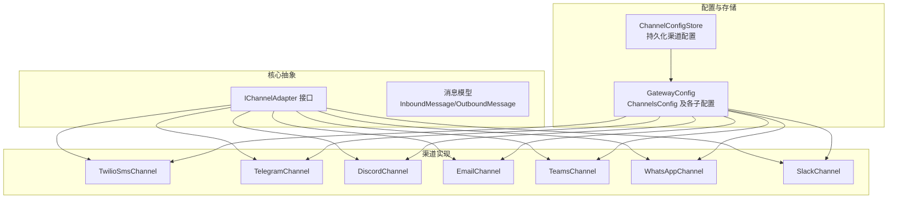
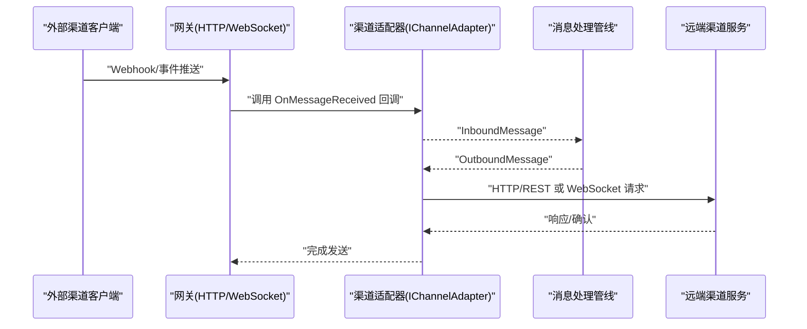
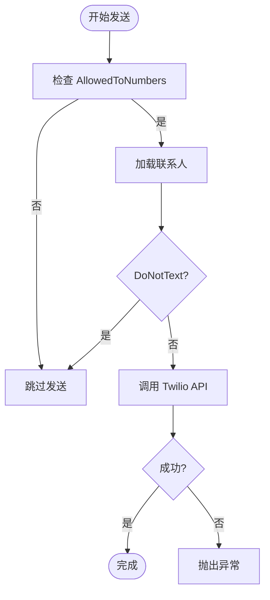
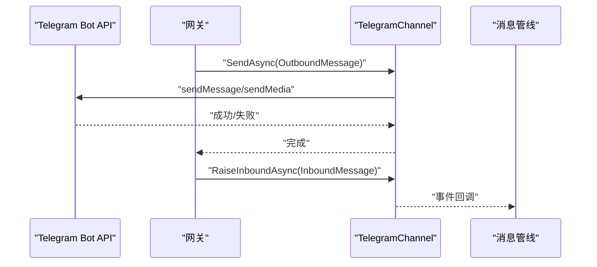
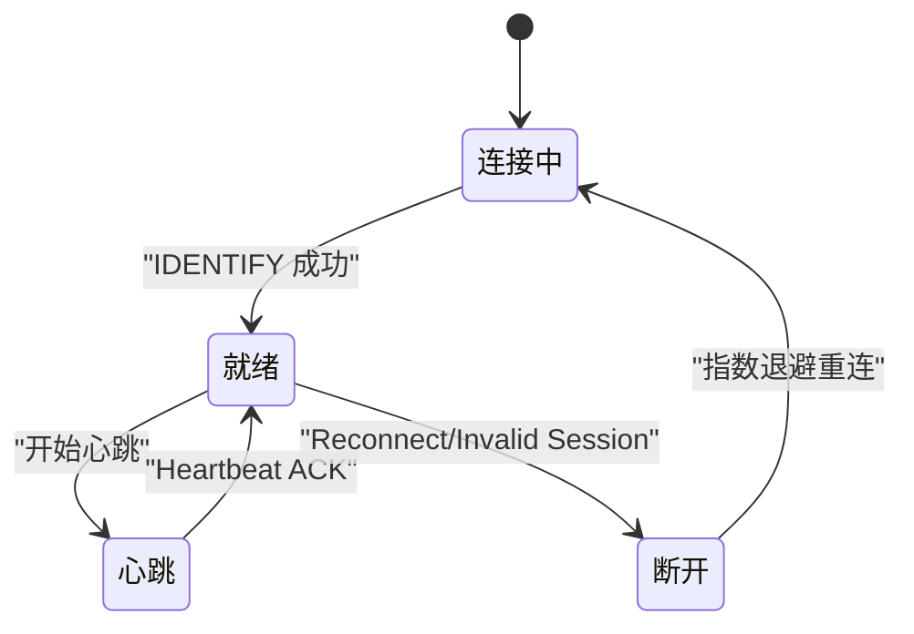
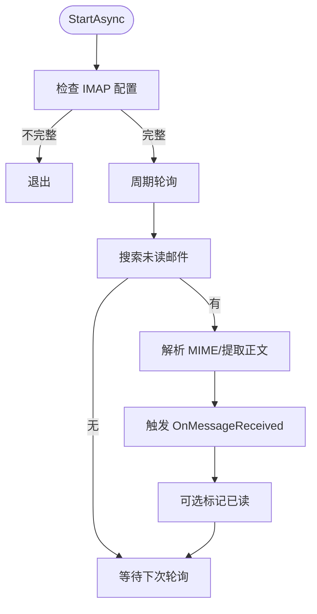
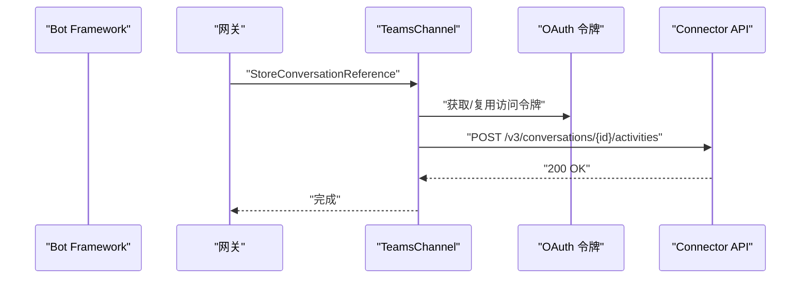
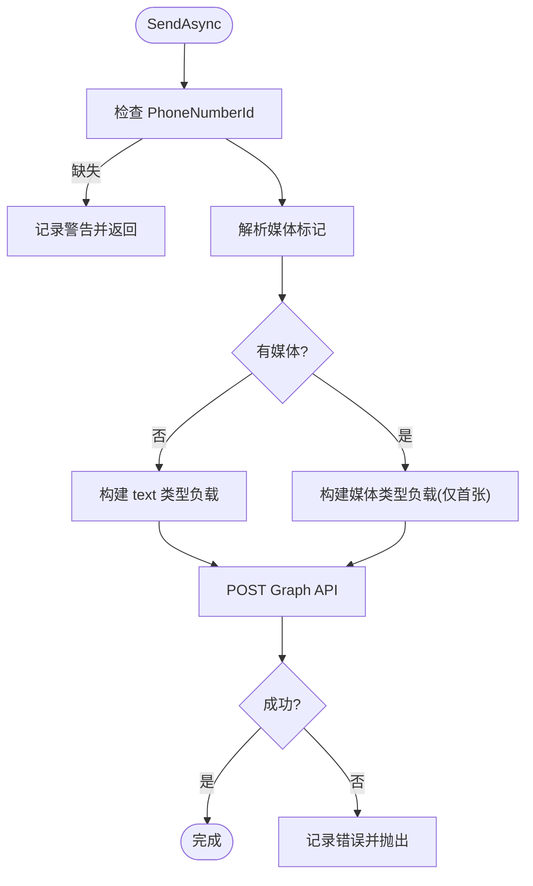
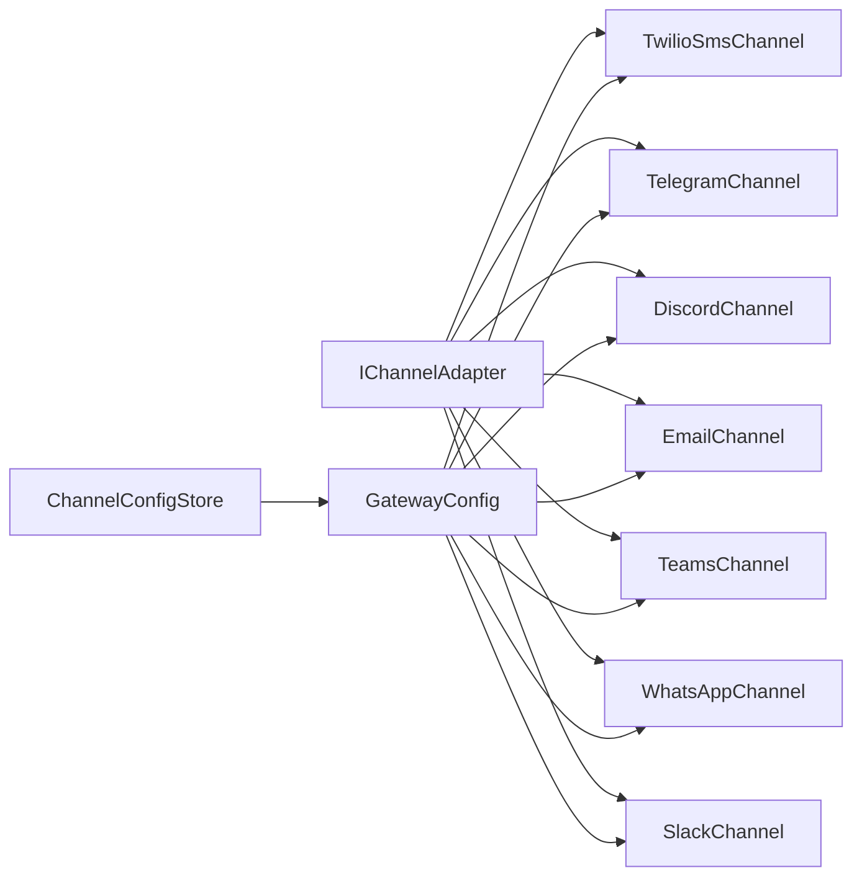

# 通信渠道

<cite>
**本文引用的文件**
- [OpenClaw.Channels.csproj](file://src/OpenClaw.Channels/OpenClaw.Channels.csproj)
- [IChannelAdapter.cs](file://src/OpenClaw.Core/Abstractions/IChannelAdapter.cs)
- [Messages.cs](file://src/OpenClaw.Core/Models/Messages.cs)
- [GatewayConfig.cs](file://src/OpenClaw.Core/Models/GatewayConfig.cs)
- [TwilioSmsChannel.cs](file://src/OpenClaw.Channels/TwilioSmsChannel.cs)
- [TelegramChannel.cs](file://src/OpenClaw.Channels/TelegramChannel.cs)
- [DiscordChannel.cs](file://src/OpenClaw.Channels/DiscordChannel.cs)
- [EmailChannel.cs](file://src/OpenClaw.Channels/EmailChannel.cs)
- [TeamsChannel.cs](file://src/OpenClaw.Channels/TeamsChannel.cs)
- [WhatsAppChannel.cs](file://src/OpenClaw.Channels/WhatsAppChannel.cs)
- [SlackChannel.cs](file://src/OpenClaw.Channels/SlackChannel.cs)
- [ChannelConfigStore.cs](file://src/OpenClaw.Gateway/Channels/ChannelConfigStore.cs)
</cite>

## 目录
1. [简介](#简介)
2. [项目结构](#项目结构)
3. [核心组件](#核心组件)
4. [架构总览](#架构总览)
5. [详细组件分析](#详细组件分析)
6. [依赖关系分析](#依赖关系分析)
7. [性能考量](#性能考量)
8. [故障排查指南](#故障排查指南)
9. [结论](#结论)
10. [附录](#附录)

## 简介
本技术文档面向“通信渠道系统”，系统性阐述渠道适配器的架构设计、消息路由与状态管理，覆盖短信（Twilio）、即时通讯（Telegram、WhatsApp、Discord、Slack）、邮件、Teams 等渠道的实现要点。文档重点包括：
- 渠道适配器接口与生命周期
- 各渠道的配置项、Webhook 处理、消息格式与安全校验
- 启动流程、健康检查与故障恢复机制
- 扩展与自定义渠道开发指南及最佳实践
- 具体配置示例与部署建议

## 项目结构
渠道相关代码主要分布在以下模块：
- 适配器抽象层：OpenClaw.Core 的 IChannelAdapter 接口与消息模型
- 渠道实现层：OpenClaw.Channels 的各平台适配器
- 配置与持久化：OpenClaw.Core 的 GatewayConfig 与 OpenClaw.Gateway 的 ChannelConfigStore

图示来源
- [IChannelAdapter.cs:1-22](file://src/OpenClaw.Core/Abstractions/IChannelAdapter.cs#L1-L22)
- [Messages.cs:1-62](file://src/OpenClaw.Core/Models/Messages.cs#L1-L62)
- [GatewayConfig.cs:534-787](file://src/OpenClaw.Core/Models/GatewayConfig.cs#L534-L787)
- [ChannelConfigStore.cs:1-95](file://src/OpenClaw.Gateway/Channels/ChannelConfigStore.cs#L1-L95)

章节来源
- [OpenClaw.Channels.csproj:1-14](file://src/OpenClaw.Channels/OpenClaw.Channels.csproj#L1-L14)
- [IChannelAdapter.cs:1-22](file://src/OpenClaw.Core/Abstractions/IChannelAdapter.cs#L1-L22)
- [Messages.cs:1-62](file://src/OpenClaw.Core/Models/Messages.cs#L1-L62)
- [GatewayConfig.cs:534-787](file://src/OpenClaw.Core/Models/GatewayConfig.cs#L534-L787)
- [ChannelConfigStore.cs:1-95](file://src/OpenClaw.Gateway/Channels/ChannelConfigStore.cs#L1-L95)

## 核心组件
- IChannelAdapter 抽象：统一的渠道适配器接口，定义 StartAsync、SendAsync、OnMessageReceived 事件等能力，确保 AOT 兼容与低分配。
- 消息模型：InboundMessage/OutboundMessage 统一承载跨渠道的消息字段，包括 SenderId、RecipientId、Text、ReplyToMessageId、会话与群组标识、媒体字段等。
- 配置体系：GatewayConfig 的 ChannelsConfig 下挂载各渠道配置，支持令牌、Webhook 路径、验证开关、限额与策略等。

章节来源
- [IChannelAdapter.cs:1-22](file://src/OpenClaw.Core/Abstractions/IChannelAdapter.cs#L1-L22)
- [Messages.cs:1-62](file://src/OpenClaw.Core/Models/Messages.cs#L1-L62)
- [GatewayConfig.cs:534-787](file://src/OpenClaw.Core/Models/GatewayConfig.cs#L534-L787)

## 架构总览
渠道适配器通过统一接口接入，消息在网关侧被标准化后进入处理管线；出站消息按渠道协议封装并通过 HTTP/WebSocket 或 REST API 发送；入站消息由各渠道的 Webhook/长连接接收并转换为 InboundMessage 上抛。

图示来源
- [IChannelAdapter.cs:9-21](file://src/OpenClaw.Core/Abstractions/IChannelAdapter.cs#L9-L21)
- [Messages.cs:6-45](file://src/OpenClaw.Core/Models/Messages.cs#L6-L45)

## 详细组件分析

### 渠道适配器接口与生命周期
- 生命周期：StartAsync 启动监听（如 WebSocket），SendAsync 发送消息，OnMessageReceived 事件回调入站消息。
- 安全与合规：要求 AOT 兼容与低分配，避免大对象分配与装箱。
- 事件驱动：入站消息通过事件上抛，便于网关统一处理。

章节来源
- [IChannelAdapter.cs:1-22](file://src/OpenClaw.Core/Abstractions/IChannelAdapter.cs#L1-L22)

### 短信（Twilio）
- 功能特性
  - 发送：基于 TwiML/SMS API，支持 FromNumber/MessagingServiceSid，校验 AllowedToNumbers 白名单。
  - 入站：通过网关 TwilioSmsWebhookHandler 接收，适配器 RaiseInboundAsync 触发事件。
  - 安全：可启用签名验证，限制请求大小与速率。
- 关键配置
  - TwilioSmsConfig：AccountSid/AuthTokenRef/MessagingServiceSid/FromNumber/WebhookPath/AllowedToNumbers/AllowedFromNumbers/MaxInboundChars/ValidateSignature/RateLimitPerFromPerMinute 等。
- 错误处理
  - 不在白名单或被 DoNotText 标记则跳过发送；发送失败抛出异常。

图示来源
- [TwilioSmsChannel.cs:27-40](file://src/OpenClaw.Channels/TwilioSmsChannel.cs#L27-L40)
- [GatewayConfig.cs:688-711](file://src/OpenClaw.Core/Models/GatewayConfig.cs#L688-L711)

章节来源
- [TwilioSmsChannel.cs:1-59](file://src/OpenClaw.Channels/TwilioSmsChannel.cs#L1-L59)
- [GatewayConfig.cs:688-711](file://src/OpenClaw.Core/Models/GatewayConfig.cs#L688-L711)

### 即时通讯（Telegram）
- 功能特性
  - 发送：支持文本分片与媒体发送（图片/视频/音频/文档/贴纸），自动截断标题并回退为后续消息。
  - 入站：Webhook POST /telegram/inbound，解析消息并映射为 InboundMessage。
  - 安全：可启用 Telegram Webhook Secret Token 校验。
- 关键配置
  - TelegramChannelConfig：BotToken/BotTokenRef/WebhookPath/AllowedFromUserIds/MaxInboundChars/ValidateSignature/WebhookSecretToken/WebhookSecretTokenRef。
- 媒体与回复
  - 支持 ReplyToMessageId；媒体类型映射到 sendPhoto/sendVideo/sendAudio/sendDocument/sendSticker。

图示来源
- [TelegramChannel.cs:54-124](file://src/OpenClaw.Channels/TelegramChannel.cs#L54-L124)
- [GatewayConfig.cs:713-733](file://src/OpenClaw.Core/Models/GatewayConfig.cs#L713-L733)

章节来源
- [TelegramChannel.cs:1-338](file://src/OpenClaw.Channels/TelegramChannel.cs#L1-L338)
- [GatewayConfig.cs:713-733](file://src/OpenClaw.Core/Models/GatewayConfig.cs#L713-L733)

### 即时通讯（Discord）
- 功能特性
  - 入站：WebSocket Gateway 长连接，处理 HELLO/IDENTIFY/RESUME/HEARTBEAT 等，过滤机器人消息，支持频道/服务器/用户白名单。
  - 出站：REST API 发送消息，内置 429 重试与限流处理。
  - Slash 命令：可选注册交互命令。
- 关键配置
  - DiscordChannelConfig：BotToken/ApplicationId/PublicKey/WebhookPath/AllowedGuildIds/AllowedChannelIds/AllowedFromUserIds/MaxInboundChars/ValidateSignature/RegisterSlashCommands/SlashCommandPrefix。
- 连接与恢复
  - 断线指数退避重连，支持 RESUME 会话续传。

图示来源
- [DiscordChannel.cs:122-161](file://src/OpenClaw.Channels/DiscordChannel.cs#L122-L161)
- [DiscordChannel.cs:240-277](file://src/OpenClaw.Channels/DiscordChannel.cs#L240-L277)
- [DiscordChannel.cs:279-396](file://src/OpenClaw.Channels/DiscordChannel.cs#L279-L396)

章节来源
- [DiscordChannel.cs:1-504](file://src/OpenClaw.Channels/DiscordChannel.cs#L1-L504)
- [GatewayConfig.cs:753-772](file://src/OpenClaw.Core/Models/GatewayConfig.cs#L753-L772)

### 邮件（IMAP/SMTP）
- 功能特性
  - 入站：周期轮询 IMAP（可配置最大消息数/间隔/文件夹），解析 MIME，提取正文，标记已读。
  - 出站：SMTP 发送，支持 TLS/SSL 自动选择。
  - 安全：输入净化 IMAP 文件夹名，凭据通过 SecretResolver 解析。
- 关键配置
  - EmailConfig：InboundEnabled/ImapHost/ImapPort/ImapUseTls/Username/PasswordRef/InboundFolder/InboundPollSeconds/InboundMaxMessagesPerPoll/MarkInboundAsRead/SmtpHost/SmtpPort/SmtpUseTls/FromAddress。
- 错误处理
  - 轮询异常捕获并记录日志，不中断主循环。

图示来源
- [EmailChannel.cs:30-55](file://src/OpenClaw.Channels/EmailChannel.cs#L30-L55)
- [EmailChannel.cs:97-159](file://src/OpenClaw.Channels/EmailChannel.cs#L97-L159)

章节来源
- [EmailChannel.cs:1-192](file://src/OpenClaw.Channels/EmailChannel.cs#L1-L192)
- [GatewayConfig.cs:1-800](file://src/OpenClaw.Core/Models/GatewayConfig.cs#L1-L800)

### 即时通讯（Teams）
- 功能特性
  - 入站：通过 Bot Framework Webhook 接收活动，存储 ConversationReference 以便后续主动消息。
  - 出站：OAuth 获取访问令牌，向 Connector REST API 发送消息，支持线程回复与分片。
  - 安全：可启用 JWT 令牌校验，支持租户白名单。
- 关键配置
  - TeamsChannelConfig：AppId/AppPassword/TenantId/WebhookPath/ValidateToken/RequireMention/ReplyStyle/TextChunkLimit/ChunkMode/AllowedTenantIds/AllowedFromIds/AllowedTeamIds/AllowedConversationIds。
- 认证与并发
  - 令牌缓存与互斥门控，避免重复获取；分片策略支持按换行或长度切分。

图示来源
- [TeamsChannel.cs:63-110](file://src/OpenClaw.Channels/TeamsChannel.cs#L63-L110)
- [TeamsChannel.cs:138-175](file://src/OpenClaw.Channels/TeamsChannel.cs#L138-L175)

章节来源
- [TeamsChannel.cs:1-355](file://src/OpenClaw.Channels/TeamsChannel.cs#L1-L355)
- [GatewayConfig.cs:636-686](file://src/OpenClaw.Core/Models/GatewayConfig.cs#L636-L686)

### 即时通讯（WhatsApp）
- 功能特性
  - 入站：官方 Cloud API Webhook，适配器 RaiseInboundAsync 触发事件。
  - 出站：官方 Graph API，支持单媒体附件（多附件取首个），支持链接型文档带文件名。
  - 安全：可启用签名验证与 App Secret 校验。
- 关键配置
  - WhatsAppChannelConfig：CloudApiToken/CloudApiTokenRef/PhoneNumberId/BridgeUrl/BridgeToken/BridgeTokenRef/BridgeSuppressSendExceptions/FirstPartyWorker/AllowedFromIds/WebhookPath/WebhookPublicBaseUrl/WebhookVerifyToken/WebhookVerifyTokenRef/ValidateSignature/WebhookAppSecret/WebhookAppSecretRef/MaxInboundChars/MaxRequestBytes。
- 媒体与上下文
  - 支持 image/video/audio/document/sticker；支持 ReplyToMessageId 上下文。

图示来源
- [WhatsAppChannel.cs:40-70](file://src/OpenClaw.Channels/WhatsAppChannel.cs#L40-L70)
- [WhatsAppChannel.cs:85-138](file://src/OpenClaw.Channels/WhatsAppChannel.cs#L85-L138)

章节来源
- [WhatsAppChannel.cs:1-320](file://src/OpenClaw.Channels/WhatsAppChannel.cs#L1-L320)
- [GatewayConfig.cs:550-594](file://src/OpenClaw.Core/Models/GatewayConfig.cs#L550-L594)

### 即时通讯（Slack）
- 功能特性
  - 入站：通过 Events API Webhook（由网关处理），适配器负责发送。
  - 出站：chat.postMessage，支持线程回复与 MRKDWN 文本转换，内置 429 处理。
  - 安全：可启用签名验证与 Workspace/Channel/用户白名单。
- 关键配置
  - SlackChannelConfig：BotToken/SigningSecret/WebhookPath/SlashCommandPath/AllowedWorkspaceIds/AllowedFromUserIds/AllowedChannelIds/MaxInboundChars/MaxRequestBytes/ValidateSignature。
- 文本转换
  - 将基本 Markdown 转换为 Slack MRKDWN（加粗、链接）。

章节来源
- [SlackChannel.cs:1-184](file://src/OpenClaw.Channels/SlackChannel.cs#L1-L184)
- [GatewayConfig.cs:735-751](file://src/OpenClaw.Core/Models/GatewayConfig.cs#L735-L751)

## 依赖关系分析
- 适配器对核心库的依赖：IChannelAdapter、消息模型、安全工具（SecretResolver）、HTTP 工厂等。
- 渠道实现对第三方 SDK/HTTP 的依赖：MailKit（邮件）、Telegram/Discord/Slack/Teams/WhatsApp API。
- 配置持久化：ChannelConfigStore 将渠道配置写入数据卷，支持容器重启后保留。

图示来源
- [IChannelAdapter.cs:1-22](file://src/OpenClaw.Core/Abstractions/IChannelAdapter.cs#L1-L22)
- [GatewayConfig.cs:534-787](file://src/OpenClaw.Core/Models/GatewayConfig.cs#L534-L787)
- [ChannelConfigStore.cs:1-95](file://src/OpenClaw.Gateway/Channels/ChannelConfigStore.cs#L1-L95)

章节来源
- [OpenClaw.Channels.csproj:1-14](file://src/OpenClaw.Channels/OpenClaw.Channels.csproj#L1-L14)
- [GatewayConfig.cs:534-787](file://src/OpenClaw.Core/Models/GatewayConfig.cs#L534-L787)
- [ChannelConfigStore.cs:1-95](file://src/OpenClaw.Gateway/Channels/ChannelConfigStore.cs#L1-L95)

## 性能考量
- 分片与限流
  - Teams/Telegram/Discord/Slack 等均存在文本分片与长度限制，需按渠道阈值拆分。
  - Slack/Discord 存在 429 重试与 Retry-After 处理。
- I/O 与并发
  - Discord 使用 WebSocket 长连接，注意心跳与断线恢复的资源释放。
  - Email 采用周期轮询，合理设置轮询间隔与最大拉取条数。
- 序列化与内存
  - 渠道适配器广泛使用 Source Generator JSON 序列化，减少反射与装箱。
- AOT 与低分配
  - 接口与实现遵循 AOT 兼容与低分配原则，避免大对象与 GC 压力。

## 故障排查指南
- 常见问题定位
  - 渠道未启用：检查 GatewayConfig 中对应渠道 Enabled 与必要参数。
  - 凭据缺失：确认 SecretResolver 能解析 BotToken/AppId/AppPassword/CloudApiToken 等。
  - Webhook 校验失败：开启 ValidateSignature 并正确配置密钥/验证令牌。
  - 速率限制：关注 429 与 Retry-After，适当降低发送频率或增大限流阈值。
  - Discord 断线：查看日志中的 Reconnect/Invalid Session，并确认 intents 与 token 权限。
- 日志与可观测性
  - 各适配器在发送/接收失败时记录错误日志，便于快速定位。
- 配置持久化
  - 使用 ChannelConfigStore 保存/删除渠道配置，便于容器重启后恢复。

章节来源
- [DiscordChannel.cs:122-161](file://src/OpenClaw.Channels/DiscordChannel.cs#L122-L161)
- [SlackChannel.cs:66-90](file://src/OpenClaw.Channels/SlackChannel.cs#L66-L90)
- [ChannelConfigStore.cs:36-90](file://src/OpenClaw.Gateway/Channels/ChannelConfigStore.cs#L36-L90)

## 结论
该通信渠道系统以 IChannelAdapter 为核心抽象，统一了多渠道的消息收发与事件回调，结合严格的配置与安全校验、完善的错误处理与限流策略，实现了高可用、可扩展的跨渠道消息基础设施。通过 ChannelConfigStore 实现配置持久化，配合各渠道的 Webhook/长连接与 REST API，满足从个人到企业级部署的多样化需求。

## 附录

### 渠道启动流程与健康检查
- 启动流程
  - 加载 GatewayConfig 与各渠道配置，初始化适配器实例。
  - Teams/WhatsApp/Twilio 等通过网关端点接收入站消息；Discord/Telegram/Email 通过长连接或轮询建立监听。
  - 适配器在 StartAsync 中启动监听，发送端通过 SendAsync 调用远端 API。
- 健康检查与恢复
  - Discord：指数退避重连、RESUME 会话续传、心跳 ACK。
  - Email：周期轮询失败捕获并继续循环。
  - Teams：令牌缓存与互斥门控，避免并发获取。
  - Slack/Discord：429 重试与 Retry-After 处理。

章节来源
- [DiscordChannel.cs:122-161](file://src/OpenClaw.Channels/DiscordChannel.cs#L122-L161)
- [EmailChannel.cs:30-55](file://src/OpenClaw.Channels/EmailChannel.cs#L30-L55)
- [TeamsChannel.cs:138-175](file://src/OpenClaw.Channels/TeamsChannel.cs#L138-L175)
- [SlackChannel.cs:66-90](file://src/OpenClaw.Channels/SlackChannel.cs#L66-L90)

### 渠道扩展与自定义开发指南
- 新增渠道步骤
  - 实现 IChannelAdapter 接口，定义 StartAsync、SendAsync、OnMessageReceived。
  - 在 GatewayConfig 中新增配置类，支持令牌、Webhook 路径、验证开关、限额等。
  - 如需入站 Webhook，参考现有渠道的 Handler 设计，在网关端注册路由并解析请求。
  - 使用 Source Generator 生成 JSON 序列化上下文，确保 AOT 兼容。
  - 通过 ChannelConfigStore 提供配置持久化能力，便于容器化部署。
- 最佳实践
  - 严格区分入站/出站路径与权限范围，启用必要的签名验证。
  - 对长连接与轮询设置合理的超时与重试策略。
  - 控制消息分片与媒体大小，遵守各平台限制。
  - 使用日志与指标监控关键指标（成功率、延迟、429 次数）。

章节来源
- [IChannelAdapter.cs:1-22](file://src/OpenClaw.Core/Abstractions/IChannelAdapter.cs#L1-L22)
- [GatewayConfig.cs:534-787](file://src/OpenClaw.Core/Models/GatewayConfig.cs#L534-L787)
- [ChannelConfigStore.cs:1-95](file://src/OpenClaw.Gateway/Channels/ChannelConfigStore.cs#L1-L95)

### 配置示例与部署建议
- 配置要点
  - 令牌与密钥：优先使用 SecretResolver 支持的引用（如 env:），避免明文硬编码。
  - Webhook：配置公网可达的 WebhookPublicBaseUrl 与 VerifyToken/App Secret。
  - 限额与策略：根据业务场景设置 AllowedFromIds/AllowedChannelIds/AllowedGuildIds 等白名单。
  - 安全：启用 ValidateSignature/ValidateToken，限制公开绑定时的工具与插件桥接。
- 部署建议
  - 使用 ChannelConfigStore 将渠道配置持久化至数据卷，避免镜像内嵌配置。
  - 对外暴露的网关应启用严格公共绑定预设与 URL 安全策略。
  - 为 Discord/Teams/WhatsApp 等配置合适的超时与重试策略，保障稳定性。

章节来源
- [GatewayConfig.cs:534-787](file://src/OpenClaw.Core/Models/GatewayConfig.cs#L534-L787)
- [ChannelConfigStore.cs:1-95](file://src/OpenClaw.Gateway/Channels/ChannelConfigStore.cs#L1-L95)