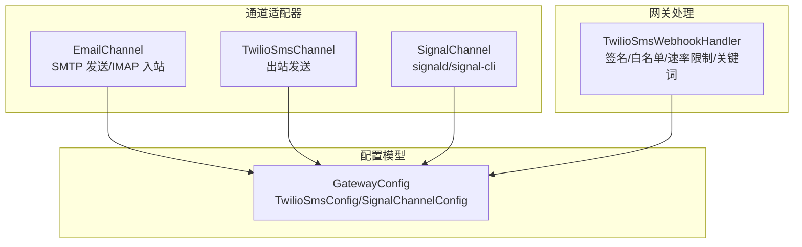
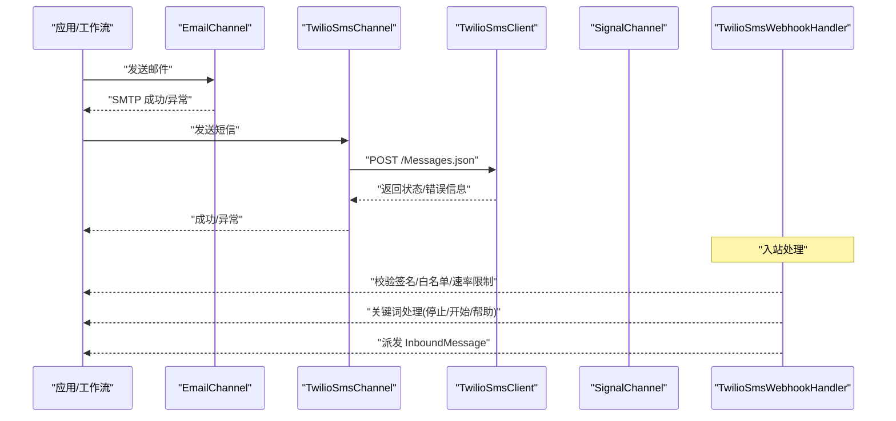
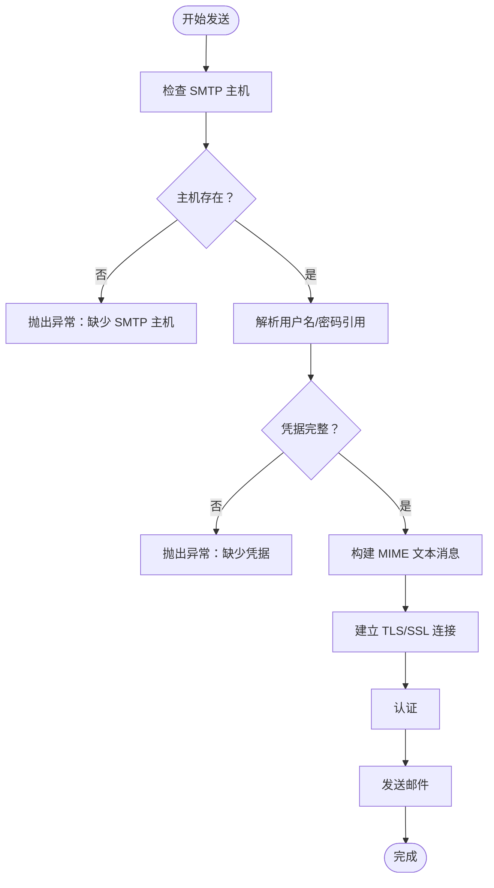
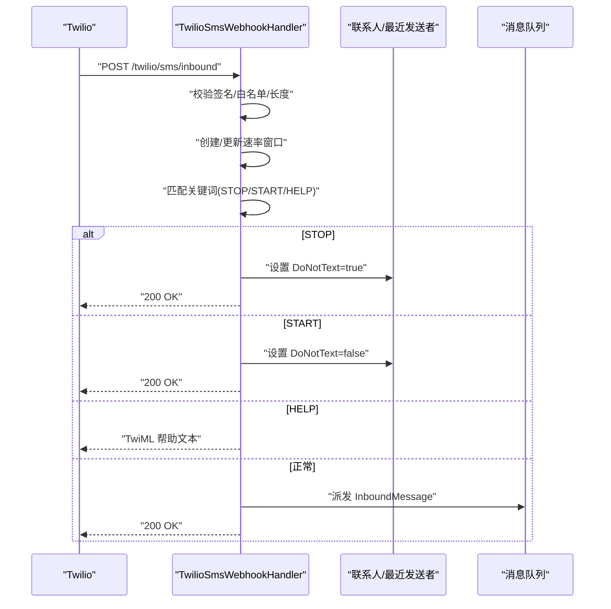
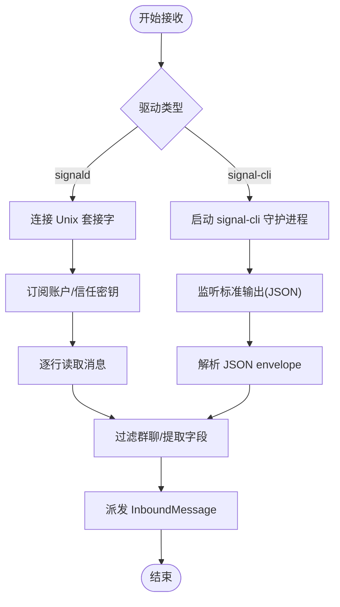
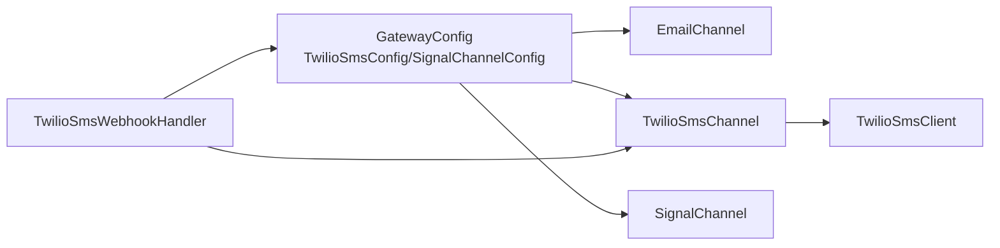

# 邮件和短信集成

<cite>
**本文引用的文件**
- [EmailChannel.cs](file://src/OpenClaw.Channels/EmailChannel.cs)
- [TwilioSmsChannel.cs](file://src/OpenClaw.Channels/TwilioSmsChannel.cs)
- [TwilioSmsClient.cs](file://src/OpenClaw.Channels/TwilioSmsClient.cs)
- [SignalChannel.cs](file://src/OpenClaw.Channels/SignalChannel.cs)
- [GatewayConfig.cs](file://src/OpenClaw.Core/Models/GatewayConfig.cs)
- [TwilioSmsWebhookHandler.cs](file://src/OpenClaw.Gateway/TwilioSmsWebhookHandler.cs)
- [EmailChannelTests.cs](file://src/OpenClaw.Tests/EmailChannelTests.cs)
- [TwilioSmsTests.cs](file://src/OpenClaw.Tests/TwilioSmsTests.cs)
- [SetupVerificationService.cs](file://src/OpenClaw.Core/Validation/SetupVerificationService.cs)
- [ChannelReadinessEvaluator.cs](file://src/OpenClaw.Gateway/ChannelReadinessEvaluator.cs)
- [EmailTool.cs](file://src/OpenClaw.Agent/Tools/EmailTool.cs)
</cite>

## 目录
1. [简介](#简介)
2. [项目结构](#项目结构)
3. [核心组件](#核心组件)
4. [架构总览](#架构总览)
5. [详细组件分析](#详细组件分析)
6. [依赖关系分析](#依赖关系分析)
7. [性能考虑](#性能考虑)
8. [故障排查指南](#故障排查指南)
9. [结论](#结论)
10. [附录](#附录)

## 简介
本文件面向邮件、短信与 Signal 的多通道集成，聚焦以下目标：
- SMTP 邮件发送配置与安全连接选项
- Twilio SMS 出站与入站集成（签名验证、速率限制、关键词处理）
- Signal 消息传输机制（signald 与 signal-cli 两种驱动）
- 认证方法与密钥管理（用户名密码、令牌引用、环境变量）
- 发送限制、成本控制与合规性要求
- 配置示例路径、错误处理与发送成功率优化策略

## 项目结构
围绕“通道”与“网关”的分层组织：
- 通道适配器：EmailChannel、TwilioSmsChannel、SignalChannel 实现 IChannelAdapter 接口
- 配置模型：GatewayConfig 中定义各通道配置项
- 网关处理：TwilioSmsWebhookHandler 处理入站请求并执行签名验证、速率限制与关键词处理
- 测试用例：EmailChannelTests、TwilioSmsTests 覆盖关键行为与边界条件
- 校验工具：SetupVerificationService、ChannelReadinessEvaluator 提供配置健康检查与就绪评估

**图表来源**
- [EmailChannel.cs:15-191](file://src/OpenClaw.Channels/EmailChannel.cs#L15-L191)
- [TwilioSmsChannel.cs:8-59](file://src/OpenClaw.Channels/TwilioSmsChannel.cs#L8-L59)
- [SignalChannel.cs:17-375](file://src/OpenClaw.Channels/SignalChannel.cs#L17-L375)
- [GatewayConfig.cs:688-787](file://src/OpenClaw.Core/Models/GatewayConfig.cs#L688-L787)
- [TwilioSmsWebhookHandler.cs:9-200](file://src/OpenClaw.Gateway/TwilioSmsWebhookHandler.cs#L9-L200)

**章节来源**
- [EmailChannel.cs:15-191](file://src/OpenClaw.Channels/EmailChannel.cs#L15-L191)
- [TwilioSmsChannel.cs:8-59](file://src/OpenClaw.Channels/TwilioSmsChannel.cs#L8-L59)
- [SignalChannel.cs:17-375](file://src/OpenClaw.Channels/SignalChannel.cs#L17-L375)
- [GatewayConfig.cs:688-787](file://src/OpenClaw.Core/Models/GatewayConfig.cs#L688-L787)

## 核心组件
- 邮件通道（EmailChannel）
  - 支持 SMTP 出站与 IMAP 入站轮询；自动解析文本正文或从 HTML 解码提取纯文本
  - 安全连接根据端口选择 SSL 或 STARTTLS
- 短信通道（TwilioSmsChannel）
  - 出站通过 TwilioSmsClient 使用 Basic Auth 调用 Twilio API
  - 入站由 TwilioSmsWebhookHandler 处理，支持签名验证、白名单、速率限制与关键词（STOP/START/HELP）
- Signal 通道（SignalChannel）
  - 支持 signald（Unix 域套接字）与 signal-cli（子进程 JSON-RPC）两种驱动
  - 入站过滤群聊，仅接收私聊消息；支持最大长度截断与内容日志脱敏

**章节来源**
- [EmailChannel.cs:57-191](file://src/OpenClaw.Channels/EmailChannel.cs#L57-L191)
- [TwilioSmsChannel.cs:27-59](file://src/OpenClaw.Channels/TwilioSmsChannel.cs#L27-L59)
- [TwilioSmsClient.cs:20-62](file://src/OpenClaw.Channels/TwilioSmsClient.cs#L20-L62)
- [TwilioSmsWebhookHandler.cs:86-162](file://src/OpenClaw.Gateway/TwilioSmsWebhookHandler.cs#L86-L162)
- [SignalChannel.cs:54-375](file://src/OpenClaw.Channels/SignalChannel.cs#L54-L375)

## 架构总览
下图展示从消息发送到入站处理的关键流程与组件交互。

**图表来源**
- [EmailChannel.cs:57-85](file://src/OpenClaw.Channels/EmailChannel.cs#L57-L85)
- [TwilioSmsChannel.cs:27-40](file://src/OpenClaw.Channels/TwilioSmsChannel.cs#L27-L40)
- [TwilioSmsClient.cs:20-53](file://src/OpenClaw.Channels/TwilioSmsClient.cs#L20-L53)
- [TwilioSmsWebhookHandler.cs:86-162](file://src/OpenClaw.Gateway/TwilioSmsWebhookHandler.cs#L86-L162)
- [SignalChannel.cs:54-71](file://src/OpenClaw.Channels/SignalChannel.cs#L54-L71)

## 详细组件分析

### 邮件通道（SMTP 出站与 IMAP 入站）
- 出站发送
  - 必需配置：SMTP 主机、用户名、密码引用
  - 自动选择安全连接模式（SSL 或 STARTTLS），默认主题为“OpenClaw”
  - 文本体优先，其次从 HTML 解码提取纯文本
- 入站轮询
  - 可选启用；若未配置完整凭据则记录警告并跳过
  - 支持自定义轮询间隔与最大拉取条数
  - 将未读标记为已读可选
- 错误处理
  - 缺少 SMTP 主机或凭据时抛出无效操作异常
  - 轮询失败捕获并记录警告，避免中断

**图表来源**
- [EmailChannel.cs:57-85](file://src/OpenClaw.Channels/EmailChannel.cs#L57-L85)

**章节来源**
- [EmailChannel.cs:30-191](file://src/OpenClaw.Channels/EmailChannel.cs#L30-L191)
- [EmailChannelTests.cs:27-57](file://src/OpenClaw.Tests/EmailChannelTests.cs#L27-L57)
- [SetupVerificationService.cs:870-898](file://src/OpenClaw.Core/Validation/SetupVerificationService.cs#L870-L898)
- [EmailTool.cs:92-129](file://src/OpenClaw.Agent/Tools/EmailTool.cs#L92-L129)

### Twilio 短信通道（出站与入站）
- 出站发送
  - 使用 AccountSid 与 AuthToken 执行 Basic Auth
  - 优先使用 MessagingServiceSid；否则使用 FromNumber
  - 若未配置 AccountSid 或发送端参数，直接返回错误
- 入站处理（Webhook）
  - 签名验证：当开启签名验证且未设置公共基础 URL 时拒绝
  - 白名单：支持动态与静态白名单，严格模式与兼容模式
  - 速率限制：按分钟窗口统计每个来源的请求数，超过阈值返回 429
  - 关键词处理：STOP 设置“禁止短信”，START 取消，HELP 返回帮助文本
  - 最大请求大小与入站字符上限可配置

**图表来源**
- [TwilioSmsWebhookHandler.cs:86-162](file://src/OpenClaw.Gateway/TwilioSmsWebhookHandler.cs#L86-L162)
- [TwilioSmsTests.cs:18-63](file://src/OpenClaw.Tests/TwilioSmsTests.cs#L18-L63)

**章节来源**
- [TwilioSmsChannel.cs:27-40](file://src/OpenClaw.Channels/TwilioSmsChannel.cs#L27-L40)
- [TwilioSmsClient.cs:20-53](file://src/OpenClaw.Channels/TwilioSmsClient.cs#L20-L53)
- [TwilioSmsWebhookHandler.cs:86-162](file://src/OpenClaw.Gateway/TwilioSmsWebhookHandler.cs#L86-L162)
- [TwilioSmsTests.cs:18-322](file://src/OpenClaw.Tests/TwilioSmsTests.cs#L18-L322)
- [ChannelReadinessEvaluator.cs:66-96](file://src/OpenClaw.Gateway/ChannelReadinessEvaluator.cs#L66-L96)

### Signal 消息通道（signald 与 signal-cli）
- 驱动选择
  - signald：通过 Unix 域套接字订阅账户，接收 IncomingMessage 并过滤群聊
  - signal-cli：启动守护进程监听 JSON 输出，解析 envelope/dataMessage
- 发送流程
  - 根据驱动构造 JSON 请求并通过套接字或子进程发送
- 入站过滤与截断
  - 仅处理私聊消息；超长文本按最大字符数截断
- 日志与安全
  - 支持内容脱敏日志；可信任所有密钥（signald）

**图表来源**
- [SignalChannel.cs:83-170](file://src/OpenClaw.Channels/SignalChannel.cs#L83-L170)
- [SignalChannel.cs:190-289](file://src/OpenClaw.Channels/SignalChannel.cs#L190-L289)

**章节来源**
- [SignalChannel.cs:40-375](file://src/OpenClaw.Channels/SignalChannel.cs#L40-L375)

## 依赖关系分析
- 配置模型集中于 GatewayConfig，包含 TwilioSmsConfig、SignalChannelConfig 等
- 通道适配器依赖配置与安全工具（SecretResolver、输入清理等）
- 网关层对 Twilio 入站进行统一处理，包含签名验证、白名单与速率限制
- 测试覆盖关键边界条件与行为，确保配置缺失、签名错误、速率超限等场景正确处理

**图表来源**
- [GatewayConfig.cs:688-787](file://src/OpenClaw.Core/Models/GatewayConfig.cs#L688-L787)
- [EmailChannel.cs:15-24](file://src/OpenClaw.Channels/EmailChannel.cs#L15-L24)
- [TwilioSmsChannel.cs:8-19](file://src/OpenClaw.Channels/TwilioSmsChannel.cs#L8-L19)
- [TwilioSmsClient.cs:7-18](file://src/OpenClaw.Channels/TwilioSmsClient.cs#L7-L18)
- [TwilioSmsWebhookHandler.cs:9-74](file://src/OpenClaw.Gateway/TwilioSmsWebhookHandler.cs#L9-L74)

**章节来源**
- [GatewayConfig.cs:688-787](file://src/OpenClaw.Core/Models/GatewayConfig.cs#L688-L787)
- [TwilioSmsWebhookHandler.cs:9-74](file://src/OpenClaw.Gateway/TwilioSmsWebhookHandler.cs#L9-L74)

## 性能考虑
- 邮件入站轮询
  - 合理设置轮询间隔，避免过于频繁导致 IMAP 压力
  - 控制每次拉取的最大条数，防止一次性处理过多消息
- 短信入站
  - 速率限制按来源每分钟窗口统计，建议结合业务峰值合理设置阈值
  - 启用签名验证以减少伪造请求带来的无效处理
- Signal
  - signald 使用 Unix 套接字，延迟低；signal-cli 启动开销较高，适合短时任务
  - 对超长消息进行截断，避免内存与日志压力

[本节为通用指导，无需特定文件引用]

## 故障排查指南
- 邮件
  - 现象：发送时报“缺少 SMTP 主机/凭据”
  - 排查：确认 Email.SmtpHost、Username、PasswordRef 已配置；IMAP 凭据用于入站轮询
  - 参考：单元测试覆盖该异常路径
- 短信
  - 现象：入站被拒绝或返回 429
  - 排查：检查签名验证是否开启且公共基础 URL 配置；白名单是否允许；速率限制阈值是否过低
  - 现象：发送失败返回错误信息
  - 排查：确认 AccountSid、MessagingServiceSid 或 FromNumber 至少配置其一；Basic Auth 令牌有效
- Signal
  - 现象：无法接收消息或连接丢失
  - 排查：检查驱动类型、套接字路径或 CLI 路径；确保账户号码配置正确；查看重连退避日志

**章节来源**
- [EmailChannelTests.cs:27-57](file://src/OpenClaw.Tests/EmailChannelTests.cs#L27-L57)
- [TwilioSmsTests.cs:66-94](file://src/OpenClaw.Tests/TwilioSmsTests.cs#L66-L94)
- [TwilioSmsTests.cs:126-155](file://src/OpenClaw.Tests/TwilioSmsTests.cs#L126-L155)
- [TwilioSmsWebhookHandler.cs:107-130](file://src/OpenClaw.Gateway/TwilioSmsWebhookHandler.cs#L107-L130)
- [TwilioSmsClient.cs:22-26](file://src/OpenClaw.Channels/TwilioSmsClient.cs#L22-L26)
- [SignalChannel.cs:83-132](file://src/OpenClaw.Channels/SignalChannel.cs#L83-L132)

## 结论
本项目在邮件、短信与 Signal 三类通信渠道上提供了清晰的适配器与网关处理逻辑。通过严格的配置校验、签名验证、白名单与速率限制，保障了安全性与稳定性。建议在生产环境中：
- 明确配置项与密钥来源（环境变量/引用），避免硬编码
- 启用签名验证与白名单，合理设置速率限制
- 对超长消息进行截断与日志脱敏，降低风险
- 利用测试用例与健康检查工具持续验证配置正确性

[本节为总结性内容，无需特定文件引用]

## 附录

### 配置要点与示例路径
- 邮件（SMTP 出站）
  - 必填：SmtpHost、Username、PasswordRef
  - 可选：SmtpPort、SmtpUseTls、FromAddress、InboundEnabled、ImapHost/ImapPort/ImapUseTls、InboundFolder、InboundMaxMessagesPerPoll、MarkInboundAsRead
  - 示例参考：单元测试中对缺失凭据的断言
- 短信（Twilio 出站/入站）
  - 出站：AccountSid、AuthTokenRef、MessagingServiceSid 或 FromNumber
  - 入站：WebhookPath、WebhookPublicBaseUrl、ValidateSignature、AllowedFromNumbers、AllowedToNumbers、RateLimitPerFromPerMinute、AutoReplyForBlocked、HelpText
  - 示例参考：单元测试中对签名、白名单、速率限制与关键词的断言
- Signal
  - Driver、SocketPath、SignalCliPath、AccountPhoneNumber/AccountPhoneNumberRef、AllowedFromNumbers、MaxInboundChars、NoContentLogging、TrustAllKeys

**章节来源**
- [GatewayConfig.cs:688-787](file://src/OpenClaw.Core/Models/GatewayConfig.cs#L688-L787)
- [EmailChannelTests.cs:27-57](file://src/OpenClaw.Tests/EmailChannelTests.cs#L27-L57)
- [TwilioSmsTests.cs:18-322](file://src/OpenClaw.Tests/TwilioSmsTests.cs#L18-L322)
- [SignalChannel.cs:774-787](file://src/OpenClaw.Channels/SignalChannel.cs#L774-L787)

### 认证与密钥管理
- 邮件
  - 用户名与密码通过引用解析；可指定 FromAddress
- Twilio
  - AccountSid 与 AuthToken 通过引用解析；Basic Auth 用于 API 调用
- Signal
  - 账户号码通过引用解析；驱动依赖本地服务或 CLI

**章节来源**
- [EmailChannel.cs:66-70](file://src/OpenClaw.Channels/EmailChannel.cs#L66-L70)
- [TwilioSmsClient.cs:13-18](file://src/OpenClaw.Channels/TwilioSmsClient.cs#L13-L18)
- [SignalChannel.cs:26-33](file://src/OpenClaw.Channels/SignalChannel.cs#L26-L33)

### 发送限制与成本控制
- 短信速率限制
  - 按来源每分钟窗口统计，超过阈值返回 429
- 成本预算
  - 网关中间件提供成本预算拦截，达到上限后短路请求
- 合规性
  - 入站签名验证、白名单、关键词（STOP/START/HELP）处理符合合规要求

**章节来源**
- [TwilioSmsWebhookHandler.cs:125-128](file://src/OpenClaw.Gateway/TwilioSmsWebhookHandler.cs#L125-L128)
- [TokenBudgetMiddleware.cs:57-65](file://src/OpenClaw.Core/Middleware/TokenBudgetMiddleware.cs#L57-L65)