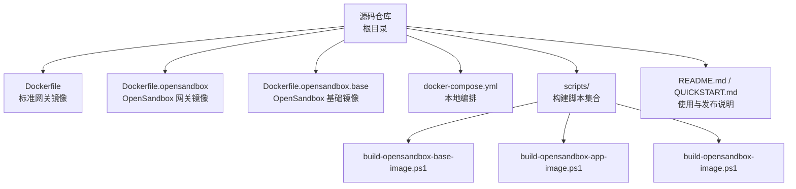
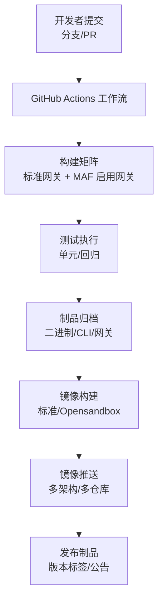
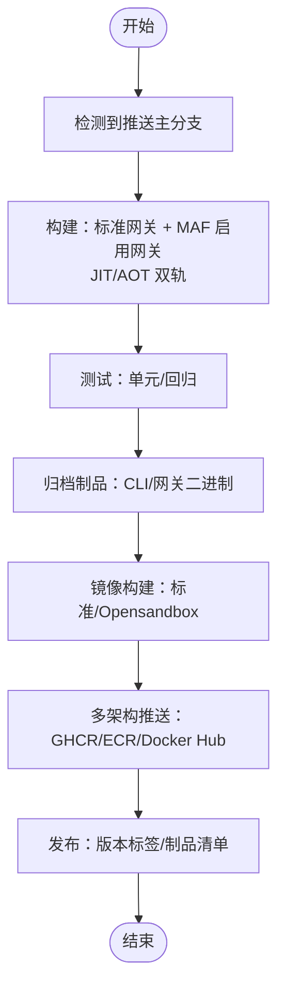
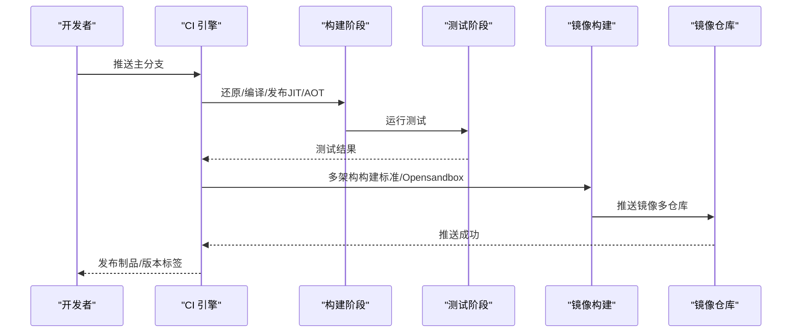
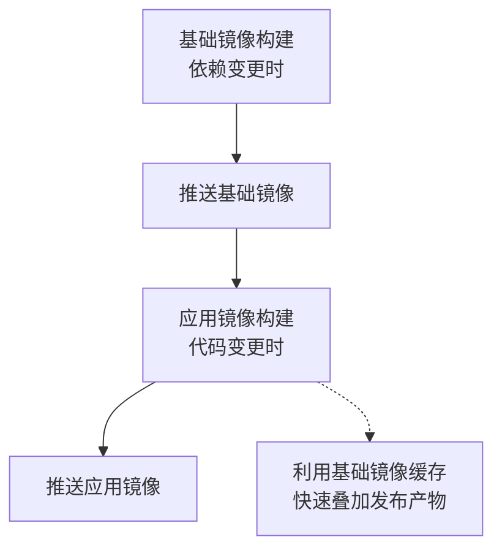
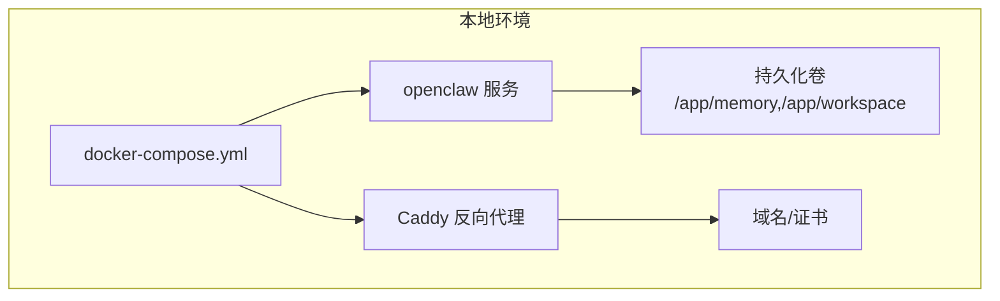
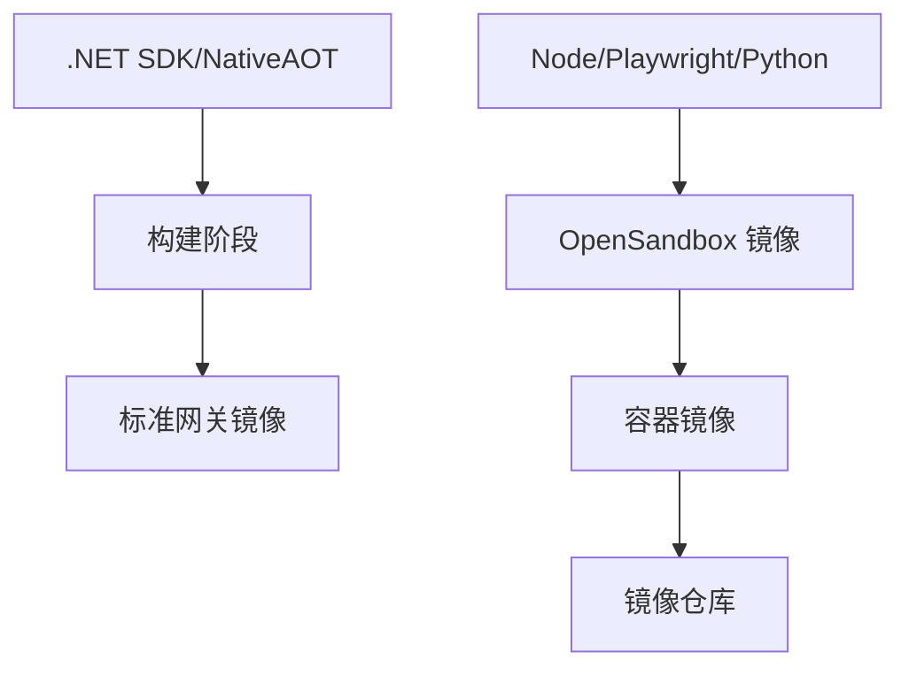

# CI/CD 流水线

<cite>
**本文档引用的文件**
- [README.md](file://README.md)
- [QUICKSTART.md](file://QUICKSTART.md)
- [.github/PULL_REQUEST_TEMPLATE.md](file://.github/PULL_REQUEST_TEMPLATE.md)
- [Dockerfile](file://Dockerfile)
- [Dockerfile.opensandbox](file://Dockerfile.opensandbox)
- [Dockerfile.opensandbox.base](file://Dockerfile.opensandbox.base)
- [docker-compose.yml](file://docker-compose.yml)
- [scripts/README.md](file://scripts/README.md)
- [scripts/build-opensandbox-image.ps1](file://scripts/build-opensandbox-image.ps1)
- [scripts/build-opensandbox-base-image.ps1](file://scripts/build-opensandbox-base-image.ps1)
- [scripts/build-opensandbox-app-image.ps1](file://scripts/build-opensandbox-app-image.ps1)
</cite>

## 目录
1. [简介](#简介)
2. [项目结构](#项目结构)
3. [核心组件](#核心组件)
4. [架构总览](#架构总览)
5. [详细组件分析](#详细组件分析)
6. [依赖关系分析](#依赖关系分析)
7. [性能考量](#性能考量)
8. [故障排查指南](#故障排查指南)
9. [结论](#结论)
10. [附录](#附录)

## 简介
本文件面向 CI/CD 流水线与自动化运维，系统化梳理本仓库的构建、测试、打包、镜像推送、部署与发布实践。重点覆盖：
- GitHub Actions 工作流触发与任务编排
- 多目标构建（标准网关与 MAF 启用网关）
- 测试执行与覆盖率收集
- Docker 多阶段构建与多架构镜像推送
- OpenSandbox 场景的镜像分层构建与快速迭代
- 版本标签、制品归档与发布策略
- 部署与环境配置（容器编排、反向代理、TLS）
- 监控、失败处理、通知与权限管理

## 项目结构
本仓库围绕“代码—构建—测试—打包—镜像—部署”形成闭环，关键位置如下：
- 根目录提供 Dockerfile 与 docker-compose.yml，支撑容器化构建与一键部署
- scripts 目录提供 OpenSandbox 场景的镜像构建脚本，实现“基础镜像 + 应用镜像”的分层与快速迭代
- README 与 QUICKSTART 提供本地与容器部署指引，便于流水线验证
- .github 目录用于 PR 模板与未来工作流定义（当前以 README 描述为主）

图表来源
- [Dockerfile:1-59](file://Dockerfile#L1-L59)
- [Dockerfile.opensandbox:1-113](file://Dockerfile.opensandbox#L1-L113)
- [Dockerfile.opensandbox.base:1-76](file://Dockerfile.opensandbox.base#L1-L76)
- [docker-compose.yml:1-68](file://docker-compose.yml#L1-L68)
- [scripts/README.md:1-255](file://scripts/README.md#L1-L255)
- [scripts/build-opensandbox-base-image.ps1:1-127](file://scripts/build-opensandbox-base-image.ps1#L1-L127)
- [scripts/build-opensandbox-app-image.ps1:1-141](file://scripts/build-opensandbox-app-image.ps1#L1-L141)
- [scripts/build-opensandbox-image.ps1:1-93](file://scripts/build-opensandbox-image.ps1#L1-L93)
- [README.md:651-657](file://README.md#L651-L657)
- [QUICKSTART.md:126-176](file://QUICKSTART.md#L126-L176)

章节来源
- [README.md:651-657](file://README.md#L651-L657)
- [QUICKSTART.md:126-176](file://QUICKSTART.md#L126-L176)
- [docker-compose.yml:1-68](file://docker-compose.yml#L1-L68)

## 核心组件
- 标准网关镜像构建
  - 多阶段构建：SDK 阶段负责还原/编译/发布，运行时阶段采用精简运行时镜像，暴露健康检查与非 root 用户
  - 关键参数：端口、内存卷、工具沙箱默认关闭、插件桥默认关闭
- OpenSandbox 网关镜像构建
  - 在标准 ASP.NET 基础上安装浏览器与 Node/Playwright 等工具，启用 JIT 运行模式与插件桥
  - 支持通过构建参数开启/关闭 OpenSandbox 功能
- OpenSandbox 镜像分层
  - 基础镜像：仅在依赖变更时重建，包含系统包、Node、Playwright 二进制
  - 应用镜像：基于基础镜像快速叠加 .NET 发布产物，日常迭代首选
- 本地编排
  - docker-compose 提供网关服务与可选 TLS 反向代理（Caddy），支持健康检查与持久化卷

章节来源
- [Dockerfile:1-59](file://Dockerfile#L1-L59)
- [Dockerfile.opensandbox:1-113](file://Dockerfile.opensandbox#L1-L113)
- [Dockerfile.opensandbox.base:1-76](file://Dockerfile.opensandbox.base#L1-L76)
- [docker-compose.yml:1-68](file://docker-compose.yml#L1-L68)
- [scripts/README.md:1-255](file://scripts/README.md#L1-L255)

## 架构总览
下图展示从代码提交到镜像发布的整体流程，涵盖触发条件、构建矩阵、制品产出与发布通道。

图表来源
- [README.md:651-657](file://README.md#L651-L657)

## 详细组件分析

### GitHub Actions 工作流（触发与任务）
- 触发条件
  - 推送主分支：执行构建与测试，并发布网关与 CLI 制品及容器镜像
  - 主分支合并：发布标准与 MAF 启用两种网关产物（JIT/AOT）
- 任务编排要点
  - 并行构建标准网关与 MAF 启用网关，分别针对 JIT/AOT 两套目标
  - 测试阶段在 CI 中完成，镜像构建仅包含发布产物，不重复测试
  - 多架构镜像推送：同时生成 amd64/arm64 并推送至多个容器仓库
  - 制品归档：包含 CLI 与网关二进制，便于下游部署与验证

图表来源
- [README.md:651-657](file://README.md#L651-L657)

章节来源
- [README.md:651-657](file://README.md#L651-L657)

### Docker 镜像构建与推送
- 标准网关镜像
  - 多阶段：SDK 构建 + 运行时精简镜像
  - 默认暴露 18789 端口，健康检查通过启动参数触发
  - 环境变量提供安全默认：禁用 shell、禁用插件桥、限制文件读写根目录
- OpenSandbox 网关镜像
  - 基于 ASP.NET，预装 Node/Playwright/Python 等工具，启用 JIT 与插件桥
  - 通过构建参数控制是否启用 OpenSandbox，便于在不同场景切换
- 多架构与多仓库
  - 支持 linux/amd64 与 linux/arm64 平台组合
  - 同时推送至多个容器镜像仓库，便于就近拉取与灾备

图表来源
- [README.md:651-657](file://README.md#L651-L657)
- [Dockerfile:1-59](file://Dockerfile#L1-L59)
- [Dockerfile.opensandbox:1-113](file://Dockerfile.opensandbox#L1-L113)

章节来源
- [README.md:651-657](file://README.md#L651-L657)
- [Dockerfile:1-59](file://Dockerfile#L1-L59)
- [Dockerfile.opensandbox:1-113](file://Dockerfile.opensandbox#L1-L113)

### OpenSandbox 镜像分层构建与快速迭代
- 基础镜像（低频变更）
  - 仅在系统包、Node、Playwright 等依赖变更时重建
  - 通过脚本生成带时间戳的稳定标签，并可同时打 latest 标签
- 应用镜像（高频变更）
  - 基于预构建的基础镜像，仅进行 .NET 发布与文件复制
  - 代码迭代时几乎全命中缓存，构建速度极快
- 快速工作流
  - 依赖变更：先构建基础镜像并推送
  - 日常迭代：使用最新基础镜像构建应用镜像并推送

图表来源
- [scripts/README.md:1-255](file://scripts/README.md#L1-L255)
- [scripts/build-opensandbox-base-image.ps1:1-127](file://scripts/build-opensandbox-base-image.ps1#L1-L127)
- [scripts/build-opensandbox-app-image.ps1:1-141](file://scripts/build-opensandbox-app-image.ps1#L1-L141)

章节来源
- [scripts/README.md:1-255](file://scripts/README.md#L1-L255)
- [scripts/build-opensandbox-base-image.ps1:1-127](file://scripts/build-opensandbox-base-image.ps1#L1-L127)
- [scripts/build-opensandbox-app-image.ps1:1-141](file://scripts/build-opensandbox-app-image.ps1#L1-L141)

### 本地与容器部署
- docker-compose 编排
  - 提供 openclaw 网关服务与可选 Caddy 反向代理（TLS）
  - 健康检查与持久化卷，便于生产级验证
- 环境变量与安全默认
  - 默认禁止 shell 与插件桥，避免公网暴露风险
  - 可选启用转发头信任与代理白名单，适配反向代理场景
- 快速启动
  - 一键启动网关与可选 TLS，结合 README/QUICKSTART 的环境变量示例

图表来源
- [docker-compose.yml:1-68](file://docker-compose.yml#L1-L68)
- [README.md:405-516](file://README.md#L405-L516)
- [QUICKSTART.md:126-176](file://QUICKSTART.md#L126-L176)

章节来源
- [docker-compose.yml:1-68](file://docker-compose.yml#L1-L68)
- [README.md:405-516](file://README.md#L405-L516)
- [QUICKSTART.md:126-176](file://QUICKSTART.md#L126-L176)

### 版本管理与发布策略
- 版本标签
  - 多架构镜像同时打上 latest 与具体版本标签，便于生产固定版本
- 制品发布
  - 网关与 CLI 制品随主分支推送同步发布，配合 README 的发布说明
- OpenSandbox 镜像命名
  - 基础镜像与应用镜像采用时间戳命名，便于追踪与回滚

章节来源
- [README.md:494-510](file://README.md#L494-L510)
- [scripts/README.md:246-255](file://scripts/README.md#L246-L255)

## 依赖关系分析
- 构建依赖
  - .NET SDK 与 NativeAOT 工具链（clang/zlib）用于标准网关构建
  - OpenSandbox 场景依赖 Node/Playwright/Python 等工具
- 运行时依赖
  - 标准镜像基于精简运行时，OpenSandbox 镜像基于 ASP.NET 并预装工具
- 外部依赖
  - 容器镜像仓库（GHCR/ECR/Docker Hub）用于镜像分发
  - 反向代理（Caddy/nginx）用于 TLS 终止与健康检查

图表来源
- [Dockerfile:1-59](file://Dockerfile#L1-L59)
- [Dockerfile.opensandbox:1-113](file://Dockerfile.opensandbox#L1-L113)
- [README.md:494-510](file://README.md#L494-L510)

章节来源
- [Dockerfile:1-59](file://Dockerfile#L1-L59)
- [Dockerfile.opensandbox:1-113](file://Dockerfile.opensandbox#L1-L113)
- [README.md:494-510](file://README.md#L494-L510)

## 性能考量
- 构建性能
  - OpenSandbox 应用镜像通过分层复用基础镜像缓存，实现分钟级构建
  - 标准网关构建仅包含发布产物，避免重复测试开销
- 镜像体积
  - 标准镜像采用精简运行时与 distroless 风格，显著降低体积与攻击面
- 运行时性能
  - NativeAOT 单文件发布，减少启动与运行时开销
  - JIT 模式下启用插件桥与浏览器工具，满足动态能力需求

## 故障排查指南
- 健康检查失败
  - 检查容器日志与环境变量配置，确认认证令牌、模型密钥与绑定地址
  - docker-compose 中已内置健康检查，可据此定位启动问题
- OpenSandbox 工具不可用
  - 确认镜像构建参数已启用 OpenSandbox，并检查 Playwright 浏览器安装
  - 若使用自定义基础镜像，确保 Playwright 二进制路径一致
- 反向代理与 TLS
  - 如启用 Caddy/TLS，确认域名与证书配置正确，并在网关中启用转发头信任
- 权限与卷
  - 确保持久化卷对容器用户具有读写权限，避免启动失败

章节来源
- [docker-compose.yml:1-68](file://docker-compose.yml#L1-L68)
- [Dockerfile.opensandbox:1-113](file://Dockerfile.opensandbox#L1-L113)
- [README.md:530-581](file://README.md#L530-L581)

## 结论
本仓库的 CI/CD 实践以“多目标构建 + 多架构镜像 + 分层镜像 + 安全默认”为核心，兼顾开发效率与生产安全。通过 GitHub Actions 的标准化任务编排与 Docker 的多阶段构建，实现了从代码到镜像的高效闭环；OpenSandbox 的分层镜像进一步优化了高频迭代场景的构建体验。建议在实际落地中结合企业镜像仓库策略与反向代理配置，完善版本标签与发布流程，持续提升交付稳定性与可观测性。

## 附录
- 使用与部署参考
  - README 与 QUICKSTART 提供本地与容器部署示例，便于流水线验证
- PR 模板
  - .github/PULL_REQUEST_TEMPLATE.md 用于规范变更说明与影响评估

章节来源
- [README.md:1-670](file://README.md#L1-L670)
- [QUICKSTART.md:1-190](file://QUICKSTART.md#L1-L190)
- [.github/PULL_REQUEST_TEMPLATE.md](file://.github/PULL_REQUEST_TEMPLATE.md)