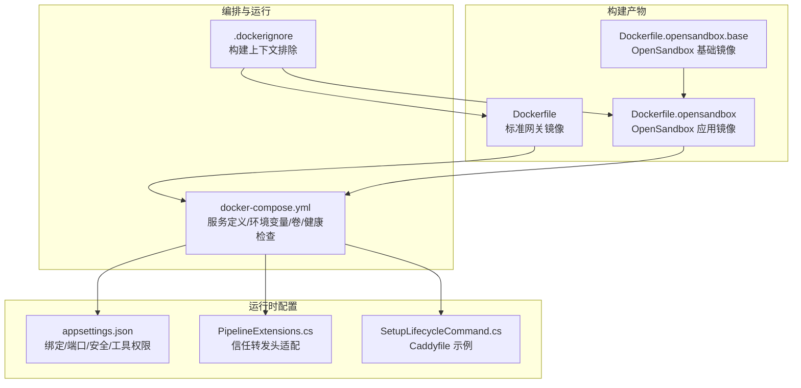
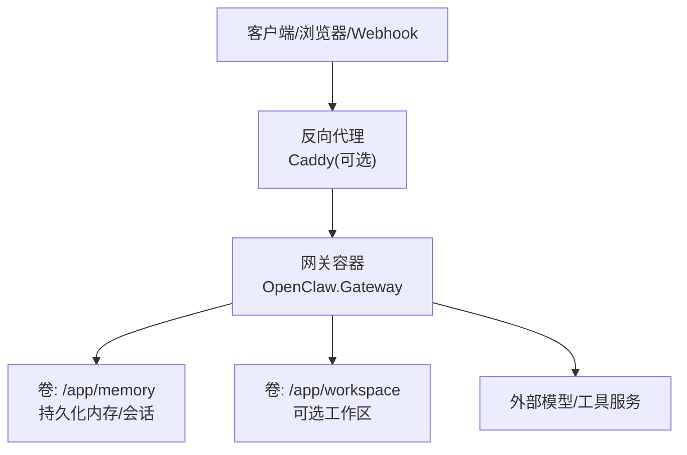
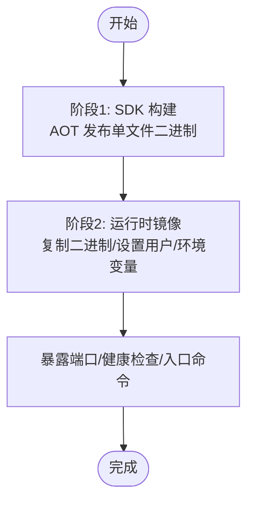
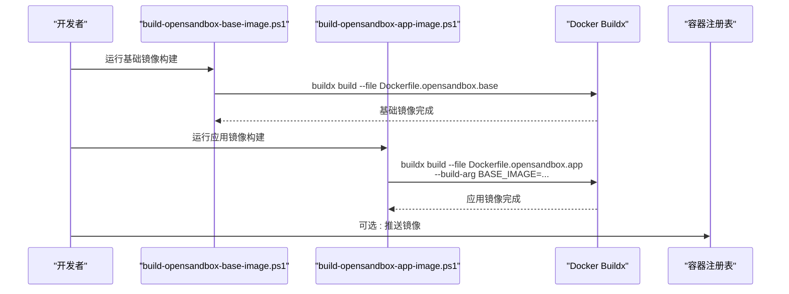
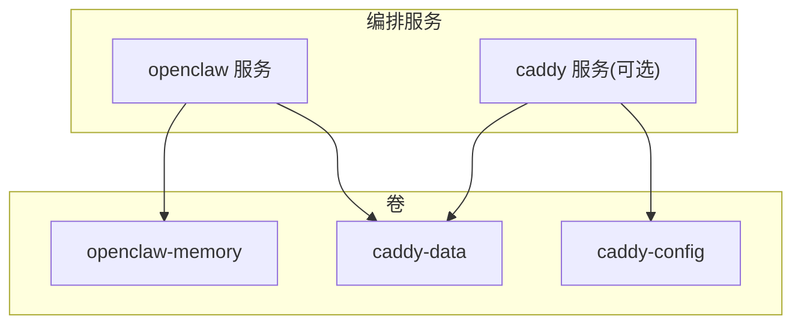
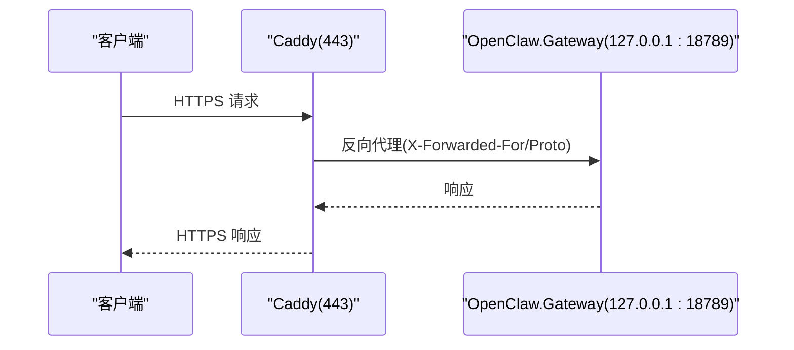
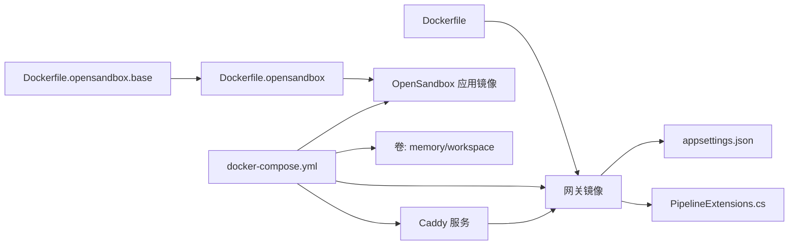

# Docker 部署

<cite>
**本文引用的文件**
- [Dockerfile](file://Dockerfile)
- [docker-compose.yml](file://docker-compose.yml)
- [.dockerignore](file://.dockerignore)
- [Dockerfile.opensandbox](file://Dockerfile.opensandbox)
- [Dockerfile.opensandbox.base](file://Dockerfile.opensandbox.base)
- [scripts/build-opensandbox-base-image.ps1](file://scripts/build-opensandbox-base-image.ps1)
- [scripts/build-opensandbox-app-image.ps1](file://scripts/build-opensandbox-app-image.ps1)
- [src/OpenClaw.Gateway/appsettings.json](file://src/OpenClaw.Gateway/appsettings.json)
- [src/OpenClaw.Gateway/Pipeline/PipelineExtensions.cs](file://src/OpenClaw.Gateway/Pipeline/PipelineExtensions.cs)
- [src/OpenClaw.Cli/SetupLifecycleCommand.cs](file://src/OpenClaw.Cli/SetupLifecycleCommand.cs)
- [README.md](file://README.md)
</cite>

## 目录
1. [简介](#简介)
2. [项目结构](#项目结构)
3. [核心组件](#核心组件)
4. [架构总览](#架构总览)
5. [详细组件分析](#详细组件分析)
6. [依赖关系分析](#依赖关系分析)
7. [性能考量](#性能考量)
8. [故障排查指南](#故障排查指南)
9. [结论](#结论)
10. [附录](#附录)

## 简介
本文件面向生产级 Docker 部署，系统性阐述镜像构建（含多阶段与 OpenSandbox 基础层）、容器运行参数（环境变量、卷挂载、网络与健康检查）、运维配置（重启策略、资源限制、反向代理与自动 TLS）、以及调试与监控方法。内容基于仓库中现有的 Dockerfile、docker-compose.yml、脚本与应用配置文件进行归纳总结。

## 项目结构
与 Docker 部署直接相关的关键文件与职责如下：
- Dockerfile：标准网关镜像的多阶段构建，面向生产（NativeAOT 单文件发布），最小运行时基础镜像，内置健康检查与默认环境变量。
- docker-compose.yml：定义 openclaw 主服务与可选的 Caddy 反向代理服务，包含端口映射、环境变量注入、卷挂载、健康检查与启动顺序。
- .dockerignore：排除构建上下文中的无关目录与文件，减少镜像体积与构建时间。
- Dockerfile.opensandbox / Dockerfile.opensandbox.base：面向 OpenSandbox 的完整工具链镜像，包含浏览器、Node、Playwright 等依赖；提供“基础镜像 + 应用镜像”的分层构建策略以提升迭代效率。
- scripts/build-opensandbox-*.ps1：PowerShell 脚本封装多平台构建、标签管理与推送流程，便于 CI/CD 或本地快速构建。
- src/OpenClaw.Gateway/appsettings.json：应用默认配置（如绑定地址、端口、安全策略、工具权限等），用于理解容器内运行时行为。
- src/OpenClaw.Gateway/Pipeline/PipelineExtensions.cs：在启用信任转发头时对反向代理进行适配。
- src/OpenClaw.Cli/SetupLifecycleCommand.cs：生成 Caddyfile 示例与本地开发部署建议。
- README.md：部署与 TLS 最佳实践、认证与生产加固清单。

**图表来源**
- [Dockerfile:1-59](file://Dockerfile#L1-L59)
- [Dockerfile.opensandbox:1-113](file://Dockerfile.opensandbox#L1-L113)
- [Dockerfile.opensandbox.base:1-76](file://Dockerfile.opensandbox.base#L1-L76)
- [docker-compose.yml:1-68](file://docker-compose.yml#L1-L68)
- [.dockerignore:1-14](file://.dockerignore#L1-L14)
- [src/OpenClaw.Gateway/appsettings.json:1-200](file://src/OpenClaw.Gateway/appsettings.json#L1-L200)
- [src/OpenClaw.Gateway/Pipeline/PipelineExtensions.cs:91-127](file://src/OpenClaw.Gateway/Pipeline/PipelineExtensions.cs#L91-L127)
- [src/OpenClaw.Cli/SetupLifecycleCommand.cs:503-513](file://src/OpenClaw.Cli/SetupLifecycleCommand.cs#L503-L513)

**章节来源**
- [Dockerfile:1-59](file://Dockerfile#L1-L59)
- [docker-compose.yml:1-68](file://docker-compose.yml#L1-L68)
- [.dockerignore:1-14](file://.dockerignore#L1-L14)
- [Dockerfile.opensandbox:1-113](file://Dockerfile.opensandbox#L1-L113)
- [Dockerfile.opensandbox.base:1-76](file://Dockerfile.opensandbox.base#L1-L76)
- [scripts/build-opensandbox-base-image.ps1:1-127](file://scripts/build-opensandbox-base-image.ps1#L1-L127)
- [scripts/build-opensandbox-app-image.ps1:1-141](file://scripts/build-opensandbox-app-image.ps1#L1-L141)
- [src/OpenClaw.Gateway/appsettings.json:1-200](file://src/OpenClaw.Gateway/appsettings.json#L1-L200)
- [src/OpenClaw.Gateway/Pipeline/PipelineExtensions.cs:91-127](file://src/OpenClaw.Gateway/Pipeline/PipelineExtensions.cs#L91-L127)
- [src/OpenClaw.Cli/SetupLifecycleCommand.cs:503-513](file://src/OpenClaw.Cli/SetupLifecycleCommand.cs#L503-L513)
- [README.md:277-610](file://README.md#L277-L610)

## 核心组件
- 标准网关镜像（Dockerfile）
  - 多阶段构建：第一阶段使用 SDK 构建并发布 NativeAOT 单文件二进制；第二阶段使用极简运行时基础镜像，仅包含运行所需依赖。
  - 默认环境变量：绑定地址、端口、内存存储路径、工具权限与插件开关等，确保非回环绑定的安全默认。
  - 健康检查：通过命令行参数触发健康检查模式，周期与超时已配置。
  - 入口命令：直接启动网关进程。
- OpenSandbox 镜像族（Dockerfile.opensandbox 与 Dockerfile.opensandbox.base）
  - 基础镜像（base）：预装系统包、Node、Playwright 浏览器二进制与工具链，降低应用镜像构建频率与体积变化。
  - 应用镜像（app）：在 base 上叠加 .NET 发布产物，支持 JIT 运行模式与更丰富的工具能力。
  - 构建脚本：提供多平台、标签、推送与本地加载的统一入口。
- 编排与运行（docker-compose.yml）
  - openclaw 服务：镜像来源、构建上下文、端口映射、环境变量（必填与可选）、卷挂载、健康检查与重启策略。
  - 可选 Caddy 服务：自动 TLS，监听 80/443，按需启用 with-tls profile，依赖 openclaw 健康状态。
  - 卷：持久化内存数据与可选工作区挂载。
- 运行时配置（appsettings.json 与中间件）
  - 绑定地址与端口、安全策略（转发头信任、代理白名单、跨域、令牌校验等）、工具权限与工作区根路径。
  - 反向代理适配：启用信任转发头后，根据配置添加代理 IP 白名单。

**章节来源**
- [Dockerfile:1-59](file://Dockerfile#L1-L59)
- [Dockerfile.opensandbox:1-113](file://Dockerfile.opensandbox#L1-L113)
- [Dockerfile.opensandbox.base:1-76](file://Dockerfile.opensandbox.base#L1-L76)
- [docker-compose.yml:1-68](file://docker-compose.yml#L1-L68)
- [src/OpenClaw.Gateway/appsettings.json:1-200](file://src/OpenClaw.Gateway/appsettings.json#L1-L200)
- [src/OpenClaw.Gateway/Pipeline/PipelineExtensions.cs:91-127](file://src/OpenClaw.Gateway/Pipeline/PipelineExtensions.cs#L91-L127)

## 架构总览
下图展示容器化部署的整体交互：客户端请求经反向代理（可选）到达网关容器，网关读取环境变量与配置，访问持久化卷中的内存数据，并通过工具执行与外部服务通信。

**图表来源**
- [docker-compose.yml:4-62](file://docker-compose.yml#L4-L62)
- [Dockerfile:43-51](file://Dockerfile#L43-L51)
- [Dockerfile.opensandbox:91-104](file://Dockerfile.opensandbox#L91-L104)

**章节来源**
- [docker-compose.yml:1-68](file://docker-compose.yml#L1-L68)
- [Dockerfile:1-59](file://Dockerfile#L1-L59)
- [Dockerfile.opensandbox:1-113](file://Dockerfile.opensandbox#L1-L113)

## 详细组件分析

### 标准网关镜像（Dockerfile）
- 多阶段构建要点
  - 第一阶段：安装 AOT 所需系统依赖（clang、zlib），恢复 NuGet 包，发布为单文件二进制，预创建内存目录。
  - 第二阶段：使用极简运行时基础镜像，复制二进制与用户，设置默认环境变量，暴露端口，配置健康检查与入口命令。
- 安全与默认值
  - 默认绑定到 0.0.0.0 与固定端口，内存存储路径指向 /app/memory，工具权限严格，默认禁用插件桥接。
  - 非回环绑定场景要求设置鉴权令牌，避免未授权访问。
- 健康检查
  - 通过命令行参数触发健康检查模式，具备间隔、超时与重试次数配置。

**图表来源**
- [Dockerfile:1-59](file://Dockerfile#L1-L59)

**章节来源**
- [Dockerfile:1-59](file://Dockerfile#L1-L59)

### OpenSandbox 镜像族（Dockerfile.opensandbox 与 Dockerfile.opensandbox.base）
- 基础镜像（base）
  - 预装系统工具、Node、Playwright 浏览器二进制与包管理器，形成稳定且变化较少的基础层。
  - 为应用镜像提供可复用的“工具链层”，缩短增量构建时间。
- 应用镜像（app）
  - 在 base 上复制发布产物，设置运行时环境变量（包括运行模式、工作区根、工具权限、转发头信任等），预装浏览器并配置缓存路径。
  - 提供更丰富的工具能力（如浏览器、Python、PDF 解析等），适合需要沙箱能力的场景。
- 构建脚本
  - build-opensandbox-base-image.ps1：构建 base 镜像，支持多平台与标签管理。
  - build-opensandbox-app-image.ps1：在 base 基础上构建应用镜像，支持多平台、推送与本地加载。

**图表来源**
- [scripts/build-opensandbox-base-image.ps1:1-127](file://scripts/build-opensandbox-base-image.ps1#L1-L127)
- [scripts/build-opensandbox-app-image.ps1:1-141](file://scripts/build-opensandbox-app-image.ps1#L1-L141)
- [Dockerfile.opensandbox.base:1-76](file://Dockerfile.opensandbox.base#L1-L76)
- [Dockerfile.opensandbox:1-113](file://Dockerfile.opensandbox#L1-L113)

**章节来源**
- [Dockerfile.opensandbox.base:1-76](file://Dockerfile.opensandbox.base#L1-L76)
- [Dockerfile.opensandbox:1-113](file://Dockerfile.opensandbox#L1-L113)
- [scripts/build-opensandbox-base-image.ps1:1-127](file://scripts/build-opensandbox-base-image.ps1#L1-L127)
- [scripts/build-opensandbox-app-image.ps1:1-141](file://scripts/build-opensandbox-app-image.ps1#L1-L141)

### docker-compose.yml 服务与配置
- openclaw 服务
  - 镜像来源与构建上下文；容器名；重启策略（除非停止）；端口映射 18789:18789。
  - 环境变量：必填（模型提供商密钥、鉴权令牌）、可选（模型/端点）、应用配置（双下划线表示节分隔）。
  - 卷：持久化内存目录与可选工作区挂载。
  - 健康检查：测试命令、间隔、超时、重试与启动期。
- 可选 Caddy 服务
  - 自动 TLS，监听 80/443；通过环境变量注入域名；依赖 openclaw 健康状态；按 with-tls profile 启用。
- 卷
  - openclaw-memory、caddy-data、caddy-config，分别用于网关内存、Caddy 数据与配置。

**图表来源**
- [docker-compose.yml:1-68](file://docker-compose.yml#L1-L68)

**章节来源**
- [docker-compose.yml:1-68](file://docker-compose.yml#L1-L68)

### 反向代理与自动 TLS 集成
- Caddy 集成
  - docker-compose 中提供 Caddy 服务，监听 80/443，自动证书申请；通过环境变量注入域名；依赖 openclaw 健康状态。
  - 可通过 profile with-tls 启用。
- 信任转发头
  - 当启用 TrustForwardedHeaders 时，需配置 KnownProxies 列表，以便网关正确识别客户端真实 IP 与协议。
- Caddyfile 生成
  - CLI 工具可生成示例 Caddyfile，将请求反向代理至网关进程。

**图表来源**
- [docker-compose.yml:44-62](file://docker-compose.yml#L44-L62)
- [src/OpenClaw.Gateway/Pipeline/PipelineExtensions.cs:91-127](file://src/OpenClaw.Gateway/Pipeline/PipelineExtensions.cs#L91-L127)
- [src/OpenClaw.Cli/SetupLifecycleCommand.cs:503-513](file://src/OpenClaw.Cli/SetupLifecycleCommand.cs#L503-L513)

**章节来源**
- [docker-compose.yml:44-62](file://docker-compose.yml#L44-L62)
- [src/OpenClaw.Gateway/Pipeline/PipelineExtensions.cs:91-127](file://src/OpenClaw.Gateway/Pipeline/PipelineExtensions.cs#L91-L127)
- [src/OpenClaw.Cli/SetupLifecycleCommand.cs:503-513](file://src/OpenClaw.Cli/SetupLifecycleCommand.cs#L503-L513)
- [README.md:530-581](file://README.md#L530-L581)

### 健康检查与重启策略
- 健康检查
  - 网关支持通过命令行参数进入健康检查模式，容器层面也配置了健康检查指令、间隔、超时与重试次数。
  - compose 中 openclaw 与 Caddy 均配置了健康检查，Caddy 依赖 openclaw 健康状态。
- 重启策略
  - openclaw 使用 unless-stopped，确保异常退出后自动重启。
- 生产建议
  - 结合健康检查与重启策略，配合外部监控系统（如 Prometheus/Grafana）实现自愈与告警。

**章节来源**
- [Dockerfile:55-56](file://Dockerfile#L55-L56)
- [docker-compose.yml:37-42](file://docker-compose.yml#L37-L42)
- [docker-compose.yml:10-10](file://docker-compose.yml#L10-L10)

### 环境变量与配置映射
- 关键环境变量
  - 必填：模型提供商密钥、鉴权令牌。
  - 可选：模型/端点、绑定地址/端口、工具权限、插件开关、转发头信任与代理白名单。
- 配置映射规则
  - compose 中使用双下划线（如 OpenClaw__BindAddress）表示配置节分隔，对应 appsettings.json 中的层级结构。
- 运行时默认值
  - Dockerfile 中设置了默认绑定地址、端口、内存路径与工具权限，确保非回环绑定的安全默认。

**章节来源**
- [docker-compose.yml:13-31](file://docker-compose.yml#L13-L31)
- [Dockerfile:43-51](file://Dockerfile#L43-L51)
- [src/OpenClaw.Gateway/appsettings.json:1-200](file://src/OpenClaw.Gateway/appsettings.json#L1-L200)

### 卷挂载策略
- 持久化内存
  - openclaw-memory 卷挂载到 /app/memory，确保会话与记忆数据在容器重建后不丢失。
- 可选工作区
  - 将宿主机目录挂载到 /app/workspace，便于文件工具与工作流使用。
- Caddy 数据
  - caddy-data 与 caddy-config 分别持久化证书与配置，避免重复申请证书与配置丢失。

**章节来源**
- [docker-compose.yml:32-36](file://docker-compose.yml#L32-L36)
- [docker-compose.yml:64-67](file://docker-compose.yml#L64-L67)

## 依赖关系分析
- 构建依赖
  - Dockerfile 依赖 .dockerignore 控制构建上下文大小；OpenSandbox 镜像依赖基础镜像以减少重复安装。
- 运行依赖
  - openclaw 依赖环境变量与 appsettings.json；启用转发头时依赖 PipelineExtensions 中的 KnownProxies。
  - Caddy 依赖 openclaw 健康状态，确保上游可用后再对外提供服务。

**图表来源**
- [Dockerfile:1-59](file://Dockerfile#L1-L59)
- [Dockerfile.opensandbox.base:1-76](file://Dockerfile.opensandbox.base#L1-L76)
- [Dockerfile.opensandbox:1-113](file://Dockerfile.opensandbox#L1-L113)
- [docker-compose.yml:1-68](file://docker-compose.yml#L1-L68)
- [src/OpenClaw.Gateway/appsettings.json:1-200](file://src/OpenClaw.Gateway/appsettings.json#L1-L200)
- [src/OpenClaw.Gateway/Pipeline/PipelineExtensions.cs:91-127](file://src/OpenClaw.Gateway/Pipeline/PipelineExtensions.cs#L91-L127)

**章节来源**
- [Dockerfile:1-59](file://Dockerfile#L1-L59)
- [Dockerfile.opensandbox.base:1-76](file://Dockerfile.opensandbox.base#L1-L76)
- [Dockerfile.opensandbox:1-113](file://Dockerfile.opensandbox#L1-L113)
- [docker-compose.yml:1-68](file://docker-compose.yml#L1-L68)
- [src/OpenClaw.Gateway/appsettings.json:1-200](file://src/OpenClaw.Gateway/appsettings.json#L1-L200)
- [src/OpenClaw.Gateway/Pipeline/PipelineExtensions.cs:91-127](file://src/OpenClaw.Gateway/Pipeline/PipelineExtensions.cs#L91-L127)

## 性能考量
- 多阶段构建与极简运行时
  - 使用极简运行时基础镜像与 AOT 单文件发布，显著降低镜像体积与启动延迟。
- OpenSandbox 基础镜像复用
  - 将系统包、Node、Playwright 等稳定依赖下沉至 base 镜像，应用镜像仅叠加 .NET 发布产物，提升构建效率。
- 工作区与内存卷
  - 将工作区与内存目录挂载为卷，避免频繁 IO 与数据丢失，提高稳定性。
- 反向代理与转发头
  - 合理配置 KnownProxies 与 TrustForwardedHeaders，避免额外解析开销与错误的客户端识别。

**章节来源**
- [Dockerfile:35-59](file://Dockerfile#L35-L59)
- [Dockerfile.opensandbox.base:19-57](file://Dockerfile.opensandbox.base#L19-L57)
- [Dockerfile.opensandbox:72-104](file://Dockerfile.opensandbox#L72-L104)
- [src/OpenClaw.Gateway/Pipeline/PipelineExtensions.cs:91-127](file://src/OpenClaw.Gateway/Pipeline/PipelineExtensions.cs#L91-L127)

## 故障排查指南
- 健康检查失败
  - 检查容器日志与健康检查命令返回码；确认环境变量是否正确注入（如鉴权令牌、模型密钥）。
  - 若启用反向代理，确认 Caddy 依赖 openclaw 健康状态。
- 认证与安全
  - 非回环绑定必须设置鉴权令牌；若使用查询字符串令牌，需在配置中允许。
  - 跨域与转发头：若前端与网关分离，确保 AllowedOrigins 与 TrustForwardedHeaders/ KnownProxies 正确配置。
- 日志与可观测性
  - 使用容器日志查看器或集中式日志系统收集容器输出。
  - 生产建议：结合健康检查与指标端点（如 /health、/metrics）进行监控与告警。
- 调试技巧
  - 临时开启更宽松的工具权限（如允许 shell、放宽根目录限制）进行问题定位，定位后恢复安全默认。
  - 使用 compose 的健康检查与重启策略配合外部探针，实现自愈与快速恢复。

**章节来源**
- [docker-compose.yml:37-42](file://docker-compose.yml#L37-L42)
- [docker-compose.yml:58-60](file://docker-compose.yml#L58-L60)
- [src/OpenClaw.Gateway/appsettings.json:82-102](file://src/OpenClaw.Gateway/appsettings.json#L82-L102)
- [README.md:277-296](file://README.md#L277-L296)

## 结论
本项目提供了两条清晰的部署路径：面向生产的轻量镜像（Dockerfile）与面向沙箱能力的完整镜像族（Dockerfile.opensandbox 与 Dockerfile.opensandbox.base）。通过 docker-compose.yml 实现服务编排、环境变量注入、卷挂载与健康检查；结合反向代理与自动 TLS，满足生产级可用性与安全性需求。配合脚本化的构建流程与运行时安全默认，可快速落地并长期维护。

## 附录
- 生产加固清单（摘自 README）
  - 设置强随机鉴权令牌；通过环境变量注入模型密钥；使用生产配置文件；启用 TLS；限制跨域与代理信任；速率限制；监控健康与指标端点；固定镜像标签。
- TLS 选项
  - Caddy 反向代理（推荐）；nginx 反向代理；Kestrel 直接 HTTPS。

**章节来源**
- [README.md:517-581](file://README.md#L517-L581)