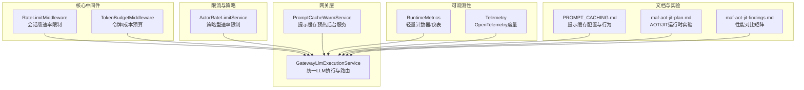
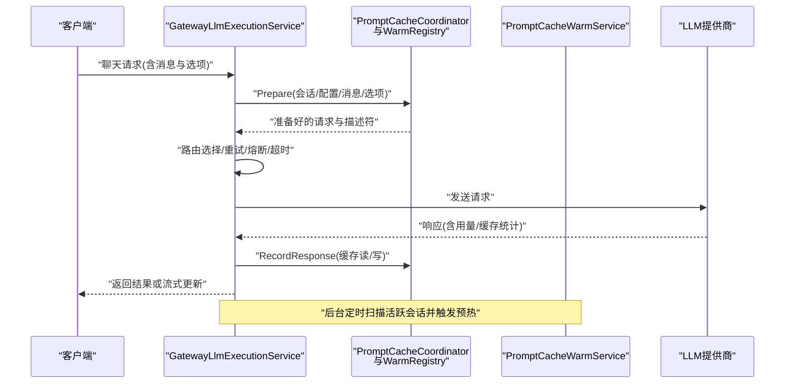
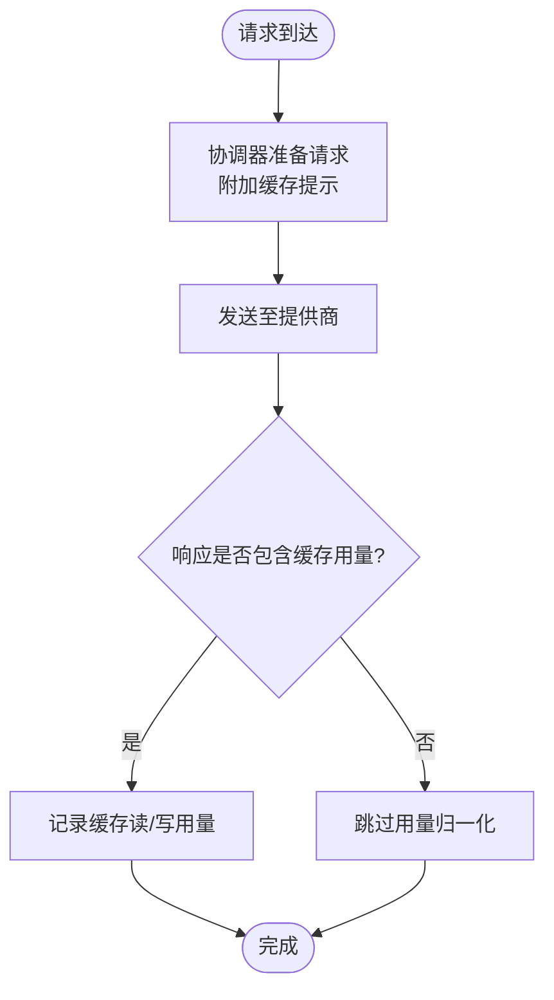
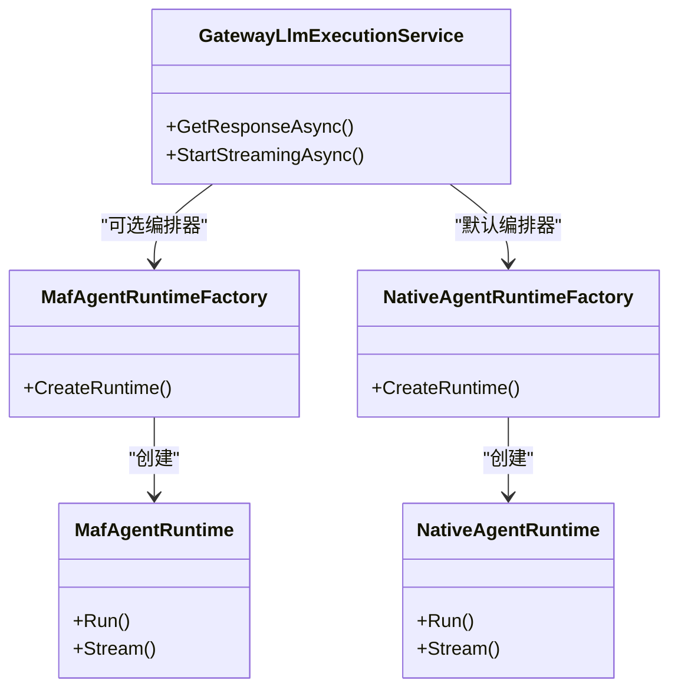
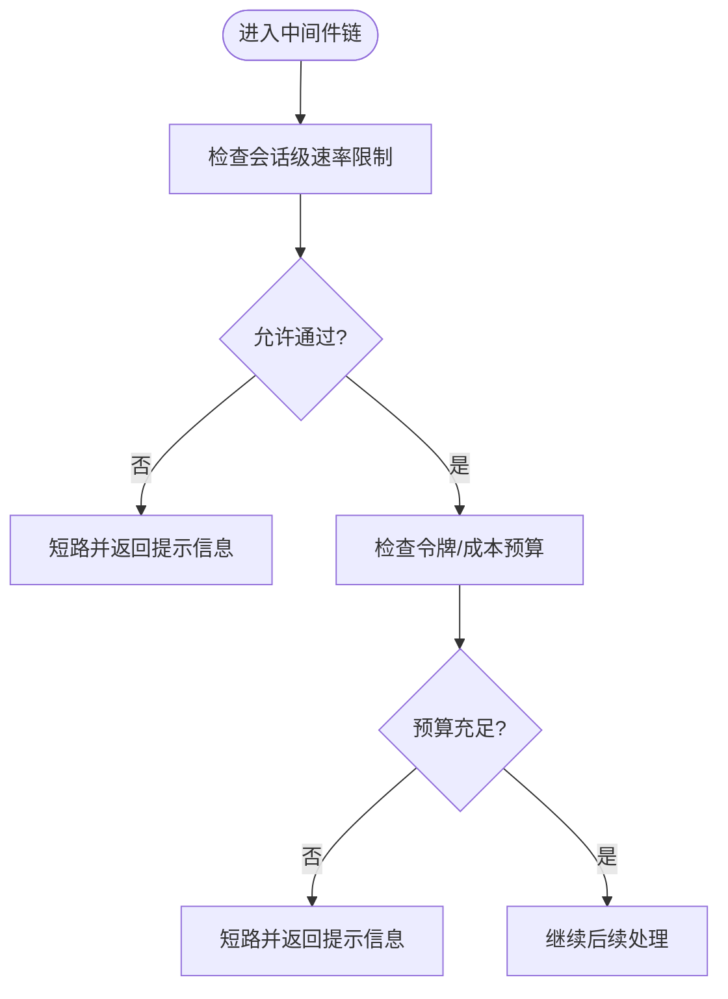
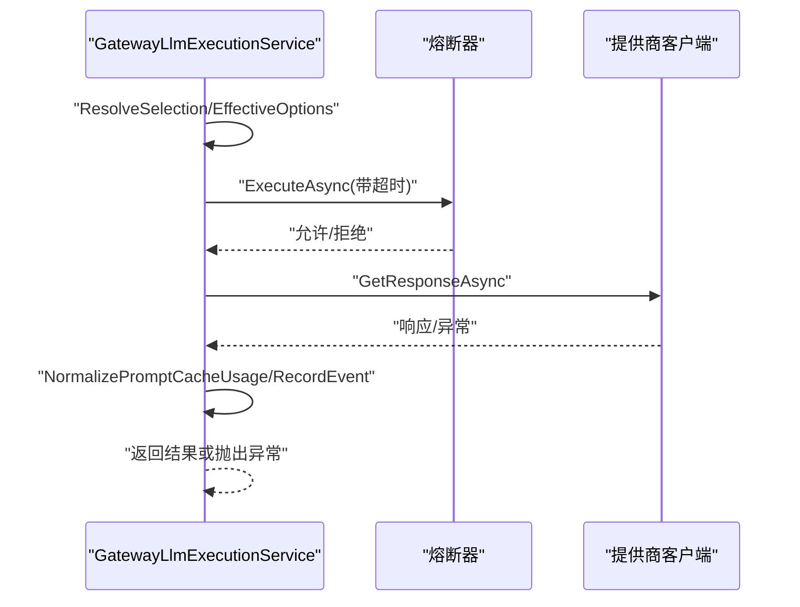
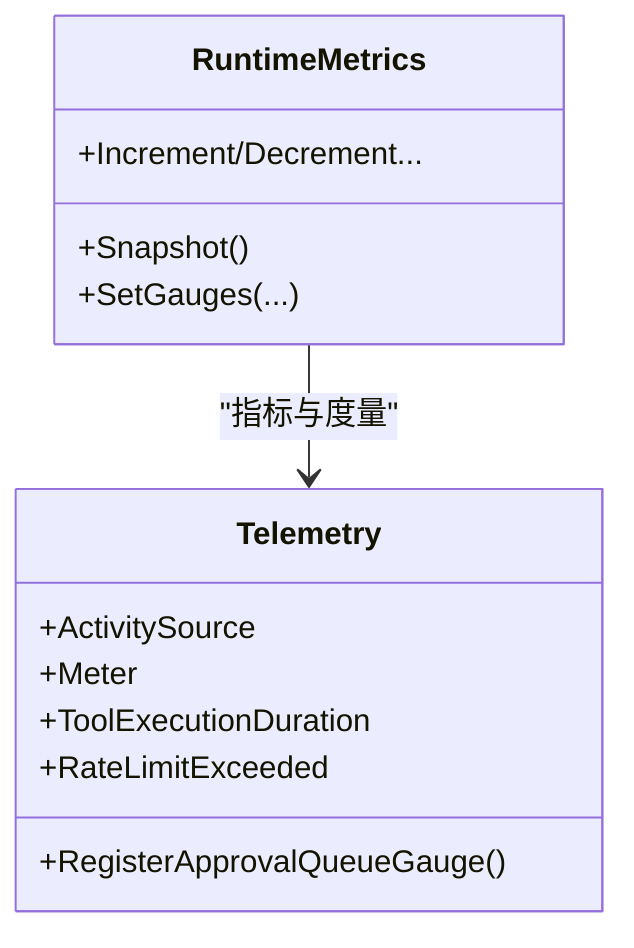
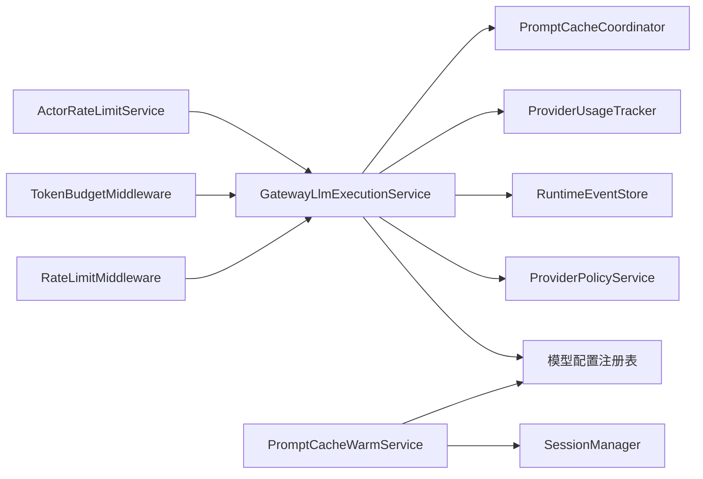

# 性能优化

<cite>
**本文引用的文件**
- [PROMPT_CACHING.md](file://docs/PROMPT_CACHING.md)
- [maf-aot-jit-plan.md](file://docs/maf-aot-jit/maf-aot-jit-plan.md)
- [maf-aot-jit-findings.md](file://docs/maf-aot-jit/maf-aot-jit-findings.md)
- [ActorRateLimitService.cs](file://src/OpenClaw.Gateway/ActorRateLimitService.cs)
- [RateLimitMiddleware.cs](file://src/OpenClaw.Core/Middleware/RateLimitMiddleware.cs)
- [TokenBudgetMiddleware.cs](file://src/OpenClaw.Core/Middleware/TokenBudgetMiddleware.cs)
- [PromptCacheWarmService.cs](file://src/OpenClaw.Gateway/PromptCaching/PromptCacheWarmService.cs)
- [GatewayLlmExecutionService.cs](file://src/OpenClaw.Gateway/GatewayLlmExecutionService.cs)
- [RuntimeMetrics.cs](file://src/OpenClaw.Core/Observability/RuntimeMetrics.cs)
- [Telemetry.cs](file://src/OpenClaw.Core/Observability/Telemetry.cs)
</cite>

## 目录
1. [简介](#简介)
2. [项目结构](#项目结构)
3. [核心组件](#核心组件)
4. [架构总览](#架构总览)
5. [详细组件分析](#详细组件分析)
6. [依赖关系分析](#依赖关系分析)
7. [性能考量](#性能考量)
8. [故障排查指南](#故障排查指南)
9. [结论](#结论)
10. [附录](#附录)

## 简介
本文件聚焦于 Kingcrab（OpenClaw.NET）在性能优化方面的设计与实现，覆盖提示缓存机制、AOT/JIT 运行时配置、系统级限流与资源控制、可观测性与度量指标、以及应用级缓存与预热策略。文档以代码为依据，提供可操作的配置建议、性能调优实践与排障指引。

## 项目结构
围绕性能优化的关键模块分布如下：
- 提示缓存：位于网关层的协调器与后台预热服务，配合模型配置与跟踪能力
- 运行时与执行：网关统一的 LLM 执行服务，封装路由选择、重试、熔断与使用统计
- 并发与限流：会话级消息速率中间件与全局策略型速率限制服务
- 资源预算：基于令牌与成本的会话预算中间件
- 可观测性：集中式运行时指标与遥测度量，支持健康端点与外部监控系统
- AOT/JIT 实验：通过运行时模式与编排器选择评估不同发布/运行路径的性能差异

图表来源
- [GatewayLlmExecutionService.cs:18-96](file://src/OpenClaw.Gateway/GatewayLlmExecutionService.cs#L18-L96)
- [PromptCacheWarmService.cs:10-33](file://src/OpenClaw.Gateway/PromptCaching/PromptCacheWarmService.cs#L10-L33)
- [RateLimitMiddleware.cs:10-37](file://src/OpenClaw.Core/Middleware/RateLimitMiddleware.cs#L10-L37)
- [TokenBudgetMiddleware.cs:12-34](file://src/OpenClaw.Core/Middleware/TokenBudgetMiddleware.cs#L12-L34)
- [ActorRateLimitService.cs:9-40](file://src/OpenClaw.Gateway/ActorRateLimitService.cs#L9-L40)
- [RuntimeMetrics.cs:10-71](file://src/OpenClaw.Core/Observability/RuntimeMetrics.cs#L10-L71)
- [Telemetry.cs:9-23](file://src/OpenClaw.Core/Observability/Telemetry.cs#L9-L23)
- [PROMPT_CACHING.md:1-191](file://docs/PROMPT_CACHING.md#L1-L191)
- [maf-aot-jit-plan.md:1-172](file://docs/maf-aot-jit/maf-aot-jit-plan.md#L1-L172)
- [maf-aot-jit-findings.md:1-24](file://docs/maf-aot-jit/maf-aot-jit-findings.md#L1-L24)

章节来源
- [PROMPT_CACHING.md:1-191](file://docs/PROMPT_CACHING.md#L1-L191)
- [maf-aot-jit-plan.md:1-172](file://docs/maf-aot-jit/maf-aot-jit-plan.md#L1-L172)
- [maf-aot-jit-findings.md:1-24](file://docs/maf-aot-jit/maf-aot-jit-findings.md#L1-L24)

## 核心组件
- 提示缓存（Prompt Caching）
  - 支持跨轮次稳定前缀的缓存读写，统一归一化用量统计，按方言与保留策略适配不同上游提供商
  - 提供后台预热服务，按会话与配置周期性触发最小代价请求以维持缓存命中
- 统一 LLM 执行服务
  - 路由选择、重试退避、超时控制、熔断保护、事件记录与用量归一化
- 速率限制与预算
  - 会话级速率限制中间件与策略型速率限制服务，防止突发流量
  - 令牌与成本预算中间件，保障会话内资源消耗可控
- 可观测性
  - 轻量计数器与仪表，暴露健康端点；OpenTelemetry 度量直连外部监控
- AOT/JIT 运行时
  - 通过配置选择运行时模式与编排器，对比启动与回合耗时，评估不同路径的可行性

章节来源
- [PROMPT_CACHING.md:1-191](file://docs/PROMPT_CACHING.md#L1-L191)
- [PromptCacheWarmService.cs:10-136](file://src/OpenClaw.Gateway/PromptCaching/PromptCacheWarmService.cs#L10-L136)
- [GatewayLlmExecutionService.cs:18-96](file://src/OpenClaw.Gateway/GatewayLlmExecutionService.cs#L18-L96)
- [RateLimitMiddleware.cs:10-93](file://src/OpenClaw.Core/Middleware/RateLimitMiddleware.cs#L10-L93)
- [TokenBudgetMiddleware.cs:12-71](file://src/OpenClaw.Core/Middleware/TokenBudgetMiddleware.cs#L12-L71)
- [ActorRateLimitService.cs:9-282](file://src/OpenClaw.Gateway/ActorRateLimitService.cs#L9-L282)
- [RuntimeMetrics.cs:10-312](file://src/OpenClaw.Core/Observability/RuntimeMetrics.cs#L10-L312)
- [Telemetry.cs:9-54](file://src/OpenClaw.Core/Observability/Telemetry.cs#L9-L54)
- [maf-aot-jit-plan.md:78-98](file://docs/maf-aot-jit/maf-aot-jit-plan.md#L78-L98)

## 架构总览
下图展示提示缓存与统一执行服务在整体链路中的位置与交互：

图表来源
- [GatewayLlmExecutionService.cs:218-358](file://src/OpenClaw.Gateway/GatewayLlmExecutionService.cs#L218-L358)
- [PromptCacheWarmService.cs:57-134](file://src/OpenClaw.Gateway/PromptCaching/PromptCacheWarmService.cs#L57-L134)

章节来源
- [GatewayLlmExecutionService.cs:218-520](file://src/OpenClaw.Gateway/GatewayLlmExecutionService.cs#L218-L520)
- [PromptCacheWarmService.cs:35-134](file://src/OpenClaw.Gateway/PromptCaching/PromptCacheWarmService.cs#L35-L134)

## 详细组件分析

### 提示缓存机制与预热
- 配置与方言
  - 全局与模型配置层面均可启用提示缓存，并指定方言与保留策略
  - 不同提供商对缓存键与用量字段的归一化处理存在差异
- 协调与预热
  - 执行服务在每次请求前调用协调器进行准备，并在响应后记录缓存用量
  - 后台服务定期扫描活跃会话，按配置的最小间隔触发预热请求，维持缓存可用性
- 诊断与追踪
  - 用量与事件通过指标与事件存储上报，支持诊断与审计

图表来源
- [GatewayLlmExecutionService.cs:255-310](file://src/OpenClaw.Gateway/GatewayLlmExecutionService.cs#L255-L310)
- [PROMPT_CACHING.md:136-191](file://docs/PROMPT_CACHING.md#L136-L191)

章节来源
- [PROMPT_CACHING.md:21-191](file://docs/PROMPT_CACHING.md#L21-L191)
- [GatewayLlmExecutionService.cs:255-310](file://src/OpenClaw.Gateway/GatewayLlmExecutionService.cs#L255-L310)
- [PromptCacheWarmService.cs:57-134](file://src/OpenClaw.Gateway/PromptCaching/PromptCacheWarmService.cs#L57-L134)

### AOT 与 JIT 运行时配置与性能对比
- 运行时模式与编排器选择
  - 通过配置项选择运行时模式与编排器，支持默认与实验性适配器
- 性能矩阵
  - 在四种组合（JIT/Native、JIT/MAF、AOT/Native、AOT/MAF）下测量启动与回合耗时，用于对比与决策

图表来源
- [maf-aot-jit-plan.md:56-76](file://docs/maf-aot-jit/maf-aot-jit-plan.md#L56-L76)
- [maf-aot-jit-findings.md:7-12](file://docs/maf-aot-jit/maf-aot-jit-findings.md#L7-L12)

章节来源
- [maf-aot-jit-plan.md:78-98](file://docs/maf-aot-jit/maf-aot-jit-plan.md#L78-L98)
- [maf-aot-jit-findings.md:7-24](file://docs/maf-aot-jit/maf-aot-jit-findings.md#L7-L24)

### 速率限制与资源预算
- 会话级速率限制中间件
  - 基于时间窗口的消息数量限制，定期清理空闲窗口
- 策略型速率限制服务
  - 支持按 Actor 类型/作用域/匹配值定义突发与持续限额，带持久化策略文件
- 令牌与成本预算中间件
  - 会话内累计输入输出令牌，超过阈值短路；可选按通道/发送者检查美元成本预算

图表来源
- [RateLimitMiddleware.cs:39-68](file://src/OpenClaw.Core/Middleware/RateLimitMiddleware.cs#L39-L68)
- [TokenBudgetMiddleware.cs:36-69](file://src/OpenClaw.Core/Middleware/TokenBudgetMiddleware.cs#L36-L69)
- [ActorRateLimitService.cs:92-148](file://src/OpenClaw.Gateway/ActorRateLimitService.cs#L92-L148)

章节来源
- [RateLimitMiddleware.cs:10-93](file://src/OpenClaw.Core/Middleware/RateLimitMiddleware.cs#L10-L93)
- [TokenBudgetMiddleware.cs:12-71](file://src/OpenClaw.Core/Middleware/TokenBudgetMiddleware.cs#L12-L71)
- [ActorRateLimitService.cs:9-282](file://src/OpenClaw.Gateway/ActorRateLimitService.cs#L9-L282)

### 统一 LLM 执行与熔断/重试/超时
- 路由选择与回退
  - 根据会话与估算输入/输出令牌选择模型配置，支持多模型尝试与回退
- 重试与退避
  - 指数退避延迟，上限控制，失败计数与错误事件记录
- 超时与熔断
  - 可配置超时，结合熔断器状态避免雪崩
- 用量归一化与事件记录
  - 归一化提供商返回的缓存用量，记录路由选择、请求开始/完成等事件

图表来源
- [GatewayLlmExecutionService.cs:218-358](file://src/OpenClaw.Gateway/GatewayLlmExecutionService.cs#L218-L358)
- [GatewayLlmExecutionService.cs:434-520](file://src/OpenClaw.Gateway/GatewayLlmExecutionService.cs#L434-L520)

章节来源
- [GatewayLlmExecutionService.cs:218-520](file://src/OpenClaw.Gateway/GatewayLlmExecutionService.cs#L218-L520)

### 可观测性与度量
- 运行时指标
  - 提供大量计数器与仪表，如 LLM 请求/重试/错误、工具调用、提示缓存读写、脉冲运行等
  - 暴露快照结构用于序列化与健康端点
- 遥测度量
  - OpenTelemetry 的 Histogram 与 Counter，支持外部监控系统采集

图表来源
- [RuntimeMetrics.cs:10-312](file://src/OpenClaw.Core/Observability/RuntimeMetrics.cs#L10-L312)
- [Telemetry.cs:9-54](file://src/OpenClaw.Core/Observability/Telemetry.cs#L9-L54)

章节来源
- [RuntimeMetrics.cs:10-312](file://src/OpenClaw.Core/Observability/RuntimeMetrics.cs#L10-L312)
- [Telemetry.cs:9-54](file://src/OpenClaw.Core/Observability/Telemetry.cs#L9-L54)

## 依赖关系分析
- 组件耦合
  - GatewayLlmExecutionService 依赖模型配置注册表、策略服务、事件存储、用量追踪与提示缓存协调器
  - 速率限制与预算中间件作为横切关注点注入消息管道
  - 预热服务独立于执行链，仅依赖会话管理与配置注册表
- 外部依赖
  - 提示缓存行为受上游提供商方言影响，需在配置中显式声明
  - AOT/JIT 实验通过条件编译与配置开关隔离

图表来源
- [GatewayLlmExecutionService.cs:38-96](file://src/OpenClaw.Gateway/GatewayLlmExecutionService.cs#L38-L96)
- [PromptCacheWarmService.cs:19-33](file://src/OpenClaw.Gateway/PromptCaching/PromptCacheWarmService.cs#L19-L33)
- [RateLimitMiddleware.cs:10-37](file://src/OpenClaw.Core/Middleware/RateLimitMiddleware.cs#L10-L37)
- [TokenBudgetMiddleware.cs:12-34](file://src/OpenClaw.Core/Middleware/TokenBudgetMiddleware.cs#L12-L34)
- [ActorRateLimitService.cs:9-40](file://src/OpenClaw.Gateway/ActorRateLimitService.cs#L9-L40)

章节来源
- [GatewayLlmExecutionService.cs:38-96](file://src/OpenClaw.Gateway/GatewayLlmExecutionService.cs#L38-L96)
- [PromptCacheWarmService.cs:19-33](file://src/OpenClaw.Gateway/PromptCaching/PromptCacheWarmService.cs#L19-L33)
- [RateLimitMiddleware.cs:10-37](file://src/OpenClaw.Core/Middleware/RateLimitMiddleware.cs#L10-L37)
- [TokenBudgetMiddleware.cs:12-34](file://src/OpenClaw.Core/Middleware/TokenBudgetMiddleware.cs#L12-L34)
- [ActorRateLimitService.cs:9-40](file://src/OpenClaw.Gateway/ActorRateLimitService.cs#L9-L40)

## 性能考量
- 提示缓存
  - 对长会话稳定前缀显著降低输入令牌与往返延迟
  - 合理设置保留策略与方言，避免不必要开销
  - 启用后台预热以维持缓存命中率，减少冷启动影响
- 运行时与编排
  - 在 JIT 下验证工具链与集成，在 AOT 下评估发布体积与启动时间
  - 使用性能矩阵对比不同组合，指导生产部署选择
- 限流与预算
  - 会话级速率限制与策略型限流协同，避免突发流量冲击
  - 令牌与成本预算确保资源可控，防止单会话过度消耗
- 可观测性
  - 结合运行时指标与遥测度量，建立健康端点与告警
  - 利用事件存储与缓存追踪定位瓶颈与异常

## 故障排查指南
- 提示缓存未生效
  - 检查配置中的方言与保留策略是否与提供商兼容
  - 查看缓存用量归一化逻辑与事件记录，确认是否正确上报
- 预热失败
  - 关注后台服务日志与事件存储中的失败条目，核对会话活跃度与配置间隔
- 超时与熔断
  - 检查熔断器状态与错误计数，调整超时与重试参数
- 速率限制与预算触发
  - 审核会话级速率限制与策略型限流配置，必要时放宽或分片限流
- AOT/JIT 差异
  - 对比性能矩阵，识别发布/运行路径差异，针对性优化

章节来源
- [PROMPT_CACHING.md:136-191](file://docs/PROMPT_CACHING.md#L136-L191)
- [PromptCacheWarmService.cs:47-51](file://src/OpenClaw.Gateway/PromptCaching/PromptCacheWarmService.cs#L47-L51)
- [GatewayLlmExecutionService.cs:297-358](file://src/OpenClaw.Gateway/GatewayLlmExecutionService.cs#L297-L358)
- [RateLimitMiddleware.cs:52-58](file://src/OpenClaw.Core/Middleware/RateLimitMiddleware.cs#L52-L58)
- [TokenBudgetMiddleware.cs:42-50](file://src/OpenClaw.Core/Middleware/TokenBudgetMiddleware.cs#L42-L50)
- [ActorRateLimitService.cs:134-139](file://src/OpenClaw.Gateway/ActorRateLimitService.cs#L134-L139)
- [maf-aot-jit-findings.md:14-24](file://docs/maf-aot-jit/maf-aot-jit-findings.md#L14-L24)

## 结论
通过提示缓存、统一执行与熔断重试、会话级与策略级限流、预算控制、可观测性与 AOT/JIT 实验，系统在稳定性与性能之间取得平衡。建议在生产环境中结合性能矩阵与实际业务特征，动态调整配置与阈值，持续监控指标与事件，以获得最佳性价比与用户体验。

## 附录
- 配置要点
  - 提示缓存：启用、方言、保留策略、后台预热间隔
  - 运行时：模式与编排器选择
  - 限流与预算：会话级速率限制、策略型限流、令牌与成本预算
- 基准测试与容量规划
  - 基于性能矩阵确定基线，结合峰值流量与 SLA 设定容量
  - 使用健康端点与遥测度量建立告警，定期复盘与迭代