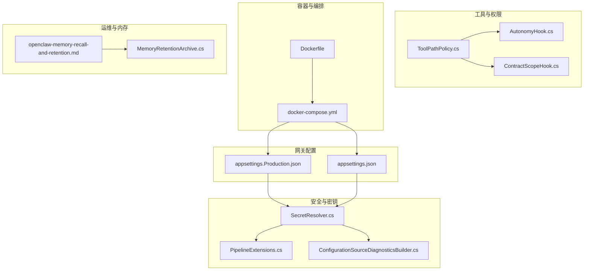
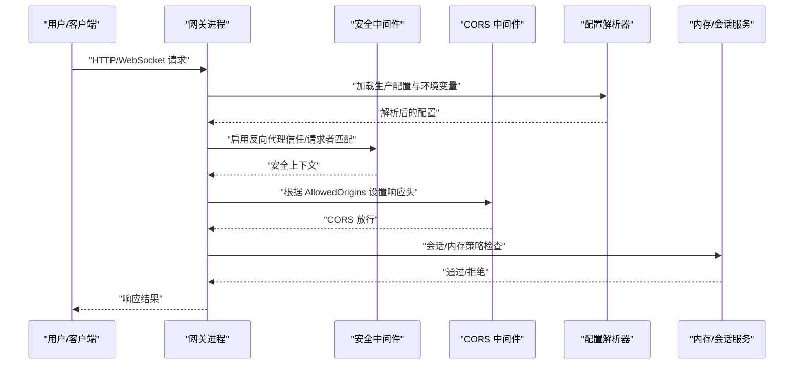
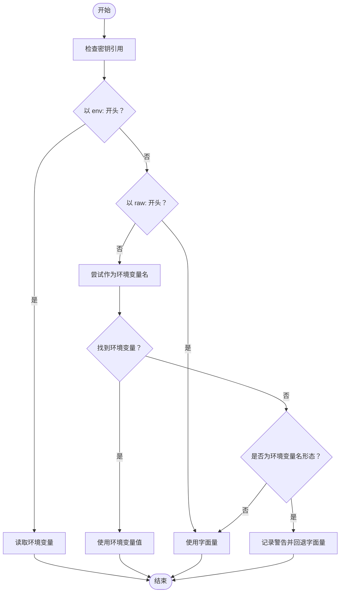
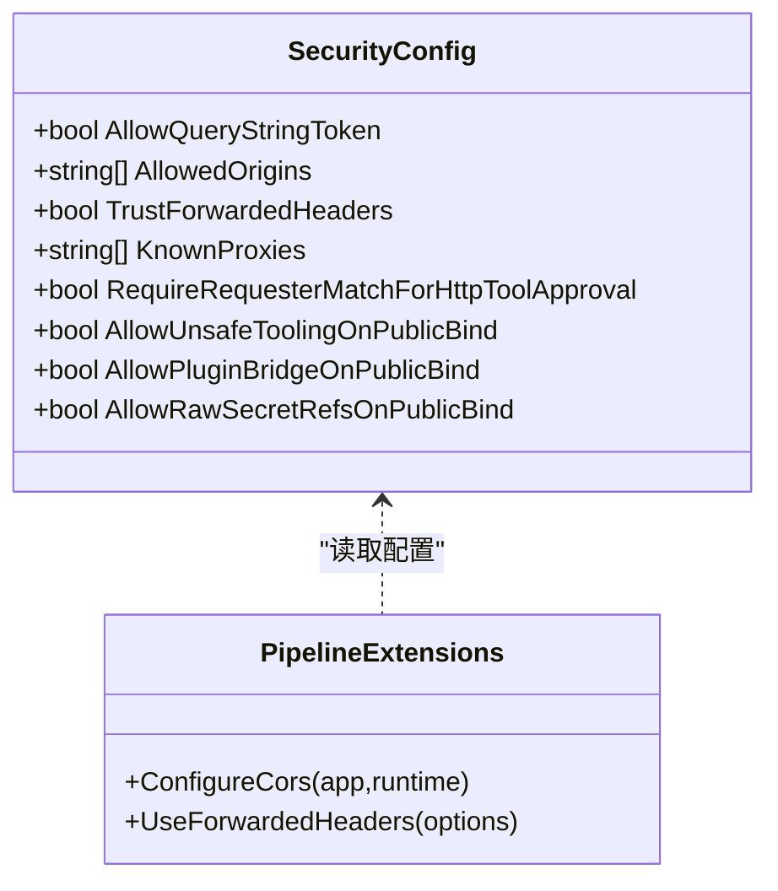
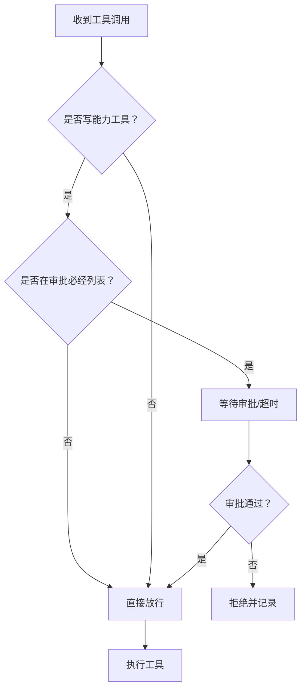
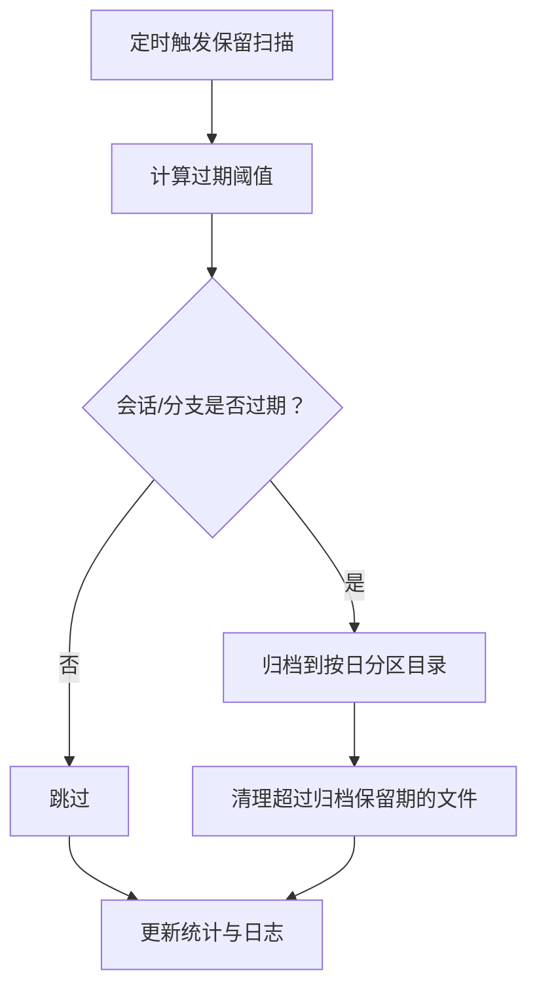
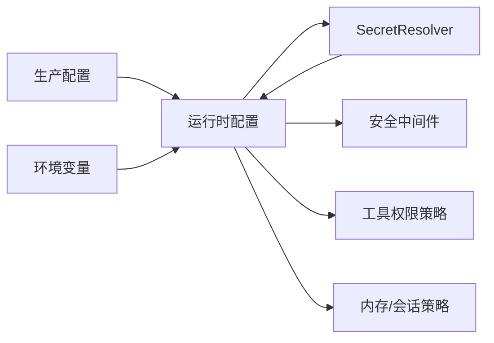

# 生产环境配置

<cite>
**本文引用的文件**
- [appsettings.Production.json](file://src/OpenClaw.Gateway/appsettings.Production.json)
- [appsettings.json](file://src/OpenClaw.Gateway/appsettings.json)
- [Dockerfile](file://Dockerfile)
- [docker-compose.yml](file://docker-compose.yml)
- [SecretResolver.cs](file://src/OpenClaw.Core/Security/SecretResolver.cs)
- [PipelineExtensions.cs](file://src/OpenClaw.Gateway/Pipeline/PipelineExtensions.cs)
- [GatewayConfig.cs](file://src/OpenClaw.Core/Models/GatewayConfig.cs)
- [ConfigurationSourceDiagnosticsBuilder.cs](file://src/OpenClaw.Gateway/Bootstrap/ConfigurationSourceDiagnosticsBuilder.cs)
- [TOOLS_GUIDE.md](file://docs/TOOLS_GUIDE.md)
- [openclaw-memory-recall-and-retention.md](file://docs/openclaw-memory-recall-and-retention.md)
- [MemoryRetentionArchive.cs](file://src/OpenClaw.Core/Memory/MemoryRetentionArchive.cs)
- [ToolPathPolicy.cs](file://src/OpenClaw.Agent/Tools/ToolPathPolicy.cs)
- [AutonomyHook.cs](file://src/OpenClaw.Agent/AutonomyHook.cs)
- [ContractScopeHook.cs](file://src/OpenClaw.Agent/ContractScopeHook.cs)
- [AdminEndpoints.Support.cs](file://src/OpenClaw.Gateway/Endpoints/AdminEndpoints.Support.cs)
- [appsettings.json（AppHost 开发）](file://Kingcrab.AppHost/appsettings.Development.json)
- [appsettings.json（AppHost 生产）](file://Kingcrab.AppHost/appsettings.json)
</cite>

## 目录
1. [简介](#简介)
2. [项目结构](#项目结构)
3. [核心组件](#核心组件)
4. [架构总览](#架构总览)
5. [详细组件分析](#详细组件分析)
6. [依赖关系分析](#依赖关系分析)
7. [性能考虑](#性能考虑)
8. [故障排查指南](#故障排查指南)
9. [结论](#结论)
10. [附录](#附录)

## 简介
本文件面向生产环境，系统性梳理 OpenClaw 网关在生产中的配置要点与最佳实践，覆盖配置文件参数、安全加固、性能优化、日志与运维、环境变量与容器编排、以及配置验证方法。目标是帮助运维与开发团队在生产环境中实现“可审计、可扩展、可恢复”的稳定运行。

## 项目结构
生产配置主要涉及以下位置与文件：
- 网关配置：src/OpenClaw.Gateway/appsettings.Production.json（生产专用）、appsettings.json（通用默认）
- 容器与编排：Dockerfile、docker-compose.yml
- 安全与密钥解析：SecretResolver.cs、PipelineExtensions.cs、ConfigurationSourceDiagnosticsBuilder.cs
- 工具权限与路径策略：ToolPathPolicy.cs、AutonomyHook.cs、ContractScopeHook.cs
- 运维与内存策略：openclaw-memory-recall-and-retention.md、MemoryRetentionArchive.cs
- 环境变量与日志：docker-compose.yml、AppHost 日志配置

图表来源
- [appsettings.Production.json:1-65](file://src/OpenClaw.Gateway/appsettings.Production.json#L1-L65)
- [appsettings.json:1-908](file://src/OpenClaw.Gateway/appsettings.json#L1-L908)
- [Dockerfile:1-59](file://Dockerfile#L1-L59)
- [docker-compose.yml:1-68](file://docker-compose.yml#L1-L68)
- [SecretResolver.cs:1-66](file://src/OpenClaw.Core/Security/SecretResolver.cs#L1-L66)
- [PipelineExtensions.cs:91-127](file://src/OpenClaw.Gateway/Pipeline/PipelineExtensions.cs#L91-L127)
- [ConfigurationSourceDiagnosticsBuilder.cs:52-87](file://src/OpenClaw.Gateway/Bootstrap/ConfigurationSourceDiagnosticsBuilder.cs#L52-L87)
- [ToolPathPolicy.cs:1-44](file://src/OpenClaw.Agent/Tools/ToolPathPolicy.cs#L1-L44)
- [AutonomyHook.cs:72-114](file://src/OpenClaw.Agent/AutonomyHook.cs#L72-L114)
- [ContractScopeHook.cs:121-156](file://src/OpenClaw.Agent/ContractScopeHook.cs#L121-L156)
- [openclaw-memory-recall-and-retention.md:159-182](file://docs/openclaw-memory-recall-and-retention.md#L159-L182)
- [MemoryRetentionArchive.cs:1-39](file://src/OpenClaw.Core/Memory/MemoryRetentionArchive.cs#L1-L39)

章节来源
- [appsettings.Production.json:1-65](file://src/OpenClaw.Gateway/appsettings.Production.json#L1-L65)
- [appsettings.json:1-908](file://src/OpenClaw.Gateway/appsettings.json#L1-L908)
- [Dockerfile:1-59](file://Dockerfile#L1-L59)
- [docker-compose.yml:1-68](file://docker-compose.yml#L1-L68)

## 核心组件
- 绑定与端口：通过 OpenClaw.BindAddress 与 OpenClaw.Port 控制监听地址与端口；容器默认暴露 18789。
- 安全策略：CORS 允许列表、反向代理信任、公共绑定下的工具与插件限制、OIDC 认证等。
- 工具权限：只读模式、Shell 与路径白名单、审批与超时控制。
- 内存与会话：历史轮次、缓存会话数量、压缩阈值、会话超时与并发限制。
- 日志级别：默认 Information，可按模块细化。
- 密钥与环境变量：统一通过 SecretResolver 解析，支持 env:、raw: 与裸变量回退。

章节来源
- [appsettings.Production.json:3-54](file://src/OpenClaw.Gateway/appsettings.Production.json#L3-L54)
- [appsettings.json:3-102](file://src/OpenClaw.Gateway/appsettings.json#L3-L102)
- [SecretResolver.cs:5-66](file://src/OpenClaw.Core/Security/SecretResolver.cs#L5-L66)
- [PipelineExtensions.cs:108-127](file://src/OpenClaw.Gateway/Pipeline/PipelineExtensions.cs#L108-L127)
- [Dockerfile:43-51](file://Dockerfile#L43-L51)

## 架构总览
生产配置的关键流程包括：
- 启动阶段：读取 appsettings.Production.json 与环境变量，解析密钥与路径，初始化安全中间件与 CORS。
- 运行阶段：根据工具权限策略拦截危险操作，按内存与会话策略进行资源管理。
- 维护阶段：基于保留策略清理过期会话与归档，健康检查与日志输出。

图表来源
- [appsettings.Production.json:22-38](file://src/OpenClaw.Gateway/appsettings.Production.json#L22-L38)
- [PipelineExtensions.cs:91-127](file://src/OpenClaw.Gateway/Pipeline/PipelineExtensions.cs#L91-L127)
- [appsettings.json:82-102](file://src/OpenClaw.Gateway/appsettings.json#L82-L102)

## 详细组件分析

### 绑定地址与端口
- 绑定地址：OpenClaw.BindAddress（生产默认 0.0.0.0，便于容器网络访问）
- 端口：OpenClaw.Port（默认 18789）
- 容器暴露：Dockerfile EXPOSE 18789；docker-compose 映射主机端口 18789
- 健康检查：HEALTHCHECK 调用程序内置 --health-check 参数

章节来源
- [appsettings.Production.json:3-4](file://src/OpenClaw.Gateway/appsettings.Production.json#L3-L4)
- [Dockerfile:43-51](file://Dockerfile#L43-L51)
- [docker-compose.yml:11-12](file://docker-compose.yml#L11-L12)

### 环境变量与密钥管理
- 环境变量键名：使用双下划线分隔（如 OpenClaw__BindAddress），由 .NET 配置系统映射到 OpenClaw:BindAddress
- 密钥解析：SecretResolver 支持三种引用方式
  - env:VAR_NAME：从环境变量读取
  - raw:literal：字面量（不推荐生产）
  - bare string：优先作为环境变量名，不存在则回退为字面量
- API Key 来源诊断：支持显示配置来源、是否解析成功、兼容性覆盖（MODEL_PROVIDER_KEY）

图表来源
- [SecretResolver.cs:31-54](file://src/OpenClaw.Core/Security/SecretResolver.cs#L31-L54)
- [ConfigurationSourceDiagnosticsBuilder.cs:52-87](file://src/OpenClaw.Gateway/Bootstrap/ConfigurationSourceDiagnosticsBuilder.cs#L52-L87)

章节来源
- [SecretResolver.cs:5-66](file://src/OpenClaw.Core/Security/SecretResolver.cs#L5-L66)
- [ConfigurationSourceDiagnosticsBuilder.cs:52-87](file://src/OpenClaw.Gateway/Bootstrap/ConfigurationSourceDiagnosticsBuilder.cs#L52-L87)
- [docker-compose.yml:13-31](file://docker-compose.yml#L13-L31)

### 安全加固与认证授权
- CORS：根据 AllowedOrigins 动态设置 Access-Control-* 头，支持预检 OPTIONS
- 反向代理信任：KnownProxies 列表与 TrustForwardedHeaders 控制 X-Forwarded-* 解析
- 公共绑定限制：AllowUnsafeToolingOnPublicBind、AllowPluginBridgeOnPublicBind、AllowRawSecretRefsOnPublicBind 等，防止在非回环地址上启用高危功能
- OIDC：AlwaysRequireAuth、OidcAuthority、OidcAudience 等，强制浏览器会话与令牌校验
- 请求者匹配：RequireRequesterMatchForHttpToolApproval 提升 HTTP 工具审批安全性

图表来源
- [GatewayConfig.cs:331-352](file://src/OpenClaw.Core/Models/GatewayConfig.cs#L331-L352)
- [PipelineExtensions.cs:108-127](file://src/OpenClaw.Gateway/Pipeline/PipelineExtensions.cs#L108-L127)
- [appsettings.json:82-102](file://src/OpenClaw.Gateway/appsettings.json#L82-L102)

章节来源
- [PipelineExtensions.cs:91-127](file://src/OpenClaw.Gateway/Pipeline/PipelineExtensions.cs#L91-L127)
- [GatewayConfig.cs:331-352](file://src/OpenClaw.Core/Models/GatewayConfig.cs#L331-L352)
- [appsettings.json:82-102](file://src/OpenClaw.Gateway/appsettings.json#L82-L102)

### 工具权限控制
- 自主模式：readonly（仅读）、supervised（受监督）、full（完全）
- Shell 与路径：AllowedReadRoots/AllowedWriteRoots、AllowedShellCommandGlobs、ForbiddenPathGlobs
- 审批与超时：RequireToolApproval、ApprovalRequiredTools、ToolApprovalTimeoutSeconds、ToolTimeoutSeconds
- 并行执行：ParallelToolExecution
- 浏览器工具：EnableBrowserTool、AllowBrowserEvaluate、BrowserHeadless、BrowserTimeoutSeconds

图表来源
- [AutonomyHook.cs:72-114](file://src/OpenClaw.Agent/AutonomyHook.cs#L72-L114)
- [ToolPathPolicy.cs:9-44](file://src/OpenClaw.Agent/Tools/ToolPathPolicy.cs#L9-L44)
- [ContractScopeHook.cs:121-156](file://src/OpenClaw.Agent/ContractScopeHook.cs#L121-L156)
- [appsettings.json:110-144](file://src/OpenClaw.Gateway/appsettings.json#L110-L144)

章节来源
- [TOOLS_GUIDE.md:195-286](file://docs/TOOLS_GUIDE.md#L195-L286)
- [appsettings.json:110-144](file://src/OpenClaw.Gateway/appsettings.json#L110-L144)
- [AdminEndpoints.Support.cs:1637-1652](file://src/OpenClaw.Gateway/Endpoints/AdminEndpoints.Support.cs#L1637-L1652)

### 内存与会话策略
- 历史轮次：MaxHistoryTurns
- 缓存会话：MaxCachedSessions
- 压缩阈值：CompactionThreshold、EnableCompaction
- 会话超时与并发：SessionTimeoutMinutes、MaxConcurrentSessions
- 保留策略：RetentionEnabled、SessionTtlDays、BranchTtlDays、ArchiveRetentionDays、最大扫描项数

图表来源
- [openclaw-memory-recall-and-retention.md:159-182](file://docs/openclaw-memory-recall-and-retention.md#L159-L182)
- [MemoryRetentionArchive.cs:9-39](file://src/OpenClaw.Core/Memory/MemoryRetentionArchive.cs#L9-L39)
- [appsettings.json:49-81](file://src/OpenClaw.Gateway/appsettings.json#L49-L81)

章节来源
- [openclaw-memory-recall-and-retention.md:159-182](file://docs/openclaw-memory-recall-and-retention.md#L159-L182)
- [MemoryRetentionArchive.cs:1-39](file://src/OpenClaw.Core/Memory/MemoryRetentionArchive.cs#L1-L39)
- [appsettings.json:49-81](file://src/OpenClaw.Gateway/appsettings.json#L49-L81)

### 日志级别与可观测性
- 默认日志级别：Default 为 Information
- 模块化控制：可针对 Microsoft.AspNetCore、AgentRuntime、SessionManager 等设置更细粒度级别
- AppHost 日志：Aspire.Hosting.Dcp 等组件的日志级别建议在 AppHost 配置中统一管理

章节来源
- [appsettings.Production.json:56-63](file://src/OpenClaw.Gateway/appsettings.Production.json#L56-L63)
- [appsettings.json（AppHost 开发）:1-9](file://Kingcrab.AppHost/appsettings.Development.json#L1-L9)
- [appsettings.json（AppHost 生产）:1-10](file://Kingcrab.AppHost/appsettings.json#L1-L10)

### 容器与编排
- Dockerfile
  - 默认环境变量：BindAddress、Port、Memory.StoragePath、Tooling.*、Plugins.Enabled
  - 健康检查：--health-check
- docker-compose.yml
  - 端口映射：18789:18789
  - 必填环境变量：MODEL_PROVIDER_KEY、OPENCLAW_AUTH_TOKEN
  - 可选覆盖：MODEL_PROVIDER_MODEL、MODEL_PROVIDER_ENDPOINT
  - 反向代理示例：注释开启 TrustForwardedHeaders 与 KnownProxies

章节来源
- [Dockerfile:43-59](file://Dockerfile#L43-L59)
- [docker-compose.yml:13-31](file://docker-compose.yml#L13-L31)

## 依赖关系分析
- 配置解析链路：appsettings.Production.json → 环境变量 → SecretResolver → 运行时配置对象
- 安全中间件：PipelineExtensions 读取 Security.* 配置，启用 CORS 与转发头信任
- 工具权限链路：ToolPathPolicy/ContractScopeHook/AutonomyHook 共同决定工具执行许可
- 运维链路：Retention 策略与归档目录结构确保数据生命周期管理

图表来源
- [appsettings.Production.json:1-65](file://src/OpenClaw.Gateway/appsettings.Production.json#L1-L65)
- [SecretResolver.cs:31-54](file://src/OpenClaw.Core/Security/SecretResolver.cs#L31-L54)
- [PipelineExtensions.cs:91-127](file://src/OpenClaw.Gateway/Pipeline/PipelineExtensions.cs#L91-L127)
- [ToolPathPolicy.cs:1-44](file://src/OpenClaw.Agent/Tools/ToolPathPolicy.cs#L1-L44)
- [openclaw-memory-recall-and-retention.md:159-182](file://docs/openclaw-memory-recall-and-retention.md#L159-L182)

章节来源
- [appsettings.Production.json:1-65](file://src/OpenClaw.Gateway/appsettings.Production.json#L1-L65)
- [SecretResolver.cs:5-66](file://src/OpenClaw.Core/Security/SecretResolver.cs#L5-L66)
- [PipelineExtensions.cs:91-127](file://src/OpenClaw.Gateway/Pipeline/PipelineExtensions.cs#L91-L127)
- [ToolPathPolicy.cs:1-44](file://src/OpenClaw.Agent/Tools/ToolPathPolicy.cs#L1-L44)
- [openclaw-memory-recall-and-retention.md:159-182](file://docs/openclaw-memory-recall-and-retention.md#L159-L182)

## 性能考虑
- 连接与消息限制：WebSocket.MaxConnections、MaxConnectionsPerIp、MessagesPerMinutePerConnection、MaxMessageBytes
- 超时控制：Llm.TimeoutSeconds、ToolTimeoutSeconds、WebSocket.ReceiveTimeoutSeconds
- 并行执行：ParallelToolExecution 提升吞吐，需结合审批与资源限制
- 会话并发：MaxConcurrentSessions 与 SessionTimeoutMinutes 平衡资源占用与响应性
- 缓存与压缩：MaxCachedSessions、CompactionThreshold、EnableCompaction 降低内存压力

章节来源
- [appsettings.Production.json:32-53](file://src/OpenClaw.Gateway/appsettings.Production.json#L32-L53)
- [appsettings.json:103-144](file://src/OpenClaw.Gateway/appsettings.json#L103-L144)

## 故障排查指南
- API Key 未生效
  - 使用 ConfigurationSourceDiagnosticsBuilder 的诊断项查看来源与解析状态
  - 确认环境变量 MODEL_PROVIDER_KEY 或 OpenClaw:Llm:ApiKey 引用正确
- CORS 跨域失败
  - 检查 AllowedOrigins 是否包含当前前端域名
  - 若通过反向代理，确认 TrustForwardedHeaders 与 KnownProxies
- 工具执行被拒绝
  - 检查 Tooling.AllowShell、AllowedReadRoots/AllowedWriteRoots、ApprovalRequiredTools
  - 审批超时：调整 ToolApprovalTimeoutSeconds
- 公共绑定启动失败
  - 禁用 AllowUnsafeToolingOnPublicBind、AllowPluginBridgeOnPublicBind、AllowRawSecretRefsOnPublicBind
  - 或提升网络与令牌管控强度
- 会话与内存异常
  - 调整 MaxConcurrentSessions、SessionTimeoutMinutes、MaxHistoryTurns
  - 启用/调优 Retention 策略与归档路径

章节来源
- [ConfigurationSourceDiagnosticsBuilder.cs:52-87](file://src/OpenClaw.Gateway/Bootstrap/ConfigurationSourceDiagnosticsBuilder.cs#L52-L87)
- [PipelineExtensions.cs:108-127](file://src/OpenClaw.Gateway/Pipeline/PipelineExtensions.cs#L108-L127)
- [appsettings.json:110-144](file://src/OpenClaw.Gateway/appsettings.json#L110-L144)
- [openclaw-memory-recall-and-retention.md:159-182](file://docs/openclaw-memory-recall-and-retention.md#L159-L182)

## 结论
生产环境配置的核心在于“最小权限、可审计、可恢复”。通过 SecretResolver 实现密钥安全注入，借助 CORS、反向代理信任与公共绑定限制强化边界，配合工具权限与审批机制控制执行风险，并以内存/会话与保留策略保障长期稳定性。容器与编排层面提供标准化部署与健康检查，日志与诊断工具支撑问题定位与持续改进。

## 附录

### 生产配置模板（节选）
- 绑定与端口
  - OpenClaw:BindAddress、OpenClaw:Port
- 安全
  - OpenClaw:Security:AllowedOrigins、OpenClaw:Security:TrustForwardedHeaders、OpenClaw:Security:KnownProxies
  - OpenClaw:Security:AllowUnsafeToolingOnPublicBind、OpenClaw:Security:AllowPluginBridgeOnPublicBind
- 工具权限
  - OpenClaw:Tooling:ReadOnlyMode、OpenClaw:Tooling:AllowShell、OpenClaw:Tooling:AllowedReadRoots、OpenClaw:Tooling:AllowedWriteRoots
  - OpenClaw:Tooling:RequireToolApproval、OpenClaw:Tooling:ApprovalRequiredTools、OpenClaw:Tooling:ToolApprovalTimeoutSeconds
- 内存与会话
  - OpenClaw:Memory:MaxHistoryTurns、OpenClaw:Memory:MaxCachedSessions、OpenClaw:Memory:EnableCompaction、OpenClaw:Memory:CompactionThreshold
  - OpenClaw:MaxConcurrentSessions、OpenClaw:SessionTimeoutMinutes
- 日志
  - Logging:LogLevel:Default、Logging:LogLevel:Microsoft.AspNetCore、Logging:LogLevel:AgentRuntime、Logging:LogLevel:SessionManager

章节来源
- [appsettings.Production.json:3-63](file://src/OpenClaw.Gateway/appsettings.Production.json#L3-L63)
- [appsettings.json:56-102](file://src/OpenClaw.Gateway/appsettings.json#L56-L102)

### 环境变量清单（生产必备）
- MODEL_PROVIDER_KEY：模型提供商 API Key（通过 SecretResolver 解析）
- OPENCLAW_AUTH_TOKEN：非回环绑定时必需的认证令牌
- OpenClaw__BindAddress、OpenClaw__Port：监听地址与端口
- OpenClaw__Tooling__AllowShell、OpenClaw__Tooling__AllowedReadRoots、OpenClaw__Tooling__AllowedWriteRoots：工具权限
- OpenClaw__Plugins__Enabled：插件桥接开关
- 反向代理场景：OpenClaw__Security__TrustForwardedHeaders、OpenClaw__Security__KnownProxies

章节来源
- [docker-compose.yml:13-31](file://docker-compose.yml#L13-L31)
- [Dockerfile:43-51](file://Dockerfile#L43-L51)

### 配置验证方法
- 启动后通过诊断接口查看密钥来源与解析状态
- 对照 AllowedOrigins 与 TrustForwardedHeaders 验证 CORS 与代理行为
- 使用工具权限测试（如 shell、write_file）验证审批与路径策略
- 观察日志级别与关键模块日志，定位异常

章节来源
- [ConfigurationSourceDiagnosticsBuilder.cs:52-87](file://src/OpenClaw.Gateway/Bootstrap/ConfigurationSourceDiagnosticsBuilder.cs#L52-L87)
- [PipelineExtensions.cs:108-127](file://src/OpenClaw.Gateway/Pipeline/PipelineExtensions.cs#L108-L127)
- [AdminEndpoints.Support.cs:1637-1652](file://src/OpenClaw.Gateway/Endpoints/AdminEndpoints.Support.cs#L1637-L1652)