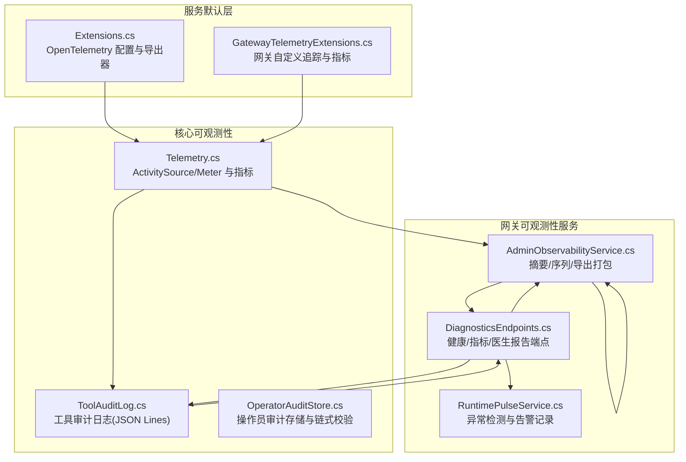
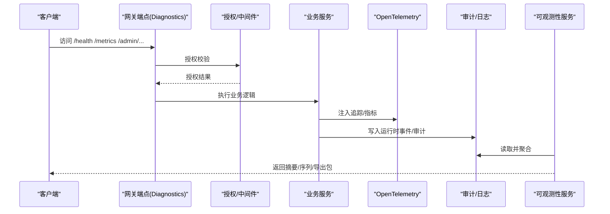
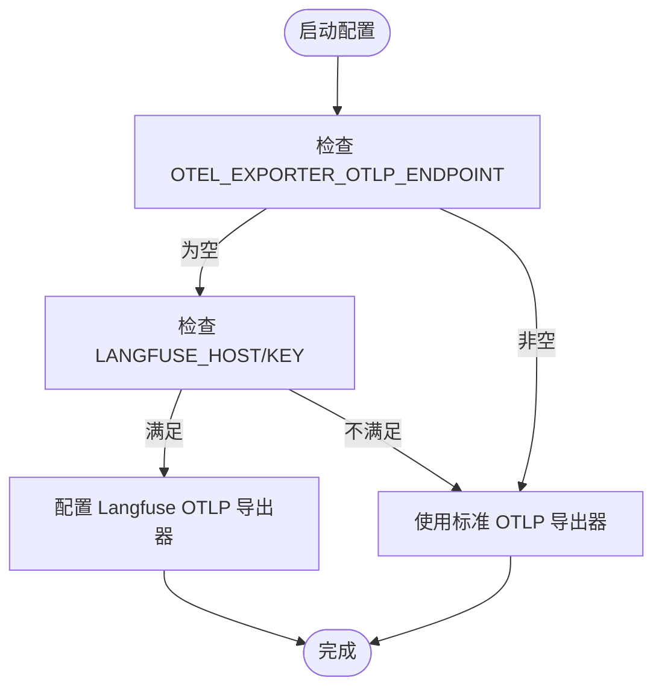
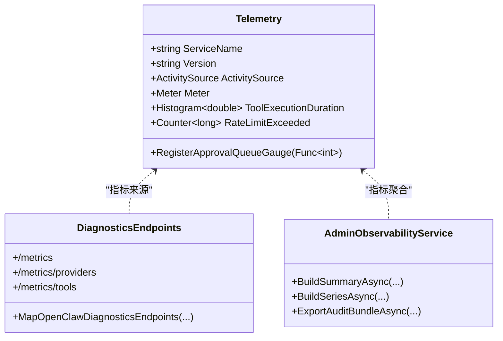
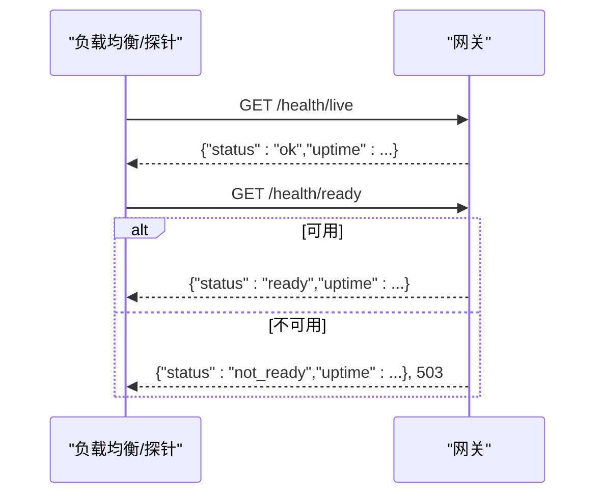
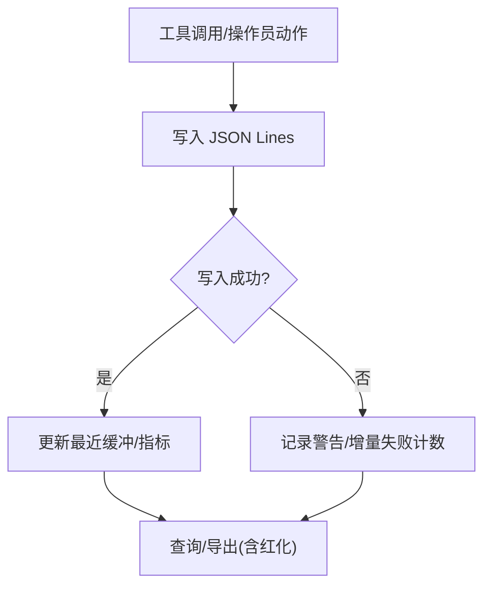
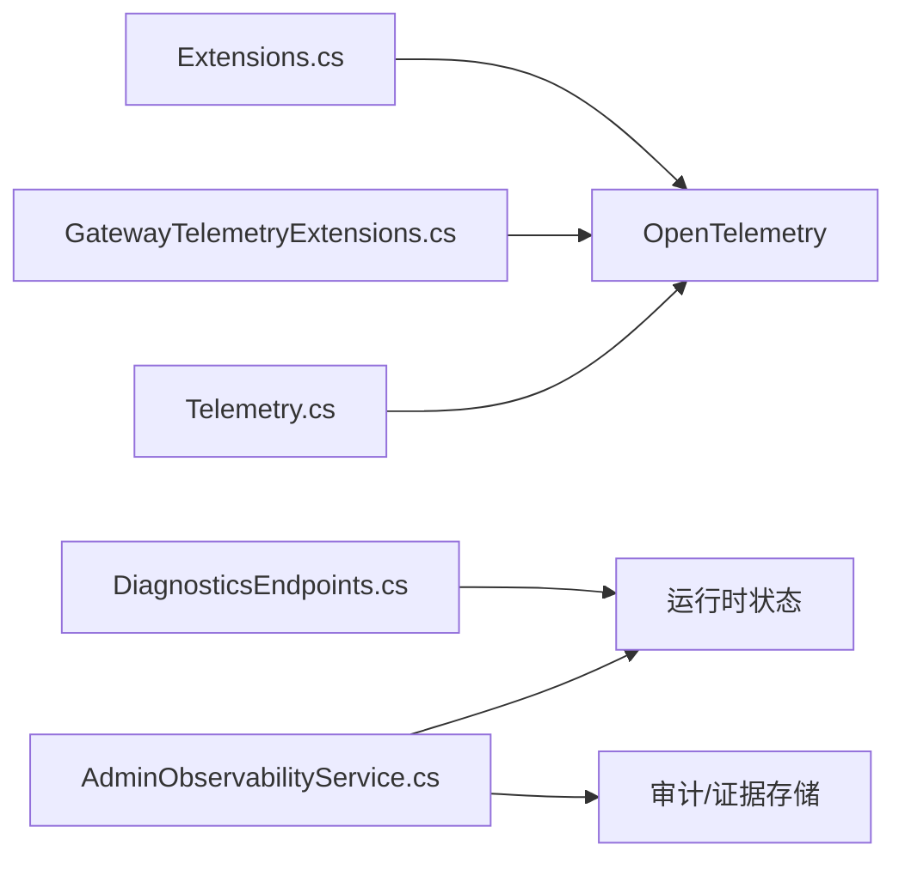

# 监控和日志

<cite>
**本文档引用的文件**
- [Extensions.cs](file://Kingcrab.ServiceDefaults/Extensions.cs)
- [Telemetry.cs](file://src/OpenClaw.Core/Observability/Telemetry.cs)
- [AdminObservabilityService.cs](file://src/OpenClaw.Gateway/AdminObservabilityService.cs)
- [OperatorAuditStore.cs](file://src/OpenClaw.Gateway/OperatorAuditStore.cs)
- [ToolAuditLog.cs](file://src/OpenClaw.Core/Observability/ToolAuditLog.cs)
- [DiagnosticsEndpoints.cs](file://src/OpenClaw.Gateway/Endpoints/DiagnosticsEndpoints.cs)
- [appsettings.json](file://Kingcrab.AppHost/appsettings.json)
- [appsettings.Development.json](file://Kingcrab.AppHost/appsettings.Development.json)
- [GatewayTelemetryExtensions.cs](file://src/OpenClaw.Gateway/Extensions/GatewayTelemetryExtensions.cs)
- [RuntimePulseService.cs](file://src/OpenClaw.Gateway/RuntimePulseService.cs)
- [OperatorGovernanceModels.cs](file://src/OpenClaw.Core/Models/OperatorGovernanceModels.cs)
- [OpenClawHttpClient.cs](file://src/OpenClaw.Client/OpenClawHttpClient.cs)
- [GatewayAdminEndpointTests.cs](file://src/OpenClaw.Tests/GatewayAdminEndpointTests.cs)
</cite>

## 目录
1. [简介](#简介)
2. [项目结构](#项目结构)
3. [核心组件](#核心组件)
4. [架构总览](#架构总览)
5. [详细组件分析](#详细组件分析)
6. [依赖关系分析](#依赖关系分析)
7. [性能考量](#性能考量)
8. [故障排查指南](#故障排查指南)
9. [结论](#结论)
10. [附录](#附录)

## 简介
本文件面向监控与日志系统的运维与开发人员，系统性阐述本项目的可观测性能力：包括 OpenTelemetry 集成（追踪与指标）、指标采集与暴露、健康检查端点、日志配置与结构化日志、审计与安全事件日志、日志聚合与导出、仪表板与查询实践、异常检测与性能基线等。文档以代码为依据，提供可操作的配置指引与最佳实践。

## 项目结构
监控与日志相关的关键模块分布如下：
- 服务默认配置与 OpenTelemetry：在通用服务默认库中集中配置日志、追踪与指标，并支持 OTLP/Langfuse 导出器自动选择。
- 核心可观测性模型与度量：定义应用级 ActivitySource/Meter 与关键指标（工具执行时延、限流超限、审批队列深度等）。
- 网关可观测性服务：聚合审批历史、运行时事件、操作员审计、死信队列、会话元数据等，生成摘要与时间序列指标，并支持审计导出打包。
- 审计与工具日志：操作员审计存储与链式校验、工具调用审计日志（JSON Lines），均采用结构化与敏感信息脱敏策略。
- 运维诊断端点：健康检查、指标暴露、内存保留状态、医生报告等。
- 日志配置：应用主机的日志级别配置示例。
- 运行脉冲（Runtime Pulse）：基于阈值的异常检测与告警记录。

**图表来源**
- [Extensions.cs:1-147](file://Kingcrab.ServiceDefaults/Extensions.cs#L1-L147)
- [GatewayTelemetryExtensions.cs:37-52](file://src/OpenClaw.Gateway/Extensions/GatewayTelemetryExtensions.cs#L37-L52)
- [Telemetry.cs:1-54](file://src/OpenClaw.Core/Observability/Telemetry.cs#L1-L54)
- [ToolAuditLog.cs:1-125](file://src/OpenClaw.Core/Observability/ToolAuditLog.cs#L1-L125)
- [OperatorAuditStore.cs:1-195](file://src/OpenClaw.Gateway/OperatorAuditStore.cs#L1-L195)
- [AdminObservabilityService.cs:1-1124](file://src/OpenClaw.Gateway/AdminObservabilityService.cs#L1-L1124)
- [DiagnosticsEndpoints.cs:1-194](file://src/OpenClaw.Gateway/Endpoints/DiagnosticsEndpoints.cs#L1-L194)
- [RuntimePulseService.cs:241-279](file://src/OpenClaw.Gateway/RuntimePulseService.cs#L241-L279)

**章节来源**
- [Extensions.cs:1-147](file://Kingcrab.ServiceDefaults/Extensions.cs#L1-L147)
- [Telemetry.cs:1-54](file://src/OpenClaw.Core/Observability/Telemetry.cs#L1-L54)
- [AdminObservabilityService.cs:1-1124](file://src/OpenClaw.Gateway/AdminObservabilityService.cs#L1-L1124)
- [OperatorAuditStore.cs:1-195](file://src/OpenClaw.Gateway/OperatorAuditStore.cs#L1-L195)
- [ToolAuditLog.cs:1-125](file://src/OpenClaw.Core/Observability/ToolAuditLog.cs#L1-L125)
- [DiagnosticsEndpoints.cs:1-194](file://src/OpenClaw.Gateway/Endpoints/DiagnosticsEndpoints.cs#L1-L194)
- [appsettings.json:1-10](file://Kingcrab.AppHost/appsettings.json#L1-L10)
- [appsettings.Development.json:1-9](file://Kingcrab.AppHost/appsettings.Development.json#L1-L9)
- [GatewayTelemetryExtensions.cs:37-52](file://src/OpenClaw.Gateway/Extensions/GatewayTelemetryExtensions.cs#L37-L52)
- [RuntimePulseService.cs:241-279](file://src/OpenClaw.Gateway/RuntimePulseService.cs#L241-L279)

## 核心组件
- OpenTelemetry 集成与导出
  - 通过服务默认扩展统一配置日志、指标与追踪，自动排除健康检查路径，支持 OTLP 或 Langfuse 导出器自动选择。
  - 网关侧额外注册自定义 Meter 与 ActivitySource，用于应用级指标与追踪。
- 指标与度量
  - 工具执行时延直方图、限流超限计数器、审批队列深度可观测性等。
  - 运行时指标端点暴露当前活跃会话数、熔断器状态、提供商用量快照、工具使用快照等。
- 健康检查端点
  - 提供受保护的健康与就绪探针，以及无需认证的存活探针，便于负载均衡与编排系统。
- 审计与日志
  - 操作员审计存储采用 JSON Lines 文件，带链式哈希校验；工具调用审计记录关键字段并避免泄露原始载荷。
  - 日志配置示例展示默认日志级别与 ASP.NET Core 的警告级别控制。
- 可观测性服务
  - 聚合审批历史、运行时事件、操作员审计、死信队列、会话元数据，生成摘要卡片、命名指标与时间序列。
  - 支持审计导出打包与轨迹导出（JSON Lines），含证据与治理条目。
- 异常检测与告警
  - 运行脉冲服务按阈值触发告警，记录事件并支持外部交付策略。

**章节来源**
- [Extensions.cs:49-126](file://Kingcrab.ServiceDefaults/Extensions.cs#L49-L126)
- [GatewayTelemetryExtensions.cs:37-52](file://src/OpenClaw.Gateway/Extensions/GatewayTelemetryExtensions.cs#L37-L52)
- [Telemetry.cs:25-52](file://src/OpenClaw.Core/Observability/Telemetry.cs#L25-L52)
- [DiagnosticsEndpoints.cs:32-93](file://src/OpenClaw.Gateway/Endpoints/DiagnosticsEndpoints.cs#L32-L93)
- [OperatorAuditStore.cs:33-93](file://src/OpenClaw.Gateway/OperatorAuditStore.cs#L33-L93)
- [ToolAuditLog.cs:72-108](file://src/OpenClaw.Core/Observability/ToolAuditLog.cs#L72-L108)
- [AdminObservabilityService.cs:117-227](file://src/OpenClaw.Gateway/AdminObservabilityService.cs#L117-L227)
- [RuntimePulseService.cs:241-279](file://src/OpenClaw.Gateway/RuntimePulseService.cs#L241-L279)

## 架构总览
下图展示了从请求到可观测性的完整链路：客户端访问网关端点，经授权与中间件后进入业务处理；同时，OpenTelemetry 自动注入追踪与指标；运行时事件与审计写入持久化；管理员可通过可观测性端点获取摘要与序列数据，或导出审计包进行离线分析。

**图表来源**
- [DiagnosticsEndpoints.cs:32-93](file://src/OpenClaw.Gateway/Endpoints/DiagnosticsEndpoints.cs#L32-L93)
- [Extensions.cs:49-82](file://Kingcrab.ServiceDefaults/Extensions.cs#L49-L82)
- [AdminObservabilityService.cs:117-227](file://src/OpenClaw.Gateway/AdminObservabilityService.cs#L117-L227)

## 详细组件分析

### OpenTelemetry 集成与导出
- 日志与追踪配置
  - 启用格式化消息与作用域，自动排除健康检查路径，确保追踪不被探针污染。
  - 指标包含 ASP.NET Core、HTTP 客户端与运行时指标。
- 导出器选择
  - 若未配置 OTLP 端点且提供 Langfuse 主机与密钥，则自动配置基于 Basic 认证的 OTLP 导出器。
  - 否则使用标准 OTLP 导出器。
- 网关自定义追踪与指标
  - 注册名为“OpenClaw.Gateway”的 Meter 与 ActivitySource，导出至 OTLP。

**图表来源**
- [Extensions.cs:84-115](file://Kingcrab.ServiceDefaults/Extensions.cs#L84-L115)

**章节来源**
- [Extensions.cs:49-126](file://Kingcrab.ServiceDefaults/Extensions.cs#L49-L126)
- [GatewayTelemetryExtensions.cs:37-52](file://src/OpenClaw.Gateway/Extensions/GatewayTelemetryExtensions.cs#L37-L52)

### 指标与度量
- 应用级指标
  - 工具执行时延直方图、限流超限计数器、审批队列深度可观测性。
- 运行时指标端点
  - 暴露活跃会话数、熔断器状态、提供商用量快照、工具使用快照。
- 摘要与序列
  - 汇总审批决策、自动化失败、提供商错误/重试、运行时告警、死信数量、通道漂移、操作员动作等。
  - 时间序列按分钟桶聚合，支持范围与桶大小参数。

**图表来源**
- [Telemetry.cs:9-52](file://src/OpenClaw.Core/Observability/Telemetry.cs#L9-L52)
- [DiagnosticsEndpoints.cs:68-93](file://src/OpenClaw.Gateway/Endpoints/DiagnosticsEndpoints.cs#L68-L93)
- [AdminObservabilityService.cs:117-227](file://src/OpenClaw.Gateway/AdminObservabilityService.cs#L117-L227)

**章节来源**
- [Telemetry.cs:25-52](file://src/OpenClaw.Core/Observability/Telemetry.cs#L25-L52)
- [DiagnosticsEndpoints.cs:68-93](file://src/OpenClaw.Gateway/Endpoints/DiagnosticsEndpoints.cs#L68-L93)
- [AdminObservabilityService.cs:117-227](file://src/OpenClaw.Gateway/AdminObservabilityService.cs#L117-L227)

### 健康检查端点
- 受保护健康端点：需要操作员授权。
- 存活端点：无需认证，返回进程存活状态。
- 就绪端点：无需认证，检查会话管理器可用性，内部错误返回 503。

**图表来源**
- [DiagnosticsEndpoints.cs:32-66](file://src/OpenClaw.Gateway/Endpoints/DiagnosticsEndpoints.cs#L32-L66)

**章节来源**
- [DiagnosticsEndpoints.cs:32-66](file://src/OpenClaw.Gateway/Endpoints/DiagnosticsEndpoints.cs#L32-L66)

### 日志配置与结构化日志
- 日志级别
  - 默认级别为 Information，ASP.NET Core 为 Warning，Aspire.Hosting.Dcp 为 Warning。
- 结构化日志
  - OpenTelemetry 日志启用格式化消息与作用域，便于关联追踪 ID 与上下文。
- 敏感信息处理
  - 审计与运行时事件在导出前进行敏感信息红化与脱敏。

**章节来源**
- [appsettings.json:1-10](file://Kingcrab.AppHost/appsettings.json#L1-L10)
- [appsettings.Development.json:1-9](file://Kingcrab.AppHost/appsettings.Development.json#L1-L9)
- [Extensions.cs:51-55](file://Kingcrab.ServiceDefaults/Extensions.cs#L51-L55)
- [AdminObservabilityService.cs:1677-1693](file://src/OpenClaw.Gateway/AdminObservabilityService.cs#L1677-L1693)

### 审计日志与安全事件日志
- 操作员审计
  - JSON Lines 文件，带序列号与链式哈希校验，写入失败会增加指标并记录警告。
  - 查询支持按角色、类型、目标、时间范围过滤。
- 工具调用审计
  - 记录关键元数据（会话、通道、发送者、相关 ID、耗时、是否失败/超时、治理字段等），避免直接记录原始载荷，仅记录字节长度。
- 安全事件
  - 运行时事件包含组件、动作、严重性、摘要与元数据，导出时进行敏感键红化。

**图表来源**
- [OperatorAuditStore.cs:33-93](file://src/OpenClaw.Gateway/OperatorAuditStore.cs#L33-L93)
- [ToolAuditLog.cs:72-108](file://src/OpenClaw.Core/Observability/ToolAuditLog.cs#L72-L108)
- [AdminObservabilityService.cs:1677-1693](file://src/OpenClaw.Gateway/AdminObservabilityService.cs#L1677-L1693)

**章节来源**
- [OperatorAuditStore.cs:33-125](file://src/OpenClaw.Gateway/OperatorAuditStore.cs#L33-L125)
- [ToolAuditLog.cs:39-108](file://src/OpenClaw.Core/Observability/ToolAuditLog.cs#L39-L108)
- [AdminObservabilityService.cs:1677-1693](file://src/OpenClaw.Gateway/AdminObservabilityService.cs#L1677-L1693)

### 日志聚合与导出
- 审计导出包
  - 包含清单与多个 JSON/JSON Lines 文件，支持治理与证据导出开关。
- 轨迹导出
  - 生成 JSON Lines 的会话轨迹，包含消息、工具调用、结果、证据与治理条目，支持匿名化与证据/治理开关。

**章节来源**
- [AdminObservabilityService.cs:229-307](file://src/OpenClaw.Gateway/AdminObservabilityService.cs#L229-L307)
- [AdminObservabilityService.cs:309-380](file://src/OpenClaw.Gateway/AdminObservabilityService.cs#L309-L380)

### 运维监控端点与指标暴露
- 摘要与序列端点
  - /admin/observability/summary 与 /admin/observability/series，支持时间范围与桶大小参数。
- 指标端点
  - /metrics、/metrics/providers、/metrics/tools，返回当前快照。
- 医生报告
  - /doctor 与 /doctor/text，汇总配置与运行时状态，辅助诊断。

**章节来源**
- [DiagnosticsEndpoints.cs:68-191](file://src/OpenClaw.Gateway/Endpoints/DiagnosticsEndpoints.cs#L68-L191)
- [OpenClawHttpClient.cs:153-170](file://src/OpenClaw.Client/OpenClawHttpClient.cs#L153-L170)
- [OpenClawHttpClient.cs:1467-1490](file://src/OpenClaw.Client/OpenClawHttpClient.cs#L1467-L1490)

### 异常检测与性能基线
- 运行脉冲
  - 基于阈值与可见性策略触发告警，记录事件并支持外部交付跳过策略。
  - 输出包含输入/输出令牌消耗统计，便于性能基线评估。

**章节来源**
- [RuntimePulseService.cs:241-279](file://src/OpenClaw.Gateway/RuntimePulseService.cs#L241-L279)

### 仪表板与查询实践
- 摘要卡片与命名指标
  - 审批延迟桶、按路由的提供商错误/重试、按角色/账户的操作员动作、通道漂移等。
- 时间序列
  - 支持分钟级桶聚合，便于构建仪表板折线图。
- 查询建议
  - 使用时间范围参数与桶大小控制粒度；对敏感字段进行红化后再查询。

**章节来源**
- [AdminObservabilityService.cs:135-167](file://src/OpenClaw.Gateway/AdminObservabilityService.cs#L135-L167)
- [AdminObservabilityService.cs:170-227](file://src/OpenClaw.Gateway/AdminObservabilityService.cs#L170-L227)
- [OperatorGovernanceModels.cs:330-449](file://src/OpenClaw.Core/Models/OperatorGovernanceModels.cs#L330-L449)

## 依赖关系分析
- 组件耦合
  - 服务默认扩展与网关扩展共同驱动 OpenTelemetry 配置；核心 Telemetry 为两者共享。
  - 运行时指标端点依赖会话管理器与运行时状态；可观测性服务依赖审计与证据存储。
- 外部集成
  - OTLP/Langfuse 导出器；健康检查端点需谨慎在生产环境启用。

**图表来源**
- [Extensions.cs:49-82](file://Kingcrab.ServiceDefaults/Extensions.cs#L49-L82)
- [GatewayTelemetryExtensions.cs:37-52](file://src/OpenClaw.Gateway/Extensions/GatewayTelemetryExtensions.cs#L37-L52)
- [Telemetry.cs:9-52](file://src/OpenClaw.Core/Observability/Telemetry.cs#L9-L52)
- [DiagnosticsEndpoints.cs:68-93](file://src/OpenClaw.Gateway/Endpoints/DiagnosticsEndpoints.cs#L68-L93)
- [AdminObservabilityService.cs:117-227](file://src/OpenClaw.Gateway/AdminObservabilityService.cs#L117-L227)

**章节来源**
- [Extensions.cs:49-126](file://Kingcrab.ServiceDefaults/Extensions.cs#L49-L126)
- [GatewayTelemetryExtensions.cs:37-52](file://src/OpenClaw.Gateway/Extensions/GatewayTelemetryExtensions.cs#L37-L52)
- [Telemetry.cs:9-52](file://src/OpenClaw.Core/Observability/Telemetry.cs#L9-L52)
- [DiagnosticsEndpoints.cs:68-93](file://src/OpenClaw.Gateway/Endpoints/DiagnosticsEndpoints.cs#L68-L93)
- [AdminObservabilityService.cs:117-227](file://src/OpenClaw.Gateway/AdminObservabilityService.cs#L117-L227)

## 性能考量
- 指标采样与导出
  - 使用直方图与计数器进行高吞吐场景下的低开销度量；导出器自动选择减少配置负担。
- I/O 与磁盘
  - 审计日志采用 JSON Lines 与最近缓冲，降低频繁写入开销；写入失败时记录指标与警告，便于告警。
- 查询与导出
  - 审计导出与轨迹导出支持分页与范围限制，避免一次性加载过多数据。

[本节为通用指导，无需特定文件引用]

## 故障排查指南
- 健康检查不可达
  - 确认端点已启用（开发环境默认启用），检查授权与中间件链路。
- 指标为空或不更新
  - 检查会话管理器可用性与运行时状态；确认指标端点授权。
- 审计写入失败
  - 查看操作员审计存储的警告日志与失败计数指标；检查磁盘权限与路径。
- 导出包缺失数据
  - 确认导出范围与保留策略；检查治理与证据导出开关。

**章节来源**
- [DiagnosticsEndpoints.cs:32-66](file://src/OpenClaw.Gateway/Endpoints/DiagnosticsEndpoints.cs#L32-L66)
- [OperatorAuditStore.cs:88-93](file://src/OpenClaw.Gateway/OperatorAuditStore.cs#L88-L93)
- [AdminObservabilityService.cs:229-307](file://src/OpenClaw.Gateway/AdminObservabilityService.cs#L229-L307)

## 结论
本项目通过服务默认的 OpenTelemetry 配置与网关自定义指标/追踪，结合结构化日志与审计存储，形成了完整的可观测性闭环。配合健康检查、指标暴露、摘要/序列与导出能力，能够支撑仪表板可视化、异常检测与性能基线设定等运维实践。

[本节为总结，无需特定文件引用]

## 附录
- 端点与测试覆盖
  - 管理端点测试覆盖了 /admin/observability/summary、/admin/observability/series、/admin/audit/export 等关键路径。
- 客户端调用示例
  - 客户端封装了摘要与序列端点的 URI 构造逻辑，便于集成。

**章节来源**
- [GatewayAdminEndpointTests.cs:6851-6881](file://src/OpenClaw.Tests/GatewayAdminEndpointTests.cs#L6851-L6881)
- [OpenClawHttpClient.cs:153-170](file://src/OpenClaw.Client/OpenClawHttpClient.cs#L153-L170)
- [OpenClawHttpClient.cs:1467-1490](file://src/OpenClaw.Client/OpenClawHttpClient.cs#L1467-L1490)