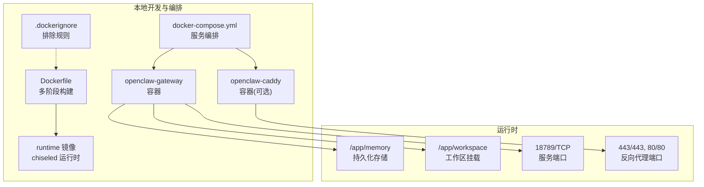
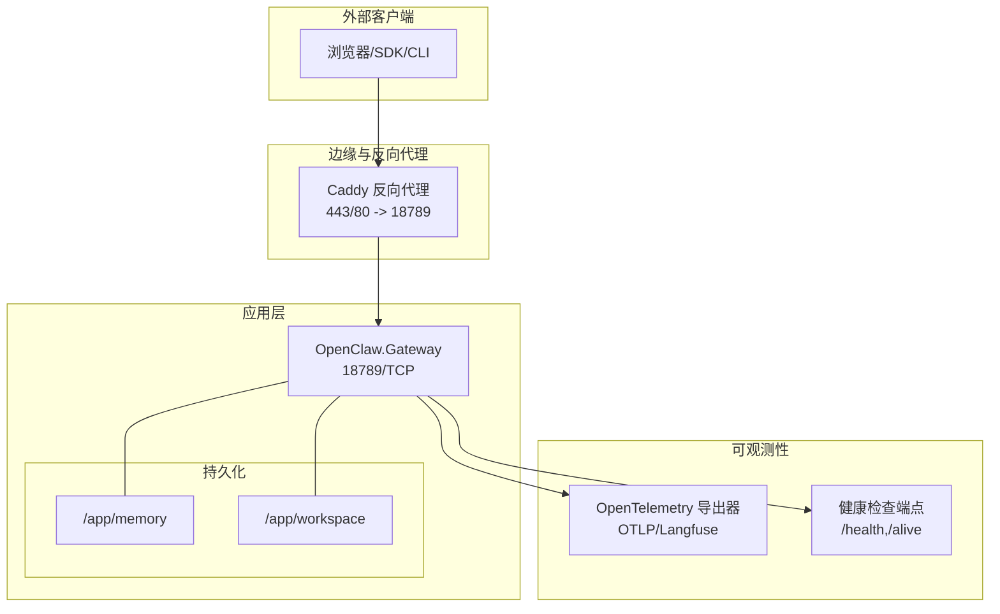
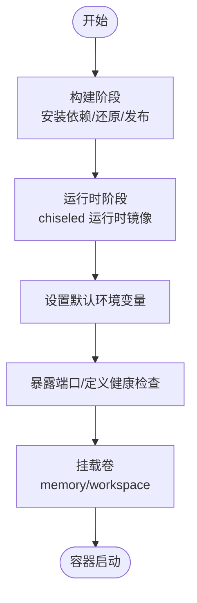
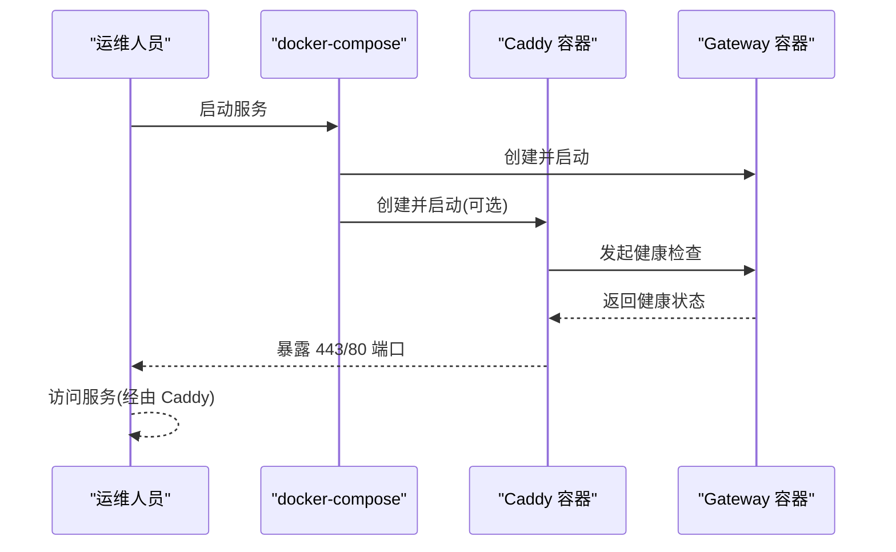
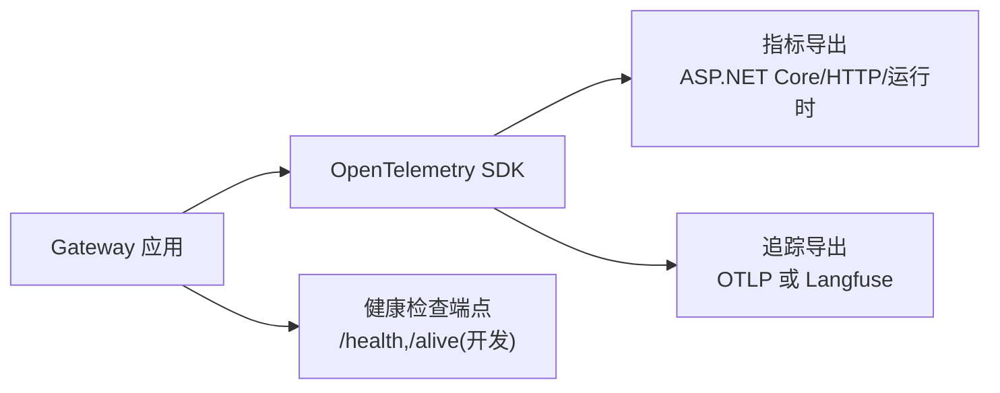
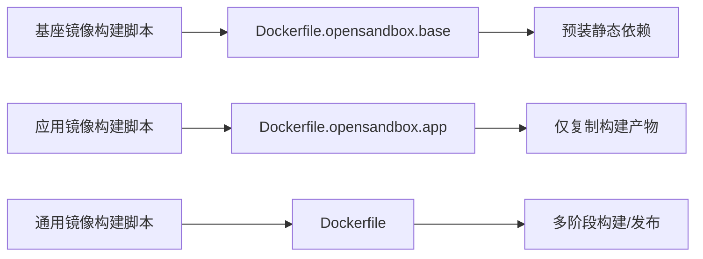
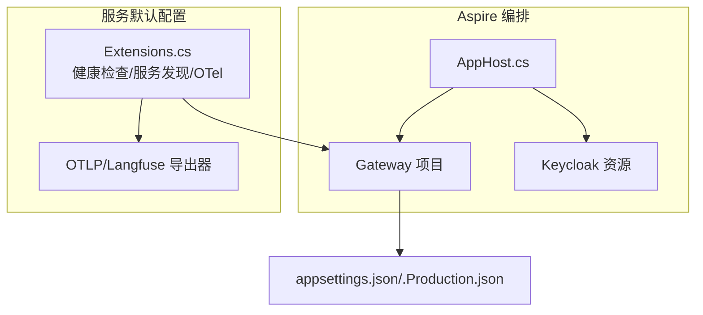

# 部署和运维

<cite>
**本文引用的文件**
- [Dockerfile](file://Dockerfile)
- [docker-compose.yml](file://docker-compose.yml)
- [.dockerignore](file://.dockerignore)
- [src/OpenClaw.Gateway/appsettings.json](file://src/OpenClaw.Gateway/appsettings.json)
- [src/OpenClaw.Gateway/appsettings.Production.json](file://src/OpenClaw.Gateway/appsettings.Production.json)
- [Kingcrab.AppHost/AppHost.cs](file://Kingcrab.AppHost/AppHost.cs)
- [Kingcrab.AppHost/Properties/launchSettings.json](file://Kingcrab.AppHost/Properties/launchSettings.json)
- [Kingcrab.ServiceDefaults/Extensions.cs](file://Kingcrab.ServiceDefaults/Extensions.cs)
- [Kingcrab.ServiceDefaults/Kingcrab.ServiceDefaults.csproj](file://Kingcrab.ServiceDefaults/Kingcrab.ServiceDefaults.csproj)
- [scripts/build-opensandbox-base-image.ps1](file://scripts/build-opensandbox-base-image.ps1)
- [scripts/build-opensandbox-app-image.ps1](file://scripts/build-opensandbox-app-image.ps1)
- [scripts/build-opensandbox-image.ps1](file://scripts/build-opensandbox-image.ps1)
</cite>

## 目录
1. [简介](#简介)
2. [项目结构](#项目结构)
3. [核心组件](#核心组件)
4. [架构总览](#架构总览)
5. [详细组件分析](#详细组件分析)
6. [依赖关系分析](#依赖关系分析)
7. [性能考虑](#性能考虑)
8. [故障排除指南](#故障排除指南)
9. [结论](#结论)
10. [附录](#附录)

## 简介
本文件面向部署与运维团队，系统化阐述项目的容器化部署、生产环境配置、安全加固、监控与日志、性能优化、备份恢复、CI/CD 最佳实践等内容。重点覆盖以下方面：
- 容器镜像构建与运行：单文件 NativeAOT 发布、非 Root 用户、健康检查、默认环境变量与卷挂载策略
- 生产环境配置：绑定地址、端口、认证令牌、工具沙箱、插件开关、内存与工作区路径
- 安全加固：反向代理信任头、跨域白名单、公共绑定限制、查询参数令牌策略
- 监控与日志：OpenTelemetry 指标与追踪导出、健康检查端点映射
- 性能优化：连接数与消息大小限制、会话并发与超时、缓存与压缩策略
- 备份恢复：持久化卷与数据目录、归档与清理策略
- CI/CD：多阶段 Docker 构建、分层基座镜像、多平台打包与推送

## 项目结构
本项目采用多阶段 Docker 构建，发布为单文件 NativeAOT 可执行程序，并在最小运行时镜像上运行。Compose 提供网关与可选反向代理（Caddy）编排，支持健康检查与自动重启。

图示来源
- [Dockerfile:1-59](file://Dockerfile#L1-L59)
- [docker-compose.yml:1-68](file://docker-compose.yml#L1-L68)
- [.dockerignore:1-14](file://.dockerignore#L1-L14)

章节来源
- [Dockerfile:1-59](file://Dockerfile#L1-L59)
- [docker-compose.yml:1-68](file://docker-compose.yml#L1-L68)
- [.dockerignore:1-14](file://.dockerignore#L1-L14)

## 核心组件
- 网关服务（Gateway）
  - 绑定地址与端口、认证令牌、工具沙箱、插件开关、内存与工作区路径、会话并发与超时、WebSocket 连接限制
  - 生产配置覆盖默认值，启用反向代理信任头、限制公共绑定风险
- 反向代理（Caddy）
  - 自动 TLS 与 HTTP/HTTPS 端口暴露，按条件启动并依赖网关健康状态
- 运行时与健康检查
  - 健康检查命令行参数、非 Root 用户、chiseled 运行时镜像、默认环境变量
- 监控与日志
  - OpenTelemetry 指标与追踪、健康检查端点映射、日志级别配置

章节来源
- [src/OpenClaw.Gateway/appsettings.json:1-908](file://src/OpenClaw.Gateway/appsettings.json#L1-L908)
- [src/OpenClaw.Gateway/appsettings.Production.json:1-65](file://src/OpenClaw.Gateway/appsettings.Production.json#L1-L65)
- [Dockerfile:35-59](file://Dockerfile#L35-L59)
- [docker-compose.yml:44-62](file://docker-compose.yml#L44-L62)
- [Kingcrab.ServiceDefaults/Extensions.cs:18-147](file://Kingcrab.ServiceDefaults/Extensions.cs#L18-L147)

## 架构总览
下图展示容器化部署与外部系统的交互：网关作为核心服务，Caddy 作为反向代理与 TLS 终止；Compose 管理服务生命周期与依赖；OpenTelemetry 支持指标与追踪导出。

图示来源
- [docker-compose.yml:44-62](file://docker-compose.yml#L44-L62)
- [Dockerfile:43-59](file://Dockerfile#L43-L59)
- [Kingcrab.ServiceDefaults/Extensions.cs:119-147](file://Kingcrab.ServiceDefaults/Extensions.cs#L119-L147)

## 详细组件分析

### 容器镜像与运行时
- 多阶段构建
  - 构建阶段安装原生 AOT 依赖，还原并发布网关为单文件二进制
  - 运行时阶段使用 chiseled 运行时镜像，非 Root 用户，设置工作目录与权限
- 默认环境变量
  - 绑定地址、端口、内存存储路径、工具沙箱根目录、插件开关等
- 健康检查
  - 使用命令行参数触发健康检查，容器层面定义健康检查策略
- 端口与卷
  - 暴露服务端口；挂载内存与工作区卷以实现持久化与工具访问

图示来源
- [Dockerfile:1-59](file://Dockerfile#L1-L59)

章节来源
- [Dockerfile:1-59](file://Dockerfile#L1-L59)

### Compose 编排与反向代理
- 服务编排
  - openclaw-gateway：端口映射、环境变量覆盖、卷挂载、健康检查
  - openclaw-caddy：按 with-tls profile 启用，监听 443/80，依赖网关健康
- 环境变量与安全
  - 必填模型密钥与认证令牌；可选模型与端点；公共绑定时建议启用转发头信任
- 卷管理
  - openclaw-memory：持久化内存数据
  - workspace：可选挂载工作区目录

图示来源
- [docker-compose.yml:1-68](file://docker-compose.yml#L1-L68)

章节来源
- [docker-compose.yml:1-68](file://docker-compose.yml#L1-L68)

### 生产环境配置要点
- 绑定与端口
  - 生产默认绑定到 0.0.0.0，便于容器网络访问
- 认证与安全
  - 关闭查询参数令牌；允许的跨域来源；公共绑定时严格限制工具与插件能力
  - 可选启用反向代理信任头与已知代理列表
- 工具与插件
  - 默认关闭插件；限制工具读写根目录；禁用 shell 执行
- 内存与会话
  - 提升历史轮次与缓存会话数量；启用压缩与定期清理
- WebSocket 与并发
  - 控制最大消息大小、连接数、每 IP 连接数与速率限制

章节来源
- [src/OpenClaw.Gateway/appsettings.Production.json:1-65](file://src/OpenClaw.Gateway/appsettings.Production.json#L1-L65)
- [src/OpenClaw.Gateway/appsettings.json:1-908](file://src/OpenClaw.Gateway/appsettings.json#L1-L908)

### 监控与日志
- OpenTelemetry
  - 指标：ASP.NET Core、HTTP 客户端、运行时
  - 追踪：应用源与 OpenClaw.*，排除健康检查请求
  - 导出：优先 Langfuse（基于配置），否则 OTLP
- 健康检查端点
  - 开发环境映射 /health 与 /alive；生产需谨慎开放
- 日志级别
  - 生产日志级别与特定模块信息级别

图示来源
- [Kingcrab.ServiceDefaults/Extensions.cs:49-115](file://Kingcrab.ServiceDefaults/Extensions.cs#L49-L115)
- [Kingcrab.ServiceDefaults/Extensions.cs:128-147](file://Kingcrab.ServiceDefaults/Extensions.cs#L128-L147)

章节来源
- [Kingcrab.ServiceDefaults/Extensions.cs:18-147](file://Kingcrab.ServiceDefaults/Extensions.cs#L18-L147)

### 安全加固与反向代理
- 公共绑定安全
  - 默认禁用 shell、插件桥、不允许可疑工具；严格白名单路径
- 反向代理信任头
  - 在公共部署中启用 TrustForwardedHeaders，并配置 KnownProxies
- 跨域与认证
  - 明确 AllowedOrigins；默认要求认证；可选择允许 OIDC 元数据不强制 HTTPS
- 证书与 TLS
  - Caddy 自动管理证书与端口映射；Compose 条件启用

章节来源
- [src/OpenClaw.Gateway/appsettings.Production.json:22-30](file://src/OpenClaw.Gateway/appsettings.Production.json#L22-L30)
- [src/OpenClaw.Gateway/appsettings.json:82-102](file://src/OpenClaw.Gateway/appsettings.json#L82-L102)
- [docker-compose.yml:29-31](file://docker-compose.yml#L29-L31)
- [docker-compose.yml:44-62](file://docker-compose.yml#L44-L62)

### 性能优化与容量规划
- 连接与消息
  - WebSocket 最大消息大小、最大连接数、每 IP 连接数与速率限制
- 会话并发
  - 最大并发会话数与会话超时时间
- 工具执行
  - 工具超时、并行执行、只读模式与根目录白名单
- 内存与缓存
  - 历史轮次上限、缓存会话数、压缩阈值与保留策略

章节来源
- [src/OpenClaw.Gateway/appsettings.Production.json:32-53](file://src/OpenClaw.Gateway/appsettings.Production.json#L32-L53)
- [src/OpenClaw.Gateway/appsettings.json:103-144](file://src/OpenClaw.Gateway/appsettings.json#L103-L144)

### 备份与恢复
- 持久化卷
  - /app/memory：会话与记忆数据
  - /app/workspace：工具读写的工作区
- 数据保留与归档
  - 记忆保留策略、归档路径与保留天数
- 建议流程
  - 定期备份 memory 与 workspace；归档旧会话；验证恢复路径

章节来源
- [Dockerfile:32-33](file://Dockerfile#L32-L33)
- [docker-compose.yml:32-36](file://docker-compose.yml#L32-L36)
- [src/OpenClaw.Gateway/appsettings.json:49-81](file://src/OpenClaw.Gateway/appsettings.json#L49-L81)

### CI/CD 与自动化部署
- 多阶段构建
  - Dockerfile 将构建与运行分离，提升缓存命中率
- 分层基座镜像（OpenSandbox）
  - 基座镜像预装系统包、Node.js、Playwright 等静态依赖
  - 应用镜像仅复制构建产物，快速增量构建
- 多平台与推送
  - PowerShell 脚本支持多平台、推送与加载模式切换
- 版本标签
  - 基于时间戳与 Git 提交生成镜像标签，便于追踪

图示来源
- [scripts/build-opensandbox-base-image.ps1:1-127](file://scripts/build-opensandbox-base-image.ps1#L1-L127)
- [scripts/build-opensandbox-app-image.ps1:1-141](file://scripts/build-opensandbox-app-image.ps1#L1-L141)
- [scripts/build-opensandbox-image.ps1:1-93](file://scripts/build-opensandbox-image.ps1#L1-L93)

章节来源
- [scripts/build-opensandbox-base-image.ps1:1-127](file://scripts/build-opensandbox-base-image.ps1#L1-L127)
- [scripts/build-opensandbox-app-image.ps1:1-141](file://scripts/build-opensandbox-app-image.ps1#L1-L141)
- [scripts/build-opensandbox-image.ps1:1-93](file://scripts/build-opensandbox-image.ps1#L1-L93)

## 依赖关系分析
- Aspire 与服务默认配置
  - 通过共享项目注入健康检查、服务发现、OTel 指标与追踪
  - AppHost 使用 Aspire Host 编排 Keycloak 与网关服务
- 组件耦合
  - 网关服务依赖配置文件与运行时环境变量
  - 监控扩展独立于业务逻辑，通过配置驱动导出

图示来源
- [Kingcrab.AppHost/AppHost.cs:1-25](file://Kingcrab.AppHost/AppHost.cs#L1-L25)
- [Kingcrab.ServiceDefaults/Extensions.cs:18-82](file://Kingcrab.ServiceDefaults/Extensions.cs#L18-L82)

章节来源
- [Kingcrab.AppHost/AppHost.cs:1-25](file://Kingcrab.AppHost/AppHost.cs#L1-L25)
- [Kingcrab.AppHost/Properties/launchSettings.json:1-32](file://Kingcrab.AppHost/Properties/launchSettings.json#L1-L32)
- [Kingcrab.ServiceDefaults/Extensions.cs:18-147](file://Kingcrab.ServiceDefaults/Extensions.cs#L18-L147)

## 性能考虑
- 连接与吞吐
  - 合理设置 WebSocket 最大消息大小与连接数上限，避免资源耗尽
  - 控制每连接每分钟消息速率，防止滥用
- 并发与超时
  - 限制最大并发会话数与会话超时，平衡资源占用与响应性
- 工具执行
  - 为工具执行设置合理超时，避免长时间阻塞
- 存储与缓存
  - 启用压缩与定期清理，控制内存与磁盘占用
- 网络与代理
  - 在公共部署启用反向代理信任头，减少中间层带来的额外开销

## 故障排除指南
- 健康检查失败
  - 检查容器内健康检查命令是否可用；确认端口映射与防火墙放行
  - 查看容器日志与健康检查端点返回
- 认证与跨域问题
  - 确认 AllowedOrigins 是否包含前端域名；检查是否启用了查询参数令牌
  - 公共部署时启用 TrustForwardedHeaders 并配置 KnownProxies
- 工具执行异常
  - 检查工具根目录白名单与只读模式；必要时临时开启工具审批或调整超时
- OpenTelemetry 无数据
  - 检查 OTLP/Langfuse 端点与凭据；确认导出器初始化逻辑
- 镜像构建失败
  - 确认 Docker Buildx 可用且引导完成；检查多平台与推送模式组合

章节来源
- [Dockerfile:55-56](file://Dockerfile#L55-L56)
- [Kingcrab.ServiceDefaults/Extensions.cs:84-115](file://Kingcrab.ServiceDefaults/Extensions.cs#L84-L115)
- [docker-compose.yml:37-42](file://docker-compose.yml#L37-L42)

## 结论
本项目提供了完整的容器化部署方案：多阶段 NativeAOT 发布、最小运行时镜像、健康检查与非 Root 运行；通过 Compose 实现网关与可选反向代理编排；借助 OpenTelemetry 实现可观测性；生产配置强调公共绑定安全与资源限制。结合分层基座镜像与 PowerShell 脚本，可实现高效的 CI/CD 与多平台打包。建议在生产环境中启用反向代理信任头、严格控制工具与插件能力，并定期备份持久化数据。

## 附录
- 开发环境启动
  - 使用 Aspire Host 启动 Keycloak 与网关，查看 launchSettings 中的端口与环境变量
- 健康检查端点
  - 开发环境映射 /health 与 /alive；生产需谨慎开放
- OpenTelemetry 导出
  - 优先 Langfuse（基于配置），否则使用 OTLP；确保网络可达与凭据正确

章节来源
- [Kingcrab.AppHost/Properties/launchSettings.json:1-32](file://Kingcrab.AppHost/Properties/launchSettings.json#L1-L32)
- [Kingcrab.ServiceDefaults/Extensions.cs:128-147](file://Kingcrab.ServiceDefaults/Extensions.cs#L128-L147)