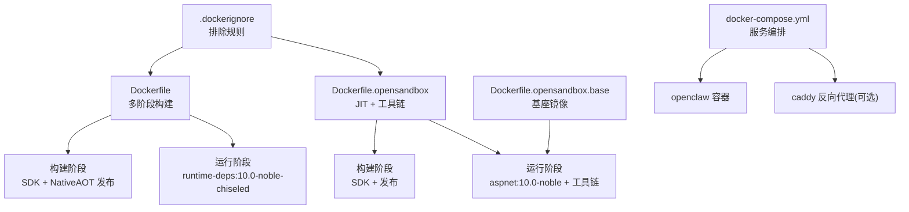
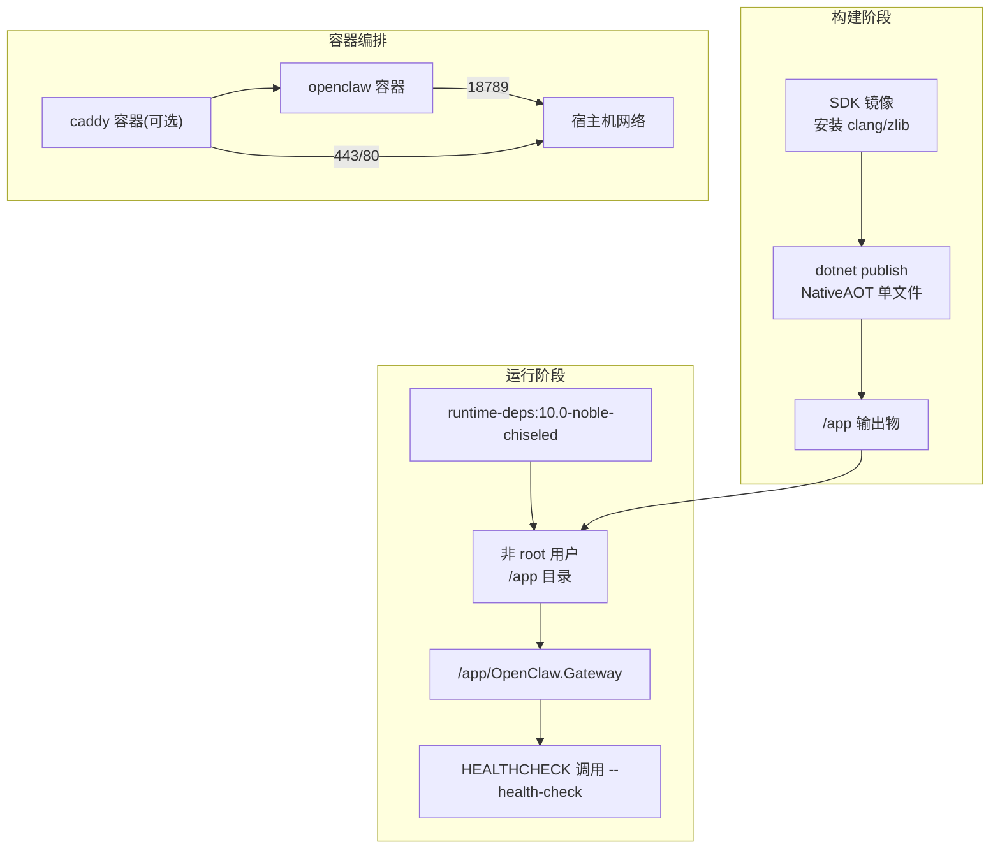
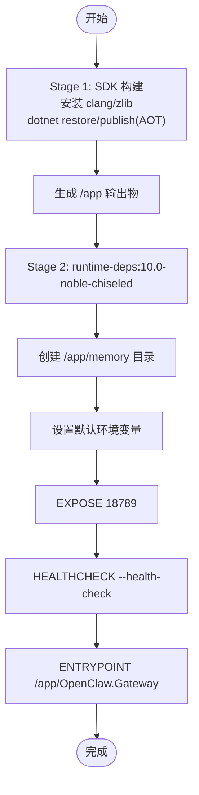
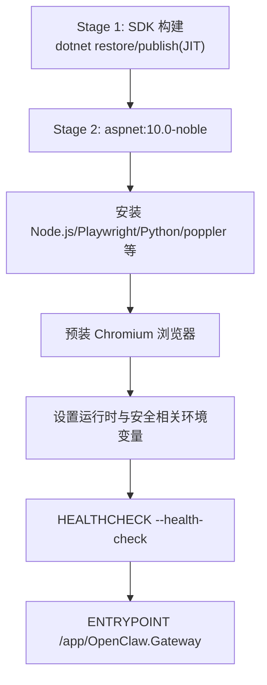
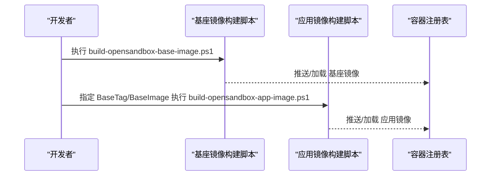
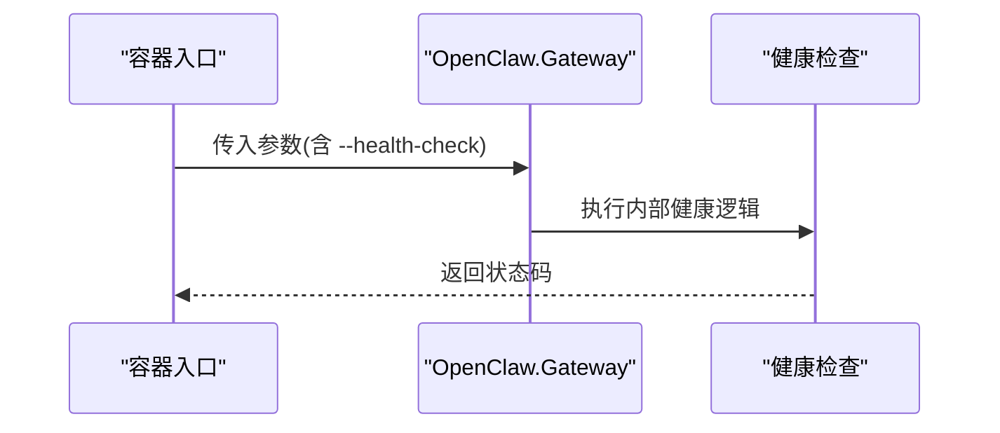
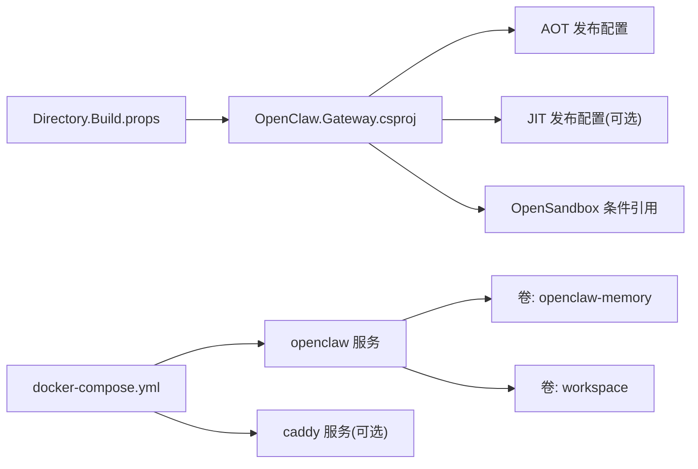

# Docker 部署

<cite>
**本文引用的文件**
- [Dockerfile](file://Dockerfile)
- [docker-compose.yml](file://docker-compose.yml)
- [Dockerfile.opensandbox](file://Dockerfile.opensandbox)
- [Dockerfile.opensandbox.base](file://Dockerfile.opensandbox.base)
- [.dockerignore](file://.dockerignore)
- [Directory.Build.props](file://Directory.Build.props)
- [src/OpenClaw.Gateway/OpenClaw.Gateway.csproj](file://src/OpenClaw.Gateway/OpenClaw.Gateway.csproj)
- [src/OpenClaw.Gateway/Program.cs](file://src/OpenClaw.Gateway/Program.cs)
- [src/OpenClaw.Gateway/Bootstrap/StartupLaunchOptions.cs](file://src/OpenClaw.Gateway/Bootstrap/StartupLaunchOptions.cs)
- [src/OpenClaw.Core/Models/RuntimeModels.cs](file://src/OpenClaw.Core/Models/RuntimeModels.cs)
- [scripts/build-opensandbox-base-image.ps1](file://scripts/build-opensandbox-base-image.ps1)
- [scripts/build-opensandbox-app-image.ps1](file://scripts/build-opensandbox-app-image.ps1)
- [Kingcrab.AppHost/appsettings.json](file://Kingcrab.AppHost/appsettings.json)
</cite>

## 目录
1. [简介](#简介)
2. [项目结构](#项目结构)
3. [核心组件](#核心组件)
4. [架构总览](#架构总览)
5. [详细组件分析](#详细组件分析)
6. [依赖分析](#依赖分析)
7. [性能考量](#性能考量)
8. [故障排查指南](#故障排查指南)
9. [结论](#结论)
10. [附录](#附录)

## 简介
本文件面向生产与开发团队，提供基于仓库现有 Docker 配置的完整部署指南。内容覆盖：
- 多阶段构建流程与 NativeAOT 发布策略
- chiseled 基础镜像的使用与安全加固
- 容器运行时配置、环境变量与健康检查机制
- 端口映射、卷挂载与 Docker Compose 编排最佳实践
- OpenSandbox 场景下的多阶段构建与基座镜像复用

## 项目结构
仓库中与容器化直接相关的关键文件如下：
- 构建与运行镜像：Dockerfile、Dockerfile.opensandbox、Dockerfile.opensandbox.base
- 编排与环境：docker-compose.yml、.dockerignore
- 运行时与配置：Directory.Build.props、src/OpenClaw.Gateway/OpenClaw.Gateway.csproj、src/OpenClaw.Gateway/Program.cs、src/OpenClaw.Gateway/Bootstrap/StartupLaunchOptions.cs、src/OpenClaw.Core/Models/RuntimeModels.cs
- 脚本：scripts/build-opensandbox-base-image.ps1、scripts/build-opensandbox-app-image.ps1
- Aspire 应用宿主配置：Kingcrab.AppHost/appsettings.json

图表来源
- [Dockerfile:1-59](file://Dockerfile#L1-L59)
- [Dockerfile.opensandbox:1-113](file://Dockerfile.opensandbox#L1-L113)
- [Dockerfile.opensandbox.base:1-76](file://Dockerfile.opensandbox.base#L1-L76)
- [docker-compose.yml:1-68](file://docker-compose.yml#L1-L68)
- [.dockerignore:1-14](file://.dockerignore#L1-L14)

章节来源
- [Dockerfile:1-59](file://Dockerfile#L1-L59)
- [docker-compose.yml:1-68](file://docker-compose.yml#L1-L68)
- [.dockerignore:1-14](file://.dockerignore#L1-L14)

## 核心组件
- 生产镜像（AOT + chiseled）
  - 使用 mcr.microsoft.com/dotnet/sdk:10.0 构建，启用 NativeAOT 单文件发布
  - 运行阶段采用 mcr.microsoft.com/dotnet/runtime-deps:10.0-noble-chiseled，非 root 用户，内置内存目录，暴露端口 18789，健康检查调用二进制参数进行自检
- OpenSandbox 镜像（JIT + 工具链）
  - 运行阶段基于 aspnet:10.0-noble，安装 Node.js、Playwright、Python、poppler 等工具，预装浏览器二进制，支持插件与沙箱能力
- 基座镜像（Base）
  - 将频繁变化小、安装成本高的系统包、Node、Playwright 浏览器等打包为稳定基座，应用镜像仅做增量构建
- 编排与环境
  - docker-compose 提供 openclaw 与可选 caddy 反代服务，定义端口映射、环境变量、卷与健康检查

章节来源
- [Dockerfile:35-59](file://Dockerfile#L35-L59)
- [Dockerfile.opensandbox:30-113](file://Dockerfile.opensandbox#L30-L113)
- [Dockerfile.opensandbox.base:15-76](file://Dockerfile.opensandbox.base#L15-L76)
- [docker-compose.yml:3-68](file://docker-compose.yml#L3-L68)

## 架构总览
下图展示从源码到容器运行的整体路径，以及容器间协作关系。

图表来源
- [Dockerfile:3-34](file://Dockerfile#L3-L34)
- [Dockerfile:35-59](file://Dockerfile#L35-L59)
- [docker-compose.yml:4-43](file://docker-compose.yml#L4-L43)

## 详细组件分析

### 组件 A：生产镜像（AOT + chiseled）构建流程
- 多阶段构建
  - 构建阶段：安装 clang 与 zlib，恢复 NuGet 包，复制源码，发布为 NativeAOT 单文件
  - 运行阶段：使用 chiseled 运行时镜像，创建内存目录，设置非 root 用户，注入默认环境变量，暴露端口并配置健康检查
- NativeAOT 优化
  - 启用 TrimMode=link、优化首选项为 Size，关闭符号与调试支持以减小体积
- chiseled 基础镜像
  - 采用 runtime-deps:10.0-noble-chiseled，减少运行时层冗余；注意该镜像默认用户为 app，通过 --chown 显式映射 UID/GID
- 健康检查
  - 通过二进制参数触发健康检查，避免对业务端口造成干扰

图表来源
- [Dockerfile:1-59](file://Dockerfile#L1-L59)

章节来源
- [Dockerfile:1-59](file://Dockerfile#L1-L59)
- [Directory.Build.props:10-12](file://Directory.Build.props#L10-L12)
- [src/OpenClaw.Gateway/OpenClaw.Gateway.csproj:6-24](file://src/OpenClaw.Gateway/OpenClaw.Gateway.csproj#L6-L24)

### 组件 B：OpenSandbox 镜像（JIT + 工具链）
- 多阶段构建
  - 构建阶段：与生产镜像类似，但发布时可通过构建参数启用 OpenSandbox 功能
  - 运行阶段：基于 aspnet:10.0-noble，安装 Node.js、Playwright、Python、poppler 等工具，并预装浏览器二进制
- 运行时模式与安全
  - 默认运行模式为 JIT，允许插件与沙箱能力；通过环境变量控制工作区根目录、读写白名单、插件开关等
- 健康检查
  - 与生产镜像一致，使用二进制参数进行健康检查

图表来源
- [Dockerfile.opensandbox:1-113](file://Dockerfile.opensandbox#L1-L113)

章节来源
- [Dockerfile.opensandbox:1-113](file://Dockerfile.opensandbox#L1-L113)
- [src/OpenClaw.Gateway/OpenClaw.Gateway.csproj:45-71](file://src/OpenClaw.Gateway/OpenClaw.Gateway.csproj#L45-L71)

### 组件 C：基座镜像（Base）与应用镜像复用
- 基座镜像
  - 将系统包、Node.js、Playwright 浏览器等高频变更组件打包为稳定基座，降低应用镜像构建时间
- 应用镜像
  - 仅执行 .NET 构建与二进制复制，通过脚本参数指定基座镜像标签或完整引用，实现快速增量构建
- 多平台与推送
  - 支持多平台构建与推送，脚本提供本地加载与远程推送两种模式

图表来源
- [scripts/build-opensandbox-base-image.ps1:1-127](file://scripts/build-opensandbox-base-image.ps1#L1-L127)
- [scripts/build-opensandbox-app-image.ps1:1-141](file://scripts/build-opensandbox-app-image.ps1#L1-L141)
- [Dockerfile.opensandbox.base:1-76](file://Dockerfile.opensandbox.base#L1-L76)

章节来源
- [scripts/build-opensandbox-base-image.ps1:1-127](file://scripts/build-opensandbox-base-image.ps1#L1-L127)
- [scripts/build-opensandbox-app-image.ps1:1-141](file://scripts/build-opensandbox-app-image.ps1#L1-L141)
- [Dockerfile.opensandbox.base:1-76](file://Dockerfile.opensandbox.base#L1-L76)

### 组件 D：运行时配置、环境变量与健康检查
- 端口绑定与监听
  - 程序启动时根据配置在指定地址与端口监听；compose 中默认映射 18789:18789
- 环境变量
  - 生产镜像默认值：绑定地址、端口、内存存储路径、工具链安全策略、插件开关等
  - OpenSandbox 镜像默认值：JIT 模式、工作区根目录、工具链安全策略、插件开关、信任转发头等
- 健康检查
  - 通过二进制参数触发健康检查，compose 中与镜像保持一致
- 运行时模式解析
  - 支持 auto/jit/aot 模式，自动根据运行时动态代码能力选择；JIT 模式需运行时具备动态代码支持

图表来源
- [Dockerfile:43-56](file://Dockerfile#L43-L56)
- [docker-compose.yml:37-42](file://docker-compose.yml#L37-L42)
- [src/OpenClaw.Gateway/Program.cs:96](file://src/OpenClaw.Gateway/Program.cs#L96)
- [src/OpenClaw.Core/Models/RuntimeModels.cs:29-59](file://src/OpenClaw.Core/Models/RuntimeModels.cs#L29-L59)

章节来源
- [Dockerfile:43-56](file://Dockerfile#L43-L56)
- [docker-compose.yml:11-42](file://docker-compose.yml#L11-L42)
- [src/OpenClaw.Gateway/Program.cs:96](file://src/OpenClaw.Gateway/Program.cs#L96)
- [src/OpenClaw.Core/Models/RuntimeModels.cs:29-59](file://src/OpenClaw.Core/Models/RuntimeModels.cs#L29-L59)

## 依赖分析
- 构建与运行依赖
  - 生产镜像依赖 NativeAOT 发布配置与 chiseled 运行时；OpenSandbox 镜像依赖 aspnet 运行时与额外系统工具
- 项目级配置
  - Directory.Build.props 控制目标框架、语言版本、可空性、警告级别与 AOT 修剪策略
  - Gateway 项目条件引用 OpenSandbox 组件，决定是否启用 JIT 沙箱功能
- 编排依赖
  - compose 中 openclaw 服务依赖 caddy（当启用 TLS 时），并共享卷用于持久化内存数据与可选工作区

图表来源
- [Directory.Build.props:1-41](file://Directory.Build.props#L1-L41)
- [src/OpenClaw.Gateway/OpenClaw.Gateway.csproj:1-143](file://src/OpenClaw.Gateway/OpenClaw.Gateway.csproj#L1-L143)
- [docker-compose.yml:3-68](file://docker-compose.yml#L3-L68)

章节来源
- [Directory.Build.props:1-41](file://Directory.Build.props#L1-L41)
- [src/OpenClaw.Gateway/OpenClaw.Gateway.csproj:1-143](file://src/OpenClaw.Gateway/OpenClaw.Gateway.csproj#L1-L143)
- [docker-compose.yml:3-68](file://docker-compose.yml#L3-L68)

## 性能考量
- AOT 体积与启动
  - 生产镜像采用 NativeAOT 单文件发布与激进修剪，显著减小镜像体积与启动延迟
- 运行时模式
  - auto 模式会根据运行时能力自动选择 JIT 或 AOT；JIT 模式提供更广兼容性，但启动与内存占用略高
- 基座镜像复用
  - OpenSandbox 基座镜像将昂贵的系统包与浏览器安装步骤固化，应用镜像仅做增量构建，缩短 CI/CD 时间

章节来源
- [Dockerfile:27-30](file://Dockerfile#L27-L30)
- [Directory.Build.props:10-12](file://Directory.Build.props#L10-L12)
- [src/OpenClaw.Core/Models/RuntimeModels.cs:29-59](file://src/OpenClaw.Core/Models/RuntimeModels.cs#L29-L59)
- [scripts/build-opensandbox-base-image.ps1:1-127](file://scripts/build-opensandbox-base-image.ps1#L1-L127)

## 故障排查指南
- 健康检查失败
  - 确认容器入口参数与镜像 HEALTHCHECK 一致；检查日志输出定位启动异常
- 端口冲突
  - 确认宿主机端口映射未被占用；compose 中默认映射 18789:18789
- 权限问题
  - 生产镜像使用非 root 用户；确保挂载卷权限正确（如 openclaw-memory 与 workspace）
- 运行时模式不匹配
  - 若选择 JIT 模式，请确认运行时具备动态代码支持；否则将抛出异常
- 反向代理与转发头
  - 在反代后部署时，可开启信任转发头与已知代理列表，确保客户端真实 IP 正确传递

章节来源
- [Dockerfile:55-56](file://Dockerfile#L55-L56)
- [docker-compose.yml:37-42](file://docker-compose.yml#L37-L42)
- [src/OpenClaw.Core/Models/RuntimeModels.cs:36-40](file://src/OpenClaw.Core/Models/RuntimeModels.cs#L36-L40)

## 结论
本仓库提供了两条清晰的容器化路径：生产优先的 AOT + chiseled 运行时镜像，以及面向插件与沙箱场景的 JIT + 工具链镜像。通过基座镜像复用与多阶段构建，既保证了镜像体积与启动性能，也兼顾了开发与运维效率。结合 docker-compose 的编排与健康检查，可快速搭建可观察、可扩展的生产环境。

## 附录

### 部署命令示例（不含具体代码片段）
- 构建生产镜像
  - 使用仓库根目录作为上下文，指定 Dockerfile 进行构建
  - 示例命令：docker build -t openclaw-net-local -f Dockerfile .
- 运行生产容器
  - 映射端口 18789:18789，挂载内存卷与工作区卷，设置必要环境变量
  - 示例命令：docker run -d --name openclaw-gateway -p 18789:18789 -v openclaw-memory:/app/memory -v ./workspace:/app/workspace openclaw-net-local
- 使用 Docker Compose
  - 启动 openclaw 服务与可选 caddy 反代（启用 with-tls profile）
  - 示例命令：docker compose up -d openclaw
- 构建 OpenSandbox 基座镜像
  - 执行脚本生成基座镜像并可选择推送至注册表
  - 示例命令：.\scripts\build-opensandbox-base-image.ps1 -Push
- 构建 OpenSandbox 应用镜像
  - 指定基座镜像标签或完整引用，构建应用镜像并可选择推送
  - 示例命令：.\scripts\build-opensandbox-app-image.ps1 -BaseTag opensandbox-base-latest -Push

章节来源
- [Dockerfile:1-59](file://Dockerfile#L1-L59)
- [docker-compose.yml:4-43](file://docker-compose.yml#L4-L43)
- [scripts/build-opensandbox-base-image.ps1:1-127](file://scripts/build-opensandbox-base-image.ps1#L1-L127)
- [scripts/build-opensandbox-app-image.ps1:1-141](file://scripts/build-opensandbox-app-image.ps1#L1-L141)

### 端口映射与卷挂载清单
- 端口映射
  - openclaw: 18789:18789
  - caddy(可选): 80:80, 443:443
- 卷挂载
  - openclaw-memory: 持久化内存数据
  - workspace: 可选工作区挂载，供工具链读写

章节来源
- [docker-compose.yml:11-42](file://docker-compose.yml#L11-L42)

### 环境变量参考（按用途分类）
- 基本运行
  - OpenClaw__BindAddress、OpenClaw__Port、OpenClaw__Memory__StoragePath
- 工具链与安全
  - OpenClaw__Tooling__AllowShell、OpenClaw__Tooling__AllowedReadRoots__0、OpenClaw__Tooling__AllowedWriteRoots__0
- 插件与运行时
  - OpenClaw__Plugins__Enabled、OpenClaw__Runtime__Mode（JIT/AOT/auto）
- 反向代理（可选）
  - OpenClaw__Security__TrustForwardedHeaders、OpenClaw__Security__KnownProxies__0

章节来源
- [Dockerfile:43-51](file://Dockerfile#L43-L51)
- [Dockerfile.opensandbox:91-104](file://Dockerfile.opensandbox#L91-L104)
- [docker-compose.yml:13-31](file://docker-compose.yml#L13-L31)

### 多容器编排最佳实践
- 分离职责
  - openclaw 专注业务，caddy 专注 TLS 与反向代理
- 健康检查
  - 使用统一的健康检查策略，确保编排器能正确感知服务状态
- 数据持久化
  - 将内存数据与工作区分别挂载到独立卷，便于备份与迁移
- 网络隔离
  - 通过 compose 网络隔离服务，必要时限制访问范围

章节来源
- [docker-compose.yml:3-68](file://docker-compose.yml#L3-L68)