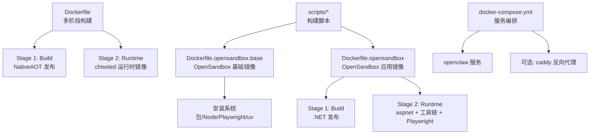
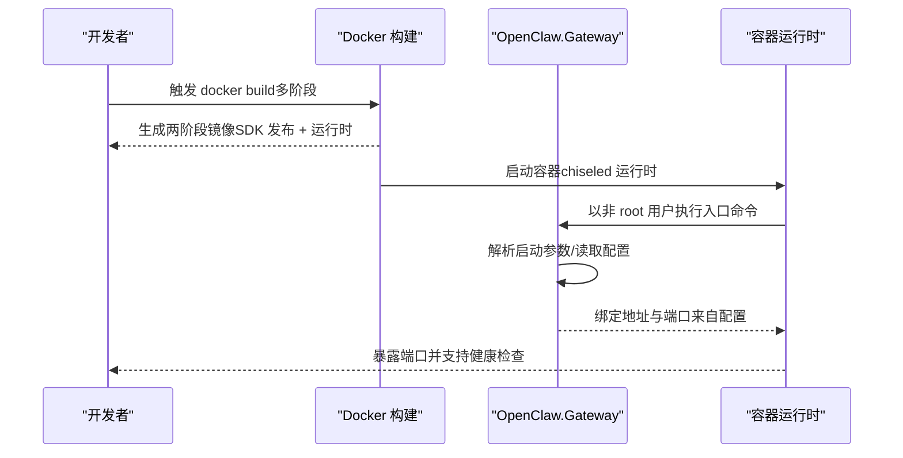
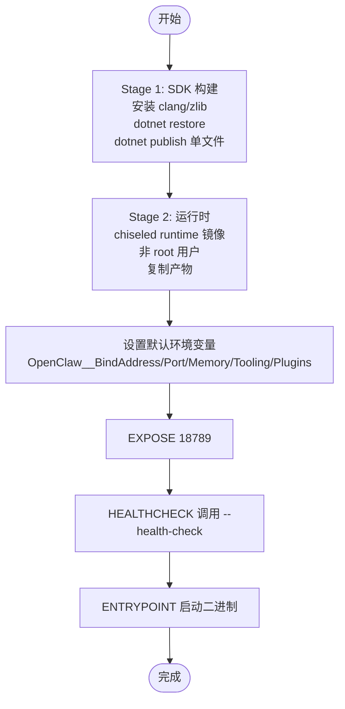
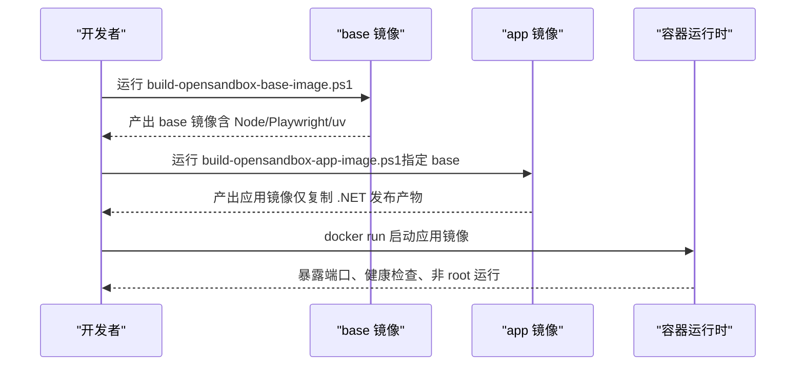
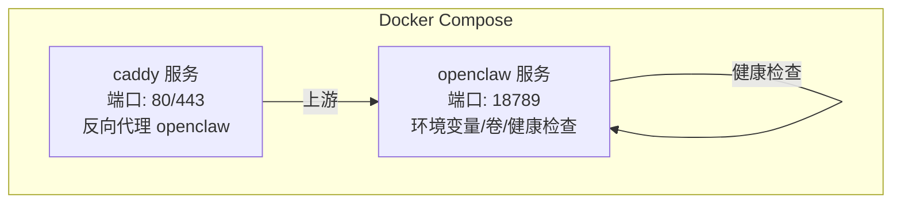
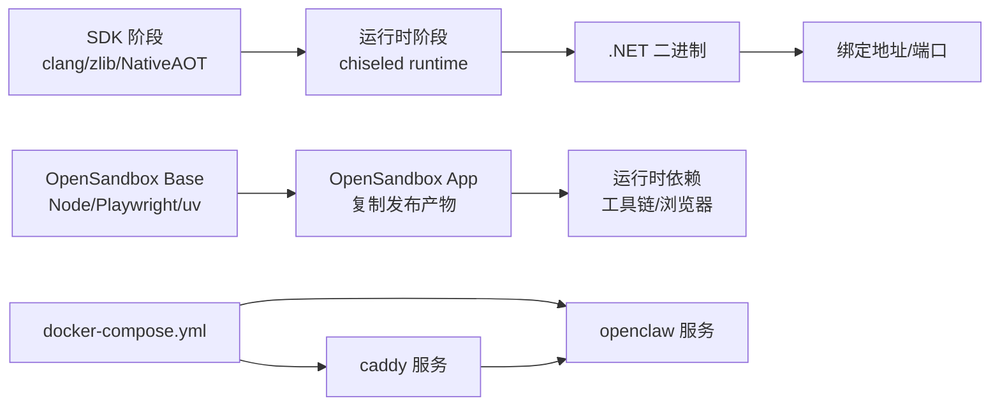

# Docker 部署

<cite>
**本文引用的文件**
- [Dockerfile](file://Dockerfile)
- [Dockerfile.opensandbox](file://Dockerfile.opensandbox)
- [Dockerfile.opensandbox.base](file://Dockerfile.opensandbox.base)
- [docker-compose.yml](file://docker-compose.yml)
- [.dockerignore](file://.dockerignore)
- [scripts/build-opensandbox-base-image.ps1](file://scripts/build-opensandbox-base-image.ps1)
- [scripts/build-opensandbox-image.ps1](file://scripts/build-opensandbox-image.ps1)
- [scripts/build-opensandbox-app-image.ps1](file://scripts/build-opensandbox-app-image.ps1)
- [src/OpenClaw.Gateway/Program.cs](file://src/OpenClaw.Gateway/Program.cs)
- [src/OpenClaw.Gateway/appsettings.json](file://src/OpenClaw.Gateway/appsettings.json)
- [src/OpenClaw.Gateway/appsettings.Production.json](file://src/OpenClaw.Gateway/appsettings.Production.json)
- [Kingcrab.AppHost/appsettings.json](file://Kingcrab.AppHost/appsettings.json)
- [Kingcrab.AppHost/appsettings.Development.json](file://Kingcrab.AppHost/appsettings.Development.json)
</cite>

## 目录
1. [简介](#简介)
2. [项目结构](#项目结构)
3. [核心组件](#核心组件)
4. [架构总览](#架构总览)
5. [详细组件分析](#详细组件分析)
6. [依赖关系分析](#依赖关系分析)
7. [性能考量](#性能考量)
8. [故障排查指南](#故障排查指南)
9. [结论](#结论)
10. [附录](#附录)

## 简介
本文件面向 OpenClaw.NET 的容器化部署，系统性说明多阶段 Dockerfile 构建（含 NativeAOT 发布与 chiseled 运行时镜像）、运行时镜像优化、OpenSandbox 容器的特殊配置与用途、容器配置参数与环境变量、端口暴露、健康检查、非 root 用户运行与安全最佳实践，并提供 Docker Compose 示例、卷挂载策略、网络设置、调试技巧、日志查看与性能监控方法。

## 项目结构
与 Docker 部署直接相关的核心文件与脚本如下：
- 多阶段构建：Dockerfile（NativeAOT 发布 + chiseled 运行时）
- OpenSandbox 容器：Dockerfile.opensandbox（含浏览器与工具链）与 Dockerfile.opensandbox.base（基础层）
- 编排与本地开发：docker-compose.yml
- 构建脚本：scripts 下的三套 PowerShell 脚本，分别用于构建 base、完整 OpenSandbox 应用镜像与基于预构建 base 的应用镜像
- 忽略规则：.dockerignore
- 运行时配置：src/OpenClaw.Gateway/appsettings.*.json 与 Program.cs

图表来源
- [Dockerfile:1-59](file://Dockerfile#L1-L59)
- [Dockerfile.opensandbox:1-113](file://Dockerfile.opensandbox#L1-L113)
- [Dockerfile.opensandbox.base:1-76](file://Dockerfile.opensandbox.base#L1-L76)
- [docker-compose.yml:1-68](file://docker-compose.yml#L1-L68)
- [scripts/build-opensandbox-base-image.ps1:1-127](file://scripts/build-opensandbox-base-image.ps1#L1-L127)
- [scripts/build-opensandbox-image.ps1:1-93](file://scripts/build-opensandbox-image.ps1#L1-L93)
- [scripts/build-opensandbox-app-image.ps1:1-141](file://scripts/build-opensandbox-app-image.ps1#L1-L141)

章节来源
- [Dockerfile:1-59](file://Dockerfile#L1-L59)
- [Dockerfile.opensandbox:1-113](file://Dockerfile.opensandbox#L1-L113)
- [Dockerfile.opensandbox.base:1-76](file://Dockerfile.opensandbox.base#L1-L76)
- [docker-compose.yml:1-68](file://docker-compose.yml#L1-L68)
- [.dockerignore:1-14](file://.dockerignore#L1-L14)
- [scripts/build-opensandbox-base-image.ps1:1-127](file://scripts/build-opensandbox-base-image.ps1#L1-L127)
- [scripts/build-opensandbox-image.ps1:1-93](file://scripts/build-opensandbox-image.ps1#L1-L93)
- [scripts/build-opensandbox-app-image.ps1:1-141](file://scripts/build-opensandbox-app-image.ps1#L1-L141)

## 核心组件
- 多阶段构建（NativeAOT + chiseled 运行时）
  - 第一阶段：SDK 镜像，安装 clang/zlib，恢复 NuGet 包，发布为单文件 NativeAOT 二进制
  - 第二阶段：使用 .NET 10 chiseled 运行时镜像，非 root 用户，复制发布产物，设置默认环境变量、暴露端口、健康检查、入口命令
- OpenSandbox 容器
  - 在 aspnet 基础上安装 Node/Playwright/Python/Poppler 等工具，预装浏览器二进制，支持 JIT 模式与插件启用
  - 提供独立的 base 镜像以复用频繁安装的系统依赖，app 镜像仅做 .NET 发布复制，提升构建效率
- 编排与本地开发
  - docker-compose.yml 定义 openclaw 主服务与可选 caddy 反代，包含环境变量、卷挂载、健康检查与网络依赖
- 运行时配置
  - Program.cs 解析启动参数并绑定地址与端口；appsettings.*.json 提供生产/开发默认值与安全策略

章节来源
- [Dockerfile:1-59](file://Dockerfile#L1-L59)
- [Dockerfile.opensandbox:1-113](file://Dockerfile.opensandbox#L1-L113)
- [Dockerfile.opensandbox.base:1-76](file://Dockerfile.opensandbox.base#L1-L76)
- [docker-compose.yml:1-68](file://docker-compose.yml#L1-L68)
- [src/OpenClaw.Gateway/Program.cs:1-124](file://src/OpenClaw.Gateway/Program.cs#L1-L124)
- [src/OpenClaw.Gateway/appsettings.json:1-908](file://src/OpenClaw.Gateway/appsettings.json#L1-L908)
- [src/OpenClaw.Gateway/appsettings.Production.json:1-65](file://src/OpenClaw.Gateway/appsettings.Production.json#L1-L65)

## 架构总览
下图展示从源码到容器镜像的关键路径，以及运行时监听地址与端口的来源。

图表来源
- [Dockerfile:35-59](file://Dockerfile#L35-L59)
- [src/OpenClaw.Gateway/Program.cs:96](file://src/OpenClaw.Gateway/Program.cs#L96)
- [src/OpenClaw.Gateway/appsettings.Production.json:3-4](file://src/OpenClaw.Gateway/appsettings.Production.json#L3-L4)

章节来源
- [Dockerfile:35-59](file://Dockerfile#L35-L59)
- [src/OpenClaw.Gateway/Program.cs:96](file://src/OpenClaw.Gateway/Program.cs#L96)
- [src/OpenClaw.Gateway/appsettings.Production.json:3-4](file://src/OpenClaw.Gateway/appsettings.Production.json#L3-L4)

## 详细组件分析

### 多阶段 Dockerfile（NativeAOT + chiseled 运行时）
- 构建阶段（Stage 1）
  - 使用 .NET SDK 10 镜像，安装 clang 与 zlib 以支持 NativeAOT
  - 为加速恢复，先复制项目文件与构建属性，再执行 dotnet restore
  - 复制全部源码后进行发布，输出为单文件二进制
  - 预创建内存目录（chiseled 镜像不包含 mkdir）
- 运行阶段（Stage 2）
  - 使用 .NET 10 chiseled 运行时镜像，避免 SDK 层面的体积与攻击面
  - 设置工作目录与非 root 用户（UID/GID 与 chown），复制发布产物
  - 默认环境变量（双下划线分节符）：绑定地址、端口、内存存储路径、工具根目录、插件开关等
  - 暴露端口 18789，配置健康检查调用二进制的 --health-check 参数
  - 入口命令为二进制文件

图表来源
- [Dockerfile:1-59](file://Dockerfile#L1-L59)

章节来源
- [Dockerfile:1-59](file://Dockerfile#L1-L59)

### OpenSandbox 容器（完整工具链 + Playwright）
- 目标与定位
  - 为需要浏览器自动化、代码执行、PDF 解析等能力的场景提供“沙箱”容器体验
  - 适合开发调试、诊断与需要 JIT 执行的场景
- 基础层（base）
  - 安装系统依赖、Node.js、Playwright、uv 等，预装 Chromium 浏览器二进制
  - 创建 openclaw 用户并准备缓存目录
- 应用层（app）
  - 在 aspnet 基础上，复制 .NET 发布产物，设置用户与目录权限
  - 配置 PLAYWRIGHT_BROWSERS_PATH 与 NODE_PATH，确保 Node 与 .NET 的 Playwright 共享浏览器
  - 环境变量覆盖：启用 JIT、允许 shell、开启插件、信任转发头、设置工作区与内存路径等
  - 暴露端口 18789，健康检查调用 --health-check
  - 入口命令为二进制
- 构建脚本
  - build-opensandbox-base-image.ps1：构建 base 镜像（建议定期更新）
  - build-opensandbox-image.ps1：从零构建 OpenSandbox 应用镜像
  - build-opensandbox-app-image.ps1：基于预构建 base 快速构建应用镜像

图表来源
- [Dockerfile.opensandbox.base:1-76](file://Dockerfile.opensandbox.base#L1-L76)
- [Dockerfile.opensandbox:1-113](file://Dockerfile.opensandbox#L1-L113)
- [scripts/build-opensandbox-base-image.ps1:1-127](file://scripts/build-opensandbox-base-image.ps1#L1-L127)
- [scripts/build-opensandbox-app-image.ps1:1-141](file://scripts/build-opensandbox-app-image.ps1#L1-L141)

章节来源
- [Dockerfile.opensandbox.base:1-76](file://Dockerfile.opensandbox.base#L1-L76)
- [Dockerfile.opensandbox:1-113](file://Dockerfile.opensandbox#L1-L113)
- [scripts/build-opensandbox-base-image.ps1:1-127](file://scripts/build-opensandbox-base-image.ps1#L1-L127)
- [scripts/build-opensandbox-image.ps1:1-93](file://scripts/build-opensandbox-image.ps1#L1-L93)
- [scripts/build-opensandbox-app-image.ps1:1-141](file://scripts/build-opensandbox-app-image.ps1#L1-L141)

### Docker Compose 配置与网络
- openclaw 服务
  - 基于 Dockerfile 构建镜像或使用本地标签
  - 端口映射 18789:18789
  - 关键环境变量：模型提供商密钥、认证令牌、绑定地址、端口、工具根目录、插件开关、可选信任转发头
  - 卷挂载：内存持久化卷、工作区挂载（默认 ./workspace）
  - 健康检查：调用二进制 --health-check
- 可选 caddy 反向代理
  - 条件启用 with-tls profile
  - 映射 80/443，挂载 Caddyfile 与数据/配置卷
  - 依赖 openclaw 健康状态

图表来源
- [docker-compose.yml:1-68](file://docker-compose.yml#L1-L68)

章节来源
- [docker-compose.yml:1-68](file://docker-compose.yml#L1-L68)

### 运行时配置参数与环境变量
- 绑定地址与端口
  - 程序通过解析启动参数并绑定到配置的地址与端口
  - 生产配置默认绑定地址为 0.0.0.0，端口 18789
- 内存与工作区
  - 内存存储路径与 SQLite 数据库路径在生产配置中指向 /app/memory
  - 工作区根目录通过环境变量注入，限制工具读写范围
- 安全策略
  - 生产配置默认信任转发头，严格控制公共绑定下的工具与插件能力
- 插件与工具
  - 默认关闭插件，禁用 shell；可通过环境变量调整允许范围
- 日志级别
  - AppHost 的日志配置在开发与生产环境有差异，便于本地调试与线上稳定

章节来源
- [src/OpenClaw.Gateway/Program.cs:96](file://src/OpenClaw.Gateway/Program.cs#L96)
- [src/OpenClaw.Gateway/appsettings.json:1-908](file://src/OpenClaw.Gateway/appsettings.json#L1-L908)
- [src/OpenClaw.Gateway/appsettings.Production.json:1-65](file://src/OpenClaw.Gateway/appsettings.Production.json#L1-L65)
- [Kingcrab.AppHost/appsettings.json:1-10](file://Kingcrab.AppHost/appsettings.json#L1-L10)
- [Kingcrab.AppHost/appsettings.Development.json:1-9](file://Kingcrab.AppHost/appsettings.Development.json#L1-L9)

### 健康检查、非 root 用户与安全最佳实践
- 健康检查
  - 两种镜像均通过调用二进制的 --health-check 参数进行健康检查
  - compose 中也定义了相同的健康检查策略
- 非 root 用户
  - chiseled 运行时镜像默认使用 app 用户；自定义镜像中明确创建 openclaw 用户并 chown 目录
  - 运行时以非 root 身份启动，降低权限风险
- 安全最佳实践
  - 生产配置默认关闭插件与 shell，限制工具根目录
  - 通过信任转发头与已知代理列表，配合反向代理实现安全边界
  - 使用只读模式与白名单路径，限制工具对文件系统的访问

章节来源
- [Dockerfile:55-56](file://Dockerfile#L55-L56)
- [Dockerfile.opensandbox:110-111](file://Dockerfile.opensandbox#L110-L111)
- [docker-compose.yml:37-42](file://docker-compose.yml#L37-L42)
- [src/OpenClaw.Gateway/appsettings.Production.json:22-30](file://src/OpenClaw.Gateway/appsettings.Production.json#L22-L30)

### OpenSandbox 容器的特殊配置与用途
- 特殊配置
  - 安装 Node/Playwright/Python/Poppler 等工具，预装浏览器二进制
  - 设置 PLAYWRIGHT_BROWSERS_PATH 与 NODE_PATH，保证 Node 与 .NET 的 Playwright 共享浏览器
  - 环境变量启用 JIT、允许 shell、开启插件、信任转发头、设置工作区与内存路径
- 用途
  - 开发调试、诊断问题、需要浏览器自动化与代码执行的场景
  - 作为“沙箱”容器，提供更完整的工具链与诊断能力

章节来源
- [Dockerfile.opensandbox:34-104](file://Dockerfile.opensandbox#L34-L104)
- [Dockerfile.opensandbox.base:19-73](file://Dockerfile.opensandbox.base#L19-L73)

## 依赖关系分析
- 构建依赖
  - SDK 阶段依赖 clang/zlib 支持 NativeAOT
  - 运行时阶段依赖 chiseled runtime 镜像，减少攻击面
- 运行时依赖
  - 程序绑定地址与端口来自配置；生产配置默认公开绑定与严格安全策略
  - OpenSandbox 镜像额外依赖 Node/Playwright/Python/Poppler 等工具
- 编排依赖
  - caddy 服务依赖 openclaw 健康状态

图表来源
- [Dockerfile:1-59](file://Dockerfile#L1-L59)
- [Dockerfile.opensandbox.base:1-76](file://Dockerfile.opensandbox.base#L1-L76)
- [Dockerfile.opensandbox:1-113](file://Dockerfile.opensandbox#L1-L113)
- [docker-compose.yml:1-68](file://docker-compose.yml#L1-L68)

章节来源
- [Dockerfile:1-59](file://Dockerfile#L1-L59)
- [Dockerfile.opensandbox.base:1-76](file://Dockerfile.opensandbox.base#L1-L76)
- [Dockerfile.opensandbox:1-113](file://Dockerfile.opensandbox#L1-L113)
- [docker-compose.yml:1-68](file://docker-compose.yml#L1-L68)

## 性能考量
- NativeAOT 单文件发布
  - 减少运行时依赖与启动时间，适合生产环境
- chiseled 运行时镜像
  - 体积小、攻击面低，启动更快
- OpenSandbox 基础镜像复用
  - 将 Node/Playwright/uv 等安装步骤固化到 base 镜像，app 镜像仅复制发布产物，显著缩短构建时间
- 端口与健康检查
  - 明确暴露端口与健康检查间隔，便于编排与自动重启

章节来源
- [Dockerfile:28-30](file://Dockerfile#L28-L30)
- [Dockerfile:36](file://Dockerfile#L36)
- [Dockerfile.opensandbox.base:19-73](file://Dockerfile.opensandbox.base#L19-L73)
- [scripts/build-opensandbox-app-image.ps1:1-141](file://scripts/build-opensandbox-app-image.ps1#L1-L141)

## 故障排查指南
- 健康检查失败
  - 检查容器日志，确认二进制是否正确执行 --health-check
  - 确认绑定地址与端口配置是否符合预期
- 认证与反向代理
  - 若 behind 反向代理，需启用信任转发头并配置已知代理 IP
- 工作区与权限
  - 确认挂载的工作区路径存在且具有正确的读写权限
  - 生产配置默认禁用 shell 与插件，如需调试请按需开启
- OpenSandbox 浏览器问题
  - 确认 PLAYWRIGHT_BROWSERS_PATH 与 NODE_PATH 设置一致
  - 确保预装的浏览器二进制可用

章节来源
- [Dockerfile:55-56](file://Dockerfile#L55-L56)
- [Dockerfile.opensandbox:110-111](file://Dockerfile.opensandbox#L110-L111)
- [docker-compose.yml:37-42](file://docker-compose.yml#L37-L42)
- [src/OpenClaw.Gateway/appsettings.Production.json:22-30](file://src/OpenClaw.Gateway/appsettings.Production.json#L22-L30)
- [Dockerfile.opensandbox:81-89](file://Dockerfile.opensandbox#L81-L89)

## 结论
通过多阶段 NativeAOT 构建与 chiseled 运行时镜像，OpenClaw.NET 在生产环境中实现了快速启动与低攻击面；OpenSandbox 容器则提供了丰富的工具链与浏览器能力，适用于开发调试与诊断。结合 docker-compose 的环境变量、卷挂载与健康检查配置，可实现安全、可观测与易维护的容器化部署。

## 附录
- 构建与运行建议
  - 生产环境优先使用标准 Dockerfile 生成的镜像
  - 开发调试可使用 OpenSandbox 镜像，必要时启用插件与 shell
  - 定期更新 OpenSandbox base 镜像以获取系统依赖与浏览器更新
- 相关文件路径
  - 多阶段构建：Dockerfile
  - OpenSandbox 基础与应用：Dockerfile.opensandbox.base、Dockerfile.opensandbox
  - 编排：docker-compose.yml
  - 构建脚本：scripts/build-opensandbox-*.ps1
  - 运行时配置：src/OpenClaw.Gateway/appsettings.*.json、Program.cs