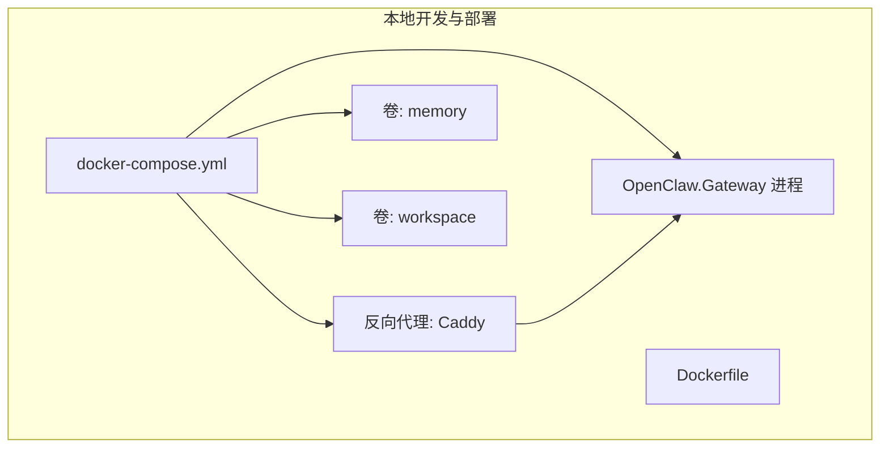
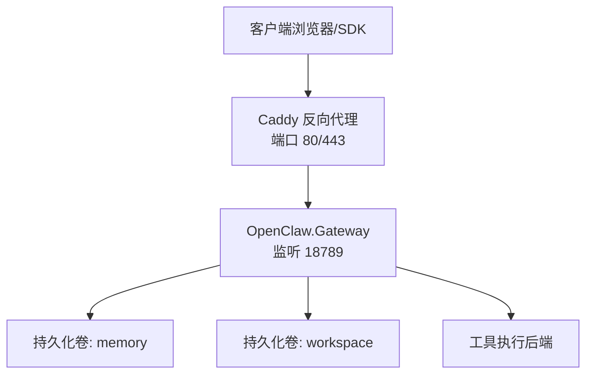
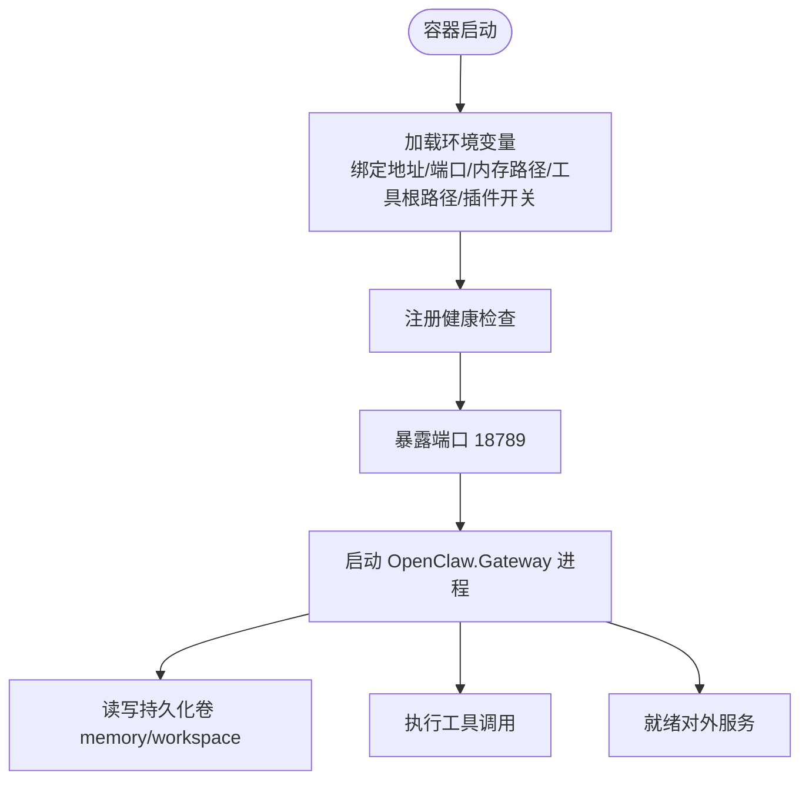
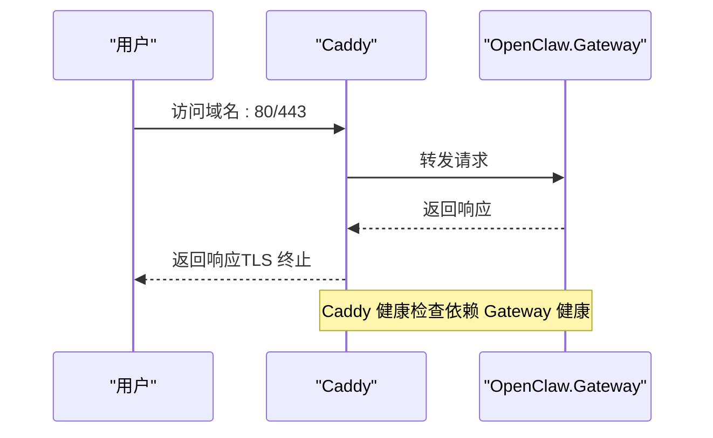
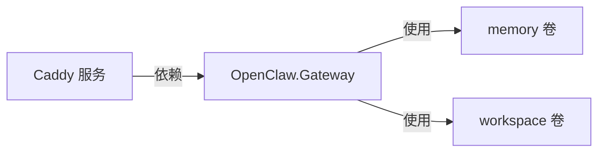

# 基础设施部署

<cite>
**本文引用的文件**
- [docker-compose.yml](file://docker-compose.yml)
- [Dockerfile](file://Dockerfile)
- [appsettings.json](file://Kingcrab.AppHost/appsettings.json)
- [appsettings.Development.json](file://Kingcrab.AppHost/appsettings.Development.json)
</cite>

## 目录
1. [简介](#简介)
2. [项目结构](#项目结构)
3. [核心组件](#核心组件)
4. [架构总览](#架构总览)
5. [详细组件分析](#详细组件分析)
6. [依赖关系分析](#依赖关系分析)
7. [性能考虑](#性能考虑)
8. [故障排除指南](#故障排除指南)
9. [结论](#结论)
10. [附录](#附录)

## 简介
本指南面向 OpenClaw.NET 的基础设施部署，重点覆盖以下方面：
- 容器镜像构建与运行参数
- 单机与本地编排（基于 docker-compose）的部署形态
- 健康检查与持久化存储
- 反向代理与 SSL 终止
- 运行时配置与安全参数
- 为后续迁移到 Kubernetes/Helm/Terraform 提供参考路径

说明：当前仓库未包含 Kubernetes YAML、Helm Chart 或 Terraform 模板；本指南以现有 docker-compose 与 Dockerfile 为基础，给出可扩展到容器编排平台的实践建议。

## 项目结构
与部署相关的核心文件与目录如下：
- 容器编排：docker-compose.yml
- 容器镜像：Dockerfile
- Aspire 应用宿主配置：Kingcrab.AppHost/appsettings*.json
- 其他 Dockerfile 变体：Dockerfile.opensandbox*（用于沙箱能力）

图表来源
- [docker-compose.yml:1-68](file://docker-compose.yml#L1-L68)
- [Dockerfile:1-59](file://Dockerfile#L1-L59)

章节来源
- [docker-compose.yml:1-68](file://docker-compose.yml#L1-L68)
- [Dockerfile:1-59](file://Dockerfile#L1-L59)

## 核心组件
- OpenClaw.Gateway 容器
  - 监听端口：18789
  - 默认绑定地址：0.0.0.0
  - 健康检查命令：通过进程参数触发健康检查
  - 工作目录：/app
  - 默认环境变量：内存存储路径、工具根路径、插件开关等
- Caddy 反向代理（可选）
  - 监听 80/443
  - 通过挂载 Caddyfile 实现路由与自动 TLS
  - 依赖 OpenClaw.Gateway 健康状态启动
- 数据持久化
  - memory 卷：保存会话与记忆数据
  - workspace 卷：可选挂载工作区目录供工具读写

章节来源
- [docker-compose.yml:3-43](file://docker-compose.yml#L3-L43)
- [Dockerfile:35-58](file://Dockerfile#L35-L58)

## 架构总览
下图展示单机部署时的典型拓扑：客户端经反向代理访问 OpenClaw.Gateway，后者从持久化卷读取数据并执行工具调用。

图表来源
- [docker-compose.yml:44-62](file://docker-compose.yml#L44-L62)
- [Dockerfile:35-58](file://Dockerfile#L35-L58)

## 详细组件分析

### OpenClaw.Gateway 容器规格
- 镜像来源与构建
  - 多阶段构建：SDK 阶段用于还原与发布，runtime-deps 阶段用于最终运行时
  - 发布产物为 NativeAOT 单文件二进制
- 端口与网络
  - 暴露端口：18789
  - 默认绑定地址：0.0.0.0（允许外部访问）
- 健康检查
  - 使用进程内健康检查命令
  - 调整间隔、超时与重试次数
- 环境变量与默认值
  - 关键运行参数通过环境变量注入（如绑定地址、端口、内存路径、工具根路径、插件开关）
  - 安全默认：禁用 Shell 工具、禁用插件桥接、限制工具根路径
- 数据卷
  - 内存数据目录：/app/memory
  - 工作空间目录：/app/workspace（可通过宿主机挂载覆盖）

图表来源
- [Dockerfile:35-58](file://Dockerfile#L35-L58)

章节来源
- [Dockerfile:1-59](file://Dockerfile#L1-L59)

### 反向代理与 SSL 终止（Caddy）
- 启动条件
  - 仅在启用 profile with-tls 时启动
  - 依赖 OpenClaw.Gateway 健康后再启动
- 端口映射
  - 80/443 映射到容器
- 配置与证书
  - 通过挂载 Caddyfile 实现站点配置与自动 TLS
  - 数据与配置卷独立管理

图表来源
- [docker-compose.yml:44-62](file://docker-compose.yml#L44-L62)

章节来源
- [docker-compose.yml:44-62](file://docker-compose.yml#L44-L62)

### 持久化存储与数据卷
- memory 卷
  - 用途：保存会话、记忆与运行时状态
  - 生命周期：随容器删除而丢失，需备份或迁移
- workspace 卷
  - 用途：工具读写的工作区
  - 可通过宿主机目录挂载实现跨容器复用
- 建议
  - 生产环境使用命名卷或云盘挂载
  - 定期备份 memory 卷内容

章节来源
- [docker-compose.yml:32-42](file://docker-compose.yml#L32-L42)
- [Dockerfile:32-33](file://Dockerfile#L32-L33)

### 运行时配置与安全参数
- 绑定地址与端口
  - 通过环境变量 OpenClaw__BindAddress 与 OpenClaw__Port 设置
- 工具安全
  - 默认禁用 Shell 工具与插件桥接
  - 限制工具根路径，避免越权访问
- 反向代理信任
  - 如部署在反向代理之后，可启用转发头信任与已知代理列表

章节来源
- [Dockerfile:43-51](file://Dockerfile#L43-L51)
- [docker-compose.yml:13-31](file://docker-compose.yml#L13-L31)

## 依赖关系分析
- 组件耦合
  - Caddy 依赖 OpenClaw.Gateway 健康状态
  - OpenClaw.Gateway 依赖 memory/workspace 卷
- 外部依赖
  - 反向代理镜像：caddy:2-alpine
  - 运行时基础镜像：dotnet/runtime-deps:10.0-noble-chiseled
- 可能的循环依赖
  - 当前 compose 中无循环依赖

图表来源
- [docker-compose.yml:3-43](file://docker-compose.yml#L3-L43)
- [docker-compose.yml:44-62](file://docker-compose.yml#L44-L62)

章节来源
- [docker-compose.yml:1-68](file://docker-compose.yml#L1-L68)

## 性能考虑
- NativeAOT 发布
  - 减少 JIT 开销，提升启动与运行效率
- 最小化运行时镜像
  - 使用 chiseled 运行时基础镜像，降低镜像体积与攻击面
- 健康检查与重启策略
  - 合理设置健康检查间隔与超时，避免误判
  - 使用 unless-stopped 重启策略，便于维护期间停止

章节来源
- [Dockerfile:1-59](file://Dockerfile#L1-L59)
- [docker-compose.yml:10-10](file://docker-compose.yml#L10-L10)

## 故障排除指南
- 健康检查失败
  - 检查 OpenClaw.Gateway 是否正常启动
  - 查看日志输出，确认绑定地址与端口是否冲突
- 反向代理无法访问
  - 确认 Caddy 服务已启动且依赖的 Gateway 健康
  - 检查 Caddyfile 配置与域名解析
- 权限与路径问题
  - 确认工具根路径与读写权限
  - 检查卷挂载是否正确

章节来源
- [docker-compose.yml:37-42](file://docker-compose.yml#L37-L42)
- [docker-compose.yml:58-60](file://docker-compose.yml#L58-L60)

## 结论
本指南基于现有 docker-compose 与 Dockerfile，给出了 OpenClaw.NET 的单机部署方案与运行时配置要点。对于生产级部署，建议：
- 将 docker-compose 迁移为 Kubernetes 清单，并引入 Helm Chart 管理
- 使用 Terraform 管理云资源与网络策略
- 引入 Ingress 控制器、服务网格与自动扩缩容策略
- 建立完善的备份与灾难恢复流程

## 附录

### 从 docker-compose 到 Kubernetes 的迁移要点
- Pod 规格
  - 资源请求与限制：CPU/内存预留与上限
  - 健康检查：使用现有健康检查命令
  - 端口暴露：18789
- 服务与网络
  - ClusterIP/LoadBalancer/SVC 类型选择
  - Ingress 控制器与 TLS 配置
- 存储
  - PersistentVolumeClaim 绑定 memory/workspace
- 自动扩缩容
  - HPA 基于 CPU/内存或自定义指标
- 配置与密钥
  - ConfigMap/Secret 管理环境变量与证书
- 可观测性
  - 日志、指标与追踪采集

### Aspire 应用宿主配置
- 日志级别控制
  - 通过 appsettings.json/appsettings.Development.json 调整日志等级
- 适用于本地开发与 Aspire 托管场景

章节来源
- [appsettings.json:1-10](file://Kingcrab.AppHost/appsettings.json#L1-L10)
- [appsettings.Development.json:1-9](file://Kingcrab.AppHost/appsettings.Development.json#L1-L9)