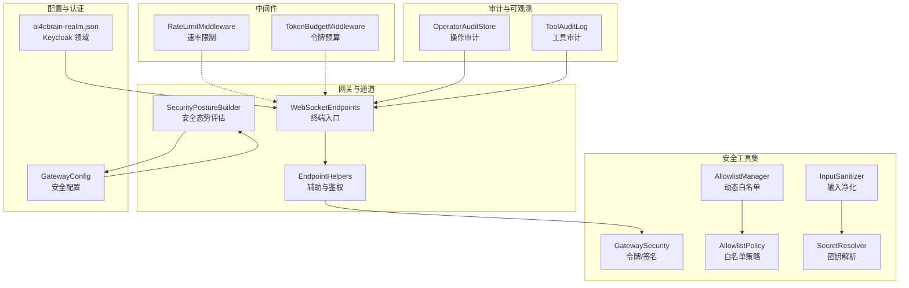
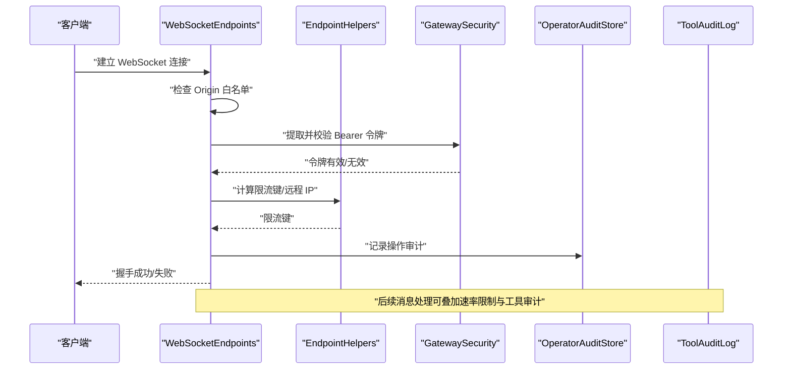
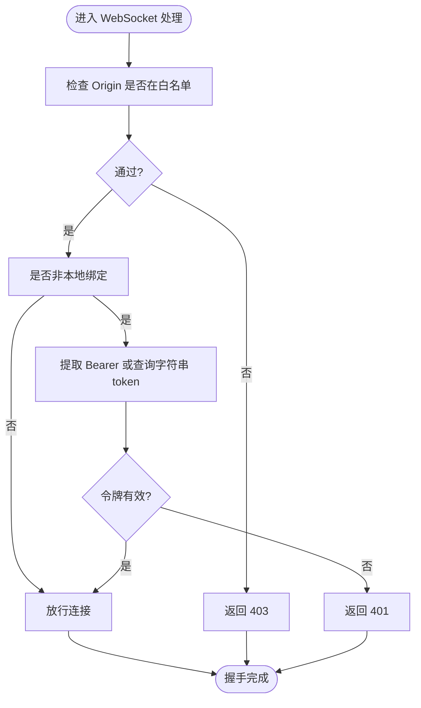
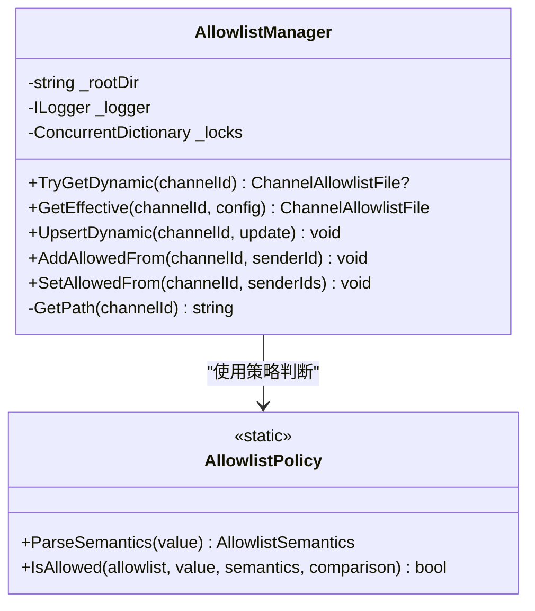
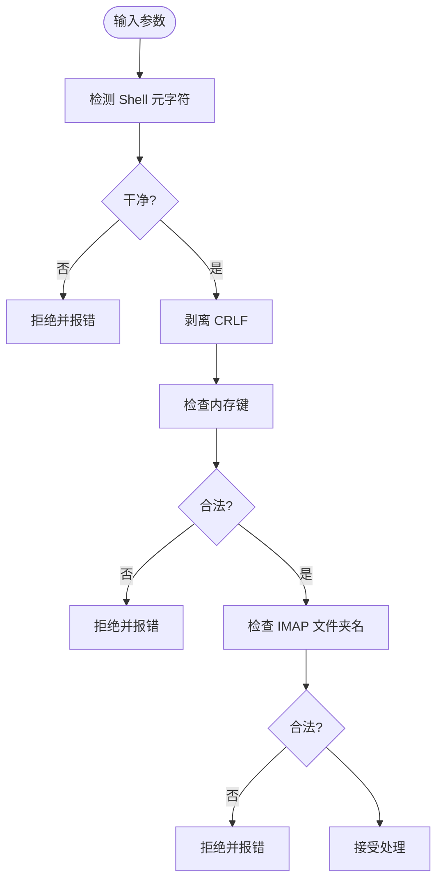
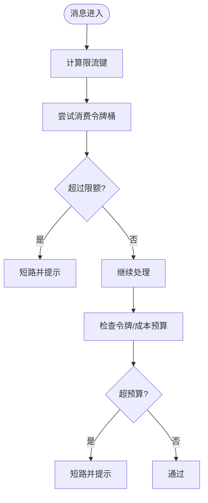
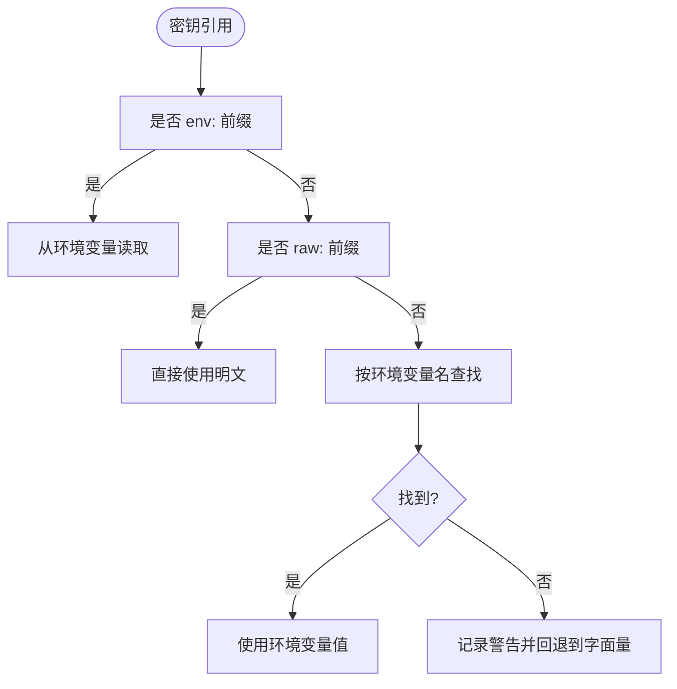
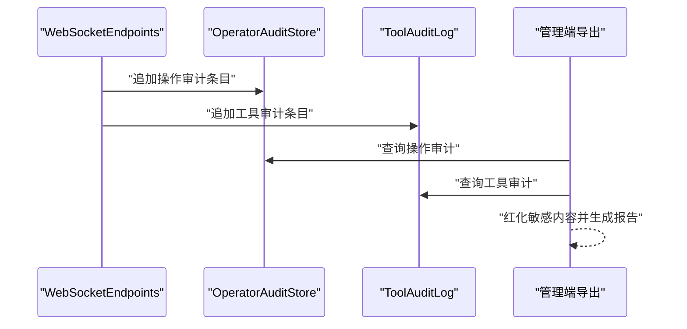
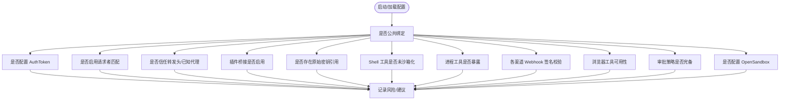
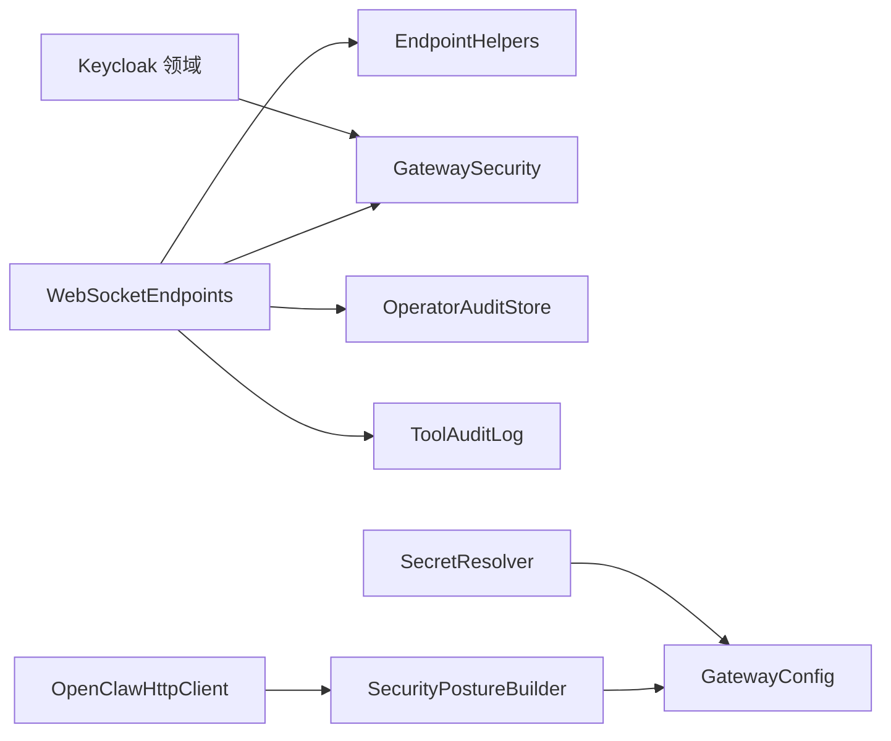

# 安全加固

<cite>
**本文引用的文件**
- [GatewaySecurity.cs](file://src/OpenClaw.Gateway/GatewaySecurity.cs)
- [WebSocketEndpoints.cs](file://src/OpenClaw.Gateway/Endpoints/WebSocketEndpoints.cs)
- [EndpointHelpers.cs](file://src/OpenClaw.Gateway/Endpoints/EndpointHelpers.cs)
- [SecurityPostureBuilder.cs](file://src/OpenClaw.Gateway/SecurityPostureBuilder.cs)
- [OperatorAuditStore.cs](file://src/OpenClaw.Gateway/OperatorAuditStore.cs)
- [ToolAuditLog.cs](file://src/OpenClaw.Core/Observability/ToolAuditLog.cs)
- [AdminEndpoints.Support.cs](file://src/OpenClaw.Gateway/Endpoints/AdminEndpoints.Support.cs)
- [OperatorAuditStore.cs](file://src/OpenClaw.Gateway/OperatorAuditStore.cs)
- [RateLimitMiddleware.cs](file://src/OpenClaw.Core/Middleware/RateLimitMiddleware.cs)
- [TokenBudgetMiddleware.cs](file://src/OpenClaw.Core/Middleware/TokenBudgetMiddleware.cs)
- [GatewayConfig.cs](file://src/OpenClaw.Core/Models/GatewayConfig.cs)
- [AllowlistManager.cs](file://src/OpenClaw.Core/Security/AllowlistManager.cs)
- [AllowlistPolicy.cs](file://src/OpenClaw.Core/Security/AllowlistPolicy.cs)
- [InputSanitizer.cs](file://src/OpenClaw.Core/Security/InputSanitizer.cs)
- [SecretResolver.cs](file://src/OpenClaw.Core/Security/SecretResolver.cs)
- [ai4cbrain-realm.json](file://Kingcrab.AppHost/Configs/ai4cbrain-realm.json)
- [PlanExecuteVerifyService.cs](file://src/OpenClaw.Gateway/PlanExecuteVerifyService.cs)
- [OpenClawHttpClient.cs](file://src/OpenClaw.Cli/OpenClawHttpClient.cs)
</cite>

## 目录
1. [简介](#简介)
2. [项目结构](#项目结构)
3. [核心组件](#核心组件)
4. [架构总览](#架构总览)
5. [详细组件分析](#详细组件分析)
6. [依赖关系分析](#依赖关系分析)
7. [性能考量](#性能考量)
8. [故障排查指南](#故障排查指南)
9. [结论](#结论)
10. [附录](#附录)

## 简介
本指南面向生产环境部署，系统性梳理网络安全配置、访问控制策略与数据保护措施，覆盖防火墙与端口管理、IP 白名单、认证授权、敏感数据加密与密钥管理、安全审计与合规导出、以及常见威胁防护与应急响应流程。文档以仓库中实际实现为依据，提供可落地的加固建议与操作路径。

## 项目结构
围绕安全加固的关键模块分布于以下子系统：
- 网关与通道：WebSocket 终端、HTTP 辅助、安全策略构建
- 安全工具集：令牌校验、签名验证、输入净化、白名单策略
- 中间件：速率限制、令牌预算
- 审计与可观测：操作审计、工具调用审计
- 配置模型：安全配置项
- 认证与密钥：Keycloak 领域配置、密钥解析

**图表来源**
- [WebSocketEndpoints.cs:68-106](file://src/OpenClaw.Gateway/Endpoints/WebSocketEndpoints.cs#L68-L106)
- [EndpointHelpers.cs:145-173](file://src/OpenClaw.Gateway/Endpoints/EndpointHelpers.cs#L145-L173)
- [SecurityPostureBuilder.cs:11-169](file://src/OpenClaw.Gateway/SecurityPostureBuilder.cs#L11-L169)
- [GatewaySecurity.cs:13-37](file://src/OpenClaw.Gateway/GatewaySecurity.cs#L13-L37)
- [AllowlistManager.cs:19-126](file://src/OpenClaw.Core/Security/AllowlistManager.cs#L19-L126)
- [AllowlistPolicy.cs:9-42](file://src/OpenClaw.Core/Security/AllowlistPolicy.cs#L9-L42)
- [InputSanitizer.cs:9-84](file://src/OpenClaw.Core/Security/InputSanitizer.cs#L9-L84)
- [SecretResolver.cs:14-66](file://src/OpenClaw.Core/Security/SecretResolver.cs#L14-L66)
- [RateLimitMiddleware.cs:10-93](file://src/OpenClaw.Core/Middleware/RateLimitMiddleware.cs#L10-L93)
- [TokenBudgetMiddleware.cs:12-71](file://src/OpenClaw.Core/Middleware/TokenBudgetMiddleware.cs#L12-L71)
- [OperatorAuditStore.cs:10-195](file://src/OpenClaw.Gateway/OperatorAuditStore.cs#L10-L195)
- [ToolAuditLog.cs:39-125](file://src/OpenClaw.Core/Observability/ToolAuditLog.cs#L39-L125)
- [GatewayConfig.cs:331-352](file://src/OpenClaw.Core/Models/GatewayConfig.cs#L331-L352)
- [ai4cbrain-realm.json:1938-1994](file://Kingcrab.AppHost/Configs/ai4cbrain-realm.json#L1938-L1994)

**章节来源**
- [WebSocketEndpoints.cs:68-138](file://src/OpenClaw.Gateway/Endpoints/WebSocketEndpoints.cs#L68-L138)
- [SecurityPostureBuilder.cs:11-169](file://src/OpenClaw.Gateway/SecurityPostureBuilder.cs#L11-L169)
- [GatewayConfig.cs:331-352](file://src/OpenClaw.Core/Models/GatewayConfig.cs#L331-L352)

## 核心组件
- 认证与授权
  - Bearer 令牌提取与固定时间比较校验，支持查询字符串令牌开关
  - HMAC-SHA256 签名验证（含前缀处理与十六进制解码）
  - WebSocket 连接基于 Origin 白名单与令牌策略进行准入控制
  - 操作员审计与链式哈希保证不可篡改
- 访问控制与白名单
  - 动态白名单持久化与优先级覆盖静态配置
  - 支持严格/传统两种语义的允许列表匹配
- 数据保护
  - 输入净化：检测并阻断 Shell 元字符、剥离 CRLF、路径穿越与控制字符
  - 敏感数据脱敏：审计导出时对敏感字段进行红化
- 速率与预算
  - 会话级速率限制与空闲清理
  - 令牌总量与成本预算双重约束
- 密钥管理
  - 统一密钥解析：env:、raw: 前缀与回退策略
- 安全审计
  - 操作审计（JSON Lines）与工具审计（JSON Lines），支持最近快照与查询
- 配置与策略
  - 安全配置项：公共绑定、跨代理信任、请求者匹配等
  - 安全态势评估：自动识别风险并给出加固建议

**章节来源**
- [GatewaySecurity.cs:13-109](file://src/OpenClaw.Gateway/GatewaySecurity.cs#L13-L109)
- [WebSocketEndpoints.cs:68-138](file://src/OpenClaw.Gateway/Endpoints/WebSocketEndpoints.cs#L68-L138)
- [OperatorAuditStore.cs:33-195](file://src/OpenClaw.Gateway/OperatorAuditStore.cs#L33-L195)
- [AllowlistManager.cs:19-126](file://src/OpenClaw.Core/Security/AllowlistManager.cs#L19-L126)
- [AllowlistPolicy.cs:9-42](file://src/OpenClaw.Core/Security/AllowlistPolicy.cs#L9-L42)
- [InputSanitizer.cs:9-84](file://src/OpenClaw.Core/Security/InputSanitizer.cs#L9-L84)
- [SecretResolver.cs:14-66](file://src/OpenClaw.Core/Security/SecretResolver.cs#L14-L66)
- [RateLimitMiddleware.cs:10-93](file://src/OpenClaw.Core/Middleware/RateLimitMiddleware.cs#L10-L93)
- [TokenBudgetMiddleware.cs:12-71](file://src/OpenClaw.Core/Middleware/TokenBudgetMiddleware.cs#L12-L71)
- [ToolAuditLog.cs:39-125](file://src/OpenClaw.Core/Observability/ToolAuditLog.cs#L39-L125)
- [GatewayConfig.cs:331-352](file://src/OpenClaw.Core/Models/GatewayConfig.cs#L331-L352)

## 架构总览
下图展示从客户端到网关、再到安全组件与审计系统的整体交互，突出认证、白名单、速率限制与审计落盘的关键节点。

**图表来源**
- [WebSocketEndpoints.cs:68-138](file://src/OpenClaw.Gateway/Endpoints/WebSocketEndpoints.cs#L68-L138)
- [EndpointHelpers.cs:145-173](file://src/OpenClaw.Gateway/Endpoints/EndpointHelpers.cs#L145-L173)
- [GatewaySecurity.cs:13-37](file://src/OpenClaw.Gateway/GatewaySecurity.cs#L13-L37)
- [OperatorAuditStore.cs:33-93](file://src/OpenClaw.Gateway/OperatorAuditStore.cs#L33-L93)
- [ToolAuditLog.cs:72-95](file://src/OpenClaw.Core/Observability/ToolAuditLog.cs#L72-L95)

## 详细组件分析

### 认证与授权
- 令牌提取与校验
  - 支持 Authorization 头与可选查询字符串 token
  - 使用固定时间比较避免时序攻击
- 签名验证
  - 支持 sha256= 前缀与十六进制解码
  - HMAC-SHA256 对比期望与提供的签名
- WebSocket 准入
  - Origin 白名单校验
  - 非本地绑定时要求有效令牌或账户令牌
- 操作审计
  - JSON Lines 写入，链式哈希确保完整性

**图表来源**
- [WebSocketEndpoints.cs:68-138](file://src/OpenClaw.Gateway/Endpoints/WebSocketEndpoints.cs#L68-L138)
- [GatewaySecurity.cs:13-37](file://src/OpenClaw.Gateway/GatewaySecurity.cs#L13-L37)

**章节来源**
- [GatewaySecurity.cs:13-109](file://src/OpenClaw.Gateway/GatewaySecurity.cs#L13-L109)
- [WebSocketEndpoints.cs:68-138](file://src/OpenClaw.Gateway/Endpoints/WebSocketEndpoints.cs#L68-L138)
- [EndpointHelpers.cs:145-173](file://src/OpenClaw.Gateway/Endpoints/EndpointHelpers.cs#L145-L173)

### 访问控制与白名单
- 动态白名单
  - 按通道写入磁盘文件，动态覆盖静态配置
  - 路径安全化处理，防止目录穿越
- 白名单策略
  - 严格模式：空列表拒绝所有；通配符允许全部；支持通配符匹配
  - 传统模式：空列表默认允许（历史兼容）

**图表来源**
- [AllowlistManager.cs:19-126](file://src/OpenClaw.Core/Security/AllowlistManager.cs#L19-L126)
- [AllowlistPolicy.cs:9-42](file://src/OpenClaw.Core/Security/AllowlistPolicy.cs#L9-L42)

**章节来源**
- [AllowlistManager.cs:19-126](file://src/OpenClaw.Core/Security/AllowlistManager.cs#L19-L126)
- [AllowlistPolicy.cs:9-42](file://src/OpenClaw.Core/Security/AllowlistPolicy.cs#L9-L42)

### 数据保护与输入净化
- Shell 元字符检测与阻断
- IMAP/SMTP 协议输入剥离 CRLF
- 内存键禁止路径穿越与空字节
- 文件夹名禁止控制字符

**图表来源**
- [InputSanitizer.cs:24-82](file://src/OpenClaw.Core/Security/InputSanitizer.cs#L24-L82)

**章节来源**
- [InputSanitizer.cs:9-84](file://src/OpenClaw.Core/Security/InputSanitizer.cs#L9-L84)

### 速率限制与预算
- 会话级速率限制
  - 基于时间窗口的消息队列与空闲清理
- 令牌与成本预算
  - 会话内输入输出令牌累计阈值
  - 可插拔成本检查回调（USD）

**图表来源**
- [RateLimitMiddleware.cs:39-68](file://src/OpenClaw.Core/Middleware/RateLimitMiddleware.cs#L39-L68)
- [TokenBudgetMiddleware.cs:36-69](file://src/OpenClaw.Core/Middleware/TokenBudgetMiddleware.cs#L36-L69)
- [EndpointHelpers.cs:145-173](file://src/OpenClaw.Gateway/Endpoints/EndpointHelpers.cs#L145-L173)

**章节来源**
- [RateLimitMiddleware.cs:10-93](file://src/OpenClaw.Core/Middleware/RateLimitMiddleware.cs#L10-L93)
- [TokenBudgetMiddleware.cs:12-71](file://src/OpenClaw.Core/Middleware/TokenBudgetMiddleware.cs#L12-L71)
- [EndpointHelpers.cs:145-173](file://src/OpenClaw.Gateway/Endpoints/EndpointHelpers.cs#L145-L173)

### 密钥管理与安全配置
- 密钥解析
  - env: 强制从环境变量读取
  - raw: 明文前缀（不推荐）
  - 默认：先查环境变量，再回退到字面量
- 安全配置
  - 公共绑定严格模式、允许查询字符串令牌、允许的 Origin、跨代理信任、已知代理、请求者匹配等
- Keycloak 领域
  - 提供 RSA/AES/HMAC/RSA-ENC 等密钥生成器配置

**图表来源**
- [SecretResolver.cs:24-54](file://src/OpenClaw.Core/Security/SecretResolver.cs#L24-L54)
- [GatewayConfig.cs:331-352](file://src/OpenClaw.Core/Models/GatewayConfig.cs#L331-L352)
- [ai4cbrain-realm.json:1938-1994](file://Kingcrab.AppHost/Configs/ai4cbrain-realm.json#L1938-L1994)

**章节来源**
- [SecretResolver.cs:14-66](file://src/OpenClaw.Core/Security/SecretResolver.cs#L14-L66)
- [GatewayConfig.cs:331-352](file://src/OpenClaw.Core/Models/GatewayConfig.cs#L331-L352)
- [ai4cbrain-realm.json:1938-1994](file://Kingcrab.AppHost/Configs/ai4cbrain-realm.json#L1938-L1994)

### 安全审计与合规导出
- 操作审计
  - JSON Lines 文件，链式哈希保证顺序与完整性
  - 支持查询与最近条目快照
- 工具审计
  - 记录执行耗时、是否失败、治理结果等，避免记录原始载荷
- 导出与红化
  - 管理端支持导出审计清单，敏感文本与键值进行红化处理

**图表来源**
- [OperatorAuditStore.cs:33-195](file://src/OpenClaw.Gateway/OperatorAuditStore.cs#L33-L195)
- [ToolAuditLog.cs:72-125](file://src/OpenClaw.Core/Observability/ToolAuditLog.cs#L72-L125)
- [AdminEndpoints.Support.cs:1661-1693](file://src/OpenClaw.Gateway/Endpoints/AdminEndpoints.Support.cs#L1661-L1693)

**章节来源**
- [OperatorAuditStore.cs:10-195](file://src/OpenClaw.Gateway/OperatorAuditStore.cs#L10-L195)
- [ToolAuditLog.cs:39-125](file://src/OpenClaw.Core/Observability/ToolAuditLog.cs#L39-L125)
- [AdminEndpoints.Support.cs:1661-1693](file://src/OpenClaw.Gateway/Endpoints/AdminEndpoints.Support.cs#L1661-L1693)

### 安全态势评估与加固建议
- 自动评估公共绑定、令牌、浏览器会话 Cookie、插件桥接、原始密钥引用、工具执行安全性、Webhook 签名校验、沙箱配置等
- 生成风险标志与加固建议清单

**图表来源**
- [SecurityPostureBuilder.cs:11-169](file://src/OpenClaw.Gateway/SecurityPostureBuilder.cs#L11-L169)

**章节来源**
- [SecurityPostureBuilder.cs:11-169](file://src/OpenClaw.Gateway/SecurityPostureBuilder.cs#L11-L169)

## 依赖关系分析
- 组件耦合
  - WebSocket 终端依赖 EndpointHelpers 的限流键与远端 IP 获取
  - 网关安全工具被多处入口复用（令牌、签名）
  - 审计组件独立于业务逻辑，仅通过接口写入
- 外部集成
  - Keycloak 领域配置提供密钥生成能力
  - CLI 通过 HTTP 客户端获取安全态势

**图表来源**
- [WebSocketEndpoints.cs:68-138](file://src/OpenClaw.Gateway/Endpoints/WebSocketEndpoints.cs#L68-L138)
- [EndpointHelpers.cs:145-173](file://src/OpenClaw.Gateway/Endpoints/EndpointHelpers.cs#L145-L173)
- [GatewaySecurity.cs:13-109](file://src/OpenClaw.Gateway/GatewaySecurity.cs#L13-L109)
- [OperatorAuditStore.cs:33-93](file://src/OpenClaw.Gateway/OperatorAuditStore.cs#L33-L93)
- [ToolAuditLog.cs:72-95](file://src/OpenClaw.Core/Observability/ToolAuditLog.cs#L72-L95)
- [SecurityPostureBuilder.cs:11-169](file://src/OpenClaw.Gateway/SecurityPostureBuilder.cs#L11-L169)
- [GatewayConfig.cs:331-352](file://src/OpenClaw.Core/Models/GatewayConfig.cs#L331-L352)
- [SecretResolver.cs:14-66](file://src/OpenClaw.Core/Security/SecretResolver.cs#L14-L66)
- [ai4cbrain-realm.json:1938-1994](file://Kingcrab.AppHost/Configs/ai4cbrain-realm.json#L1938-L1994)
- [OpenClawHttpClient.cs:53-55](file://src/OpenClaw.Cli/OpenClawHttpClient.cs#L53-L55)

**章节来源**
- [OpenClawHttpClient.cs:53-55](file://src/OpenClaw.Cli/OpenClawHttpClient.cs#L53-L55)
- [PlanExecuteVerifyService.cs:910-920](file://src/OpenClaw.Gateway/PlanExecuteVerifyService.cs#L910-L920)

## 性能考量
- 固定时间比较与哈希计算采用常量时间与一次性分配，降低时序泄漏与 GC 压力
- 速率限制使用队列与周期清理，避免无限增长
- 审计写入采用追加与缓冲，减少频繁 IO
- 建议
  - 合理设置速率限制与清理频率
  - 将审计日志存储置于高性能磁盘
  - 在高并发场景下启用查询索引与分片导出

[本节为通用指导，无需特定文件引用]

## 故障排查指南
- WebSocket 连接被拒
  - 检查 Origin 是否在白名单
  - 确认非本地绑定时令牌有效
  - 查看限流状态与错误信息
- 审计缺失或异常
  - 检查审计文件路径权限与磁盘空间
  - 关注写入失败指标与日志警告
- 密钥解析问题
  - 确认密钥引用格式（env:/raw:）
  - 检查环境变量是否正确注入
- 安全态势告警
  - 根据风险标志逐项核查配置
  - 优先解决公共绑定与原始密钥引用问题

**章节来源**
- [WebSocketEndpoints.cs:68-138](file://src/OpenClaw.Gateway/Endpoints/WebSocketEndpoints.cs#L68-L138)
- [OperatorAuditStore.cs:88-93](file://src/OpenClaw.Gateway/OperatorAuditStore.cs#L88-L93)
- [ToolAuditLog.cs:86-95](file://src/OpenClaw.Core/Observability/ToolAuditLog.cs#L86-L95)
- [SecretResolver.cs:24-54](file://src/OpenClaw.Core/Security/SecretResolver.cs#L24-L54)
- [SecurityPostureBuilder.cs:27-55](file://src/OpenClaw.Gateway/SecurityPostureBuilder.cs#L27-L55)

## 结论
本指南基于仓库现有实现，提供了从网络边界、访问控制、数据保护到审计与应急响应的完整加固路径。建议在生产部署中：
- 强制使用 Bearer 令牌与签名验证
- 启用严格的白名单与输入净化
- 实施速率限制与预算控制
- 使用 env: 前缀管理密钥，避免明文
- 开启并定期审查操作与工具审计
- 依据安全态势评估持续优化配置

[本节为总结性内容，无需特定文件引用]

## 附录
- 常见加固要点速查
  - 防火墙与端口：仅开放必要端口，使用反向代理与 WAF
  - IP 白名单：Origin 与允许来源严格控制
  - 认证授权：强制 Bearer 令牌与签名，启用 CSRF 与会话安全
  - 数据保护：输入净化、输出红化、最小化日志
  - 审计与合规：链式哈希、合规导出、保留策略
  - 应急响应：快速降级、隔离通道、事件溯源与回滚预案

[本节为概念性内容，无需特定文件引用]