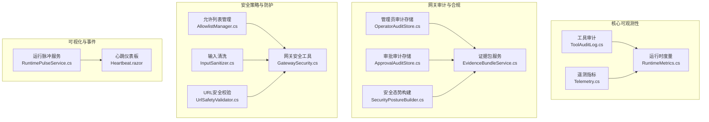
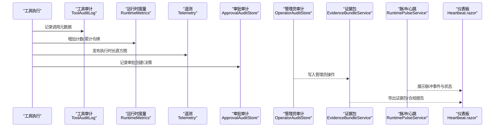
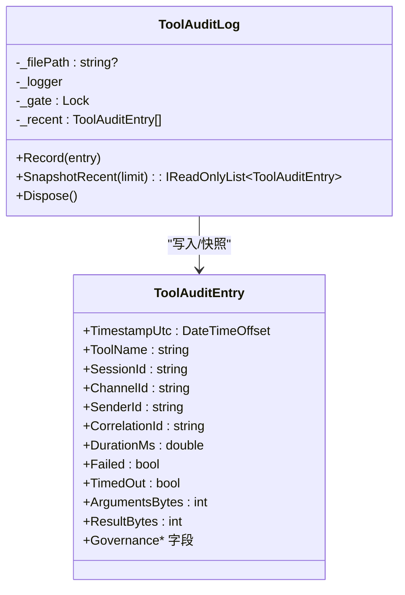
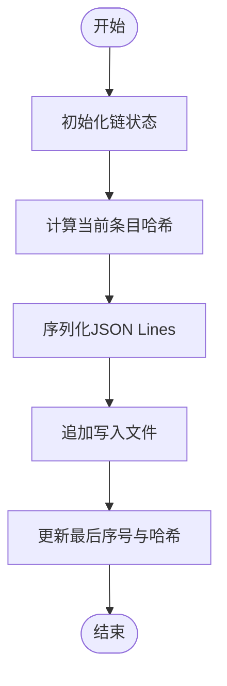
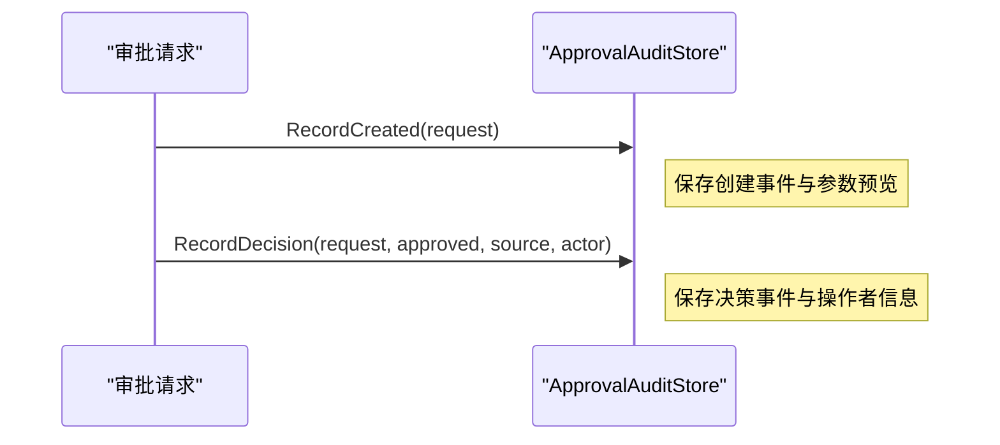
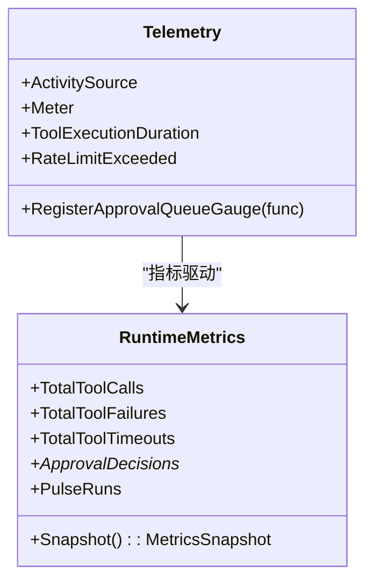
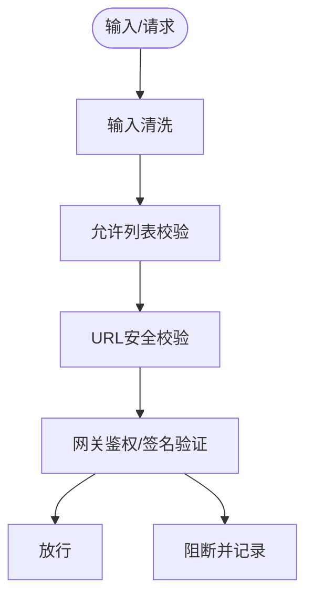
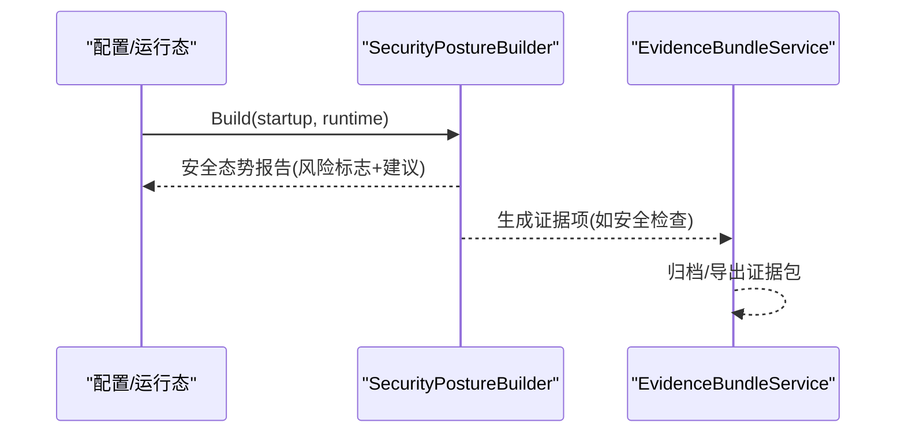
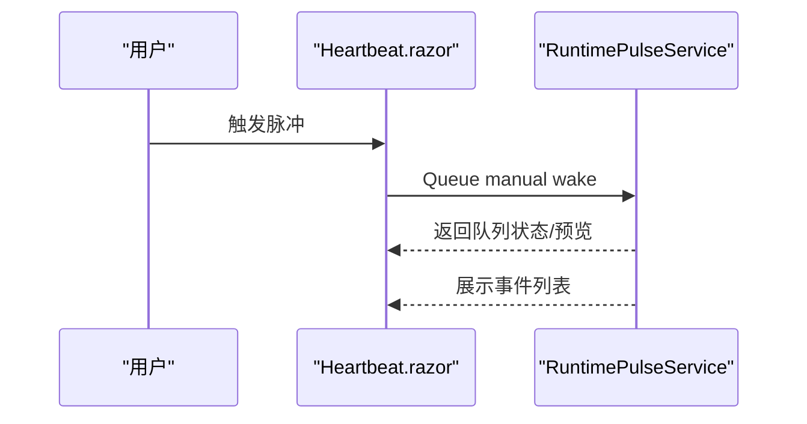
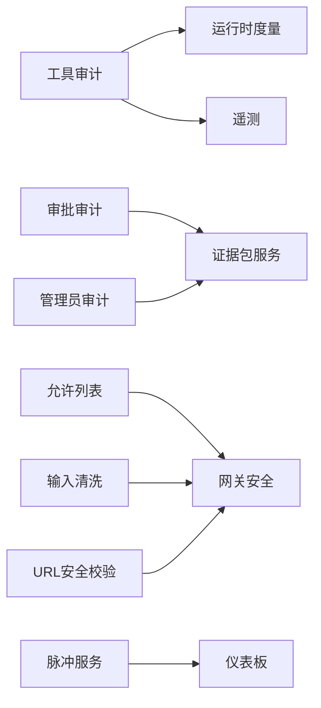

# 安全监控审计

<cite>
**本文引用的文件**
- [ToolAuditLog.cs](file://src/OpenClaw.Core/Observability/ToolAuditLog.cs)
- [Telemetry.cs](file://src/OpenClaw.Core/Observability/Telemetry.cs)
- [RuntimeMetrics.cs](file://src/OpenClaw.Core/Observability/RuntimeMetrics.cs)
- [OperatorAuditStore.cs](file://src/OpenClaw.Gateway/OperatorAuditStore.cs)
- [ApprovalAuditStore.cs](file://src/OpenClaw.Gateway/ApprovalAuditStore.cs)
- [AllowlistManager.cs](file://src/OpenClaw.Core/Security/AllowlistManager.cs)
- [InputSanitizer.cs](file://src/OpenClaw.Core/Security/InputSanitizer.cs)
- [UrlSafetyValidator.cs](file://src/OpenClaw.Core/Security/UrlSafetyValidator.cs)
- [SecurityPostureBuilder.cs](file://src/OpenClaw.Gateway/SecurityPostureBuilder.cs)
- [EvidenceBundleService.cs](file://src/OpenClaw.Gateway/EvidenceBundleService.cs)
- [GatewaySecurity.cs](file://src/OpenClaw.Gateway/GatewaySecurity.cs)
- [RuntimePulseService.cs](file://src/OpenClaw.Gateway/RuntimePulseService.cs)
- [Heartbeat.razor](file://src/OpenClaw.Dashboard/Pages/Heartbeat.razor)
- [OperatorGovernanceModels.cs](file://src/OpenClaw.Core/Models/OperatorGovernanceModels.cs)
</cite>

## 目录
1. [简介](#简介)
2. [项目结构](#项目结构)
3. [核心组件](#核心组件)
4. [架构总览](#架构总览)
5. [详细组件分析](#详细组件分析)
6. [依赖关系分析](#依赖关系分析)
7. [性能考量](#性能考量)
8. [故障排查指南](#故障排查指南)
9. [结论](#结论)
10. [附录](#附录)

## 简介
本指南面向安全与运维团队，系统化阐述本项目的安全监控审计实施方案，覆盖工具使用审计、操作日志记录、异常行为检测、遥测数据采集、安全事件监控与实时告警、合规性报告、安全基线检查与风险评估、安全监控仪表板、日志分析与取证调查等关键能力。文档以代码为依据，结合可视化图示，帮助读者快速理解并落地实施。

## 项目结构
围绕安全监控审计的关键模块主要分布在以下位置：
- 核心可观测性：工具审计、遥测指标、运行时度量
- 网关审计与合规：管理员审计、审批审计、安全态势构建
- 安全策略与防护：白名单管理、输入清洗、URL安全校验
- 可视化与事件：心跳/脉冲服务、仪表板页面、证据包管理

图表来源
- [ToolAuditLog.cs:1-125](file://src/OpenClaw.Core/Observability/ToolAuditLog.cs#L1-L125)
- [Telemetry.cs:1-54](file://src/OpenClaw.Core/Observability/Telemetry.cs#L1-L54)
- [RuntimeMetrics.cs:1-312](file://src/OpenClaw.Core/Observability/RuntimeMetrics.cs#L1-L312)
- [OperatorAuditStore.cs:1-195](file://src/OpenClaw.Gateway/OperatorAuditStore.cs#L1-L195)
- [ApprovalAuditStore.cs:1-126](file://src/OpenClaw.Gateway/ApprovalAuditStore.cs#L1-L126)
- [SecurityPostureBuilder.cs:1-169](file://src/OpenClaw.Gateway/SecurityPostureBuilder.cs#L1-L169)
- [EvidenceBundleService.cs:1-200](file://src/OpenClaw.Gateway/EvidenceBundleService.cs#L1-L200)
- [AllowlistManager.cs:1-126](file://src/OpenClaw.Core/Security/AllowlistManager.cs#L1-L126)
- [InputSanitizer.cs:1-84](file://src/OpenClaw.Core/Security/InputSanitizer.cs#L1-L84)
- [UrlSafetyValidator.cs:1-219](file://src/OpenClaw.Core/Security/UrlSafetyValidator.cs#L1-L219)
- [GatewaySecurity.cs:1-109](file://src/OpenClaw.Gateway/GatewaySecurity.cs#L1-L109)
- [RuntimePulseService.cs:96-120](file://src/OpenClaw.Gateway/RuntimePulseService.cs#L96-L120)
- [Heartbeat.razor:108-579](file://src/OpenClaw.Dashboard/Pages/Heartbeat.razor#L108-L579)

章节来源
- [ToolAuditLog.cs:1-125](file://src/OpenClaw.Core/Observability/ToolAuditLog.cs#L1-L125)
- [Telemetry.cs:1-54](file://src/OpenClaw.Core/Observability/Telemetry.cs#L1-L54)
- [RuntimeMetrics.cs:1-312](file://src/OpenClaw.Core/Observability/RuntimeMetrics.cs#L1-L312)
- [OperatorAuditStore.cs:1-195](file://src/OpenClaw.Gateway/OperatorAuditStore.cs#L1-L195)
- [ApprovalAuditStore.cs:1-126](file://src/OpenClaw.Gateway/ApprovalAuditStore.cs#L1-L126)
- [SecurityPostureBuilder.cs:1-169](file://src/OpenClaw.Gateway/SecurityPostureBuilder.cs#L1-L169)
- [EvidenceBundleService.cs:1-200](file://src/OpenClaw.Gateway/EvidenceBundleService.cs#L1-L200)
- [AllowlistManager.cs:1-126](file://src/OpenClaw.Core/Security/AllowlistManager.cs#L1-L126)
- [InputSanitizer.cs:1-84](file://src/OpenClaw.Core/Security/InputSanitizer.cs#L1-L84)
- [UrlSafetyValidator.cs:1-219](file://src/OpenClaw.Core/Security/UrlSafetyValidator.cs#L1-L219)
- [GatewaySecurity.cs:1-109](file://src/OpenClaw.Gateway/GatewaySecurity.cs#L1-L109)
- [RuntimePulseService.cs:96-120](file://src/OpenClaw.Gateway/RuntimePulseService.cs#L96-L120)
- [Heartbeat.razor:108-579](file://src/OpenClaw.Dashboard/Pages/Heartbeat.razor#L108-L579)

## 核心组件
- 工具使用审计：以JSON Lines格式记录工具调用的元数据，避免泄露敏感参数与结果，支持最近快照查询。
- 操作日志记录：管理员操作链式哈希审计，确保完整性与可追溯性，支持基于时间与角色的查询。
- 审批审计：记录审批请求创建与决策过程，保留参数预览，便于合规审查。
- 遥测与指标：集中式OpenTelemetry实例，提供分布式追踪与指标（执行时长、限流计数、待审批队列深度等）。
- 运行时度量：轻量级原子计数器/观测量表，暴露健康端点用于监控与告警。
- 安全策略：允许列表动态持久化、输入清洗、URL安全校验；网关侧鉴权与签名验证工具。
- 安全态势：自动构建部署安全态势，识别风险并给出建议。
- 证据包：统一证据收集、归档与导出，支撑合规与取证。
- 心跳/脉冲：周期性运行检查与事件记录，仪表板可视化展示。

章节来源
- [ToolAuditLog.cs:1-125](file://src/OpenClaw.Core/Observability/ToolAuditLog.cs#L1-L125)
- [OperatorAuditStore.cs:1-195](file://src/OpenClaw.Gateway/OperatorAuditStore.cs#L1-L195)
- [ApprovalAuditStore.cs:1-126](file://src/OpenClaw.Gateway/ApprovalAuditStore.cs#L1-L126)
- [Telemetry.cs:1-54](file://src/OpenClaw.Core/Observability/Telemetry.cs#L1-L54)
- [RuntimeMetrics.cs:1-312](file://src/OpenClaw.Core/Observability/RuntimeMetrics.cs#L1-L312)
- [AllowlistManager.cs:1-126](file://src/OpenClaw.Core/Security/AllowlistManager.cs#L1-L126)
- [InputSanitizer.cs:1-84](file://src/OpenClaw.Core/Security/InputSanitizer.cs#L1-L84)
- [UrlSafetyValidator.cs:1-219](file://src/OpenClaw.Core/Security/UrlSafetyValidator.cs#L1-L219)
- [GatewaySecurity.cs:1-109](file://src/OpenClaw.Gateway/GatewaySecurity.cs#L1-L109)
- [SecurityPostureBuilder.cs:1-169](file://src/OpenClaw.Gateway/SecurityPostureBuilder.cs#L1-L169)
- [EvidenceBundleService.cs:1-200](file://src/OpenClaw.Gateway/EvidenceBundleService.cs#L1-L200)
- [RuntimePulseService.cs:96-120](file://src/OpenClaw.Gateway/RuntimePulseService.cs#L96-L120)

## 架构总览
下图展示了从工具调用到审计、指标、安全策略与可视化监控的整体流程。

图表来源
- [ToolAuditLog.cs:72-95](file://src/OpenClaw.Core/Observability/ToolAuditLog.cs#L72-L95)
- [RuntimeMetrics.cs:129-178](file://src/OpenClaw.Core/Observability/RuntimeMetrics.cs#L129-L178)
- [Telemetry.cs:28-32](file://src/OpenClaw.Core/Observability/Telemetry.cs#L28-L32)
- [ApprovalAuditStore.cs:28-71](file://src/OpenClaw.Gateway/ApprovalAuditStore.cs#L28-L71)
- [OperatorAuditStore.cs:33-93](file://src/OpenClaw.Gateway/OperatorAuditStore.cs#L33-L93)
- [EvidenceBundleService.cs:24-49](file://src/OpenClaw.Gateway/EvidenceBundleService.cs#L24-L49)
- [RuntimePulseService.cs:109-120](file://src/OpenClaw.Gateway/RuntimePulseService.cs#L109-L120)
- [Heartbeat.razor:560-579](file://src/OpenClaw.Dashboard/Pages/Heartbeat.razor#L560-L579)

## 详细组件分析

### 工具使用审计（ToolAuditLog）
- 设计要点
  - 单条审计记录包含时间戳、工具名、会话/通道/发送者标识、关联ID、耗时、失败/超时标记、治理评估字段等。
  - 采用JSON Lines追加写入，线程安全，内置近期缓冲用于快照。
  - 默认不记录原始参数与结果，仅记录字节数，降低敏感信息泄露风险。
- 关键接口
  - 记录方法：接收审计条目并写入文件。
  - 快照方法：返回最近N条记录，用于仪表板或告警触发。
- 异常处理
  - 目录初始化失败或写入失败时记录警告，不影响主流程。

图表来源
- [ToolAuditLog.cs:10-125](file://src/OpenClaw.Core/Observability/ToolAuditLog.cs#L10-L125)

章节来源
- [ToolAuditLog.cs:1-125](file://src/OpenClaw.Core/Observability/ToolAuditLog.cs#L1-L125)

### 操作日志记录（OperatorAuditStore）
- 设计要点
  - 管理员操作以JSON Lines持久化，支持按Actor、动作类型、目标、时间范围查询。
  - 采用链式哈希校验保证不可篡改，首次写入时初始化链序号与前一项哈希。
- 关键接口
  - 追加方法：计算哈希、填充序列号与时间戳后写入。
  - 查询方法：读取最新N条，按条件过滤。
- 合规意义
  - 提供完整的“谁在何时对何目标做了什么”的审计轨迹，满足监管要求。

图表来源
- [OperatorAuditStore.cs:33-93](file://src/OpenClaw.Gateway/OperatorAuditStore.cs#L33-L93)
- [OperatorAuditStore.cs:162-193](file://src/OpenClaw.Gateway/OperatorAuditStore.cs#L162-L193)

章节来源
- [OperatorAuditStore.cs:1-195](file://src/OpenClaw.Gateway/OperatorAuditStore.cs#L1-L195)

### 审批审计（ApprovalAuditStore）
- 设计要点
  - 记录审批创建与决策事件，保留参数预览（限制长度），便于审查但避免泄露敏感内容。
  - 使用原子行追加，保证并发安全。
- 关键接口
  - 创建记录：记录创建事件与摘要。
  - 决策记录：记录批准/拒绝、来源与操作者身份。
  - 查询：按通道/发送者/工具名与时间范围筛选。

图表来源
- [ApprovalAuditStore.cs:28-71](file://src/OpenClaw.Gateway/ApprovalAuditStore.cs#L28-L71)

章节来源
- [ApprovalAuditStore.cs:1-126](file://src/OpenClaw.Gateway/ApprovalAuditStore.cs#L1-L126)

### 遥测与指标（Telemetry + RuntimeMetrics）
- Telemetry
  - 提供集中式ActivitySource与Meter，注册执行时长直方图、限流计数、待审批队列深度等指标。
- RuntimeMetrics
  - 轻量级原子计数器/观测量表，暴露健康端点，支持监控与告警。
- 实施建议
  - 将Meter绑定到OTLP导出器，结合Prometheus/Grafana进行可视化。
  - 在网关启动时注册队列深度观测量，持续反映审批积压。

图表来源
- [Telemetry.cs:9-54](file://src/OpenClaw.Core/Observability/Telemetry.cs#L9-L54)
- [RuntimeMetrics.cs:10-312](file://src/OpenClaw.Core/Observability/RuntimeMetrics.cs#L10-L312)

章节来源
- [Telemetry.cs:1-54](file://src/OpenClaw.Core/Observability/Telemetry.cs#L1-L54)
- [RuntimeMetrics.cs:1-312](file://src/OpenClaw.Core/Observability/RuntimeMetrics.cs#L1-L312)

### 安全策略与防护
- 允许列表管理（AllowlistManager）
  - 动态持久化每个通道的允许来源/去向，优先动态文件，其次静态配置。
- 输入清洗（InputSanitizer）
  - 检测并清洗危险字符，防止注入攻击；支持剥离CRLF、路径穿越检测等。
- URL安全校验（UrlSafetyValidator）
  - 支持内置黑名单、CIDR阻断、私有网络访问控制与DNS解析校验。
- 网关安全工具（GatewaySecurity）
  - Bearer Token提取与校验、HMAC SHA-256签名验证、环回地址判定。

图表来源
- [AllowlistManager.cs:32-51](file://src/OpenClaw.Core/Security/AllowlistManager.cs#L32-L51)
- [InputSanitizer.cs:24-67](file://src/OpenClaw.Core/Security/InputSanitizer.cs#L24-L67)
- [UrlSafetyValidator.cs:27-58](file://src/OpenClaw.Core/Security/UrlSafetyValidator.cs#L27-L58)
- [GatewaySecurity.cs:13-37](file://src/OpenClaw.Gateway/GatewaySecurity.cs#L13-L37)

章节来源
- [AllowlistManager.cs:1-126](file://src/OpenClaw.Core/Security/AllowlistManager.cs#L1-L126)
- [InputSanitizer.cs:1-84](file://src/OpenClaw.Core/Security/InputSanitizer.cs#L1-L84)
- [UrlSafetyValidator.cs:1-219](file://src/OpenClaw.Core/Security/UrlSafetyValidator.cs#L1-L219)
- [GatewaySecurity.cs:1-109](file://src/OpenClaw.Gateway/GatewaySecurity.cs#L1-L109)

### 安全态势与合规
- 安全态势构建（SecurityPostureBuilder）
  - 综合配置与运行态，生成风险标志与建议清单，覆盖公开绑定、鉴权令牌、浏览器会话Cookie、插件桥接、沙箱、Webhook签名等。
- 证据包服务（EvidenceBundleService）
  - 统一证据收集、归档与导出，支持从工具调用、运行时事件、审批历史等来源生成证据项，支撑合规与取证。

图表来源
- [SecurityPostureBuilder.cs:11-139](file://src/OpenClaw.Gateway/SecurityPostureBuilder.cs#L11-L139)
- [EvidenceBundleService.cs:226-247](file://src/OpenClaw.Gateway/EvidenceBundleService.cs#L226-L247)

章节来源
- [SecurityPostureBuilder.cs:1-169](file://src/OpenClaw.Gateway/SecurityPostureBuilder.cs#L1-L169)
- [EvidenceBundleService.cs:1-200](file://src/OpenClaw.Gateway/EvidenceBundleService.cs#L1-L200)

### 心跳/脉冲与仪表板
- 运行脉冲服务（RuntimePulseService）
  - 周期性执行检查，记录事件与跳过原因，支持手动唤醒。
- 仪表板页面（Heartbeat.razor）
  - 展示心跳配置、脉冲状态与事件列表，支持触发脉冲任务。

图表来源
- [RuntimePulseService.cs:96-120](file://src/OpenClaw.Gateway/RuntimePulseService.cs#L96-L120)
- [Heartbeat.razor:108-150](file://src/OpenClaw.Dashboard/Pages/Heartbeat.razor#L108-L150)

章节来源
- [RuntimePulseService.cs:96-120](file://src/OpenClaw.Gateway/RuntimePulseService.cs#L96-L120)
- [Heartbeat.razor:108-579](file://src/OpenClaw.Dashboard/Pages/Heartbeat.razor#L108-L579)

## 依赖关系分析
- 组件耦合
  - 工具审计与运行时度量紧密协作，共同构成基础监控层。
  - 审批与管理员审计作为合规层，依赖证据包服务进行统一归档。
  - 安全策略贯穿请求生命周期，前置拦截潜在风险。
- 外部集成
  - 遥测通过Meter与ActivitySource对接OTLP导出器。
  - 仪表板通过HTTP API与后台服务交互。

图表来源
- [ToolAuditLog.cs:72-95](file://src/OpenClaw.Core/Observability/ToolAuditLog.cs#L72-L95)
- [RuntimeMetrics.cs:129-178](file://src/OpenClaw.Core/Observability/RuntimeMetrics.cs#L129-L178)
- [Telemetry.cs:28-32](file://src/OpenClaw.Core/Observability/Telemetry.cs#L28-L32)
- [ApprovalAuditStore.cs:28-71](file://src/OpenClaw.Gateway/ApprovalAuditStore.cs#L28-L71)
- [OperatorAuditStore.cs:33-93](file://src/OpenClaw.Gateway/OperatorAuditStore.cs#L33-L93)
- [EvidenceBundleService.cs:24-49](file://src/OpenClaw.Gateway/EvidenceBundleService.cs#L24-L49)
- [AllowlistManager.cs:32-51](file://src/OpenClaw.Core/Security/AllowlistManager.cs#L32-L51)
- [InputSanitizer.cs:24-67](file://src/OpenClaw.Core/Security/InputSanitizer.cs#L24-L67)
- [UrlSafetyValidator.cs:27-58](file://src/OpenClaw.Core/Security/UrlSafetyValidator.cs#L27-L58)
- [GatewaySecurity.cs:13-37](file://src/OpenClaw.Gateway/GatewaySecurity.cs#L13-L37)
- [RuntimePulseService.cs:109-120](file://src/OpenClaw.Gateway/RuntimePulseService.cs#L109-L120)
- [Heartbeat.razor:560-579](file://src/OpenClaw.Dashboard/Pages/Heartbeat.razor#L560-L579)

## 性能考量
- 工具审计
  - JSON Lines追加写入，避免频繁打开/关闭文件；线程安全锁粒度小，近期缓冲减少内存占用。
- 运行时度量
  - 使用原子操作与易失读写，零分配快照，适合高吞吐场景。
- 遥测指标
  - 直方图与计数器低开销，建议合理设置采样率与标签维度。
- 日志与查询
  - 审计文件采用分页/限制返回数量，避免大范围扫描。

[本节为通用指导，无需特定文件来源]

## 故障排查指南
- 审计写入失败
  - 工具审计：目录创建失败或磁盘写入异常会记录警告，确认存储路径权限与空间。
  - 管理员审计：写入失败会增加失败计数，检查文件锁定与磁盘配额。
- 安全校验失败
  - URL安全校验：DNS解析失败或命中私有网络/CIDR阻断会拒绝请求，检查网络连通性与策略配置。
  - 签名校验：签名格式错误或HMAC不匹配导致拒绝，核对密钥与签名算法。
- 仪表板无数据
  - 确认脉冲服务已启用且未被禁用；检查心跳配置与事件拉取接口。
- 合规导出异常
  - 证据包归档/导出失败时查看日志，确认存储路径与权限。

章节来源
- [ToolAuditLog.cs:52-67](file://src/OpenClaw.Core/Observability/ToolAuditLog.cs#L52-L67)
- [OperatorAuditStore.cs:88-92](file://src/OpenClaw.Gateway/OperatorAuditStore.cs#L88-L92)
- [UrlSafetyValidator.cs:45-52](file://src/OpenClaw.Core/Security/UrlSafetyValidator.cs#L45-L52)
- [GatewaySecurity.cs:51-76](file://src/OpenClaw.Gateway/GatewaySecurity.cs#L51-L76)
- [RuntimePulseService.cs:114-118](file://src/OpenClaw.Gateway/RuntimePulseService.cs#L114-L118)
- [Heartbeat.razor:576-579](file://src/OpenClaw.Dashboard/Pages/Heartbeat.razor#L576-L579)

## 结论
本项目提供了从工具调用到合规审计、从安全策略到可视化监控的完整闭环。通过工具审计、管理员与审批审计、安全态势与证据包服务、遥测与运行时度量以及心跳/脉冲仪表板，能够有效支撑安全监控审计的实施需求。建议结合OTLP导出器与监控平台，建立完善的实时告警与合规报告体系。

[本节为总结，无需特定文件来源]

## 附录

### 实施步骤速查
- 开启工具审计与管理员审计
  - 配置审计文件路径与权限，确保JSON Lines写入成功。
- 部署安全策略
  - 设置允许列表、启用输入清洗与URL安全校验，配置网关鉴权与签名验证。
- 集成遥测与指标
  - 注册Meter与ActivitySource，导出至OTLP收集器，配置Grafana面板。
- 配置脉冲与仪表板
  - 启用脉冲服务，配置心跳任务，通过仪表板查看事件与状态。
- 合规与取证
  - 定期导出证据包，结合审批与管理员审计进行合规审查与取证调查。

[本节为通用指导，无需特定文件来源]