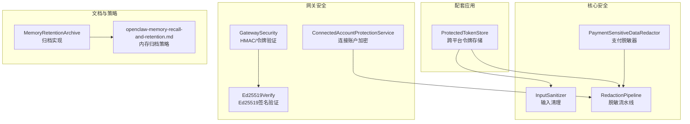
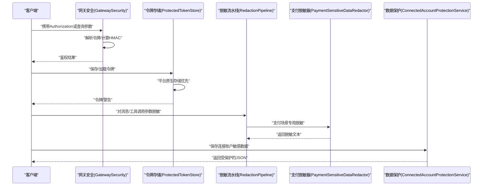
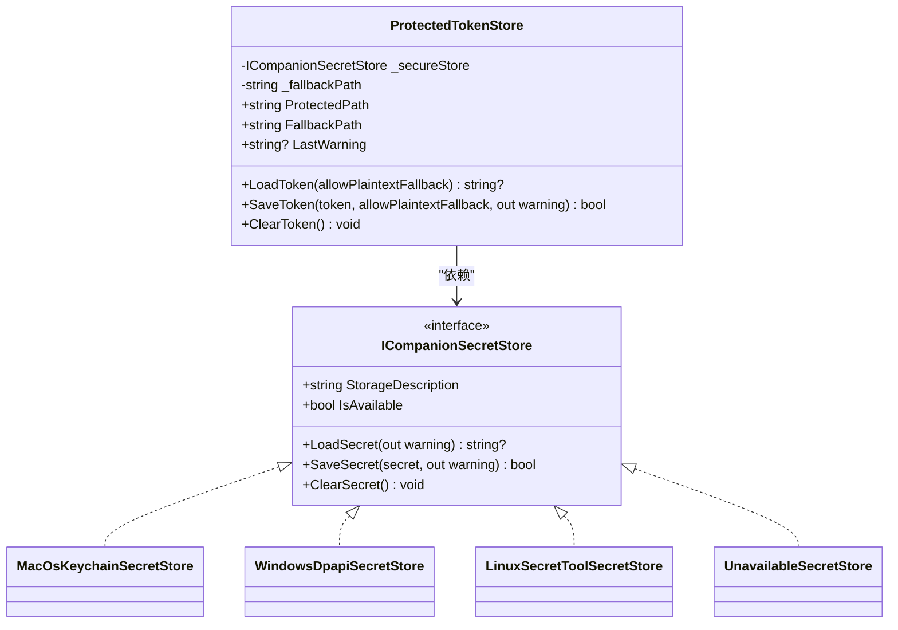
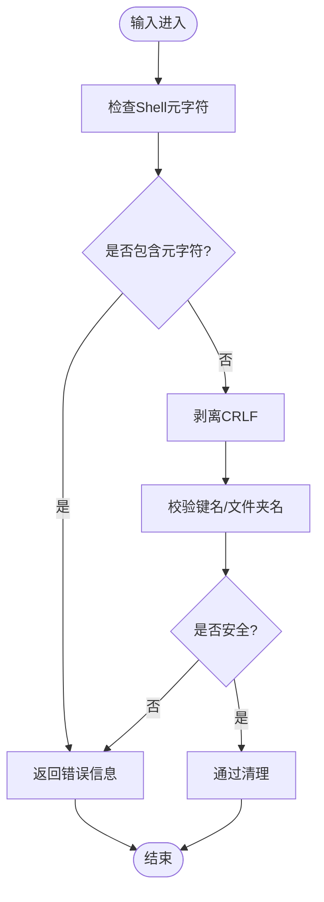
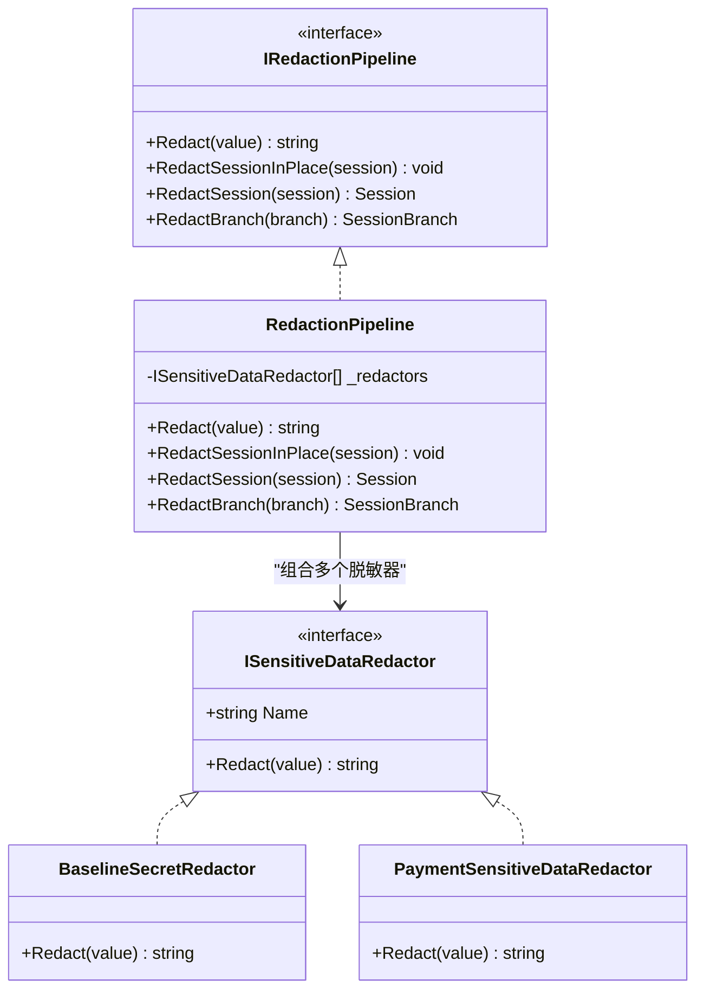
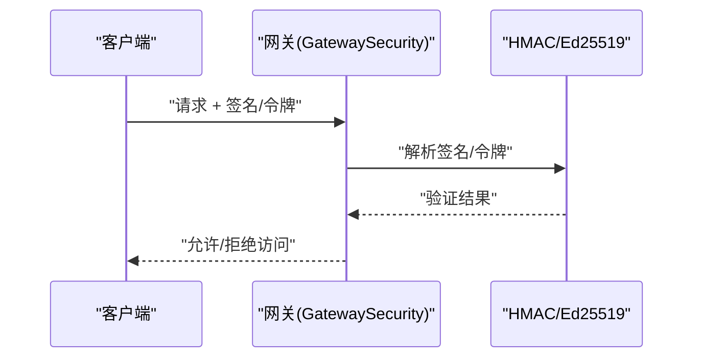
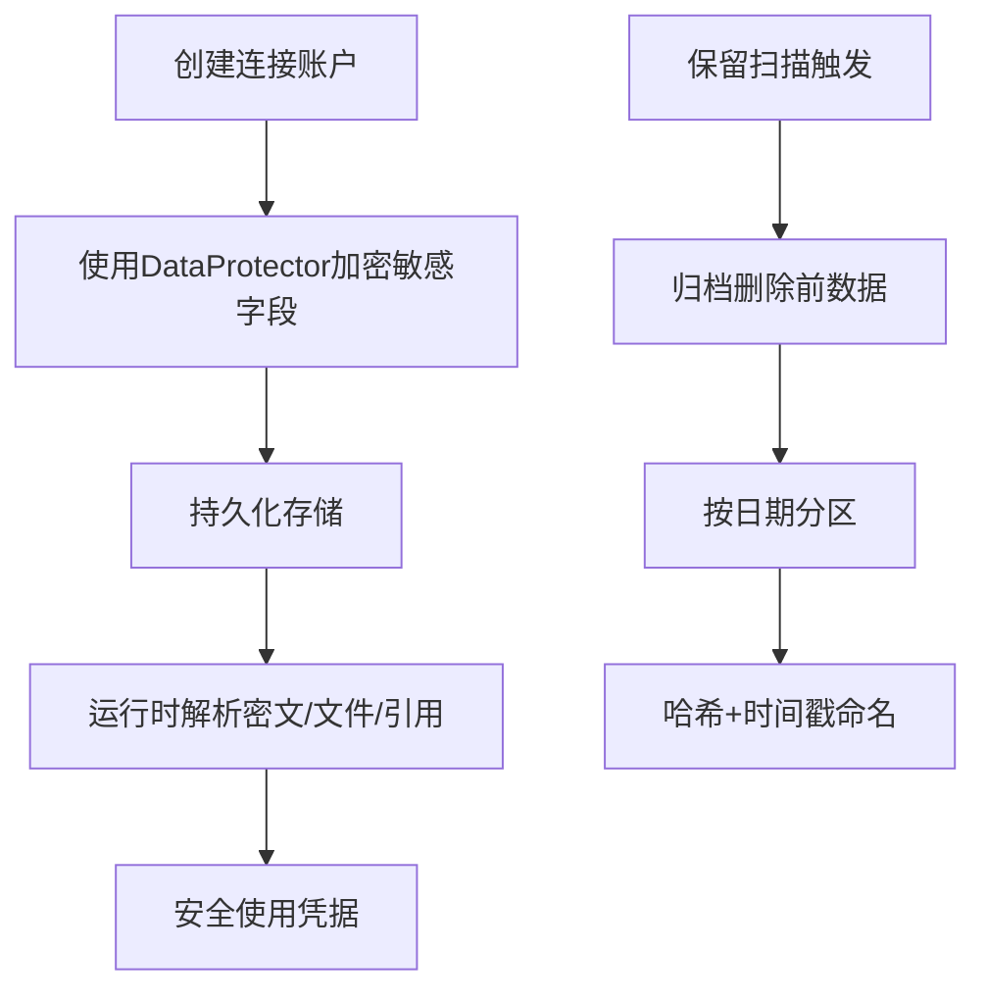
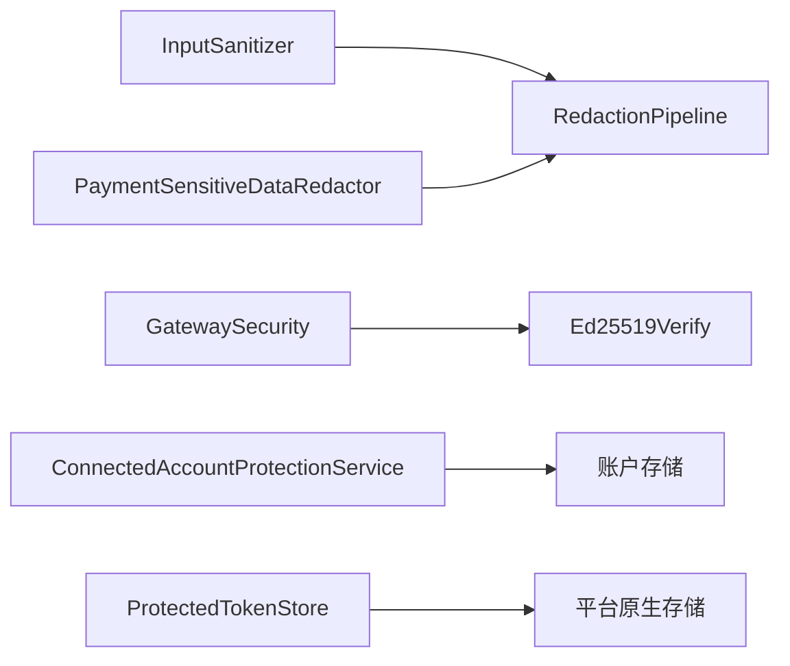

# 数据保护措施

<cite>
**本文档引用的文件**
- [ProtectedTokenStore.cs](file://src/OpenClaw.Companion/Services/ProtectedTokenStore.cs)
- [RedactionPipeline.cs](file://src/OpenClaw.Core/Security/RedactionPipeline.cs)
- [InputSanitizer.cs](file://src/OpenClaw.Core/Security/InputSanitizer.cs)
- [PaymentSensitiveDataRedactor.cs](file://src/OpenClaw.Payments.Core/PaymentSensitiveDataRedactor.cs)
- [GatewaySecurity.cs](file://src/OpenClaw.Gateway/GatewaySecurity.cs)
- [Ed25519Verify.cs](file://src/OpenClaw.Gateway/Ed25519Verify.cs)
- [AccountServices.cs](file://src/OpenClaw.Gateway/Backends/AccountServices.cs)
- [AdminObservabilityService.cs](file://src/OpenClaw.Gateway/AdminObservabilityService.cs)
- [MemoryRetentionArchive.cs](file://src/OpenClaw.Core/Memory/MemoryRetentionArchive.cs)
- [openclaw-memory-recall-and-retention.md](file://docs/openclaw-memory-recall-and-retention.md)
- [GatewaySecurityTests.cs](file://src/OpenClaw.Tests/GatewaySecurityTests.cs)
</cite>

## 目录
1. [简介](#简介)
2. [项目结构](#项目结构)
3. [核心组件](#核心组件)
4. [架构总览](#架构总览)
5. [详细组件分析](#详细组件分析)
6. [依赖关系分析](#依赖关系分析)
7. [性能考虑](#性能考虑)
8. [故障排除指南](#故障排除指南)
9. [结论](#结论)

## 简介
本指南面向Kingcrab项目的开发与运维团队，系统性阐述项目中的数据保护措施，覆盖以下关键领域：
- 敏感数据加密与密钥管理：基于平台原生安全服务的令牌存储、数据保护API与密钥轮换建议
- 安全存储机制：跨平台密钥链/DPAPI/秘密服务集成与降级回退策略
- 输入清理与数据脱敏：多层输入校验、正则表达式脱敏与会话级脱敏流水线
- 敏感信息替换策略：支付卡号识别、CVV/授权码/令牌等字段的识别与替换
- 数据传输加密与完整性验证：HMAC-SHA256签名验证、Ed25519数字签名验证
- 存储加密与备份保护：连接账户敏感数据的加密存储与内存归档策略
- 备份与合规：归档路径、命名规则与保留策略

本指南既提供代码级实现细节，也给出可操作的最佳实践与排障建议。

## 项目结构
围绕数据保护的关键模块分布于多个子项目中：
- OpenClaw.Companion：配套应用的令牌安全存储（跨平台）
- OpenClaw.Core：通用安全工具（输入清理、脱敏流水线、模型序列化上下文）
- OpenClaw.Gateway：网关安全（令牌解析、HMAC验证、Ed25519签名、连接账户保护）
- OpenClaw.Payments.Core：支付场景专用脱敏器
- 文档：内存保留与归档策略说明

**图表来源**
- [ProtectedTokenStore.cs:22-119](file://src/OpenClaw.Companion/Services/ProtectedTokenStore.cs#L22-L119)
- [InputSanitizer.cs:9-84](file://src/OpenClaw.Core/Security/InputSanitizer.cs#L9-L84)
- [RedactionPipeline.cs:21-94](file://src/OpenClaw.Core/Security/RedactionPipeline.cs#L21-L94)
- [PaymentSensitiveDataRedactor.cs:8-50](file://src/OpenClaw.Payments.Core/PaymentSensitiveDataRedactor.cs#L8-L50)
- [GatewaySecurity.cs:8-108](file://src/OpenClaw.Gateway/GatewaySecurity.cs#L8-L108)
- [Ed25519Verify.cs:11-40](file://src/OpenClaw.Gateway/Ed25519Verify.cs#L11-L40)
- [AccountServices.cs:9-21](file://src/OpenClaw.Gateway/Backends/AccountServices.cs#L9-L21)
- [MemoryRetentionArchive.cs:7-39](file://src/OpenClaw.Core/Memory/MemoryRetentionArchive.cs#L7-L39)
- [openclaw-memory-recall-and-retention.md:159-182](file://docs/openclaw-memory-recall-and-retention.md#L159-L182)

**章节来源**
- [ProtectedTokenStore.cs:22-119](file://src/OpenClaw.Companion/Services/ProtectedTokenStore.cs#L22-L119)
- [RedactionPipeline.cs:21-94](file://src/OpenClaw.Core/Security/RedactionPipeline.cs#L21-L94)
- [InputSanitizer.cs:9-84](file://src/OpenClaw.Core/Security/InputSanitizer.cs#L9-L84)
- [PaymentSensitiveDataRedactor.cs:8-50](file://src/OpenClaw.Payments.Core/PaymentSensitiveDataRedactor.cs#L8-L50)
- [GatewaySecurity.cs:8-108](file://src/OpenClaw.Gateway/GatewaySecurity.cs#L8-L108)
- [Ed25519Verify.cs:11-40](file://src/OpenClaw.Gateway/Ed25519Verify.cs#L11-L40)
- [AccountServices.cs:9-21](file://src/OpenClaw.Gateway/Backends/AccountServices.cs#L9-L21)
- [MemoryRetentionArchive.cs:7-39](file://src/OpenClaw.Core/Memory/MemoryRetentionArchive.cs#L7-L39)
- [openclaw-memory-recall-and-retention.md:159-182](file://docs/openclaw-memory-recall-and-retention.md#L159-L182)

## 核心组件
- 跨平台令牌存储（ProtectedTokenStore）
  - 优先使用平台原生安全存储：macOS Keychain、Windows DPAPI、Linux Secret Service
  - 不可用时支持降级到本地文件存储，并提供警告提示
  - 支持保存、加载、清空令牌，以及警告信息聚合
- 输入清理（InputSanitizer）
  - 检测并拒绝Shell元字符注入风险
  - 清理CRLF以防止协议注入
  - 校验内存键与IMAP文件夹名的安全性
- 脱敏流水线（RedactionPipeline）
  - 组合多个脱敏器对文本、会话历史、分支进行脱敏
  - 提供空实现（Noop）便于测试与禁用
- 支付脱敏器（PaymentSensitiveDataRedactor）
  - 识别并替换支付相关敏感字段：卡号、CVV、授权码、支付令牌等
  - 使用Luhn算法校验卡号有效性，避免误伤
- 网关安全（GatewaySecurity）
  - 解析Bearer令牌、常量时间比较令牌、计算与验证HMAC-SHA256
- Ed25519签名验证（Ed25519Verify）
  - 使用BouncyCastle进行跨平台一致的Ed25519签名验证
- 连接账户保护（ConnectedAccountProtectionService）
  - 使用ASP.NET Core DataProtection对账户敏感数据进行加解密
- 内存归档（MemoryRetentionArchive）
  - 按日分区归档删除前的数据，包含元数据与哈希命名

**章节来源**
- [ProtectedTokenStore.cs:22-119](file://src/OpenClaw.Companion/Services/ProtectedTokenStore.cs#L22-L119)
- [InputSanitizer.cs:24-82](file://src/OpenClaw.Core/Security/InputSanitizer.cs#L24-L82)
- [RedactionPipeline.cs:21-94](file://src/OpenClaw.Core/Security/RedactionPipeline.cs#L21-L94)
- [PaymentSensitiveDataRedactor.cs:8-50](file://src/OpenClaw.Payments.Core/PaymentSensitiveDataRedactor.cs#L8-L50)
- [GatewaySecurity.cs:13-49](file://src/OpenClaw.Gateway/GatewaySecurity.cs#L13-L49)
- [Ed25519Verify.cs:17-34](file://src/OpenClaw.Gateway/Ed25519Verify.cs#L17-L34)
- [AccountServices.cs:9-21](file://src/OpenClaw.Gateway/Backends/AccountServices.cs#L9-L21)
- [MemoryRetentionArchive.cs:9-39](file://src/OpenClaw.Core/Memory/MemoryRetentionArchive.cs#L9-L39)

## 架构总览
下图展示从用户输入到数据存储与传输验证的整体流程，突出数据保护关键节点。

**图表来源**
- [GatewaySecurity.cs:13-79](file://src/OpenClaw.Gateway/GatewaySecurity.cs#L13-L79)
- [ProtectedTokenStore.cs:45-106](file://src/OpenClaw.Companion/Services/ProtectedTokenStore.cs#L45-L106)
- [RedactionPipeline.cs:30-93](file://src/OpenClaw.Core/Security/RedactionPipeline.cs#L30-L93)
- [PaymentSensitiveDataRedactor.cs:32-50](file://src/OpenClaw.Payments.Core/PaymentSensitiveDataRedactor.cs#L32-L50)
- [AccountServices.cs:16-20](file://src/OpenClaw.Gateway/Backends/AccountServices.cs#L16-L20)

## 详细组件分析

### 跨平台令牌存储（ProtectedTokenStore）
- 设计要点
  - 工厂选择：根据操作系统自动选择最佳安全存储后端
  - 降级策略：当原生存储不可用时，使用本地文件作为后备
  - 警告聚合：统一输出最后一次警告，便于诊断
- 平台适配
  - macOS：Keychain，支持读取、写入、删除
  - Windows：DPAPI，当前用户范围保护
  - Linux：通过secret-tool命令行工具对接系统秘密服务
  - 不可用：返回“unavailable”并记录警告
- 安全建议
  - 优先启用原生存储；仅在严格管控环境下启用明文回退
  - 对后备文件设置最小权限与安全路径

**图表来源**
- [ProtectedTokenStore.cs:22-119](file://src/OpenClaw.Companion/Services/ProtectedTokenStore.cs#L22-L119)
- [ProtectedTokenStore.cs:144-184](file://src/OpenClaw.Companion/Services/ProtectedTokenStore.cs#L144-L184)
- [ProtectedTokenStore.cs:361-431](file://src/OpenClaw.Companion/Services/ProtectedTokenStore.cs#L361-L431)
- [ProtectedTokenStore.cs:433-478](file://src/OpenClaw.Companion/Services/ProtectedTokenStore.cs#L433-L478)
- [ProtectedTokenStore.cs:480-506](file://src/OpenClaw.Companion/Services/ProtectedTokenStore.cs#L480-L506)

**章节来源**
- [ProtectedTokenStore.cs:22-119](file://src/OpenClaw.Companion/Services/ProtectedTokenStore.cs#L22-L119)
- [ProtectedTokenStore.cs:121-136](file://src/OpenClaw.Companion/Services/ProtectedTokenStore.cs#L121-L136)

### 输入清理与防注入（InputSanitizer）
- 功能清单
  - Shell元字符检测与拒绝
  - CRLF剥离，防止协议注入
  - 键名与IMAP文件夹名安全校验
- 性能特性
  - 使用SIMD加速的SearchValues进行快速字符匹配
  - 字符串处理采用栈上缓冲区，降低GC压力

**图表来源**
- [InputSanitizer.cs:24-82](file://src/OpenClaw.Core/Security/InputSanitizer.cs#L24-L82)

**章节来源**
- [InputSanitizer.cs:9-84](file://src/OpenClaw.Core/Security/InputSanitizer.cs#L9-L84)

### 脱敏流水线与敏感信息替换（RedactionPipeline）
- 流水线设计
  - 多脱敏器顺序执行，支持对字符串、会话历史、分支进行就地/克隆脱敏
  - 提供Noop实现用于测试与禁用
- 基线脱敏器（BaselineSecretRedactor）
  - 替换Authorization Bearer令牌、OpenAI密钥、API Key字段
- 支付脱敏器（PaymentSensitiveDataRedactor）
  - 卡号识别与Luhn校验，替换CVV/授权码/支付令牌等字段
  - 使用正则表达式匹配JSON字段与上下文

**图表来源**
- [RedactionPipeline.cs:13-94](file://src/OpenClaw.Core/Security/RedactionPipeline.cs#L13-L94)
- [RedactionPipeline.cs:104-131](file://src/OpenClaw.Core/Security/RedactionPipeline.cs#L104-L131)
- [PaymentSensitiveDataRedactor.cs:8-50](file://src/OpenClaw.Payments.Core/PaymentSensitiveDataRedactor.cs#L8-L50)

**章节来源**
- [RedactionPipeline.cs:21-94](file://src/OpenClaw.Core/Security/RedactionPipeline.cs#L21-L94)
- [RedactionPipeline.cs:96-102](file://src/OpenClaw.Core/Security/RedactionPipeline.cs#L96-L102)
- [PaymentSensitiveDataRedactor.cs:8-50](file://src/OpenClaw.Payments.Core/PaymentSensitiveDataRedactor.cs#L8-L50)

### 数据传输加密与完整性验证
- HMAC-SHA256签名验证
  - 支持带或不带“sha256=”前缀的十六进制签名
  - 固定时间比较，避免时序攻击
- 令牌常量时间比较
  - 对比提供的令牌与期望令牌，避免长度泄露
- Ed25519签名验证
  - 使用BouncyCastle确保跨平台一致性
  - 验证签名长度与公钥长度

**图表来源**
- [GatewaySecurity.cs:51-79](file://src/OpenClaw.Gateway/GatewaySecurity.cs#L51-L79)
- [GatewaySecurity.cs:39-49](file://src/OpenClaw.Gateway/GatewaySecurity.cs#L39-L49)
- [Ed25519Verify.cs:17-34](file://src/OpenClaw.Gateway/Ed25519Verify.cs#L17-L34)

**章节来源**
- [GatewaySecurity.cs:51-79](file://src/OpenClaw.Gateway/GatewaySecurity.cs#L51-L79)
- [GatewaySecurity.cs:39-49](file://src/OpenClaw.Gateway/GatewaySecurity.cs#L39-L49)
- [Ed25519Verify.cs:17-34](file://src/OpenClaw.Gateway/Ed25519Verify.cs#L17-L34)
- [GatewaySecurityTests.cs:49-63](file://src/OpenClaw.Tests/GatewaySecurityTests.cs#L49-L63)

### 存储加密与备份保护
- 连接账户敏感数据保护
  - 使用ASP.NET Core DataProtection对账户密文进行加解密
  - 支持三种密钥来源：SecretRef、TokenFile、受保护二进制
- 内存归档策略
  - 按日分区存储，文件名包含时间戳与SHA256哈希
  - 归档前保留元数据（类型、ID、过期时间、来源后端）

**图表来源**
- [AccountServices.cs:66-99](file://src/OpenClaw.Gateway/Backends/AccountServices.cs#L66-L99)
- [AccountServices.cs:120-268](file://src/OpenClaw.Gateway/Backends/AccountServices.cs#L120-L268)
- [MemoryRetentionArchive.cs:9-39](file://src/OpenClaw.Core/Memory/MemoryRetentionArchive.cs#L9-L39)
- [openclaw-memory-recall-and-retention.md:171-176](file://docs/openclaw-memory-recall-and-retention.md#L171-L176)

**章节来源**
- [AccountServices.cs:9-21](file://src/OpenClaw.Gateway/Backends/AccountServices.cs#L9-L21)
- [AccountServices.cs:66-99](file://src/OpenClaw.Gateway/Backends/AccountServices.cs#L66-L99)
- [AccountServices.cs:120-268](file://src/OpenClaw.Gateway/Backends/AccountServices.cs#L120-L268)
- [MemoryRetentionArchive.cs:9-39](file://src/OpenClaw.Core/Memory/MemoryRetentionArchive.cs#L9-L39)
- [openclaw-memory-recall-and-retention.md:159-182](file://docs/openclaw-memory-recall-and-retention.md#L159-L182)

## 依赖关系分析
- 组件耦合
  - 脱敏流水线依赖多个脱敏器接口，便于扩展与替换
  - 令牌存储通过工厂模式解耦平台差异
  - 网关安全独立于具体传输层，便于复用
- 外部依赖
  - macOS Keychain、Windows DPAPI、Linux Secret Service
  - ASP.NET Core DataProtection
  - BouncyCastle（Ed25519）
- 循环依赖
  - 未发现循环依赖迹象，模块职责清晰

**图表来源**
- [InputSanitizer.cs:9-84](file://src/OpenClaw.Core/Security/InputSanitizer.cs#L9-L84)
- [RedactionPipeline.cs:21-94](file://src/OpenClaw.Core/Security/RedactionPipeline.cs#L21-L94)
- [PaymentSensitiveDataRedactor.cs:8-50](file://src/OpenClaw.Payments.Core/PaymentSensitiveDataRedactor.cs#L8-L50)
- [GatewaySecurity.cs:8-108](file://src/OpenClaw.Gateway/GatewaySecurity.cs#L8-L108)
- [Ed25519Verify.cs:11-40](file://src/OpenClaw.Gateway/Ed25519Verify.cs#L11-L40)
- [AccountServices.cs:9-21](file://src/OpenClaw.Gateway/Backends/AccountServices.cs#L9-L21)
- [ProtectedTokenStore.cs:121-136](file://src/OpenClaw.Companion/Services/ProtectedTokenStore.cs#L121-L136)

**章节来源**
- [GatewaySecurity.cs:8-108](file://src/OpenClaw.Gateway/GatewaySecurity.cs#L8-L108)
- [Ed25519Verify.cs:11-40](file://src/OpenClaw.Gateway/Ed25519Verify.cs#L11-L40)
- [AccountServices.cs:9-21](file://src/OpenClaw.Gateway/Backends/AccountServices.cs#L9-L21)
- [ProtectedTokenStore.cs:121-136](file://src/OpenClaw.Companion/Services/ProtectedTokenStore.cs#L121-L136)

## 性能考虑
- 脱敏与输入清理
  - 使用栈上缓冲区与SIMD加速，减少堆分配与GC压力
  - 正则表达式编译缓存，避免重复编译开销
- 加密与签名
  - DataProtection与HMAC使用固定时间比较，避免侧信道泄露
  - Ed25519验证通过BouncyCastle保证跨平台一致性与性能
- 存储与归档
  - 归档按日期分区，避免单目录过大
  - 文件名含哈希与时间戳，便于检索与去重

[本节为通用指导，无需列出具体文件来源]

## 故障排除指南
- 令牌存储不可用
  - 现象：无法加载/保存令牌，LastWarning提示“安全存储不可用”
  - 排查：确认平台原生服务是否可用；必要时启用明文回退并记录警告
  - 参考：[ProtectedTokenStore.cs:49-59](file://src/OpenClaw.Companion/Services/ProtectedTokenStore.cs#L49-L59)
- HMAC签名验证失败
  - 现象：IsHmacSha256SignatureValid返回false
  - 排查：确认签名格式（sha256=前缀）、十六进制长度与内容
  - 参考：[GatewaySecurity.cs:59-79](file://src/OpenClaw.Gateway/GatewaySecurity.cs#L59-L79)，[GatewaySecurityTests.cs:49-63](file://src/OpenClaw.Tests/GatewaySecurityTests.cs#L49-L63)
- Ed25519签名验证失败
  - 现象：Verify返回false
  - 排查：确认签名与公钥长度是否为标准值；检查异常捕获逻辑
  - 参考：[Ed25519Verify.cs:17-34](file://src/OpenClaw.Gateway/Ed25519Verify.cs#L17-L34)
- 会话脱敏不生效
  - 现象：敏感信息未被替换
  - 排查：确认脱敏器顺序与正则表达式；检查是否使用了Noop实现
  - 参考：[RedactionPipeline.cs:30-39](file://src/OpenClaw.Core/Security/RedactionPipeline.cs#L30-L39)，[PaymentSensitiveDataRedactor.cs:32-50](file://src/OpenClaw.Payments.Core/PaymentSensitiveDataRedactor.cs#L32-L50)
- 连接账户密文解析失败
  - 现象：无法解密受保护的密文
  - 排查：确认DataProtection作用域与密钥轮换；检查账户状态与过期时间
  - 参考：[AccountServices.cs:247-268](file://src/OpenClaw.Gateway/Backends/AccountServices.cs#L247-L268)

**章节来源**
- [ProtectedTokenStore.cs:49-59](file://src/OpenClaw.Companion/Services/ProtectedTokenStore.cs#L49-L59)
- [GatewaySecurity.cs:59-79](file://src/OpenClaw.Gateway/GatewaySecurity.cs#L59-L79)
- [GatewaySecurityTests.cs:49-63](file://src/OpenClaw.Tests/GatewaySecurityTests.cs#L49-L63)
- [Ed25519Verify.cs:17-34](file://src/OpenClaw.Gateway/Ed25519Verify.cs#L17-L34)
- [RedactionPipeline.cs:30-39](file://src/OpenClaw.Core/Security/RedactionPipeline.cs#L30-L39)
- [PaymentSensitiveDataRedactor.cs:32-50](file://src/OpenClaw.Payments.Core/PaymentSensitiveDataRedactor.cs#L32-L50)
- [AccountServices.cs:247-268](file://src/OpenClaw.Gateway/Backends/AccountServices.cs#L247-L268)

## 结论
本项目在数据保护方面形成了“输入清理—脱敏—传输与存储加密—完整性验证—备份归档”的完整闭环：
- 通过跨平台安全存储与DataProtection，确保令牌与敏感数据在静态与传输过程中的机密性
- 采用多层脱敏策略与正则表达式识别，有效降低敏感信息泄露风险
- 使用HMAC与Ed25519签名验证，保障请求来源可信与数据完整性
- 通过内存归档与保留策略，满足合规与审计要求

建议在生产环境：
- 优先启用平台原生安全存储与DataProtection
- 对所有外部输入执行输入清理与脱敏
- 在网关层强制使用HMAC/签名验证
- 定期审查归档策略与保留周期，确保合规