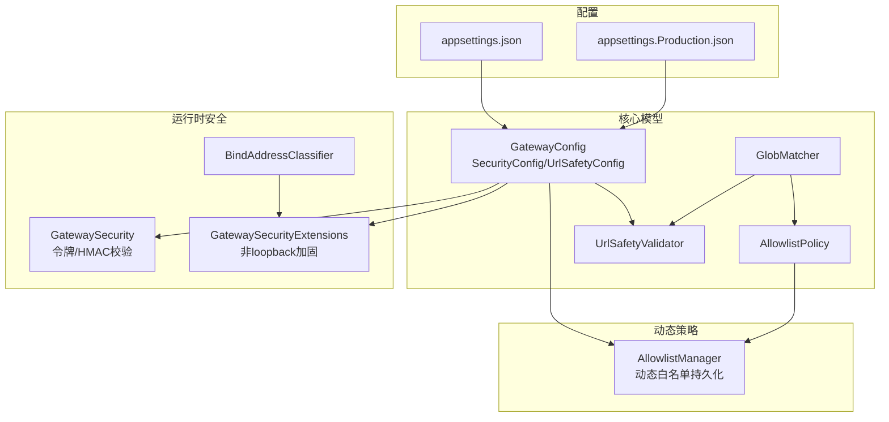
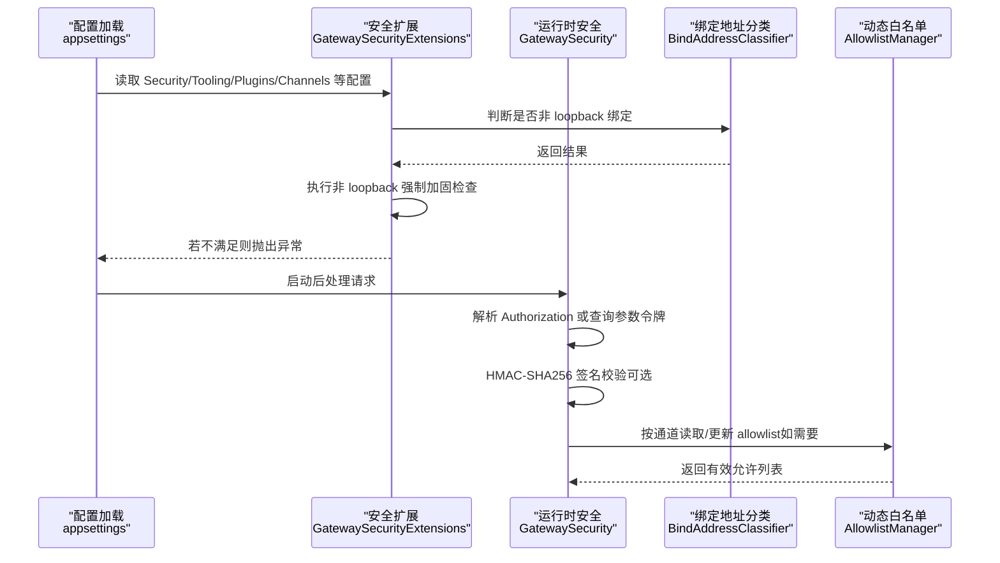
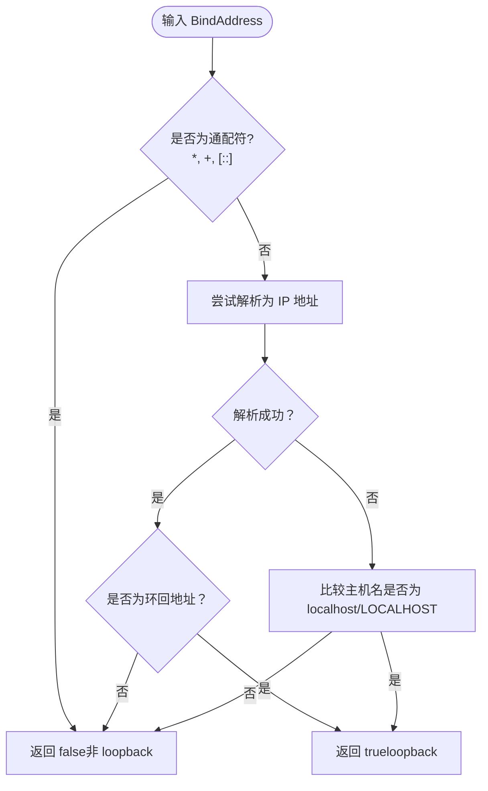
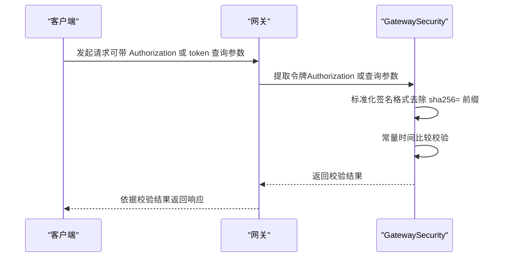
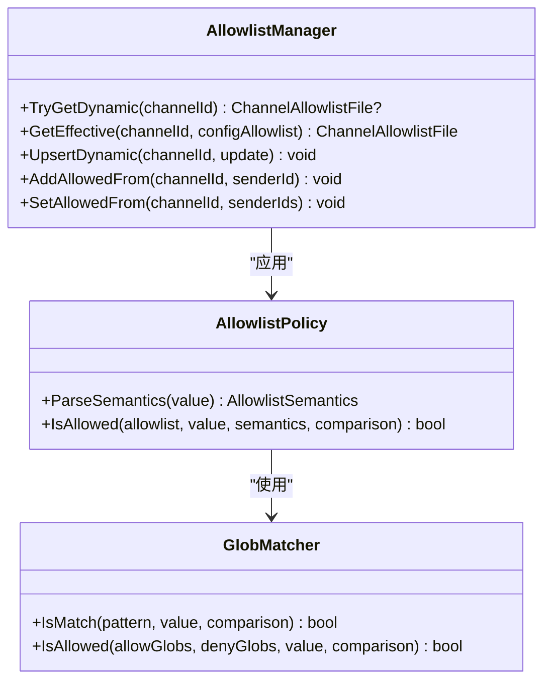
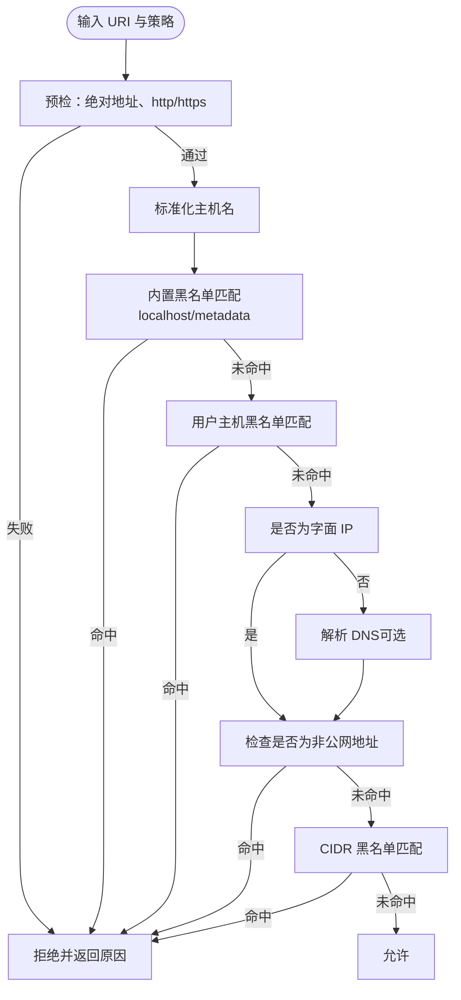
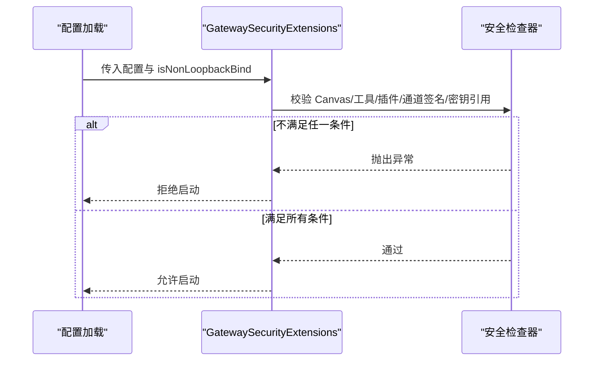
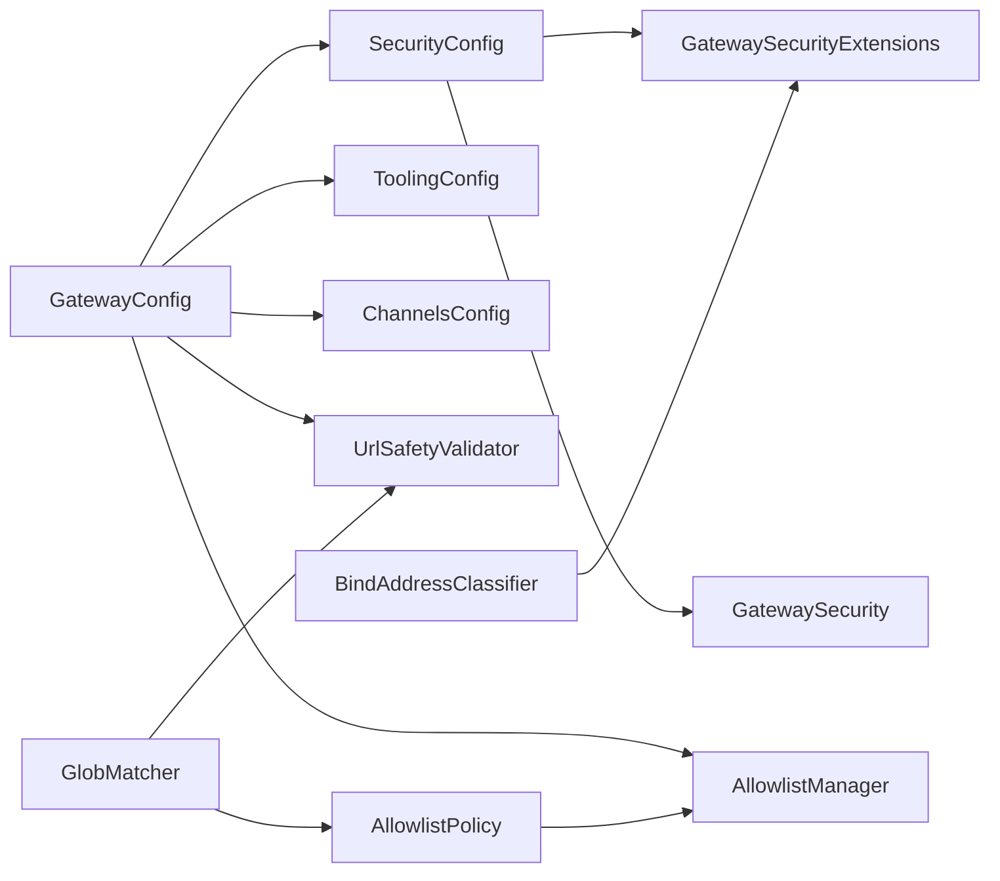

# 网络安全配置

<cite>
**本文档引用的文件**
- [AllowlistManager.cs](file://src/OpenClaw.Core/Src/OpenClaw.Core/Security/AllowlistManager.cs)
- [AllowlistPolicy.cs](file://src/OpenClaw.Core/Src/OpenClaw.Core/Security/AllowlistPolicy.cs)
- [BindAddressClassifier.cs](file://src/OpenClaw.Core/Src/OpenClaw.Core/Security/BindAddressClassifier.cs)
- [GatewaySecurity.cs](file://src/OpenClaw.Gateway/Src/OpenClaw.Gateway/GatewaySecurity.cs)
- [GatewaySecurityExtensions.cs](file://src/OpenClaw.Gateway/Src/OpenClaw.Gateway/Extensions/GatewaySecurityExtensions.cs)
- [UrlSafetyValidator.cs](file://src/OpenClaw.Core/Src/OpenClaw.Core/Security/UrlSafetyValidator.cs)
- [GlobMatcher.cs](file://src/OpenClaw.Core/Src/OpenClaw.Core/Security/GlobMatcher.cs)
- [appsettings.json](file://src/OpenClaw.Gateway/Src/OpenClaw.Gateway/appsettings.json)
- [appsettings.Production.json](file://src/OpenClaw.Gateway/Src/OpenClaw.Gateway/appsettings.Production.json)
- [GatewayConfig.cs](file://src/OpenClaw.Core/Src/OpenClaw.Core/Models/GatewayConfig.cs)
- [GatewaySecurityHardeningTests.cs](file://src/OpenClaw.Tests/Src/OpenClaw.Tests/GatewaySecurityHardeningTests.cs)
- [BindAddressClassifierTests.cs](file://src/OpenClaw.Tests/Src/OpenClaw.Tests/BindAddressClassifierTests.cs)
- [AllowlistManagerTests.cs](file://src/OpenClaw.Tests/Src/OpenClaw.Tests/AllowlistManagerTests.cs)
- [GatewaySetupArtifacts.cs](file://src/OpenClaw.Core/Src/OpenClaw.Core/Setup/GatewaySetupArtifacts.cs)
</cite>

## 目录
1. [简介](#简介)
2. [项目结构](#项目结构)
3. [核心组件](#核心组件)
4. [架构总览](#架构总览)
5. [详细组件分析](#详细组件分析)
6. [依赖关系分析](#依赖关系分析)
7. [性能考量](#性能考量)
8. [故障排查指南](#故障排查指南)
9. [结论](#结论)
10. [附录](#附录)

## 简介
本文件面向网络安全与运维工程人员，系统化梳理本项目的网络访问控制、防火墙与端口管理、绑定地址策略、loopback 检测、IP 白名单、URL 安全策略以及 HTTPS/TLS 相关配置要点。文档同时给出生产环境最佳实践、端口暴露策略与外部访问控制建议，并通过图示展示关键流程与依赖关系。

## 项目结构
围绕网络安全的关键代码主要分布在以下模块：
- 核心安全模型与策略：GatewayConfig（含 SecurityConfig、UrlSafetyConfig）、AllowlistPolicy、GlobMatcher、UrlSafetyValidator
- 绑定地址与访问控制：BindAddressClassifier、GatewaySecurity（令牌解析与校验、HMAC 校验）
- 运行时安全强化：GatewaySecurityExtensions（非 loopback 绑定的强制加固）
- 动态白名单：AllowlistManager（按通道持久化动态 allowlist）
- 配置样例：appsettings.json、appsettings.Production.json
- 测试用例：BindAddressClassifierTests、AllowlistManagerTests、GatewaySecurityHardeningTests

**图表来源**
- [GatewayConfig.cs](file://src/OpenClaw.Core/Src/OpenClaw.Core/Models/GatewayConfig.cs)
- [GatewaySecurityExtensions.cs](file://src/OpenClaw.Gateway/Src/OpenClaw.Gateway/Extensions/GatewaySecurityExtensions.cs)
- [GatewaySecurity.cs](file://src/OpenClaw.Gateway/Src/OpenClaw.Gateway/GatewaySecurity.cs)
- [BindAddressClassifier.cs](file://src/OpenClaw.Core/Src/OpenClaw.Core/Security/BindAddressClassifier.cs)
- [AllowlistManager.cs](file://src/OpenClaw.Core/Src/OpenClaw.Core/Security/AllowlistManager.cs)
- [UrlSafetyValidator.cs](file://src/OpenClaw.Core/Src/OpenClaw.Core/Security/UrlSafetyValidator.cs)
- [GlobMatcher.cs](file://src/OpenClaw.Core/Src/OpenClaw.Core/Security/GlobMatcher.cs)
- [appsettings.json](file://src/OpenClaw.Gateway/Src/OpenClaw.Gateway/appsettings.json)
- [appsettings.Production.json](file://src/OpenClaw.Gateway/Src/OpenClaw.Gateway/appsettings.Production.json)

**章节来源**
- [appsettings.json](file://src/OpenClaw.Gateway/Src/OpenClaw.Gateway/appsettings.json)
- [appsettings.Production.json](file://src/OpenClaw.Gateway/Src/OpenClaw.Gateway/appsettings.Production.json)
- [GatewayConfig.cs](file://src/OpenClaw.Core/Src/OpenClaw.Core/Models/GatewayConfig.cs)

## 核心组件
- 绑定地址分类器：用于判断当前 BindAddress 是否为 loopback 地址，避免将 ASP.NET Core 的通配符视作 loopback。
- 访问令牌与签名：从 Authorization 头或查询参数提取 Bearer 令牌；支持 HMAC-SHA256 签名验证。
- 允许列表策略：支持“传统”和“严格”两种语义，使用通配符匹配；动态 allowlist 文件优先于静态配置。
- URL 安全策略：对出站 HTTP(S) 请求进行主机与 IP 范围限制，阻断私有/元数据网段等。
- 非 loopback 强制加固：在非本地绑定时拒绝不安全的工具执行、插件桥接、原始密钥引用等风险项。
- 动态白名单：按通道持久化 allowlist，支持并发安全更新与路径清理。

**章节来源**
- [BindAddressClassifier.cs](file://src/OpenClaw.Core/Src/OpenClaw.Core/Security/BindAddressClassifier.cs)
- [GatewaySecurity.cs](file://src/OpenClaw.Gateway/Src/OpenClaw.Gateway/GatewaySecurity.cs)
- [AllowlistPolicy.cs](file://src/OpenClaw.Core/Src/OpenClaw.Core/Security/AllowlistPolicy.cs)
- [AllowlistManager.cs](file://src/OpenClaw.Core/Src/OpenClaw.Core/Security/AllowlistManager.cs)
- [UrlSafetyValidator.cs](file://src/OpenClaw.Core/Src/OpenClaw.Core/Security/UrlSafetyValidator.cs)
- [GatewaySecurityExtensions.cs](file://src/OpenClaw.Gateway/Src/OpenClaw.Gateway/Extensions/GatewaySecurityExtensions.cs)

## 架构总览
下图展示了从配置加载到启动前安全检查、运行时访问控制与动态策略的整体流程。

**图表来源**
- [appsettings.json](file://src/OpenClaw.Gateway/Src/OpenClaw.Gateway/appsettings.json)
- [GatewaySecurityExtensions.cs](file://src/OpenClaw.Gateway/Src/OpenClaw.Gateway/Extensions/GatewaySecurityExtensions.cs)
- [GatewaySecurity.cs](file://src/OpenClaw.Gateway/Src/OpenClaw.Gateway/GatewaySecurity.cs)
- [BindAddressClassifier.cs](file://src/OpenClaw.Core/Src/OpenClaw.Core/Security/BindAddressClassifier.cs)
- [AllowlistManager.cs](file://src/OpenClaw.Core/Src/OpenClaw.Core/Security/AllowlistManager.cs)

## 详细组件分析

### 绑定地址与 loopback 检测
- 识别逻辑：将字符串解析为 IP，若为环回地址或主机名为 localhost/LOCALHOST，则判定为 loopback；ASP.NET Core 的 "*"、"+"、"[::]" 不视为 loopback。
- 使用场景：非 loopback 绑定时触发更严格的启动前安全检查与运行时访问控制。

**图表来源**
- [BindAddressClassifier.cs](file://src/OpenClaw.Core/Src/OpenClaw.Core/Security/BindAddressClassifier.cs)

**章节来源**
- [BindAddressClassifier.cs](file://src/OpenClaw.Core/Src/OpenClaw.Core/Security/BindAddressClassifier.cs)
- [BindAddressClassifierTests.cs](file://src/OpenClaw.Tests/Src/OpenClaw.Tests/BindAddressClassifierTests.cs)

### 访问令牌与签名验证
- 令牌提取：优先从 Authorization 头解析 Bearer 令牌；若允许查询参数令牌且开启，则从查询参数 token 获取。
- 令牌校验：采用常量时间比较防止时序攻击。
- HMAC-SHA256：支持 sha256= 前缀的十六进制签名，常量时间比较验证。

**图表来源**
- [GatewaySecurity.cs](file://src/OpenClaw.Gateway/Src/OpenClaw.Gateway/GatewaySecurity.cs)

**章节来源**
- [GatewaySecurity.cs](file://src/OpenClaw.Gateway/Src/OpenClaw.Gateway/GatewaySecurity.cs)

### 允许列表策略与动态白名单
- 允许列表语义：
  - 传统（Legacy）：空列表表示允许全部（历史兼容行为）。
  - 严格（Strict）：空列表表示拒绝全部；仅 "*" 表示允许全部。
- 匹配算法：支持通配符 "*" 的简单 glob 匹配，大小写敏感，默认。
- 动态白名单：优先读取动态文件（按通道），不存在则回退到静态配置；支持并发安全更新与临时文件原子替换。

**图表来源**
- [AllowlistPolicy.cs](file://src/OpenClaw.Core/Src/OpenClaw.Core/Security/AllowlistPolicy.cs)
- [GlobMatcher.cs](file://src/OpenClaw.Core/Src/OpenClaw.Core/Security/GlobMatcher.cs)
- [AllowlistManager.cs](file://src/OpenClaw.Core/Src/OpenClaw.Core/Security/AllowlistManager.cs)

**章节来源**
- [AllowlistPolicy.cs](file://src/OpenClaw.Core/Src/OpenClaw.Core/Security/AllowlistPolicy.cs)
- [GlobMatcher.cs](file://src/OpenClaw.Core/Src/OpenClaw.Core/Security/GlobMatcher.cs)
- [AllowlistManager.cs](file://src/OpenClaw.Core/Src/OpenClaw.Core/Security/AllowlistManager.cs)
- [AllowlistManagerTests.cs](file://src/OpenClaw.Tests/Src/OpenClaw.Tests/AllowlistManagerTests.cs)

### URL 安全策略
- 支持启用/禁用、阻断私有网络目标、自定义主机黑名单与 CIDR 黑名单。
- 对 DNS 解析失败、无地址返回等情况进行明确拒绝。
- 内置阻断主机模式（如 localhost、metadata.*），并支持大小写不敏感匹配。

**图表来源**
- [UrlSafetyValidator.cs](file://src/OpenClaw.Core/Src/OpenClaw.Core/Security/UrlSafetyValidator.cs)
- [GlobMatcher.cs](file://src/OpenClaw.Core/Src/OpenClaw.Core/Security/GlobMatcher.cs)

**章节来源**
- [UrlSafetyValidator.cs](file://src/OpenClaw.Core/Src/OpenClaw.Core/Security/UrlSafetyValidator.cs)

### 非 loopback 绑定的强制安全加固
- 在非 loopback 绑定时，若启用了 Canvas 命令转发但未显式允许公共绑定，将拒绝启动。
- 若存在不安全的本地工具执行（如 shell/process）或工作区根为通配符，且未显式允许公共绑定，将拒绝启动。
- 第三方插件桥接（TS/JS 插件）在非 loopback 绑定时默认拒绝，除非显式允许。
- 未使用签名验证的外部通道（如 Twilio、Telegram、Teams、Slack、Discord、WhatsApp）在非 loopback 绑定时将被拒绝。
- 禁止在非 loopback 绑定时使用 raw: 密钥引用，除非显式允许。

**图表来源**
- [GatewaySecurityExtensions.cs](file://src/OpenClaw.Gateway/Src/OpenClaw.Gateway/Extensions/GatewaySecurityExtensions.cs)
- [GatewaySecurityHardeningTests.cs](file://src/OpenClaw.Tests/Src/OpenClaw.Tests/GatewaySecurityHardeningTests.cs)

**章节来源**
- [GatewaySecurityExtensions.cs](file://src/OpenClaw.Gateway/Src/OpenClaw.Gateway/Extensions/GatewaySecurityExtensions.cs)
- [GatewaySecurityHardeningTests.cs](file://src/OpenClaw.Tests/Src/OpenClaw.Tests/GatewaySecurityHardeningTests.cs)

### HTTPS 与 TLS 配置要点
- 本项目未直接提供内置 HTTPS/TLS 服务器配置项；生产环境建议通过反向代理（如 Nginx、Caddy、Envoy）终止 TLS 并以 HTTP 与网关通信。
- 反向代理应：
  - 强制使用现代 TLS 版本与密码套件
  - 配置 HSTS、OCSP Stapling、证书链完整性校验
  - 仅暴露必要端口（如 443），内部服务仅监听 loopback 或受保护子网
- 网关侧：
  - 在生产配置中启用信任转发头（TrustForwardedHeaders）并正确配置 KnownProxies
  - 使用强令牌与签名验证（Authorization、签名头/查询参数 token）

**章节来源**
- [appsettings.Production.json](file://src/OpenClaw.Gateway/Src/OpenClaw.Gateway/appsettings.Production.json)
- [GatewaySecurity.cs](file://src/OpenClaw.Gateway/Src/OpenClaw.Gateway/GatewaySecurity.cs)

### 端口管理与绑定地址策略
- 开发默认绑定：127.0.0.1:18789
- 生产默认绑定：0.0.0.0:18789（需配合反向代理与加固策略）
- 当绑定地址为 0.0.0.0、:: 或 [::] 时，生成可达基地址会自动指向 127.0.0.1，避免外网直连。

**章节来源**
- [appsettings.json](file://src/OpenClaw.Gateway/Src/OpenClaw.Gateway/appsettings.json)
- [appsettings.Production.json](file://src/OpenClaw.Gateway/Src/OpenClaw.Gateway/appsettings.Production.json)
- [GatewaySetupArtifacts.cs](file://src/OpenClaw.Core/Src/OpenClaw.Core/Setup/GatewaySetupArtifacts.cs)

## 依赖关系分析
- 配置驱动：GatewayConfig 是安全策略的唯一权威来源，所有安全扩展与运行时组件均基于其字段进行决策。
- 松耦合设计：AllowlistPolicy 与 GlobMatcher 独立于具体通道实现；AllowlistManager 通过文件系统持久化，便于动态更新。
- 运行时依赖：GatewaySecurity 依赖 BindAddressClassifier 与配置中的令牌/签名策略；GatewaySecurityExtensions 依赖 SecretResolver 与工具执行后端选择逻辑。

**图表来源**
- [GatewayConfig.cs](file://src/OpenClaw.Core/Src/OpenClaw.Core/Models/GatewayConfig.cs)
- [GatewaySecurityExtensions.cs](file://src/OpenClaw.Gateway/Src/OpenClaw.Gateway/Extensions/GatewaySecurityExtensions.cs)
- [GatewaySecurity.cs](file://src/OpenClaw.Gateway/Src/OpenClaw.Gateway/GatewaySecurity.cs)
- [UrlSafetyValidator.cs](file://src/OpenClaw.Core/Src/OpenClaw.Core/Security/UrlSafetyValidator.cs)
- [AllowlistManager.cs](file://src/OpenClaw.Core/Src/OpenClaw.Core/Security/AllowlistManager.cs)
- [AllowlistPolicy.cs](file://src/OpenClaw.Core/Src/OpenClaw.Core/Security/AllowlistPolicy.cs)
- [GlobMatcher.cs](file://src/OpenClaw.Core/Src/OpenClaw.Core/Security/GlobMatcher.cs)
- [BindAddressClassifier.cs](file://src/OpenClaw.Core/Src/OpenClaw.Core/Security/BindAddressClassifier.cs)

**章节来源**
- [GatewayConfig.cs](file://src/OpenClaw.Core/Src/OpenClaw.Core/Models/GatewayConfig.cs)

## 性能考量
- 允许列表匹配：GlobMatcher 使用 span-based 匹配，避免 split 分割带来的分配开销；建议合理使用通配符，减少复杂模式。
- 动态白名单：Upsert 使用临时文件与原子移动，保证一致性；高并发场景建议降低更新频率或合并变更。
- URL 安全校验：DNS 解析可能带来延迟；建议在策略中关闭 DNS 解析或缓存解析结果（由调用方负责）。
- 令牌与签名：常量时间比较避免时序泄漏，成本极低；HMAC 计算与十六进制解码为 CPU 密集型，建议在入口层限流与缓存。

[本节为通用指导，无需特定文件引用]

## 故障排查指南
- 启动时报错“拒绝在非 loopback 绑定上启动”，通常由以下原因导致：
  - Canvas 启用但未允许公共绑定
  - 工具执行不安全（shell/process 或工作区根为通配符）
  - 插件桥接启用
  - 外部通道未启用签名验证
  - 存在 raw: 密钥引用
- 排查步骤：
  - 检查 Security.AllowPluginBridgeOnPublicBind、AllowUnsafeToolingOnPublicBind、Canvas.AllowOnPublicBind 等开关
  - 确认各通道的 ValidateSignature、WebhookPublicBaseUrl、密钥引用等配置
  - 将 BindAddress 切换为 loopback 进行最小化验证，再逐步放开策略
- 动态白名单问题：
  - 检查 allowlists 目录权限与磁盘空间
  - 确认动态文件命名与路径清理逻辑（移除非法字符、处理 . 开头）

**章节来源**
- [GatewaySecurityHardeningTests.cs](file://src/OpenClaw.Tests/Src/OpenClaw.Tests/GatewaySecurityHardeningTests.cs)
- [AllowlistManager.cs](file://src/OpenClaw.Core/Src/OpenClaw.Core/Security/AllowlistManager.cs)
- [AllowlistManagerTests.cs](file://src/OpenClaw.Tests/Src/OpenClaw.Tests/AllowlistManagerTests.cs)

## 结论
本项目通过“配置驱动 + 启动前强制加固 + 运行时访问控制”的多层策略，确保在非 loopback 绑定时具备更强的网络安全边界。结合反向代理的 TLS 终止与严格的令牌/签名验证，可实现从边缘到内部的纵深防御。建议在生产环境中：
- 使用反向代理终止 TLS，网关监听 loopback 或受控内网
- 明确启用严格公共绑定配置，开启签名验证与工具审批
- 使用动态白名单与 URL 安全策略限制出站访问
- 定期审计密钥引用与通道配置，避免 raw: 密钥引用

[本节为总结性内容，无需特定文件引用]

## 附录

### 最佳实践清单
- 绑定地址
  - 开发：127.0.0.1
  - 生产：0.0.0.0 需配合反向代理与加固策略
- 令牌与签名
  - 强制使用 Authorization: Bearer 令牌
  - 外部通道统一启用签名验证
- 允许列表
  - 使用严格语义，避免空列表放行
  - 通过动态白名单按通道精细化控制
- 出站访问
  - 启用 URL 安全策略，阻断私有/元数据网段
  - 自定义黑名单与 CIDR 黑名单
- 插件与工具
  - 非 loopback 绑定时禁止第三方插件桥接
  - 限制 shell/process 执行，必要时启用审批
- HTTPS/TLS
  - 反向代理终止 TLS，网关使用 HTTP
  - 配置 HSTS、OCSP Stapling、强密码套件

[本节为通用指导，无需特定文件引用]