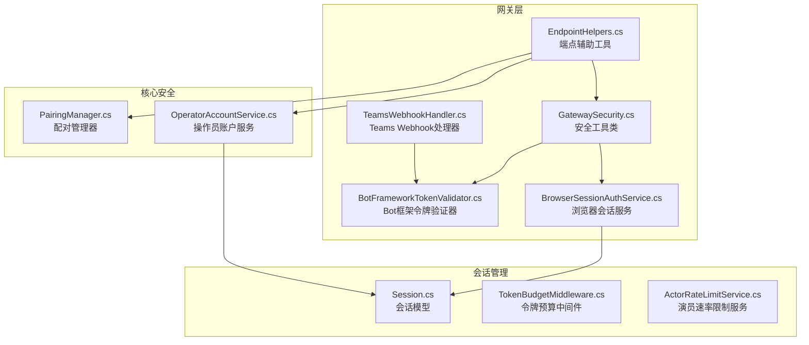
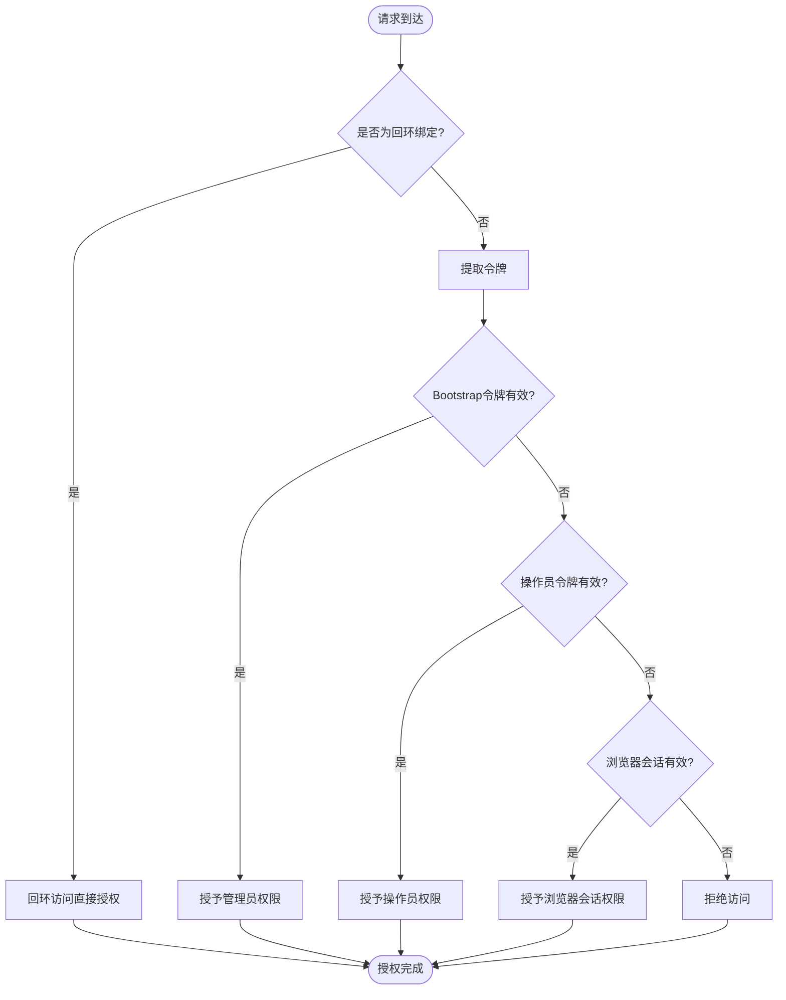
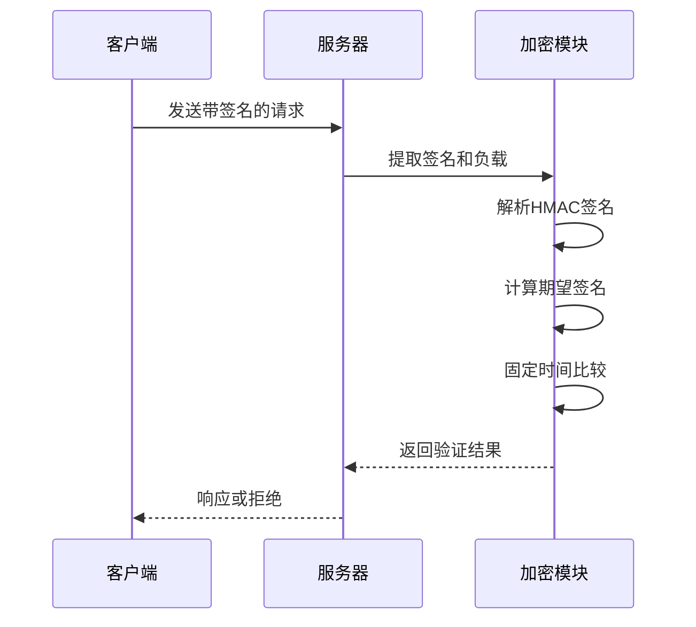
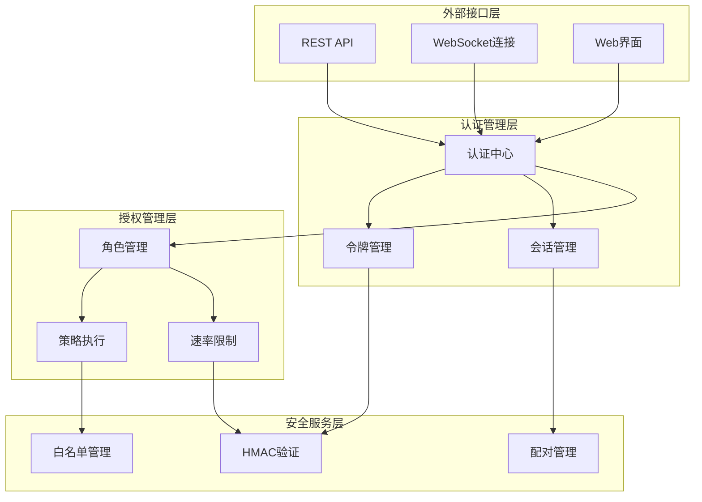
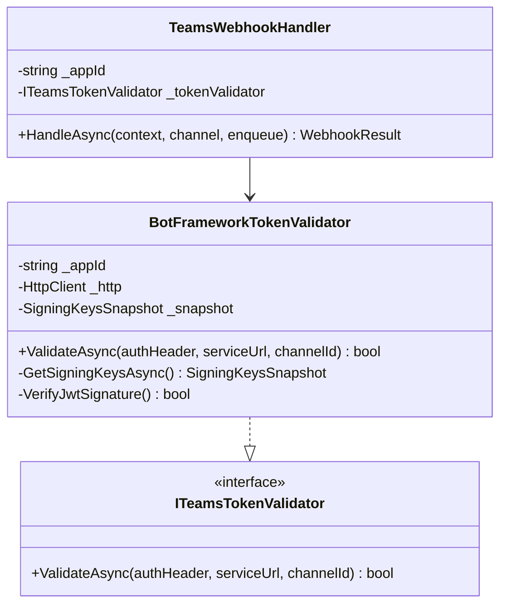
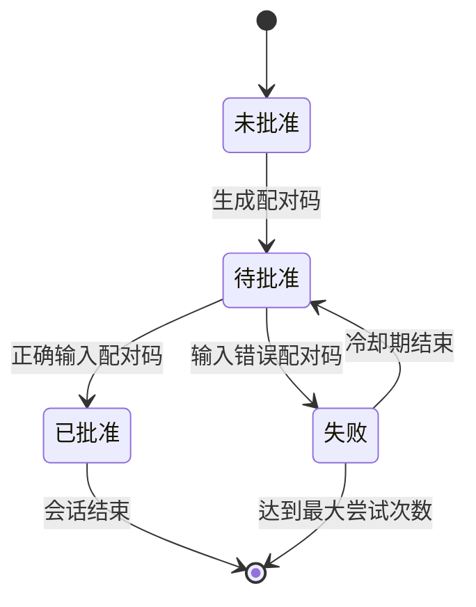
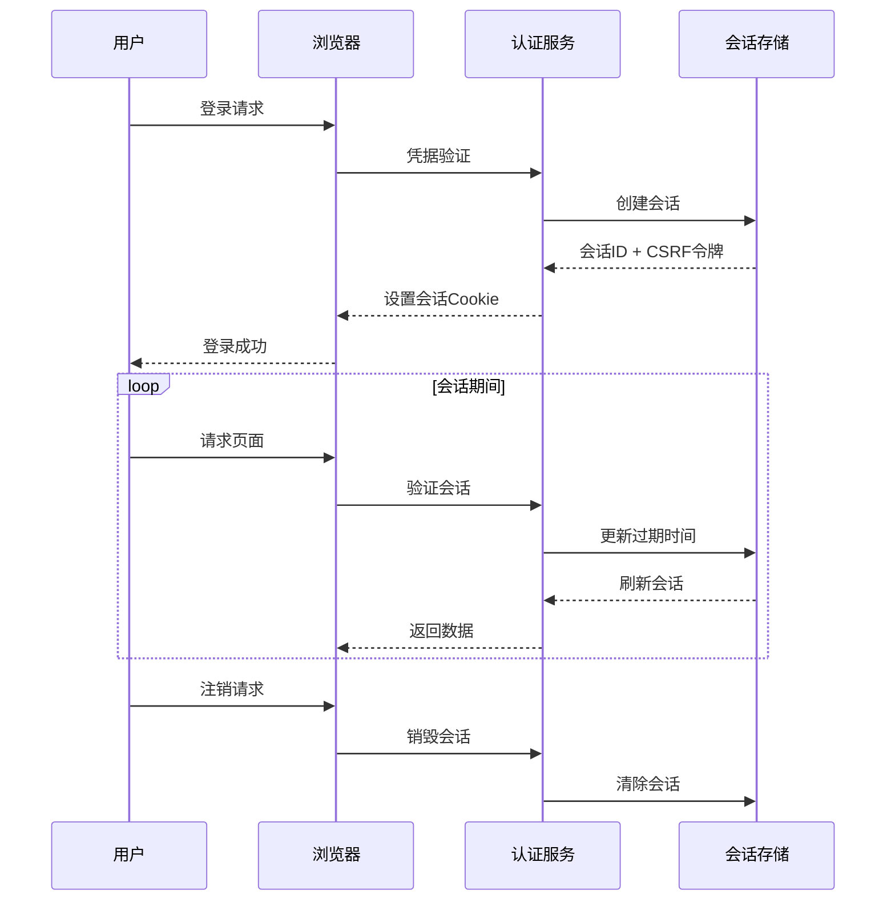
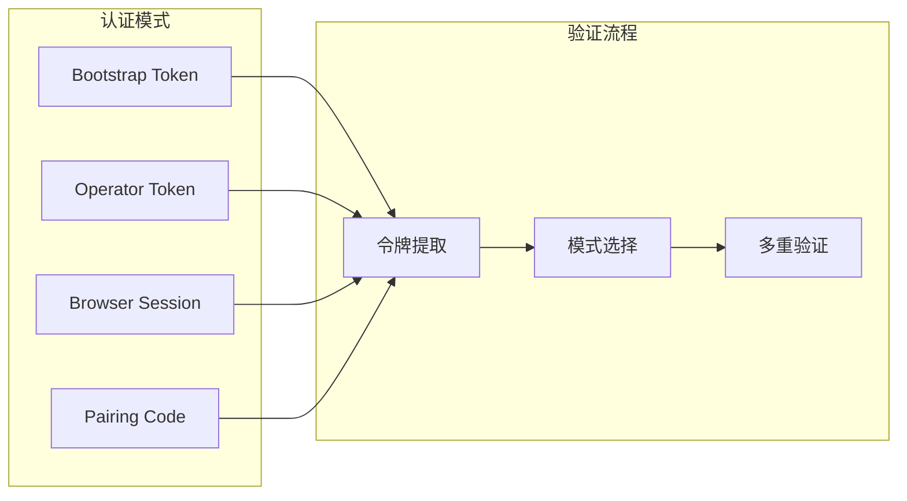
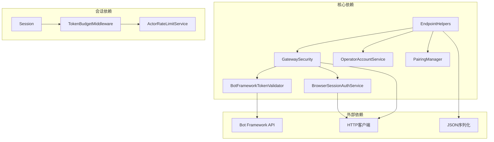
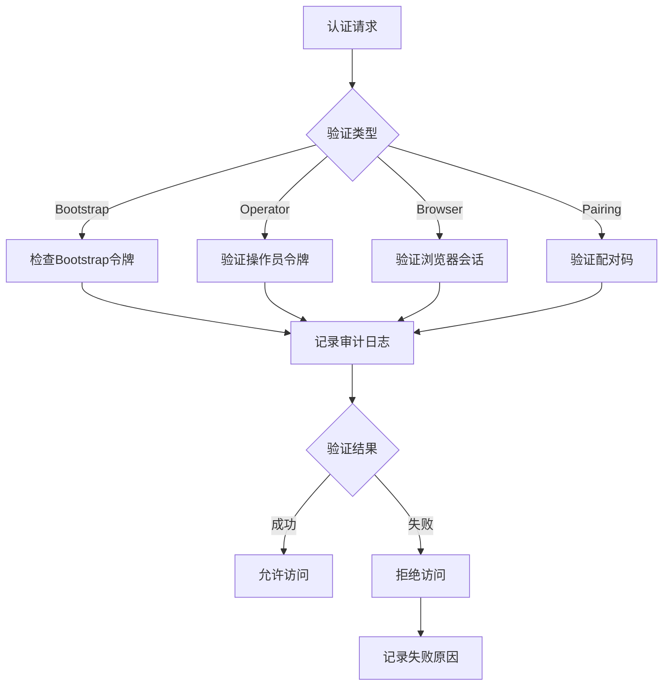

# 认证授权机制

<cite>
**本文档引用的文件**
- [GatewaySecurity.cs](file://src/OpenClaw.Gateway/GatewaySecurity.cs)
- [BotFrameworkTokenValidator.cs](file://src/OpenClaw.Gateway/BotFrameworkTokenValidator.cs)
- [PairingManager.cs](file://src/OpenClaw.Core/Security/PairingManager.cs)
- [BrowserSessionAuthService.cs](file://src/OpenClaw.Gateway/BrowserSessionAuthService.cs)
- [EndpointHelpers.cs](file://src/OpenClaw.Gateway/Endpoints/EndpointHelpers.cs)
- [OperatorAccountService.cs](file://src/OpenClaw.Gateway/OperatorAccountService.cs)
- [Session.cs](file://src/OpenClaw.Core/Models/Session.cs)
- [TeamsWebhookHandler.cs](file://src/OpenClaw.Gateway/TeamsWebhookHandler.cs)
- [TokenBudgetMiddleware.cs](file://src/OpenClaw.Core/Middleware/TokenBudgetMiddleware.cs)
- [ActorRateLimitService.cs](file://src/OpenClaw.Gateway/ActorRateLimitService.cs)
</cite>

## 目录
1. [简介](#简介)
2. [项目结构](#项目结构)
3. [核心组件](#核心组件)
4. [架构概览](#架构概览)
5. [详细组件分析](#详细组件分析)
6. [依赖关系分析](#依赖关系分析)
7. [性能考虑](#性能考虑)
8. [故障排除指南](#故障排除指南)
9. [结论](#结论)

## 简介

本文件全面阐述了Kingcrab项目中的认证授权机制，涵盖Bearer Token验证、HMAC SHA256签名验证、固定时间比较算法等核心技术，并深入分析了Bot Framework令牌验证、用户配对管理、会话令牌管理等关键功能模块。同时提供了多因素认证、OAuth集成和权限分级的实施方案建议。

该认证授权体系采用多层次防护设计，结合了现代密码学技术与企业级安全实践，确保系统在开放环境中的安全性与可用性。

## 项目结构

认证授权相关的核心文件分布如下：

**图表来源**
- [GatewaySecurity.cs:1-109](file://src/OpenClaw.Gateway/GatewaySecurity.cs#L1-L109)
- [BotFrameworkTokenValidator.cs:1-410](file://src/OpenClaw.Gateway/BotFrameworkTokenValidator.cs#L1-L410)
- [PairingManager.cs:1-211](file://src/OpenClaw.Core/Security/PairingManager.cs#L1-L211)

## 核心组件

### Bearer Token 验证机制

系统支持多种令牌验证方式，包括Bootstrap令牌、操作员令牌和浏览器会话令牌：

**图表来源**
- [EndpointHelpers.cs:47-131](file://src/OpenClaw.Gateway/Endpoints/EndpointHelpers.cs#L47-L131)

### HMAC SHA256 签名验证

系统实现了安全的HMAC SHA256签名验证机制，用于验证请求完整性：

**图表来源**
- [GatewaySecurity.cs:59-76](file://src/OpenClaw.Gateway/GatewaySecurity.cs#L59-L76)

### 固定时间比较算法

为防止时序攻击，系统使用CryptographicOperations.FixedTimeEquals进行安全比较：

| 特性 | 实现细节 |
|------|----------|
| 比较算法 | CryptographicOperations.FixedTimeEquals |
| 防护类型 | 时序攻击防护 |
| 应用场景 | 密钥比较、令牌验证 |
| 性能特性 | 常量时间复杂度 |

**章节来源**
- [GatewaySecurity.cs:44-49](file://src/OpenClaw.Gateway/GatewaySecurity.cs#L44-L49)
- [PairingManager.cs:146-154](file://src/OpenClaw.Core/Security/PairingManager.cs#L146-L154)

## 架构概览

认证授权系统的整体架构采用分层设计：

**图表来源**
- [EndpointHelpers.cs:10-366](file://src/OpenClaw.Gateway/Endpoints/EndpointHelpers.cs#L10-L366)
- [BrowserSessionAuthService.cs:8-180](file://src/OpenClaw.Gateway/BrowserSessionAuthService.cs#L8-L180)

## 详细组件分析

### Bot Framework 令牌验证

Bot Framework令牌验证器实现了完整的JWT验证流程：

**图表来源**
- [BotFrameworkTokenValidator.cs:15-134](file://src/OpenClaw.Gateway/BotFrameworkTokenValidator.cs#L15-L134)
- [TeamsWebhookHandler.cs:15-40](file://src/OpenClaw.Gateway/TeamsWebhookHandler.cs#L15-L40)

#### 验证流程详解

1. **令牌解析**: 验证Bearer前缀和JWT格式
2. **头部验证**: 检查算法、发行者、受众
3. **声明验证**: 验证过期时间、服务URL匹配
4. **签名验证**: 使用Bot Framework公钥验证签名
5. **渠道验证**: 确认签名密钥被目标渠道认可

**章节来源**
- [BotFrameworkTokenValidator.cs:40-134](file://src/OpenClaw.Gateway/BotFrameworkTokenValidator.cs#L40-L134)

### 用户配对管理

配对管理系统提供安全的用户身份验证机制：

**图表来源**
- [PairingManager.cs:53-124](file://src/OpenClaw.Core/Security/PairingManager.cs#L53-L124)

#### 关键特性

| 功能 | 实现细节 | 安全特性 |
|------|----------|----------|
| 配对码生成 | 6位数字随机数 | 10分钟有效期 |
| 配对码验证 | 固定时间比较 | 防时序攻击 |
| 失败处理 | 5次失败后5分钟冷却 | 防暴力破解 |
| 持久化存储 | JSON文件存储 | 原子写入 |

**章节来源**
- [PairingManager.cs:16-18](file://src/OpenClaw.Core/Security/PairingManager.cs#L16-L18)

### 会话令牌管理

浏览器会话服务提供完整的会话生命周期管理：

**图表来源**
- [BrowserSessionAuthService.cs:32-107](file://src/OpenClaw.Gateway/BrowserSessionAuthService.cs#L32-L107)

**章节来源**
- [BrowserSessionAuthService.cs:32-107](file://src/OpenClaw.Gateway/BrowserSessionAuthService.cs#L32-L107)

### 权限分级与角色管理

系统实现基于角色的访问控制（RBAC）：

| 角色级别 | 权限范围 | 可访问端点 |
|----------|----------|------------|
| Viewer | 只读访问 | `/api/status` |
| Operator | 操作权限 | `/api/admin/*` |
| Admin | 管理权限 | `/api/admin/operator-accounts/*` |
| Bootstrap Admin | 最高权限 | 全部端点 |

**章节来源**
- [EndpointHelpers.cs:242-307](file://src/OpenClaw.Gateway/Endpoints/EndpointHelpers.cs#L242-L307)

### 多因素认证实施方案

系统支持多种认证模式的组合：

**章节来源**
- [EndpointHelpers.cs:71-119](file://src/OpenClaw.Gateway/Endpoints/EndpointHelpers.cs#L71-L119)

## 依赖关系分析

认证授权系统的组件间依赖关系：

**图表来源**
- [GatewaySecurity.cs:1-109](file://src/OpenClaw.Gateway/GatewaySecurity.cs#L1-L109)
- [EndpointHelpers.cs:1-366](file://src/OpenClaw.Gateway/Endpoints/EndpointHelpers.cs#L1-L366)

**章节来源**
- [OperatorAccountService.cs:1-414](file://src/OpenClaw.Gateway/OperatorAccountService.cs#L1-L414)

## 性能考虑

### 缓存策略

系统采用多层缓存机制优化性能：

| 缓存层级 | 缓存内容 | 过期时间 | 存储位置 |
|----------|----------|----------|----------|
| 签名密钥缓存 | Bot Framework公钥 | 1小时 | 内存缓存 |
| 会话缓存 | 活跃会话状态 | 会话过期时间 | 内存字典 |
| 配对缓存 | 待批准配对请求 | 10分钟 | 内存字典 |
| 账户缓存 | 操作员账户信息 | 文件变更 | 内存对象 |

### 并发处理

系统使用线程安全的数据结构：

- `ConcurrentDictionary` 用于会话和配对状态管理
- `Lock` 用于账户数据的原子操作
- `Interlocked` 用于计数器的原子更新

## 故障排除指南

### 常见问题诊断

| 问题类型 | 症状 | 排查步骤 | 解决方案 |
|----------|------|----------|----------|
| 令牌验证失败 | 401 Unauthorized | 检查令牌格式和有效期 | 重新生成令牌 |
| 时序攻击防护 | 固定时间比较失败 | 验证输入长度一致性 | 使用相同长度输入 |
| 配对码无效 | 配对失败 | 检查配对码有效期 | 重新生成配对码 |
| 会话超时 | 自动登出 | 检查会话过期设置 | 增加会话有效期 |

### 日志记录

系统提供详细的审计日志：

**章节来源**
- [PairingManager.cs:117-118](file://src/OpenClaw.Core/Security/PairingManager.cs#L117-L118)
- [BrowserSessionAuthService.cs:96-106](file://src/OpenClaw.Gateway/BrowserSessionAuthService.cs#L96-L106)

## 结论

Kingcrab项目的认证授权机制展现了现代安全系统的设计理念，通过以下关键特性确保了系统的安全性：

1. **多层防护**: 结合多种认证模式，提供纵深防御
2. **密码学安全**: 使用经过验证的加密算法和安全比较
3. **实时监控**: 完善的审计日志和异常检测
4. **灵活配置**: 支持动态策略调整和扩展
5. **性能优化**: 多层缓存和并发安全设计

该机制为后续集成OAuth、多因素认证等高级功能奠定了坚实基础，能够满足企业级应用的安全需求。