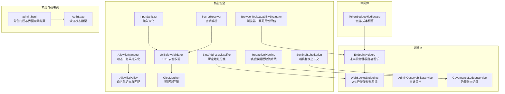
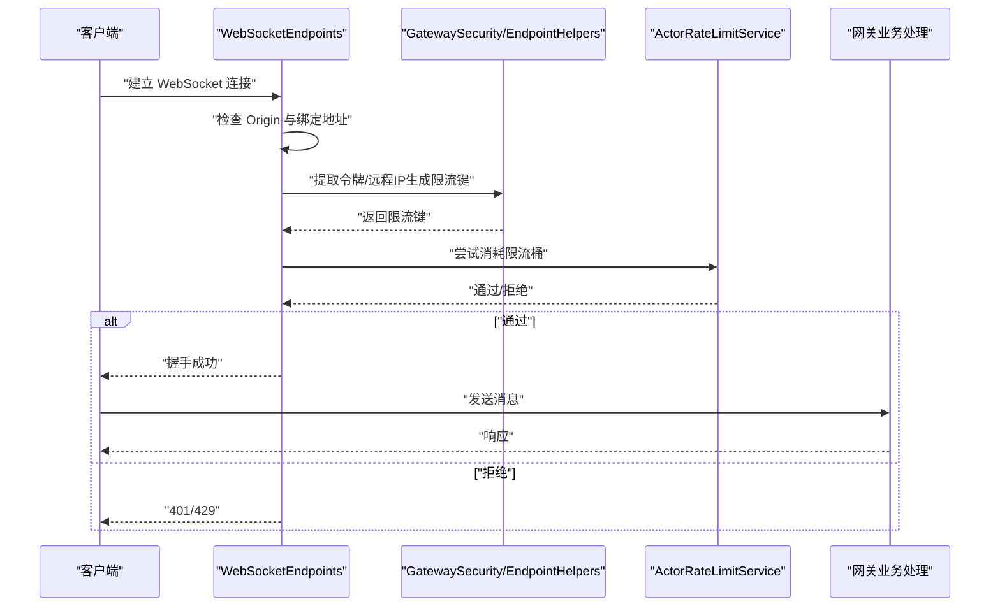
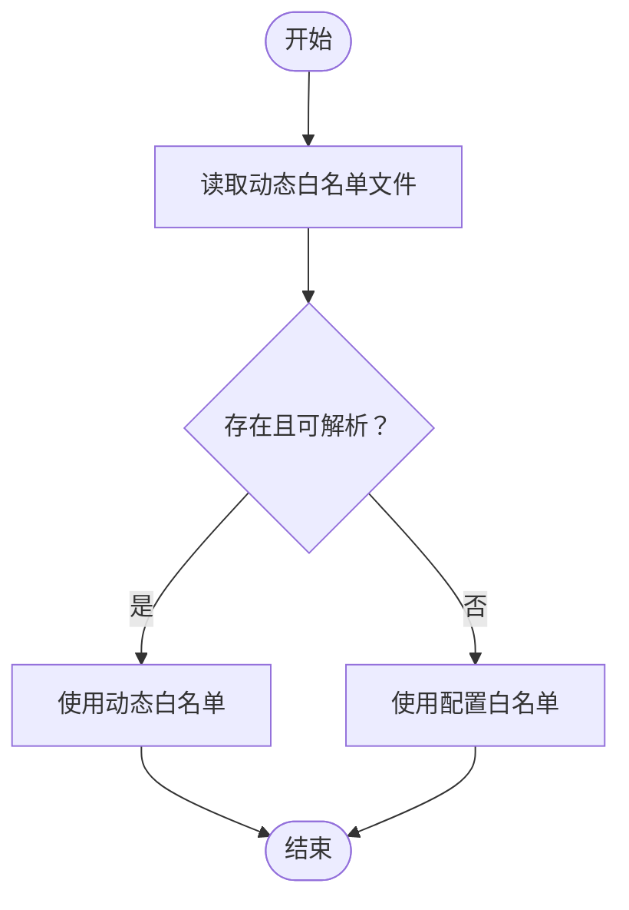
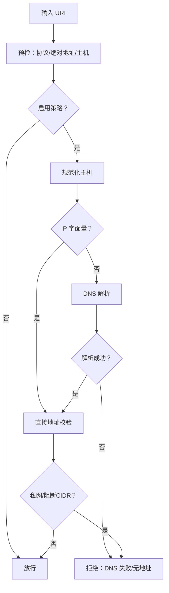
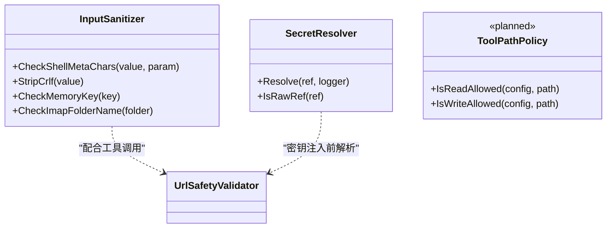
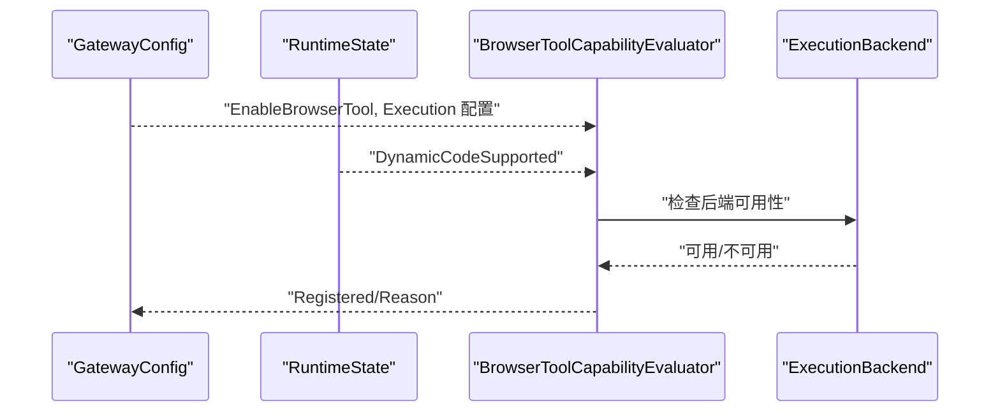
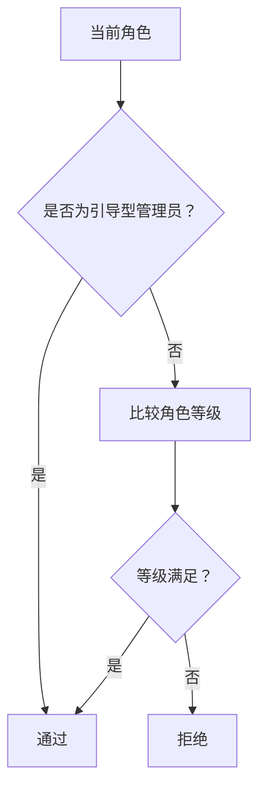
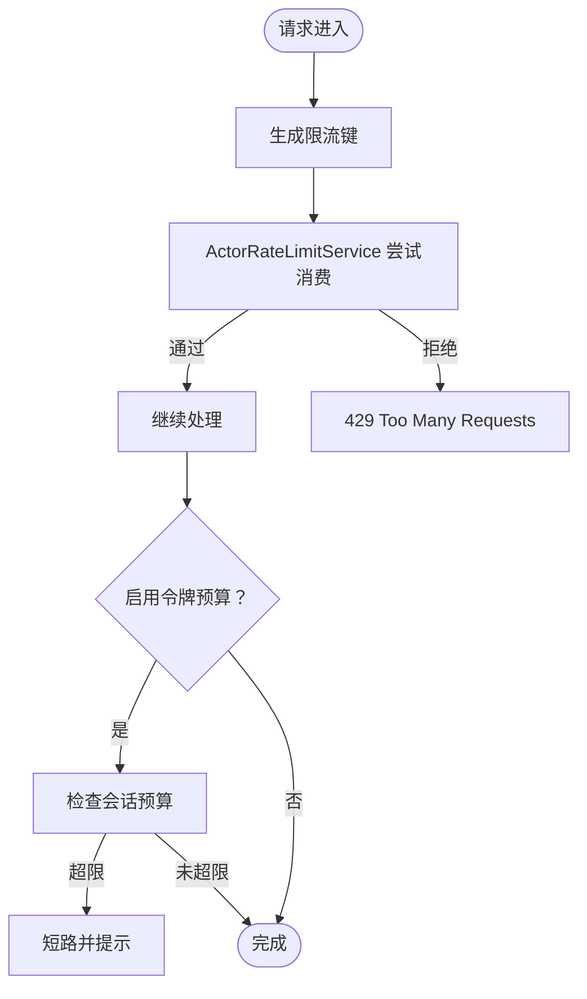
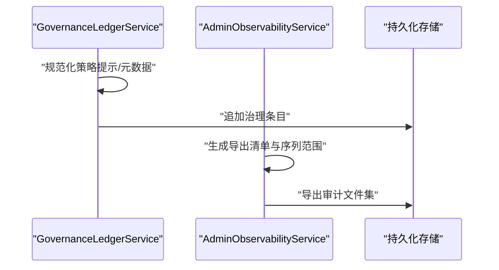
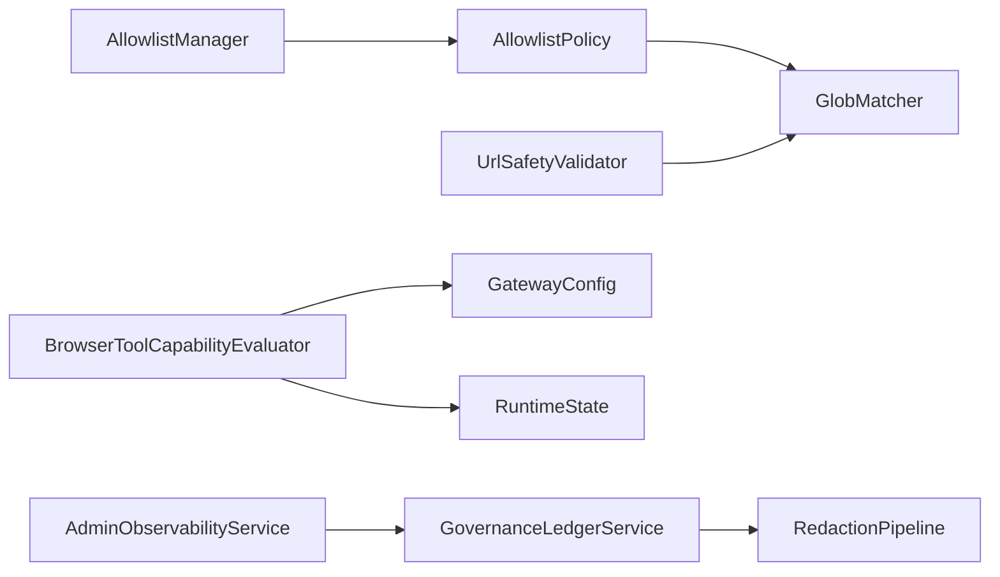

# 访问控制策略

<cite>
**本文引用的文件**
- [AllowlistManager.cs](file://src/OpenClaw.Core/security/AllowlistManager.cs)
- [AllowlistPolicy.cs](file://src/OpenClaw.Core/security/AllowlistPolicy.cs)
- [UrlSafetyValidator.cs](file://src/OpenClaw.Core/security/UrlSafetyValidator.cs)
- [GlobMatcher.cs](file://src/OpenClaw.Core/security/GlobMatcher.cs)
- [BrowserToolCapabilityEvaluator.cs](file://src/OpenClaw.Core/security/BrowserToolCapabilityEvaluator.cs)
- [InputSanitizer.cs](file://src/OpenClaw.Core/security/InputSanitizer.cs)
- [SecretResolver.cs](file://src/OpenClaw.Core/security/SecretResolver.cs)
- [RedactionPipeline.cs](file://src/OpenClaw.Core/security/RedactionPipeline.cs)
- [SentinelSubstitution.cs](file://src/OpenClaw.Core/security/SentinelSubstitution.cs)
- [BindAddressClassifier.cs](file://src/OpenClaw.Core/security/BindAddressClassifier.cs)
- [TokenBudgetMiddleware.cs](file://src/OpenClaw.Core/middleware/TokenBudgetMiddleware.cs)
- [EndpointHelpers.cs](file://src/OpenClaw.Gateway/endpoints/endpointhelpers.cs)
- [WebSocketEndpoints.cs](file://src/OpenClaw.Gateway/endpoints/websocketendpoints.cs)
- [OperatorGovernanceModels.cs](file://src/OpenClaw.Core/models/operatorgovernancymodels.cs)
- [AdminObservabilityService.cs](file://src/OpenClaw.Gateway/adminobservabilityservice.cs)
- [GovernanceLedgerService.cs](file://src/OpenClaw.Gateway/governanceledgerservice.cs)
- [admin.html](file://src/OpenClaw.Gateway/wwwroot/admin.html)
- [AuthState.cs](file://src/OpenClaw.Dashboard/models/authstate.cs)
</cite>

## 目录
1. [引言](#引言)
2. [项目结构](#项目结构)
3. [核心组件](#核心组件)
4. [架构总览](#架构总览)
5. [详细组件分析](#详细组件分析)
6. [依赖关系分析](#依赖关系分析)
7. [性能考量](#性能考量)
8. [故障排查指南](#故障排查指南)
9. [结论](#结论)
10. [附录](#附录)

## 引言
本文件系统化梳理并阐述项目的访问控制策略，覆盖 IP 白名单管理、URL 安全验证、资源访问控制、工具路径策略、浏览器工具能力评估与执行后端访问控制、用户角色管理与权限矩阵、动态权限控制机制，以及细粒度访问控制、条件访问与审计跟踪的实施方案。内容以代码为依据，辅以可视化图示，帮助技术与非技术读者理解与落地。

## 项目结构
访问控制相关能力主要分布在以下模块：
- 核心安全（OpenClaw.Core.Security）：白名单、URL 安全、输入净化、密钥解析、敏感数据脱敏与哨兵替换、通配匹配、绑定地址分类等。
- 网关层（OpenClaw.Gateway）：HTTP/WebSocket 终端、速率限制键生成、授权与角色判定、可观测性导出与治理账本记录。
- 中间件（OpenClaw.Core.Middleware）：令牌预算中间件，用于会话级令牌/成本预算控制。
- 前端与仪表盘（OpenClaw.Gateway/wwwroot、OpenClaw.Dashboard）：基于角色的最小权限展示与操作按钮控制。

图表来源
- [AllowlistManager.cs:1-126](file://src/OpenClaw.Core/security/AllowlistManager.cs#L1-L126)
- [AllowlistPolicy.cs:1-43](file://src/OpenClaw.Core/security/AllowlistPolicy.cs#L1-L43)
- [UrlSafetyValidator.cs:1-219](file://src/OpenClaw.Core/security/UrlSafetyValidator.cs#L1-L219)
- [GlobMatcher.cs:1-89](file://src/OpenClaw.Core/security/GlobMatcher.cs#L1-L89)
- [BrowserToolCapabilityEvaluator.cs:1-61](file://src/OpenClaw.Core/security/BrowserToolCapabilityEvaluator.cs#L1-L61)
- [InputSanitizer.cs:1-84](file://src/OpenClaw.Core/security/InputSanitizer.cs#L1-L84)
- [SecretResolver.cs:1-66](file://src/OpenClaw.Core/security/SecretResolver.cs#L1-L66)
- [RedactionPipeline.cs:1-131](file://src/OpenClaw.Core/security/RedactionPipeline.cs#L1-L131)
- [SentinelSubstitution.cs:1-38](file://src/OpenClaw.Core/security/SentinelSubstitution.cs#L1-L38)
- [BindAddressClassifier.cs:1-19](file://src/OpenClaw.Core/security/BindAddressClassifier.cs#L1-L19)
- [EndpointHelpers.cs:137-173](file://src/OpenClaw.Gateway/endpoints/endpointhelpers.cs#L137-L173)
- [WebSocketEndpoints.cs:68-106](file://src/OpenClaw.Gateway/endpoints/websocketendpoints.cs#L68-L106)
- [AdminObservabilityService.cs:252-283](file://src/OpenClaw.Gateway/adminobservabilityservice.cs#L252-L283)
- [GovernanceLedgerService.cs:345-377](file://src/OpenClaw.Gateway/governanceledgerservice.cs#L345-L377)
- [admin.html:2509-2584](file://src/OpenClaw.Gateway/wwwroot/admin.html#L2509-L2584)
- [AuthState.cs:1-10](file://src/OpenClaw.Dashboard/models/authstate.cs#L1-L10)

章节来源
- [AllowlistManager.cs:1-126](file://src/OpenClaw.Core/security/AllowlistManager.cs#L1-L126)
- [UrlSafetyValidator.cs:1-219](file://src/OpenClaw.Core/security/UrlSafetyValidator.cs#L1-L219)
- [EndpointHelpers.cs:137-173](file://src/OpenClaw.Gateway/endpoints/endpointhelpers.cs#L137-L173)
- [admin.html:2509-2584](file://src/OpenClaw.Gateway/wwwroot/admin.html#L2509-L2584)

## 核心组件
- 动态白名单管理：支持按通道持久化白名单，动态更新并优先于静态配置；提供添加/设置允许来源的能力。
- 白名单策略：支持“传统”和“严格”两种语义，空列表在传统模式下视为放行，在严格模式下默认拒绝。
- URL 安全验证：对 http(s) 绝对 URL 进行预检，内置黑名单主机、可选私网阻断与 CIDR 阻断，并进行 DNS 解析后的地址校验。
- 通配符匹配：高性能的通配匹配器，支持允许/拒绝优先级。
- 浏览器工具能力评估：结合配置与运行时能力，判断浏览器工具是否可用、仅后端可用或不可用，并给出原因。
- 输入净化：检测并阻止 shell 元字符注入、剥离 CRLF、校验内存键与 IMAP 文件夹名。
- 密钥解析：统一的密钥引用解析，支持 env/raw/裸名回退策略。
- 敏感数据脱敏与哨兵替换：多级脱敏流水线与参数替换，保障审计与日志安全。
- 绑定地址分类：识别是否为环回绑定，辅助安全策略判断。
- 令牌预算中间件：按会话令牌/成本预算短路消息，防止滥用。
- 角色与权限：前端最小角色门控与后端操作者角色等级，支持管理员、运营者、访客等级别。

章节来源
- [AllowlistManager.cs:1-126](file://src/OpenClaw.Core/security/AllowlistManager.cs#L1-L126)
- [AllowlistPolicy.cs:1-43](file://src/OpenClaw.Core/security/AllowlistPolicy.cs#L1-L43)
- [UrlSafetyValidator.cs:1-219](file://src/OpenClaw.Core/security/UrlSafetyValidator.cs#L1-L219)
- [GlobMatcher.cs:1-89](file://src/OpenClaw.Core/security/GlobMatcher.cs#L1-L89)
- [BrowserToolCapabilityEvaluator.cs:1-61](file://src/OpenClaw.Core/security/BrowserToolCapabilityEvaluator.cs#L1-L61)
- [InputSanitizer.cs:1-84](file://src/OpenClaw.Core/security/InputSanitizer.cs#L1-L84)
- [SecretResolver.cs:1-66](file://src/OpenClaw.Core/security/SecretResolver.cs#L1-L66)
- [RedactionPipeline.cs:1-131](file://src/OpenClaw.Core/security/RedactionPipeline.cs#L1-L131)
- [SentinelSubstitution.cs:1-38](file://src/OpenClaw.Core/security/SentinelSubstitution.cs#L1-L38)
- [BindAddressClassifier.cs:1-19](file://src/OpenClaw.Core/security/BindAddressClassifier.cs#L1-L19)
- [TokenBudgetMiddleware.cs:1-30](file://src/OpenClaw.Core/middleware/TokenBudgetMiddleware.cs#L1-L30)
- [OperatorGovernanceModels.cs:1-46](file://src/OpenClaw.Core/models/operatorgovernancymodels.cs#L1-L46)
- [admin.html:2509-2584](file://src/OpenClaw.Gateway/wwwroot/admin.html#L2509-L2584)

## 架构总览
访问控制贯穿请求入口、工具执行、资源访问与审计导出全链路：

图表来源
- [WebSocketEndpoints.cs:68-106](file://src/OpenClaw.Gateway/endpoints/websocketendpoints.cs#L68-L106)
- [EndpointHelpers.cs:137-173](file://src/OpenClaw.Gateway/endpoints/endpointhelpers.cs#L137-L173)

## 详细组件分析

### IP 白名单管理
- 动态白名单：按通道存储 JSON 文件，动态更新覆盖静态配置；并发写入带锁与原子重命名，失败回滚清理临时文件。
- 有效白名单：若存在动态文件则优先使用；否则回退到配置中的静态白名单。
- 允许来源：支持追加与批量设置，自动去重与清洗。

图表来源
- [AllowlistManager.cs:32-51](file://src/OpenClaw.Core/security/AllowlistManager.cs#L32-L51)

章节来源
- [AllowlistManager.cs:1-126](file://src/OpenClaw.Core/security/AllowlistManager.cs#L1-L126)
- [AllowlistPolicy.cs:1-43](file://src/OpenClaw.Core/security/AllowlistPolicy.cs#L1-L43)

### URL 安全验证
- 支持 http/https 绝对 URL 的预检与 DNS 解析后的地址校验。
- 内置黑名单主机（如 localhost、metadata.*），可选阻断私网目标与 CIDR 段。
- 提供同步与异步两套接口，便于工具链集成。

图表来源
- [UrlSafetyValidator.cs:27-135](file://src/OpenClaw.Core/security/UrlSafetyValidator.cs#L27-L135)

章节来源
- [UrlSafetyValidator.cs:1-219](file://src/OpenClaw.Core/security/UrlSafetyValidator.cs#L1-L219)
- [GlobMatcher.cs:1-89](file://src/OpenClaw.Core/security/GlobMatcher.cs#L1-L89)

### 资源访问控制与工具路径策略
- 工具路径策略（预留实现）：计划支持读/写根目录白名单、真实路径解析与符号链接处理、路径包含判断。
- 当前已实现的输入净化：shell 元字符检测、CRLF 削除、内存键与 IMAP 文件夹名校验。
- 密钥解析：统一从环境变量/原始值/裸名解析，避免硬编码与误用。

图表来源
- [InputSanitizer.cs:1-84](file://src/OpenClaw.Core/security/InputSanitizer.cs#L1-L84)
- [SecretResolver.cs:1-66](file://src/OpenClaw.Core/security/SecretResolver.cs#L1-L66)
- [ToolPathPolicy.cs:1-136](file://src/OpenClaw.Core/security/ToolPathPolicy.cs#L1-L136)

章节来源
- [InputSanitizer.cs:1-84](file://src/OpenClaw.Core/security/InputSanitizer.cs#L1-L84)
- [SecretResolver.cs:1-66](file://src/OpenClaw.Core/security/SecretResolver.cs#L1-L66)
- [ToolPathPolicy.cs:1-136](file://src/OpenClaw.Core/security/ToolPathPolicy.cs#L1-L136)

### 浏览器工具能力评估与执行后端访问控制
- 能力评估：综合配置开关、本地执行能力与执行后端可用性，判定浏览器工具是否可用及原因。
- 执行后端：支持非本地后端（如 opensandbox 或配置的执行配置文件档）与回退后端。

图表来源
- [BrowserToolCapabilityEvaluator.cs:7-30](file://src/OpenClaw.Core/security/BrowserToolCapabilityEvaluator.cs#L7-L30)

章节来源
- [BrowserToolCapabilityEvaluator.cs:1-61](file://src/OpenClaw.Core/security/BrowserToolCapabilityEvaluator.cs#L1-L61)

### 用户角色管理、权限矩阵与动态权限控制
- 角色等级：Admin > Operator > Viewer；支持最小角色门控与操作按钮可见性控制。
- 前端门控：根据当前角色与所需角色比较，隐藏/显示元素。
- 后端门控：基于作用域前缀映射到角色等级，确保高权限操作仅 Admin 可用。

图表来源
- [admin.html:2532-2553](file://src/OpenClaw.Gateway/wwwroot/admin.html#L2532-L2553)
- [OperatorGovernanceModels.cs:18-28](file://src/OpenClaw.Core/models/operatorgovernancymodels.cs#L18-L28)
- [EndpointHelpers.cs:264-283](file://src/OpenClaw.Gateway/endpoints/endpointhelpers.cs#L264-L283)

章节来源
- [admin.html:2509-2584](file://src/OpenClaw.Gateway/wwwroot/admin.html#L2509-L2584)
- [OperatorGovernanceModels.cs:1-46](file://src/OpenClaw.Core/models/operatorgovernancymodels.cs#L1-L46)
- [EndpointHelpers.cs:264-283](file://src/OpenClaw.Gateway/endpoints/endpointhelpers.cs#L264-L283)

### 条件访问与细粒度访问控制
- 速率限制键：优先使用令牌哈希，其次使用远端 IP；支持按令牌/IP 维度限流。
- 绑定地址分类：区分环回与非环回绑定，非环回绑定要求令牌认证。
- 令牌预算中间件：按会话令牌总量/成本预算进行短路，避免资源滥用。

图表来源
- [EndpointHelpers.cs:145-157](file://src/OpenClaw.Gateway/endpoints/endpointhelpers.cs#L145-L157)
- [BindAddressClassifier.cs:7-17](file://src/OpenClaw.Core/security/BindAddressClassifier.cs#L7-L17)
- [TokenBudgetMiddleware.cs:12-30](file://src/OpenClaw.Core/middleware/TokenBudgetMiddleware.cs#L12-L30)

章节来源
- [EndpointHelpers.cs:137-173](file://src/OpenClaw.Gateway/endpoints/endpointhelpers.cs#L137-L173)
- [BindAddressClassifier.cs:1-19](file://src/OpenClaw.Core/security/BindAddressClassifier.cs#L1-L19)
- [TokenBudgetMiddleware.cs:1-30](file://src/OpenClaw.Core/middleware/TokenBudgetMiddleware.cs#L1-L30)

### 审计跟踪与治理
- 审计导出清单：包含操作审计、运行事件、审批历史、提供者使用/路由、死信队列、会话元数据等文件。
- 治理账本：记录决策、风险级别、建议行为、元数据等，异常时降级记录但不中断流程。
- 敏感数据脱敏：对会话历史、分支等进行参数化脱敏，避免敏感信息泄露。

图表来源
- [GovernanceLedgerService.cs:345-377](file://src/OpenClaw.Gateway/governanceledgerservice.cs#L345-L377)
- [AdminObservabilityService.cs:252-283](file://src/OpenClaw.Gateway/adminobservabilityservice.cs#L252-L283)
- [RedactionPipeline.cs:41-93](file://src/OpenClaw.Core/security/RedactionPipeline.cs#L41-L93)

章节来源
- [AdminObservabilityService.cs:252-283](file://src/OpenClaw.Gateway/adminobservabilityservice.cs#L252-L283)
- [GovernanceLedgerService.cs:345-377](file://src/OpenClaw.Gateway/governanceledgerservice.cs#L345-L377)
- [RedactionPipeline.cs:1-131](file://src/OpenClaw.Core/security/RedactionPipeline.cs#L1-L131)

## 依赖关系分析
- 组件耦合：
  - 白名单管理与策略：AllowlistManager 依赖 AllowlistPolicy 与 GlobMatcher。
  - URL 安全：UrlSafetyValidator 依赖 GlobMatcher 与 DNS 解析。
  - 浏览器工具：BrowserToolCapabilityEvaluator 依赖 GatewayConfig 与运行时状态。
  - 审计与治理：GovernanceLedgerService 与 AdminObservabilityService 协作输出审计。
- 外部依赖：
  - ASP.NET Core 远端 IP、WebSocket、速率限制服务。
  - 文件系统用于白名单与批准列表持久化。

图表来源
- [AllowlistManager.cs:1-126](file://src/OpenClaw.Core/security/AllowlistManager.cs#L1-L126)
- [AllowlistPolicy.cs:1-43](file://src/OpenClaw.Core/security/AllowlistPolicy.cs#L1-L43)
- [UrlSafetyValidator.cs:1-219](file://src/OpenClaw.Core/security/UrlSafetyValidator.cs#L1-L219)
- [GlobMatcher.cs:1-89](file://src/OpenClaw.Core/security/GlobMatcher.cs#L1-L89)
- [BrowserToolCapabilityEvaluator.cs:1-61](file://src/OpenClaw.Core/security/BrowserToolCapabilityEvaluator.cs#L1-L61)
- [GovernanceLedgerService.cs:345-377](file://src/OpenClaw.Gateway/governanceledgerservice.cs#L345-L377)
- [AdminObservabilityService.cs:252-283](file://src/OpenClaw.Gateway/adminobservabilityservice.cs#L252-L283)
- [RedactionPipeline.cs:1-131](file://src/OpenClaw.Core/security/RedactionPipeline.cs#L1-L131)

章节来源
- [AllowlistManager.cs:1-126](file://src/OpenClaw.Core/security/AllowlistManager.cs#L1-L126)
- [UrlSafetyValidator.cs:1-219](file://src/OpenClaw.Core/security/UrlSafetyValidator.cs#L1-L219)
- [BrowserToolCapabilityEvaluator.cs:1-61](file://src/OpenClaw.Core/security/BrowserToolCapabilityEvaluator.cs#L1-L61)
- [GovernanceLedgerService.cs:345-377](file://src/OpenClaw.Gateway/governanceledgerservice.cs#L345-L377)
- [AdminObservabilityService.cs:252-283](file://src/OpenClaw.Gateway/adminobservabilityservice.cs#L252-L283)

## 性能考量
- 通配符匹配采用 Span 与一次性扫描，避免 Split 分配，适合高频匹配场景。
- URL 安全校验在解析 DNS 前先做快速预检，减少无效解析开销。
- 白名单动态更新使用原子写入与临时文件，降低并发写入冲突与损坏风险。
- 令牌预算中间件与速率限制键生成均为轻量计算，适合高并发入口。

## 故障排查指南
- 白名单文件读取失败：检查 JSON 格式与权限，确认日志警告并关注临时文件清理。
- URL 安全被拒：核对主机是否命中内置黑名单、私网阻断策略或 CIDR 阻断；查看 DNS 解析结果。
- 浏览器工具不可用：确认 EnableBrowserTool 开关、本地执行能力与执行后端可用性。
- WebSocket 401/429：检查非环回绑定是否携带有效令牌；确认速率限制桶配额。
- 审计导出异常：确认导出清单文件存在与序列范围正确；治理账本追加异常时关注降级日志。

章节来源
- [AllowlistManager.cs:38-48](file://src/OpenClaw.Core/security/AllowlistManager.cs#L38-L48)
- [UrlSafetyValidator.cs:49-52](file://src/OpenClaw.Core/security/UrlSafetyValidator.cs#L49-L52)
- [BrowserToolCapabilityEvaluator.cs:14-21](file://src/OpenClaw.Core/security/BrowserToolCapabilityEvaluator.cs#L14-L21)
- [WebSocketEndpoints.cs:81-91](file://src/OpenClaw.Gateway/endpoints/websocketendpoints.cs#L81-L91)
- [AdminObservabilityService.cs:252-283](file://src/OpenClaw.Gateway/adminobservabilityservice.cs#L252-L283)
- [GovernanceLedgerService.cs:358-362](file://src/OpenClaw.Gateway/governanceledgerservice.cs#L358-L362)

## 结论
本项目通过“动态白名单 + URL 安全 + 输入净化 + 密钥解析 + 脱敏与哨兵替换 + 绑定地址分类 + 令牌预算 + 角色门控”的组合拳，构建了从入口到执行再到审计的全链路访问控制体系。建议在生产中启用严格的白名单语义与私网阻断策略，结合令牌预算与速率限制，配合治理账本与审计导出，持续优化工具路径策略与浏览器工具后端配置，以实现细粒度、条件化与可审计的访问控制。

## 附录
- 最小角色门控与按钮可见性控制：前端通过角色等级比较隐藏/显示元素，避免越权操作。
- 认证状态模型：包含用户名、显示名、角色、是否引导型管理员、认证模式与 CSRF 令牌等字段，支撑前端与后端鉴权。

章节来源
- [admin.html:2555-2584](file://src/OpenClaw.Gateway/wwwroot/admin.html#L2555-L2584)
- [AuthState.cs:1-10](file://src/OpenClaw.Dashboard/models/authstate.cs#L1-L10)