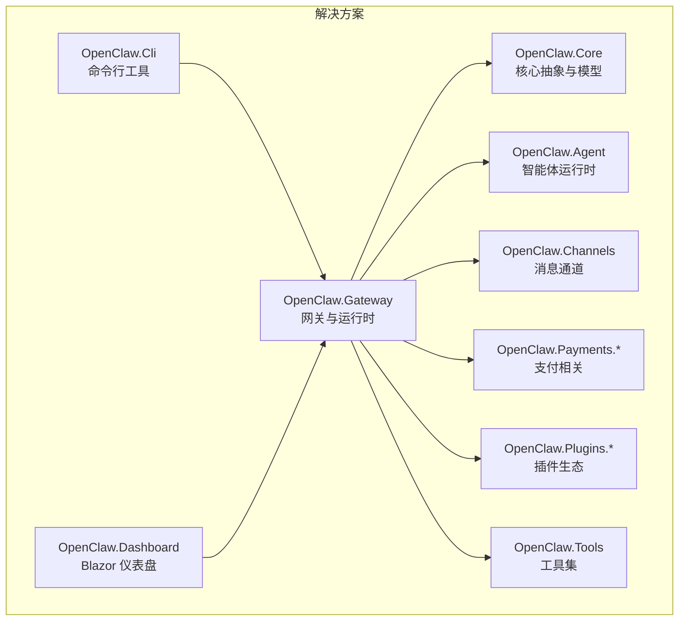
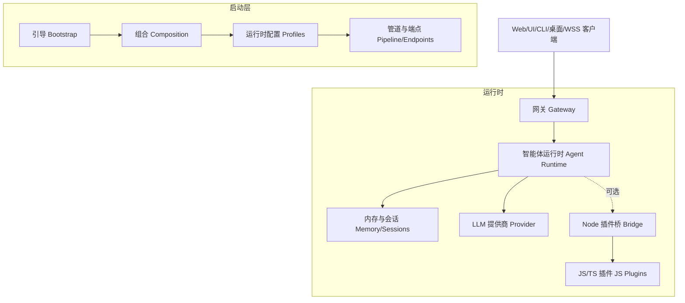
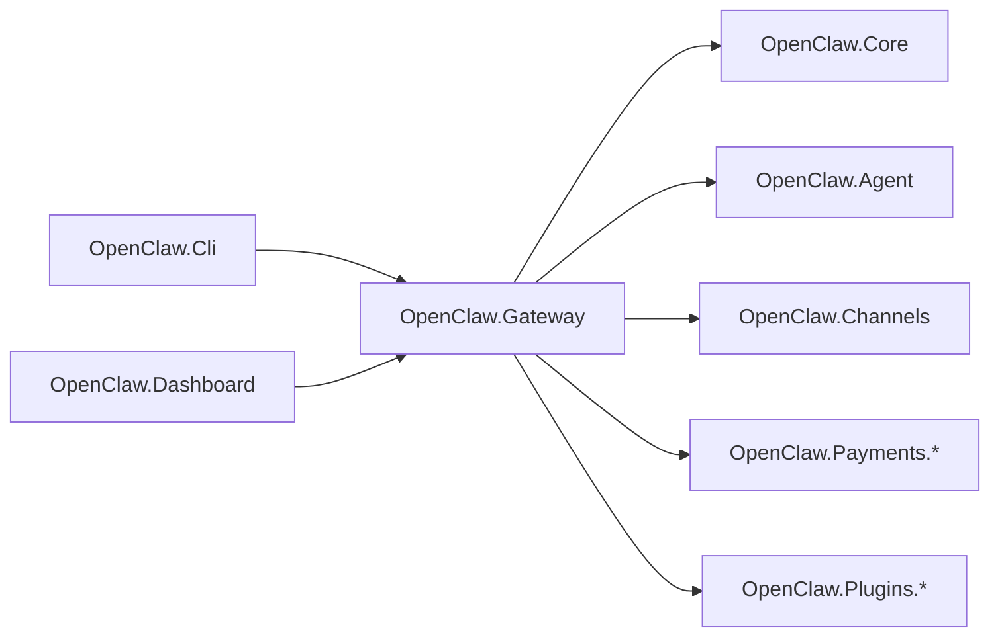

# 环境搭建

<cite>
**本文档引用的文件**
- [README.md](file://README.md)
- [QUICKSTART.md](file://QUICKSTART.md)
- [COMPATIBILITY.md](file://COMPATIBILITY.md)
- [Directory.Build.props](file://Directory.Build.props)
- [OpenClaw.Gateway.csproj](file://src/OpenClaw.Gateway/OpenClaw.Gateway.csproj)
- [appsettings.json](file://src/OpenClaw.Gateway/appsettings.json)
- [appsettings.Production.json](file://src/OpenClaw.Gateway/appsettings.Production.json)
- [Dockerfile](file://Dockerfile)
- [docker-compose.yml](file://docker-compose.yml)
- [OpenClaw.Net.slnx](file://OpenClaw.Net.slnx)
- [appsettings.json](file://Kingcrab.AppHost/appsettings.json)
- [appsettings.Development.json](file://Kingcrab.AppHost/appsettings.Development.json)
</cite>

## 目录
1. [简介](#简介)
2. [项目结构](#项目结构)
3. [核心组件](#核心组件)
4. [架构总览](#架构总览)
5. [详细组件分析](#详细组件分析)
6. [依赖关系分析](#依赖关系分析)
7. [性能考虑](#性能考虑)
8. [故障排查指南](#故障排查指南)
9. [结论](#结论)
10. [附录](#附录)

## 简介
本指南面向开发者、测试工程师与运维人员，提供从零开始搭建 OpenClaw.NET 开发、测试与生产环境的完整流程。内容覆盖 .NET SDK 安装、依赖项配置、本地开发工具设置、环境变量配置、数据库与缓存初始化、插件与通道配置、容器化部署与反向代理、以及跨操作系统兼容性要点。

## 项目结构
项目采用多项目解决方案组织，核心运行时与网关位于 src/OpenClaw.Gateway，配套有 CLI、桌面客户端、仪表盘、支付、插件与工具集等模块。根目录提供 Dockerfile 与 docker-compose.yml 支持容器化部署，并通过 Aspire AppHost 提供本地编排能力。

图表来源
- [OpenClaw.Net.slnx:1-43](file://OpenClaw.Net.slnx#L1-L43)
- [OpenClaw.Gateway.csproj:22-47](file://src/OpenClaw.Gateway/OpenClaw.Gateway.csproj#L22-L47)

章节来源
- [OpenClaw.Net.slnx:1-43](file://OpenClaw.Net.slnx#L1-L43)
- [README.md:31-670](file://README.md#L31-L670)

## 核心组件
- 网关与运行时：负责 HTTP/WebSocket/事件总线接入、认证授权、策略控制、会话与记忆、工具执行、插件桥接与 MCP、可观测性与健康检查。
- 插件系统：支持 JS/TS 插件通过 Node 桥接，以及 JIT-only 的原生动态插件；AOT/JIT 运行模式决定可用能力边界。
- 记忆与会话：SQLite 存储会话历史与记忆笔记，支持检索、归档与压缩。
- 通道与集成：Telegram、Twilio、WhatsApp、Teams、Slack、Discord、飞书、企业微信等。
- 客户端：浏览器 UI、CLI、Avalonia 桌面应用、Blazor WASM 仪表盘。
- 安全与合规：令牌、CORS、转发头信任、危险能力限制、公开绑定硬性加固选项。

章节来源
- [README.md:198-246](file://README.md#L198-L246)
- [COMPATIBILITY.md:1-119](file://COMPATIBILITY.md#L1-L119)
- [appsettings.json:1-908](file://src/OpenClaw.Gateway/appsettings.json#L1-L908)

## 架构总览
下图展示启动与运行阶段的分层结构，以及客户端与网关之间的交互路径。

图表来源
- [README.md:145-196](file://README.md#L145-L196)
- [appsettings.json:1-908](file://src/OpenClaw.Gateway/appsettings.json#L1-L908)

章节来源
- [README.md:145-196](file://README.md#L145-L196)

## 详细组件分析

### 开发环境搭建（Windows/macOS/Linux）
- 安装 .NET 10 SDK
  - 依据项目属性与目标框架，开发与构建均基于 .NET 10。
  - 参考：[Directory.Build.props:1-41](file://Directory.Build.props#L1-L41)
- 安装 Node.js（可选，启用 JS/TS 插件）
  - 若需要 TS 插件能力，需安装 Node.js 20+ 并确保 jiti 可用。
  - 参考：[QUICKSTART.md:5-9](file://QUICKSTART.md#L5-L9)
- 安装 IDE/编辑器
  - Visual Studio 2022+ 或 VS Code + C# 扩展，建议启用 EditorConfig、格式化与警告即错误。
- 克隆仓库与还原包
  - 使用解决方案文件打开工程，先还原 NuGet 包，再进行构建或运行。
  - 参考：[OpenClaw.Net.slnx:1-43](file://OpenClaw.Net.slnx#L1-L43)

章节来源
- [Directory.Build.props:1-41](file://Directory.Build.props#L1-L41)
- [QUICKSTART.md:5-9](file://QUICKSTART.md#L5-L9)
- [OpenClaw.Net.slnx:1-43](file://OpenClaw.Net.slnx#L1-L43)

### 测试环境搭建
- 启动参数与诊断
  - 使用 doctor 模式验证配置与兼容性，再启动网关。
  - 参考：[QUICKSTART.md:41-46](file://QUICKSTART.md#L41-L46)
- 环境变量
  - 设置模型密钥与可选工作空间目录，必要时选择运行模式（aot/jit/auto）。
  - 参考：[QUICKSTART.md:12-39](file://QUICKSTART.md#L12-L39)
- 本地客户端
  - 浏览器 UI、CLI、桌面应用均可在本地联调。
  - 参考：[QUICKSTART.md:61-85](file://QUICKSTART.md#L61-L85)

章节来源
- [QUICKSTART.md:12-85](file://QUICKSTART.md#L12-L85)

### 生产环境搭建
- 容器化部署
  - 使用 Dockerfile 构建单文件 NativeAOT 可执行文件，运行阶段基于精简运行时镜像。
  - 参考：[Dockerfile:1-59](file://Dockerfile#L1-L59)
- docker-compose 编排
  - 提供可选的 Caddy 反代与自动 TLS，以及网关健康检查。
  - 参考：[docker-compose.yml:1-68](file://docker-compose.yml#L1-L68)
- 生产配置
  - 使用生产配置文件收紧工具权限、限制插件桥接、启用信任转发头与速率限制。
  - 参考：[appsettings.Production.json:1-65](file://src/OpenClaw.Gateway/appsettings.Production.json#L1-L65)

章节来源
- [Dockerfile:1-59](file://Dockerfile#L1-L59)
- [docker-compose.yml:1-68](file://docker-compose.yml#L1-L68)
- [appsettings.Production.json:1-65](file://src/OpenClaw.Gateway/appsettings.Production.json#L1-L65)

### 环境变量配置
- 必填
  - MODEL_PROVIDER_KEY：模型提供商密钥
  - OPENCLAW_AUTH_TOKEN：非回环绑定时必需的访问令牌
- 可选
  - OPENCLAW_WORKSPACE：工作空间目录（文件工具与工作空间技能）
  - OpenClaw__Runtime__Mode：运行模式（aot/jit/auto）
  - OpenClaw__BindAddress / OpenClaw__Port：绑定地址与端口
  - OpenClaw__Plugins__Enabled：是否启用插件桥接（生产默认关闭）
- 参考
  - [QUICKSTART.md:12-39](file://QUICKSTART.md#L12-L39)
  - [docker-compose.yml:13-31](file://docker-compose.yml#L13-L31)
  - [Dockerfile:43-51](file://Dockerfile#L43-L51)

章节来源
- [QUICKSTART.md:12-39](file://QUICKSTART.md#L12-L39)
- [docker-compose.yml:13-31](file://docker-compose.yml#L13-L31)
- [Dockerfile:43-51](file://Dockerfile#L43-L51)

### 数据库与缓存初始化
- SQLite 记忆存储
  - 默认使用 SQLite 存储会话与记忆，数据库路径与 FTS/向量支持可在配置中调整。
  - 参考：[appsettings.json:49-81](file://src/OpenClaw.Gateway/appsettings.json#L49-L81)
- 记忆归档与保留
  - 支持后台清理与归档，可配置保留周期与扫描间隔。
  - 参考：[appsettings.json:66-76](file://src/OpenClaw.Gateway/appsettings.json#L66-L76)
- 媒体缓存
  - 多模态媒体缓存路径可配置。
  - 参考：[appsettings.json:329-361](file://src/OpenClaw.Gateway/appsettings.json#L329-L361)

章节来源
- [appsettings.json:49-81](file://src/OpenClaw.Gateway/appsettings.json#L49-L81)
- [appsettings.json:66-76](file://src/OpenClaw.Gateway/appsettings.json#L66-L76)
- [appsettings.json:329-361](file://src/OpenClaw.Gateway/appsettings.json#L329-L361)

### 缓存服务配置
- 提示词缓存（Prompt Caching）
  - 可启用并配置方言、保留策略、预热与追踪。
  - 参考：[appsettings.json:35-43](file://src/OpenClaw.Gateway/appsettings.json#L35-L43)
- 媒体缓存
  - 多模态媒体缓存路径与 TTL。
  - 参考：[appsettings.json:329-361](file://src/OpenClaw.Gateway/appsettings.json#L329-L361)

章节来源
- [appsettings.json:35-43](file://src/OpenClaw.Gateway/appsettings.json#L35-L43)
- [appsettings.json:329-361](file://src/OpenClaw.Gateway/appsettings.json#L329-L361)

### 插件与通道配置
- 插件桥接
  - 支持 JS/TS 插件通过 Node 桥接，传输方式可选 stdio/socket/hybrid。
  - 参考：[COMPATIBILITY.md:11-30](file://COMPATIBILITY.md#L11-L30)
- 原生动态插件（JIT-only）
  - 在 JIT 模式下支持 .NET 原生动态插件，AOT 模式拒绝加载。
  - 参考：[COMPATIBILITY.md:40-47](file://COMPATIBILITY.md#L40-L47)
- 通道配置
  - Telegram、Twilio、WhatsApp、Teams、Slack、Discord、飞书、企业微信等通道的启用、鉴权与 Webhook。
  - 参考：[appsettings.json:362-533](file://src/OpenClaw.Gateway/appsettings.json#L362-L533)

章节来源
- [COMPATIBILITY.md:11-47](file://COMPATIBILITY.md#L11-L47)
- [appsettings.json:362-533](file://src/OpenClaw.Gateway/appsettings.json#L362-L533)

### 运行模式与兼容性
- 运行模式
  - aot：低内存、裁剪友好；jit：扩展兼容性；auto：根据运行时能力自动选择。
  - 参考：[README.md:60-70](file://README.md#L60-L70)
- 插件兼容矩阵
  - AOT/JIT 能力差异明确，不支持的表面会以明确诊断失败。
  - 参考：[COMPATIBILITY.md:11-30](file://COMPATIBILITY.md#L11-L30)

章节来源
- [README.md:60-70](file://README.md#L60-L70)
- [COMPATIBILITY.md:11-30](file://COMPATIBILITY.md#L11-L30)

### 安全加固与生产硬核清单
- 公开绑定强制加固
  - 未显式允许的危险设置（如通配根、允许 shell、启用插件桥、不校验签名等）将阻止启动。
  - 参考：[README.md:300-313](file://README.md#L300-L313)
- 生产安全建议
  - 强随机令牌、TLS（反向代理或 Kestrel）、CORS 与转发头信任、速率限制、监控健康与指标。
  - 参考：[README.md:517-529](file://README.md#L517-L529)

章节来源
- [README.md:300-313](file://README.md#L300-L313)
- [README.md:517-529](file://README.md#L517-L529)

### 跨操作系统兼容性
- .NET 10 目标框架与 NativeAOT
  - 项目针对 net10.0，使用 NativeAOT 发布，注意 AOT 裁剪对反射与动态特性的影响。
  - 参考：[Directory.Build.props:1-41](file://Directory.Build.props#L1-L41)
- Playwright 与 AOT
  - Playwright 使用深度反射，AOT 环境下需谨慎使用或在 JIT 模式下运行。
  - 参考：[OpenClaw.Gateway.csproj:18-24](file://src/OpenClaw.Gateway/OpenClaw.Gateway.csproj#L18-L24)
- Docker 多平台
  - Dockerfile 与 docker-compose 支持多平台构建与运行。
  - 参考：[Dockerfile:1-59](file://Dockerfile#L1-L59)，[docker-compose.yml:130-156](file://docker-compose.yml#L130-L156)

章节来源
- [Directory.Build.props:1-41](file://Directory.Build.props#L1-L41)
- [OpenClaw.Gateway.csproj:18-24](file://src/OpenClaw.Gateway/OpenClaw.Gateway.csproj#L18-L24)
- [Dockerfile:1-59](file://Dockerfile#L1-L59)
- [docker-compose.yml:130-156](file://docker-compose.yml#L130-L156)

## 依赖关系分析
- 组件耦合
  - 网关对核心库、智能体运行时、通道与支付模块存在直接引用；CLI、桌面与仪表盘通过网关暴露的接口进行交互。
- 外部依赖
  - LLM 提供商 SDK、OpenTelemetry、MCP、A2A、Microsoft.Agents.AI 等。
- 运行时选择
  - 通过运行模式与可选的 OpenSandbox 构建开关影响功能集。

图表来源
- [OpenClaw.Gateway.csproj:22-47](file://src/OpenClaw.Gateway/OpenClaw.Gateway.csproj#L22-L47)

章节来源
- [OpenClaw.Gateway.csproj:22-47](file://src/OpenClaw.Gateway/OpenClaw.Gateway.csproj#L22-L47)

## 性能考虑
- NativeAOT 发布
  - 单文件发布、裁剪优化，适合边缘与资源受限环境。
- 运行模式选择
  - AOT 更小内存占用；JIT 兼容性更好但内存更高。
- 工具与插件
  - 对高风险工具建议使用沙箱执行，避免主机直连。
- 观测性
  - 启用 OpenTelemetry 采集指标与追踪，结合健康与指标端点进行监控。

[本节为通用指导，无需特定文件来源]

## 故障排查指南
- 启动失败（公开绑定）
  - 若绑定到非回环地址，需设置认证令牌并遵循安全加固选项。
  - 参考：[README.md:277-313](file://README.md#L277-L313)
- 插件加载失败
  - 检查运行模式与插件能力匹配、Node 桥接与 jiti 是否就绪、配置 schema 是否受支持。
  - 参考：[COMPATIBILITY.md:31-91](file://COMPATIBILITY.md#L31-L91)
- 记忆与会话异常
  - 查看 SQLite 路径、FTS/向量配置与归档路径权限。
  - 参考：[appsettings.json:49-81](file://src/OpenClaw.Gateway/appsettings.json#L49-L81)
- 容器健康检查
  - docker-compose 提供健康检查命令，定位启动问题。
  - 参考：[docker-compose.yml:37-42](file://docker-compose.yml#L37-L42)

章节来源
- [README.md:277-313](file://README.md#L277-L313)
- [COMPATIBILITY.md:31-91](file://COMPATIBILITY.md#L31-L91)
- [appsettings.json:49-81](file://src/OpenClaw.Gateway/appsettings.json#L49-L81)
- [docker-compose.yml:37-42](file://docker-compose.yml#L37-L42)

## 结论
通过本指南，您可以在 Windows、macOS 与 Linux 上完成 OpenClaw.NET 的开发、测试与生产部署。建议优先使用 AOT 模式进行生产部署，仅在确需扩展兼容性时启用 JIT；严格遵循安全加固清单，合理配置插件与通道，并利用容器化与反向代理实现高可用与高安全性。

[本节为总结，无需特定文件来源]

## 附录

### 环境变量一览
- 必填
  - MODEL_PROVIDER_KEY：模型提供商密钥
  - OPENCLAW_AUTH_TOKEN：网关访问令牌（非回环绑定时必需）
- 可选
  - OPENCLAW_WORKSPACE：工作空间目录
  - OpenClaw__Runtime__Mode：aot/jit/auto
  - OpenClaw__BindAddress / OpenClaw__Port：绑定地址与端口
  - OpenClaw__Plugins__Enabled：启用插件桥接（生产默认关闭）

章节来源
- [QUICKSTART.md:12-39](file://QUICKSTART.md#L12-L39)
- [docker-compose.yml:13-31](file://docker-compose.yml#L13-L31)
- [Dockerfile:43-51](file://Dockerfile#L43-L51)

### 关键配置文件位置
- 网关默认配置：src/OpenClaw.Gateway/appsettings.json
- 生产配置：src/OpenClaw.Gateway/appsettings.Production.json
- Aspire AppHost 日志配置：Kingcrab.AppHost/appsettings.json 与 appsettings.Development.json

章节来源
- [appsettings.json:1-908](file://src/OpenClaw.Gateway/appsettings.json#L1-L908)
- [appsettings.Production.json:1-65](file://src/OpenClaw.Gateway/appsettings.Production.json#L1-L65)
- [appsettings.json:1-10](file://Kingcrab.AppHost/appsettings.json#L1-L10)
- [appsettings.Development.json:1-9](file://Kingcrab.AppHost/appsettings.Development.json#L1-L9)